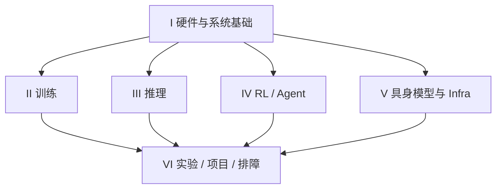
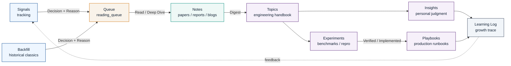
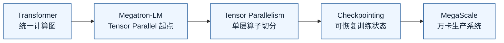
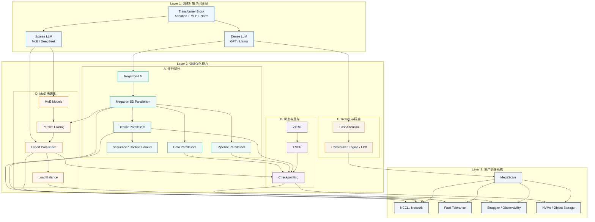
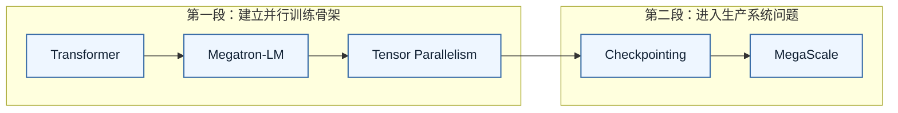

# Knowledge Graph

[首页](README.md) · [最近更新](README.md#recent-updates) · [材料索引](research/MASTER_READING_LIST.md) · [研究流程](research/README.md)

这里维护知识依赖，不再维护第二份最新扫描列表或全局 P0 排名。当前方向看首页，实际阅读决策看[统一队列](research/reading_queue/README.md)。

按阶段学习入口：[具身六阶段（当前重点）](embodied-infra/roadmap.md) · [GPU Systems](systems/roadmaps/gpu-systems.md) · [Distributed Systems](systems/roadmaps/distributed-systems.md) · [Inference](inference-infra/roadmap.md) · [Agentic RL](rl-infra/roadmap.md)。训练基础复用 [Part II](training-infra/README.md)，各路线不重复维护正文。

## 全库关系：共享基础，按问题进入

箭头表示知识复用和验证关系，不是必须依次完成的学习阶段。具身的数据、模型、动作与评估不能缩成 RL 的子模块；推理也不只为 rollout 服务。面试是这些知识的按需表达视图，入口独立放 [Part VII](interview/README.md)。

| 要理解的关系 | 从哪里读 | 如何验证／应用 |
|---|---|---|
| 模型状态 → 参数分片 → 通信 → 恢复 | [FSDP](training-infra/topics/fsdp.md) ↔ [NCCL](systems/topics/nccl.md) ↔ [checkpoint](training-infra/topics/checkpointing.md) | [A100 E01／E02／E05](practice/experiments/a100_fsdp_io_lab.md)，未执行 |
| 硬件路径 → Host/I/O → GPU 执行 | [系统基础选读](systems/README.md) ↔ [GPU / Roofline](systems/topics/transformer_engine.md#gpu-execution) | [E00／E04](practice/experiments/a100_fsdp_io_lab.md)，新硬件/I/O 全文待建设 |
| 推理执行 → 服务吞吐／尾延迟 → rollout 供给 | [推理入口](inference-infra/README.md) ↔ [RL 调度](rl-infra/topics/agentic_rl.md#gateway-streaming-refill) | E07／E08；不能把 decode 局部加速等同端到端收益 |
| 具身模型 → episode → batch → 执行反馈 | [模型入门大纲](docs/superpowers/specs/2026-09-18-embodied-models-primer-design.md) ↔ [具身系统蓝图](embodied-infra/topics/agentic_for_embodied.md) | [具身学习路径](embodied-infra/README.md)，primer、数据正文和真机验证均待建设 |
| 外部证据 → 工程判断 → 可证伪实验 | [研究流程](research/README.md) ↔ [实验与项目](practice/README.md) | 学习状态与实测结果分别记录 |

下面保留训练基础图、已建立的双向索引与研究关联，供按需深入；它们不取代以上跨领域视图。

## Research OS 工作流

这张图回答的是：这个仓库不是静态资料库，而是人和 AI Agent 协同维护的研究操作系统。每条新信息最终都要流向工程判断、实验验证或生产排障资产。

状态流转建议：

- `NEW`：刚发现，还没有判断价值。
- `READING`：已经进入阅读队列。
- `SUMMARIZED`：形成 paper / report / blog note。
- `DIGESTED`：已经沉淀进 topic 或 insight。
- `VERIFIED`：通过 experiment 验证。
- `IMPLEMENTED`：进入真实工程实践。
- `OBSOLETE`：已过时或被新系统替代。

外部进展统一从[研究雷达](research/tracking/README.md)和[月度复盘](research/tracking/monthly_reviews.md)进入；当前选择见队列。知识依赖的例子：[RL 状态边界](rl-infra/topics/agentic_rl.md#rl-state-boundaries) → [故障注入计划](practice/experiments/rl_state_boundaries.md)，实验尚未执行。

## 第一轮主线

这是保留的**训练基础路线**，回答第一次建立训练系统地图时应抓哪些支点，不是全库当前待办。当前具身、FSDP/I/O 学习从上方跨领域入口进入。

这条线先不要再加节点。它的价值是“少而清楚”：先理解 Transformer block，接着看 Megatron 怎么切单层算子，再看 TP 引出的通信和拓扑问题，然后看 checkpoint 如何让训练可恢复，最后用 MegaScale 把这些问题放到万卡生产系统里。

## 能力分区

这张图回答的是：第一轮主线展开后，训练 infra 能力如何分层。布局从上到下读：模型计算图在上面，中间是四类训练优化能力，底部统一收束到生产系统能力。

读这张图时不要从上到下硬背。它的逻辑是：

- **Layer 1 是训练对象**：先知道 Transformer block 里有哪些算子，dense 和 sparse 模型分别带来什么训练负载。
- **Layer 2 是优化手段**：并行切分解决“怎么分到多卡”，状态与显存解决“怎么放得下和恢复”，Kernel/精度解决“怎么更快地算”，MoE 稀疏化解决“怎么扩大总参数但控制激活计算”。
- **Layer 3 是生产系统**：当这些技术进入千卡/万卡规模，NCCL、checkpoint、straggler、存储和容错成为主要矛盾。
- **跨层箭头只保留关键依赖**：TP/EP 会打到网络，TP/PP/DP/EP 会影响 checkpoint，checkpoint 会影响 fault tolerance 和存储，MoE load balance 会影响 straggler。

## 推荐阅读路径

第一轮不要贪多，分两段读。

对应文档：

- [Transformer](research/papers/transformer.md)
- [Megatron-LM](research/papers/megatron_lm.md)
- [Megatron 5D 并行](training-infra/topics/distributed_training.md)
- [Tensor Parallelism](training-infra/topics/tensor_parallelism.md)
- [MoE 与 Parallel Folding](training-infra/topics/moe.md#parallel-folding)
- [NCCL 与通信算子](systems/topics/nccl.md)
- [Checkpointing](training-infra/topics/checkpointing.md)
- [MegaScale](research/tech_reports/megascale.md)

## 双向索引

这里保留文字索引，不再强行画进主图。图负责建立方向，索引负责查关系。

- [面试主文档](private_resume/2026-08-llm-infra-interview-prep.md#interview-console) ↔ [Coding 题单](private_resume/2026-09-interview-coding.md#coding-top) ↔ [带父指针 LCA](private_resume/2026-09-interview-coding.md#coding-03)
- [通用编程基础](private_resume/2026-08-llm-infra-interview-prep.md#programming-basics) ↔ [LRU 缓存 get / put：本人现场题目](private_resume/2026-09-interview-coding.md#coding-04)
- [主文档通用基础 Part：GPU / PyTorch / 低精度](private_resume/2026-08-llm-infra-interview-prep.md#part-foundations) ↔ [FP8 原理与验证](systems/topics/fp8.md#precision-validation) ↔ [GPU 执行 / 编译 / Roofline](systems/topics/transformer_engine.md#gpu-execution) ↔ [Coding 梯度与性能练习](private_resume/2026-09-interview-coding.md#coding-05)。技术答案只在通用题库维护；[公司资料](private_resume/2026-09-meshy-ml-system-interview-prep.md#meshy-public-work)独立保存。
- [视频 / 3D 生成通用题](private_resume/2026-08-llm-infra-interview-prep.md#gen-01) ↔ [Meshy T2 公开工作](research/tracking/backfill/2026-07.md#meshy-t2) ↔ [P1 全文阅读](research/reading_queue/P1.md#meshy-t2-reading)，区分原理学习、公开架构与个人交付证据。

- [Transformer](research/papers/transformer.md) ↔ [Tensor Parallelism](training-infra/topics/tensor_parallelism.md) ↔ [Megatron-LM](research/papers/megatron_lm.md)
- [Megatron-LM](research/papers/megatron_lm.md) ↔ [5D 并行](training-infra/topics/distributed_training.md) ↔ [DP](training-infra/topics/data_parallelism.md) / [TP](training-infra/topics/tensor_parallelism.md) / [PP](training-infra/topics/pipeline_parallelism.md) / [CP](training-infra/topics/context_parallelism.md) / [MoE](training-infra/topics/moe.md)
- [5D 并行](training-infra/topics/distributed_training.md) ↔ [Parallel Folding](training-infra/topics/moe.md#parallel-folding) ↔ [NCCL](systems/topics/nccl.md)
- [EP 的代价与解决方案：主文档速查](private_resume/2026-08-llm-infra-interview-prep.md#megatron-06) ↔ [MoE 通用面试题](interview/topics/moe.md#ep-tradeoffs) ↔ [Parallel Folding](training-infra/topics/moe.md#parallel-folding)
- [Tensor Parallelism](training-infra/topics/tensor_parallelism.md) ↔ [NCCL](systems/topics/nccl.md) ↔ [MegaScale](research/tech_reports/megascale.md)
- [TP 的 dX/dW 与 SP 通信推导](training-infra/topics/tensor_parallelism.md#tp-collective-derivation) ↔ [Ring AllReduce 四卡逐步执行](systems/topics/nccl.md#ring-allreduce) ↔ [主文档 TP 速答](private_resume/2026-08-llm-infra-interview-prep.md#megatron-02)
- [Tensor Parallelism](training-infra/topics/tensor_parallelism.md) ↔ [Sequence Parallelism](training-infra/topics/sequence_parallelism.md) ↔ [Context Parallelism](training-infra/topics/context_parallelism.md)
- [5D 拓扑选择](training-infra/topics/distributed_training.md) ↔ [Hierarchical CP：机内 A2A / 机间 Ring](training-infra/topics/context_parallelism.md#hierarchical-cp)
- [Long-context Training](training-infra/topics/long_context_training.md) ↔ [Context Parallelism](training-infra/topics/context_parallelism.md) ↔ [FlashAttention](systems/topics/flashattention.md)
- [选择性重计算：原理与参数](training-infra/topics/long_context_training.md#selective-recompute) ↔ [显存账本与面试速答](private_resume/2026-08-llm-infra-interview-prep.md#megatron-selective-recompute) ↔ [Transformer Engine / Fusion](systems/topics/transformer_engine.md#fusion-map)
- [Long-context Training](training-infra/topics/long_context_training.md) ↔ [Checkpointing](training-infra/topics/checkpointing.md) ↔ [Agentic RL](rl-infra/topics/agentic_rl.md)
- [CompactionRL](research/papers/compactionrl.md) ↔ [Long-context Training](training-infra/topics/long_context_training.md) ↔ [Agentic RL](rl-infra/topics/agentic_rl.md)
- [ZeRO](research/papers/zero.md) ↔ [Checkpointing](training-infra/topics/checkpointing.md) ↔ [FSDP](training-infra/topics/fsdp.md)
- [Megatron 5D 并行](training-infra/topics/distributed_training.md) ↔ [FSDP / ZeRO / Bridge 选型](training-infra/topics/fsdp.md) ↔ [verl / AReaL 架构选型](rl-infra/topics/rl_framework_selection.md)
- [Checkpointing](training-infra/topics/checkpointing.md) ↔ [Fault Tolerance](training-infra/topics/fault_tolerance.md) ↔ [MegaScale](research/tech_reports/megascale.md)
- [通用 Infra 与生产排障](private_resume/2026-08-llm-infra-interview-prep.md#part-v) ↔ [稀疏 Embedding / PS](private_resume/2026-08-llm-infra-interview-prep.md#infra-10) ↔ [数据 pipeline](private_resume/2026-08-llm-infra-interview-prep.md#infra-11) ↔ [Checkpointing](training-infra/topics/checkpointing.md)
- [RL 框架架构与后训练](private_resume/2026-08-llm-infra-interview-prep.md#part-iii) ↔ [框架选型](rl-infra/topics/rl_framework_selection.md) ↔ [Agentic RL](rl-infra/topics/agentic_rl.md)；主问题串联 [DPO](private_resume/2026-08-llm-infra-interview-prep.md#dpo-01)、[Reward/PPO 迁移](private_resume/2026-08-llm-infra-interview-prep.md#verl-07)与[训推布局协同](private_resume/2026-08-llm-infra-interview-prep.md#verl-03)。
- [FlashAttention](research/papers/flashattention.md) ↔ [FlashAttention Topic](systems/topics/flashattention.md) ↔ [Transformer Engine](systems/topics/transformer_engine.md)
- [Long-context Training](training-infra/topics/long_context_training.md) ↔ [CP-local logits](training-infra/topics/long_context_training.md#cp-local-logits) ↔ [Transformer Engine / Fusion](systems/topics/transformer_engine.md#fusion-map)
- [Agentic RL](rl-infra/topics/agentic_rl.md) ↔ [CUDA Graph decode](rl-infra/topics/agentic_rl.md#cuda-graph-decode) ↔ [Rollout 供给、session 容量与版本预算](rl-infra/topics/agentic_rl.md#gateway-streaming-refill)
- [Gateway 源码机制与版本边界](rl-infra/topics/agentic_rl.md#project-gateway-ownership) ↔ [两层路由与 engine 负载选路](rl-infra/topics/agentic_rl.md#gateway-engine-routing) ↔ [面试口述与 ownership](private_resume/2026-08-llm-infra-interview-prep.md#areal-09)
- [DeepSeek-V3](research/tech_reports/deepseek_v3.md) ↔ [MoE](training-infra/topics/moe.md) ↔ [FP8](systems/topics/fp8.md)
- [Llama 3](research/tech_reports/llama3.md) ↔ [MegaScale](research/tech_reports/megascale.md) ↔ [Fault Tolerance](training-infra/topics/fault_tolerance.md)
- [Agentic RL](rl-infra/topics/agentic_rl.md) ↔ [Rollout Latency](practice/playbooks/rollout_latency.md) ↔ [DeepSeek-R1](research/tech_reports/deepseek_r1.md)
- [Agentic RL](rl-infra/topics/agentic_rl.md) ↔ [verl / AReaL 架构选型](rl-infra/topics/rl_framework_selection.md) ↔ HybridFlow / Async Agent Services
- [美团 Fully Async 历史实践](research/tracking/backfill/2026-01.md#meituan-fully-async) ↔ [流式调度、partial rollout 与陈旧度预算](rl-infra/topics/agentic_rl.md#meituan-fully-async-practice) ↔ [主文档 Fully Async 专题：四张原图、配置题与实验表](private_resume/2026-08-llm-infra-interview-prep.md#fully-async-study)
- [Agentic RL](rl-infra/topics/agentic_rl.md) ↔ [OPD / MOPD](rl-infra/topics/mopd.md) ↔ Teacher Prefill / Domain Routing
- [Agentic RL](rl-infra/topics/agentic_rl.md) ↔ [Agentic for Embodied](embodied-infra/topics/agentic_for_embodied.md) ↔ Simulation / Robot Runtime / Safety
- [Agentic for Embodied](embodied-infra/topics/agentic_for_embodied.md) ↔ [Distributed Training](training-infra/topics/distributed_training.md) ↔ [Fault Tolerance](training-infra/topics/fault_tolerance.md)
- [Agentic for Embodied](embodied-infra/topics/agentic_for_embodied.md) ↔ [Long-context Training](training-infra/topics/long_context_training.md) ↔ Planner Memory / Multimodal Trajectory
- [Agentic RL](rl-infra/topics/agentic_rl.md) ↔ [Q3 Long-context Agentic RL Project](practice/projects/2026-q3-long-context-agentic-rl/README.md) ↔ [R8b Performance Dashboard](practice/projects/2026-q3-long-context-agentic-rl/dashboard.md)
- [CompactionRL](research/papers/compactionrl.md) ↔ [Rollout Latency](practice/playbooks/rollout_latency.md) ↔ [Trajectory Store / Context Budget]
- [Historical Backfill](research/tracking/historical_backfill.md) ↔ [P0 Queue](research/reading_queue/P0.md) ↔ [Agentic RL Insight](research/insights/001_agentic_rl_will_change_training_infra.md)
- [Historical Backfill](research/tracking/historical_backfill.md) ↔ [P1 Queue](research/reading_queue/P1.md) ↔ [Agentic RL](rl-infra/topics/agentic_rl.md)
- [Frontier Scan](research/tracking/frontier_scan_template.md) ↔ [Scan Log](research/tracking/scan_log.md) ↔ [Reading Queue](research/reading_queue/README.md)
- [Monthly Signal Template](research/tracking/monthly_signal_report_template.md) ↔ [Historical Backfill](research/tracking/historical_backfill.md) ↔ [Reading Queue](research/reading_queue/README.md)

## 工程博客索引

- [GLM Infra Agent](research/engineering_blogs/zhipu/glm_infra_agent_recursive_self_improvement.md) ↔ [Agentic RL](rl-infra/topics/agentic_rl.md) ↔ [P1](research/reading_queue/P1.md)：生产披露、可检查机制与待执行实验。

`engineering_blogs/` 是第三类一等材料来源：它不按论文历史组织，而按厂商工程栈和训练系统能力组织。

- [NVIDIA Engineering Blogs](research/engineering_blogs/nvidia/README.md) ↔ [Transformer Engine](systems/topics/transformer_engine.md) ↔ [FP8](systems/topics/fp8.md) ↔ [NCCL](systems/topics/nccl.md)
- [Microsoft Engineering Blogs](research/engineering_blogs/microsoft/README.md) ↔ [ZeRO](training-infra/topics/zero.md) ↔ [FSDP](training-infra/topics/fsdp.md) ↔ [Checkpointing](training-infra/topics/checkpointing.md)
- [Meta Engineering Blogs](research/engineering_blogs/meta/README.md) ↔ [Llama 3](research/tech_reports/llama3.md) ↔ [FSDP](training-infra/topics/fsdp.md)
- [DeepSeek Engineering Blogs](research/engineering_blogs/deepseek/README.md) ↔ [DeepSeek-V3](research/tech_reports/deepseek_v3.md) ↔ [MoE](training-infra/topics/moe.md) ↔ [FP8](systems/topics/fp8.md)
- [Google Engineering Blogs](research/engineering_blogs/google/README.md) ↔ [Gemini](research/tech_reports/gemini.md) ↔ [Distributed Training](training-infra/topics/distributed_training.md)

## 下一步补图

- 为 [Tensor Parallelism](training-infra/topics/tensor_parallelism.md) 单独画 Column/Row Parallel 数据流图。
- 为 [Checkpointing](training-infra/topics/checkpointing.md) 单独画 save / async upload / recovery 流程图。
- 为 [NCCL](systems/topics/nccl.md) 单独画 topology / collective / overlap 排障图。

## 2026-09：RL 状态边界学习闭环

[MiMo-V2.6 / CodeMidas 分享报告](research/tech_reports/mimo_v26.md) ↔ [环境与实际消费配比](rl-infra/topics/agentic_rl.md#mimo-v26-environment-contract) ↔ [环境验收和 Sample Mixer 实验](practice/experiments/mimo_v26_environment_and_mixer.md) ↔ [可信样本供给判断](research/insights/001_agentic_rl_will_change_training_infra.md#mimo-v26-evidence)。来源与阅读状态见 [定向记录](research/tracking/agentic_rl.md#mimo-v26-research) / [P1](research/reading_queue/P1.md#mimo-v26-reading)；未运行实验。

2026-10-08 新关系：[GAGAR 独立质量审核](research/tech_reports/mimo_v26.md#25-gagar控制实验与独立质量审核) → advantage 分支不变量；[MOPD 发布后修复](research/tech_reports/mimo_v26.md#51-工具调用重复与-mopd-修复) → [release 过程行为回归](practice/experiments/mimo_v26_environment_and_mixer.md#release-behavior)。[9 月材料补录](research/tracking/backfill/2026-09.md)记录来源与边界，非新一次全面扫描。

[MiMo 2025–2026 演进](research/tech_reports/mimo_v26.md#7-算法与基础设施的演进) → [经验生命周期与能力组合判断](research/insights/001_agentic_rl_will_change_training_infra.md#mimo-evolution-judgment) ↔ [MOPD 状态覆盖](rl-infra/topics/mopd.md#mimo-evolution-roles) ↔ [serving / rollout 独立计量](practice/experiments/mimo_v26_environment_and_mixer.md#evaluation-budget)。这是机制关系，不表示各代 checkpoint 直接继承或实验已验证。

[本轮信号](research/tracking/frontier_scan_2026-09-16.md) → [P1 阅读组合](research/reading_queue/P1.md#rl-state-boundaries-reading) → [Agentic RL 状态边界](rl-infra/topics/agentic_rl.md#rl-state-boundaries) → [故障注入验证计划](practice/experiments/rl_state_boundaries.md) → [9 月学习记录](research/learning_log/2026/2026-09.md)。

当前只完成来源核验与验证设计；没有运行故障注入，不能标记 VERIFIED。

- [2026-09-22 Frontier Scan](research/tracking/frontier_scan_2026-09-22.md)：DSec → agent/sandbox 恢复，Conduit → 经验数据面，FP8 RL → 数值反馈；接入 [P1](research/reading_queue/P1.md) 与 [RL 状态实验](practice/experiments/rl_state_boundaries.md)。

- [2026-09-22 GitHub 全面补扫](research/tracking/github_audit_2026-09-22.md)：闭合 GitHub 索引缺口；VLM CP/MTP、prefill workspace、KV lifecycle 与 release 验收，关联 [Agentic RL](rl-infra/topics/agentic_rl.md#rl-state-boundaries) 和 [实验](practice/experiments/rl_state_boundaries.md)。
