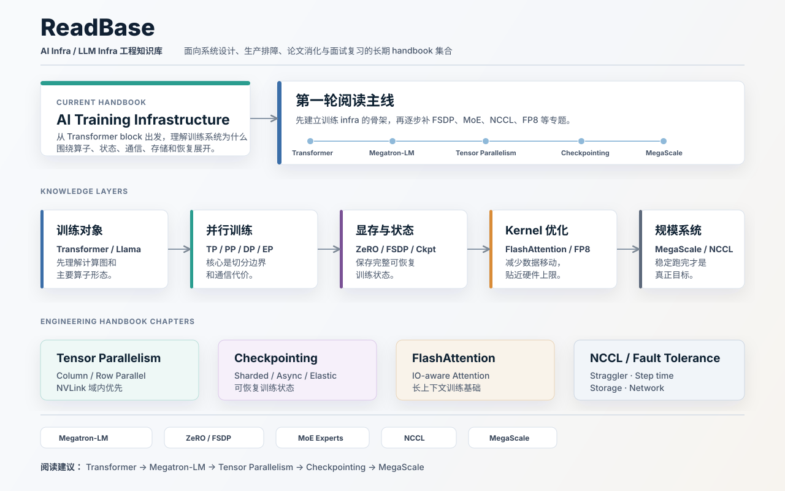

# ReadBase

ReadBase 是一个面向 Large-Scale AI Systems 的 Personal Research Operating System。

它不是论文收藏夹，也不是普通笔记仓库，而是一个由人和 AI Agent 长期协作维护的研究系统：持续输入 signals，形成 decisions，沉淀 topics，通过 experiments 验证，再转化为 playbooks 和 learning log。

**North Star:** Build a production-grade understanding of Large-Scale AI Systems through a human-AI maintained Personal Research Operating System.

## 知识地图



## 当前专题

| 专题 | 状态 | 入口 |
|---|---|---|
| Phase 1: Training Infrastructure | Ongoing | [training-infra-roadmap](training-infra-roadmap/README.md) |
| Phase 2: Inference Infrastructure | Planned | - |
| Phase 3: Agent Infrastructure | Planned | - |
| Phase 4: AI Engineering | Planned | - |
| Phase 5: Large-Scale AI Systems | Vision | - |

## 学习入口

- [30 天计划](training-infra-roadmap/roadmaps/30_day_plan.md)：恢复论文阅读习惯，每周两篇。
- [90 天计划](training-infra-roadmap/roadmaps/90_day_plan.md)：建立完整训练系统知识图谱。
- [一年计划](training-infra-roadmap/roadmaps/yearly_plan.md)：面向高级 AI Training Infra 工程师的长期路线。
- [面试手册](training-infra-roadmap/interview/tensor_parallelism.md)：从 Tensor Parallelism 开始建立可回答、可追问的面试表达。

## 推荐结构

当前采用“一个总仓库，多个专题手册”的结构：

```text
ReadBase/
  README.md
  training-infra-roadmap/
    README.md
    MASTER_READING_LIST.md
    KNOWLEDGE_GRAPH.md
    papers/
    tech_reports/
    engineering_blogs/
    tracking/
    reading_queue/
    learning_log/
    insights/
    experiments/
    playbooks/
    topics/
    roadmaps/
    interview/
    references/
```

未来如果继续扩展，可以自然增加：

```text
ReadBase/
  inference-infra-roadmap/
  agentic-rl-roadmap/
  gpu-systems-roadmap/
  distributed-systems-roadmap/
```

## 维护原则

- 每个专题目录都应该有自己的 `README.md`、reading list 和知识图谱。
- `topics/` 写成工程手册章节，而不是概念摘抄。
- `tracking/` 作为研究雷达，记录近期值得关注的新论文、工程博客、release note 和 infra 趋势。
- `tracking/historical_backfill.md` 负责历史精华补录，只补当前工程判断缺口，不污染 weekly signal。
- `playbooks/` 写成生产排障 runbook，而不是原理说明。
- `papers/`、`tech_reports/` 和 `engineering_blogs/` 共同服务于系统理解；不要把知识来源限制在论文。
- `interview/` 聚焦高频题、追问、生产案例、错误回答和优秀回答。
- 尽量保持内部 Markdown 链接可点击、可长期维护。

## 当前焦点

Research OS v1.0 进入使用期，近期只保留 3 个焦点：

- [Agentic RL / Rollout Infra](training-infra-roadmap/topics/agentic_rl.md)：把 weekly signal、P0 精读、insight 和 playbook 跑成闭环。
- [Long-context Training Infra](training-infra-roadmap/topics/long_context_training.md)：围绕 pretraining / SFT / RL 的长上下文训练、CP、packing、checkpoint 和 rollout latency 建立工程判断。
- [Megatron / CP / Checkpointing](training-infra-roadmap/topics/checkpointing.md)：继续用 [Tensor Parallelism](training-infra-roadmap/topics/tensor_parallelism.md) 与 checkpointing 两篇旗舰章节作为训练系统主线。
