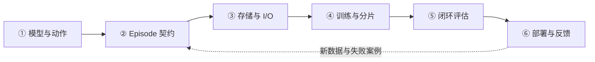

# 具身 Models & Infra 核心路线

[所属 Part](README.md) · [首页](../README.md) · [知识地图](../KNOWLEDGE_GRAPH.md) · [实验课程](../practice/experiments/a100_fsdp_io_lab.md)

当前重点不是先搭一个“大平台”，而是沿一条可解释的链路学习：**观察与任务 → 训练样本 → batch → 模型更新 → 闭环评估 → 动作执行**。以“把桌上的杯子递给我”为贯穿例子；这是学习场景，不代表仓库已有真机实现。

已有 LLM Training / Agentic RL 经验可以复用。需要新补的是模型到底预测什么、时序数据是否对齐，以及推理结果怎样影响下一次观察。模型参数少，不等于 activation、视频 I/O、数据质量与闭环时延都容易处理；是否使用 FSDP 要看状态账本和实测，不预设答案。

## 六阶段地图

| 阶段 | 学完能回答什么 | 正文入口与真实覆盖 | 最小产出 |
|---|---|---|---|
| [① 模型与动作](#stage-1) | 模型输入、输出、目标分别是什么？ | [模型入门大纲](../docs/superpowers/specs/2026-09-18-embodied-models-primer-design.md)，基础正文待展开 | 一页输入／输出／目标对照 |
| [② Episode 契约](#stage-2) | 图像、状态与未来动作按什么时间契约对齐？ | [具身系统正文](topics/agentic_for_embodied.md)，已有设计，未验证 | 一个 episode 的字段和时间线 |
| [③ 存储与 I/O](#stage-3) | 从文件到 GPU batch 在哪里等待？ | 系统正文＋[E04](../practice/experiments/a100_fsdp_io_lab.md#e04)，独立数据专题待补 | 样本身份校验与流水线分解 |
| [④ 训练与分片](#stage-4) | DDP 放得下吗？FSDP 省什么，又增加什么？ | [FSDP/FSDP2/ZeRO](../training-infra/topics/fsdp.md)，已有机制正文 | 显存账本、参数生命周期图 |
| [⑤ 闭环评估](#stage-5) | loss 降低是否意味着任务更可靠？ | 系统正文中的评估设计，尚无本仓库实测 | 离线与闭环分开的评估协议 |
| [⑥ 部署与反馈](#stage-6) | 正确动作晚到了，该如何处理？ | 系统正文中的运行时设计，未完成真机验证 | observation→action 的时延与版本契约 |

前两阶段先做到能解释一个样本，再开始性能实验；阶段④沿用已有训练知识，不必从 Megatron 重新学起。⑤⑥是训练的验收约束，不是“训练结束以后再考虑”的附加项。

## ① 先认识模型：它在学什么、输出什么

- **MLLM**：多模态理解、对话、澄清、任务状态判断；不直接输出动作也有价值。MLLM 不是推理引擎 vLLM。
- **VLA / policy**：由视觉、语言及具体方案使用的机器人状态产生动作；动作可能是关节目标、末端位姿或增量。坐标系、单位和控制接口比缩写更重要。
- **World model**：预测观察或潜在状态的演化；是否以动作作为条件、是否用于规划，取决于模型。不能把所有视频生成模型当成可用的机器人动力学模型。
- **学习方式与输出方式分开**：BC 从示范学习；RL 从奖励与交互学习。Action chunk 是一次预测多个时间步；Diffusion / Flow Matching 是可用于连续动作生成的方法，不是 RL 的同义词。

阅读顺序：[入门大纲第一至四章](../docs/superpowers/specs/2026-09-18-embodied-models-primer-design.md) → 第五至六章 → [系统正文最小机器人背景](topics/agentic_for_embodied.md)。VLT 未给出具体出处时保留歧义，不强行定义。

**过关标准**：对一个选定的公开策略，写清 observation shape、action shape、预测长度、实际执行长度、loss 和可训练模块；说明“看懂杯子”与“夹爪动作可执行”的区别。先对比 action chunk、动作生成与视觉语言条件这三个机制，再按需要选 ACT、Diffusion Policy、OpenVLA / openpi 的代表材料，不把模型名单全部升为必读。

## ② Episode 数据契约：正确的 batch 比快的 batch 更早

从一条 episode 画出 camera / state / action 的时间线，核对：episode ID、时间戳、相机标定、坐标系、单位、动作空间、归一化统计、终止原因和 padding mask。采样历史观察与未来动作时，不越过 episode 边界；训练／验证按任务和采集分组设计，避免相邻窗口泄漏。

复用[具身数据与平台正文](topics/agentic_for_embodied.md)。[LeRobotDataset v3 官方文档](https://huggingface.co/docs/lerobot/en/lerobot-dataset-v3)可作为具体格式样本：低维信号、视频与索引元数据是不同层；逻辑 episode 不必等于一个物理文件。

**过关标准**：抽一个样本，能追溯回原始 episode 和相机帧，解释边界处的 mask、状态与动作的时间差；先做只读可视核验，不控制机器人。

## ③ 多模态存储与 I/O：分清读得慢、解码慢还是送得慢

只抓六件事：**文件分片与索引 → 时序窗口采样 → 视频解码 → CPU 变换 → cache/prefetch → H2D**。小文件压力与大 shard 的随机访问成本需要一起看；视频压缩节省空间，但窗口抽样可能带来额外解码。增加 worker 不一定加速，也可能争抢 CPU、内存、文件句柄和存储带宽。

按 [E04](../practice/experiments/a100_fsdp_io_lab.md#e04)设计对照：固定 episode／窗口／数据增强语义，分别记录读文件、decode、collate、H2D、GPU 等待；区分冷／热缓存，不清理共享缓存。比较单进程与多 worker、按需解码与复用、无预取与有界预取，最后再测跨 rank 采样重复、遗漏及长尾。

**过关标准**：解释 GPU 空洞的来源，并能证明优化前后的样本身份、时序和 mask 没变。独立 I/O 正文仍待补，本阶段不预设 MP4、逐帧图片或某个新存储格式一定最快。

## ④ 训练：先有 DDP 基线，再决定是否分片

重点复用 [FSDP/FSDP2 与后端选型](../training-infra/topics/fsdp.md)、[NCCL](../systems/topics/nccl.md)和 [FP8 / 混合精度基础](../systems/topics/fp8.md)：

1. 列出 vision encoder、语言骨干、action head 的冻结范围，分开计算参数、梯度、optimizer、activation 与临时 buffer。
2. 小规模跑通单卡／DDP 基线，先验证 batch、loss 和一步更新，再判断受限于状态、activation、I/O 还是计算。
3. 对比 ZeRO-1/2/3 的状态分片与 PyTorch FSDP1/FSDP2 的实现；画清 all-gather 参数、reduce-scatter 梯度与参数释放时机。FSDP2 不是“ZeRO 的第四阶段”。
4. 结合模块边界选择 `fully_shard` 分组，再考察 `reshard_after_forward`、prefetch、mixed precision、梯度累积；具体可用参数和默认值以固定版本的[官方教程](https://docs.pytorch.org/tutorials/intermediate/FSDP_tutorial.html)为准。
5. Activation 主导时再做选择性重计算、分辨率／时间窗／microbatch 消融；状态分片不等于切掉全部 activation。最后加入 optimizer、RNG、数据位置与归一化配置的 checkpoint 恢复验收。

**过关标准**：完成 [E01 状态账本](../practice/experiments/a100_fsdp_io_lab.md#e01)／[E02 通信时间线](../practice/experiments/a100_fsdp_io_lab.md#e02)的设计，再按需做 E03/E05/E06。实验均未执行；先单机，只有单机假设解释清楚且获准后才扩到最多 64 卡。A100 以 FP32/BF16/FP16 为主要实验精度，不宣称原生 FP8/FP4 Tensor Core 加速。

## ⑤ 评估：离线拟合与闭环任务成功分开

先确定任务、初始状态、成功判据、时间预算、reset、随机种子和人工介入规则，再看结果。离线 loss／动作误差反映数据上的拟合；闭环中策略会改变下一步观察，错误会累积，不能互相替代。

复用[具身评估与恢复设计](topics/agentic_for_embodied.md)。至少区分训练分布内、新物体／场景／指令、跨本体；固定评估版本和种子集合，保存成功、失败与 timeout 的分母。仿真提升不能直接写成真机提升。

**过关标准**：交付一份可复跑的评估协议与失败分类，而不是只报平均成功率。尚未执行仿真或真机测试，不把设计标为 `VERIFIED`。

## ⑥ 部署：优化的是动作可用性，不只是模型吞吐

沿着 camera timestamp → preprocess → inference → action buffer → controller 记录延迟、抖动与 observation 新鲜度。明确 chunk 预测长度、执行长度、补位水位与重规划；并发或异步可以减少等待，但不会自动消除旧观察带来的动作失配。

复用[具身运行时设计](topics/agentic_for_embodied.md)，结合 [LeRobot 异步推理文档](https://huggingface.co/docs/lerobot/en/async)理解“动作执行时准备下一段”的接口。它与 [RL 异步训练](../rl-infra/topics/agentic_rl.md#async-streaming-partial-staleness)不是同一概念；LLM 的 TTFT/TPOT 也不能直接充当控制闭环指标。

**过关标准**：设计迟到动作的丢弃／替换、超时与安全回退规则；模型、预处理、normalization、action adapter 和 robot profile 一起版本化。先用回放或仿真验证；真机必须有独立安全保护、操作许可和急停，不执行未经验证的动作。

## 如何衔接其它路线

[GPU Systems](../systems/roadmaps/gpu-systems.md)解释执行与数据搬运；[Distributed Systems](../systems/roadmaps/distributed-systems.md)解释失败、状态与恢复；[Inference](../inference-infra/roadmap.md)提供调度与性能方法，但不替代物理动作时限；[Agentic RL](../rl-infra/roadmap.md)在确有交互学习需求时复用，不作为 BC 的强制前置。

本页只组织学习和验证，不新建一套研究队列。正式选读仍进入[共享阅读队列](../research/reading_queue/README.md)，研究变化在[统一雷达](../research/tracking/README.md)跟踪；模型、I/O 基础正文与实验结果分别补齐，不能以“已建立路线”代替“已掌握”。
