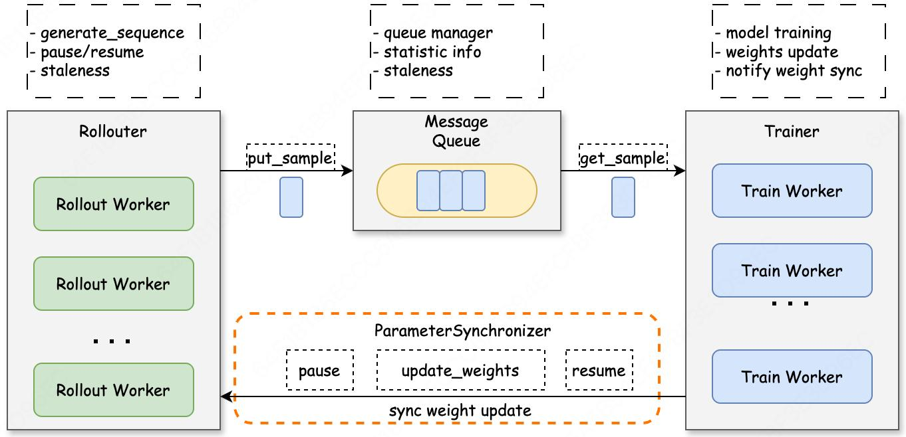
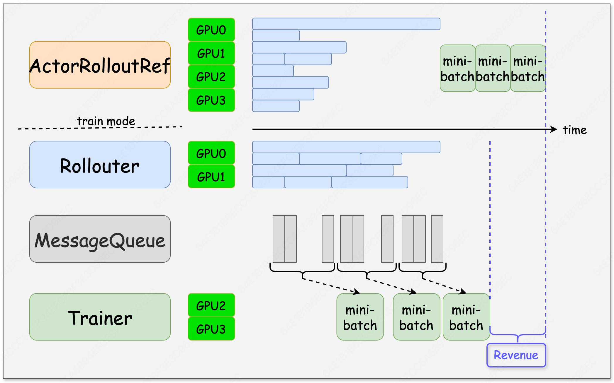
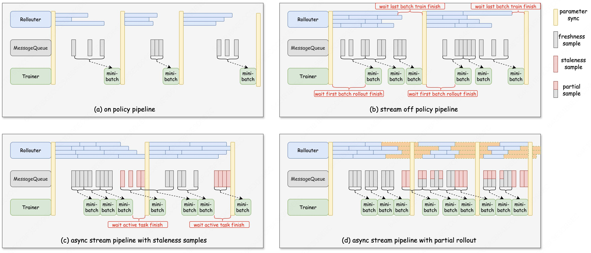
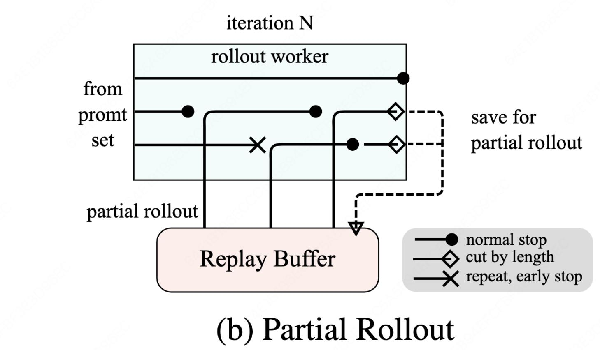
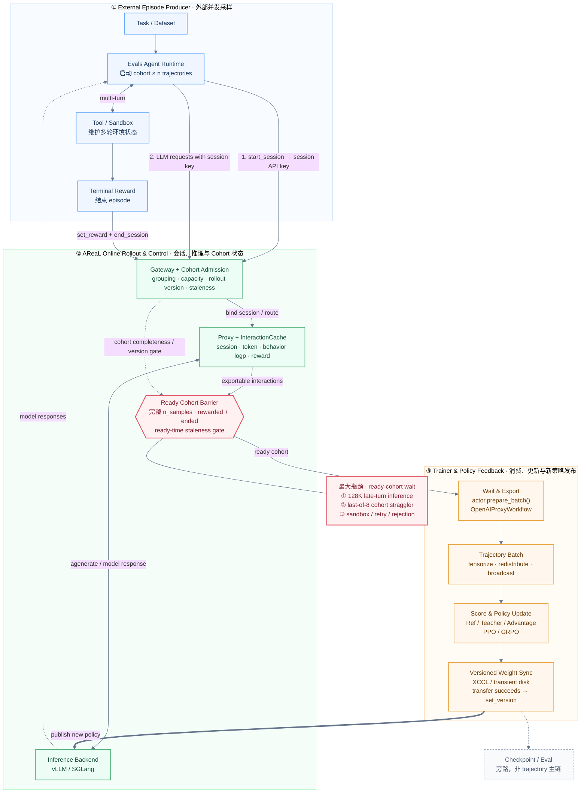

# 大模型训练推理 Infra 高级工程师：面试题库与现场速查

> - 适用对象：社招大模型训练/推理 Infra 高级工程师
> - 目标档位：当前年薪约 80 万，目标 100–150 万
> - 使用方式：按简历查题；面试前按薄弱项复习，现场先读「直接回答」
> - 修订日期：2026-09-09；官方资料的核验日期与项目版本见文末
> - 依据：最新投递版 PDF 简历（2026-08-30，本地核验且不在公开仓库记录含手机号文件名）、[项目事实底稿](2026-08-xpeng-infra-resume-materials.md)及文末官方资料

<a id="interview-console"></a>
## 0. 考场速查

### 0.1 面试现场速查控制台

> **怎么用**：沿「教育背景 → 工作技能 → 项目经历」找到对应题目，先讲直接回答，被追问时再看展开。题尾可返回本 Part 或本控制台；浏览器返回按钮、macOS `⌘ + [`、Windows/Linux `Alt + ←` 可回到上一次跳转位置。题头的分钟数是完整准备时间，答案里的秒数是口述参考时长。

**快速入口**：**[Meshy 技术面：低精度 / GPU / PyTorch](#meshy-interview-sprint)** · [小红书后训练速查](#xiaohongshu-sprint) · [字节 Data AML 速查](#bytedance-aml-sprint) · [自我介绍](#resume-01) · [框架选型](#areal-01) · [Coding 手撕题](2026-09-interview-coding.md) · [Meshy 笔试基础题](2026-09-meshy-ml-system-written-prep.md#meshy-top) · [技术面反问](#vi-questions-to-ask) · [面试前复习](#vi-0) · [面试进度](#interview-progress)

| 简历区块 | 简历内容 / 面试切入点 | 高频题目入口 |
|---|---|---|
| **教育背景** | 厦门大学本科、清华大学硕士，研究方向为人工智能 | [自我介绍](#resume-01) |
| **工作技能** | **GPU / PyTorch / 低精度**：数值表示、scale、GEMM、访存、Autograd、compile | **[通用基础 Part](#part-foundations)** · [浮点格式](#precision-01) · [FP8 Scale](#precision-02) · [GPU 执行](#gpu-01) · [Roofline](#gpu-02) · [compile](#pytorch-02) · [Linear 反向](#pytorch-03) |
|  | **Megatron / 分布式训练**：5D 并行、TP/SP/CP、Distributed Optimizer、PyTorch FSDP/DeepSpeed/Accelerate | **[整体优化方案](#megatron-optimization-overview)** · [5D 并行](#megatron-01) · [TP 切分](#megatron-02) · [SP/CP](#megatron-04) · [Distributed Optimizer](#megatron-05) · [PyTorch FSDP](#dist-01) · [框架选型](#megatron-11) |
|  | **MoE / 长上下文 / 显存性能**：EP、Grouped GEMM、融合算子、显存账本 | [Dense/MoE](#moe-01) · **[EP 带来的问题与解决方案](#megatron-06)** · [显存账本](#infra-02) · [选择性重计算](#megatron-selective-recompute) · [融合算子](#kernel-01) |
|  | **RL / verl / AReaL**：PPO/GRPO/DAPO、Fully Async、Agentic RL | [RL 算法](#rl-algo-01) · [verl/AReaL 选型](#areal-01) · [HybridFlow](#verl-01) · [资源部署](#verl-02) · [Async/Streaming/Staleness](#verl-04) |
|  | **Rollout / 通信 / 稳定性**：vLLM/SGLang、CUDA Graph、Prefix Cache、Collective、异常排障 | [Rollout 优化](#rollout-01) · [后端选型](#verl-09) · [CUDA Graph](#resume-13) · [Prefix Cache](#resume-14) · [通信算子](#infra-04) · **[Ring AllReduce](#ring-allreduce-quick)** · [万卡问题](#infra-09) · [训练异常](#train-anomaly-01) |
|  | **视频 / 3D 生成**：Diffusion、Flow Matching、多阶段执行与资产质量 | [训练/推理机制](#gen-01) · [多阶段优化](#gen-02) · [3D 表征](#gen-03) · [视频 Ulysses](#resume-18) |
| **项目经历（核心）** | **X1 200B MoE**：**`0.16x→0.95x / MFU 35% / 3K 卡连续稳定训练两个月`** | **[代表性优化](#resume-01a) · [Ownership](#resume-01b) · [5D 并行](#megatron-01) · [Dense/MoE](#moe-01) · [规模交付](#resume-10)** |
|  | **Long Context SFT**：**`31s→9.3s；MFU 23%→45.2%`**（独立简历口径，不据此互相反推）；**`128K / 7.6GB`** | **[9B SFT](#resume-05) · [35B-A3B/128K](#resume-17) · [长上下文显存](#resume-06) · [CP-local logits](#resume-07)** |
|  | **Fully Async RLVR**：async 内部配置优化 **`76→211–255 tokens/s/GPU`** | **[专题导航](#fully-async-study) · [个人项目](#resume-02) · [架构/四模式](#verl-04) · [流式组批](#verl-12) · [陈旧度预算](#verl-13) · [Partial/校正](#verl-14) · [美团实验](#verl-15)** |
|  | **AReaL Agentic RL / Gateway**：**decode `6–8x`；Rollout `+60%`；Rejected Group `33.18%→2.73%`** | **[训练链路](#resume-08) · [CUDA Graph](#resume-13) · [Gateway 收益](#resume-19) · [Gateway 分层改造](#areal-09) · [XCCL/Disk](#areal-11)** |
|  | **OPD / MOPD**：**双 Teacher 在 SWE、Terminal 双域提升且 General 不下降（方向性结论）** | **[MOPD 主问题](#resume-09) · [Trajectory→Gradient](#areal-04) · [三层正确性门禁](#areal-08)** |
|  | **TX 文生视频 / 国产卡规模交付**：**模型跑通、精度、性能、扩容与交付闭环** | **[HunyuanVideo/Ulysses](#resume-18) · [千卡/万卡交付](#resume-10) · [精度对齐](#resume-12) · [融合算子](#kernel-01) · [万卡规模效应](#infra-09)** |

---

<a id="meshy-interview-sprint"></a>
### 0.1A Meshy｜ML System 技术面：复习导航

**2026-09-09 下午笔试已通过；技术一面拟约 2026-09-15（周二）15:00，待正式确认。** 本入口按 JD 和转述反馈组织复习，不是公司真题。所有技术答案统一归入下方通用题库；现场点题目即可阅读，不再另查一份 Meshy 技术专项。

| Topic | 优先复习 | 随后追问（保留原题分级） |
|---|---|---|
| 低精度与数值 | [格式](#precision-01) · [Scale](#precision-02) · [收敛/性能排障](#precision-03) · [Linear 前后向](#pytorch-03) | [MXFP8/NVFP4](#precision-04) |
| GPU 与 PyTorch | [执行/存储](#gpu-01) · [Roofline](#gpu-02) · [公平计时](#gpu-03) · [Autograd](#pytorch-01) · [compile](#pytorch-02) | [FSDP2](#dist-01) · [训练后端选型](#megatron-11) · [通信](#infra-04)（均复用原题） |
| 数据与生成模型 | [DataLoader](#infra-11) · [Diffusion/Flow Matching](#gen-01) | [多阶段推理](#gen-02) · [3D 表征](#gen-03) · [规模训练](#infra-09) |
| 个人项目 | [SFT 数据/重计算/并行](#resume-05) · [CP-local logits](#resume-07) | [TX 视频适配](#resume-18) · [200B MoE](#resume-01a) · [CUDA Graph](#resume-13) |
| 独立编码 | [MHA](2026-09-interview-coding.md#coding-01) · [Linear 梯度检查](2026-09-interview-coding.md#coding-05) · [计时模板](2026-09-interview-coding.md#coding-06) | [Triton 融合](2026-09-interview-coding.md#coding-07) · [环境检查](2026-09-interview-coding.md#coding-env) |

**两小时路线**：低精度 40 分钟 → GPU 25 分钟 → PyTorch 25 分钟 → 数据/Diffusion 15 分钟 → 编码环境 15 分钟。时间更充裕时按下面分日计划复习。技术面前确认 GPU、工具与资料权限；学习/练习内容不表述为已有生产经历。

<details>
<summary>展开：Meshy 流程、分日计划、项目开场和公开工作交流</summary>

<a id="meshy-process"></a>
#### 已知流程与待确认项

- **本人收到的信息**：笔试之后两轮技术面，包含编码、环境配置和共享屏幕；终面线下见主管，CEO 线上参与。暂按自带电脑准备，不代表对方已确认设备安排。
- **转述反馈**：低精度、GPU 细节和理论基础可能问得深入；负责人较 hands-on；近期在组建视频团队。作为准备信号使用，不写成经独立核实的公司制度。“毕业久就很难通过”是个人判断，不是筛选规则。
- **公开招聘**：[官方湾区 ML System 岗](https://jobs.ashbyhq.com/meshy/90988ed5-f767-4c0d-9cbc-b69d792db1a9)的搜索可见招聘正文提到 GPU/Jupyter 和现场编码，但不能把海外流程、时长或资料权限套到本次国内面试；网页直接打开可能仅显示动态加载壳。
- **面前确认**：是否提供远程 NVIDIA GPU、具体型号/系统/PyTorch 版本、允许使用哪些资料和工具、屏幕共享范围、工作地点及线下面试地点。允许上网不等于允许 AI；未明确时按独立编码练习。求职地域仍以深圳及既定通勤范围为准。

<a id="meshy-plan"></a>
#### 到拟约面试的学习安排

| 日期 | 主任务 | 当天验收 |
|---|---|---|
| 9/10 周四 | [格式/Scale/排障](#precision-01)＋[Linear](#pytorch-03)：格式、scale、反向、低精度诊断；避开已排的 Infix 16:00 面试 | 脱稿解释 BF16 精度/范围；写出 Linear 三次 GEMM；手算一次量化饱和 |
| 9/11 周五 | [GPU](#gpu-01)＋[Roofline](#gpu-02)＋[Triton](2026-09-interview-coding.md#coding-07)：GPU、Roofline、小融合 kernel | 手算 FLOPs/bytes；说明 mask、tiling、occupancy；有 GPU 才做实测 |
| 9/12 周六 | [Autograd](#pytorch-01)＋[compile](#pytorch-02)＋[FSDP2](#dist-01)＋[计时](#gpu-03)：Autograd、compile、FSDP2 | 独立写 benchmark；画出参数 AG/释放/梯度 RS；定位一次 graph break |
| 9/13 周日 | [数据](#infra-11)＋[生成模型](#gen-01)：数据加载、扩容、Diffusion、3D | 画数据到 GPU 的链路；说明非自回归生成；完成一个端到端性能方案 |
| 9/14 周一 | 45–60 分钟独立编码模拟＋项目追问＋[公开工作](#meshy-public-work) | 不看答案完成 Attention/梯度检查；把真实优化讲到 tensor 和 timeline |
| 9/15 周二 | 面前 30–45 分钟热身，15:00 为拟约时间 | 检查环境与分享范围，复述三道薄弱题；不临时升级驱动/依赖 |

**只有两小时时**：低精度 40 分钟 → GPU/Roofline 25 分钟 → PyTorch 25 分钟 → 数据/Diffusion 15 分钟 → 编码与环境 15 分钟。不是两小时学完所有内容，优先读 P0 的直接回答与例子。

<a id="meshy-project-fit"></a>
#### 项目开场与映射

**可口述开场**：

> 我本科在厦门大学、硕士在清华，主要做训练系统集成和性能优化。在华为做过 200B MoE，以及文生视频/图像模型的国产卡适配、精度和性能优化；在小鹏做长上下文 SFT 和后训练框架。我比较擅长沿数据、显存、并行和 kernel timeline 找到瓶颈，再通过配置和代码调整验证结果。这次我特别关注 3D 生成及岗位可能覆盖的视频方向中的变长数据、低精度与多阶段执行，希望把已有经验迁移过来，也在补 GPU 和数值计算细节。

| 面试切入点 | 用哪个真实项目回答 | 必须准备的细节 |
|---|---|---|
| 数据/训练效率 | [9B SFT](#resume-05) | 数据等待如何看；workers/prefetch；选择重算与 TP/CP；31s→9.3s 不编单项贡献 |
| 显存/源码正确性 | [CP-local logits](#resume-07) | 哪个 tensor 提前聚合；为什么 chunk 没救峰值；local labels/mask 与 loss 对齐 |
| Diffusion/视频适配 | [TX 视频模型](#resume-18) | 模型跑通、数据流、精度基线、通信/算子瓶颈、复测流程 |
| 并行与算子 | [200B MoE](#resume-01a) | Grouped GEMM 的 M 从哪里来；EP token 数、算通重叠、瓶颈迁移 |
| launch/调度开销 | [CUDA Graph](#resume-13) | 为什么 decode 受 launch 影响；shape/capture/warmup；6–8x 的局部口径 |

**三条边界**：HunyuanVideo-14B/640×640×3×129 是主文档教学示例，不冒充已确认的实际交付配置；Megatron 的特性集成不冒充底层 collective/调度开发；FP8/FP4、FSDP2/compile/Triton 若只有学习或小实验，就明确说明，讲自己的验证方法。

**跨时区协作准备**：用英语做一次 30 秒项目摘要，重点说 workload、bottleneck、change、validation，不需要编海外合作经历。比如：

> My work focuses on training-system integration and performance optimization. I usually start with an end-to-end profile, identify the dominant bottleneck, and validate both throughput and numerical correctness. My experience includes long-context SFT, MoE training, and post-training systems.

<a id="meshy-public-work"></a>
#### 公开工作：观察 → 个人经验 → 技术问题

**用法**：选一个真正理解的点，只用 20–30 秒说明观察，再问系统取舍。不需要泛泛赞美，也不要把对方尚未公开的组织安排说成你已确认的事实。

##### 1. Meshy T2：从逐 token 生成转向并行 Flow Matching

公开论文 **Meshy T2: Fast Native Mesh Generation with Flow Matching** 首发 2026-07-28，v3 更新于 2026-08-12。它以每顶点一个连续 latent 的 mesh VAE 表示几何，先用 voxel flow 生成粗占据结构，再由 mesh flow 结合图像、结构和 vertex budget 生成 mesh latent；不是逐 mesh token 自回归。[论文与作者元数据](https://arxiv.org/abs/2607.28675)

**可以这样问（工程推论，不是论文实测结论）**：

> 我看了 T2 的公开架构。它把生成变成 coarse-to-fine 的 flow，系统优化的重点会从逐 token decode 转到多步网络调用、可变 vertex 数和最终解码。我比较好奇，实际最值得优化的是去噪/flow 主干、VAE 解码，还是不同 vertex budget 下的 shape 和组批？

不背未经复现的速度数字。核验时[官方仓库](https://github.com/meshy-dev/meshy-t2)仍主要提供介绍/素材及待发布信息，不能声称已经运行其完整代码。公开研究路线也不等于公司所有线上模型。[历史补录与阅读边界](../training-infra-roadmap/tracking/backfill/2026-07.md#meshy-t2)

##### 2. MakerWorld / Bambu：从生成完成到资产可用

Meshy 2026-03-17 发布的合作消息介绍了 Image-to-3D 接入 MakerWorld/MakerLab，并将多色 3MF 接入 Bambu Studio 工作流。这能支持“生成结果需要服务实际打印流程”，**不能推出模型在打印机上推理、联合设计 GPU 或终端芯片**。[公司发布的合作消息](https://www.prnewswire.com/news-releases/how-to-turn-any-image-into-a-full-color-3d-print-in-one-click--meshys-multi-color-printing-powered-by-meshy-6-is-now-live-on-makerworld-302714800.html)

> 我关注到你们和 MakerWorld 的合作。对 ML Systems 来说，我理解指标不应只看生成速度，还要看模型能否顺利进入切片和打印流程。做低精度或推理优化时，团队会用什么几何/可打印性指标做回归门禁？下游失败会反馈到数据还是模型评估里？

这是从个人“性能＋正确性”经验出发的讨论，不假定自己懂打印机硬件。

##### 3. 视频方向：联系真实经验，再确认岗位覆盖

截至核验时，[官网视频入口](https://www.meshy.ai/video)可见 Image-to-Video/Text-to-Video 等产品选项；**仅凭入口无法确认模型是否自研、所用后端或视频团队成立时间**。用户转述的“新视频团队”保留为待面试确认的信息。

> 我也注意到官网的视频生成入口。我以前做过文生视频模型的适配和性能优化，比较熟悉从模型跑通、精度对齐到并行和算子瓶颈定位的过程。想了解这个岗位会主要服务 3D，还是也覆盖视频方向？两边在数据读取、编译、低精度和性能回归上，会更倾向共用基础设施还是先独立迭代？

**不要说**：“听说新组了视频团队，你们一定用某某 DiT”“和拓竹合作，所以一定会考端侧芯片”“T2 就是你们生产模型”。公开资料用于提出好问题，不用于填补未知事实。

<a id="meshy-questions"></a>
#### 主管 / CEO 交流

通用反问仍维护在 [三轮反问](#vi-questions-to-ask)；下面仅保留 Meshy 的岗位化问法，选一两题即可：

1. **对主管**：如果入职前三个月只能解决一个系统问题，您最希望是训练实验周转、数据供给、低精度收敛，还是在线推理成本？现在有哪些 baseline，结果由什么指标验收？
2. **对主管/CEO**：3D 与视频都在发展时，哪些基础设施值得统一，哪些应保留研究迭代自由？能否举一个最近为了长期技术质量而没有选择最快上线方案的例子？
3. **对 CEO/负责人**：在生成速度、资产可用性和研究新能力之间，公司未来一年最想建立什么优势？ML Systems 团队能参与哪些技术决策，如何从业务反馈影响研究优先级？

听具体案例、验收方式、资源与职责，不只听价值观用词。地域与协作方式是实际约束，需在进入线下流程前确认，不暗示愿意迁居。

</details>

↑ [返回通用面试速查控制台](#interview-console)

---

<a id="xiaohongshu-sprint"></a>
### 0.1B 小红书｜大模型训练框架研发一面：30 分钟冲刺

**对应场次：2026-09-09 17:00，技术一面已结束，结果待通知。** 本次已确认的 Coding 实题：[LRU 缓存 get / put（Python3 OrderedDict）](2026-09-interview-coding.md#coding-04)。下面的技术冲刺路线按 JD 准备并保留复习，不当作实际被问的题目或内部技术栈判断。重点是 **RL 后训练框架：算法流程 → Rollout/训练协同 → 长轨迹显存 → 性能与生产保障**。先讲小鹏后训练项目，华为 200B MoE 作为并行和规模交付的支撑。

**怎么学、怎么查**：30 分钟先读下表加粗题目的「直接回答」，再看题内标出的短追问：DPO 显存、Reward 接入与 PPO 迁移、训推动态协同、MLOps 和 Profiling；不逐题精读所有展开。其他链接留作现场追问。进入答案后，用浏览器后退返回刚才位置，或题尾「返回小红书冲刺」回到本表。这里的优先级针对本次 JD，不改变通用题库的 P0/P1/P2。

| 时间 | 主题 / 面试官想确认什么 | 先读答案；被追问再跳转 | 一句话抓住重点 |
|---:|---|---|---|
| 3 分钟 | **框架选型与源码贡献**：你做过什么 | **[verl/AReaL 选型](#areal-01)**；[Gateway 分层改造](#areal-09) · [个人贡献](#resume-01b) | 选型依据是当时任务、版本与改造成本；团队 Gateway 主线和个人 quota/集成工作分开讲 |
| 6 分钟 | **算法到 pipeline**：RLHF/DPO 怎么落地 | **[PPO/GRPO/DAPO](#rl-algo-01) · [DPO](#dpo-01) · [Reward 接入与 PPO 迁移](#verl-07)**；[HybridFlow](#verl-01) | RM 评分，Critic 估值；标准离线 DPO 没有在线生成环节，在线 RL 则要组织生成、评分、更新与权重发布 |
| 7 分钟 | **Rollout 与 Fully Async**：吞吐为何提高，代价是什么 | **[个人 Fully Async 优化](#resume-02) · [Rollout 优化全景](#rollout-01)**；[流式组批](#verl-12) · [Staleness](#verl-13) · [Partial/校正](#verl-14) | 减少长尾等待、配平供需，再控制陈旧度；`76→211–255` 是 async 内部配置优化，不是 sync→async 三倍 |
| 5 分钟 | **混合并行与动态协同**：训练/生成为什么不一样 | **[FSDP/ZeRO](#dist-01) · [训推权重同步](#verl-03)**；[共置/分池](#verl-02) · [TP 切分](#megatron-02) · [Megatron/FSDP](#megatron-11) | 训练按模型状态与 activation 选布局，生成按权重/KV/并发选布局；切换要付出重分片、加载与暂停成本 |
| 5 分钟 | **长轨迹与源码排障**：显存到底花在哪 | **[长上下文显存](#resume-06) · [CP-local logits 修复](#resume-07)**；[显存账本](#infra-02) · [选择性重计算](#megatron-selective-recompute) | 训练的 activation/logits 和生成的 KV 分开算；先找峰值分配位置，不能用一个“开 CP”解释全部问题 |
| 4 分钟 | **Profiling 与平台能力**：如何交付可重复结果 | **[瓶颈定位](#p2-03) · [指标树与 MLOps](#infra-07)**；[Checkpoint](#infra-08) · [异常排障](#train-anomaly-01) | 从有效产出到阶段 timeline，再到 kernel；GPU util 高不代表训练快，更不代表质量好 |

合计 **30 分钟**。有余力再看：[CUDA Graph](#resume-13) · [Prefix Cache](#resume-14) · [多模态训练差异](#mllm-01) · [MOPD](#resume-09) · [Python3 MHA](2026-09-interview-coding.md#coding-01)。今天不新增 OpenRLHF/LLaMA-Factory 全栈学习任务，先保证能讲透自己改过的框架。

**开场（接在一句教育背景之后，约 30–40 秒）**：

> 我目前在小鹏做大模型后训练基础设施，主要是基于 verl/Megatron 的 SFT、RLVR，以及 AReaL Agentic RL 的集成、性能和正确性优化。之前在华为做过 200B MoE 的模型适配与规模训练交付。我的优势是沿生成、训练、权重同步的完整链路定位瓶颈，通过配置和源码改动解决问题，再验证吞吐与数值正确性。这个岗位的后训练框架研发，与我最近的工作最贴近。

**最值得预演的两个追问**：

1. **“你的 RLVR 如果换成 learned-RM PPO，怎么改？”** 先声明实际经验主要在 RLVR/GRPO；再讲新增 RM scoring 与 Critic/value/GAE，Reference 提供 KL 基线，重新核算 GPU 资源和评分吞吐。RM 服务需要批处理、版本、样本 ID、超时与失败语义，不能把服务失败当模型答错。[完整口述](#verl-07)
2. **“你到底改过哪段源码，怎么证明没有算错？”** 先讲 CP-local logits：原路径在 chunk 之前已聚合完整 logits，后续切块救不了此前峰值；改为本地 logits 对齐本地 labels/mask，计算所需量后再汇集小张量，比较 logprob/loss/gradient。再用 Gateway 讲团队设计如何接入、自己具体负责哪段。[CP 修复](#resume-07) · [Gateway 代码与贡献边界](#areal-09)

**四条口径不要踩线**：

- “熟悉机制、能评估迁移”不等于做过 OpenRLHF、LLaMA-Factory、DPO 或 learned-RM PPO 的完整生产落地。
- “动态协同”不等于实现过在线弹性修改 TP/PP/ZeRO 的底层调度；先讲有证据的资源分池、批量、准入、背压和权重发布。
- async 吞吐、decode `6–8x`、Rollout `+60%` 分属不同对照和阶段，不能相乘，也不能直接换算为收敛加速。
- MLOps、自动调参、跨机房训练若无直接案例，就按设计题回答；不要把千卡模型性能交付说成整个平台、网络或容灾系统由自己主导。

**技术一面反问，选 1–2 个**：

- 团队当前后训练最影响算法迭代的是 Rollout、Reward Model、actor update，还是跨阶段的数据和权重同步？这个岗位会优先负责哪一段？
- 训练和生成现在最需要解决共置切换成本，还是分池后的供需与陈旧度？团队用什么指标验收优化？
- 框架源码改造怎样做数值、性能和恢复回归？入职前三个月最希望这个岗位交付什么可衡量结果？

原理延伸：[框架选型工程章节](../training-infra-roadmap/topics/rl_framework_selection.md) · [Agentic RL 工程章节](../training-infra-roadmap/topics/agentic_rl.md) · [知识图谱](../training-infra-roadmap/KNOWLEDGE_GRAPH.md) · [阅读索引](../training-infra-roadmap/MASTER_READING_LIST.md)。

↑ [返回通用面试速查控制台](#interview-console)

---

<a id="bytedance-aml-sprint"></a>
### 0.1C 字节 Data AML｜训练框架研发一面速查

**对应场次：2026-09-08 20:00，技术一面，已结束；结果见[进度台账](#interview-progress)。** 按用户提供 JD 准备：推荐/广告/搜索训练系统，重点包含 GPU Embedding、数据读取、Checkpoint、并行与规模稳定性，也覆盖 LLM/SFT/RL/OPD。下面保留为定向复习入口，不是固定真题。

**怎么查**：先点问题，读「直接回答」，被追问再展开。下表的主要题目末尾可返回本入口；要回到刚才的滚动位置，用浏览器后退（macOS `⌘ + [` / Windows、Linux `Alt + ←`）。

| 30 分钟顺序 | 面试官的切入点 | 直接跳转到答案 | 先记住什么 |
|---:|---|---|---|
| 3 分钟 | 你做过什么，个人贡献在哪里 | [自我介绍](#resume-01) · [X1 200B MoE](#resume-01a) · [Ownership](#resume-01b) · [SFT 优化](#resume-05) | workload/基线 → profile → 本人改动 → 验证 → 瓶颈迁移；不只列优化名词 |
| 7 分钟 | 推荐稀疏训练与 LLM 有何不同 | **[INFRA-10｜Embedding、PS、多级存储](#infra-10)** | 大表、小工作集、热点随机访问、可变 ID；稀疏特征不等于 MoE |
| 5 分钟 | GPU 等数据，怎样定位和提速 | **[INFRA-11｜DataLoader 与样本读取](#infra-11)** · [SFT 数据正确性](#sft-data-01) | 拆读取/预处理/组批/H2D；并发和预取有资源上限 |
| 5 分钟 | 怎么保存、异步写入、换卡数恢复 | **[INFRA-08｜可恢复状态与保存流程](#infra-08)** · [一致性与失败处理](#infra-03) · [并行度变化恢复](#megatron-10) | 一致快照 ≠ staging 完成 ≠ 持久化完成；model 与 optimizer/data cursor 对齐 |
| 5 分钟 | 训练如何切、通信怎么发生、扩容为什么变慢 | [FSDP](#dist-01) · [Megatron/FSDP 选型](#megatron-11) · [TP 切分](#megatron-02) · [Collective](#infra-04) · [万卡问题](#infra-09) | 先讲 tensor 的形状和数据流；通信等待不等于网络慢 |
| 5 分钟 | 编码、Python 与 PyTorch 基础 | [本页基础速答](#aml-basics) · [MHA 实现](2026-09-interview-coding.md#coding-01) · [矩阵旋转](2026-09-interview-coding.md#coding-02) · **[带父指针 LCA：本次一面实题](2026-09-interview-coding.md#coding-03)** | 先确认 Python3/标准库权限；说复杂度，检查边界与测试 |

**问到后训练再切换**：[verl/AReaL 选型](#areal-01) · [Fully Async 专题](#fully-async-study) · [Rollout 优化](#rollout-01) · [CUDA Graph](#resume-13) · [OPD/MOPD](#resume-09)。RL 是本人的重要经验，但不把这个覆盖稀疏/稠密训练系统的 JD 预设成纯 RL 岗。

**开场侧重点（接在教育背景之后）**：

> 我主要做训练系统集成与性能优化。华为阶段做过 200B MoE 的模型适配、Megatron 技术栈调优和规模训练交付；小鹏阶段主要做长上下文 SFT、verl 异步 RLVR，以及 AReaL Agentic RL。我比较擅长把框架能力接到实际模型上，通过 profile、配置和代码改动解决性能与正确性问题。这个岗位吸引我的地方，是把这些经验进一步沉淀为服务不同模型和业务的训练系统能力。

**遇到“如何沉淀平台能力”**：先说明已经落地的配置、接口、诊断和验证，再讨论下一步如何抽象稳定的数据契约、统一指标、回归测试和故障处理。未完成的平台化只能说“我会这样设计”，不能把集成工作改写成完整平台 ownership。

<a id="aml-basics"></a>
**编码与基础速答（不新增手撕题长文）**：

| 题目 | 最短回答与边界 |
|---|---|
| 整数快速幂 | 平方乘法，时间 `O(log |n|)`；先处理负指数，检查零指数、零底数与负指数组合的约定 |
| LRU | 哈希表定位节点＋双向链表维护最近使用顺序，平均 `O(1)`；一次性扫描会污染缓存，热点频率明显时应比较其他淘汰策略 |
| `view / reshape / contiguous` | view 共享存储但要求目标形状与 stride 兼容；reshape 可能复制；contiguous 在需要时生成连续布局，已经连续时不额外复制 |
| GIL 与 IPC | 常规带 GIL 的 CPython 中，纯 Python CPU 密集任务不能靠线程取得多核并行；I/O、释放 GIL 的原生算子、free-threaded 构建另论。进程可用 Queue/Pipe/共享内存，分别权衡序列化与同步 |
| PyTorch 计算图 | 前向执行时记录需要梯度的运算和依赖，反向按链式法则计算并累积梯度；注意 saved tensors、梯度累积，以及原地修改破坏反向所需数据 |
| Ring AllReduce 通信量 | 每 rank 输入 `M` 字节、共 `N` rank：典型 ring 的发送量 `2(N−1)M/N`，接收量相同；不是收发合计，也不是 NCCL 永远使用 ring |

基础核对：[PyTorch Tensor Views](https://docs.pytorch.org/docs/2.14/tensor_view.html)、[Autograd](https://docs.pytorch.org/docs/stable/notes/autograd.html)、[Python threading](https://docs.python.org/3/library/threading.html)、[NCCL 性能口径](https://github.com/NVIDIA/nccl-tests/blob/master/doc/PERFORMANCE.md)。

**技术一面反问，选一题**：团队当前最希望这个岗位优先解决的是稀疏 Embedding/数据访问，还是 Dense/推荐大模型的并行与稳定性？能否举一个最近最影响算法迭代的问题？

<details>
<summary>公开面经与证据边界（核验于 2026-09-08，现场无需展开）</summary>

- [机器学习系统暑期实习，面试 2025-03-12](https://www.nowcoder.com/discuss/729821154558353408)：CUDA/CPU-GPU、LRU、LevelDB memtable、计算图和 C++ 内存；属于相邻系统岗实习，不是本次社招原题。
- [AML 推理框架研发实习，页面 2025-05-08 已编辑](https://www.nowcoder.com/feed/main/detail/a6d7fcd20cd645bdab07f1df67277576)：项目与量化实现、虚函数、全一子矩阵、牛顿法开根号；只取其中字节部分，不能把美团题混入。
- [AI Infra 实习记录](https://www.nowcoder.com/feed/main/detail/b99b6a7c7ff54453a2451d43488ade5a)：GIL/IPC、AllReduce 计数、view/contiguous、TP 切分、整数幂；页面只显示 02-28，年份未独立核定，GraphFusion 也没有完整题面。
- 没有核实到与本次完整 JD 相同的社招题库。Embedding、数据读取和 Checkpoint 的准备优先级来自 JD 与个人知识缺口；答案依据官方文档/论文，不照搬面经作者的答案，也不把公开系统当作本人经历或该团队当前部署事实。

仓库延伸：[Checkpointing](../training-infra-roadmap/topics/checkpointing.md) · [知识图谱](../training-infra-roadmap/KNOWLEDGE_GRAPH.md) · [阅读索引](../training-infra-roadmap/MASTER_READING_LIST.md)。

</details>

↑ [返回通用面试速查控制台](#interview-console)

---

### 0.2 一张图看懂我的能力主线


> 图例：实心节点表示有项目证据的集成、调优或交付经验，但不自动等于底层算法/kernel 的实现者；空心节点表示原理掌握、证据尚待补齐或今天会评估的能力延伸。

**20–30 秒口述版**：

> 我的主线有两条：一是基于 Megatron 的大模型训练，做过 X1 200B MoE 模型、长上下文和国产卡性能闭环；二是基于 verl/AReaL 的后训练，做过 Fully Async RLVR、Agentic RL 和 MOPD。我主要负责模型侧系统集成、性能与正确性优化，以及从跑通到性能达标的交付闭环。

## 1. 复习导航（按需展开）

<details>
<summary><strong>展开：七个 Part、Core 10 与全量题目索引</strong></summary>

### 1.1 七个 Part：先知道每一部分解决什么问题

能力图给出个人主线；下面这张表把主线映射到可直接进入的面试 Part。数字按唯一问题计数，Core 是 P0 的子集。

| Part | 解决的核心问题 | 关键入口 | 优先级与题量 |
|---|---|---|---:|
| [Part I](#part-i) | 你是谁、做了什么、为什么值得信任 | 自我介绍、Ownership、职业选择 | Core 3 / P0 3 / P1 3 / P2 1，共 7 |
| [Part II](#part-foundations) | 数值如何表示、计算怎样执行、优化怎样验证 | 低精度、GPU、Roofline、PyTorch、benchmark | P0 9 / P1 1 / P2 0，共 10 |
| [Part III](#part-ii) | 大模型如何放得下、跑得快、扩得稳 | Megatron、5D、MoE、显存、长上下文、视频/3D 生成 | Core 3 / P0 21 / P1 8 / P2 1，共 30 |
| [Part IV](#part-iii) | RL dataflow 如何被框架和训练/推理后端承载 | PPO/GRPO/DPO、verl、Fully Async、Rollout 优化、真实模型落地 | Core 1 / P0 14 / P1 6 / P2 1，共 21 |
| [Part V](#part-iv) | Agent trajectory 如何在线生产、校验和消费 | AReaL、Gateway、staleness、MOPD、weight sync | Core 2 / P0 11 / P1 6 / P2 1，共 18 |
| [Part VI](#part-v) | 跨框架的通信、数据、恢复与生产排障 | Collective、Embedding、样本读取、万卡稳定性、checkpoint | Core 1 / P0 6 / P1 5 / P2 1，共 12 |
| [Part VII](#part-vi) | 如何把知识变成首面表现 | 三天冲刺、口径校准、证据卡、模拟面试 | 不新增问题 |

全文共 **98 道唯一问题**：P0 64 道、P1 29 道、P2 5 道。Core 10 已计入 P0，不重复计数；Coding 手撕题单独维护，不计入这里。原有题号及链接锚点保留；Part 显示编号随新增通用基础章节顺延。

### 1.2 Core 10：建立个人项目主线的十个入口

Core 10 用于建立自我介绍、项目和机制之间的回答链，已计入 P0。已有基础、准备下一轮时，优先按 [VII.0](#vi-0) 补实际薄弱项；各题的完整答案只保留在所属 Part。

| 顺序 | 所属 Part | 题目 |
|---:|---|---|
| 1 | Part I | [RESUME-01｜请做一个 1–2 分钟自我介绍](#resume-01) |
| 2 | Part I | [RESUME-01B｜你在项目中的 Ownership 是什么？](#resume-01b) |
| 3 | Part I | [RESUME-01C｜为什么从华为到小鹏，现在为什么又看机会？](#resume-01c) |
| 4 | Part III | [RESUME-01A｜最有代表性的性能优化是什么？](#resume-01a) |
| 5 | Part III | [MEGATRON-01｜Megatron 的“5D 并行”分别解决什么问题？](#megatron-01) |
| 6 | Part III | [INFRA-02｜Megatron 训练显存如何计算？遇到 OOM 怎么定位？](#infra-02) |
| 7 | Part IV | [RESUME-02｜Fully Async 相比同步 RLVR 有什么优势？](#resume-02) |
| 8 | Part V | [RESUME-08｜请画出你的 Agentic RL 训练链路，最大瓶颈在哪里？](#resume-08) |
| 9 | Part V | [RESUME-09｜OPD/MOPD 解决什么问题？](#resume-09) |
| 10 | Part VI | [INFRA-04｜常见通信算子执行什么操作，分别用在哪里？](#infra-04) |

### 1.3 全量问题索引：按 Part 定位，按优先级学习

<details>
<summary><strong>Part I｜个人定位、Ownership 与职业选择（7）</strong></summary>

- **P0 / Core**：[RESUME-01 自我介绍](#resume-01) · [RESUME-01B Ownership](#resume-01b) · [RESUME-01C 职业选择](#resume-01c)
- **P1**：[RESUME-11 第二个 Ownership 案例](#resume-11) · [RESUME-16 带 4–5 人交付](#resume-16) · [BEHAVIOR-01 为什么匹配薪资档位](#behavior-01)
- **P2**：[P2-06 为什么从算法研究转向训练 Infra](#p2-06)

</details>

<details>
<summary><strong>Part II｜GPU 执行、PyTorch 与低精度（10）</strong></summary>

- **数值 / P0**：[PRECISION-01 浮点格式](#precision-01) · [PRECISION-02 FP8 scaling](#precision-02) · [PRECISION-03 收敛与性能排障](#precision-03)
- **数值 / P1**：[PRECISION-04 MXFP8/NVFP4](#precision-04)
- **GPU / P0**：[GPU-01 执行与存储](#gpu-01) · [GPU-02 Roofline](#gpu-02) · [GPU-03 公平 benchmark](#gpu-03)
- **PyTorch / P0**：[PYTORCH-01 Autograd/stride](#pytorch-01) · [PYTORCH-02 compile](#pytorch-02) · [PYTORCH-03 Linear 前后向](#pytorch-03)

</details>

<details>
<summary><strong>Part III｜Megatron、MoE、训练后端与长上下文（30）</strong></summary>

- **P0 / Core**：[RESUME-01A X1 200B MoE 模型性能优化](#resume-01a) · [MEGATRON-01 5D 并行](#megatron-01) · [INFRA-02 Megatron 显存账本](#infra-02)
- **P0 扩展**：[RESUME-05 SFT 31s→9.3s](#resume-05) · [RESUME-17 35B-A3B 128K](#resume-17) · [RESUME-06 128K/256K 显存](#resume-06) · [RESUME-07 CP-local logits](#resume-07) · [KERNEL-01 NVIDIA 融合算子](#kernel-01) · [RESUME-10 千卡/万卡交付](#resume-10) · [MEGATRON-02 TP：Linear/MLP/Attention 切分](#megatron-02) · [MEGATRON-03 TP 变大为什么更慢](#megatron-03) · [MEGATRON-04 SP 与 CP](#megatron-04) · [MEGATRON-05 Distributed Optimizer](#megatron-05) · [MOE-01 Dense 与 MoE](#moe-01) · [MEGATRON-06 EP 的问题与优化](#megatron-06) · [INFRA-01 MFU](#infra-01) · [DIST-01 PyTorch FSDP/FSDP2 与 ZeRO](#dist-01) · [MEGATRON-11 训练框架分层与选型](#megatron-11) · [SFT-DATA-01 数据到 loss 正确性](#sft-data-01) · [MLLM-01 多模态与具身训练差异](#mllm-01)
- **P1**：[RESUME-18 视频 DiT/Ulysses](#resume-18) · [MEGATRON-07 PP bubble](#megatron-07) · [MEGATRON-08 Packed Sequence](#megatron-08) · [MEGATRON-09 Recompute/Offload](#megatron-09) · [MEGATRON-10 Distributed checkpoint](#megatron-10) · [BRIDGE-01 MBridge/Megatron Bridge](#bridge-01)
- **P2**：[P2-02 FlashAttention](#p2-02)

**视频 / 3D 生成扩展**：P0 [GEN-01 Diffusion/Flow Matching](#gen-01)；P1 [GEN-02 多阶段优化](#gen-02) · [GEN-03 3D 表征](#gen-03)。与已有 [MLLM-01](#mllm-01)、[RESUME-18](#resume-18)互链，不当作个人新增项目。

</details>

<details>
<summary><strong>Part IV｜RL 算法、verl 与 Fully Async RLVR（21）</strong></summary>

- **P0 / Core**：[RESUME-02 Fully Async RLVR](#resume-02)
- **P0 扩展**：[RL-ALGO-01 PPO/GRPO/DAPO](#rl-algo-01) · [DPO-01 DPO 与 SFT/PPO/GRPO](#dpo-01) · [RESUME-03 gen-TP 与实例数](#resume-03) · [ROLLOUT-01 Rollout 优化全景](#rollout-01) · [VERL-01 HybridFlow 架构](#verl-01) · [VERL-02 colocate/disaggregate](#verl-02) · [VERL-03 权重同步与 bucket](#verl-03) · [VERL-04 Fully Async 架构/四模式](#verl-04) · [VERL-12 流式组批与供需](#verl-12) · [VERL-13 陈旧度预算](#verl-13) · [VERL-14 Partial 与校正](#verl-14) · [VERL-05 RLVR 正确性](#verl-05) · [VERL-09 vLLM/SGLang 选型](#verl-09)
- **P1**：[VERL-06 DataProto/WorkerGroup](#verl-06) · [VERL-07 Actor/Ref/Critic/Reward](#verl-07) · [VERL-08 Ray 故障](#verl-08) · [VERL-10 v0.7 以后演进](#verl-10) · [VERL-11 自研版 verl 模型落地](#verl-11) · [VERL-15 美团实验与收益归因](#verl-15)
- **P2**：[P2-05 producer-consumer coding](#p2-05)

</details>

<details>
<summary><strong>Part V｜AReaL、Gateway、Agentic RL 与 MOPD（18）</strong></summary>

- **P0 / Core**：[RESUME-08 Agentic RL 链路](#resume-08) · [RESUME-09 OPD/MOPD](#resume-09)
- **P0 扩展**：[AREAL-01 verl/AReaL 选型](#areal-01) · [AREAL-02 off-policyness](#areal-02) · [AREAL-03 微服务化](#areal-03) · [AREAL-04 trajectory→gradient](#areal-04) · [AREAL-09 Gateway 改造](#areal-09) · [AREAL-11 XCCL 与 disk](#areal-11) · [RESUME-13 CUDA Graph](#resume-13) · [RESUME-19 Gateway 调度收益](#resume-19) · [RESUME-14 Prefix Cache](#resume-14)
- **P1**：[RESUME-15 Rejected Group](#resume-15) · [AREAL-05 Partial Rollout](#areal-05) · [AREAL-06 原子 weight sync](#areal-06) · [AREAL-07 Online Proxy/session drain](#areal-07) · [AREAL-10 外部 Agent 接入](#areal-10) · [AREAL-08 三层门禁](#areal-08)
- **P2**：[P2-04 设计 256K Agentic RL 平台](#p2-04)

</details>

<details>
<summary><strong>Part VI｜通用 Infra 与生产排障（12）</strong></summary>

- **P0 / Core**：[INFRA-04 通信算子](#infra-04)
- **P0 扩展**：[TRAIN-ANOMALY-01 loss/NaN/梯度/收敛排障](#train-anomaly-01) · [INFRA-09 万卡规模效应与优化](#infra-09) · [INFRA-03 NCCL hang/checkpoint 恢复](#infra-03) · [INFRA-10 稀疏 Embedding/PS/多级存储](#infra-10) · [INFRA-11 DataLoader/样本读取](#infra-11)
- **P1**：[RESUME-12 精度对齐](#resume-12) · [INFRA-05 64 卡 35B MoE 128K](#infra-05) · [INFRA-06 推理吞吐/延迟/KV](#infra-06) · [INFRA-07 可观测性指标树](#infra-07) · [INFRA-08 可恢复 checkpoint](#infra-08)
- **P2**：[P2-03 kernel/带宽/通信瓶颈](#p2-03)

</details>

初次准备先用 Core 10 建立主线，之后按岗位和实际薄弱项选择 Part。P0 表示高频基础或核心项目，P1 表示深入追问，P2 表示按需补充；不要求在一次复习里精读全部 P0。现场用顶部简历入口表，日常学习用这里的全量索引；时间安排与项目口径见 [Part VII](#vi-0)。

</details>

---

<a id="part-i"></a>
## Part I｜个人定位、Ownership 与职业选择

**学习目标**：先建立面试官对你的职业主线、个人贡献和稳定性的判断；所有技术深挖都从这里选择入口。

**本 Part 导航**：P0 / Core：[自我介绍](#resume-01) · [Ownership](#resume-01b) · [职业选择](#resume-01c)；P1：[第二个贡献案例](#resume-11) · [4–5 人协同交付](#resume-16) · [岗位价值](#behavior-01)；P2：[从研究到 Infra](#p2-06)。

### Core｜最高优先入口

<a id="resume-01"></a>
#### RESUME-01｜请做一个 1–2 分钟自我介绍（P0，12 分钟）

- **直接回答（60–90 秒）**：

  > 面试官您好，我叫曾柏炜，本科毕业于厦门大学，硕士毕业于清华大学，研究方向是人工智能。我目前在小鹏机器人做大模型后训练基础设施，主要负责两块：基于 verl 和 Megatron-Core 的 SFT、RLVR 训练，以及基于 AReaL 的 Agentic RL 和多 Teacher 蒸馏。具体工作集中在长上下文、rollout 调度、显存性能和训练正确性。
  >
  > 之前在华为，我主要做国产卡上的模型适配、精度和性能优化，代表项目是 X1 200B MoE，并支撑过 3K 卡连续稳定训练两个月。两个阶段共同的工作方式是：先把模型跑通，再通过 profiling 找瓶颈，验证优化效果，最终支持算法实验和模型产出。我希望继续深入训练 Infra，承担核心模块的技术工作和交付责任。

- **被要求量化时再补**：在 Fully Async 路径内部，通过 rollout 资源配比与联合配置优化，代表性稳态吞吐从 `76` 提升到 `211–255 tokens/s/GPU`；这是异步初始配置和优化配置的比较，具体 workload 与统计边界见 [Fully Async 项目](#resume-02)。教育专业追问再补“厦大电气工程及其自动化、清华电子信息”。

- **项目证据或知识边界**：所有数字必须能回到固定 workload。自我介绍只说“多 Teacher 在线蒸馏链路和方向性效果结论”；被追问时再使用“最新版双 Teacher MOPD 在 SWE、Terminal 双域提升且 General 不下降”，不主动混入单 Teacher pp 数字，也不暗示统计信息已全部补齐。
- **高概率追问**：[最有代表性的优化](#resume-01a)是什么？你在项目中的 [ownership](#resume-01b)？[为什么从华为到小鹏、现在又看机会](#resume-01c)？

<details>
<summary>面试意图与回答提醒</summary>

- **问题**：请介绍一下你自己，重点讲与大模型训练推理 Infra 相关的经历。

- **面试官意图**：判断你的职业主线、表达能力和 seniority；同时选择后续深挖入口。

- **危险回答**：连续罗列十几个框架；教育背景超过 10–15 秒或展开课程、论文和奖项；说“全栈负责”却说不清代码和实验边界。

</details>

↩ [返回字节一面速查](#bytedance-aml-sprint) · ↩ [返回本 Part 导航](#part-i) · ↑ [返回面试速查控制台](#interview-console)

<a id="resume-01b"></a>
#### RESUME-01B｜你在项目中的 Ownership 是什么？（P0，10 分钟）

- **直接回答（60 秒）**：

  > 我理解的 ownership，是对一段明确的工作从问题定位、方案选择到最终验收负责。以 X1 200B MoE 为例，我负责模型侧从功能、精度可用到性能达标，再到规模训练的验证。
  >
  > 我具体做的是采集性能数据、定位瓶颈，调整并行配置，接入 Grouped MatMul 和融合算子，再验证通信 overlap、性能和精度。遇到算子、编译器或集群问题，我提供可复现的输入和 profiling 证据，推动对应团队解决，最后完成模型侧回归。框架和底层能力由相关团队提供，我对这些能力在目标模型上能否正确、高效地工作负责。

- **追问怎么展开**：按“负责范围 → 亲自改动 → 关键取舍 → 团队依赖 → 验收结果”展开，[X1 性能优化](#resume-01a)给出主故事，[千卡交付](#resume-10)说明规模边界。是否担任正式第一接口人、是否制定组织级门禁等职责，需有本人事实再补。
- **项目证据或知识边界**：准备一项亲自改动、一项关键实验、一项被你否决的方案和一次跨团队闭环。明确哪些融合算子是直接使用、哪些是适配或修改，不能把 Megatron/MindSpeed 原生能力说成自研。
- **高概率追问**：最终方案谁拍板？你写了哪些模块？底层算子不是你写的，为什么结果算你的？如果没有你项目最可能卡在哪里？失败时你承担什么责任？

<details>
<summary>面试意图与回答提醒</summary>

- **问题**：Ownership 是什么意思？X1 项目里哪些事情是你负责的，哪些是框架或团队完成的？

- **面试官意图**：判断你是否达到高级工程师所需的端到端责任能力，同时拆分个人贡献、开源能力和团队红利。

- **危险回答**：“我全栈负责”“基本都是我做的”；只讲协调不讲技术判断；只讲代码不讲上线结果；用团队总成果替代个人边界。

</details>

↩ [返回字节一面速查](#bytedance-aml-sprint) · ↩ [返回本 Part 导航](#part-i) · ↑ [返回面试速查控制台](#interview-console)

<a id="resume-01c"></a>
#### RESUME-01C｜为什么从华为到小鹏，现在为什么又看机会？（P0，8 分钟）

- **直接回答（60 秒）**：

  > 从华为到小鹏，首先是地点因素：当时部门计划整体搬迁上海，我的家庭和长期定居规划在深圳。技术上，我已经积累了国产卡模型适配和性能优化经验，希望进一步做 GPU 上的训练框架与后训练系统，小鹏当时的岗位正好匹配。
  >
  > 这次看机会，是因为部门有比较大的组织调整，团队方向和岗位职责存在不确定性。我仍希望在深圳长期做大模型训练 Infra，重点看团队方向、技术工作内容，以及能否对核心模块承担明确责任。这几个方面匹配的话，我希望长期发展。

- **项目证据或知识边界**：面试只说“家庭和长期定居规划在深圳”，不主动展开结婚、生娃和买房；只看深圳可以坦诚，但宝安、南山及周边的通勤范围留到 HR 确认办公地点时再说。
- **高概率追问**：如果小鹏组织稳定是否还会看机会？为什么入职不到一年？你只看深圳会不会限制发展？什么条件能让你长期留下？

<details>
<summary>面试意图与回答提醒</summary>

- **问题**：两次职业选择的原因是什么？如何证明你加入后会稳定发展？

- **面试官意图**：判断离职动机是否客观、职业主线是否连续，以及地点、组织变化和岗位期望是否与招聘岗位匹配。

- **危险回答**：“在华为是螺丝钉、自由度低、会的太少”“小鹏现在很不稳定”；过度讨论家庭安排；把组织调整说成唯一原因；表示只要薪资更高就离开。

</details>

↩ [返回本 Part 导航](#part-i) · ↑ [返回面试速查控制台](#interview-console)

### P0 扩展｜首轮前应掌握

本 Part 无额外 P0；完成 Core 后直接进入 P1 深挖。

### P1 深挖｜面试官继续追问

<a id="resume-11"></a>
#### RESUME-11｜如何用第二个项目证明 Ownership 不是背模板？（P1，8 分钟）

- **直接回答（60 秒）**：

  > 我会用小鹏的 CP-local logits 修复来说明。长上下文 actor 路径已经把序列分到了不同 CP rank，但后处理又把 full-sequence logits 聚合回来，后面再做 chunking 也省不掉这部分显存。我负责定位这条多余的聚合路径，并将处理改为在本地 logits 上计算 logprob，最后只聚合每个 token 的标量结果，消除了简历记录的约 7.6GB 冗余分配。
  >
  > 这个工作的重点是集成路径的正确性：labels、mask 和 logits 必须按同一规则分片，修复后还要验证 logprob、loss 和梯度。CP、TP 本身由 Megatron 提供，我负责它们接入上层训练链路后是否真正起效。

- **追问展开**：[CP-local logits 的形状、修复接口与验证](#resume-07)。如改讲其他项目，必须有同样具体的“问题 → 亲自改动 → 验证”证据。
- **项目证据或知识边界**：不要重复 X1 故事；不要把 verl/AReaL/Megatron 开源能力描述成自研。若选 MOPD，效果只使用“最新版双 Teacher 在 SWE、Terminal 双域提升且 General 不下降”，并把个人工程贡献与算法/评测团队贡献拆开。
- **高概率追问**：关键设计谁拍板？如果没有你项目会怎样？你 review 过哪些核心模块？

<details>
<summary>面试意图与回答提醒</summary>

- **问题**：除了 X1，再用小鹏项目说明一次你的 ownership，哪些来自开源框架或团队？

- **面试官意图**：验证 [RESUME-01B](#resume-01b) 的定义是否可以迁移到不同项目，而不是只会背一个华为案例。

- **危险回答**：反复使用“我们”；用 PR 数代替技术贡献；把所有收益都归因给自己。

</details>

↩ [返回本 Part 导航](#part-i) · ↑ [返回面试速查控制台](#interview-console)

<a id="resume-16"></a>
#### RESUME-16｜你如何带 4–5 人完成复杂交付？（P1，8 分钟）

- **直接回答（45–60 秒）**：

  > 在华为 TX 项目中，我有协同 4–5 人做模型交付的经历。我的核心工作仍然是模型适配、精度和性能问题定位；问题涉及算子、框架或集群时，需要把模型侧的复现条件、性能数据和验收结果交给对应同事，一起推进。
  >
  > 对我来说，技术协同最重要的是把问题说清楚：现在卡在哪一层，谁能解决，修复后用什么数据证明有效。我的个人贡献以模型侧定位、优化和回归为主，4–5 人是项目协同规模。

- **被追问冲突或授权时**：需要补本人真实事件，再讲“当时分歧、判断依据、最终选择和结果”；当前材料不足以写成具体管理故事。
- **项目证据或知识边界**：华为 TX 项目有 4–5 人团队经验；说明是项目协同还是正式 people management。
- **高概率追问**：成员意见冲突怎么办？如何判断自己下钻还是授权？怎样评价交付质量？

<details>
<summary>面试意图与回答提醒</summary>

- **问题**：请讲一次技术负责人/项目负责人的具体做法。

- **面试官意图**：评估高级工程师的带项目能力，而不仅是个人贡献。

- **危险回答**：只讲开会和催进度；把协调当管理的全部；没有技术验收机制。

</details>

↩ [返回本 Part 导航](#part-i) · ↑ [返回面试速查控制台](#interview-console)

<a id="behavior-01"></a>
#### BEHAVIOR-01｜为什么你匹配 100–150 万档位？（P1，10 分钟）

- **直接回答（45–60 秒）**：

  > 我能带来的价值，是把训练框架能力接到真实模型上，并持续解决性能和正确性问题。在华为，我做过 X1 200B MoE 的模型侧优化和规模训练交付；在小鹏，我做过 Megatron 后端的长上下文 SFT、verl 异步 RLVR，以及 AReaL 的 Agentic RL 和蒸馏链路。
  >
  > 这些经历让我能从模型计算、通信、显存一直追到 rollout 和训练数据，判断瓶颈在哪里、该改哪一层、怎样验证。我希望下一岗位继续对核心模块承担明确责任，薪资也结合岗位职责和实际影响来讨论。

- **项目证据或知识边界**：当前工作年限约 3 年多，高薪档位会追问深度和影响范围；补齐服务用户数、GPU-hours、默认 recipe/主干贡献等业务影响数据。
- **高概率追问**：为什么现在换工作？期望总包结构？若达不到怎么办？

<details>
<summary>面试意图与回答提醒</summary>

- **问题**：相比普通训练工程师，你的不可替代性是什么？

- **面试官意图**：评估价值密度、稳定性、动机与薪资合理性，不是邀请你直接报数字。

- **危险回答**：只用学历/大厂背景论证；把目标薪资作为换工作唯一原因；虚构团队影响。

</details>

↩ [返回本 Part 导航](#part-i) · ↑ [返回面试速查控制台](#interview-console)

### P2 选学｜时间允许再补

<a id="p2-06"></a>
#### P2-06｜为什么从算法研究转向训练 Infra？（P2，6 分钟）

- **直接回答（30–45 秒）**：

  > 研究经历让我养成了读论文、设计对照实验和验证结果的习惯。后来在华为和小鹏做项目，我发现自己更愿意深入模型背后的系统问题：为什么跑得慢、哪里占显存、分布式之后为什么结果变了。训练 Infra 能直接影响算法同学的实验效率，也需要理解模型和数值机制，所以我希望长期沿这个方向深入。

- **项目证据或知识边界**：可引用论文和两个阶段的职业转变，不需展开病理图像算法细节。
- **高概率追问**：未来更想做训练还是推理？是否愿意写底层 C++/CUDA？

<details>
<summary>面试意图与回答提醒</summary>

- **问题**：你的 MICCAI/AAAI 经历如何帮助当前工作？

- **面试官意图**：评估职业动机、学习能力和长期稳定性。

- **危险回答**：“算法太卷所以转 Infra”；把 Infra 描述成部署运维；职业方向摇摆。

</details>

↩ [返回本 Part 导航](#part-i) · ↑ [返回面试速查控制台](#interview-console)

### 本 Part 追问路线

自我介绍 → X1/Fully Async/AReaL 三选一 → Ownership → 职业选择；谈薪时再进入岗位价值与 100–150 万档位匹配度。

---

<a id="part-foundations"></a>
## Part II｜GPU 执行、PyTorch 与低精度

**解决什么问题**：把“开了某个优化”讲成浮点表示、tensor shape、数据搬运和执行路径，再用可重复实验验证。先按 topic 找题，再看 P0/P1；这些是通用基础，不只用于 Meshy。

| Topic | P0：直接回答与关键追问 | 深入追问 / 复用原题（保留原分级） |
|---|---|---|
| 数值与低精度 | [格式与精度](#precision-01) · [Current/Delayed scaling](#precision-02) · [收敛与性能排障](#precision-03) | P1：[MXFP8/NVFP4](#precision-04) |
| GPU 与测量 | [SM/warp/存储/tiling](#gpu-01) · [Roofline](#gpu-02) · [公平 benchmark](#gpu-03) | 卡型/互联追问见 GPU-01；通信回到 [INFRA-04](#infra-04) |
| PyTorch 执行 | [Autograd/stride](#pytorch-01) · [compile/CUDA Graph](#pytorch-02) · [Linear 前后向](#pytorch-03) | [FSDP2](#dist-01)与[训练后端选型](#megatron-11)只在原题维护 |

### II.1 数值与低精度｜先 P0，再补 block scaling

<a id="precision-01"></a>
#### PRECISION-01｜FP16、BF16、TF32、FP8、FP4 差在哪里？（P0，15 分钟）

**面试官意图**：能否从位数推导范围、误差和训练行为。

**直接回答**：Exponent 决定范围，fraction 决定相邻可表示值的间隔。BF16 范围接近 FP32，但有效精度比 FP16 低；TF32 是 FP32 矩阵计算的一种 Tensor Core 精度模式，不是把权重存成 19-bit。FP8/FP4 还要结合 scale、累加方式和高精度状态，不能把整个训练链路都降成同一种 dtype。

**关键手算**：FP16/BF16 的 fraction 分别为 10/7 位，`[1,2)` 内间隔为 `2^-10 / 2^-7`。`1+2^-8` 可被 FP16 精确表示，却在 BF16 中处于两个值的中点，ties-to-even 舍入成 1。NVIDIA E4M3/E5M2/E2M1 的未 scaling 最大有限值分别是 **448 / 57344 / 6**。

**追问与边界**：FP16 最小 normal/subnormal 是 `2^-14 / 2^-24`；实际执行还要看 flush-to-zero。BF16 通常不用 GradScaler，不等于没有舍入误差。量化副本、master weights、gradient、optimizer states 分开记账，不能说“FP8 让训练总显存减半”。[完整 dtype 表与例子](../training-infra-roadmap/topics/fp8.md#float-formats)

↩ [返回本 Part](#part-foundations) · ↑ [返回面试速查](#interview-console)

<a id="precision-02"></a>
#### PRECISION-02｜FP8 的 scale 怎么计算？Current 与 Delayed 有何区别？（P0，15 分钟）

**面试官意图**：理解量化范围、读取成本与历史滞后。

**直接回答**：先统一符号：`q=Q(x/s)`、`x_hat=s*q`，这里 s 是反量化 scale，有些 API 存的是倒数。Current 用当前 tensor 的 amax 算 scale，再量化；Delayed 用历史 amax 预测 scale，当前量化时同时收集新 amax，减少额外读取，但分布突变可能饱和。

**关键手算**：E4M3 历史 amax=2，量化乘数 `r=448/2=224`；新值 4 若仍用旧 scale，`4r=896` 超范围。按饱和处理截到 448 后只能还原为 2。预留 margin 可以留出范围，但会牺牲小值表示能力；全零 tensor 需要安全 scale，不能除零。

**追问与边界**：不仅看 amax，还看量化成零/饱和比例和相对误差；恢复时 scale/history 必须对齐。FP8 tensor scaling 管表示范围，训练 loss scaling 沿链式法则放大梯度，二者不是一个开关。[原理与配置考虑](../training-infra-roadmap/topics/fp8.md#fp8-scaling)

↩ [返回本 Part](#part-foundations) · ↑ [返回面试速查](#interview-console)

<a id="precision-03"></a>
#### PRECISION-03｜低精度不收敛，或者反而更慢，怎么定位？（P0，15 分钟）

**面试官意图**：把数值误差和执行效率拆成可验证的问题。

**直接回答**：固定数据、checkpoint 和配置，建立 BF16 对照，找第一次偏离的层，再按 fprop/dgrad/wgrad 回退精度。观察 amax、scale、零值/饱和比例、相对误差和梯度方向。性能上确认实际 kernel，把量化、layout、GEMM、通信和其余计算拆开；小 GEMM 未必能摊薄量化与 launch 成本。

**关键追问**：恢复才坏看 scale/history，多卡才坏看 tensor 布局和 scale 对应的通信组；无 NaN 只说明没有非有限值，不代表收敛和任务质量合格。原 step 60% 的 GEMM 快 2 倍，总加速最多 `1/(0.4+0.6/2)=1.43x`；若新增开销占原 step 10%，只剩 `1.25x`。

**工程边界**：短窗口对齐后还要看长期效果；3D/视频增加几何、拓扑或时序质量回归。这里是机制与验证方案，不冒充本人完整 FP8/FP4 生产收敛经历。[诊断指标与回退方法](../training-infra-roadmap/topics/fp8.md#fp8-debug) · [通用训练异常](#train-anomaly-01)

↩ [返回本 Part](#part-foundations) · ↑ [返回面试速查](#interview-console)

<a id="precision-04"></a>
#### PRECISION-04｜MXFP8、NVFP4 为什么采用 block scaling？（P1，12 分钟）

**面试官意图**：分清数值编码、训练 recipe 与硬件支持。

**直接回答**：整 tensor 共用 scale 时，outlier 会挤占范围；block scaling 将影响限制到局部。MXFP8 每 32 元素共享 E8M0 二次幂 scale；NVFP4 使用 E2M1 数据、E4M3 block scale 和 FP32 全局 scale。更细的 scale 会增加元数据、量化和布局成本，不是免费精度。

**必备追问**：核对的 **TE 2.18** 默认 NVFP4 weights 用 **16×16** scaling，activation/gradient 用 **1×16**。MXFP8 转置改变分组，常需从高精度源分别生成 row/column 量化版本，不能只转置量化值。具体训练支持须按卡型和版本查表；不能将 SM 10.0/10.3 的 recipe 支持外推到所有 Blackwell SKU。[布局、稳定性与硬件边界](../training-infra-roadmap/topics/fp8.md#block-scaling)

↩ [返回本 Part](#part-foundations) · ↑ [返回面试速查](#interview-console)

### II.2 GPU 与性能测量｜P0

<a id="gpu-01"></a>
#### GPU-01｜GPU kernel 怎样执行？tiling、coalescing 和 occupancy 是什么？（P0，15 分钟）

**面试官意图**：能否解释计算为什么会被数据供给或资源占用限制。

**直接回答**：Grid 分成 thread blocks，block 调度到 SM；NVIDIA warp 通常是 32 线程。GEMM 把显存中的 tile 搬到 shared memory/寄存器复用，减少慢速搬运。更大 tile 或更多 pipeline stages 会占用更多片上资源，减少可驻留 blocks；occupancy 能帮助隐藏延迟，但不是越高越快。

**三个易混点**：coalescing 是同一 warp 的地址尽量合并成少量内存事务；shared-memory bank conflict 是片上 bank 访问冲突；register spill 的 local memory 是线程私有地址空间，可能产生显存访问，不代表片上。

**手算与卡型追问**：BF16 tile `BM=BN=128,BK=64`，A/B 单 stage 共 **32 KiB**，三 stage 约 **96 KiB**，还没算其他开销。比较 GPU 要说清 SKU/PCIe或SXM、显存容量/带宽、L2、dense算力、互联和软件支持；A100 无 Hopper 那样的原生 FP8 路径，Blackwell 也要按具体 recipe 核对。[执行与内存详解](../training-infra-roadmap/topics/transformer_engine.md#gpu-execution) · [通信语义](#infra-04)

↩ [返回本 Part](#part-foundations) · ↑ [返回面试速查](#interview-console)

<a id="gpu-02"></a>
#### GPU-02｜怎样用 Roofline 判断 Linear 受计算还是带宽限制？（P0，12 分钟）

**面试官意图**：能否用 shape 和数量级解释性能，而不是只看 GPU util。

**直接回答**：比较算术强度与硬件的算力/带宽比。`X[M,K]W[K,N]` 约 `2MNK` FLOPs；BF16 输入输出、A/B 各读一次且 C 写一次时，理想最低数据量是 `2(MK+KN+MN)` bytes。小 M 权重复用少；M 增大后，同一份权重服务更多计算，但最终还受 tile、并行度、缓存和 launch 限制。

**手算**：K=N=4096，M=1 的强度约 **1 FLOP/byte**，M=512 约 **409.6**。假设教学 GPU 是 dense 200 TFLOPS、2 TB/s，ridge point 为 **100 FLOP/byte**；越过 ridge 只表示有可能 compute-bound，不是跑满的保证。

**边界**：上述权重约 32 MiB，重复微基准可能命中 L2，不能继续用冷 HBM 假设解释；dense/sparse 峰值也不能混用。[完整推导](../training-infra-roadmap/topics/transformer_engine.md#roofline) · [端到端 Profiling](#p2-03)

↩ [返回本 Part](#part-foundations) · ↑ [返回面试速查](#interview-console)

<a id="gpu-03"></a>
#### GPU-03｜怎样公平比较 eager、compile 或自定义 kernel？（P0，10 分钟）

**面试官意图**：优化结果能否复现，是否测到了真正想测的部分。

**直接回答**：先验证输出和必要的梯度，再固定 shape、dtype、布局和 workload。首次调用/编译与稳态分开；CUDA 异步执行，用 events 或正确同步计时，预热、多轮取中位数。说明是否包含 H2D、分配、反向和 optimizer；microbenchmark 快不等于整个训练快。

**追问与边界**：同一输入反复测可能命中 L2，短 kernel 的 events 区间也可能包含 CPU 发射间隙；调换测试顺序、换 buffer、看 profiler 来归因。不能用理论 bytes 直接宣称真实 HBM 带宽。只有 CPU 时不报告 GPU 加速比。[可运行计时模板与限制](2026-09-interview-coding.md#coding-06) · [Triton 融合练习](2026-09-interview-coding.md#coding-07)

↩ [返回本 Part](#part-foundations) · ↑ [返回面试速查](#interview-console)

### II.3 PyTorch 执行与数学｜P0

<a id="pytorch-01"></a>
#### PYTORCH-01｜Autograd、view、stride 和 in-place 如何影响正确性与性能？（P0，12 分钟）

**面试官意图**：能否把计算图、存储布局和隐式拷贝连起来。

**直接回答**：Autograd 在前向记录需要梯度的运算，反向按链式法则使用保存的中间量。Tensor 还包含 storage、shape、stride 和 offset；view 要求 stride 兼容，reshape 可能复制，transpose 常只改元数据，但可能改变后续 kernel 的访问效率或引入 contiguous 拷贝。

**手算与边界**：连续 `[2,3]` stride 是 `(3,1)`，转置后 `[3,2]` 是 `(1,3)`；元素地址由 offset 与各轴 `index×stride` 决定。in-place 改坏反向所需 tensor 可能触发 version-counter 错误；detach 切梯度链但不等于深拷贝，`.grad` 会累积。不要用到处加 contiguous/retain_graph 掩盖问题。[存储与执行细节](../training-infra-roadmap/topics/transformer_engine.md#pytorch-execution)

↩ [返回本 Part](#part-foundations) · ↑ [返回面试速查](#interview-console)

<a id="pytorch-02"></a>
#### PYTORCH-02｜torch.compile 做了什么？与 CUDA Graph 有什么不同？（P0，15 分钟）

**面试官意图**：理解 Python、计算图、代码生成与 GPU launch 的不同边界。

**直接回答**：典型路径由 Dynamo 捕获 tensor 运算和 guards，AOTAutograd 处理前后向图，Inductor 优化并生成代码或调用已有 kernel。它可能融合计算、减少中间量，不是把整个程序编成一个 kernel。CUDA Graph 主要重放稳定 GPU 工作流以减少 CPU launch 开销，不自动改写数学算法；二者可以组合。

**三个追问**：graph break 是不能继续捕获；recompile 是所有缓存版本的 guards 均不满足，另一版本匹配则复用。用 `TORCH_LOGS="graph_breaks,recompiles,guards"` 定位；`fullgraph=True` 可暴露 break，`dynamic=True` 不保证零重编译。动态视频尺寸/vertex budget 要比较 bucketing、padding 与缓存增长成本。

**项目边界**：本人 decode `6–8x` 仍只属于 [CUDA Graph 项目题](#resume-13)，不迁移成 compile 或 Diffusion 的实测收益。[编译排障详解](../training-infra-roadmap/topics/transformer_engine.md#torch-compile) · [计时练习](2026-09-interview-coding.md#coding-06)

↩ [返回本 Part](#part-foundations) · ↑ [返回面试速查](#interview-console)

<a id="pytorch-03"></a>
#### PYTORCH-03｜Linear 的前向、dX、dW 怎么算？混合精度作用在哪？（P0，12 分钟）

**面试官意图**：从数学轴推导 kernel、梯度累计与 dtype。

**直接回答**：按 PyTorch 权重布局，X 为 `[M,K]`，W 为 `[N,K]`，前向 `Y=XWᵀ+b`。令 G=dY，则 `dX=GW`、`dW=GᵀX`、`db=sum_rows(G)`；三次 GEMM 分别沿 K、N、M 归约，每次约 `2MNK` FLOPs。dW 的 token 归约不是跨 microbatch 累积，也不是跨 DP 同步。

**低精度追问**：经典 FP8 HYBRID 可用 E4M3 的 X/W 和 E5M2 的 dY，不能说 backward 两个输入都用 E5M2。Operand、内部累加、输出、梯度 buffer 和 optimizer states 的 dtype 分开讲；autocast 不自动创建独立 master weights。

**FP16＋GradScaler 顺序**：autocast forward → scaled loss backward → 完整 effective batch 后 unscale → 按需裁剪 → `scaler.step(optimizer)` → `scaler.update()`；非有限梯度会使 scaler 跳过更新。累积期间 scale 保持不变。BF16 通常不用 GradScaler。[详细 shape/dtype 账](../training-infra-roadmap/topics/fp8.md#fp8-gemm) · [NumPy 梯度检查](2026-09-interview-coding.md#coding-05)

↩ [返回本 Part](#part-foundations) · ↑ [返回面试速查](#interview-console)

**追问路线**：浮点范围/舍入 → scale → GEMM 前后向 → 数据复用与访存 → compile/launch → 公平计时 → 数值和任务质量回归。涉及状态分片、数据加载或通信时，分别进入原题 [FSDP2](#dist-01)、[DataLoader](#infra-11)、[Collective](#infra-04)，不维护第二个答案。

---

<a id="part-ii"></a>
## Part III｜Megatron、MoE、训练后端与长上下文

**学习目标**：用 X1 200B MoE 模型和长上下文 SFT 证明训练系统基本盘：框架选型、数据契约、并行、显存、算子、通信、精度与规模交付，并能把能力迁移到多模态/具身训练。

**本 Part 导航**：

- **先看全景**：[Megatron 训练整体优化方案](#megatron-optimization-overview)
- **Core**：[X1 MoE 优化](#resume-01a) · [5D 并行](#megatron-01) · [显存账与 OOM](#infra-02)
- **P0 项目**：[9B SFT 加速](#resume-05) · [35B-A3B 128K](#resume-17) · [长上下文显存](#resume-06) · [CP-local logits](#resume-07) · [融合算子](#kernel-01) · [千卡规模交付](#resume-10)
- **P0 机制**：[TP Linear](#megatron-02) · [TP 负优化](#megatron-03) · [SP 与 CP](#megatron-04) · [Distributed Optimizer](#megatron-05) · [Dense 与 MoE](#moe-01) · [EP 的问题与优化](#megatron-06) · [MFU](#infra-01) · [FSDP 与 ZeRO](#dist-01) · [训练后端选型](#megatron-11) · [SFT 数据正确性](#sft-data-01) · [多模态与具身](#mllm-01)
- **P1**：[视频 Ulysses](#resume-18) · [PP bubble](#megatron-07) · [Packed Sequence](#megatron-08) · [Recompute 与 Offload](#megatron-09) · [Checkpoint 换并行度](#megatron-10) · [两种 Bridge](#bridge-01)
- **P2**：[FlashAttention 原理](#p2-02)

<a id="megatron-optimization-overview"></a>
### 训练优化总览｜如何系统优化一个 Megatron 训练任务？

> **P0 复习入口**：先掌握这条回答主线，再按表格跳转到具体题；本节是已有问题的总览，不另增题号。适用于 Dense/MoE 的预训练与 SFT，EP、router、dispatcher 等是 MoE 特有项。

**60–90 秒口述**：

> 我会先固定模型、数据、序列长度、batch、精度和硬件，建立性能与正确性基线。然后沿一个训练 step 做 profiling，先确认是否在等数据，再看显存、通信和计算效率哪个是主要瓶颈。
>
> 并行策略先保证模型放得下，再比较不同 TP、CP、PP、EP 组合下的实际吞吐，避免切分过细导致小 GEMM 和通信开销。显存侧用状态分片、选择性重计算和必要的 offload；计算侧看 Grouped GEMM、融合算子和 Attention kernel；通信侧看拓扑、token dispatcher，以及没有被计算掩盖的等待。MoE 还要看专家负载是否均衡，不能只看平均利用率。
>
> 每次针对一个瓶颈做可归因的 A/B，再重新 profile，因为省下显存后，最优并行度和 batch 也可能变。最终要同时验证 step time、有效吞吐、显存、loss 和恢复能力，而不是只证明某个算子更快。

#### 1. 用“三堵墙”定位，用五类手段优化

**Memory Wall 是装不下或被迫缩小 batch；Communication Wall 是跨卡等待过多；Compute Efficiency Wall 是算力没有高效转成有效计算。** 三者会互相影响，并行配置横跨三者，生产能力保障长期可用；数据供给与 checkpoint I/O 也要单独检查，不能因为不在“三堵墙”名称里就忽略。

| 优化维度 | 具体怎么做 | 验证什么，避免什么代价 | 继续查题 |
|---|---|---|---|
| **① 并行与拓扑** | 用 TP/PP/CP/DP/EP 分摊计算与状态；MoE 用 Parallel Folding 分别选择 Attention 与 Expert 网格；用 microbatch/VPP 调整流水线 | 每卡峰值、GEMM 大小、通信暴露时间、PP bubble；并行度大不一定更快 | [5D/Folding](#megatron-01) · [TP](#megatron-02) · [SP/CP](#megatron-04) · [PP/VPP](#megatron-07) |
| **② 显存** | 区分参数、梯度、optimizer、activation 和临时 buffer；选择状态分片、细粒度 recompute、memory-efficient permutation、precision-aware optimizer、activation offload | 看峰值发生在哪一段；重算增加计算，offload 增加传输，状态降精度需验证数值。优先消除非预期全量张量 | [显存账本](#infra-02) · [Recompute/Offload](#megatron-09) · [FSDP/ZeRO](#dist-01) · [CP logits](#resume-07) |
| **③ 通信** | 分开看 TP/DP collective、CP KV、EP dispatch/combine 和 PP P2P；匹配拓扑和 dispatcher，按依赖安排重叠；NVIDIA 路径可评估 DeepEP/HybridEP，以及 Dgrad/Wgrad 拆分与延后 Wgrad 的 EP overlap | 看未被掩盖的通信和最慢 rank；overlap 可能争抢 SM、HBM 或链路，必须复测端到端 | [通信算子](#infra-04) · [EP/A2A](#megatron-06) · [千卡/万卡](#infra-09) |
| **④ 计算与执行** | Grouped GEMM 提高多 expert 计算效率；融合 router、permute/unpermute、激活、归一化或 loss，减少中间读写；选合适 Attention kernel；评估 CUDA Graph 与 sync-free 路径 | 区分 GEMM 效率低、HBM 受限、CPU launch/同步空洞；Graph 不减少数学 FLOPs，动态形状也不能假定全图可捕获 | [融合算子](#kernel-01) · [FlashAttention](#p2-02) · [Profiler](#p2-03) · [Graph 原理](#resume-13) |
| **⑤ 生产与模型初始化** | 监控 router/expert 负载，评估 dropless 或容量策略；用 distributed optimizer/FSDP 管理状态，用 distributed checkpoint 支持保存恢复；需要时评估 dense→MoE upcycling | token dropping 会改变训练语义；upcycling 是初始化方案，不是 step 加速开关。验收 loss、效果、恢复和长期有效训练时间 | [MoE 路由](#moe-01) · [Distributed Optimizer](#megatron-05) · [Checkpoint](#megatron-10) · [训练异常](#train-anomaly-01) |

五类能力对应你提供的报告 §1.3；“瓶颈—动作—验证”是面试中的工程组织方式。机制可对照 [NVIDIA MoE 报告 §1.3](https://arxiv.org/html/2603.07685v1#S1.SS3) 与 [Megatron Core MoE 官方指南](https://docs.nvidia.com/megatron-core/developer-guide/latest/user-guide/features/moe.html)（本节核验于 2026-09-07）；具体开关、组合与硬件支持以所用版本为准。

#### 2. 真正动手时的顺序

1. **固定基线、保证算对**：锁定 global batch/有效 token 口径、精度、卡数、软件版本、warmup 和统计窗口；保留配置与 loss 基线。MoE 按总参数算权重容量，不能只拿激活参数量估显存。
2. **先能放下，再选更快的切法**：估算显存，找可行并行网格；在同一 workload 下比较吞吐。显存不够先处理容量，能跑以后按实际瓶颈排序，不强制先优化某一种算子。
3. **逐项归因、循环调优**：数据等待高就调 DataLoader workers/prefetch，padding 浪费高再评估 packing；计算差就看 kernel/GEMM；通信暴露高就看拓扑、dispatcher/overlap。释放显存后重新评估 microbatch、TP/CP 和 recompute，但全局训练语义不能悄悄改变。
4. **从局部收益走到规模验收**：同时记录 step time 的均值/尾部、有效 tokens/s/GPU、MFU、峰值显存、expert 负载与错误率；回归 loss/模型效果、checkpoint 恢复及多机稳定性。不把单 kernel 加速直接当作整步收益。

#### 3. 三个容易被追问的边界

- **Folding 不是多出一批卡**：同一 PP 划分下，`world_size = PP × TP × CP × DP = PP × ETP × EP × EDP`。它解除 Attention/Expert 切分绑定；截图的“打破 EP≤DP”针对传统受限布局，不是说所有版本都用同一种 DP 定义，更不能把 EP 额外乘到总卡数上。[双网格、8/256 GPU 例子](../training-infra-roadmap/topics/moe.md#parallel-folding)
- **Sync-free 不是取消分布式同步**：这里主要减少为了获知动态 expert token 数而发生的 CPU–GPU 同步，让调度信息尽量留在设备端；collective、数据依赖和梯度语义仍需保证。Dropless MoE 的 Graph 捕获范围取决于 kernel、内存与框架支持，可能只捕获静态子图。[报告 §4.3.7](https://arxiv.org/html/2603.07685v1#S4.SS3.SSS7)
- **低精度是跨维度手段，不是全部改成 FP8/FP4**：它可能同时影响 activation、GEMM 和部分通信，但要核对硬件/算子支持、量化额外开销与敏感路径精度；precision-aware optimizer 也不等于把所有 optimizer state 无条件降精度。[低精度与收敛边界](https://arxiv.org/html/2603.07685v1#S5)

#### 4. 接回自己的项目

- **X1 200B MoE**：重点落在并行策略、Grouped MatMul、融合算子、通信掩盖与模型侧性能交付，接 [代表性优化](#resume-01a)。DeepEP、HybridEP、Parallel Folding、FP8/FP4 等未确认方案只能说“今天会评估”；NVIDIA 实现不能直接套成国产卡当年的配置。
- **9B SFT / 长上下文**：重点落在 DataLoader 并发与预取、选择性重计算、TP/CP 调整，接 [31s→9.3s](#resume-05)。[35B/128K](#resume-17) 与 [CP-local logits](#resume-07) 分别讲，不补造联合消融。
- **适用范围**：上表是技术工具箱，不代表本人全部实现或使用。训练 CUDA Graph 的候选收益也不能套用 [Agentic RL decode 6–8x](#resume-13) 的测量结果。

↩ [返回本 Part 导航](#part-ii) · ↑ [返回面试速查控制台](#interview-console)

### Core｜最高优先入口

<a id="resume-01a"></a>
#### RESUME-01A｜最有代表性的性能优化是什么？（P0，20 分钟）

- **直接回答（60–90 秒）**：

  > 最有代表性的是华为 X1 的 200B MoE 预训练优化。我负责模型侧从功能打通、精度对齐到性能达标，并支撑 3K 卡训练。优化主要有三类：调整并行组合，在模型放得下的前提下避免 expert GEMM 被切得过碎；接入 Grouped MatMul 和融合算子，改善小矩阵效率、减少中间读写；分析通信暴露时间，利用框架的 overlap 能力减少等待。每轮改动后重新 profile，并回归精度和稳定性。
  >
  > 最终按客户对标口径，相对性能从 `0.16x` 提升到 `0.95x`，MFU 达到 35%，支撑 3K 卡连续稳定训练两个月。我的直接贡献是模型集成、性能归因和调优闭环；底层算子库、集合通信或硬件问题由对应团队协同解决，不都算成我个人的实现。

- **2–3 分钟展开版**：按下面五层展开，不要把未确认项说成已经实施。

  1. **先固定 benchmark**：补齐 `0.16x/0.95x` 的分母，以及模型层数、专家数/top-k、global/micro batch、sequence length、precision、卡数、warmup 和统计窗口；否则数字没有解释力。
  2. **并行与拓扑**：从容量可行的 TP/PP/DP/EP 候选中选择吞吐更高的组合。MoE 的 expert 通常已经是小 GEMM，过高 expert-TP 可能进一步碎片化计算；但最终映射必须结合当时实际 HCCS/RoCE 拓扑、collective 频率和消息量说明。面试前补齐真实并行度和通信 group 到物理拓扑的映射。
  3. **计算效率**：Grouped MatMul 把不同 expert 的可变 token batch 聚合调度，提高硬件利用率；融合算子要解释具体融合了什么、减少了哪些读写或 launch。准备实际使用过的 2–3 个算子名，以及各自 A/B 收益，不能泛称“各种融合算子”。
  4. **通信掩盖**：按 TP/DP collective、EP dispatch/combine 和 PP P2P 分别看 exposed time。准备一条当时真实的 overlap timeline，说明 compute/communication 的依赖如何解除、使用了什么 stream/chunk/schedule，以及为什么 overlap 后没有因资源争用拖慢 GEMM。
  5. **显存、精度和规模化**：只讲确认使用过的显存手段，例如实际的 optimizer 分片、sequence parallel、recompute 或 buffer 复用；融合和低精度路径用逐层 dump 找 first divergence。最后从小规模功能/精度基线扩到 3K 卡，验证 loss、吞吐、checkpoint 和故障恢复。

- **结合 NVIDIA 2026 MoE 报告可以补充什么**：按 [训练整体优化总览](#megatron-optimization-overview) 的三堵墙与五类手段展开；Parallel Folding、DeepEP/HybridEP、更细的 EP overlap、低精度与 Graph 路径是今天继续演进时会评估的方向，不是 X1 当时已经落地的成果。

- **项目证据或知识边界**：可以口述 X1、200B MoE 模型、`0.16x → 0.95x`、MFU 35% 和 3K 卡连续稳定训练两个月；对外简历继续脱敏。客户真实名称不写入或展示。上述 NVIDIA 新方案必须使用“今天会评估”，不能倒灌成 2023–2024 年项目事实。
- **高概率追问**：`0.16x` 的分母是什么？实际 TP/PP/DP/EP 怎么配？Grouped MatMul 为什么有效？EP all-to-all 占比多少？load imbalance 怎么测？哪项优化收益最大？为什么 MFU 只有 35%？

<details>
<summary>面试意图与回答提醒</summary>

- **问题**：请讲一个你最有代表性的优化案例，最好能体现大模型训练 Infra 的系统能力。

- **面试官意图**：验证你能否把超大 MoE 的性能问题拆成并行映射、kernel、通信、显存、精度和规模化稳定性问题；同时检查 `0.16x → 0.95x` 是否有明确口径和个人贡献。

- **危险回答**：从头到尾罗列开关；把总收益全部归因给 Grouped MatMul；无法给出真实并行配置和融合算子名；把 NVIDIA 2026 的 DeepEP、Parallel Folding 或 CUDA Graph 说成当时已实施。

</details>

↩ [返回字节一面速查](#bytedance-aml-sprint) · ↩ [返回本 Part 导航](#part-ii) · ↑ [返回面试速查控制台](#interview-console)

<a id="megatron-01"></a>
#### MEGATRON-01｜Megatron 的“5D 并行”分别解决什么问题？（P0，15 分钟）

- **直接回答（60–90 秒）**：

  > 可以按“切什么”记：DP 切 batch，TP 切层内矩阵，PP 切模型层，CP 切长序列，EP 切 MoE experts。对应的代价也不同：TP 是逐层 collective，PP 是 pipeline bubble，CP 需要交换 KV，EP 需要搬运路由后的 token。
  >
  > “5D”不等于五个数字机械相乘。Parallel Folding 中，Attention 和 Expert 是同一批 GPU 的两套逻辑网格，分别计算后都必须等于 world size；EP 不能再乘到 Attention 的 GPU 数上。实际选型先满足参数和 activation 容量，再结合拓扑比较通信与 GEMM 效率。我在项目中主要使用、集成和调优这些能力，没有实现底层 process group 或并行调度算法。

- **如果面试官问“Megatron 的原理是什么”**：Megatron-Core 本质上是把一个 Transformer step 表达成多维 rank mesh 上的 SPMD 执行。初始化阶段由 `parallel_state` 按 TP/PP/CP/DP/EP 建 process groups；模型层把 Linear、Attention、MoE 和 sequence layout 绑定到对应 group；pipeline schedule 排列 microbatch 的 forward/backward；optimizer、checkpoint 再按同一分片元数据管理训练状态。每个进程运行同一套训练程序，但只持有和计算自己所属 shard，并通过 collective/P2P 恢复完整数学语义。

  ```text
  config / rank mesh
      -> process groups
      -> sharded Transformer modules
      -> pipeline-scheduled forward/backward
      -> gradient reduction + local optimizer step
      -> distributed checkpoint
  ```

  这段只用于建立框架全景；TP 层内数据流见 [MEGATRON-02](#megatron-02)，pipeline schedule/bubble 见 [MEGATRON-07](#megatron-07)，optimizer state 分片见 [MEGATRON-05](#megatron-05)，checkpoint 见 [MEGATRON-10](#megatron-10)。

- **MoE world-size 的正确口径**：

  ```text
  Dense / Attention：world_size = TP × CP × DP × PP
  MoE / Expert：     world_size = ETP × EP × EDP × PP

  每个 PP stage 内：TP × CP × DP = ETP × EP × EDP
  ```

  左右两边是同一批 rank 的两套 process-group mapping，不能再彼此相乘。`ETP` 是 Expert Tensor Parallel，不能默认等于 Attention TP。Parallel Folding 论文的单 PP-stage 示例是：

  ```text
  Attention：TP=2 × CP=2 × DP=2 = 8
  Expert：   ETP=1 × EP=8 × EDP=1 = 8
  ```

  论文端到端配置若再取 `PP=2`，完整作业就是 16 GPU。Megatron 官方 MoE Guide 还给出 256 GPU 示例：Attention 为 `TP4×CP2×DP8×PP4`，Expert 为 `ETP1×EP64×EDP1×PP4`，两边都等于 256。

- **为什么有时又会看到 `DP=EP×EDP`**：按当前 Megatron 的 Expert Data Parallel 定义，若传统布局取 `ETP=TP`，expert rank pool 还包含 CP，因此严格关系是：

  ```text
  CP × DP = EP × EDP
  world_size = TP × CP × PP × DP
             = TP × PP × EP × EDP       # when ETP = TP
  ```

  即 `EDP=CP×DP/EP`。只有 `CP=1`，或 legacy 资料把 expert-DP 定义为不含 CP 的子维度时，才可简写 `DP=EP×EDP`；回答前必须先声明定义。它仍只是传统 nested layout 的特例，不是通用 MoE 公式。

- **官方示例中的 DP、EP、EDP group 怎么理解**：

  - 纯 Dense DP 轴：固定 `(PP, TP, CP)`，只改变 `DP`，表示不同数据副本；`m=GBS/(MBS×DP)` 中使用这个 DP。
  - Dense `dp_cp` group：固定 `(PP, TP)`，覆盖 `DP×CP` ranks。CP ranks 也复制 Dense 参数并贡献局部 context 的梯度；Megatron 默认在该 group 上做 Dense 梯度归约和 Distributed Optimizer 分片。
  - EP group：固定 `(PP, ETP, EDP)`，改变 `EP`，持有不同 expert shard，负责 token all-to-all。
  - EDP group：固定 `(PP, ETP, EP)`，改变 `EDP`，持有同一 expert shard 的副本并同步梯度。

- **TP/CP 哪个优先放单机**：TP 通信发生在每层、每个 microbatch，通常先保证 TP 在 NVLink/NVSwitch 域；若 `TP×CP` 能放进单机，再把二者一起留在高速域。放不下时优先保持 TP 单机，并考虑下面的 hierarchical CP，让内层 CP 本地、外层 CP 跨节点；MoE 还要同时评估 EP all-to-all，不能脱离消息量、overlap 和实测 profile 给绝对答案。

<a id="megatron-hierarchical-cp"></a>

- **hierarchical CP 是什么（追问约 45 秒）**：Megatron 的 `a2a+p2p` 把 CP 分成内外两级。内层用 all-to-all，把 Q/K/V 从“短序列、较多 heads”换成“较长序列、较少 heads”；外层让对应 head 分片的 KV 沿 ring 流动，本地 Q 分块计算全局 Attention；最后逆向 all-to-all 恢复原 CP token 布局。不是简单做两次 all-gather，也不是新增一个 world-size 维度。

  例：2 台 × 8 GPU，`TP=2、CP=8、PP=DP=1`；可取 `hierarchical_context_parallel_sizes=[4,2]`，即机内 4 路 A2A、机间 2 路 P2P，`TP×4=8` 恰好占满单机。前提是 **TP 后本地 Q/KV heads 能被 4 整除**；例如总 Q heads=32、KV heads=8，TP 后分别为 16 和 4。配置合法不代表更快，还要测 A2A 重排、P2P overlap 和显存峰值。

  [展开原理：QKV shape、16 GPU 分组、配置、收益与排障](../training-infra-roadmap/topics/context_parallelism.md#hierarchical-cp) · [官方通信类型定义](https://docs.nvidia.com/megatron-core/developer-guide/latest/apidocs/core/core.transformer.transformer_config.html#core.transformer.transformer_config.TransformerConfig.cp_comm_type)

- **PP bubble 怎么算，VPP 解决什么问题**：设 `p` 是物理 PP stages，`m=GBS/(MBS×DP)` 是每次 iteration 的 microbatch 数，stage 均衡且忽略通信时，non-interleaved 1F1B 有：

  ```text
  useful_time = m × (t_f + t_b)
  bubble_time = (p - 1) × (t_f + t_b)
  bubble / useful = (p - 1) / m
  bubble / total  = (p - 1) / (m + p - 1)
  ```

  面试官问“额外开销”常用第一式，问“占总时间比例”用第二式。优化顺序是减小 `p`、在 GEMM 和收敛允许时增加 `m`、按真实计算量平衡 stage、再使用 VPP/interleaved 1F1B 和 P2P overlap。`VPP=v` 不增加 GPU，而是把模型切成 `p×v` 个 virtual chunks，每个物理 rank 持有多个不连续 chunk；在 interleaved 1F1B 中，若 `v` 个 chunks 的 forward/backward 近似均衡，microbatch/layer divisibility 或 custom pipeline layout 满足调度约束，并先忽略新增通信，理想 `bubble/useful≈(p-1)/(m×v)`。代价是 P2P 次数约增大 `v` 倍、activation 生命周期和调度更复杂，chunk 太小还会损害 kernel efficiency。

- **深入阅读**：[Megatron 5D 并行：每一维的动机、实现、通信、组合和考察方式](../training-infra-roadmap/topics/distributed_training.md#five-d-framework)；[MoE Parallel Folding：双逻辑网格、公式、8/256 GPU 示例和排障](../training-infra-roadmap/topics/moe.md#parallel-folding)。
- **项目证据或知识边界**：你有 Megatron 后端的配置、集成与调优经验；不要声称设计了全部并行算法。
- **高概率追问**：为什么 Dense optimizer shard group 可能是 `DP×CP`，但 microbatch 数只除以 DP？ETP 为什么不一定等于 TP？VPP 与 Zero-Bubble 有何区别？

<details>
<summary>面试意图与回答提醒</summary>

- **问题**：TP、PP、DP、CP、EP 如何组合？总 GPU 数怎么计算？

- **面试官意图**：检查分布式训练基本盘，以及你能否按模型/序列/拓扑选择并行策略。

- **危险回答**：把 `TP×CP×EP×DP` 当通用公式；把 Attention TP 和 ETP 混为一谈；把 SP/VPP 当成额外 world-size 维度；只背定义不谈通信、GEMM 粒度和拓扑。

</details>

↩ [返回本 Part 导航](#part-ii) · ↑ [返回面试速查控制台](#interview-console)

<a id="infra-02"></a>
#### INFRA-02｜Megatron 训练显存如何计算？遇到 OOM 怎么定位？（P0，18 分钟）

- **直接回答（60–90 秒）**：

  > 我按每个 rank 建两本账：一本是参数、梯度、main parameter 和 optimizer state，另一本是随阶段变化的 activation、logits、通信 buffer 和 workspace。模型状态按这个 rank 实际持有的参数及分片组算；activation 按 shape、dtype 和同时存活的份数算。最后取真正同时出现的峰值，不能把 forward、optimizer、checkpoint 的独立峰值全部相加。
  >
  > OOM 时先看发生在哪个阶段，再对比理论账和实际分配。如果是 full logits 或 dtype upcast，就先修对应张量；如果是正常 activation 峰值，再选择 MBS、CP、recompute 等手段。PyTorch snapshot 只覆盖它自己的 allocator；设备占用仍有缺口时，还要查 NCCL 等外部分配。修复后同时验显存、loss 和吞吐。

- **总账公式：先按生命周期去重**：

  ```text
  M_peak ≈ M_persistent
         + max_phase(
             M_saved_activation
           + M_phase_temp
           + M_phase_workspace
           + M_phase_comm
           )
         + M_allocator_overhead_at_peak

  tensor_bytes = product(tensor_shape) × dtype_bytes × live_copies
  ```

  `phase` 至少区分 initialization、forward、backward、optimizer、checkpoint/weight sync。每块内存只归入一个生命周期；例如 forward workspace 不能再叠加到 optimizer 峰值。`reserved-allocated` 包含 allocator cache、rounding 和不可用碎片，不能全部叫 fragmentation。

- **第一本账：参数、梯度和 Adam 状态**。以下是**经典 Megatron Core Distributed Optimizer** 的官方理论值，`d` 是该类参数实际使用的 optimizer sharding group size：

  | 参数/梯度 dtype | 普通 optimizer | Distributed Optimizer |
  |---|---:|---:|
  | FP16 param + FP16 grad | 20 bytes/param | `4 + 16/d` |
  | BF16 param + FP32 grad | 18 bytes/param | `6 + 12/d` |
  | FP32 param + FP32 grad | 16 bytes/param | `8 + 8/d` |

  **适用范围**：这是经典 Distributed Optimizer 的模型状态账，不是 PyTorch FSDP/FSDP2 或 NVIDIA Megatron-FSDP 的通用公式。后两类实现需要按具体 sharding strategy 和 dtype 重算常驻状态，再计入按需 unshard 参数、梯度规约与 prefetch 的临时峰值；不能直接照搬上表，也不能把完整训练显存统一写成 `16/d`。[官方 Distributed Optimizer 说明](https://docs.nvidia.com/megatron-core/developer-guide/0.17.0/user-guide/features/dist_optimizer.html) · [三种 FSDP 实现的区别](#dist-01)。

  表里的 `/param` 乘的是**本 rank 在模型并行之后持有的参数量**，不是全模型参数量：

  - Dense/Attention 参数按 TP、PP 和真实 layer placement 切；普通 DP/CP 不切参数。
  - Expert 参数按 ETP、EP、PP 和 expert placement 切。
  - Dense 状态默认 `d_dense=DP×CP`；若配置多个 distributed optimizer instances，取实际 `intra_dp_cp` group size。
  - Expert 状态默认 `d_expert=EDP`；多个 instances 时取实际 `intra_expt_dp` group size。
  - embedding、LM head、router、shared expert、MTP 和 uneven PP layout 单列；first/last stage 往往不能用“总参数/PP”估算。

- **第二本账：activation**：

  1. 从每层保存到 backward 的 tensor shape 开始，乘 dtype 和 live copies，再乘该 PP rank 同时在途的 microbatch 数。
  2. CP 将 local sequence 降为 `S/CP`，参数显存不随 CP 降低；SP 只在 TP 配套区域分片部分重复 activation，不能把全部 activation 无条件再除以 TP。
  3. PP 只减少本 stage 的层数；warmup/steady/cooldown 的 activation peak 取决于 schedule 和 in-flight microbatches，不能简单除以 PP。
  4. selective/full recompute 减少 saved tensors，但会在 backward 前重算；FlashAttention 避免显式 materialize 完整 `S×S` attention matrix，但其他 activation 和 workspace 仍存在。

  Megatron 的 [`theoretical_memory_usage.py`](https://github.com/NVIDIA/Megatron-LM/blob/main/megatron/training/theoretical_memory_usage.py) 可以作为估算起点，但它的 activation 公式带有 BF16、SP、selective recompute 和特定模型结构等假设；复杂 MoE 仍要回到真实 tensor shape。

<a id="megatron-selective-recompute"></a>

- **选择性重计算怎么讲（60 秒）**：

  > 它是前向少存选中模块的中间 activation，反向需要时再重建，用额外计算换显存。我优先选真正占据峰值、重建又便宜的边界，不是只看哪个 tensor 大。比如 grouped MoE 的 `moe_act` 只重算激活函数，不重跑 FC1/FC2；独立 LayerNorm 也可比较，但如果已经融合进 Linear，外层开关可能不起作用。`core_attn` 是默认候选，不过 FlashAttention 已经减少了 Attention 内部保存量，所以还要测额外 checkpoint 是否值得。
  >
  > 配置上 selective 选模块，full 才用 uniform/block 决定怎样按层重算。我会先做窄边界 A/B，不够再扩大范围；用完整 step 的峰值、耗时和 loss/grad 验收。从 full 收敛到 selective 可以减少重复前向，但不能说重算本身天然加速。

  **参数速记（MCore 0.17）**：

  - `--recompute-granularity selective --recompute-modules core_attn`：重算各适用层的 core attention，不含普通 Attention 的 QKV/输出投影；selective **不设置** `recompute-method/num-layers`。
  - grouped MoE 可先测 `moe_act`，再比较加 `layernorm`；`mlp` 是 Dense MLP，`moe` 是整个 MoE（可能重放 A2A），`mla_up_proj` 只服务 MLA。不要照抄不属于当前模型的模块。
  - `full + block + num_layers=2` 通常只对当前 chunk 前 2 层做整层重算；`full + uniform + num_layers=2` 则让所有本地层每 2 层一组重算。有 VPP 时按当前 model chunk 计数，不按全模型层数。
  - `distribute_saved_activations` 分片的是 checkpoint 保存的输入，不是分摊重算任务；0.17 CLI 要求 TP>1、full，且不能与 SP 同开。

  [完整原理、七类模块、配置与排障](../training-infra-roadmap/topics/long_context_training.md#selective-recompute) · [0.17 官方参数](https://docs.nvidia.com/megatron-core/developer-guide/0.17.0/apidocs/core/core.transformer.transformer_config.html)。

- **第三本账：logits、loss 和容易漏掉的 buffer**：

  ```text
  M_logits = local_logit_positions × local_vocab_size
           × dtype_bytes × live_copies
  ```

  `local_logit_positions` 是实际生成 logits 的位置数，不自动等于 loss mask 选中的监督 token 数。要确认它是否已按 CP/packing/chunking 变成本地值、vocab 是否仍是 TP shard、loss 是否把 BF16 logits upcast 到 FP32。Vocab-parallel CE 可以避免 full-vocab gather，但不自动消除本地所有位置的 logits；是否连 LM head 一起分块或融合，要看真实实现。

  再核查 gradient accumulation、通信 overlap、GEMM/FlashAttention/Grouped GEMM workspace、临时 cast、CUDA Graph private pool、checkpoint/权重转换副本和 allocator overhead。**按物理存储去重**：contiguous param/main-grad buffer 若已经承载表中参数/梯度，bucket 又只是其 view，就不能再加一份；只追加实际 padding、额外副本和独立临时分配。[Megatron buffer API](https://docs.nvidia.com/megatron-core/developer-guide/latest/apidocs/core/core.distributed.param_and_grad_buffer.html)

- **面试现场的手算顺序**：

  1. 写出 parallel map，先算每个 PP rank 的 Dense 与 Expert `P_local`，找参数最重的 stage/rank。
  2. 选 dtype 行，用 `P_local × bytes/param(d)` 算模型状态；注意 Dense 的 `d_dense` 和 Expert 的 `d_expert` 不同。
  3. 用 `B_local、S/CP、H、num_layers_local、in-flight microbatches` 计算 saved activation，再应用 SP/recompute 的真实作用范围。
  4. 单列 logits/loss、通信 bucket、kernel workspace、CUDA Graph 和 checkpoint 临时峰值。
  5. 按 phase 取最大并发组合，加 allocator headroom；最后逐 rank 比较，重点看 first/last PP stage 和 hottest expert rank。

- **理论账如何闭环 OOM**：固定 workload 后，按 initialization、forward、backward、optimizer、checkpoint 记录 `allocated/reserved/max_memory_allocated`；分阶段测量时重置 peak 统计，另保留整步峰值。用 memory snapshot、tensor shape log 和 profiler 找 PyTorch 管理的未入账 allocation。若设备级占用明显高于 PyTorch reserved，再查 NCCL、CUDA context、第三方 kernel 等外部分配，不能要求 snapshot 解释全部显存。[PyTorch 显存观测边界](https://docs.pytorch.org/docs/stable/torch_cuda_memory.html)

  先修 shape 回退、dtype upcast、buffer 生命周期或泄漏，再根据峰值来源选择 MBS、recompute、CP/TP/PP、offload、fused op 或 allocator 配置。修复后同时验证 tensor shape、峰值显存、loss、吞吐、checkpoint 和长稳，不以“不再 OOM”为结束。

- **深入阅读**：[5D 并行如何改变每-rank 参数、activation 和通信](../training-infra-roadmap/topics/distributed_training.md#five-d-config)、[Data Parallelism](../training-infra-roadmap/topics/data_parallelism.md)。
- **项目证据或知识边界**：可结合 [RESUME-07](#resume-07) 的 full-sequence logits 7.6GB 冗余分配、长样本 OOM 和 checkpoint/weight sync 峰值；dtype 与 `tokens×vocab×dtype×live copies` 精确拆解必须以原始 shape/日志为准，不默认说成 FP32。
- **高概率追问**：为什么 CP 不切参数却能参与 Dense optimizer sharding？为什么 microbatch 数只除以 DP，而 `d_dense` 默认是 `DP×CP`？某一 rank 单独 OOM有哪些原因？reserved 很高但 allocated 不高怎么办？

<details>
<summary>面试意图与回答提醒</summary>

- **问题**：请建立一份 Megatron 训练显存账本，并说明它如何指导 OOM 定位。

- **面试官意图**：检查你能否把 dtype、并行组、张量 shape 和生命周期统一到每-rank peak memory，而不是只会尝试减 batch、重计算和 offload。

- **危险回答**：用全模型参数直接乘 bytes/param；把所有显存都除以 world-size；把每个 phase 峰值和 workspace 全部相加；第一反应 `empty_cache()` 或直接减 batch；把 `reserved-allocated` 全部解释为 fragmentation。

</details>

↩ [返回本 Part 导航](#part-ii) · ↑ [返回面试速查控制台](#interview-console)

### P0 扩展｜首轮前应掌握

<a id="resume-05"></a>
#### RESUME-05｜Qwen3.5-9B SFT 为什么能从 31s 降到 9.3s？（P0，20 分钟）

- **直接回答（60–90 秒）**：

  > 这是数据供给、重算策略和并行配置共同优化的结果。我提高 DataLoader 并发并做预取，减少输入等待；把偏重的 full recompute 收敛到 selective recompute，减少不必要的重算；再调整 TP/CP，平衡本地 GEMM 效率、长序列 activation 和通信成本。
  >
  > Step time 的记录是 `31s→9.3s`，MFU 的记录是 `23%→45.2%`。不过这两组比值按标准 MFU 不能直接闭合，统计窗口和 estimator 还需回查，所以不能宣称它们来自完全相同的单一测量窗口。我也没有可靠的逐项消融，不会把总收益拆给某一个开关。另一次 `TP=4,CP=4 → TP=2,CP=8、163s→102s` 属于不同 workload，只用于解释并行策略的取舍。

- **DataLoader 追问怎么展开**：底稿确认 `num_workers=0→8` 与 prefetch。Workers 主要并行准备 CPU 数据；`num_workers=0` 本身不证明 GPU 一定在等数据，需看 `next(data_iter)` 与 GPU 空洞是否对齐。Pinned memory、`persistent_workers`、`prefetch_factor` 和 non-blocking H2D 是需要核查的配置，不在未确认时说成这次全部启用。CPU 准备下一批与 GPU 计算重叠，和 H2D copy 与 kernel 真正重叠，是两件事；后者还需要合适的独立 stream、pinned memory、可用 DMA engine 和正确依赖，不能只凭 `non_blocking=True` 判断。[PyTorch 官方教程](https://docs.pytorch.org/tutorials/intermediate/pinmem_nonblock.html)

- **Selective recompute 怎么选**：先找峰值里实际存活的 activation，再选择省显存相对划算的重建边界；`core_attn` 是默认候选，不是所有模型的最优解，Flash/TE fused attention 下尤其要重新比较。窄边界仍放不下时再扩大到 MLP/MoE 或整层。项目只确认“从偏重 full recompute 收敛到 selective”，不虚构精确 module list；`31s→9.3s` 仍是联合结果。口述与参数见[选择性重计算速答](#megatron-selective-recompute)，原理见[完整工程章节](../training-infra-roadmap/topics/long_context_training.md#selective-recompute)。
- **MFU 算术门禁**：模型 FLOPs/step、硬件峰值口径和计时范围相同时，标准 MFU 应近似与 step time 成反比；`31/9.3≈3.33` 与 `45.2/23≈1.97` 不能自动闭合。因此需回查 estimator、data wait 是否计时、模型实际处理的 token/长度分布、packing、microbatch 与平均窗口，并单列 loss-mask 选中的监督 token。补齐前保留两组数字，但不声明同一单一计时窗口，也不用其中一个反推另一个。
- **深入阅读**：[长上下文训练：SFT 优化、selective recompute 与验证顺序](../training-infra-roadmap/topics/long_context_training.md#qwen35-9b-sft)、[Megatron-Core TransformerConfig](https://docs.nvidia.com/megatron-core/developer-guide/latest/apidocs/core/core.transformer.transformer_config.html)。
- **项目证据或知识边界**：最新版简历确认总结果、DataLoader 并发、selective recompute 与 TP/CP 调整方向，但没有逐项贡献。`num_workers=0→8` 来自底稿；若面试只按公开简历回答，可说“提高 DataLoader 并发并预取”。
- **高概率追问**：为什么 MFU 与 step time 比值不闭合？prefetch 如何证明真的重叠？FlashAttention 后 `core_attn` 重算还值得吗？`moe_act` 与整个 `moe` 有什么不同？workers 过多有什么反作用？为什么不继续增大 TP？

<details>
<summary>面试意图与回答提醒</summary>

- **问题**：DataLoader/prefetch、选择性重计算和 TP/CP 调整各解决了什么？如何证明 `31s→9.3s` 不是换 workload？

- **面试官意图**：验证你能否区分 input pipeline、GPU compute、显存与配置变化，并证明 3.3x 不是换 workload。

- **危险回答**：说“num_workers 提升 GPU 算力”；把 standard MFU 的算术矛盾糊过去；把总收益硬拆成未经 A/B 的百分比；虚构具体 `recompute_modules`；把另一 workload 的 `TP=2,CP=8` 说成这次最终配置。

</details>

↩ [返回字节一面速查](#bytedance-aml-sprint) · ↩ [返回本 Part 导航](#part-ii) · ↑ [返回面试速查控制台](#interview-console)

<a id="resume-17"></a>
#### RESUME-17｜Qwen3.5-35B-A3B 在 128K 下为什么能把平均 step time 降低约 50%？（P0，18 分钟）

- **直接回答（60–90 秒）**：

  > 这个场景的联合结果是平均 step time 降低约 50%。35B-A3B 不能按 3B Dense 来做显存和性能判断：全部 experts 的参数和 optimizer state 仍要存放，128K 会放大 activation、通信和 logits/loss 张量，路由还会造成动态负载。分析时要同时看这些成本，再决定并行、重算和 kernel 的取舍。
  >
  > 我没有完整的逐项消融，所以不把 50% 分摊给某一个开关。另外有一项能讲清机制的长上下文修复：actor logprob 保留 CP-local logits、只聚合 token 标量，消除了约 7.6GB 冗余分配。但它是否落在这组 50% 的测量窗口，仍需原始配置和日志确认；这两项先分开陈述，不拼成已证实的因果链。

- **追问展开：如何选择优化顺序**：先按实际分片计算参数、activation、logits/loss 的峰值，排除非预期 full materialization；再比较 Attention TP/CP 与 Expert ETP/EP 的映射，避免 expert GEMM 过碎，并检查 expert token histogram；最后按 profile 选择 packing、selective recompute、Grouped GEMM/融合算子、loss chunk 和通信 overlap。这是分析与选型顺序，不表示每项都已在 `-50%` benchmark 中验证过。

- **验证顺序**：先看 peak allocated 与 tensor shape 是否符合 CP/TP/EP 理论；再看 `data wait / attention / expert GEMM / dispatch A2A / TP-CP collective / loss / backward / optimizer`；最后以相同有效 token、长度分布和统计窗口比较平均值与 p95，并验 loss、logprob、expert load、checkpoint/recovery。
- **深入阅读**：[128K MoE 的优化账本与 CP-local logits](../training-infra-roadmap/topics/long_context_training.md#qwen35-35b-a3b-128k)。
- **项目证据或知识边界**：确定事实分别是 Qwen3.5-35B-A3B/128K 的平均 step time 约降低 50%，以及 [RESUME-07](#resume-07) 的代码级 CP-local logits 修复。两者是否属于同一 benchmark、具体 TP/CP/EP、各项贡献和最终绝对 step time，都须以原始配置/日志补齐。
- **高概率追问**：A3B 为什么仍会 OOM？TP 与 EP 怎样避免重复乘 world size？为什么 loss/logprob 会成为 128K 峰值？平均下降 50% 是否掩盖 p99？

<details>
<summary>面试意图与回答提醒</summary>

- **问题**：MoE、长上下文和 loss/logprob 路径叠加后，你按什么顺序优化？

- **面试官意图**：检查你能否把 headline 拆成“内存可行性 → 并行效率 → kernel/通信 → 数据供给”的因果链，而不是套用 9B 方案。

- **危险回答**：因为 active 参数只有 3B，所以按 3B dense 估显存；把 50% 全归给 CP 或 chunking；混用 9B 的 31s→9.3s；不给 workload 与统计窗口。

</details>

↩ [返回本 Part 导航](#part-ii) · ↑ [返回面试速查控制台](#interview-console)

<a id="resume-06"></a>
#### RESUME-06｜128K/256K 长上下文训练的显存主要花在哪里？（P0，18 分钟）

- **直接回答（60–90 秒）**：

  > 我会先按 [INFRA-02](#infra-02) 的 Megatron 显存账本确认模型状态能否放下，再单独计算长序列放大的 activation、logits、loss upcast 和临时 workspace。对 128K/256K，CP 把每个 rank 的 local sequence 降为 `S/CP`，SP 在 TP 区域还能继续去掉部分重复 activation；PP 只减少本 stage 的层数，activation 峰值仍取决于同时在途的 microbatch，不能机械除以 PP。然后确认 FlashAttention、THD/packing、CP 和 fused cross entropy 的真实 tensor shape，避免配置写了但实际回退。最后才比较 selective/full recompute、CP、TP 和 offload：TP 解决权重和大 GEMM，但过大会让 GEMM 变碎；CP 更直接解决长序列 activation，但需要 KV 通信；offload 则可能把瓶颈转移到 PCIe。最终用真实长度分布验证峰值显存、loss、吞吐、checkpoint 和恢复，而不是只跑一个 max-length step。

- **项目证据或知识边界**：简历中的 35B-MoE 256K、27B 128K/256K checkpoint 交付，指训练框架和 recipe 已达到稳定训练验收，可支持算法团队继续实验并产出经下游验证的有效模型权重，不只是 smoke test。回答时准备代表性长度分布、连续训练窗口、loss/grad、save/resume、下游质量和 recipe 复现证据；同时不要外推为无限期、无人值守长稳。
- **高概率追问**：activation 为何近似随 sequence length 增长？attention memory 是否仍是二次？CP 和 Ulysses SP 区别？offload 为什么可能严重拖慢？

<details>
<summary>面试意图与回答提醒</summary>

- **问题**：你如何设计长上下文 SFT 的并行和显存方案？

- **面试官意图**：检查是否真正做过长序列训练，能否从张量维度做 memory accounting。

- **危险回答**：只说“开 FlashAttention 和重计算”；默认 max length 就是平均 workload；用更多 TP 机械解决所有 OOM。

</details>

↩ [返回小红书冲刺](#xiaohongshu-sprint) · ↩ [返回本 Part 导航](#part-ii) · ↑ [返回面试速查控制台](#interview-console)

<a id="resume-07"></a>
#### RESUME-07｜CP chunking 静默失效为什么会分配 7.6GB 冗余 logits？（P0，18 分钟）

- **直接回答（60–90 秒）**：

  > 问题在 chunk 之前：THD packed、CP 大于 1 的 actor 路径，原本已经输出本地 logits，但 postprocess 又沿 CP 做了一次 full-sequence all-gather。后面再按 chunk 算 logprob，也释放不了前面已经分配的完整 logits，所以没有报错，却多出约 7.6GB 冗余分配。
  >
  > 修复是保留 CP-local logits，把 labels 和 mask 按相同规则切到本地，算出每个 token 的 logprob/entropy 后只 gather 标量。关键验收不只是 OOM 消失，还要确认 token 顺序、logprob、loss 和梯度对齐。7.6GB 是这次记录的结果，不是所有模型都会出现的固定值。

- **代码路径展开**：actor 的 THD+CP 路径设置 `gather_thd_outputs=False`，保留 `[T/CP,V/TP]` logits；labels 和 loss mask 按相同 causal zigzag 规则切分，在 TP vocab shard 上计算 selected-token logprob/entropy，再沿 CP gather `[T/CP]` 标量、恢复 packed 顺序并 unpad。Critic 保留原有已验证的 full-gather 路径。显式 `_pcp_output_layout` 标记还避免了只凭 `cu_seqlens` 把 BSHD 误判成 THD。


- **显存公式**：旧路径主张量近似 `T × (V/TP) × dtype_bytes × live_copies`；新路径是 `(T/CP) × (V/TP) × dtype_bytes` 加上可忽略得多的 `[T]` scalar gather。7.6GB 是最新简历确认的冗余分配结果，不在缺少原始 shape 日志时倒推出唯一 `T/V/dtype/live_copies` 组合。
- **如何证明**：在 all-gather 前后记录 per-rank shape/stride/dtype 与 `max_memory_allocated`；确认 labels、mask、logits 的 zigzag 对齐；用 CP=1 参考和 CP>1 修复版比较 token logprob、entropy、loss、grad 与多 rank checksum；同时跑 train 和 forward-only/compute-logp 路径，并验证 BSHD/THD、padding/unpadding 与 critic 回归。
- **代码证据**：本地项目提交 `be6fb98f`；核心接口是 `gather_thd_outputs=False`、`split_packed_labels_for_thd_cp`、`gather_packed_scalar_from_thd_cp` 与 `_pcp_output_layout`。
- **深入阅读**：[CP-local logits、chunked logprob 与排障流程](../training-infra-roadmap/topics/long_context_training.md#cp-local-logits)。
- **项目证据或知识边界**：可以把“为什么 chunk 无法挽救 full logits gather”和“只聚合标量”作为直接源码证据；没有公开原始 shape 记录时不虚构 7.6GB 的精确拆解。
- **高概率追问**：为什么 sequence chunking 救不了已分配的 full logits？TP vocab shard 如何计算 exact logprob？zigzag split 为什么取头尾两段？为什么 critic 不复用 actor 路径？

<details>
<summary>面试意图与回答提醒</summary>

- **问题**：没有报错但显存异常，你怎么发现并证明 chunking 没生效？

- **面试官意图**：验证源码阅读、张量形状推导和静默正确性/性能问题定位能力。

- **危险回答**：把 bug 说成 chunk size 没传进去；只改 allocator 或 `empty_cache()`；在 CP-local logits 上配 full-sequence labels；只看 OOM 消失，不验 logprob/loss。

</details>

↩ [返回小红书冲刺](#xiaohongshu-sprint) · ↩ [返回本 Part 导航](#part-ii) · ↑ [返回面试速查控制台](#interview-console)

<a id="kernel-01"></a>
#### KERNEL-01｜NVIDIA 卡上为什么还需要融合算子？常见融合如何接入？（P0，18 分钟）

- **直接回答（60–90 秒）**：

  > GEMM 快，不代表它前后的整条链都快。很多小算子的成本在反复读写 HBM 和 kernel launch；融合可以减少这些开销，例如 bias+activation、residual+norm，MoE 还可以优化 token 重排和多个小 expert 的计算。FlashAttention 则进一步通过分块和 online softmax，避免写出完整 attention matrix。
  >
  > 接入时我优先使用 Megatron-Core、Transformer Engine 等已有配置和 layer spec，然后看 profiler 是否真的命中目标 kernel，并对照 loss、梯度、显存和吞吐。必要的模块替换还要保持权重布局和 checkpoint 兼容。我的经验是接入与调优，不是编写底层 CUDA kernel；融合也可能因额外布局转换或资源压力而变慢。

- **速查分类**：Attention fusion 主要减少 `QKᵀ → scale/mask → softmax → dropout → PV` 的 HBM 往返；elementwise/norm fusion 合并短小链路；training fusion 合并多 tensor 更新或梯度累加；MoE fusion 把多个小 expert GEMM 聚合并减少 token 搬运。
- **常见接入点**：QKV/RoPE、scaled masked softmax、bias+GeLU/SwiGLU、bias+dropout+residual、residual+RMSNorm、gradient accumulation、multi-tensor optimizer、vocab-parallel CE，以及 MoE router/permute/unpermute/Grouped GEMM。Grouped GEMM 与 shared-expert overlap 是同一优化链上的配套能力，不都等同于 elementwise fusion。具体启用项以 layer spec、配置和 kernel trace 为准。
- **何时可能负优化**：shape 太小/太怪触发 fallback；为 fusion 做额外 layout conversion；register/shared-memory 压力降低 occupancy；graph/compiler 频繁重编译；数值精度或 dropout RNG 语义不一致。
- **深入阅读**：[Transformer Engine 与 NVIDIA 融合算子工程清单](../training-infra-roadmap/topics/transformer_engine.md#fusion-map)。
- **项目证据或知识边界**：项目可以讲 Grouped MatMul、融合算子接入与性能验证；不声称自己编写了底层 CUDA kernel。具体启用了哪些开关，以项目配置和 profiler kernel name 为准。
- **高概率追问**：FlashAttention 与普通 elementwise fusion 的本质差异？fused cross entropy 如何避免 full-vocab logits？为什么开了 fused flag 可能没生效？如何做数值验收？

<details>
<summary>面试意图与回答提醒</summary>

- **问题**：GEMM 已经由 cuBLAS/Transformer Engine 优化，为什么还要 fusion？是开参数还是替换接口？

- **面试官意图**：检查你能否区分 compute-bound GEMM 与 memory/launch-bound 小算子，并能把融合落到框架接入、兼容和验证。

- **危险回答**：“融合减少计算量，所以一定更快”；只列名词；把接口替换等同于 kernel 命中；不提供 unfused fallback 和精度对照。

</details>

↩ [返回本 Part 导航](#part-ii) · ↑ [返回面试速查控制台](#interview-console)

<a id="resume-10"></a>
#### RESUME-10｜你在千卡/万卡级交付里具体负责什么？（P0，15 分钟）

- **直接回答（60–90 秒）**：

  > 我负责的是模型侧交付，不是整个万卡平台。TX、X1 所在集群总规模分别约 1.4 万卡和 1.2 万卡；我的直接训练证据是 X1 200B MoE 的 3K 卡连续稳定训练两个月，这两个规模口径要分开。
  >
  > 具体工作是让客户模型在国产卡上跑通、对齐精度，再通过 profiling 定位瓶颈，调整并行配置、接入融合算子、优化通信暴露，持续回归到性能验收。如果根因在编译器、算子库、集合通信或硬件，我提供复现和证据，推动对应团队解决，最后负责模型侧验证。我的 ownership 是这条交付闭环，不能把底层团队实现也归成我个人开发。

- **六步展开版**：

  1. **固定验收口径**：模型版本、global/micro batch、sequence length、precision、卡数、warmup、统计窗口、精度阈值和性能目标。
  2. **完成模型跑通**：处理算子兼容、分布式并行、checkpoint/data 和精度链路，先建立小规模可复现基线。
  3. **采集性能证据**：记录 step time、吞吐、MFU/硬件利用、算子耗时、collective exposed time、pipeline idle 和显存峰值。
  4. **识别当前主瓶颈**：区分并行切分、kernel/小 GEMM、通信暴露、显存与重计算、Host/data 和规模化 straggler。
  5. **最小变量验证**：调整并行策略、融合算子或 overlap 时，保持 workload 不变，验证性能、loss、精度与稳定性。
  6. **重新 profile 并继续迭代**：不能把单机收益线性外推到千卡规模；collective、拓扑和 straggler 会随规模放大，必须在目标规模重新验收。

- **项目证据或知识边界**：X1 200B MoE 模型可以交叉引用 [RESUME-01A](#resume-01a) 的 `0.16x→0.95x`、MFU 35% 和 3K 卡训练证据；TX 可说文生视频、文生图和 389B MoE 的迁移/功能/性能工作，并用最新简历的“开局性能提升 30%–50%、10+ 模型交付、80+ 生产问题、协同 4–5 人”作为项目总结果，但要能区分个人直接动作和团队总成果。如何把集群总规模与直接训练规模分开，见 [INFRA-09](#infra-09)。客户继续使用代号。
- **高概率追问**：你亲自改了什么、推动了什么？性能 benchmark 如何固定？讲一次“优化后瓶颈迁移”的完整迭代？为什么单机收益扩到千卡可能消失？X1 和 TX 中你的职责是否完全相同？

<details>
<summary>面试意图与回答提醒</summary>

- **问题**：你说参与过千卡/万卡级交付，个人具体负责哪一段？请不要只讲团队整体做了什么。

- **面试官意图**：确认“千卡/万卡”是项目背景还是你承担了可验证职责；检查你能否独立完成模型从跑通到性能验收的闭环，并区分个人、框架及底层团队贡献。

- **危险回答**：把整个万卡平台、硬件运维和稳定性体系说成个人 ownership；只说“协调资源、推动闭环”而没有 profiling 和 A/B；把底层团队实现的算子或通信优化说成自己开发；泄露客户和集群敏感信息。

</details>

↩ [返回本 Part 导航](#part-ii) · ↑ [返回面试速查控制台](#interview-console)

<a id="megatron-02"></a>
#### MEGATRON-02｜TP 怎么切 MLP / Attention？用哪些通信算子，底层如何执行？（P0，18 分钟）

- **直接回答（60 秒）**：

  > TP 切的是一个 layer 内部的 hidden/output channel 或 attention head，不是 sequence。Column Parallel（列并行）和 Row Parallel（行并行）是 TP 的两种 Linear 切法，不是另外两种独立并行维度。对 `Y=XW`，列并行沿 `W` 的输出维切，每个 rank 产生一部分输出特征；行并行沿输入维切，每个 rank 产生同 shape 的 partial output，再做 reduce-sum。Megatron 把 MLP 的 gate/up 做列并行、down 做行并行；Attention 的 QKV projection 做列并行，把 heads 分给各 TP rank，output projection 再做行并行。中间张量保持分片，只在必要边界通信，而不是每个 Linear 后 all-gather。

- **继续追问“用什么通信、底层怎么跑”（30 秒）**：

  > 不开 SP 时，Row forward 要 AllReduce 合并 partial output；Column backward 要 AllReduce 合并各输出分片对同一输入的梯度。开 SP 后，为保留 sequence shard，会用 AllGather 和 ReduceScatter 衔接。AllReduce 是“大家最后都拿到规约结果”的算子语义，Ring 是实现算法之一：先绕环分块求和，每卡留一块，再绕环传递这些完整块。实际 NCCL 也可能选 Tree 或 NVLS，不能把 TP、AllReduce、Ring 当成同一层概念。

- **Row 是按行切、Column 是按列切吗？** 是，但要先约定是哪一个矩阵。按数学表达 `Y=XW`、`W:[输入特征, 输出特征]`，Row/Column 指 **W 的行/列**，不是 `X` 的 batch/token 行。

  | TP 切法 | 数学权重 `W:[in,out]` | 特征维度与各卡结果 | PyTorch 权重 `weight:[out,in]` |
  |---|---|---|---|
  | Column Parallel／列并行 | 按列切 | 切输出特征；各卡算不同的输出片段，完整输出对应拼接 | 切第 0 维（存储矩阵的行） |
  | Row Parallel／行并行 | 按行切 | 切输入特征，输入也对应分片；各卡算同一输出的部分贡献，最终求和 | 切第 1 维（存储矩阵的列） |

  **为什么代码看起来反了？** `torch.nn.Linear` 计算的是 `Y = X @ weight.T + bias`，存储布局与上面的数学权重互为转置，命名却仍沿用数学表达。最稳妥的记法是：**Column 切输出特征，Row 切输入特征；看代码前先确认 shape 和乘法方向。** [Megatron Linear 定义](https://docs.nvidia.com/megatron-core/developer-guide/0.17.0/apidocs/core/core.tensor_parallel.layers.html)、[PyTorch Linear 布局](https://docs.pytorch.org/docs/2.9/generated/torch.nn.Linear.html)。

  **两卡小例子**：忽略 bias，`X:[N,4]`、`W:[4,6]`，`N` 是 token 数。

  - 列并行：每卡持有 `[4,3]` 的权重，分别算 `[N,3]` 输出；拼接可得到 `[N,6]`，若下游直接消费分片则不用立即通信。
  - 行并行：每卡持有 `[2,6]` 的权重，并接收 `[N,2]` 的输入特征片段；各自算出 `[N,6]` 的部分结果，**相加**得到最终输出，而不是拼接。

- **用 shape 展开 MLP**：令输入 `X:[N,H]`，FFN intermediate size 为 `I`，TP size 为 `t`。以下按数学权重 `W:[in,out]` 表示，代码中的存储转置不改变切分语义。

  ```text
  Gate/Up（Column Parallel）:
      W_gate^r, W_up^r : [H, I/t]
      G^r, U^r         : [N, I/t]
      Z^r = SiLU(G^r) * U^r
      forward 无需合并；每个 rank 本地完成激活

  Down（Row Parallel）:
      W_down^r : [I/t, H]
      Y_partial^r = Z^r @ W_down^r : [N, H]
      Y = sum_r(Y_partial^r)
  ```

  forward/backward 的 TP 通信要分是否开启 SP。下表聚焦 activation/dX 的布局转换，按典型 Dense 配对配置 `Column: gather_output=False`、`Row: input_is_parallel=True` 且正常启用梯度归约；不包含另行请求的输出聚合，以及 DP/CP/EP 通信：

  | TP Linear | 无 SP | 有 SP |
  |---|---|---|
  | Column Parallel forward | 无 TP collective，输入在 TP ranks 复制 | `AllGather(X)`，把 sequence shard 临时拼回后再做 Column GEMM |
  | Column Parallel backward | `AllReduce(dX)`，合并各输出 shard 对输入的 partial gradient | `ReduceScatter(dX)`，规约后仍按 sequence 分片 |
  | Row Parallel forward | `AllReduce(Y_partial)`，每个 rank 得到完整 `Y` | `ReduceScatter(Y_partial)`，规约并沿 sequence 分片 |
  | Row Parallel backward | 无 TP collective，本地得到 intermediate shard 的 `dZ` | `AllGather(dY)` 还原 Row Linear 所需输入，再本地得到分片 `dZ` |

  因此，无 SP 的经典简写是 “Column forward 不通信、backward AllReduce；Row forward AllReduce、backward 不通信”；有 SP 则是 “Column forward AllGather、backward ReduceScatter；Row forward ReduceScatter、backward AllGather”。

  **为什么 Column 的 dX 要求和，Row 的 dW 却不用在 TP 组求和？** Column 的每个输出 shard 都依赖同一个完整输入，故 `dX = sum_r(dY_r @ W_r.T)`。Row 的每张卡持有不同输入特征及不同权重 shard，给定复制的 `dY`，本地即可算 `dX_r=dY @ W_r.T`、`dW_r=X_r.T @ dY`。这些 `dW_r` 是不同参数的梯度，不能在 TP ranks 之间直接相加；同一 shard 的 DP 副本再按 DP 策略同步。Row forward 的完整 bias 也要在 partial sum 规约后加一次，不能每卡先加再 AllReduce，造成 bias 乘 TP 倍。

  **不要把这个简写当作 profiler 的全部通信次数**：MCore 0.17 常规可训练权重路径中，Column SP backward 还会 `AllGather(X)`，用于计算 `dW`；保存的是 sequence shard，反向需重新聚合输入。这与规约 `dX` 的 `ReduceScatter` 是两次不同用途的通信。[Linear backward 实现](https://github.com/NVIDIA/Megatron-LM/blob/core_r0.17.0/megatron/core/tensor_parallel/layers.py)

- **用 shape 展开 Attention**：MHA 有 `n_h` 个 query heads、每头维度 `d_h`，`H=n_h×d_h`。QKV 的 Column Parallel 让每个 rank 持有 `n_h/t` 个 heads：

  ```text
  QKV projection:  [N,H] -> Q^r/K^r/V^r:[N,n_h/t,d_h]
  local attention: 只计算本 rank 的 heads
  context^r:       [N,H/t]
  output projection（Row Parallel）:
      context^r @ W_o^r -> [N,H] partial -> ReduceScatter / AllReduce
  ```

  GQA/MQA 还要检查 `num_query_heads`、`num_kv_heads` 与 TP 的可整除/复制规则，不能机械写成 `n_kv/t`。例如 MCore 0.17 的 `TP > num_query_groups` 支持路径会额外聚合 QKV feature，反向对应 feature ReduceScatter；这是 KV 分组布局的特殊处理，不是 SP 的 sequence AllGather。“四次 AllReduce/层”是经典、无额外重排的 no-SP MHA+MLP 主路径计数，正常对齐的 GQA 也可能相同，但不是所有模型的固定 profiler 次数。[Attention 实现](https://github.com/NVIDIA/Megatron-LM/blob/core_r0.17.0/megatron/core/transformer/attention.py)。TP 切 head/hidden；CP 才切 `S`，并让本地 Q 访问跨 rank KV。完整 SP/CP 区别见 [MEGATRON-04](#megatron-04)。

- **项目证据或知识边界**：这是框架机制题；简历只有使用/调优证据，无需假装亲自实现 TP layer。
- **从 TP 接到算法原理**：[Ring AllReduce：两阶段、四卡例子与通信量](#ring-allreduce-quick)；[TP 前后向公式与 SP 完整布局](../training-infra-roadmap/topics/tensor_parallelism.md#tp-collective-derivation)。
- **高概率追问**：为什么 Row forward 用求和而非拼接？Column backward 为什么需要 AllReduce？dW 在哪个 group 同步？开 SP 后有哪些额外 AllGather？Ring 每一步传什么，为什么共 `2(p−1)` 步？

<details>
<summary>面试意图与回答提醒</summary>

- **问题**：TP 切哪个特征维？以 MLP 或 Attention 说明 forward/backward collective，再解释 Ring AllReduce 的数据流。

- **面试官意图**：验证能否沿“矩阵切分 → 数学依赖 → collective 语义 → 通信算法”解释实现，而不只是背配置。

- **危险回答**：只说“按行/按列平均切”；混淆数学权重与存储转置；说 TP 同步的是所有切片权重梯度；说 AllReduce 必然就是 Ring。

</details>

↩ [返回字节一面速查](#bytedance-aml-sprint) · ↩ [返回本 Part 导航](#part-ii) · ↑ [返回面试速查控制台](#interview-console)

<a id="megatron-03"></a>
#### MEGATRON-03｜为什么 TP 从 2 增到 4 可能更慢？（P0，15 分钟）

- **直接回答（60 秒）**：

  > TP 增大能减少每卡权重和部分 activation，但本地 GEMM 也会变窄，计算效率可能下降；逐层 collective 的相对成本则可能上升。这里不是说 TP 从 2 变 4 就让每层 collective 调用次数翻倍，而是参与 rank、通信算法、消息量和计算通信比例变了。
  >
  > 对 9B 长上下文，若参数已经放得下，可以比较更小 TP、更大 CP：让 CP 分摊长序列 activation，避免 TP 过度切分矩阵。我的另一组 workload 比较过 `TP=2,CP=8` 与 `TP=4,CP=4`；判断依据要同时看 GEMM、TP/CP 通信和峰值显存，不能把一次结果推广到所有模型。

- **次数与成本不要混淆**：固定模型、SP 开关和 microbatch/schedule 后，TP degree 不自动增加模型图中的 collective 调用点。经典无 SP Transformer layer 前后向共四个 TP AllReduce；开启 SP 后通信形式改变，完整对应见 [TP Linear 通信表](#megatron-02)。底层算法的通信轮数和耗时仍可随 group size 改变。[Megatron 原论文 §3](https://arxiv.org/html/1909.08053v4)

- **项目证据或知识边界**：项目底稿记录过约 `163s→102s` 的相关对比；该数字不在当前简历，使用前确认 workload 与披露范围。
- **高概率追问**：为什么 TP 通常放 NVLink 域内？如果 TP=2 放不下怎么办？怎样用 Nsight/NCCL trace 证明？

<details>
<summary>面试意图与回答提醒</summary>

- **问题**：结合你的 9B 长上下文项目解释 TP 负优化。

- **面试官意图**：评估工程取舍和性能模型，而非配置记忆。

- **危险回答**：“TP 越大通信越大”但说不出通信频率和张量；忽略 batch/GEMM shape；把一次结果普适化。

</details>

↩ [返回本 Part 导航](#part-ii) · ↑ [返回面试速查控制台](#interview-console)

<a id="megatron-04"></a>
#### MEGATRON-04｜Sequence Parallel 和 Context Parallel 有什么区别？（P0，15 分钟）

- **直接回答（60–90 秒）**：

  > 两者在 tensor shape 上都沿 sequence dimension 切，但系统含义不同。Megatron 的 SP 复用 TP process group，只分片 TP 区域之间原本重复的 LayerNorm、Dropout、Residual 等 activation，并用 reduce-scatter/all-gather 替代部分 TP all-reduce；它不增加 world-size，也没有把 Attention 的完整上下文独立分布。CP 则是独立 mesh 轴，从网络输入开始持久切分 sequence 和几乎全部 activation，每个 CP rank 只持有 `S/CP` token；Attention 中本地 Q 要通过 P2P/ring/all-gather/all-to-all 等方式访问全局 KV。因此 SP 是 TP 配套的 activation 去重，CP 是长上下文的独立并行。

  | 对比项 | SP | CP |
  |---|---|---|
  | process group | 复用 TP group | 独立 CP group |
  | 切分范围 | LayerNorm、Dropout、Residual 等非 TP 区域的重复 activation | 输入和几乎全部 activation |
  | Attention 语义 | 不独立分布完整 context | 本地 Q 通过 KV 通信访问全局 context |
  | world-size | 不增加 | 乘入 world-size |
  | 主要目标 | 减少 TP rank 的 activation 冗余 | 扩展长上下文显存与计算 |

  Megatron Core 的 `sequence_parallel` 并不是字面意义上的默认开启，但官方建议 TP 时启用，并要求 TP 与 EP 同时使用时启用。TP、CP、SP 同开时，CP 先把语义 context 切为 `S/CP`；在 SP 覆盖的区域，activation 还可沿 TP group 形成近似 `S/(CP×TP)` 的本地分片，但 Attention 的全局上下文仍由 CP 通信保证。

- **深入阅读**：[5D 总览中的 SP/CP 对比](../training-infra-roadmap/topics/distributed_training.md#sp-vs-cp)、[Sequence Parallelism](../training-infra-roadmap/topics/sequence_parallelism.md)、[Context Parallelism](../training-infra-roadmap/topics/context_parallelism.md)。
- **项目证据或知识边界**：你有 CP/THD/packed 配置经验；底层通信算法若未改过，应定位为使用与诊断。
- **高概率追问**：为什么 SP 不进入 world-size？为什么 TP+EP 要启用 SP？CP 为什么能替代一部分 full recompute？GQA/MQA 下 KV 通信怎样变化？

<details>
<summary>面试意图与回答提醒</summary>

- **问题**：它们都切 sequence，为什么不是同一件事？

- **面试官意图**：这是 Megatron 高频辨析题，能快速筛掉只背 5D 名词的人。

- **危险回答**：“SP 切短序列，CP 切长序列”；把 `SP×CP` 都乘进 world-size；认为 SP 会持久分片全部 attention activation；忽略 CP 的 KV 通信。

</details>

↩ [返回本 Part 导航](#part-ii) · ↑ [返回面试速查控制台](#interview-console)

<a id="megatron-05"></a>
#### MEGATRON-05｜Megatron Distributed Optimizer 与 ZeRO-1/2/3 怎么对应？（P0，15 分钟）

- **直接回答（60–90 秒）**：

  > 经典 Megatron Distributed Optimizer 主要分片 optimizer state 和混合精度训练的 FP32 main parameters。每个 rank 通过 ReduceScatter 得到自己负责的梯度 shard，更新本地状态后，再 AllGather 更新后的模型参数，让副本一致。它的思想接近 ZeRO-1；不能因为用了 ReduceScatter，就认定它已经是 ZeRO-2/3，还要看完整参数和梯度 buffer 是否仍驻留。
  >
  > 分片组也不能一律当纯 DP：开启 CP 时，Dense 参数默认使用 `DP×CP` 的 `dp_cp` group，Expert 参数使用 EDP group。显存按 dtype、实际分片组和 buffer 生命周期计算，经典实现的账本见 [INFRA-02](#infra-02)。

- **追问：Megatron-FSDP 是什么，和这里是同一实现吗？** 不是。NVIDIA 另有区别于 PyTorch FSDP/FSDP2 的 **Megatron-FSDP** 实现，也不能把它与经典 Distributed Optimizer 混为一谈。其 `--data-parallel-sharding-strategy` 可选 `optim`、`optim_grads`、`optim_grads_params`，分片范围依次接近 ZeRO-1/2/3；混合精度下 `optim` 也分片 main weights。这些是 NVIDIA 实现的配置，不是 PyTorch FSDP 的通用参数，也不表示三种实现有相同显存公式。[NVIDIA 分片策略 API](https://docs.nvidia.com/megatron-core/developer-guide/latest/apidocs/core/core.distributed.fsdp.src.megatron_fsdp.megatron_fsdp.html) · [FSDP 实现对照](#dist-01)。

- **延伸阅读**：[DP 策略、PyTorch DP/DDP/FSDP、Megatron DP group 与通信算子](../training-infra-roadmap/topics/data_parallelism.md#dp-concept-and-implementations)。

- **项目证据或知识边界**：你做过 distributed checkpoint 和 optimizer 相关故障；若没改 optimizer 核心，明确为集成/排障经验。使用过 Megatron-Core 不自动等于使用过 Megatron-FSDP，具体后端以项目配置为准。
- **高概率追问**：DP=1 时还有什么冗余 buffer？overlap grad reduce 如何实现？ZeRO-3 与 TP/PP 怎么组合？

<details>
<summary>面试意图与回答提醒</summary>

- **问题**：它分片了什么、每步有哪些通信、能省多少显存？

- **面试官意图**：验证 model-state memory accounting 和 DP 通信理解。

- **危险回答**：把经典 Distributed Optimizer 直接等同 ZeRO-3；把 PyTorch FSDP2、Megatron-FSDP 和经典 Distributed Optimizer 当作同一实现；忽略 main param 和 dtype；认为分片没有通信成本。

</details>

↩ [返回本 Part 导航](#part-ii) · ↑ [返回面试速查控制台](#interview-console)

<a id="moe-01"></a>
#### MOE-01｜Dense 和 MoE 的主要区别是什么？expert 如何路由，是大专家还是小专家，有多少专家，是否有 shared expert？（P0，15 分钟）

- **直接回答（60–90 秒）**：

  > Dense 模型中，每个 token 都经过同一套 FFN 参数，执行规则、GEMM 形状和负载比较稳定；MoE 把 FFN 换成多个 expert，由 router 为每个 token 选择 top-k expert，因此总参数可以很大，但单 token 只激活少量参数。代价是多出 router、token 重排、all-to-all、Grouped GEMM、负载均衡和更复杂的 checkpoint/并行映射。总专家数 `E` 和每个 token 激活的 `top-k` 是两个概念；所谓大专家或小专家主要看单个 expert 的 FFN intermediate size。更多、更窄的 expert 能细化专业化，但也更容易产生小 GEMM、通信和负载不均。shared expert 是每个 token 都会经过的公共 FFN，用来承载共性能力，routed experts 再负责专业化；它不是所有 MoE 都必有的结构。

- **Router 的最短数据流**：`hidden states → router score → top-k expert IDs/weights → token dispatch/permute → expert FFN → weighted combine → restore token order`。常见 token-choice routing 是每个 token 选 expert；capacity、dropless、aux loss 或 bias-based balance 决定过载如何处理，但具体机制必须以模型配置为准。
- **先问清这四个量**：总专家数 `E`、每 token 的 `top-k`、单 expert 的 `FFN intermediate size`、shared expert 数量。再补 router/balance、capacity/dropless、EP/ETP/EDP 和物理拓扑，才能判断 activated parameters、GEMM 粒度和通信量。
- **深入阅读**：[Dense 与 MoE：结构、路由、专家粒度和 shared expert](../training-infra-roadmap/topics/moe.md#dense-vs-moe)；继续追问系统代价时进入 [MEGATRON-06](#megatron-06)。
- **项目证据或知识边界**：项目可确认的是 X1 200B MoE 模型的适配与性能优化；当前材料没有已核验、可公开的 `E / top-k / expert FFN intermediate size / shared expert` 配置，面试前按证据卡补齐，不从相似模型猜。
- **高概率追问**：total parameters 与 activated parameters 怎么算？top-1/top-2 的效果和成本？fine-grained expert 为什么可能更难跑快？shared expert 是否参与 EP？

<details>
<summary>面试意图与回答提醒</summary>

- **问题**：Dense 与 MoE 在结构、计算和系统代价上有什么区别？拿到一个 MoE 配置时先看哪些字段？

- **面试官意图**：检查你是否真正理解 MoE 的模型结构和配置坐标，而不是一上来只讲 EP/all-to-all。

- **危险回答**：“MoE 参数大但计算量不变，所以一定比 Dense 快”；把 `E` 当 `top-k`；认为专家越多越好；把 shared expert 说成所有 MoE 标配。

</details>

↩ [返回本 Part 导航](#part-ii) · ↑ [返回面试速查控制台](#interview-console)

<a id="megatron-06"></a>
#### MEGATRON-06｜EP（专家并行）会带来哪些问题？如何解决？（P0，18 分钟）

- **直接回答（60–90 秒）**：

  > EP 把不同专家放在不同卡上，分摊专家参数和计算，但 token 要去专家所在的卡计算，再把结果送回来。因此主要有四类代价：跨卡通信、负载不均、显存峰值波动，以及小矩阵计算效率低。路由不均并不是 EP 才产生的，但分到多卡后，会变成热点卡拖慢整组。
  >
  > 我会先按专家和 rank 看 token 数，再拆 dispatch、专家计算、combine 的耗时。通信慢就检查拓扑和 dispatcher，并用没有依赖的计算做 overlap；负载不均就检查路由均衡机制；显存波动就查热点和 buffer、评估容量策略或重算；小矩阵则用 Grouped GEMM、融合算子，并避免 ETP 切得过碎。最后看端到端 step 是否变快、显存是否稳定，同时验证输出、梯度和模型效果。EP 不是越大越好，开了 overlap 也不代表通信就消失了。

**先讲清数据流**：`Router / Top-K → 按目标专家重排 → dispatch → 本地 expert GEMM → combine / 加权合并 → 恢复 token 顺序`。典型 all-to-all dispatcher 的前向有 dispatch、combine 两次交换，反向也有对应的梯度交换；ETP 通信、重算带来的重复通信另算。不是所有 dispatcher 都用相同的 collective 实现。

| 问题 | 为什么发生 | 怎么解决 | 代价与验证 |
|---|---|---|---|
| **通信多、跨节点慢** | token 和结果往返；动态 peer 消息量与网络拓扑不匹配 | 联合调整 EP/ETP 与 rank 放置；评估高效 dispatcher；重排融合和通信计算重叠 | 看跨节点字节数、dispatch/combine 暴露时间和 step p95；不能把所有等待都算成网络慢 |
| **负载不均、慢卡拖全局** | 专家数量均分，不代表 token 数均分；热门专家集中在少数 rank | 监控每 expert/rank 的负载；使用模型 recipe 支持的 auxiliary loss 或 expert-bias 均衡；检查专家放置 | 看最大值/均值、尾延迟、路由分布和模型效果；均衡不能只追求每个专家严格一样忙 |
| **热点卡 OOM、显存抖动** | Dropless 保留路由分配，热点专家的 activation、重排和收发 buffer 增大 | 留峰值余量；按瓶颈调整 microbatch、选择性重算；容量限制/drop 必须与算法共同确认 | Drop 改变参与计算的路由分配；padding 消耗显存与算力；重算不能消除当次必须分配的收发 buffer |
| **GEMM 小、kernel 碎** | 每专家收到的 token 数动态，ETP 还可能把矩阵切窄 | Grouped GEMM、router/permute/activation fusion；在显存允许时比较更合适的微批量与 ETP | Grouped GEMM 是成组调度不同专家的矩阵乘，不是合并权重，也不能解决跨 rank 负载倾斜 |
| **Overlap 收益不足** | 本批专家计算依赖 dispatch 完成；通信与 GEMM 还会争抢 SM/带宽 | 利用其他 microbatch、可调度的 weight-gradient 计算，或无依赖的 shared expert 计算重叠 | 必须保留依赖；看实际关键路径与额外 activation 显存，不以“开了多 stream”判定成功 |
| **结果或梯度悄悄变错** | token 重排、expert ID、gate 权重、drop mask 或反向归约出错 | 用固定小 batch 对齐 token 映射、输出、梯度与 loss；按 recipe 检查 router 精度；换 EP 恢复时保留全局 expert identity | 吞吐提高不能替代数值与效果验收；不能把不同专家的梯度当同一参数直接 AllReduce |

通信实现可参考 [DeepEP 官方仓库](https://github.com/deepseek-ai/DeepEP)，它针对 MoE dispatch/combine 的通信路径优化；不是自动处理路由均衡和全部训练调度的方案。上述瓶颈分类与取舍对应 [NVIDIA MoE 报告 §4、§7](https://arxiv.org/html/2603.07685v1)。

**追问时补这三点就够了**：

- **Capacity、drop、padding、dropless 有什么区别？** Capacity 约束一次路由中专家可接收的分配数，factor 通常相对于平均负载设上限；超出时可能丢弃部分 `token→expert` 分配，不是删除整条训练样本。Padding 是把不足容量的输入补齐，会浪费显存/计算；dropless 不因容量丢分配，但仍要承担热点峰值。减小 capacity 来提速不是无损优化。
- **EP 越大，每专家 batch 一定越小吗？** 不一定。对同一组路由输入，去除 TP 复制后的 token 数为 `T`、专家数为 `E`、每 token 选 `K` 个专家，丢弃前平均分配量约为 `T×K/E`。是否变小取决于输入规模、路由域和 DP/EDP 映射，不能只看 EP。更大的 EP 可能减少每卡专家数，也可能跨慢链路；ETP 则是切单个专家内部矩阵，两者别混淆。
- **具体会看哪些配置？** EP/ETP 看 `--expert-model-parallel-size`、`--expert-tensor-parallel-size`；计算看 `--moe-grouped-gemm`、`--moe-permute-fusion`；通信看 dispatcher 和 `--overlap-moe-expert-parallel-comm`/`--delay-wgrad-compute` 的组合条件。均衡、capacity、router dtype 先遵循模型 recipe，不能当通用加速开关全打开。DeepEP/HybridEP、SP、overlap 的支持条件以所用版本与硬件为准。[Megatron Core MoE 配置指南](https://docs.nvidia.com/megatron-core/developer-guide/latest/user-guide/features/moe.html)（本题核验于 2026-09-08）

- **项目怎么接**：可接回 [X1 200B MoE](#resume-01a)，讲本人做过的并行配置、Grouped MatMul、融合和通信掩盖；未亲自实现或验证的 router、DeepEP/HybridEP、底层 collective，只说机制理解或候选方案。
- **高概率追问**：怎么证明是网络慢而不是热点专家拖慢？top-1/top-2 是否意味着网络字节数严格翻倍？为什么重算也救不了 dispatcher buffer OOM？改变 EP 后 checkpoint 和 optimizer 状态怎么对应？
- **深入原理**：[MoE 路由与系统账本](../training-infra-roadmap/topics/moe.md#4-router容量与负载均衡) · [Parallel Folding 与拓扑](../training-infra-roadmap/topics/moe.md#parallel-folding) · [MoE 通用面试题](../training-infra-roadmap/interview/moe.md#ep-tradeoffs)。

<details>
<summary>面试意图与回答提醒</summary>

- **问题**：EP 分摊了什么，又引入什么代价？请按“现象—原因—措施—验证”说明如何优化。

- **面试官意图**：判断你能否从 token 数据流推导通信、显存和慢卡问题，而不只是会配置 EP；同时检查你能否区分系统优化与改变路由/训练语义。

- **危险回答**：EP 越大越快；把所有 A2A 等待当网络瓶颈；Grouped GEMM 能解决跨卡负载不均；dropless 不会 OOM；随意降低 top-k/drop token 而不验证效果；overlap 可以消除通信量；把 expert ID 均分等同负载均分。

</details>

↩ [返回本 Part 导航](#part-ii) · [返回通用 Infra](#part-v) · ↑ [返回面试速查控制台](#interview-console)

<a id="infra-01"></a>
#### INFRA-01｜MFU 是什么？如何正确计算和使用？（P0，15 分钟）

- **直接回答（60–90 秒）**：

  > MFU 衡量的是模型所需计算占硬件理论算力的比例，可以写成“每 step 的模型 FLOPs，除以 step 时间和总峰值算力”。标准 MFU 只计必要的 forward/backward，不把额外 recompute 算成有效模型工作；把重算也计进去，更接近 HFU 的口径。
  >
  > 我会先核对模型结构、实际计算长度、dtype 和计时范围。SFT 中 prompt 不进 loss，不代表它没有计算成本；模型处理的 token 与直接监督的 token 要分开报。同 workload、同公式、同计时下，MFU 应随吞吐一起变化；如果看起来不一致，先查统计口径。训练段 MFU 也不能代替 rollout 等待、数据质量和端到端成本。

- **公式与三个统计边界**：

  ```text
  MFU = required_model_FLOPs_per_step / (step_time × aggregate_peak_FLOPs)
  ```

  1. **模型工作量**：按 Dense/MoE、attention 结构与长度分布估必要 forward/backward，排除额外 rematerialization；长序列不能无条件只用参数量近似。标准定义见 [PaLM §4.1](https://arxiv.org/html/2204.02311v5)。
  2. **Token 口径**：区分实际模型计算位置、non-padding input token、loss-mask-selected token。Prompt 通常仍参与 forward，并通过上下文影响 response 的梯度；不能直接把监督 token 数代入全模型 FLOPs 公式。Padding 是否计入，要看 estimator 和 kernel 实际执行路径；另报 padding ratio 与监督 token 吞吐。
  3. **硬件与时间**：峰值匹配硬件、dtype 及 dense/sparse Tensor Core 口径；明确 step 时间是否包含 data wait、optimizer、checkpoint，以及是否只统计训练阶段。更换这些边界后，MFU 不能直接横比。

- **项目证据或知识边界**：最新版简历数字是 SFT `23%→45.2%`；必须准备 MFU estimator、有效 token 和统计窗口，并能解释它为何不能直接由 `31s→9.3s` 反推。
- **高概率追问**：MoE FLOPs 按 total parameters 还是 activated parameters？recompute FLOPs 是否计入 numerator？为什么 achieved TFLOPs 和 MFU 不等价？

<details>
<summary>面试意图与回答提醒</summary>

- **问题**：为什么 MFU 提升不一定代表用户吞吐提升？

- **面试官意图**：验证性能指标基本功和对“指标游戏”的警惕。

- **危险回答**：MFU=GPU utilization；使用不同 FLOPs 公式横比；只报百分比不报 throughput。

</details>

↩ [返回本 Part 导航](#part-ii) · ↑ [返回面试速查控制台](#interview-console)

<a id="p2-01"></a>
<a id="dist-01"></a>
#### DIST-01｜PyTorch FSDP/FSDP2 与 ZeRO-1/2/3 有什么区别和联系？（P0，15 分钟）

- **直接回答（60–90 秒）**：

  > 这里的 FSDP/FSDP2 指 PyTorch 原生的分布式训练组件。ZeRO 按 DP 维消除模型状态冗余：Stage 1 分 optimizer state，Stage 2 再分 gradient，Stage 3 连 parameter 也分。PyTorch FSDP1 的 `FULL_SHARD` 在“分什么”上接近 ZeRO-3，但不是 DeepSpeed 的同一套实现；计算前按模块 AllGather 参数，反向后 ReduceScatter 梯度，再按策略释放完整参数。
  >
  > FSDP1 以 wrapper/FlatParameter 为核心，FSDP2 使用 `fully_shard` 和逐参数 DTensor，参数表示和与其他并行方式的组合更自然。NVIDIA 的 Megatron-FSDP 是另外一套实现，不是 FSDP2 改名。它们都可以与模型并行配合：FSDP/ZeRO 主要减少 DP 副本间的状态冗余，TP 则拆分层内算子，不能简单看成互斥选项。

- **先分清实现与配置归属**：本题未特别注明时，FSDP/FSDP2 指 PyTorch 实现；讨论全分片方法本身时，不把它限定为某个库。

  | 实现 | 接入方式与核心表示 | 本题涉及的配置 |
  |---|---|---|
  | PyTorch FSDP1 | `FullyShardedDataParallel` wrapper、FlatParameter | `sharding_strategy`：`FULL_SHARD`、`SHARD_GRAD_OP` 等 |
  | PyTorch FSDP2 | `torch.distributed.fsdp.fully_shard`、逐参数 DTensor | `reshard_after_forward`、`mesh` 等 |
  | NVIDIA Megatron-FSDP | NVIDIA 维护的另一套 FSDP 实现，与 Megatron/NVIDIA 训练栈集成 | Megatron-LM 的 `--data-parallel-sharding-strategy`：`optim`、`optim_grads`、`optim_grads_params` 等 |

  **FSDP1 → FSDP2 是 PyTorch 自身的实现演进，不是再接一个 Megatron-FSDP 的连续版本号。** 前两者是 PyTorch 的分布式组件，不是独立于 PyTorch 的完整训练框架；Megatron 训练栈本身也基于 PyTorch。[PyTorch FSDP1](https://docs.pytorch.org/docs/2.9/fsdp.html)、[FSDP2](https://docs.pytorch.org/docs/2.9/distributed.fsdp.fully_shard.html)、[NVIDIA Megatron-FSDP](https://docs.nvidia.com/megatron-core/developer-guide/latest/user-guide/features/megatron_fsdp.html)。

- **典型全分片模块在一个 step 内怎么走**：以下是共享的数据流心智模型，不是把两代 API 混成一个参数集；先按常规同步 step 理解，梯度累积/`no_sync` 等另看实际策略。

  ```text
  steady state: 每个 DP rank 只持有本层 parameter shard
      -> pre-forward Parameter AllGather，临时 materialize 完整参数
      -> forward compute
      -> 按当前实现的分片/驻留策略释放或保留完整参数
      -> pre-backward 再次 Parameter AllGather（若此前已 reshard）
      -> backward compute
      -> post-backward Parameter Reshard + Gradient ReduceScatter
      -> 每个 rank 只留下本地 parameter/gradient shard
      -> local optimizer 用本地 parameter/gradient/optimizer-state shard 更新
  ```

  **落实到具体 API 时分开讲**：

  - **FSDP1**：`FULL_SHARD` 常规路径在 forward 后 reshard，backward 前再 gather；`SHARD_GRAD_OP` 在这段计算窗口保留完整参数，减少一次 gather。它只能粗略类比 ZeRO-2，因为窗口外的参数分片与驻留语义并不完全相同。
  - **FSDP2**：`reshard_after_forward=True` 表示 forward 后释放完整参数，backward 前再 gather；`False` 表示保留，用更多显存换少一次 gather。这是 FSDP2 的参数，不是 FSDP1 `FULL_SHARD` 的同名开关，也不意味着实现变成了 DeepSpeed ZeRO-2。

  两代实现的 prefetch 都是在尝试把下一模块的 parameter AllGather 与当前计算重叠，不是消灭通信；太激进会同时 materialize 多个模块的参数，推高显存峰值。具体次数还受模块边界、梯度累积和后端调度影响。

  **FSDP2 的版本与分组追问**：以 [PyTorch 2.11](https://docs.pytorch.org/docs/2.11/distributed.fsdp.fully_shard.html)为例，`reshard_after_forward=None` 对非 root 通常取 True，root 取 False，不能笼统说默认每层两次 AG。通常先对 blocks 自底向上 `fully_shard`，再处理 root；root 管理剩余参数，不会再分片一遍子组。Optimizer 在变换后创建。释放完整参数不等于额外做参数 ReduceScatter；状态分片也不自动分摊单样本 activation。

- **FSDP1 与 FSDP2 的执行骨架**：二者都有“按模块 gather 参数—计算—reshard—reduce-scatter 梯度”的核心生命周期。FSDP1 通常由 wrapper 把参数展平为 `FlatParameter` 后切 shard；FSDP2 的 `fully_shard` 在原参数上使用 DTensor 分片，并用 module hooks 组织通信，因而保留 per-parameter FQN、组合其他 parallelism 和 checkpoint 更自然。通用 collective 的输入输出语义见 [INFRA-04](#infra-04)；raw TP/PP/CP/EP shard 的 checksum 不能直接要求相等，排障口径见 [TRAIN-ANOMALY-01](#train-anomaly-01)。

- **现场画账**：先写 `P/G/O` 三类 model state：ZeRO-1=`O`，ZeRO-2=`O+G`，ZeRO-3/FSDP FULL_SHARD=`O+G+P`；再补 activation、通信 buffer 和 workspace，避免说成“总显存除以 DP”。
- **深入阅读**：[FSDP/FSDP2、ZeRO 与 Megatron 训练后端选型](../training-infra-roadmap/topics/fsdp.md#fsdp-zero-map)。
- **项目证据或知识边界**：你的主项目以 Megatron-Core 后端为主，对 FSDP/FSDP2 的口径是机制理解、框架选型与集成判断；不声称实现过 FSDP 核心 sharding/hooks。
- **高概率追问**：FSDP2 为什么不用 FlatParameter？`FULL_SHARD` 与 `reshard_after_forward` 分别属于哪代 API？Megatron-FSDP 是 PyTorch FSDP2 吗？`SHARD_GRAD_OP` 为什么不能严格等同 ZeRO-2？FSDP 与 TP 能否组合？

<details>
<summary>面试意图与回答提醒</summary>

- **问题**：FSDP、FSDP2 和 ZeRO 都在“分片”，它们分别分什么？与 TP 有何本质区别？

- **面试官意图**：检查你能否从参数、梯度、优化器状态和运行时通信解释 DP state sharding，而不是只做名词映射。

- **危险回答**：FSDP 就是 TP；Megatron-FSDP 是 PyTorch FSDP2 的下一代；把 `optim_grads_params` 当 PyTorch FSDP 参数；混用 FSDP1/FSDP2 API；ZeRO-3 没有 all-gather；把 Stage 1/2/3 说反；认为状态分片一定更快。

</details>

↩ [返回小红书冲刺](#xiaohongshu-sprint) · ↩ [返回字节一面速查](#bytedance-aml-sprint) · ↩ [返回本 Part 导航](#part-ii) · ↑ [返回面试速查控制台](#interview-console)

<a id="megatron-11"></a>
#### MEGATRON-11｜Megatron、PyTorch FSDP/FSDP2、DeepSpeed 与 Accelerate 如何分层和选型？（P0，15 分钟）

- **直接回答（30 秒）**：

  > Accelerate 是 Hugging Face 上层的启动与分布式编排工具，可以通过 plugin 接后端；PyTorch FSDP/FSDP2 是负责 DP 状态分片的组件；DeepSpeed 是包含 ZeRO、offload 等能力的训练 runtime；Megatron-Core 提供模型实现和 TP/PP/CP/EP 等多维并行能力。它们不是同一层的四选一。选型时先确定瓶颈和所需能力，再选择能在目标模型与硬件上验证的组合。

- **“Megatron 和 FSDP 选型”到底在比较什么**：通常是在比较 **Megatron-Core 训练后端**与**以 PyTorch FSDP/FSDP2 组织训练的后端**，不是比较“Megatron 与 PyTorch”，也不是说 Megatron 不支持 FSDP。PyTorch FSDP 可以与 TP 等模型并行组合；Megatron 训练栈也有自己的 Megatron-FSDP 实现及 PyTorch FSDP2 接入路径，具体支持范围取决于版本、模型和配置。实现归属见 [DIST-01](#dist-01)，经典 Distributed Optimizer 的区别见 [MEGATRON-05](#megatron-05)。[Megatron-LM 后端选项](https://github.com/NVIDIA/Megatron-LM/blob/core_r0.17.0/megatron/training/arguments.py)

- **追问展开：如何选型**：

  > 我不会按“哪个框架更先进”选，而是先看单层和全模型能否放下、是否必须 TP/PP，再看长序列和 MoE 是否需要 CP/EP，然后评估 offload、拓扑、融合 kernel、checkpoint/权重转换、模型接入速度和团队已有资产。Hugging Face 模型快速适配、中等规模且主要需要 DP 分片时，Accelerate+FSDP2 通常更自然；已有 ZeRO/offload 资产或 CPU/NVMe 分层需求时会重点评估 DeepSpeed；超大 Dense/MoE、长上下文且必须联合 TP/PP/CP/EP 时更倾向 Megatron。最终要在固定 workload 下比较 effective tokens/s、峰值显存、scale efficiency、恢复时间和维护成本，而不是仅看能否启动。

- **项目口径**：选择 Megatron 不是因为其他框架“不行”，而是项目需要 MoE/长上下文多维并行，并且已有 SFT/RLVR、MBridge、checkpoint 和权重同步资产更贴合。你的直接生产证据在 Megatron-Core 的特性使用、集成和调优；DeepSpeed、Accelerate、FSDP/FSDP2 只按机制理解与选型判断回答，不声称修改过底层 sharding、hook 或 runtime。
- **小模型追问**：模型状态能放下时先比较 DDP；FSDP2 省常驻显存，但小计算量可能无法覆盖参数 AG 的成本。不要把“参数少”与“必选 FSDP2”画等号；动态模型结构、团队资产和真实有效吞吐同样影响选择。
- **深入阅读**：[训练后端决策树与显存账](../training-infra-roadmap/topics/fsdp.md#backend-selection) · [Hugging Face Accelerate：FSDP 与 DeepSpeed](https://huggingface.co/docs/accelerate/concept_guides/fsdp_and_deepspeed)。
- **高概率追问**：Accelerate 自己是否实现了 ZeRO？30B Dense、8 卡怎么选？200B MoE 呢？FSDP2+TP 的代价是什么？为什么团队熟悉度是技术指标？

<details>
<summary>面试意图与回答提醒</summary>

- **问题**：这四者分别处在哪一层，是互斥的四选一吗？什么场景选择哪种组合？

- **面试官意图**：评估你能否区分上层编排、DP state sharding 和模型并行，并把模型规模、生态成熟度与团队成本转成架构决策。

- **危险回答**：把 Accelerate 和 Megatron 当作同一层的四选一；说 Megatron 与 PyTorch 互斥或 Megatron 不支持 FSDP；说 Accelerate 自己实现 ZeRO；“小模型 FSDP、大模型 Megatron”一句话结束；只看能否 OOM。

</details>

↩ [返回字节一面速查](#bytedance-aml-sprint) · ↩ [返回本 Part 导航](#part-ii) · ↑ [返回面试速查控制台](#interview-console)

<a id="sft-data-01"></a>
#### SFT-DATA-01｜SFT 数据从原始样本到 loss，如何保证没有训错？（P0，15 分钟）

- **直接回答（60–90 秒）**：

  > 我会沿着“样本变成什么 token、哪些位置算 loss、这些样本最终被谁消费”来检查。先确认 chat template、BOS/EOS 和截断策略；再核对 next-token labels 与 loss mask，确保 prompt、padding 和样本边界没有误进监督。Packing 后还要保证 attention 不跨样本，DP 加载和恢复不重复、不遗漏。
  >
  > 验证时拿几条小样本逐 token 展示角色、label 和 mask，手算一段 CE，再比较 packing 前后、单卡与多卡、save/resume 的结果。Loss 下降不等于训对了，还需要 held-out eval 和回归集。我的直接经验在数据接口、加载性能和 mask/packing 验证；质量标注、清洗规则和算法评测要区分团队职责。

- **完整链路速查**：数据格式/质量/去重与污染检查 → schema/chat template → tokenizer/BOS/EOS/长度策略 → input/position/attention/loss-mask contract → packing/bucket/shuffle/DP sampler → 数值对照与 held-out eval。特别核对 `logits[t]` 是否预测正确的下一个 token，以及 label shift 由数据层还是模型 loss 实现，避免重复 shift。

- **最容易训错的四处**：chat template 与 rollout/inference 不一致；prompt 或 padding token 误进 loss；packing 后 `cu_seqlens`、position reset 或 segment boundary 错；数据并行 sampler/recovery 导致样本重复、遗漏或顺序漂移。
- **性能与正确性一起看**：DataLoader worker、prefetch、缓存和 pinned memory 解决 host/data wait；packing/bucketing 提高有效 token 比。但每次优化都要同时报告 data wait p95/p99、effective tokens/s、padding ratio，并重跑 token/mask 与恢复一致性测试。可回链 [SFT 31s→9.3s](#resume-05) 和 [Packed Sequence](#megatron-08)。
- **项目证据或知识边界**：你有 SFT 数据加载、prefetch、packing/mask 对齐与训练性能闭环经验；数据清洗规则、质量标注或算法评测若由数据/算法团队负责，要明确自己的接口、验证与协作边界。
- **高概率追问**：多轮 SFT 为什么通常只训 assistant token？packing 如何阻止跨样本 attention？恢复后怎样证明不重不漏？perplexity 为什么不足以评估 instruction following？

<details>
<summary>面试意图与回答提醒</summary>

- **问题**：请讲清数据清洗、分词、掩码、packing、分布式加载和评估的完整链路。

- **面试官意图**：检查你是否理解训练吞吐背后的 data contract，能否发现“loss 正常但监督位置错误”的静默问题。

- **危险回答**：只说“用 Hugging Face Datasets”；认为 loss 下降就是数据正确；优化 DataLoader 后不复查顺序、mask 和恢复语义。

</details>

↩ [返回字节一面速查](#bytedance-aml-sprint) · ↩ [返回本 Part 导航](#part-ii) · ↑ [返回面试速查控制台](#interview-console)

<a id="mllm-01"></a>
#### MLLM-01｜多模态/具身训练与纯 LLM 训练有什么不同？（P0，15 分钟）

- **直接回答（60–90 秒）**：

  > Infra 主链路仍是数据、forward/backward、并行、optimizer 和 checkpoint，但多模态多了媒体处理与跨模态对齐。图像/视频需要 decode、采样、resize 和 augmentation，CPU、存储和 host-to-device 很容易先成为瓶颈；视觉 encoder、projector 与 LLM 可能采用不同冻结策略、dtype 和 optimizer group；分辨率、帧数和文本长度让 visual token 数与 shape 动态变化，容易造成 rank 负载不均、attention activation 膨胀和编译/CUDA Graph shape 爆炸，因此要做 bucket、动态 batching、selective recompute、FlashAttention 以及 Ulysses/CP 等序列切分。正确性上必须守住媒体样本、placeholder/token、时空 position、attention/loss mask 和 label 的一一对应。
  > 具身训练不能直接等同 MLLM：它还增加 observation、action、reward、environment state 和 episode 的时间同步，可能包含连续动作、action chunk 和 simulator/real-world 闭环。评测也不能只看离线 loss，要看任务成功率、轨迹质量、安全约束和闭环回归。

- **项目映射**：TX 阶段的直接证据是文生视频/文生图模型国产卡迁移，以及功能、精度、性能闭环，可用 [HunyuanVideo/Ulysses](#resume-18) 解释视频 token 与通信；自研 verl 支撑 Capek MLLM 后训练说明你理解 multimodal data contract。它们不能升级为机器人真机数据、VLA 或具身算法 ownership。
- **相邻生成模型题**：[Diffusion/Flow Matching 的训练与推理](#gen-01) · [多阶段推理优化](#gen-02) · [3D 表征与质量](#gen-03)。VLM 的语言后训练不等于已经做过所有 3D/视频生成模型。
- **高概率追问**：视频 DataLoader 为什么更容易成为瓶颈？不同帧数如何组 batch？视觉 encoder 冻结后还需要保存什么 checkpoint？具身任务为什么必须做 closed-loop eval？

<details>
<summary>面试意图与回答提醒</summary>

- **问题**：从数据 pipeline、模型结构、并行显存、正确性和评测说明新增约束。

- **面试官意图**：判断你能否把已有视频/MLLM Infra 经验迁移到机器人场景，同时守住没有直接做过具身算法训练的事实边界。

- **危险回答**：把多模态训练说成“LLM 多一个 encoder”后结束；把 MLLM 项目直接包装成具身/VLA 训练经验；只谈 GPU，不谈媒体 IO 和样本对齐。

</details>

↩ [返回本 Part 导航](#part-ii) · ↑ [返回面试速查控制台](#interview-console)

<a id="gen-01"></a>
#### GEN-01｜Diffusion / Flow Matching 训练与推理分别在算什么？（P0，12 分钟）

**面试官意图**：能否区分连续生成与自回归生成，推导训练和推理的执行差异。

**直接回答**：训练通常采样时间和扰动，在带噪连续表示上预测噪声、数据或速度等目标，不是对每个样本都展开完整推理链。推理从噪声出发，反复调用网络，按求解器逐步更新 latent；每步可并行处理很多空间/时空 tokens，不是 LLM 逐 token decode。

**教学公式**：噪声 x0、数据 x1，`xt=(1-t)x0+t*x1`，监督速度 `u=x1-x0`，训练 `||vθ(xt,t,c)-u||²`，推理从 t=0 积分到 1。这是显式约定的简单路径，实际模型的方向、参数化和 loss weighting 可能不同。[Flow Matching 原始论文](https://arxiv.org/abs/2210.02747)

**缓存追问**：latent self-attention 的输入随步骤变化，不能照搬 LLM 不变前缀缓存；固定文本条件、固定权重且无时间相关 K/V 投影的 cross-attention，可以精确复用 K/V，但 Q 变化时输出仍要重算。joint-attention 要检查文本状态是否更新。跨步复用变化中的特征属于近似优化，需验证质量。[实现参考](https://github.com/huggingface/diffusers/blob/main/src/diffusers/models/transformers/transformer_ltx.py)

**危险回答**：把 flow 的并行 token 计算说成一步完成全部生成；将所有 Diffusion cache 都称为精确 KV Cache；套用本人 decode `6–8x` 作为视频加速证据。

↩ [返回本 Part](#part-ii) · ↑ [返回面试速查](#interview-console)

### P1 深挖｜面试官继续追问

<a id="gen-02"></a>
#### GEN-02｜小型、多阶段生成模型的推理怎么优化？（P1，12 分钟）

**面试官意图**：能否优化端到端关键路径，而不是只追某个 kernel 的速度。

**直接回答**：先画预处理、编码、flow/去噪、解码、后处理与导出的 DAG，测时间、显存峰值和队列。稳定 shape 的计算段评估 compile、CUDA Graph、fusion；跨阶段控制并发和背压，避免多个高显存阶段同时启动。报告冷启动、稳态、p50/p95 与每个合格结果的成本。

| 现象 | 候选优化 | 同时验证 |
|---|---|---|
| 大量短 kernel / launch 间隙 | compile、fusion、适合的 graph capture | 首次成本、图内存、动态 shape 和正确性 |
| 尺寸或 vertex budget 变化 | bucket、动态 shape、编译缓存 | padding 无效计算、缓存数量 |
| 多步网络调用占主导 | 高效 Attention、低精度、减少重复计算 | 减步与近似 cache 会影响生成质量 |
| 编解码/几何后处理长尾 | 并行实现、批处理、分阶段资源池 | CPU 配额、搬运、阶段排队和 OOM |

**追问与边界**：平均延迟下降但失败/重试上升，未必降低有效成本；3D 看几何/资产可用性，视频看时序质量。这里是通用设计，不是某公司当前部署事实。[官方 Diffusers 优化实践](https://pytorch.org/blog/torch-compile-and-diffusers-a-hands-on-guide-to-peak-performance/) · [compile](#pytorch-02) · [benchmark](#gpu-03)

↩ [返回本 Part](#part-ii) · ↑ [返回面试速查](#interview-console)

<a id="gen-03"></a>
#### GEN-03｜Mesh、Point Cloud、Voxel、SDF、NeRF、3DGS 怎么选？（P1，10 分钟）

**面试官意图**：从表征推导数据、计算和可用性约束。

**直接回答**：先问最终要可编辑/可打印的表面，还是高质量视图合成。不同表征服务不同目标，互转通常不是无损的。

| 表征 | 存什么 | 主要约束 |
|---|---|---|
| Mesh | 顶点、连接关系、面及属性 | 拓扑、法线/面朝向、自交影响编辑与打印 |
| Point Cloud | 离散点及颜色/法线等 | 没有直接的封闭表面；采样和邻域查询重要 |
| Voxel | 三维网格中的占据或特征 | 稠密存储随线性分辨率立方增长；稀疏结构也有索引成本 |
| SDF / 隐式场 | 距离或其他空间函数 | SDF 可提取零等值面，质量受采样/函数误差/分辨率影响 |
| NeRF | 密度与视角相关辐射颜色 | 面向体渲染，密度场不等于 SDF 或可打印 mesh |
| 3DGS | 高斯位置、协方差、不透明度、颜色等 | 高效视图渲染，不自动定义 watertight mesh |

**低精度追问**：坐标误差可能破坏薄结构或表面接合；先检查单位、归一化、坐标系与 camera convention，再定误差门限。loss 接近不等于资产可用，也不能反过来说“所有 3D 路径必须 FP32”。[Open3D Mesh](https://www.open3d.org/docs/release/tutorial/geometry/mesh.html) · [NeRF](https://www.matthewtancik.com/nerf) · [3DGS](https://repo-sam.inria.fr/fungraph/3d-gaussian-splatting/)

↩ [返回本 Part](#part-ii) · ↑ [返回面试速查](#interview-console)

<a id="resume-18"></a>
#### RESUME-18｜以 HunyuanVideo-14B 为例，640×640×3×129 帧如何用 Ulysses CP 优化？（P1，18 分钟）

- **直接回答（60–90 秒）**：

  > 先区分原始视频和模型 token：`640×640×3×129` 经过 VAE 压缩、patchify 后，才变成 DiT 的长序列，不能直接把原始像素数当 sequence length。这里我用 HunyuanVideo 解释机制，不把这个 shape 和具体配置说成当年的项目实绩。
  >
  > Ulysses 的核心是两次布局转换。每个 rank 先持有部分 sequence、全部 heads；Attention 前用 All-to-All 换成全部 sequence、部分 heads，本地完成 attention；再用 All-to-All 换回 sequence shard。它能分摊长序列 activation，但通信成本和 head 数限制都要考虑。我的国产卡项目经验可用于判断拓扑和性能；实际并行 degree、VAE stride 和分项收益必须看真实配置。

- **追问展开：拓扑与配套优化**：优先评估将 Ulysses All-to-All 放在 HCCS 等机内高速域；更大规模可考虑 Ulysses+Ring 的层级组合，但 Ring 也在 attention 层通信，不能称为“低频通信”。是否适合跨 RoCE/IB，要看消息量、带宽和 overlap。其他候选包括冻结 text encoder/VAE 后使用 no-grad、缓存或阶段化运行，BF16/FP16、FlashAttention 与 fusion、selective recompute、按分辨率/帧数 bucket。最后按 attention、MLP、All-to-All、VAE/text/data 和 step p95 验证，不把候选清单当作已落地配置。


- **配置约束**：`world_size = ulysses_degree × ring_degree` 只描述这组序列并行网格，不应与外层 DP/PP 重复计算；Ulysses degree 通常受 attention heads/KV heads 以及 kernel layout 约束。官方 HunyuanVideo 公开的是 xDiT/USP 推理示例，项目训练方案只能作为机制参照，不能拿官方推理数字冒充训练收益。
- **深入阅读**：[视频 DiT：从原始帧到 Ulysses/Ring 并行](../training-infra-roadmap/topics/long_context_training.md#video-dit-ulysses)。
- **项目证据或知识边界**：确认事实是华为 TX 阶段负责文生视频/文生图模型的国产卡迁移、功能/精度/性能闭环；HunyuanVideo-14B 与该输入 shape 是面试讲解例子。未核验的 VAE stride、patch size、head 数、并行 degree 和分项收益不要说成项目事实。
- **高概率追问**：为什么原始 129 帧不等于 129 tokens？Ulysses 与 Megatron CP/Ring Attention 的区别？All-to-All 为什么容易受跨节点拓扑影响？head 数不够怎么扩？

<details>
<summary>面试意图与回答提醒</summary>

- **问题**：视频 DiT 的“长序列”从哪里来？Ulysses 具体切什么、通信什么，还能配哪些优化？

- **面试官意图**：核对文生视频项目是否真正理解时空 token、attention 并行和国产卡拓扑，而不是把 LLM CP 原样套过来。

- **危险回答**：直接把 `640×640×3×129` 相乘当 Attention sequence；把 Ulysses 说成切模型参数；把官方推理配置当项目训练配置；声称所有通信都被完全 overlap。

</details>

↩ [返回本 Part 导航](#part-ii) · ↑ [返回面试速查控制台](#interview-console)

<a id="megatron-07"></a>
#### MEGATRON-07｜Pipeline Parallel bubble 怎么估算和优化？（P1，10 分钟）

- **直接回答（60 秒）**：

  > PP 的 bubble 来自流水线填充和排空。设 `p` 个 stage、`m` 个 microbatch，在 stage 均衡且忽略通信时，普通 1F1B 的额外开销相对有效计算是 `(p-1)/m`；如果问占总时间的比例，则是 `(p-1)/(m+p-1)`，这两个分母不能混。
  >
  > 优化先看能否减少 stage、增加合理的 microbatch 数并平衡各 stage，再评估 VPP。VPP 让一个物理 rank 持有多个 model chunks，能缩小理想 bubble，但会增加 P2P 和调度复杂度，不保证真实 step 一定更快。

- **VPP 公式的前提**：只有 chunks 的 forward/backward 近似均衡、microbatch/layer divisibility 或 custom layout 满足调度约束，且先忽略新增通信时，理想 bubble 才约再除以 VPP size。还需检查 activation 生命周期和小 chunk 的 kernel efficiency；完整推导见 [MEGATRON-01](#megatron-01)。
- **深入阅读**：[5D 总览：Pipeline Parallelism 与 VPP](../training-infra-roadmap/topics/distributed_training.md#pipeline-vpp)、[Pipeline Parallelism](../training-infra-roadmap/topics/pipeline_parallelism.md)。
- **项目证据或知识边界**：技能栏“了解/使用”；如项目未重点调 PP，明确无直接性能案例。
- **高概率追问**：为什么 first/last stage 更容易不平衡？长上下文下 PP 是否更划算？

<details>
<summary>面试意图与回答提醒</summary>

- **问题**：microbatch、stage balance、1F1B 和 interleaving 有什么关系？

- **面试官意图**：检查 PP 的调度与吞吐理解。

- **危险回答**：只背 bubble 公式；认为 microbatch 越多越好；忽略不均衡 stage。

</details>

↩ [返回本 Part 导航](#part-ii) · ↑ [返回面试速查控制台](#interview-console)

<a id="megatron-08"></a>
#### MEGATRON-08｜Packed Sequence 为什么能提吞吐，又会带来哪些风险？（P1，10 分钟）

- **直接回答（30–60 秒）**：

  > Packing 把多个样本放进连续 token 存储，主要收益是少算 padding。它不能只把文本拼起来：要用 `cu_seqlens` 或 segment boundary 隔离样本的 attention，并正确处理 position、labels 和 loss mask。和 CP、FlashAttention、dynamic batch 组合后，还要检查每个 rank 的负载与布局兼容。验证时比较同一组样本 packing 前后的逐 token loss，而不是只看吞吐上涨。

- **项目证据或知识边界**：你有 packed sequence/THD 经验；准备一个边界 bug 或验证方法。
- **高概率追问**：packing 后 batch size 怎么定义？长短样本混排如何平衡 CP rank？

<details>
<summary>面试意图与回答提醒</summary>

- **问题**：padding waste、attention mask、position id 和 loss mask 如何处理？

- **面试官意图**：验证长序列训练的数据-算子接口能力。

- **危险回答**：只说“拼起来就行”；忽略跨样本 attention 泄漏；用总 token 代替有效 token。

</details>

↩ [返回本 Part 导航](#part-ii) · ↑ [返回面试速查控制台](#interview-console)

<a id="megatron-09"></a>
#### MEGATRON-09｜Recompute 和 Offload 应该怎么选？（P1，10 分钟）

- **直接回答（30–60 秒）**：

  > Recompute 是少存 activation、到 backward 时重新计算；offload 是把指定状态搬到 CPU 等外部存储，需要时再取回。一个主要花额外计算，一个主要花传输和主机资源，省多少显存取决于处理的对象。
  >
  > 所以先找峰值来源：activation 很重就比较 selective/full recompute；参数或 optimizer state 很重则评估对应 offload。最终看峰值显存和 step time，尤其是没有被计算掩盖的传输时间，不能因为用了异步 copy 就认为成本消失。

- **项目证据或知识边界**：直接对应 selective recompute 与 offload PCIe 诊断。
- **重点延伸**：[选择性重计算：口述与参数](#megatron-selective-recompute) · [原理、模块选择与实验流程](../training-infra-roadmap/topics/long_context_training.md#selective-recompute)。Offload 也可以搬 activation，不只搬模型状态；对难以低成本重建的 activation，要比较传输能否被掩盖。
- **高概率追问**：full recompute 约增加多少计算？哪些层适合 selective？NVMe offload 何时可用？

<details>
<summary>面试意图与回答提醒</summary>

- **问题**：显存不够时，为什么不是两个都开满？

- **面试官意图**：考计算、PCIe/NVLink、显存和吞吐的 trade-off。

- **危险回答**：把 offload 当免费显存；全开后只看能跑；不做 memory snapshot。

</details>

↩ [返回本 Part 导航](#part-ii) · ↑ [返回面试速查控制台](#interview-console)

<a id="megatron-10"></a>
#### MEGATRON-10｜分布式 checkpoint 如何支持并行度变化恢复？（P1，10 分钟）

- **直接回答（30–60 秒）**：

  > 换并行度后，同一个 rank 不再负责原来的那块参数，所以 checkpoint 不能只保存“rank 号对应哪个文件”。它需要记录全局 tensor，以及每个 shard 的 offset、shape 和 replica 信息，让加载器按新拓扑重新切分。
  >
  > 真正恢复训练还要处理 optimizer、RNG、scheduler、data cursor 和共享权重；这些状态是否支持换并行度，要看具体 checkpoint 格式和版本。保存要有完整性提交点，恢复后验证状态、loss 连续性和短窗口训练，不能以能 load 为结束。

- **项目证据或知识边界**：你有 Megatron distributed checkpoint crash/deadlock 经验；准备 `flattened_range` 案例边界。
- **高概率追问**：PP stage 改变如何映射层？async save 如何防半成品？optimizer reshard 为什么更难？

<details>
<summary>面试意图与回答提醒</summary>

- **问题**：TP/PP/DP 改变时为什么普通 rank-local 文件不够？

- **面试官意图**：检查 checkpoint schema、全局 tensor metadata 和恢复验证。

- **危险回答**：只转换 model weights；忽略 optimizer 和 data cursor；以能 load 作为正确。

</details>

↩ [返回字节一面速查](#bytedance-aml-sprint) · ↩ [返回本 Part 导航](#part-ii) · ↑ [返回面试速查控制台](#interview-console)

<a id="bridge-01"></a>
#### BRIDGE-01｜MBridge 是什么？与 Megatron Bridge 是什么关系？（P1，10 分钟）

- **直接回答（60 秒）**：

  > Bridge 负责把 Hugging Face 的模型配置和权重，映射到 Megatron-Core 的分布式布局，并支持导出；它不负责替代 Megatron 的并行执行。`mbridge` 和 NVIDIA 的 `Megatron Bridge` 是两个独立 package，不只是改名。
  >
  > 我们的 AReaL 分支保留两种 backend，通过 `bridge_type` 选择。我负责的是在 RL 框架里集成、选择并验证转换路径，不是这两个库的作者。迁移时不能只看新模型能否 load，还要验证 logits/loss、训练和 save/resume，以及已有 disk I/O、tree-attention 路径是否兼容。

- **项目版本与选择背景**：该分支固定 `mbridge==0.15.1` 和 `megatron-bridge==0.3.0`，旧链路默认 mbridge。`mbridge` 是较早的原型，其思想后来被官方 Megatron Bridge 采用；官方库提供更新模型及 PEFT/LoRA 支持，但实际迁移仍需逐模型验证，不能仅凭 package 更新作决定。

- **项目证据或知识边界**：你的 ownership 是在 RL 框架里使用、选择和集成 Bridge backend，并验证权重转换/恢复；不是 mbridge 或 NVIDIA Megatron Bridge 的作者。
- **深入阅读**：[Bridge 层的职责、两套实现和项目落点](../training-infra-roadmap/topics/fsdp.md#bridge-layer)；[verl/AReaL 训练后端与 rollout 布局选型](../training-infra-roadmap/topics/rl_framework_selection.md)。
- **高概率追问**：Bridge 与 Megatron-Core 谁负责 process group？为什么不能直接 `load_state_dict`？转换正确性如何验证？为什么项目仍保留旧 mbridge？

<details>
<summary>面试意图与回答提醒</summary>

- **问题**：为什么 RL/SFT 框架需要 Bridge 层？两个同名近似项目如何区分？

- **面试官意图**：验证你是否真正处理过 Hugging Face 与 Megatron 之间的模型配置、权重和 checkpoint 边界。

- **危险回答**：把 MBridge 说成 Megatron-Core 的并行模块；认为两个 package 只是改名；只验证能 load，不验证 logits/loss/save-resume。

</details>

↩ [返回本 Part 导航](#part-ii) · ↑ [返回面试速查控制台](#interview-console)

### P2 选学｜时间允许再补

<a id="p2-02"></a>
#### P2-02｜FlashAttention 为什么更省显存、更快？（P2，6 分钟）

- **直接回答（30 秒）**：

  > FlashAttention 主要优化的是 IO，不是把标准 attention 换成近似算法。它用 tiling 和 online softmax 分块计算，避免把完整 `S×S` attention matrix 写到 HBM，再读回来。因此显存和访存开销明显下降，但精确 attention 的计算复杂度仍近似二次；其他 activation、参数和 workspace 也仍然存在。

- **项目证据或知识边界**：有长上下文使用经验；若没写 kernel，定位为机制和集成调优。
- **高概率追问**：为什么仍可能在 256K OOM？如何与 CP/packed sequence 组合？

<details>
<summary>面试意图与回答提醒</summary>

- **问题**：它是否改变 attention 数学结果或复杂度？

- **面试官意图**：检查 kernel/IO 基础。

- **危险回答**：把复杂度说成线性；认为它消除所有 attention activation。

</details>

↩ [返回本 Part 导航](#part-ii) · ↑ [返回面试速查控制台](#interview-console)

### 本 Part 追问路线

X1 MoE 优化 → Dense/MoE 结构与 router → 5D 并行选择 → 本 rank 显存账 → 训练框架分层选型 → SFT data contract → 长上下文/多模态项目 → 千卡规模交付。

---

<a id="part-iii"></a>
## Part IV｜RL 算法、verl 与 Fully Async RLVR

**学习目标**：讲清 RLVR 的 role/data/control flow，以及同步到异步后如何做生产者—消费者配平、权重同步和正确性控制。

**本 Part 导航**：Core：[RESUME-02 异步收益与配平](#resume-02)；P0 扩展：[RL-ALGO-01 PPO/GRPO/DAPO](#rl-algo-01) · [DPO-01 偏好优化](#dpo-01) · [RESUME-03 gen-TP 与实例数](#resume-03) · [ROLLOUT-01 Rollout 优化](#rollout-01) · [VERL-01 框架分层](#verl-01) · [VERL-02 共置与分离](#verl-02) · [VERL-03 权重同步](#verl-03) · [VERL-04 架构/四模式](#verl-04) · [VERL-12 流式组批](#verl-12) · [VERL-13 陈旧度预算](#verl-13) · [VERL-14 Partial/校正](#verl-14) · [VERL-05 训练正确性](#verl-05) · [VERL-09 推理后端选型](#verl-09)；P1：[VERL-06 数据与分发](#verl-06) · [VERL-07 RL 角色](#verl-07) · [VERL-08 Ray 故障](#verl-08) · [VERL-10 版本演进](#verl-10) · [VERL-11 真实后训练工作](#verl-11) · [VERL-15 实验归因](#verl-15)；P2：[P2-05 并发队列编码](#p2-05)。

<a id="fully-async-study"></a>
### Fully Async Policy 重点专题｜先看架构，再调配置，最后讲证据

| 面试官问到什么 | 直接进入 | 图表与准备重点 |
|---|---|---|
| 你具体做了什么、为什么切异步 | [RESUME-02 个人项目](#resume-02) | 保留本人 `76→211–255` 的配置与证据边界 |
| 框架如何运转、比同步少了什么等待 | [VERL-04 架构与四模式](#verl-04) · P0 | **原图：四组件、共置/分离、四种模式时序** |
| 流式为什么还要 batch、如何让 Trainer 吃饱 | [VERL-12 组批与供需](#verl-12) · P0 | sample/group/microbatch，队列空满，取样批量与并发 |
| `staleness=0.5` 是什么意思、该怎么配 | [VERL-13 预算与调参](#verl-13) · P0 | 预算公式、具体算例、版本差与样本数的区别 |
| 长轨迹怎么续跑、跨版本为什么还能训练 | [VERL-14 Partial 与校正](#verl-14) · P0 | **原图：轨迹复用**；behavior/proximal/current 三种策略 |
| 权重更新为什么慢、bucket 做了什么 | [VERL-03 权重同步](#verl-03) · P0 | 区分等请求、重排、传输、加载；同步阶段下降 >60% |
| 实验到底证明了什么、如何迁移到你的项目 | [VERL-15 美团实验](#verl-15) · P1 | **表：模式对照、staleness 消融、30B/多轮结果** |

来源是侯正罡（美团搜推 AI Infra 团队）2026 年 1 月的[公开分享 PDF](https://github.com/verl-project/verl-data/blob/main/verl_meetup_20260110/4-%E4%BE%AF%E6%AD%A3%E7%BD%A1.pdf)。图保持原样，数据表按原页转录；下文的参数补证会注明版本。**美团实验是公开参考，不替代个人项目实绩；Fully Async 也不等于没有任何同步或等待。** 只有半小时，先读 VERL-04/12/13/14 的直接回答和图示，再用 VERL-15 的结论串起效果。

### Core｜最高优先入口

<a id="resume-02"></a>
#### RESUME-02｜Fully Async 相比同步 RLVR 有什么优势？你如何把初始吞吐从 76 优化到 211–255 tokens/s/GPU？（P0，20 分钟）

- **直接回答（60–90 秒）**：

  > Fully Async 主要减少阶段串行和批次长尾造成的等待：Rollouter 完成样本就入队，Trainer 凑够可训练 batch 就消费，两侧重叠执行；再配合 partial rollout，在发布权重前保存未完成轨迹，更新后续跑，减少等长请求结束的时间。它不让单条回答自动生成得更快，代价是要管好旧样本、背压和 token 对应的真实 behavior logprob。
  >
  > 我们的 30B-A3B、32K、32 张 A100 场景，最初异步配置把 24 张卡给训练、8 张卡给生成，生成 TP 为 4，只有两个推理实例，Trainer 经常等数据，吞吐只有 76。随后我降低 gen-TP、增加实例，并联合调整 batch 触发、缓存生命周期和调度配置，优化窗口达到 211–255 tokens/s/GPU。这个结果属于 async 内部的联合优化，不能说成同步切异步提升三倍，也不能全部归因于降 TP。
  >
  > 再增加 rollout 资源后，Trainer 空闲减少，但瓶颈逐渐转到 actor update。所以我用两侧等待时间、队列水位和 policy lag 配平资源，同时确认有效训练 token 和模型效果没有退化。

- **项目展开：配置、观测与边界**：

  | 配置阶段 | 资源与实例 | 观测 |
  |---|---|---|
  | 同步诊断 | Qwen3-30B-A3B、32K、32 张 A100 | rollout 约占阶段时间 79%，用于识别可重叠空间 |
  | 初始 async | `3T+1R`；24 张 Trainer GPU、8 张 Rollouter GPU；`gen-TP=4`、2 个 vLLM 实例 | 吞吐 76；trainer idle ratio 0.41，producer 供给不足 |
  | 联合优化 | `3T+1R`；`gen-TP=2`、4 个实例；结合下述供给与 serving 配置 | 优化窗口 211–255，不拆分无独立 A/B 的贡献 |
  | 更多 rollout 资源 | `2T+2R`；16 张 Rollouter GPU、8 个实例 | 候选窗口 236–293；idle ratio 0.10–0.14；瓶颈转向 actor update |

  联合配置包括 `require_batches`/trigger、`free_cache_engine`、dynamic batch、chunked prefill、prefix cache、CUDA Graph path、partial rollout、bounded staleness、rollout correction、validation frequency，以及 `max_model_len`、`max_num_batched_tokens`。追问时按它们减少哪段暴露等待展开，不把配置名称堆进主答，也不虚构单因素收益。

<a id="resume-02-meituan"></a>
##### 美团实践入口：从个人项目追问到系统机制

**背景**：侯正罡《基于 verl 的 Fully Async Policy 训练架构》（2026 年 1 月）中，DAPO 32B 案例一个 step 约 `1700s`，其中 rollout 约 `1200s`，占约 70%；另一项 235B 观测里，rollout 约一半时间在处理长尾。问题不只是“生成慢”，而是**等待最长请求时，其他资源没有继续做有效工作**。One Step Off Policy 先用上一轮数据训练、与新一轮生成重叠，但仍受固定轮次和长尾约束。（分享第 5–10 页）

**机制主线**：分池让训练与生成重叠；逐样本流转减少批次等待；staleness 预算允许有限超前生产；partial rollout 减少发布权重前的长尾等待；bucket 化传输缩短权重同步。对应[架构原图与模式比较](#verl-04)、[组批与供需](#verl-12)、[预算参数](#verl-13)、[跨版本轨迹校正](#verl-14)和[权重同步](#verl-03)。

**公开结果速记**：7B Math/128 卡在不同累计 step 窗口报告 `2.35–2.67x`，30B-A3B/128 卡为 `1.72–2.01x`，7B 多轮工具/32 卡为 `1.55–1.60x`。原始时间、效果指标与消融统一放在 [VERL-15](#verl-15)，不是本人项目数据，也不是等质量 time-to-target。完整阅读路线见[专题导航](#fully-async-study)，工程延伸见[现有 Agentic RL 章节](../training-infra-roadmap/topics/agentic_rl.md#meituan-fully-async-practice)。

- **Benchmark 门禁**：先声明分子、分母和窗口，固定模型/checkpoint、prompt-response 长度分布、采样参数、硬件、并发上限和统计区间；warmup、checkpoint、validation、失败重试和过滤样本要明确是否包含。除吞吐外同时报告 queue depth、trainer idle、policy version lag 和 rejected/stale ratio，防止用堆积旧样本换表面吞吐。
- **项目证据或知识边界**：`76 → 211–255` 是 async 初始配置与优化配置的比较；`236–293` 是 `2T+2R` 候选窗口，二者都不是全程平均。同步“约 200”只用于说明最初的阶段拆解和选型背景，只有在相同 workload、窗口和 `tokens/s/GPU` 分母确认后才能做性能比较；确认前不要说 Fully Async 超过同步，更不能说相比同步提升三倍。CUDA Graph 的 `14x` 来自另一项 35B 真实 RL decode 证据，也不能用于解释这里的 211–255。
- **高概率追问**：同步链路中哪些阶段真的串行、哪些可以重叠？为什么 gen-TP=2 更快？queue 空/满分别说明什么？2T+2R 为什么不是最终答案？staleness 怎么控制？parameter sync 占多少？generated token 和 effective training token 有何区别？

<details>
<summary>面试意图与回答提醒</summary>

- **问题**：为什么要从同步改为 Fully Async？它解决了哪些等待？为什么初始 async 反而只有 76？

- **面试官意图**：验证你是否理解异步架构的系统收益、供需模型和 off-policy 代价，而不只是调了 gen-TP 和资源配比。

| 维度 | 本项目/典型 phased 同步基线 | Fully Async |
|---|---|---|
| 调度 | logical batch 组装完成后才能进入对应 update，新 policy rollout 前完成相应 weight sync | Rollouter 持续生产，Trainer 按可用 batch 消费 |
| 暴露等待 | 主要 rollout 窗口 Trainer 等待，主要 update/sync 窗口 Rollouter 等待；长 trajectory 放大 logical batch wait | rollout 与训练时间重叠，长尾不再阻塞整个同步 step，但仍受 group/batch 完整性约束 |
| 资源 | 阶段共享或固定编排，单阶段资源利用高但容易产生 phase bubble | Trainer/Rollouter 可独立扩缩容，但固定分池错误会造成一侧长期空闲 |
| Policy 语义 | policy freshness 和 step 边界更直接 | 需要 queue、policy version、staleness、backpressure 和恢复协议 |

- **危险回答**：“异步一定比同步快”；把所有同步实现说成完全串行；把不同资源配比的单卡吞吐直接横比；只报最高点 293；把 async 等价为严格 on-policy；用堆积旧 policy 样本换吞吐。

</details>

↩ [返回小红书冲刺](#xiaohongshu-sprint) · ↩ [返回本 Part 导航](#part-iii) · ↑ [返回面试速查控制台](#interview-console)

### P0 扩展｜首轮前应掌握

<a id="rl-algo-01"></a>
#### RL-ALGO-01｜请用最简单的话描述 PPO、GRPO 和 DAPO（P0，15 分钟）

- **直接回答（60 秒）**：

  > PPO 是“让高 advantage 的回答更可能出现，但用 clipped ratio 避免新策略一步走太远”；通常需要 Critic 估 value，LLM RLHF recipe 还常另加 Reference KL。GRPO 是“同一个 prompt 采样一组回答，用组内 reward 相对高低做 advantage”，因此可以省掉 Critic，但依赖完整且可比较的 group。DAPO 可以理解为面向大模型 RL 的 GRPO 工程增强：用 Clip-Higher、dynamic sampling、token-level policy-gradient loss 和 overlong reward shaping 处理探索不足、无效 group、长短样本权重和硬截断问题，目标是提高训练效率与稳定性。

- **系统映射**：PPO 重点守住 `value/GAE/old_logp`；GRPO 重点守住 `prompt-group membership/reward std/response mask`；DAPO 还要求动态采样、有效 group 过滤、token-level normalization 和 overlong 标记不能在异步队列里错位。
- **深入阅读**：[PPO、GRPO、DAPO：从公式到 RL Infra 数据契约](../training-infra-roadmap/topics/agentic_rl.md#ppo-grpo-dapo)。
- **项目证据或知识边界**：你以 RL Infra 的算法落地和正确性为主，不必把自己包装成算法提出者；重点回答算法变化如何改变 rollout、资源和校验。
- **高概率追问**：GRPO 没有 Critic 为什么仍有 baseline？group reward std=0 怎么办？DAPO 的 dynamic sampling 为什么影响吞吐？

<details>
<summary>面试意图与回答提醒</summary>

- **问题**：三种算法各自解决什么问题？系统侧需要提供哪些数据？

- **面试官意图**：确认你能把算法目标翻译成 rollout、logprob、reward、group 和 update 的工程数据契约。

- **危险回答**：“PPO 有 Critic、GRPO 没 Critic、DAPO 更好”后结束；只背 loss 名称，不讲数据契约和系统代价。

</details>

↩ [返回小红书冲刺](#xiaohongshu-sprint) · ↩ [返回本 Part 导航](#part-iii) · ↑ [返回面试速查控制台](#interview-console)

<a id="dpo-01"></a>
#### DPO-01｜DPO 如何工作，与 SFT、PPO/GRPO 怎么选？（P0，12 分钟）

- **直接回答（60–90 秒）**：

  > SFT 是模仿标准回答，DPO 是学会更偏好一对回答中的好答案，PPO/GRPO 则是在线采样后优化 reward。这里说的是标准离线 DPO：比较 preferred 和 rejected 在当前模型、固定 reference 模型下的 response logprob，让当前模型相对 reference 更偏向 preferred。它不需要在线 rollout、单独训练 Reward Model 或 Critic，因此训练链路通常更简单；但效果依赖偏好对的质量和覆盖范围。已有可靠离线偏好数据时我会优先评估 DPO；需要模型自己探索、调用工具并根据环境结果学习时，我会重点评估在线 RL，而不是只比较 loss 名称。

- **公式只说到这一步**：令 `Δ=((log πθ(yw|x)-log πref(yw|x))-(log πθ(yl|x)-log πref(yl|x)))`，DPO 最小化 `-log σ(βΔ)`；`β` 控制相对 reference 的偏离强度。这里的 logprob 必须只聚合 response 有效 token，并保证 chosen/rejected 使用同一 prompt、tokenizer 和 chat template。
- **系统侧检查**：paired sample identity 不能被 shuffle/packing 拆散；chosen/rejected 截断策略和 response mask 必须对称；reference checkpoint/version 要固定；ref logprob 可离线预计算或在线计算，但要校验精度和 lineage；同时关注长度偏置、全拒绝/低质量 preference、data contamination 和 held-out win rate。
- **显存与计算怎么优化？** 固定 reference 只做 no-grad 前向，不为它维护梯度和 optimizer；数据和 reference 都固定时，可预计算 ref logprob，训练时不再驻留独立 reference，具体还要确认所用版本与 loss/kernel 的兼容限制。缓存应绑定 reference version、token IDs、template、截断和 response mask，任一影响计算的条件变化就要重算。减少角色不代表显存按模型份数线性下降：policy 仍有 optimizer/梯度/activation，`B` 对样本还需处理 `2B` 条候选序列，按长度组批、microbatch 和重计算控制峰值。预计算机制见 [TRL DPO Trainer](https://huggingface.co/docs/trl/dpo_trainer)；缓存失效条件是根据其计算依赖提出的工程要求。
- **深入阅读**：[Direct Preference Optimization 原论文](https://arxiv.org/abs/2305.18290)。
- **项目证据或知识边界**：你的强项是 PPO/GRPO/RLVR Infra、数据契约和正确性；如果没有 DPO 生产项目，就明确按算法机制与系统选型回答，不把知识理解说成落地 ownership。
- **高概率追问**：为什么 DPO 仍然需要 reference policy？`β` 太大或太小会怎样？chosen/rejected 长度不同怎么处理？什么时候必须转向 PPO/GRPO？

<details>
<summary>面试意图与回答提醒</summary>

- **问题**：DPO 为什么不需要在线 rollout、Reward Model 和 Critic？它比 PPO 简单在哪里，又损失了什么？

- **面试官意图**：确认你能把偏好优化算法翻译成数据、logprob、reference model、mask 和训练系统成本。

- **危险回答**：“DPO 就是不需要 reward 的 PPO”；认为完全不需要 reference logprob；忽略 response mask、偏好数据质量与离线分布覆盖。

</details>

↩ [返回小红书冲刺](#xiaohongshu-sprint) · ↩ [返回本 Part 导航](#part-iii) · ↑ [返回面试速查控制台](#interview-console)

<a id="resume-03"></a>
#### RESUME-03｜为什么减小 gen-TP、增加实例数会提高 rollout 吞吐？（P0，15 分钟）

- **直接回答（60–90 秒）**：

  > rollout 追求的是所有卡合起来每秒产出多少有效 token，不只是单个请求有多快。TP 增大后，每卡 GEMM 更小，而每层通信需要更多 rank 参与，通信时延可能更难被计算摊薄；固定实现下，每层 collective 的调用次数并不会因此自动增加。我们把 gen-TP 从 4 降到 2，同样 8 张卡能部署 4 个而不是 2 个实例，增加独立并发池。但前提是每个实例仍有足够显存放权重和 KV cache，且有足够请求把它喂满。我会同时看实例吞吐、KV 容量、尾延迟和通信暴露时间，决定 TP 与实例数的平衡点。

- **机制依据**：经典 Megatron TP 的 Attention/MLP 前向各有一次 all-reduce；应区分调用次数、collective 内部通信轮数和通信占比。[NVIDIA Megatron 原始说明](https://research.nvidia.com/labs/adlr/MegatronLM/)。

- **项目证据或知识边界**：你有直接项目证据；但面试前应补一张 `TP × 实例数 × 并发 × token/s × p95` 表。
- **高概率追问**：何时 TP=1 更好？什么时候必须增大 TP？长上下文 KV cache 会怎样改变结论？

<details>
<summary>面试意图与回答提醒</summary>

- **问题**：TP 越大单模型越快，为什么你的场景反而选择更小 TP？

- **面试官意图**：检查你是否理解 decode 的计算/通信特征、并发和集群拓扑。

- **危险回答**：“TP 通信多，所以越小越好。”模型放不下、KV cache 不够或单实例计算太慢时并不成立。

</details>

↩ [返回本 Part 导航](#part-iii) · ↑ [返回面试速查控制台](#interview-console)

<a id="rollout-01"></a>
#### ROLLOUT-01｜Rollout 做了哪些优化？如何系统定位瓶颈？（P0，18 分钟）

- **直接回答（60–90 秒）**：

  > 我先把 rollout 时间拆成模型执行、排队、环境交互和权重更新，再看哪段真正让训练等数据。模型执行慢，就区分 prefill 和 decode，分别检查 prefix reuse、batch、TP 通信和 CUDA Graph；GPU 有空隙但请求没完成，就检查长尾、补位和 worker 分发；生成很快但 Trainer 仍等，就检查完整 group、拒绝原因和两侧资源配比。
  >
  > 我的直接项目工作包括 gen-TP/实例数配平、异步生产消费，以及协同团队优化 Gateway / Proxy 调度链路。验收时不仅看推理服务器 token/s，还看真正参与训练的有效 token、完整 cohort 供给、weight-sync pause 和端到端 update interval。否则可能只是生成了更多被拒绝或过旧的样本。

- **先按症状分流，不要盲调开关**：

  | 现象 | 一阶判断 | 优先动作 | 唯一细节入口 |
  |---|---|---|---|
  | decode kernel 碎、CPU launch 高 | 执行/launch bound | CUDA Graph、固定 bucket、融合 sampling；再测 graph miss | [RESUME-13](#resume-13) |
  | 单实例不满、TP collective 暴露 | 并行粒度不合适 | 降 gen-TP、增实例和并发；同时守住权重/KV 显存 | [RESUME-03](#resume-03) |
  | prefill/KV 占满或 cache 抖动 | memory/cache bound | prefix/Paged KV、block/eviction、chunked prefill；分开统计 prefill/decode | [RESUME-14](#resume-14) |
  | GPU 间歇空闲、短请求被长请求阻塞 | scheduler/tail bound | continuous batching、完成即补位、长度/负载感知路由 | [RESUME-19](#resume-19) |
  | trainer 或 rollouter 长时间等对方 | pipeline rate mismatch | T:R 配平、colocate/disaggregate、bounded queue 与 overlap | [RESUME-02](#resume-02)、[VERL-02](#verl-02) |
  | 旧样本、半组、失败请求多 | freshness/correctness bound | partial/stale 策略、group quota、版本与 reward identity、safe retry | [VERL-04](#verl-04)、[VERL-05](#verl-05) |

- **项目证据分层**：

  - **本人项目直接证据**：gen-TP/实例数与 T:R 配平、Fully Async producer-consumer、Gateway 完成即补位/均衡分发/失败请求管理；对应 `76→211–255 tokens/s/GPU` 的优化窗口，以及 Gateway rollout throughput `+60%`、Rejected Group `33.18%→2.73%`。这些数字属于不同 workload，不能拼成一个总倍数。
  - **本人项目直接证据，但只代表局部阶段**：AReaL 9B 128K 的 CUDA Graph 是 decode `6–8x`，不是 rollout E2E；Prefix Cache 的 `44%` 是 prefill 阶段测量，不自动代表端到端收益。
  - **联合配置结果、没有单因素 A/B**：dynamic batch、chunked prefill、partial rollout、staleness/correction 等常以组合配置生效；没有受控实验时只讲机制和联合结果，不虚构贡献拆分。
  - **机制理解/今天会评估**：speculative decoding、KV offload、量化 rollout、跨机分层调度等若项目未落地，就明确按模型、硬件、正确性和 E2E goodput 做评估，不说成已交付成果。

- **收口方法**：先固定模型、prompt/response 长度分布、采样参数、并发、硬件和统计窗口，建立 `prefill / decode / scheduler wait / weight sync / trainer wait / rejected` breakdown；一次只改变一个主要变量，并回归同权重 token/logprob、reward/group 完整性和 held-out eval。后端选择见 [VERL-09](#verl-09)，AReaL online Gateway 的实现边界见 [AREAL-09](#areal-09)。
- **高概率追问**：为什么 engine tokens/s 涨但 RL step 变慢？Prefix Cache 何时负收益？CUDA Graph 为什么只加速 decode？如何证明流式补位没有破坏 group？异步如何限制 off-policy？

<details>
<summary>面试意图与回答提醒</summary>

- **问题**：不要只列 CUDA Graph、Prefix Cache 等开关；请按端到端链路说明 rollout 的关键优化、指标和项目证据。

- **面试官意图**：检查你能否把推理引擎、KV cache、请求调度、训推协同和异步正确性统一成 goodput，而不是只会调单个 backend。

- **危险回答**：只报峰值 token/s；把所有优化收益相加；用堆积 stale 样本换吞吐；忽略失败/拒绝样本和权重更新停顿；把“今天会评估”说成个人已落地。

</details>

↩ [返回小红书冲刺](#xiaohongshu-sprint) · ↩ [返回字节一面速查](#bytedance-aml-sprint) · ↩ [返回本 Part 导航](#part-iii) · ↑ [返回面试速查控制台](#interview-console)

<a id="verl-01"></a>
#### VERL-01｜verl/HybridFlow 的核心架构是什么？（P0，18 分钟）

- **直接回答（60–90 秒）**：

  > verl 可以分成“上层决定做什么，下层分布式执行”。上层 controller 编排 rollout、reward、advantage、actor update 和权重同步；资源层决定每个角色占哪些 GPU；数据协议保证 token、logprob 和样本身份能跨阶段对齐。真正进入模型计算后，再由 Megatron、FSDP 或推理引擎在各自的进程组里执行。Ray 负责远端 actor 和资源调度，不理解 PPO；推理引擎调度的是请求和 batch，也不决定 RL 更新顺序。这个分层允许上层算法流程复用不同训练后端、推理后端和资源布局。

- **代码展开**：`RayPPOTrainer` 对应算法控制，`ResourcePool/WorkerGroup` 对应资源与集体调用，`DataProto/TensorDict` 对应 batch 协议；TransferQueue 是后续数据传输/存储链路的一部分，不与 TensorDict 当成同类容器。具体 Worker/Engine 类名按项目分支说明。

- **四层画法**：`Algorithm Controller → ResourcePool/WorkerGroup → Data Contract → Backend SPMD Engine`。面试时分别说明“谁决定下一阶段”“谁占哪些 GPU”“传什么 batch/metadata”“谁执行 collective”。
- **深入阅读**：[verl 的 single-controller、SPMD engine 与数据/资源边界](../training-infra-roadmap/topics/rl_framework_selection.md#verl-controller-spmd)。

- **项目证据或知识边界**：你有 verl 二次开发经验；面试前至少能指出自己改过的 trainer/worker/config 路径和一个 upstream 差异。
- **高概率追问**：controller 是否会成为瓶颈？DataProto 如何跨 rank dispatch？旧 `megatron_workers` 与新 Engine Workers 有何变化？

<details>
<summary>面试意图与回答提醒</summary>

- **问题**：RayPPOTrainer、WorkerGroup、Actor/Rollout/Ref/Critic/Reward 如何协同？

- **面试官意图**：判断你是否真正读过/改过框架，而不是只会运行 recipe。

- **危险回答**：只说“verl 基于 Ray”；混淆 trainer control plane 与每 GPU worker；背旧版本类名却不说明版本。

</details>

↩ [返回本 Part 导航](#part-iii) · ↑ [返回面试速查控制台](#interview-console)

<a id="verl-02"></a>
#### VERL-02｜Actor/Rollout 应该 colocate 还是分离部署？（P0，15 分钟）

- **直接回答（60–90 秒）**：

  > 我先分清三个问题：角色是否独立、是否共用 GPU、执行时是否重叠。Colocate 是训练和生成复用同一批 GPU，通常靠分时运行、offload 和状态切换节省资源，但要处理训练状态与 KV cache 的显存竞争。分离部署使用独立资源池，适合让训练和生成重叠、分别扩容，代价是跨池权重同步、样本陈旧和恢复更复杂；它并不要求异构硬件。我们选 3T+1R 还是 2T+2R，依据是两侧产消速率和等待时间，而不是固定认为分离更快或 rollout 卡越多越好。

- **版本补充**：当前 verl v0.9.0 的 Unified V1 将 `sync / colocate_async / separate_async` 放进一套执行模型；这是 upstream 演进，不应倒推成项目 v0.7.1 已经具备同样实现。
- **深入阅读**：[colocate、disaggregate 与时间并发的三轴判断](../training-infra-roadmap/topics/rl_framework_selection.md#placement-three-axes)。

- **项目证据或知识边界**：直接对应你的 fully async 项目；3T+1R/2T+2R 是本项目布局，不是通用最佳实践。
- **高概率追问**：为什么 2T+2R 后瓶颈转向 actor？动态资源调度何时更优？colocate 如何释放 KV/optimizer 显存？

<details>
<summary>面试意图与回答提醒</summary>

- **问题**：什么场景选择 3T+1R、2T+2R 或 colocated hybrid engine？

- **面试官意图**：评估资源建模、权重同步和不同 workload 下的系统取舍。

- **危险回答**：“分离一定吞吐更高”；只算 GPU 数，不算参数同步和 queue；忽略故障域扩大。

</details>

↩ [返回本 Part 导航](#part-iii) · ↑ [返回面试速查控制台](#interview-console)

<a id="verl-03"></a>
#### VERL-03｜训练态 Megatron 权重如何同步到 vLLM/SGLang？（P0，18 分钟）

- **直接回答（60–90 秒）**：

  > 训练态和推理态的参数名字、分片方式和内存布局可能不同，所以不是直接拷贝一个 state_dict。训练侧先收集或重排参数，完成名字、shape 和 dtype 映射，再传给推理后端做 refit；必要时还要清理旧权重对应的 cache。正确性上，我会暂停需要隔离的推理，确认参与服务的 replica 已完成加载，再发布对应版本。禁止的是一次 forward 读到一部分新、一部分旧的参数，或者实际权重和版本标记不符；异步训练 batch 本身可以包含多个完整、可追溯的 behavior versions，前提是满足算法和 staleness 约束。性能看的是收集、传输、refit 和暂停中真正暴露出来的时间。

- **布局与一致性展开**：TP/PP/EP 可能改变参数布局，CP 主要切 activation/context，不应直接当成参数分片轴；distributed optimizer 的 optimizer 分片也不等于要同步 optimizer 到 rollout。跨 replica 的原子切流是可选发布协议，不等于所有 async 样本必须同版本。[AReaL 原论文](https://arxiv.org/html/2505.24298v1)明确允许同一训练 batch 含不同 behavior versions。

- **JD 中“TP/PP/ZeRO-3 与 RL 动态协同”怎么理解（45–60 秒）？**

  > 训练要放下模型状态并高效做前后向，生成要放下权重和 KV，并追求请求吞吐，所以两边可以选不同并行布局。TP 切层内计算、PP 切层，ZeRO-3 则在数据并行组内分片参数、梯度和 optimizer。协同首先是安排角色何时运行、显存何时释放、各资源池的批量和供需，再把训练参数转换到生成布局。它不是每步随意改 TP：若要借用空闲训练卡做生成，需要预先支持对应 engine、路由和权重切换；额外吞吐必须覆盖切换成本。

  例如训练 `TP=4、PP=2`、生成 `TP=2` 时，需要跨训练分片重组模型参数，再按生成布局加载，不能直接把某个训练 rank 的 checkpoint 交给生成 rank。ZeRO-3 还要汇集所需参数分片；可逐层或 bucket 流式转换，避免全量模型同时聚到每张卡。这里是布局示意，显存是否放得下及具体同步算法仍取决于模型与后端。**已有项目中的固定分池调优，不自动等于实现过在线弹性并行重配置。** 机制见 [HybridFlow §5](https://arxiv.org/html/2409.19256v2#S5)；[verl Dynamic Scheduling](https://verl.readthedocs.io/en/latest/advance/dynamic_schedule.html)是当前 upstream 的能力参考，不回写成旧项目已经使用。

- **美团实践：为什么 bucket 化 NCCL 权重同步更快？**

  原来逐 tensor 传输/加载，小 tensor 多、大小不均，每次调用的启动开销难以摊薄。分享采用 NCCL all-gather / broadcast 组合，再参考 checkpoint-engine 将多个 tensor 聚成 bucket 批量传输，提高带宽利用率。all-gather 用于所需分片的汇集，broadcast 用于向目标接收方发布；实际 group 和布局仍由后端映射决定，不是给所有 GPU 广播一份完整训练状态。

  | 哪段耗时 | 对应措施 | 不能混淆的边界 |
  |---|---|---|
  | 等在途请求结束（drain） | 暂停并保存 partial rollout，更新后续跑 | 这是调度等待，不是网络传输慢 |
  | 收集/重排、传输 tensor | 映射训练/推理布局；bucket 化 NCCL 传输 | bucket 过小调用多，过大增加临时显存与首桶等待，需实测 |
  | 加载新权重、刷新 cache、恢复服务 | 确认 engine 完成加载，再推进版本并 resume | NCCL 返回不等于 engine 已可用，不能边写权重边执行同一次 forward |

  分享第 13 页报告**参数同步耗时降低 60% 以上**，这是同步阶段口径，不是训练总耗时下降 60%，也不是用户项目复测结果。原页对共置方案的限制描述针对其当时实现，不能推广成“所有 colocate 都不能用 NCCL”。原始出处：[分享 PDF 第 13 页](https://github.com/verl-project/verl-data/blob/main/verl_meetup_20260110/4-%E4%BE%AF%E6%AD%A3%E7%BD%A1.pdf)。

- **项目路径追问**：AReaL 项目中 XCCL 直接 bucket transfer 与 disk 临时 HF transfer 的差异、支持边界和选择见 [AREAL-11](#areal-11)。
- **项目证据或知识边界**：你有跨引擎同步和 final parameter sync 故障经验；准备一次 keyword mismatch 或部分 worker 失败的真实排查。
- **高概率追问**：TP size 不同如何 reshard？LoRA 只同步 adapter 有何差异？如何做 same-weight logp check？

<details>
<summary>面试意图与回答提醒</summary>

- **问题**：为什么不是简单 `state_dict` 拷贝？

- **面试官意图**：检查训练-推理双态模型、并行布局转换和一致性保证。

- **危险回答**：认为 NCCL broadcast 完成就代表所有 engine 已可服务；忽略 tokenizer/chat template 和 tied weights；没有 version barrier。

</details>

↩ [返回小红书冲刺](#xiaohongshu-sprint) · ↩ [返回本 Part 导航](#part-iii) · ↑ [返回面试速查控制台](#interview-console)

<a id="verl-04"></a>
#### VERL-04｜Fully Async Policy 如何运转？四组件和四种模式分别减少什么等待？（P0，18 分钟）

- **直接回答（60–90 秒）**：

  > 我把它看成样本流和权重流组成的闭环。Rollouter 持续生成，MessageQueue 缓冲，Trainer 凑够可训练批量就更新，ParameterSynchronizer 再把权重发布回去。优化分三层：流式消费减少等整大批的时间；允许有限超前生成，减少每轮开始等第一批数据的时间；再用 partial rollout 暂停并续跑长轨迹，减少同步权重前等在途请求结束的时间。代价是样本可能跨版本，所以还要控制生产预算、保留 behavior logprob 并做必要的校正。Fully Async 去掉的是固定大步的锁步关系，不是取消权重同步、背压和所有等待。

- **四个术语先分清**：Fully Async 是执行关系；streaming 是逐样本流转，不等于 HTTP token streaming；partial rollout 是轨迹暂停/恢复机制；staleness 是样本新鲜度问题，本 recipe 用生产额度控制它，具体见 [VERL-13](#verl-13)。

##### 图 1｜四组件：上面传样本，下面传权重

[](assets/papers/meituan-fully-async-20260110/architecture-p11.jpg)

图源：[分享 PDF 第 11 页](https://github.com/verl-project/verl-data/blob/main/verl_meetup_20260110/4-%E4%BE%AF%E6%AD%A3%E7%BD%A1.pdf)，原样提取；点击图片可查看大图。

**读图**：蓝色小块沿 `Rollouter → Queue → Trainer` 流动，是带有身份、reward/logprob 等信息的训练样本；下方反向箭头是 `pause → update_weights → resume`，不是传回生成结果。Trainer 吃完一批就能继续更新，何时发布权重由策略决定；样本流与权重流节奏不必一一对应。Queue 没有可用样本，Trainer 仍会等待；发布权重也仍需要安全边界。

##### 图 2｜为什么每侧卡少了，端到端反而可能更快

[](assets/papers/meituan-fully-async-20260110/overlap-p12.jpg)

图源：[分享 PDF 第 12 页](https://github.com/verl-project/verl-data/blob/main/verl_meetup_20260110/4-%E4%BE%AF%E6%AD%A3%E7%BD%A1.pdf)。

**读图**：上半部分同一批 GPU 分时执行，生成末尾只剩长请求，训练还没开始；下半部分将 GPU 分池，完成的样本经队列及时进入训练。不要只比蓝色或绿色的一段多长，要看最后一批训练何时完成。图中 `Revenue` 表示节省的时间，不是硬件峰值算力增加。资源分配规则见 [VERL-02](#verl-02)，供需调优见 [VERL-12](#verl-12)。

##### 图 3｜四种模式：逐步减少哪一段红色等待

[](assets/papers/meituan-fully-async-20260110/modes-p22.jpg)

图源：[分享 PDF 第 22 页](https://github.com/verl-project/verl-data/blob/main/verl_meetup_20260110/4-%E4%BE%AF%E6%AD%A3%E7%BD%A1.pdf)。黄色竖条是参数同步，灰色是新鲜样本，粉色是旧样本，双色表示 partial 样本；红色标记指出暴露的等待。图例描述的是该历史 recipe，不是所有 RL 框架的统一命名。

| 图中模式 | 执行方式与参数关系 | 改善什么，仍然等什么 |
|---|---|---|
| **a · on-policy pipeline** | `k=1, s=0`；收够一次训练数据，训练后同步 | 逻辑简单，但仍等生成再训练；不是说 PPO 内部不复用样本 |
| **b · stream off-policy** | `k>1, s=0`；一次发布周期内边生成边取小批训练，做完 `k` 次取样/训练循环才同步 | 减少整大批等待；Trainer 仍等首批，Rollouter 仍可能等最后一批训练；后续 update 使用此前权重生成的数据，已非严格 on-policy |
| **c · async + stale samples** | `k≥1, s>0, partial=False`；允许超前生成 | 旧样本可提前供给下一周期，减少首批等待；发布前仍要停发新任务、等 active 请求完成 |
| **d · async + partial rollout** | `k≥1, s>0, partial=True`；暂停未完成请求，发布后续跑 | 进一步减少 active 请求的长尾等待；代价是轨迹跨版本、恢复和校正更复杂 |

这里 `k=trigger_parameter_sync_step`，`s=staleness_threshold`；一次取样量由 `require_batches` 决定，**`k` 不一定等于 optimizer.step 的次数**，见 [VERL-12](#verl-12)。参数映射依据 [verl v0.7.1 历史 recipe](https://github.com/volcengine/verl/blob/v0.7.1/docs/advance/fully_async.md#supported-modes)，并不声称这是分享所用代码的精确 commit。

**One Step Off Policy 放在哪里？** 它先用固定落后一轮的数据让训练/生成重叠，是这次分享的演进背景；不是图 b 的别名。图 b 讲的是“一个权重发布周期内逐批训练”，图 c/d 再允许超前生产与续跑。不要把这几种时间尺度都称作“step”而混为一谈。

- **项目流程**：项目 v0.7.1/公司分支里，Rollouter 按 freshness/capacity 写队列，Trainer 拼训练 batch，更新后同步新权重；`require_batches`、partial rollout、bounded staleness 和 correction 一起决定 goodput。当前 v0.9.0 的 unified async/replay/stale-drop 是后续 upstream 能力，必须分开表述。
- **深入阅读**：[Fully Async、streaming、partial rollout 与 staleness 的统一状态机](../training-infra-roadmap/topics/agentic_rl.md#async-streaming-partial-staleness)。

- **项目证据或知识边界**：你的项目基于当时的 v0.7.1/公司分支，Fully Async 仍在快速演进；当前官方已到 v0.9.0，并对 trainer、Agentic RL 和相关数据/权重链路继续重构。面试时必须区分项目实现与当前 upstream，不能把两者类名和能力直接混用。
- **高概率追问**：图 b 为何仍叫 off-policy？图 c 为什么还会卡长尾？Fully Async 为何仍有黄色同步条？图中 `k` 与 PPO mini-batch、optimizer step 有何关系？

<details>
<summary>面试意图与回答提醒</summary>

- **问题**：请画出四组件闭环，再沿 a/b/c/d 的时序指出各模式消除了什么等待、增加了什么代价。

- **面试官意图**：验证你对自己最强项目的框架层理解，并观察是否认识到 async 并非天然 on-policy。

- **危险回答**：说“完全异步但没有任何同步或陈旧样本”；把 One Step Off Policy 等同图 b；说分池必然更快；忽略恢复后的 pending/running prompt。

</details>

↩ [返回 Fully Async 专题](#fully-async-study)

↩ [返回本 Part 导航](#part-iii) · ↑ [返回面试速查控制台](#interview-console)

<a id="verl-12"></a>
#### VERL-12｜逐样本流式调度为什么仍要组批？如何调整批量、并发和训练/生成供需？（P0，15 分钟）

- **直接回答（60–90 秒）**：

  > 流式改的是“何时提交和消费数据”，不是把训练改成一个 token 或一条回答更新一次。Rollouter 完成一个可用样本单元就入队，Trainer 按配置凑够批量再训练。GRPO 还要先收齐同 prompt 的响应组，算出组内 advantage，之后才能重新 packing 和切 microbatch。调优时我先看队列和两侧 idle：队列常空就查生成、工具或 reward 供给，队列长期积压就查训练消费与陈旧度；再联合调整取样批量、并发和 T:R。取样越小通常越容易提前启动，但可能降低计算效率、改变数据到达顺序，不能只追求最小 batch 或最大并发。

- **先拆开四个粒度（以该历史 recipe 为例）**：

  | 粒度 | 代表什么 | 面试容易混淆的地方 |
  |---|---|---|
  | Prompt / group | 一个 prompt 生成 `rollout.n` 条 response | 调度/预算中的“样本”按 prompt/group 计，不是随意一条已完成 response |
  | 一次 Trainer 取样 | `require_batches × ppo_mini_batch_size` 个 prompt/group | streaming 允许边生产边凑批，但不到消费阈值仍会等 |
  | PPO mini-batch / microbatch | 前者划分训练更新批量，后者配合显存、DP 和梯度累积执行 | advantage 算完后可切分；不能让各 microbatch 独立重算原本同组的统计 |
  | 权重发布周期 | `trigger_parameter_sync_step` 次取样/训练循环 | 一次循环可能含多个 PPO mini-batch/epoch，因此不是逐个 optimizer step 都发布权重 |

  **配置算例，不是个人实验参数**：`ppo_mini_batch_size=32`、`require_batches=4`，一次消费 `128` 个 prompt/group；若 `rollout.n=16`，未过滤前对应 `2048` 条 response。`trigger_parameter_sync_step=4` 时，一次发布周期消费 `512` 个 prompt/group。所有值是跨相关 worker 的全局口径，不能再乘 DP GPU 数；切成多少 per-GPU microbatch 是另一层配置。[计数/展开代码，v0.7.1](https://github.com/volcengine/verl/blob/v0.7.1/verl/experimental/fully_async_policy/detach_utils.py#L80)

- **按观测调，而不是按开关调**：

  | 观测 | 先检查 | 可尝试的调整 |
  |---|---|---|
  | queue 常空、Trainer idle 高 | 生成实例是否不足；长请求、tool/reward、组未收齐是否限制有效样本供给 | 联调 gen-TP/实例、rollout 资源与并发；必要时减小取样触发量，不破坏 group |
  | queue 长期上涨、Trainer 持续忙 | actor update 吞吐、batch/packing、训练资源、样本新鲜度 | 增加训练能力或限制 producer；不要单纯加大 queue |
  | 两侧都间歇空闲 | weight sync、validation、数据传输、调度 barrier | 分阶段计时；缩短真正暴露的等待，不盲目挪卡 |
  | 并发提高但吞吐下降 | KV 压力、抢占/重算、prefill/decode 干扰 | 约束并发与 token budget；不要用请求数代替 KV 工作集 |

- **为什么不能一律 `require_batches=1`？** 小批能更早开训，但 GPU 计算效率、分布式整除约束与样本顺序都可能变化。完成优先也可能让短/简单样本更早进入训练；需要同时检查 response length、reward/advantage 分布和 held-out eval，而不只看 queue wait。
- **项目证据或知识边界**：可用本人 [gen-TP 与实例数](#resume-03)、[T:R 与吞吐窗口](#resume-02)说明联合调优；上面算例与参数语义来自公开 recipe，不补造个人配置或单因素贡献。
- **高概率追问**：一条 response 完成能否立即用于 GRPO？queue 满说明一定缺 Trainer GPU 吗？`require_batches` 变化时如何保持对照工作量一致？

<details>
<summary>面试意图与回答提醒</summary>

- **问题**：为什么改成 streaming 仍会等待？哪些 batch 是算法需要，哪些是调度或显存选择？
- **面试官意图**：检查你能否区分数据粒度、训练粒度和权重发布粒度，并从观测定位供需不平衡。
- **危险回答**：“越小的 batch 越快”；一个 response 到达就独立计算组内 advantage；把全局 prompt batch 再乘 GPU 数；用无限 queue 和并发掩盖瓶颈。

</details>

↩ [返回 Fully Async 专题](#fully-async-study)

↩ [返回本 Part 导航](#part-iii) · ↑ [返回面试速查控制台](#interview-console)

<a id="verl-13"></a>
#### VERL-13｜staleness=0.5 到底代表什么？如何计算超前生成预算、选择同步频率？（P0，18 分钟）

- **直接回答（60–90 秒）**：

  > 我先区分“样本实际有多旧”和“框架允许生产多超前”。版本差、样本年龄、logprob ratio 是实际观测；美团这套 recipe 的 staleness 参数控制超前生成额度，不是落后半个模型版本。假设一个发布周期消费 B 个样本，s 为 0.5，就允许围绕 1.5B 的预算提前供给，还要扣掉已经积压或在途的占用。预算越大越容易让 Trainer 吃饱，但策略偏差和旧样本管理成本也会上升。我的做法是固定批量和同步频率后逐档试 s，同时看有效吞吐、版本差、ratio/KL 与效果；不是设一个阈值就认为算法正确。

- **预算公式与可手算例子**：

  ```text
  M = ppo_mini_batch_size
  r = require_batches
  k = trigger_parameter_sync_step
  B = k × r × M                         # 一个发布周期消费的 prompt/group 数
  总生产预算 = floor((1 + s) × B)
  新任务可用额度 = max(0, 总生产预算 − C) # C 为本周期已计入预算的数量

  M=32, r=4, k=4  →  B=512
  s=0.5          →  总预算=768
  若 C=128       →  新任务还可用640个prompt/group的额度
  ```

  PPT 第 15 页用“上轮结转旧样本数”解释扣减项；[v0.7.1 Rollouter 实现](https://github.com/volcengine/verl/blob/v0.7.1/verl/experimental/fully_async_policy/fully_async_rollouter.py)在同步时用 queue 与 active tasks 初始化计数，**不能漏算正在生成的请求**。随后每提交一组就递增计数，不因 Trainer 消费而立即归还额度；下一次同步再重设。因此它是发布周期的生产预算，不是实时 `queue + active` 的容量上限。`max(0, …)` 表示若已超预算就暂停提交，不是负数生成。计数单位是 prompt/group，具体 response 数还要乘 `rollout.n`。

- **参数之间怎么取舍**：

  | 调整 | 想减少什么 | 付出什么代价 |
  |---|---|---|
  | 增大 `s` | 队列断粮、每轮等首批样本 | 更多超前生产/旧样本；实际 version lag 不由 `s` 单独保证 |
  | 减小 `k`，更频繁发布 | Rollouter 使用旧权重的时间 | 更频繁 pause、传输、refit、cache 刷新，暴露停顿可能变多 |
  | 增大 `k` | 同步频率与固定开销 | 同一份 rollout 权重覆盖更多 Trainer 更新，off-policy 偏差可能增大 |
  | 减小 `r` | 第一次取样与组批等待 | 可能影响计算效率、样本顺序；固定 k 时还会改变 B，不能当单变量实验 |

- **`s=0` 为什么仍可能 off-policy？** 它只关闭这项超前生产额度。图 b 在一次发布间隔内做多次训练更新，后面的 update 仍在消费先前参数生成的数据。即使 `s=0`，PPO 多 epoch/minibatch 复用也不能理解成“每个梯度步骤都重新采样”。
- **一般怎么设**：先固定 workload、B 与总资源，比较小幅增加 `s` 后的供需和效果；分享/历史 recipe 建议优先评估 `<1`，不是通用精度保证。实测 `0.3/0.5` 耗时已很接近，不能盲目加大；对应[消融表](#verl-15-staleness)。Queue depth 以外还要看 stale/partial ratio、partial 跨版本跨度、response length、ratio/KL 与 held-out eval。
- **项目证据或知识边界**：以上是该历史 recipe 的具体参数语义；AReaL 的 version-lag 上限和其他框架的同名字段不能照搬。自己的项目参数需按当时公司分支核对。
- **高概率追问**：预算里为什么扣在途任务？0.5 是否保证最多 50% 旧数据？r 改小后 k 怎么配才能维持 B？为什么训练变快但效果可能变差？

<details>
<summary>面试意图与回答提醒</summary>

- **问题**：给定 M、r、k、s 和遗留占用，算出下一周期允许提交多少任务，并解释控制的究竟是什么。
- **面试官意图**：验证你是否读懂配置背后的生产者—消费者控制逻辑，能否区分工程代理量与真正的 policy divergence。
- **危险回答**：把 s 当整数版本差；说旧样本比例必定等于 s；漏算在途请求或重复乘 rollout.n；说 `s=0` 就严格 on-policy；照搬另一框架阈值。

</details>

↩ [返回 Fully Async 专题](#fully-async-study)

↩ [返回本 Part 导航](#part-iii) · ↑ [返回面试速查控制台](#interview-console)

<a id="verl-14"></a>
#### VERL-14｜Partial rollout 如何跨版本续写？behavior logprob 与 Decoupled PPO 为什么重要？（P0，20 分钟）

- **直接回答（60–90 秒）**：

  > Partial rollout 解决的是更新权重前还要等长请求自然结束的问题。系统先在安全边界暂停，保存已生成 token、对应的真实 behavior logprob 和必要的 Agent 状态，发布权重后沿前缀继续生成。前半段可能来自 v，后半段来自 v+1，所以不能用新权重重算整条 logprob 来冒充采样概率。训练需要知道“这些 token 当时由谁生成”，再用 importance ratio 和必要的 correction 控制偏差。Decoupled PPO 进一步把采样偏差校正与 PPO 更新幅度约束分开；它减少两者耦合，但不能让错误轨迹或任意陈旧的数据自动变正确。

##### 图 4｜复用已经生成的轨迹，不是丢弃长样本

[](assets/papers/meituan-fully-async-20260110/partial-rollout-p17.jpg)

图源：[分享 PDF 第 17 页](https://github.com/verl-project/verl-data/blob/main/verl_meetup_20260110/4-%E4%BE%AF%E6%AD%A3%E7%BD%A1.pdf)，原分享注明来自 **Kimi k1.5**。黑点表示正常结束，菱形是原图的长度截断边界，叉号表示重复/提前停止；只有相应可续跑片段进入缓冲并继续。**这是轨迹复用原理图，不应把原图的 `cut by length` 直接改读成 verl 的权重发布触发条件**；本分享的实际暂停点是权重同步前。

- **用一条轨迹解释数据契约**：

  ```text
  prompt → v生成 token[0:m] → 暂停/保存 → 发布v+1 → 续写 token[m:L]
              保留 μ_v 的logprob                       保留 μ_v+1 的logprob
  最终训练：同一条trajectory，但每段/token的behavior概率来自真实生成版本
  ```

  | 要保存/校验的对象 | 为什么 |
  |---|---|
  | token IDs、逐 token logprob、段边界与版本 | 训练需要真实行为概率，不能用最新权重覆盖历史值 |
  | prompt/group ID、reward/terminal 状态、response/tool mask | 续写不能造成重复样本、半组 advantage 或把工具文本当模型 action |
  | Agent 轮次、工具指令/结果、对话和环境状态 | 在工具处理的安全边界暂停，避免恢复后重复执行副作用 |
  | 新权重加载与 KV 有效性 | 复用 token 前缀不等于复用旧 KV；权重变化后通常需重新 prefill，恢复不是零成本 |

  工具状态来自分享第 20 页；ID、mask 和 KV 检查是由机制推导的工程要求，不宣称分享额外实现了某种通用容错协议。尚未终止的片段也不能未经算法支持就当成完整、已有终局 reward 的训练样本。

##### 三种策略只要记住“谁采的、拿谁当锚、现在训谁”

| 符号 | 含义 | 本次更新是否求梯度 |
|---|---|---|
| `μ`，behavior policy | 实际 rollout 采样策略；partial 场景按段/token 对应真实版本 | 否，原始 logprob 是数据 |
| `π_prox`，proximal policy | PPO 裁剪的固定锚，由训练引擎对同一 token 序列计算概率 | 否，在约定更新窗口内冻结 |
| `πθ`，current policy | 正在优化的 Actor | 是 |

**两种计算路径**（省略状态/动作下标）：

```text
直接使用 rollout logprob：PPO ratio = exp(logπθ − logμ)

Decoupled PPO：
  r = exp(logπθ − logπ_prox)      # PPO clip控制相对近端策略的更新
  w = correct(exp(logπ_prox − logμ))  # 修正近端策略与真实采样策略的偏差
  loss = -mean_masked[w × min(r×A, clip(r, 1−ε, 1+ε)×A)]
```

`w` 是固定的校正权重，可按所选 recipe 做截断或拒绝，不随当前 Actor 的梯度一起优化；`mean_masked` 的 token/sequence 归一化也要遵守具体算法。**π_prox 不是用于 KL penalty 的 Reference model**，也不必是 SFT 起点。分享第 18–19 页给出两条路径；[v0.7.1 公式说明](https://github.com/volcengine/verl/blob/v0.7.1/docs/algo/rollout_corr_math.md#13-decoupled-ppo-achieving-batch-size-invariance)可进一步核对。

**历史实现细节**：在 [v0.7.1 Trainer](https://github.com/volcengine/verl/blob/v0.7.1/verl/experimental/fully_async_policy/fully_async_trainer.py#L473) 的相关校正路径中，proximal 取参数同步周期起点的训练权重；后续 local updates 使用该快照计算近端 logprob，再用当前权重训练。不是每次取 batch 都更新锚，更不能据此假设所有版本都用同一种快照实现。

- **正确性底线**：clipping 是 surrogate objective 的约束方式，不保证整个分布的 ratio/KL 都在硬边界内；截断/拒绝会带来偏差和有效样本损失。必须同时检查 behavior 对齐、版本跨度、ratio/KL、mask、reward/group 与效果；无法用 correction 修复错误的 token 身份。
- **项目证据或知识边界**：这里说明美团/verl 的机制；本人 AReaL 暂停恢复和 Gateway 工作可引用[项目链路](#resume-08)、[AREAL-05](#areal-05)，不把公开算法设计归到个人名下。
- **高概率追问**：为什么旧前缀 logprob 不能覆盖？同一条轨迹混版本与同一次 forward 混权重有什么区别？proximal 何时冻结？工具执行到一半能否直接暂停？

<details>
<summary>面试意图与回答提醒</summary>

- **问题**：请沿一条跨版本轨迹说明暂停、续写与 loss 计算，指出必须保持一致的数据。
- **面试官意图**：区分真正理解 rollout/train 数据契约的人，与只会打开 partial_rollout 开关的人。
- **危险回答**：把旧 KV 直接用于新权重；用新模型覆盖 behavior logprob；把 π_prox 当 Reference；说 PPO clip 能保证任意旧样本正确；把暂停等同安全取消外部工具。

</details>

↩ [返回 Fully Async 专题](#fully-async-study)

↩ [返回本 Part 导航](#part-iii) · ↑ [返回面试速查控制台](#interview-console)

<a id="verl-05"></a>
#### VERL-05｜GRPO/RLVR 链路最容易出现哪些“能跑但训错”的问题？（P0，18 分钟）

- **直接回答（60–90 秒）**：

  > 我会按 token、trajectory、group、policy version 四层检查。token 层看 tokenizer/chat template、response mask、rollout 与 trainer logprob、padding/packing；trajectory 层看 reward 对齐、截断、tool trace 和有效 token normalization；group 层看 GRPO 同 prompt samples 是否完整、reward std=0、partial/rejected group；policy 层看 behavior version、importance ratio、weight sync 和 stale rejection。验证方法包括 same-weight logp、tiny deterministic batch、per-token diff、single-rank/多-rank对照、loss 手算和 held-out eval。训练不 NaN 只证明 functional，不证明 numeric 或 efficacy。

- **项目证据或知识边界**：直接对应你的 OPD/MOPD、rollout correction 和 tracing 经验。
- **异步重点追问**：[VERL-14：跨版本轨迹的数据契约与 Decoupled PPO](#verl-14)。先分清 behavior、proximal、current，再查 token/group/mask 是否对齐。
- **高概率追问**：rollout logprob 和 trainer recompute logprob 为什么会不一致？group std=0 怎么处理？response length normalization 有何偏差？

<details>
<summary>面试意图与回答提醒</summary>

- **问题**：为什么 loss 正常、reward 也涨，结果仍可能不可信？

- **面试官意图**：检查数值正确性和 RL 系统经验，这是高级岗位的重要分水岭。

- **危险回答**：只看最终 reward；把 KL/loss 曲线平滑当作正确性证据；不记录原始 token ids。

</details>

↩ [返回本 Part 导航](#part-iii) · ↑ [返回面试速查控制台](#interview-console)

<a id="verl-09"></a>
#### VERL-09｜vLLM 与 SGLang rollout 后端怎么选？（P0，12 分钟）

- **直接回答（60–90 秒）**：

  > 我不会先给两者排固定名次，而是先锁定项目版本、模型和硬件。第一关是训练接口能否闭环：权重能否更新，token 和 rollout logprob 能否与 Trainer 对齐，暂停恢复后 cache 是否正确。通过这一关，再用真实长度和并发比较吞吐、尾延迟、更新停顿和故障恢复。多轮 Agent 的 prefix reuse、session 与 tool calling 是重点测试项，两种后端都要实际验证。最终选的是在我们 workload 下有效训练供给稳定、维护成本可控的后端，不是 serving 榜单最高的一项。

- **深入阅读**：[vLLM 与 SGLang：面向 RL rollout 的选型矩阵](../training-infra-roadmap/topics/rl_framework_selection.md#vllm-sglang-selection)。
- **项目证据或知识边界**：你接入过两个后端；准备各自一次兼容性或稳定性问题，并明确比较对应的版本、模型和硬件。
- **高概率追问**：为什么同权重 logprob 会不一致？SGLang/vLLM 权重更新如何处理 cache？prefix 命中率高为何仍可能 E2E 更慢？

<details>
<summary>面试意图与回答提醒</summary>

- **问题**：不要只比 benchmark，给出训练系统选型维度。

- **面试官意图**：评估推理引擎与 RL dataflow 的集成能力，以及你能否拒绝“固定赢家”叙事。

- **危险回答**：按“谁更快”一刀切；只看公开榜单；忽略版本兼容、weight update 与 token correctness。

</details>

↩ [返回本 Part 导航](#part-iii) · ↑ [返回面试速查控制台](#interview-console)

### P1 深挖｜面试官继续追问

<a id="verl-06"></a>
#### VERL-06｜DataProto 和 WorkerGroup 解决了什么问题？（P1，8 分钟）

- **直接回答（45–60 秒）**：

  > DataProto 解决“一个 batch 的 tensor 和 metadata 如何一起流转”，WorkerGroup 解决“如何把一组远端 worker 当成一个分布式角色调用”。普通 dict 和 Ray actor 也能拼出这些能力，但分片、收集和重排规则会散落在算法代码里。verl 把数据协议与调用分发收进统一接口，后端可以按自己的 DP/TP 布局执行。最容易出错的是只重排 tensor，没同步重排样本 ID、reward 或其他 metadata；形状看起来正确，训练却已经错位。

- **项目证据或知识边界**：若未直接改 DataProto，说明主要从调用和故障层理解。
- **高概率追问**：non-tensor 数据如何广播？microbatch reorder 后 ID 怎么保持？

<details>
<summary>面试意图与回答提醒</summary>

- **问题**：为什么不用普通 Python dict + Ray actor？

- **面试官意图**：检查框架接口层和分布式数据 dispatch 理解。

- **危险回答**：只说“序列化”；忽略 dispatch semantics 和数据对齐。

</details>

↩ [返回本 Part 导航](#part-iii) · ↑ [返回面试速查控制台](#interview-console)

<a id="verl-07"></a>
#### VERL-07｜Actor、Reference、Critic、Reward 各自为什么存在？（P1，8 分钟）

- **直接回答（45–60 秒）**：

  > Actor 是要被优化的策略，Rollout 用它的某个版本采样。Reward 判断回答好不好，可以是模型，也可以是规则或测试；Critic 估计状态 value，用来构造 advantage，它不是 reward model。Reference 则提供固定的比较基线，例如限制模型别偏离 SFT 太远。GRPO 用同 prompt 的组内 reward 构造 baseline，所以可以省掉 learned Critic；如果算法不使用 reference KL，也可以不部署 Reference。这些是逻辑职责，不代表每个任务都必须放四份模型。

- **项目证据或知识边界**：有 RLVR/GRPO 使用经验；算法推导若不是主责可保持工程视角。
- **高概率追问**：DAPO 相对 GRPO 改了什么？Reference logprob 何时可预计算？

- **把 RLVR/GRPO 换成 learned-RM PPO，链路怎么变（60 秒）？**

  > 我实际做得更多的是 RLVR/GRPO，下面按迁移设计回答。Reward Model 先用偏好数据训练并评估，policy 优化阶段通常固定它来评分；PPO 再引入 Critic 估计 value，结合 reward、终止状态构造 return 和 GAE advantage，分别更新 Actor 和 Critic。Reference 可以提供 KL 约束，旧策略 logprob 用于 PPO ratio，二者不能混用。系统上新增评分和 value 计算的资源与等待，要重新 profile、批处理和配平供需，不能沿用 GRPO 的部署比例。评估既看 RM 分数，也看独立任务或人工评测，防止模型钻评分器的空子。

  **两条轴别混在一起**：RLVR 说明 reward 来自可验证结果，PPO/GRPO 说明如何更新策略；可验证 reward 也可以配 PPO，learned RM 也可以配 GRPO。上面讨论的是从现有组合迁移到「learned RM + PPO」，不是说换 RM 就必须换 PPO。

- **Reward Model / verifier 怎么接进异步框架（工程设计，45–60 秒）？**

  > 我会先定义数据契约。评分请求带 trajectory/sample ID 和评分器版本，结果按 ID 对齐，不能按异步完成顺序拼。RM 可以用自己的 tokenizer 和 template，但重编码只在评分支路，不能覆盖原始训练 token。终局标量 reward 与过程 reward 分开定义，明确终止位置、action span 和 mask。服务侧做批处理、限流、超时和幂等重试；评分失败要单独标记，不能默认为零分当成模型答错，也不能把缺失 reward 悄悄传进 advantage。

  真正的环境失败、时间限制截断、基础设施超时要分开：它们决定是终止、bootstrap、重试还是丢弃，GRPO 还要按约定处理缺失成员的 group。**这是接入设计，不宣称所有框架已自动保证。** tokenizer 转换能力见 [verl 配置文档](https://verl.readthedocs.io/en/latest/examples/config.html)；reward、过滤 score 与日志的不同语义见 [OpenRLHF RL Training Guide](https://openrlhf.readthedocs.io/en/latest/agent_training.html)。

<details>
<summary>面试意图与回答提醒</summary>

- **问题**：GRPO 为什么可以没有 Critic？Reference 是否总需要？

- **面试官意图**：确认 RL 基础与系统资源角色对应。

- **危险回答**：把 reward model 等同 critic；认为 GRPO 完全不需 baseline/normalization。

</details>

↩ [返回小红书冲刺](#xiaohongshu-sprint) · ↩ [返回本 Part 导航](#part-iii) · ↑ [返回面试速查控制台](#interview-console)

<a id="verl-08"></a>
#### VERL-08｜Ray 在 verl 中最常见的生产故障有哪些？（P1，10 分钟）

- **直接回答（45–60 秒）**：

  > 我先区分是 worker 没启动，还是启动后卡住。前者查 placement group、资源声明和 runtime env；后者先找最早失败的 actor/rank，再检查底层 GPU 进程、网络、object store 和 collective。控制端最后报的 RPC timeout 往往只是下游异常的结果，不能直接当根因。保留日志和进程现场后再清理；退出路径还要能重复执行，避免留下推理 server、sandbox 或 communicator，影响下一次任务。

- **项目证据或知识边界**：你有 Fuyao/Ray RPC/failure cleanup 经验；选一个具体案例。
- **高概率追问**：controller 挂了如何恢复？object store pressure 表现？placement group 为什么 pending？

<details>
<summary>面试意图与回答提醒</summary>

- **问题**：资源够但 worker 起不来、RPC 卡住或进程残留怎么办？

- **面试官意图**：验证多机 orchestration 实战。

- **危险回答**：只会 `ray stop --force`；不保存现场；把 Ray 错误当根因。

</details>

↩ [返回本 Part 导航](#part-iii) · ↑ [返回面试速查控制台](#interview-console)

<a id="verl-10"></a>
#### VERL-10｜verl v0.7.0 以后几个大版本发生了什么系统性变化？（P1，12 分钟）

- **直接回答（60–90 秒）**：

  > 我把演进归纳为“从多条实验路径收敛到统一 engine 和统一 async 执行模型”。v0.7 开始强化 engine abstraction、server-based rollout 和 TransferQueue，Fully Async 的 producer-consumer 形态逐步成型；v0.8 推进 Unified Engine 迁移，把 sync trainer 也接入 TransferQueue，并扩展 OPD/Uni-Agent 等能力，但多条新旧路径仍在过渡；v0.9 的 Unified V1 进一步统一 `sync / colocate_async / separate_async`，补 replay/stale drop/wait、streaming dataloader/recovery、Uni-Agent Gateway 和 `delta_sharded` 等权重更新能力。这里会有 breaking change，不能拿当前类名解释旧项目。我实际项目基于 v0.7.1/公司分支，当前 upstream 只用于重评和迁移判断。

- **深入阅读**：[verl v0.7–v0.9 的架构演进与迁移风险](../training-infra-roadmap/topics/rl_framework_selection.md#verl-release-evolution)。
- **高概率追问**：TransferQueue 为什么重要？Unified Engine 解决什么重复？`colocate_async` 与 `separate_async` 的差别？升级如何做 numeric regression？

<details>
<summary>面试意图与回答提醒</summary>

- **问题**：请按架构主线说明 v0.7、v0.8、v0.9，而不是罗列 release note。

- **面试官意图**：检查你能否区分项目版本与当前 upstream，并从版本演进提炼可迁移的系统判断。

- **危险回答**：把后续功能说成项目当时已使用；背 feature list 不讲控制流/数据流；看到大版本就直接升级生产。

</details>

↩ [返回本 Part 导航](#part-iii) · ↑ [返回面试速查控制台](#interview-console)

<a id="verl-11"></a>
#### VERL-11｜自研版 verl 支撑了哪些真实后训练工作？请结合 Athena-Brain 与 Capek 0.5 说明。（P1，15 分钟）

- **直接回答（60–90 秒）**：

  > 我参与建设的自研版 verl 支撑了 LLM 和 MLLM 两类真实后训练工作。两条路线都体现了“先把不同能力独立做强，再汇聚成一个部署模型”，但 Athena 主要在 parameter space 做分层 model merge，Capek 则先用 TIES 初始化，再通过 routed MOPD 在 Student 自己访问的状态分布上做 policy-space consolidation。算法 recipe、模型实验和论文由组内算法同学负责；我的贡献边界是自研版 verl 的框架建设，以及训练、rollout、异构任务和后端承载能力，不把论文算法创新归到个人名下。

##### LLM 路线：Athena-Brain-8B

**一句话链路**：`Athena SFT anchor → 同源多域 RL Experts → TIES → 异源 checkpoint 低剂量线性插值 → 单一 Athena-Brain checkpoint`。


> 图源：[Athena-Brain Technical Report v2，Figure 3](https://arxiv.org/abs/2607.18985v2)，作者原图；按 CC BY 4.0 保留出处。

1. 从 open-weight base 做 General SFT，形成后续能力分叉和 task vector 的共同 `Athena SFT` anchor；
2. 从同一 anchor 分别训练 Agent、Science、Instruction Following、Code、Embodied 等 domain-specialized RL experts；
3. 共享 lineage 的 experts 相对同一 anchor 定义 task vectors，用 TIES 汇聚为 multi-domain trunk；
4. 另一训练 lineage 的候选 checkpoint 不进入同一 TIES voting pool，而以低权重线性插值补充能力，最终部署一个 8B LLM。

Athena 的这张图是 **parameter-space consolidation**，不要说成用了 MOPD。General RL 可补充为使用 GRPO、correctness reward 和 token-budget reward 兼顾正确性与简洁性，但本题不展开论文数据量和评测数字。最终 model merge 属于完整后训练 pipeline，不自动等于在 verl trainer 内执行。

##### MLLM/VLM 路线：Capek 0.5

**一句话链路**：`Shared Base VLM → 四类能力 Expert GRPO → TIES 初始化 → Student rollout + routed MOPD → 单一推理 checkpoint`。


> 图源：[Capek 0.5 v1，Figure 6](https://arxiv.org/abs/2608.06756v1)，作者原图；组内论文图片已获公开使用确认，保留原始 watermark 与出处。

1. 从共享 Base VLM 独立训练 Spatial Reasoning、Temporal Understanding、Action Guidance、State Verification 四个 specialist；
2. 各能力的数据、输出格式、parser/verifier 和 reward 不同，但统一到 autoregressive generation 与 GRPO 训练路径，checkpoint 保持 parameter-compatible；
3. 先用四个 expert 的 task vectors 做 TIES，得到统一 Student 初始化；Student 再自己 rollout，每个样本按 capability route 选择对应冻结 Teacher，在 Student-generated prefixes 上提供 token-level 蒸馏信号；
4. Teacher 和 routing 只在 consolidation 训练期存在，最终推理使用一个 autoregressive checkpoint。

Capek 不是“把四个 Teacher 的答案混在一起做 SFT”。TIES 先给出较好的权重空间初始化；routed MOPD 再在 Student 自身访问的前缀上补 policy-space behavior transfer。完整 reverse-KL、student-sampled token surrogate 和 current/behavior/proximal logp 的追问见 [RESUME-09 公式展开](#mopd-loss-followup)；Capek 论文 recipe 与个人 AReaL 项目实现仍需分开说明。

| 维度 | Athena-Brain | Capek 0.5 |
|---|---|---|
| 模型类型 | 8B LLM | 2B dense / 35B-A3B MoE VLM |
| 能力生产 | 同一 SFT anchor 分叉多个 domain RL experts | 同一 VLM 分叉四个 capability specialists |
| 能力汇聚 | TIES + alternative-lineage low-dose interpolation | TIES initialization + routed MOPD |
| consolidation 空间 | 主要是 parameter space | parameter space 后继续进入 policy space |
| 推理形态 | 一个 checkpoint | 一个 checkpoint |

- **统一 Infra 视角**：框架要稳定承载 heterogeneous dataset/task/reward schema、SFT/GRPO 和多 expert recipe、rollout/verifier/backend/checkpoint lineage；MLLM 还要守住 image/video metadata、mask、position 与 sample identity。只有能落到本人代码、配置、日志或故障案例的项才说“我负责”，其余说“框架/团队支持”。
- **高概率追问**：Athena 为什么同源 expert 用 TIES、异源 checkpoint 用插值？Capek 为什么不是只做 TIES？多模态 GRPO 的 data contract 多了什么？两个项目哪些阶段运行在 verl、哪些是离线 merge/evaluation？

<details>
<summary>面试意图与回答提醒</summary>

- **问题**：除了框架架构和性能数字，你参与建设的自研版 verl 实际支撑了哪些 LLM/MLLM 后训练工作？

- **面试官意图**：确认自研框架不是单一算法 demo；检查你能否从算法图反推训练系统的数据流、任务抽象和 checkpoint lineage，并诚实拆分 Infra 与算法论文 ownership。

- **危险回答**：说自己提出了论文算法；把 Athena 说成 MOPD；把 Capek 说成 Teacher 生成答案再 SFT；把离线 merge 全部归入 verl trainer；用论文结果替代个人框架改动证据。

</details>

↩ [返回本 Part 导航](#part-iii) · ↑ [返回面试速查控制台](#interview-console)

<a id="verl-15"></a>
#### VERL-15｜美团 Fully Async 的实验说明了什么？如何区分机制收益与效果风险？（P1，15 分钟）

- **直接回答（60–90 秒）**：

  > 我会把这份实践概括成三点。第一，收益主要来自减少等待：训推分离后重叠执行，流式组批减少整批等长尾，partial rollout 再减少发布权重时的 drain。第二，要看累计训练耗时，不能只看某个阶段变快。比如公开的 30B-A3B 实验，分池后 actor update 反而更慢，但 400 step 从 59 小时 39 分降到 34 小时 41 分，端到端约 1.72 倍。第三，异步程度不是越大越好，要同时看样本年龄和模型效果。这些是美团公开实验；我的项目结果仍使用自己验证过的配置与统计口径，不把外部加速比当成个人成果。

##### 1. 模式对照：先少等整批，再少等权重发布

下面是 **7B Math、总计 128 GPU** 的公开结果。Sync 使用 128 卡共置，最终 Fully Async 使用 **64 Rollout + 64 Trainer**。时间为累计 400 step 耗时，效果列为分享中的 `acc/mean@1`。（PDF 第 24、26 页。）

| 模式 | 400 step 耗时 | 相对 Sync | max acc | last acc |
|---|---:|---:|---:|---:|
| Sync colocate | 40h48m | 1.00x | 0.3573 | 0.2958 |
| Stream off-policy | 25h53m | 1.58x | 0.2844 | 0.2604 |
| Async + staleness + partial rollout | 17h22m | 2.35x | 0.3521 | 0.3094 |

**怎么讲**：流式模式先缩短整批等待；最终配置把 staleness 与 partial rollout 一起加入，又减少了等待。但最后两行是**联合配置对照，不是 partial rollout 的单因素消融**。最终配置的 max 略低于 Sync、last 略高，不能据此宣称“效果完全相同”或“异步一定更稳定”。

同一实验的 100/200/300 step 累计耗时，Sync 为 `8h36m / 17h56m / 29h06m`，最终 Async 为 `3h13m / 6h46m / 10h53m`，对应约 `2.67x / 2.65x / 2.67x`。因此 `2.35–2.67x` 是**不同累计窗口**的报告范围，不是一个固定的逐 step 加速比。

<a id="verl-15-staleness"></a>
##### 2. staleness 消融：少等数据，不等于应该无限放宽预算

同为 7B Math/128 GPU，第 27 页报告：

| staleness 配置 `s` | 原表 step（秒） | 400 step 耗时 | max acc | last acc |
|---:|---:|---:|---:|---:|
| 0 | 231.34 | 25h53m | 0.2844 | 0.2604 |
| 0.1 | 171.30 | 19h59m | 0.3542 | 0.2979 |
| 0.3 | 146.11 | 17h20m | 0.3469 | 0.2865 |
| 0.5 | 150.63 | 17h22m | 0.3521 | 0.3094 |

**怎么讲**：放宽生产预算后，Trainer 等样本的情况减少；但本次 `0.3 → 0.5` 的累计耗时已没有继续下降，效果指标也不是单调变化。所以先选小预算，再依据 queue、policy lag、ratio/KL 和评测找合适范围，而不是背一个“最佳 staleness”。`s=0` 也不是表中的 Sync colocate，模式含义见 [VERL-04](#verl-04)，预算算法见 [VERL-13](#verl-13)。分享的 recipe 在 `s=0` 时也不启用 partial rollout，因此从 0 到正值并非严格隔离 partial 开关的单因素实验。

原表没有披露 `step` 列的具体统计窗口与平均方式，此处保留其数值；**不能把这列直接乘 400，要求它等于整个训练过程的累计耗时**。

##### 3. 更大模型与多轮任务：阶段变慢，端到端仍可能变快

以下来自第 28 页；`R:T` 表示 Rollout:Trainer，GPU 数为两侧之和。

| Workload / 资源 | 累计窗口 | Sync → Fully Async | 加速比 | 效果读法 |
|---|---|---|---:|---|
| 30B-A3B / 总计 128 卡，Async 96R:32T | 100 / 400 step | 13h36m → 6h45m；59h39m → 34h41m | 2.01x / 1.72x | acc/mean@1：max 0.3500 → 0.3813；last 0.3208 → 0.3448 |
| Qwen2.5-7B-Instruct 多轮工具 / 总计 32 卡，Async 16R:16T | 100 / 200 step | 9h46m → 6h19m；22h28m → 14h04m | 1.55x / 1.60x | AIME 2025 acc/mean@30：last 0.2056 → 0.2044；起点分别为 0.1078 / 0.1100 |

30B-A3B 的 actor update 由 `86.27s` 增至 `206.63s`：Trainer 分到的卡更少，单次训练更慢并不意外；流水重叠减少了整体等待，累计训练反而更快。**要优化整个系统每小时推进多少有效训练，不是要求每个阶段都单独变快。** 多轮工具的末点评分接近，但任务、起点和统计口径都需保留，不能泛化成所有 Agent 任务都等效果加速。

##### 4. 迁移到自己的项目，只保留这四条归因规则

1. **先对齐基线**：总卡数、模型、数据、长度、每 prompt response 数、训练消费量、warmup 和计时窗口要一致；同名 step 不一定包含相同工作量。
2. **再区分计时范围**：累计耗时不等于等质量 time-to-target；异步表中的 `gen` 也不能直接理解为完整 Rollouter 推理时长，要核查它是否包含或仅记录 Trainer 取样等待，不能把其下降写成推理引擎加速。
3. **单项收益单独归因**：第 13 页的“参数同步耗时下降 60% 以上”只归给该同步路径，不与端到端倍数相乘；drain、权重传输、refit/resume 分开测，见 [VERL-03](#verl-03)。
4. **同时验效果与数据**：看 held-out eval、有效 token goodput、样本年龄、行为 logprob、group/mask、拒绝率；没有独立 A/B 就不拆出某个开关贡献了多少。

**来源与命名边界**：[侯正罡公开分享 PDF](https://github.com/verl-project/verl-data/blob/main/verl_meetup_20260110/4-%E4%BE%AF%E6%AD%A3%E7%BD%A1.pdf)，第 13、24、26–28 页。PDF 第一组简称“Qwen2 7B Math”，[后续官方实验说明](https://verl.readthedocs.io/en/latest/advance/fully_async.html#experiments)写作 `Qwen2.5-Math-7B`，因此此处保留“7B Math”而不抹平差异；该官方说明也明确 `96:32` 是 Rollout:Trainer。上述为报告结果，未在本仓库复现。

- **项目证据或知识边界**：本人的 `76 → 211–255 tokens/s/GPU` 是 Fully Async 内部配置优化，`236–293` 是候选窗口；不等于这份公开实验的 Sync→Async 对照。个人讲述入口仍是 [RESUME-02](#resume-02)。
- **高概率追问**：为什么 actor update 更慢但总耗时更短？为什么 max 与 last 都要看？如何测 time-to-target？怎样设计单因素实验区分 streaming、partial 和 staleness？

<details>
<summary>面试意图与回答提醒</summary>

- **问题**：请用公开实验解释 Fully Async 的加速来源、效果边界和生产配置选择。
- **面试官意图**：看你能否把架构机制、性能计时与模型效果连起来，避免只会背加速倍数。
- **危险回答**：把联合优化当单项消融；认为 staleness 越大越快；只报最好的 accuracy 或时间窗口；把外部数字写成个人成果；把累计 step 耗时当作等质量训练成本。

</details>

↩ [返回 Fully Async 专题](#fully-async-study) · ↩ [返回本 Part 导航](#part-iii) · ↑ [返回面试速查控制台](#interview-console)

### P2 选学｜时间允许再补

<a id="p2-05"></a>
#### P2-05｜如果现场让你写 producer-consumer/并发队列代码，会考什么？（P2，8 分钟）

- **直接回答（45–60 秒）**：

  > 我会先明确谁拥有任务、成功后谁确认、失败后谁重试。队列必须有界，满时让 producer 等待或拒绝，不能无限积压。任务要有稳定 ID 和状态，重试不能重复产生副作用；取消和异常要传到上游。退出时先停新任务，再等待或取消 in-flight，最后关闭 consumer。写完不仅测正常收发，还测队列空满、producer 死亡、慢 consumer、重复消息和取消竞态。是否做到 exactly-once，要看确认与副作用能否原子提交，不能靠一个内存队列承诺。

- **项目证据或知识边界**：可绑定 async rollout/message queue/session drain。
- **高概率追问**：exactly-once 是否可能？锁与 async event loop 如何选择？

<details>
<summary>面试意图与回答提醒</summary>

- **问题**：如何实现有界队列、取消、重试、幂等和优雅退出？

- **面试官意图**：验证 Python/C++ 工程基本功，不让框架经验掩盖编码能力。

- **危险回答**：只给 happy path；吞掉异常；用无限队列解决阻塞。

</details>

↩ [返回本 Part 导航](#part-iii) · ↑ [返回面试速查控制台](#interview-console)

### 本 Part 追问路线

同步瓶颈 → Fully Async 架构收益 → PPO/GRPO/DAPO 与 DPO 选型 → Rollout 六层优化 → gen-TP/实例/T:R 配平 → staleness 与 correction → 权重同步和恢复 → Athena/Capek 真实模型落地与 ownership。

---

<a id="part-iv"></a>
## Part V｜AReaL、Gateway、Agentic RL 与 MOPD

**学习目标**：从 online proxy/cohort 数据流出发，回答长时 agent rollout、版本控制、trajectory lineage、阶段优化和多 Teacher 蒸馏。

**本 Part 导航**：Core：[RESUME-08 训练链路与瓶颈](#resume-08) · [RESUME-09 OPD/MOPD](#resume-09)；P0 扩展：[AREAL-01 框架选择](#areal-01) · [AREAL-02 异步偏差控制](#areal-02) · [AREAL-03 微服务边界](#areal-03) · [AREAL-04 轨迹到梯度](#areal-04) · [AREAL-09 Gateway 改造](#areal-09) · [AREAL-11 XCCL 与 disk](#areal-11) · [RESUME-13 CUDA Graph](#resume-13) · [RESUME-19 Gateway 收益](#resume-19) · [RESUME-14 Prefix Cache](#resume-14)；P1：[RESUME-15 拒绝率口径](#resume-15) · [AREAL-05 Partial Rollout](#areal-05) · [AREAL-06 原子权重发布](#areal-06) · [AREAL-07 Session drain](#areal-07) · [AREAL-10 外部 Agent 接入](#areal-10) · [AREAL-08 三层验收](#areal-08)；P2：[P2-04 长上下文平台设计](#p2-04)。

### Core｜最高优先入口

<a id="resume-08"></a>
#### RESUME-08｜请画出你的 Agentic RL 训练链路，最大瓶颈在哪里？（P0，20 分钟）

- **直接回答（60–90 秒）**：

  > 我的项目由外部 Agent 持续生产轨迹，AReaL 负责把这些交互变成可训练数据。一个任务先在 Gateway 创建 session，然后多轮调用模型和工具；系统同时记录 token、生成时的 logprob 和版本。任务结束后提交 reward，同一 prompt 的多条轨迹完整、结束且不过旧，才组成可以训练的 cohort。Trainer 取出数据，计算 advantage、更新模型，再把新权重发布给推理侧。
  >
  > 最大的暴露等待是“等完整 cohort”，不只是模型算得慢：128K 后期推理、同组最后一条长尾、sandbox 和失败重试都会影响供给。我优化 decode、prefill，并协同团队优化 Gateway / Proxy 调度，最后用固定 logical batch 的 update interval、有效训练 token、拒绝原因和样本新鲜度验收，不能只看推理服务器 token/s。

- **版本边界**：下面对齐的是项目实际使用的 **AReaL online proxy + controller-owned cohort admission 二次开发链路**。它不是普通离线 `RolloutWorkflow` 的串行图，也不要把后续 AReaL 2.0 的独立微服务架构倒推为项目当时的实现。
- **系统流程图**：



- **代码与瓶颈展开**：

  - admission：外部 producer 独立调用 `start_session`；CohortManager 校验 capacity/staleness，绑定 cohort、group rank、rollout version 和 proxy worker，返回 session API key。
  - interaction：后续 LLM 请求携带 session key；Proxy/InteractionCache 记录 token、behavior logp 和 token version，Tool/Sandbox 状态由外部 Agent 维护。
  - ready/export：同组成员 rewarded、ended 且通过 ready-time staleness gate 后，`actor.prepare_batch()` 经 `OpenAIProxyWorkflow` 等待并导出完整 cohort，tensorize 后按 DP 重分配。
  - update/publish：按 recipe 计算 Ref/Critic/Teacher/Prox logp 与 advantage，执行 PPO/GRPO update；权重传输成功后才推进实际版本。checkpoint/eval 不是每条 trajectory 的数据主链，但执行时仍可能占用资源、增加 update 间隔，benchmark 要说明是否包含。
  - 历史基线记录 rollout wait 约占 step 的 87%；项目的 8-way cohort 会放大 last-of-8 straggler。这个观测只解释对应基线，不外推为所有 Agentic RL 的固定占比。

- **项目证据或知识边界**：底稿记录 DeepSWE `6467s→2301s`、Seta Terminal `2240s→770s` 等更强数据，但它们未全部进入当前简历；使用前确认可对外披露和统计口径。
- **高概率追问**：`start_session` 与后续 LLM request 的 API 边界是什么？为什么 online 模式没有 trainer 内部 Agent Workflow？cohort 为什么放大 tail？reward、session 和 trajectory 在哪里落盘/导出？为什么 weight sync 完成后才能推进 version？cache hit 高为什么不一定让 E2E 更快？

<details>
<summary>面试意图与回答提醒</summary>

- **问题**：从 task 到 policy update，一条 trajectory 经历哪些系统？

- **面试官意图**：判断你是否拥有端到端视角，以及能否区分 agent、inference、reward、training 和 control plane。

- **危险回答**：把链路画成 `Agent Workflow → vLLM → Reward → Training Queue` 的固定串行管线；把 `policy version` 当成权重同步前独立生成的模型产物；把 checkpoint 画进每条 trajectory 的关键路径；只看模型服务器 token/s，忽略 session/cohort、环境失败和样本版本。

</details>

↩ [返回本 Part 导航](#part-iv) · ↑ [返回面试速查控制台](#interview-console)

<a id="resume-09"></a>
#### RESUME-09｜OPD/MOPD 解决什么问题？你如何证明它正确且有效？（P0，20 分钟）

- **直接回答（60–90 秒）**：

  > 我们希望把不同领域 RL Expert 的能力汇聚到一个模型。项目先试了 TILE merge，但初步效果没达到目标，于是改用 MOPD。Student 从 RL 前模型初始化，自己在各领域环境中生成轨迹；系统按数据领域选择冻结 Teacher，让 Teacher 对 Student 实际生成的同一条 token 路径打分，而不是另生成标准答案。训练用 Teacher 与当前 Student 的逐 token logprob 差构造蒸馏信号，最终只部署一个 Student。
  >
  > 我把验收分成三层：流程能否闭环、token/logprob/路由是否算对、无污染评测上是否真有提升。当前双 Teacher 的项目结论是 SWE、Terminal 双域提升且 General 不下降；完整统计信息仍需补齐，不能把单 Teacher 的提升数字当成双 Teacher 结果，也不能用 loss 下降证明能力提升。

- **数据流与选型展开**：领域 RL Expert 是冻结 Teacher；Student 使用各领域原 RL 数据，保留 `data_source`，按领域路由 scoring。MOPD 在 Student 自己访问的前缀上继续学习，与静态 parameter merge 不同，但不自动消除共享参数的跨域梯度冲突；混域配额、trajectory 权重和 General 回归仍要控制。

<a id="mopd-loss-followup"></a>
##### 追问：reverse-KL、sampled-token surrogate 与三份 Student logp

对固定的 Student-generated prefix `s_t`，完整词表上的局部目标是：

```text
KL(π_current || π_teacher)
  = Σ_v π_current(v | s_t) [log π_current(v | s_t) − log π_teacher(v | s_t)]
```

sampled-token OPD 不必传完整词表分布，而是在 Student 采出的 action 上构造 stop-gradient 信号。项目 `mopd_pg` 的核心是：

```text
A_mopd,t = clamp(stop_gradient(logp_teacher,t − logp_current,t), −c, +c)
A_total,t = A_mopd,t + λ × A_task,t
```

`logp_current` 必须来自**本次训练 forward**；正 advantage 表示 Teacher 比当前 Student 更认可这个 sampled token。随后它进入 PPO-style clipped surrogate，并按有效 action mask 和配置的 token/trajectory 权重归一化。`λ=0` 是纯蒸馏，不应再让 task reward 路径影响梯度。

| 名称 | 来源 | 用途 |
|---|---|---|
| behavior logp | 当时真正采样该 token 的 rollout policy | 记录采样分布，诊断 staleness；需要时参与 correction |
| proximal logp | 由 recipe 指定的近端参考 policy，常在本轮更新前 recompute 并固定 | PPO ratio 的分母；不能与冻结 Teacher 或 SFT Reference 混为一谈 |
| current Student logp | 每个训练 forward 的当前参数 | ratio 分子，以及项目 MOPD advantage 中被 stop-gradient 的 Student 项 |

在标准 token-level 路径中，`r_t = exp(logp_current,t − logp_prox,t)`；behavior 与 proximal 的差异由配置的 correction/rejection 处理，不能把二者混掉。严格 fresh sampling、固定 prefix 且无额外 clipping 时，sampled-token PG 对应局部 reverse-KL 的梯度方向；异步旧样本、PPO clipping、advantage clipping 和 trajectory weighting 会改变估计，不能宣称项目 loss 就是完整轨迹 reverse-KL 的精确无偏梯度。

代码核验位置是项目 `areal/trainer/ppo/actor.py` 的 `mopd_advantage` 与 `grpo_loss_fn`、`areal/utils/functional/functional.py` 的 `ppo_actor_loss_fn`。机制续读：[MOPD 专题：最小数据流与算法边界](../training-infra-roadmap/topics/mopd.md#opd-的最小数据流)。

- **为什么不继续依赖 TILE merge**：项目已确认的事实只有“初步效果没有达到多个领域能力同时保留的目标”。可以从系统选型角度说，静态 model merge 不会自动利用原 RL 数据在 Student 的访问分布上继续学习；但在没有实验记录前，不补造 TILE 的内部机制、系数敏感性、具体掉点或论文归属。
- **三层验证门禁**：

  1. **FUNCTIONAL**：混域数据、`data_source` 路由、Teacher scoring、backward、weight sync、checkpoint/recovery 能闭环；各 Teacher 路由都有非零样本，失败不能静默串域。
  2. **NUMERIC**：token、mask、Teacher/Student logp、scatter/gather 和 normalization 对齐；same-weight 条件下蒸馏信号应接近零；异常在各 rank 上 fail-consistent。
  3. **EFFICACY**：在相同协议下比较 RL 前 Student、各领域 Expert、TILE merge、单 Teacher OPD 和多 Teacher MOPD；分别评测各领域能力和 General 回归，并看逐题配对、多个 checkpoint/seed 与置信区间。训练 loss 下降不能替代下游效果。

- **当前效果结论**：最新版双 Teacher MOPD 结果是 SWE、Terminal 双域提升且 General 不下降。当前允许口述的是这个方向性结论；checkpoint、样本量、seed、baseline、评测窗口和置信信息仍需在证据卡补齐，补齐前不说“显著提升”或虚构双 Teacher 的具体 pp。简历中的单 Teacher `Terminal +7.9pp`、`SWE +7.0pp` 只属于各自单 Teacher 实验。

- **Teacher headroom 的准确说法**：这是本项目的 Go/No-Go 门，不是普遍定理。如果 Teacher 在目标领域没有可测 headroom，same-path token 信号也没有显示稳定的局部互补能力，就先检查 Teacher、数据和评测协议，而不是直接增加蒸馏步数；但 Teacher 总分不高于 Student，并不严格排除它在部分状态上仍能提供有效监督。
- **项目证据或知识边界**：多 Teacher 路由、score validation、`mopd_pg`、mixed-domain data、trajectory weighting、online drain、recovery 和评测工装，只有能映射到本人负责的 PR、设计或实验记录时才说“我设计并实现”；其余说成项目能力。效果结论以最新版简历为准，但不把早期受污染 run、单 Teacher pp 或 early canary 当成双 Teacher 最终数字。
- **高概率追问**：TILE merge 当时如何评估？为什么 Student 从 RL 前模型而不是某个 Expert 初始化？Teacher 为什么对 Student 的同一 token path 打分？`mopd_pg` 的 token advantage 怎么构造？如何防止 `data_source` 串域？equal-token weighting 为什么可能偏向长 trajectory？

<details>
<summary>面试意图与回答提醒</summary>

- **问题**：为什么不用 Model Merge 汇聚多个 RL Expert，而要做 MOPD？完整数据流和验证门禁是什么？

- **面试官意图**：检查你能否从真实业务问题推导技术选型，讲清 model merge 与 on-policy 行为蒸馏的差别，并识别多 Teacher 路由、distributed correctness 和效果夸大风险。

- **危险回答**：把 TILE 的未确认机制和论文来源讲成事实；说 Teacher 重新生成答案；暗示最终推理仍需动态路由 Teacher；用训练 loss 下降证明能力提升；把单 Teacher、受污染的探索实验和双 Teacher 正式结果混在一起；把代码仓库已有功能全部说成个人实现。

</details>

↩ [返回字节一面速查](#bytedance-aml-sprint) · ↩ [返回本 Part 导航](#part-iv) · ↑ [返回面试速查控制台](#interview-console)

### P0 扩展｜首轮前应掌握

<a id="areal-01"></a>
#### AREAL-01｜为什么先选 verl，Agentic RL 阶段又转向 AReaL？（P0，15 分钟）

- **直接回答（60–90 秒）**：

  > 两次选择对应不同问题。最初要稳定交付 SFT 和标准 RLVR，团队已有 Megatron 资产，当时 verl 的角色编排、模型和后端适配更匹配。后来转向 128K、多轮工具和外部 Agent 在线请求，主要矛盾变成 session/cohort 生命周期、长尾和策略版本管理；基于当时的代码，AReaL online 路径更贴合，控制面改造也更集中，所以我们转向 AReaL，并补齐 Gateway、恢复和多 Teacher 路由。
  >
  > 这不是“AReaL 异步、verl 同步”的永久分类。当前 verl 也在补强异步和 Agentic RL，如果重新选型，我会锁定版本，用同一 workload 和故障场景做 PoC，再比较正确性、有效供给和维护成本。

- **架构展开**：verl 的重点是灵活编排 RL 多角色计算与后端；项目所用 AReaL online 路径的重点是持续生产 trajectory，并管理 session、cohort、policy version 和 staleness。当前 upstream 的能力与项目采用时的分支必须分开。

- **选型维度**：`workload 形态 → 训练后端/模型支持 → rollout/agent 接口 → placement 与 weight sync → correctness → 可观测/恢复 → 二开半径与团队维护成本`。公开 benchmark 只能提供候选，最终要用自己的模型、长度分布、并发和故障场景做 A/B。
- **详细专题**：[verl 与 AReaL：RL 框架架构选型指南](../training-infra-roadmap/topics/rl_framework_selection.md)——包含架构、优劣、当前选型矩阵、公平 benchmark 和 2 分钟回答。
- **项目证据或知识边界**：你分别有 verl RLVR 和 AReaL Agentic RL 项目，是强项目证据；说明“当时评估的版本”和公司二次开发。对 slime、ROLL 只说当时评估维度与选择，不编造没有记录的排名或缺陷。
- **高概率追问**：verl v0.9 后差异是否还成立？所谓“框架重”具体体现在哪里？AReaL 项目链路与 2.x 有何区别？同一任务怎么做公平选型 benchmark？

<details>
<summary>面试意图与回答提醒</summary>

- **问题**：你最初如何比较 verl、slime、ROLL？两个框架的核心思想有什么差别，为什么不同阶段做了不同选择？

- **面试官意图**：评估你的选型方法、版本意识和二次开发判断；也会验证你是否只是同时列出多个热门框架。

- **危险回答**：“AReaL 异步、verl 同步”；“AReaL 所有方面更先进”；把当时版本结论外推到当前 slime/ROLL；只用社区 benchmark，不讲团队已有资产和改造成本。

</details>

↩ [返回小红书冲刺](#xiaohongshu-sprint) · ↩ [返回字节一面速查](#bytedance-aml-sprint) · ↩ [返回本 Part 导航](#part-iv) · ↑ [返回面试速查控制台](#interview-console)

<a id="areal-02"></a>
#### AREAL-02｜AReaL 如何控制异步训练的 off-policyness？（P0，18 分钟）

- **直接回答（60–90 秒）**：

  > 异步的风险是生成还在用旧策略，Trainer 已经更新。AReaL 一方面按版本与消费进度限制生成容量，避免无限超前生产；另一方面在项目 online 路径里检查 cohort 的版本差，过旧数据不能直接交给训练。版本差只是代理，同样落后一步，真实分布偏离也可能不同，所以还要看 logprob ratio、correction/masking 和效果评测。阈值为零时，项目会配合 strict drain 和更新边界退化到同步；正阈值允许更多重叠。若长轨迹跨版本续跑，必须保存实际生成 token 的 behavior 信息，不能只用一个 session 创建版本代替。

- **配置展开**：`max_head_offpolicyness` 同时影响 capacity/admission 与项目 ready-time stale gate；capacity 计数不是逐 token 的真实 policy divergence。权重版本检查、token logp 对齐与算法 correction 是互补门禁，不是设置一个阈值就自动严格 on-policy。

- **项目证据或知识边界**：你有 staleness manager、policy version 和 rejection diagnostics 经验；不要引用官方“通常 2–8”当作项目最优值。
- **高概率追问**：manager head drift 和真实 behavior staleness 区别？stale 样本直接丢弃会有什么系统后果？

<details>
<summary>面试意图与回答提醒</summary>

- **问题**：`max_head_offpolicyness`、policy version 和 partial rollout 如何协同？

- **面试官意图**：验证你是否理解 async 的算法代价，而不只是吞吐收益。

- **危险回答**：把 off-policy 只当数据过期问题；认为版本差 1 的所有 token 偏差相同；忽略 throughput-quality frontier。

</details>

↩ [返回本 Part 导航](#part-iv) · ↑ [返回面试速查控制台](#interview-console)

<a id="areal-03"></a>
#### AREAL-03｜AReaL 2.0 的微服务化对 Agentic RL 有什么价值？（P0，18 分钟）

- **直接回答（60–90 秒）**：

  > 这些服务需要的资源和失败方式不一样。Inference 主要受 KV cache、batching 和长尾影响，Agent 更多在等工具和 sandbox，Training 则需要密集计算与 collective，权重更新负责跨布局搬运参数。拆开以后，可以分别扩容、替换后端或处理故障，不必让整个系统一起变化。但状态不能因此丢失：请求身份、背压、版本发布和恢复协议仍要贯通。我会把微服务看成管理不同生命周期的手段，而不是“拆开自然更快”；如果规模还小、边界不稳定，额外运维成本也可能不划算。

- **项目证据或知识边界**：AReaL 2.0 发布晚于你部分项目；可以用项目中的 Gateway/online session 经验类比，但不要说项目天然就是完整 2.0。
- **高概率追问**：控制面和数据面如何分离？weight update 服务失败怎么办？HTTP 会不会成为瓶颈？

<details>
<summary>面试意图与回答提醒</summary>

- **问题**：training、inference、agent、weight-update 为什么要拆开？

- **面试官意图**：考系统边界、扩缩容、故障隔离和当前框架演进敏感度。

- **危险回答**：“微服务更解耦、更高性能”而没有状态一致性设计；忽略服务间背压和恢复。

</details>

↩ [返回本 Part 导航](#part-iv) · ↑ [返回面试速查控制台](#interview-console)

<a id="areal-04"></a>
#### AREAL-04｜如何证明 generated trajectory 最终真的产生了梯度？（P0，18 分钟）

- **直接回答（60–90 秒）**：

  > 我会给 trajectory 一个稳定 ID，把生成、reward、导出、训练消费和 loss-active 状态连起来。生成后没消费，不一定浪费，可能还在排队、等同组成员，或者不在当前统计窗口；进入 Trainer 也不代表产生 policy gradient，mask 可能全零，advantage 也可能为零。因此要分别记录 trajectory 数和有效 token 数，再按 stale、失败、过滤、等待等原因归因。这个链路证明的是样本是否进入实际训练信号；不能只拿 generated 减 consumed，就把差值都称为浪费。

- **项目 tracing 展开**：底稿曾闭环 `223 admitted→180 generated/rewarded→96 exported→96 consumed`，另有 2 条 compact-filtered 样本消耗生成 token 但不产生梯度。应以原始 ID join、mask/advantage 和窗口定义解释，不能把这些累计数直接转成长期利用率。

- **项目证据或知识边界**：这是项目底稿中的直接证据；如不可对外披露精确数字，保留方法和比例定义。
- **高概率追问**：如何处理 microbatch reorder？tracing 本身会不会拖慢？最终 drain 时 waiting 样本算什么？

<details>
<summary>面试意图与回答提醒</summary>

- **问题**：为什么 `generated - consumed` 不能直接叫作浪费？

- **面试官意图**：考数据 lineage、样本利用率定义和跨系统可观测性。

- **危险回答**：用队列长度代替 lineage；只追踪 trajectory 数而不追踪 token；忽略 tracing overhead 对 A/B 的污染。

</details>

↩ [返回本 Part 导航](#part-iv) · ↑ [返回面试速查控制台](#interview-console)

<a id="areal-09"></a>
#### AREAL-09｜Gateway 到底改了哪些层？具体怎么实现，哪些是你的工作？（P0，20 分钟）

- **直接回答（60–90 秒）**：

  > 这里的 Gateway 改造，实际是一条外部 Agent 到训练器的协同链路，不是只改 HTTP 接口。团队把原来 controller 集中的 cohort 管理和准入下沉到 Proxy Worker，Gateway 保留粘性路由：新 cohort 轮询选 Worker，后续 session、生成、reward 和结束请求都回到原来的 Worker。
  >
  > Worker 负责两件事：先按容量和 cohort 顺序放行 session，再结合引擎的 running、waiting 和同组分布选择 engine。整个 session 结束才释放容量，唤醒等待的成员。CohortManager 检查组是否齐、reward 是否齐、是否都成功结束、版本是否过旧，Trainer 导出时再检查轨迹完整性。这样既减少空槽和局部拥塞，也不靠放宽训练数据门槛换吞吐。
  >
  > 这套基础调度是团队实现，代码记录包含 wangxy 的贡献，我不说成自己从零写完。我的项目角色是训练链路集成与优化；后续个人分支的 quota、reward identity 和安全重试改造，另按对应提交说明，不与团队主线混为一次改造。

- **先记清四个对象**：`reservation` 是 Trainer 的接收预约；`claim` 是一个 cohort 成员登记；`session` 承载一条多轮 Agent episode；`cohort` 是同一任务的完整 GRPO group。一个 session 可以产生多次模型请求，不能按 HTTP 请求数统计 group 成员。

| 面试官追问 | 可以直接讲的技术细节 |
|---|---|
| 均衡分发到底在哪？ | **两层选择**：Gateway 对新 cohort 做 RR；Worker 对新 session 做负载感知选 engine。优先避开 waiting，参考 `max(active_sessions, running + waiting)`，再给同 cohort 已占用的 engine 加软惩罚。同分才 RR；已绑定 session 不迁移。 |
| 怎么排队、怎么补位？ | Worker 的 `_CohortAwareSessionLimiter` 按 `(reservation_seq, cohort_rank, ticket_seq)` 放行当前等待者。session 结束/清理释放 permit，触发下一轮放行；不是每次 chat 完成补位，也不是整组同时占齐 GPU 槽。 |
| 为什么拆逻辑预约和物理容量？ | Trainer 可以先预约接收、Agent 先登记 group 成员；首个生成请求才申请 session 容量，避免空预约提前占执行槽。物理容量与 Trainer 的 staleness credit 是两套不同单位的预算。 |
| 还有什么容易漏讲的优化？ | Gateway 将数据请求和 reward/end/abort 等生命周期 RPC 分成两个连接池，避免长请求挤占回收通道；Worker 内部 condition 等待 credit，启动锁只保护短状态转换，不锁住整个等待过程。 |
| 如何保证输出能训练？ | 先检查完整、成功结束、reward 齐全且不过旧的 cohort；export 后检查空轨迹、重复 ID 和组大小，再 ACK。执行器随后仍要整理 tensor、过滤样本，所以 ACK 只确认导出，不等于已接受训练，更不是持久化的“恰好训练一次”。 |

- **版本先说清**：上表核验的是指定 `trail` 仓库 `e9081cab`，核心已合入提交为 `c9fa6925`（作者 suran662，含 wangxy74 共同作者记录）。8 月 wangxy 的异步分支重新集中 Gateway admission、改为 Trainer 消费终态 cohort，**尚未合入这个快照**；后续个人 quota 分支也不是该 HEAD。详见[版本与署名边界](../training-infra-roadmap/topics/agentic_rl.md#gateway-code-versions)。
- **深入阅读**：[完整工程章节：调用链、容量公式、选路、失败处理与源码索引](../training-infra-roadmap/topics/agentic_rl.md#project-gateway-ownership) · [后续个人分支](../training-infra-roadmap/topics/agentic_rl.md#gateway-personal-followups) · [吞吐结果怎么讲](#resume-19)。
- **项目证据或知识边界**：能讲清团队代码不等于亲自提交全部实现；共同作者记录也不能独立证明谁完成了大部分工作。代码静态核验能证明机制，不能复现 `+60%` 的实验结果。
- **高概率追问**：session 为什么不能随便迁移？工具执行时是否还占槽？partial deadline 限制的是排队还是成员到齐？网络超时是否意味着远端请求已经取消？

<details>
<summary>面试意图与回答提醒</summary>

- **问题**：团队改造前后，调度职责和数据流怎样变化？哪些机制是你集成使用、哪些代码是你亲自修改？

- **面试官意图**：核对代码级 ownership，判断你是否能把性能现象定位到路由、准入、推理或训练接收层。

- **危险回答**：“这些都是我重写的”；把 Gateway RR 和 engine 负载选路混为一谈；把两个历史分支拼成同一部署；把 session slot、cohort credit 和 token streaming 当一回事。

</details>

↩ [返回小红书冲刺](#xiaohongshu-sprint) · ↩ [返回本 Part 导航](#part-iv) · ↑ [返回面试速查控制台](#interview-console)

<a id="areal-11"></a>
#### AREAL-11｜AReaL 的 XCCL 与 disk 权重同步有什么区别？为什么项目最终选择 XCCL？（P0，15–18 分钟）

- **直接回答（60–90 秒）**：

  > 两者都是把更新后的 actor 权重发布给推理引擎，不是训练恢复 checkpoint。XCCL 把参数转换成 bucket，通过参与发送的 trainer rank 与 rollout rank 之间的通信组直接传输，再由推理侧 refit；它省去落盘和文件加载，但对通信组、布局与后端支持要求更高。disk 先导出到带版本的临时 HF 目录，再让推理侧加载，更方便检查和重试，但要付存储与加载开销。我们在固定项目 workload 下最终选 XCCL，因为测到的权重更新更快；不把这个结论外推到所有拓扑。无论哪条路径，加载成功前都不能把新版本标记成可服务。

| 维度 | XCCL | disk |
|---|---|---|
| 数据路径 | trainer sender rank(s) → collective/bucket transfer → rollout refit | trainer → 临时 HF transfer path → rollout loader/refit |
| 优势 | 少一次落盘与解析，低延迟，适合高频同步 | 解耦清晰，产物可检查，失败后易重载 |
| 代价 | 建组、rank 映射和后端支持复杂；部分失败要防混合版本 | 共享存储带宽、metadata/小文件、load 和清理可能暴露在关键路径 |
| 故障观察 | group 建立、collective hang、bucket/checksum、各 replica active version | export 完整性、manifest/version、文件可见性、loader/refit、残留目录 |

- **版本/支持边界**：在本地项目分支中，actor–rollout colocate 显式要求 disk；这不等于所有 colocate role 都只能用 disk，ref/critic 的共置条件不同。该分支的 SGLang LoRA 路径不支持 XCCL。XCCL group 包含参与传输的 trainer sender rank(s) 和 rollout ranks，不是默认把全部 trainer ranks 都拉进一个组。
- **深入阅读**：[AReaL XCCL 与 disk 权重同步：数据路径、状态机与选型](../training-infra-roadmap/topics/agentic_rl.md#areal-weight-sync-xccl-disk)；相邻问题：[VERL-03 训练到 rollout 权重同步](#verl-03)、[AREAL-06 原子发布与回滚](#areal-06)。
- **项目证据或知识边界**：可以说“verl/AReaL 在项目固定 workload 下最终都采用 XCCL，权重同步更快”；未形成统一公开 benchmark 时不报倍数，不把 disk 临时权重目录说成训练恢复 checkpoint。
- **高概率追问**：为什么 set_version 必须在传输成功后？部分 rollout rank 失败怎么办？何时宁可选 disk？colocate 为什么可能限制传输路径？

<details>
<summary>面试意图与回答提醒</summary>

- **问题**：两条链路分别传什么，如何切版本，各自适合什么资源布局？

- **面试官意图**：检查你是否真正理解训练态到推理态的权重搬运、故障边界和项目选型，而不是只记住“XCCL 更快”。

- **危险回答**：“XCCL 就是 NCCL，一定比 disk 快”；把 version 当成另一份权重；把所有 trainer rank 都说成 sender；把 disk transfer 和持久 checkpoint 混为一谈。

</details>

↩ [返回本 Part 导航](#part-iv) · ↑ [返回面试速查控制台](#interview-console)

<a id="resume-13"></a>
#### RESUME-13｜CUDA Graph 为什么能让 Agentic RL decode 加速 6–8x？（P0，12 分钟）

- **直接回答（60–90 秒）**：

  > decode 每一步只处理少量新 token，却反复执行很多短 kernel。小 batch 时，CPU 提交和框架调度开销可能让 GPU 出现空隙。CUDA Graph 先捕获一组 kernel 与依赖，之后更新静态输入 buffer、回放执行图，减少重复提交开销；它没有凭空减少 GEMM 的计算量。
  >
  > continuous batching 虽然动态变化，但引擎可以把请求映射到预捕获的 bucket，靠 padding 和更新元数据复用图。不能落入支持路径时才回退 eager。我的 AReaL 9B、128K 项目记录是 decode 加速 6–8x；prefill、工具、reward、排队和训练都不在这个分母里，所以不能说 E2E 也快 6–8x。

- **capture/refit 展开**：token id、position、KV block table 等内容可以变，但图引用的地址及执行约束需要保持有效；graph private pool 也会占显存。权重 refit 后若仍原地写入受支持的地址，不必一律 recapture；地址或图结构失效则需要重新 capture。收益大小要结合 graph coverage、CPU launch gap 和计算瓶颈判断。


- **两组数字不得混用**：AReaL Agentic RL decode 是 `6–8x`；另一个 verl 35B RLVR workload 的 decode 记录为约 `14x`。它们的模型、框架、batch/concurrency、graph coverage 和统计窗口不同，不能拼成同一结论。
- **验证方法**：同模型、gen-TP、batch/concurrency、输入/输出长度和 sampling 配置，warmup 后比较 eager 与 graph 的 decode-only latency/token throughput；记录 graph hit/fallback、CPU launch gap、GPU utilization、private-pool 显存与 E2E rollout/step time。
- **深入阅读**：[Agentic RL 中的 CUDA Graph：capture、bucket、失效与指标边界](../training-infra-roadmap/topics/agentic_rl.md#cuda-graph-decode)。
- **项目证据或知识边界**：对外主数字使用最新简历 `6–8x`；`14x` 只能在明确说“另一项 verl 35B RLVR workload”时补充。
- **高概率追问**：continuous batching 为什么还能用 graph？权重同步后是否必须 recapture？graph 为什么可能额外 OOM？GPU 已经 compute-bound 时收益多大？

<details>
<summary>面试意图与回答提醒</summary>

- **问题**：它消除了什么开销？动态 batch/KV cache 如何 capture？为什么不能说 E2E 也快 6–8x？

- **面试官意图**：验证 GPU execution model、推理引擎接入和局部指标边界；也会核对最新版简历数字。

- **危险回答**：说 CUDA Graph 融合了所有 kernel 或减少模型计算量；把 decode 倍数外推到 rollout/E2E；忽略 graph miss、静态地址和额外显存。

</details>

↩ [返回字节一面速查](#bytedance-aml-sprint) · ↩ [返回本 Part 导航](#part-iv) · ↑ [返回面试速查控制台](#interview-console)

<a id="resume-19"></a>
#### RESUME-19｜Gateway / Rollout 调度优化做了什么？如何解释吞吐 +60% 与拒绝率下降？（P0，20 分钟）

- **直接回答（60–90 秒）**：

  > 问题不是单个 kernel 慢，而是 Agent 多轮生成、工具等待和失败让各条轨迹长短不一：有的推理引擎排队，有的空闲，Trainer 还必须等完整 group。团队优化的是整条供给链路：Worker 按容量放行 session，结束后唤醒等待成员；新 session 结合引擎负载和同组分布选路，多轮调用保持粘性；失败按阶段回收，完整且新鲜的 group 才导出训练。
  >
  > 项目记录的 Rollout 阶段平均推理吞吐提升了 60%，Rejected Group 从 33.18% 降到 2.73%。前者不是训练端到端提升；后者的原始分母、原因分布和对照窗口还待核验，所以目前只说观察到拒绝比例下降，不能把下降全部归因于长尾改善，更不能直接说训练质量提高。

- **把“流式补位”说准确**：

  - **执行侧**：物理 permit 按整个 session 占用，结束或清理后再放行等待者；不是一个 token、一个 turn 或一次 HTTP 响应结束就补位。
  - **训练供给侧**：dispatcher 的任务单位是完整 cohort 的接收预约，能否继续发任务还受在途数量与 staleness credit 约束。成功产出会占住 credit，不能说“完成一个必然再发一个”。
  - **版本边界**：本次 HEAD 的外部 bridge 每个 epoch 仍 `await orch.run()`；外部 Orchestrator 的具体调度源码不在该仓库。因此不再把“原来全局固定 wave、改后彻底没有 barrier”写成已核实事实。


- **失败处理的关键细节**：registration/start 的幂等重试与生成重试不同。bridge 继承训练配置时显式设 `generation retry=0`，避免原生成尚未取消就重发；网络超时先核对远端状态，不随机换 Worker。组拒绝后清理本地 session/容量，不等于已经确认 GPU 请求被立即中止。
- **简历口述修正版（本次不改简历文件）**：“参与重构外部 Agent 接入与 Rollout 调度链路，协同实现 cohort 粘性路由、session 容量准入、负载感知分发和失败回收；项目记录 Rollout 平均推理吞吐提升 60%，Rejected Group 由 33.18% 降至 2.73%。”具体个人提交另答 [AREAL-09](#areal-09)。
- **待观测验证的机制链**：用 active sessions/空槽时间看利用率，用每个 engine 的 running/waiting 看局部拥塞，用 partial-timeout、missing-reward、stale 等原因分布看拒绝率，再看完整 cohort 供给、有效训练 token 和 update interval。机制合理不等于已经做过独立消融。
- **深入阅读**：[供给与补位的三个预算](../training-infra-roadmap/topics/agentic_rl.md#gateway-streaming-refill) · [源码细节与 ownership](../training-infra-roadmap/topics/agentic_rl.md#project-gateway-ownership)。
- **项目证据或知识边界**：保留记录值 `+60%`、`33.18%→2.73%`，但需补原始统计协议；分母若包含不同的 admitted、terminal 或 attempted cohorts，就不能直接横比。数值相减为 `-30.45pp`，若同口径相对降幅约 `91.8%`；算术换算不能替代分母核验。三项缺少独立消融，不拆贡献。
- **高概率追问**：Gateway 轮询和 engine 负载感知有什么区别？为什么生成完成后还可能不能补新 cohort？partial group 能不能训练？并发加大会不会反而增加 stale 和 timeout？

<details>
<summary>面试意图与回答提醒</summary>

- **问题**：三项机制分别解决什么？Rejected Group 为什么会从 33.18% 降到 2.73%？

- **面试官意图**：核对你是否理解调度 critical path、cohort 完整性和失败状态机，而不是只复述结果数字。

- **危险回答**：把 token streaming 当调度补位；每次失败随机换 worker；只追求并发而无 bounded queue/backpressure；把 Rejected Group 下降直接等同于训练效果提升。

</details>

↩ [返回本 Part 导航](#part-iv) · ↑ [返回面试速查控制台](#interview-console)

<a id="resume-14"></a>
#### RESUME-14｜Prefix Cache 如何工作，什么时候有效？（P0，10 分钟）

- **直接回答（60–90 秒）**：

  > Prefix Cache 缓存的是已经算过的前缀 KV，不是最终答案。对 causal Transformer，在模型权重和相关输入条件相同时，相同 token 前缀会产生可复用的 KV；新请求命中后不用重算这段，只计算新增 suffix。多轮对话重复历史、多个请求共享 system prompt 或长文档时比较有效，主要节省 prefill，不直接减少生成新 token 的 decode 工作。
  >
  > 命中要求 token 和相关模型状态一致，不能只看字符串相似。RL 频繁更新权重后，旧 KV 必须失效或按版本隔离，否则用错缓存会影响输出与 logprob。我们记录的 44% 是 prefill 阶段耗时下降；如果主要时间在 decode、工具或完整 cohort 等待，端到端收益就会小得多。

- **实现展开**：引擎通常以 block/hash 或 radix tree 组织可复用前缀；匹配身份至少涉及精确 token prefix，具体后端还需处理 adapter、multimodal 输入及其他影响 KV 的配置。paged allocation 管理存储块，prefix caching 决定哪些已有 KV 可以复用，二者不是同一个机制。session affinity 有助于命中本地缓存，但不能替代 cache key 与版本校验。[vLLM 官方说明](https://docs.vllm.ai/en/latest/features/automatic_prefix_caching/)。
- **反直觉追问：命中率升高，为什么 E2E 可能仍变慢？** 固定完整 trajectory、生成路径与终止条件时，缓存本身不会让总 token 或工具交互变多。若观察到变慢，先查 workload/采样路径、admission、并发、wall-time budget、超时完成率和样本组成是否变化，再查缓存管理开销与资源竞争。只有这些额外条件成立，才可能出现“更多 episode 完成后期长回合、总工作量上升”等二阶效应；没有对照实验不能把它当作既定因果。按相同 task/seed/logical batch 比较 update interval、有效 token、episode completion 与下游效果。[APC 的作用边界](https://docs.vllm.ai/en/latest/features/automatic_prefix_caching/#limits)。
- **项目证据或知识边界**：底稿记录 prefill 耗时下降 44%，不能单独声称 E2E 收益；cache 命中率、节省的 prefill token 和端到端 goodput 是不同指标。
- **高概率追问**：cache key 包含什么？weight refit 后如何失效？共享 prefix 是否要求同一个 session？命中率与节省计算量为什么不同？

<details>
<summary>面试意图与回答提醒</summary>

- **问题**：缓存的是什么？为什么相同前缀可以复用，主要省哪一段计算？权重更新后还能继续命中吗？

- **面试官意图**：先验证 prefill/decode 与 KV cache 基础，再追问 Agentic RL 的失效、调度与 E2E 收益。

- **危险回答**：说缓存的是答案；相似字符串就能命中；跨权重版本复用旧 KV；命中率越高系统一定越快。

</details>

↩ [返回本 Part 导航](#part-iv) · ↑ [返回面试速查控制台](#interview-console)

### P1 深挖｜面试官继续追问

<a id="resume-15"></a>
#### RESUME-15｜Rejected Group 从 33.18% 降到 2.73%意味着什么？（P1，10 分钟）

- **直接回答（45–60 秒）**：

  > 这个比例下降，首先表示被记为 rejected 的 group 占比变了，还不能直接等于“坏样本更少”或“模型效果更好”。我会先确认分母是哪些 group、是否去重、统计窗口怎么处理未完成样本，再把拒绝拆成半组超时、整体超时、stale、reward 缺失和后端失败。只有相同口径的原因分布改善，才能具体归因。我们的记录是 33.18% 到 2.73%，相差 30.45 个百分点，但原始分母和原因分布仍待核验；不能为了降低比例，就放宽旧样本或不完整 group 的准入。

- **分母门禁**：正式报告应写 `N_rejected / N_eligible`，并说明 eligible 是唯一 admitted cohorts、同窗口 terminal cohorts，还是其他集合；这些集合不能混用。还应报告绝对 cohort 数、未完成/跨窗口样本、reason breakdown 与 effective training tokens，不只给百分比。
- **项目证据或知识边界**：保留 `33.18%→2.73%（-30.45pp）` 作为待原始协议复核的项目记录；联合改造和指标边界见 [RESUME-19](#resume-19)，不得把总降幅全归因于 incomplete groups。
- **高概率追问**：partial group 能不能训练？uniform reward group 怎么处理？

<details>
<summary>面试意图与回答提醒</summary>

- **问题**：group 为什么会被拒绝，降低拒绝率是否一定提高训练质量？

- **面试官意图**：验证 group-based RL 的数据完整性和指标解释。

- **危险回答**：把 rejected 全称为坏样本；只优化比例不看原因分布。

</details>

↩ [返回本 Part 导航](#part-iv) · ↑ [返回面试速查控制台](#interview-console)

<a id="areal-05"></a>
#### AREAL-05｜Partial Rollout 的收益和风险是什么？（P1，10 分钟）

- **直接回答（45–60 秒）**：

  > Partial rollout 是让未完成的轨迹可以暂停并续跑，不必每次权重更新都等它结束或丢掉已有生成。收益是减少长尾等待和重复工作，风险是一条轨迹可能由多个 policy versions 生成，所以必须保存 segment 边界、token 与 behavior logprob/version，环境状态也要能继续。暂停后最终凑成完整样本再训练，与直接拿截断片段训练，是两种不同算法契约；后者还要定义 reward、bootstrap 和 mask。它也不等于 GRPO 可以随意拿半个 group 训练。

- **项目证据或知识边界**：有 online session/trajectory 经验；如果项目没启用跨版本 partial，明确为机制理解。
- **高概率追问**：environment state 怎么恢复？segment reward 如何分配？

<details>
<summary>面试意图与回答提醒</summary>

- **问题**：一条 trajectory 跨多个 policy version 是否还能训练？

- **面试官意图**：考长 trajectory 调度和算法语义。

- **危险回答**：把 partial rollout 当字符串续写；整条只记一个 policy version。

</details>

↩ [返回本 Part 导航](#part-iv) · ↑ [返回面试速查控制台](#interview-console)

<a id="areal-06"></a>
#### AREAL-06｜权重同步如何做到原子、可观测、可回滚？（P1，10 分钟）

- **直接回答（60–90 秒，设计方案）**：

  > 如果让我设计，我会把权重发布分成准备、传输、校验、激活四步：先声明候选版本，worker 完成加载和必要校验后，才允许用这个版本服务。某个 replica 部分加载失败，就先隔离或停止它，不能继续用“半新半旧”的参数生成。记录每个 replica 的目标、已加载和活动版本，才能判断更新卡在哪一步。
  >
  > 回滚还取决于有没有保留旧权重。如果是原地 refit，又没有双缓冲，就不能承诺超时后旧版本自然还在；需要暂停服务，重新加载已知正确版本。我的项目证据覆盖 XCCL 同步、更新后推进 version 和诊断；跨 replica 原子切流、完整校验与自动回滚是这里的生产设计，不冒充已经全部实现。

- **设计展开**：可用 prepare/transfer/validate/commit 与 manifest、shape/dtype/checksum 校验构成发布协议；双缓冲允许保留旧版服务，但有显存成本，原地更新则需要 pause/refit/validate/resume。训练 batch 是否允许多个完整 behavior versions，由 async 算法与 lineage 约束决定；这与禁止 torn weights 是两件事。
- **传输实现追问**：具体的 XCCL 与 disk 数据路径、支持边界和项目选型见 [AREAL-11](#areal-11)；本题重点仍是跨 replica 的原子发布语义。
- **项目证据或知识边界**：已核实项目调用顺序为 pause admission/inference → weight transfer/refit → set_version；有 XCCL/NCCL broadcast 和 re-prefill diagnostics。仅凭这些不能宣称具备跨 replica 的双缓冲原子切流、checksum 全量验证和自动回滚。
- **高概率追问**：大模型双缓冲显存不够怎么办？滚动更新能否用于训练 rollout？

<details>
<summary>面试意图与回答提醒</summary>

- **问题**：部分 inference worker 更新失败时怎么办？

- **面试官意图**：检查分布式一致性和生产设计。

- **危险回答**：一次 broadcast 即原子；失败后简单重试而不看是否部分生效。

</details>

↩ [返回本 Part 导航](#part-iv) · ↑ [返回面试速查控制台](#interview-console)

<a id="areal-07"></a>
#### AREAL-07｜Online Proxy 与 session drain 为什么重要？（P1，8 分钟）

- **直接回答（45–60 秒）**：

  > 我区分关停 drain、严格同步 drain 和异步更新暂停。关停时先停止接收新 session，再让 in-flight 在 deadline 内完成或显式取消，并按支持的恢复协议处理队列与 cursor，不能直接 kill。项目中 staleness 阈值为零时，会在训练更新边界做 strict drain；正阈值的异步模式则保留 active/open sessions，权重更新时暂停新 admission 和推理执行，更新后恢复，再用 ready-time stale gate 与 token metadata 控制跨版本样本。每次更新都等所有长 episode 结束，会重新引入我们原本想减少的等待。

- **恢复边界**：session drain 不等于外部 Tool/Sandbox 状态已经可恢复；只有实际持久化的 session、queue、cursor 和环境状态才可以宣称支持续跑，否则要明确取消并按 identity/replay 协议重建。
- **项目证据或知识边界**：你做过 online session drain 和 shutdown contract；可作为直接证据。
- **高概率追问**：客户端断线怎么处理？retry 如何幂等？session affinity 丢失会影响 cache 吗？

<details>
<summary>面试意图与回答提醒</summary>

- **问题**：外部 agent client 接入训练时如何安全更新/关停？

- **面试官意图**：评估在线 Agentic RL 的 session 生命周期管理。

- **危险回答**：直接 kill server；不区分 request 完成与 trajectory 完成。

</details>

↩ [返回本 Part 导航](#part-iv) · ↑ [返回面试速查控制台](#interview-console)

<a id="areal-10"></a>
#### AREAL-10｜外部 Agent 如何通过 OpenAI-compatible Gateway 接入训练？（P1，12 分钟）

- **直接回答（60–90 秒）**：

  > Agent 把模型 client 的地址指向 Gateway，就可以继续用熟悉的模型 API，工具和 sandbox 的控制流仍在外部。但接入训练还多一层生命周期：管理端先创建 session，Agent 带 session key 多轮请求，任务结束后提交 reward 并结束 session。Proxy 记录 token、behavior logprob 与版本，同组数据完整且通过新鲜度检查后，Trainer 才能导出、计算 loss 并更新。因此“API 能调用”只是第一步；session 身份、重试幂等、reward 权威来源和 group 完整性才决定这些交互能否正确训练。

- **项目 API 展开**：admin key 调 `/rl/start_session` 获取 session ID/key；session key 请求项目分支的 `/chat/completions`、`/responses` 或 `/v1/messages`，终结时写 `/rl/set_reward`、`/rl/end_session`。外层 ingress 是否添加 `/v1` 前缀以部署路由为准，不能把 SDK 常用路径直接当服务端事实。InteractionCache 保存交互数据，CohortManager 管理 group/capacity/staleness，Trainer export/tensorize 后消费。

- **项目链路（本次核验的主线）**：`External Agent/Evals → Gateway 粘性路由 → Proxy Worker session admission / engine 选路 → vLLM/SGLang → InteractionCache → 完整、成功、rewarded/ended 且新鲜的 cohort → trainer export/ACK/update`。团队主线与后续 admission、safe retry、lifecycle 分支的区别见 [AREAL-09](#areal-09)。
- **深入阅读**：[外部 Agent 接入协议与 online proxy/cohort 数据流](../training-infra-roadmap/topics/agentic_rl.md#external-agent-gateway)。
- **项目证据或知识边界**：这是项目使用的 online proxy/cohort 路径；AReaL 2.1 的具体 API 文档可用于解释协议，但不要把后续独立微服务实现倒推到项目版本。
- **高概率追问**：为什么要 admin/session 两级 key？客户端重试如何不生成重复 trajectory？reward 先于 end 或晚于 end 怎么办？Tool state 由谁恢复？

<details>
<summary>面试意图与回答提醒</summary>

- **问题**：框架外的 Agent/Tool/Sandbox 如何接入 AReaL？一次 session 从创建到成为训练样本经历什么？

- **面试官意图**：检查 API 兼容层、session 状态、trajectory 数据和训练消费之间是否真正闭环。

- **危险回答**：“兼容 OpenAI API，所以任意 Agent 可直接训练”；把 Tool/Sandbox 说成 Gateway 内部固定模块；忽略 reward/session/group 的状态机。

</details>

↩ [返回本 Part 导航](#part-iv) · ↑ [返回面试速查控制台](#interview-console)

<a id="areal-08"></a>
#### AREAL-08｜FUNCTIONAL、NUMERIC、EFFICACY 三层门禁分别是什么？（P1，8 分钟）

- **直接回答（45–60 秒）**：

  > FUNCTIONAL 问“流程是否闭环”：数据能进来、更新能完成、失败能按约定恢复。NUMERIC 问“是不是算对了”：同一 token、mask、logprob、loss 和跨 rank 结果能否对齐，same-weight 信号是否符合预期。EFFICACY 才问“模型有没有变好”：用无污染、同协议的 held-out evaluation 对比目标领域与 General 回归。跑完一百步最多提供部分 functional 证据，loss 不 NaN 也不能通过 numeric；训练 reward 上升更不能替代 efficacy。

- **项目证据或知识边界**：这是 MOPD 项目的核心方法论。当前双 Teacher 已有“SWE、Terminal 双域提升且 General 不下降”的 EFFICACY 方向性结论；统计细节仍按证据卡补齐，三层门禁不能因为已有结论而省略。
- **高概率追问**：每层最小测试是什么？什么时候可以进入长跑？

<details>
<summary>面试意图与回答提醒</summary>

- **问题**：为什么系统跑完 100 step 仍不能证明算法有效？

- **面试官意图**：考严谨性与研发验收方法。

- **危险回答**：用 loss 不 NaN 通过 numeric；用训练 reward 通过 efficacy。

</details>

↩ [返回本 Part 导航](#part-iv) · ↑ [返回面试速查控制台](#interview-console)

### P2 选学｜时间允许再补

<a id="p2-04"></a>
#### P2-04｜设计一个 256K、多轮 Agentic RL 平台（P2，12 分钟）

- **直接回答（60–90 秒）**：

  > 我会先确认并发、长度分布、训练频率和故障恢复要求，再把平台分成外部 Agent/环境、推理池、轨迹与 reward 存储、Trainer 和权重发布。任务和 trajectory 用稳定身份贯穿各层，队列有界，session 保持路由；样本能否消费由完整性、reward 与 staleness 决定。长上下文下再分别估算推理 KV 与训练 activation，选择 TP、CP、batch 和重计算。故障设计上，我会明确谁保存权威轨迹、外部环境能否恢复、部分权重更新失败如何隔离，并用有效训练 token、ready-cohort wait 和 E2E update interval 验收，而不是只画正常路径。

- **项目证据或知识边界**：高度贴合你的经历；未知 SLA/规模时先提问，不急于报架构。
- **高概率追问**：哪层是 source of truth？外部 env 不稳定怎么办？如何多租户？

<details>
<summary>面试意图与回答提醒</summary>

- **问题**：从 API、调度、数据、正确性、恢复和指标设计。

- **面试官意图**：综合考高级工程师系统设计与取舍。

- **危险回答**：画一条理想流水线无失败状态；只谈模型并行；没有容量模型。

</details>

↩ [返回本 Part 导航](#part-iv) · ↑ [返回面试速查控制台](#interview-console)

### 本 Part 追问路线

AReaL online 链路 → ready-cohort wait/长尾 → staleness 与 weight version → XCCL/disk 权重发布 → CUDA Graph/Prefix Cache → TILE baseline → MOPD 三层验收。

---

<a id="part-v"></a>
## Part VI｜通用 Infra 与生产排障

**学习目标**：把训练与 rollout 项目上升为可迁移的生产能力：训练数值异常、通信与故障定位、Checkpoint 恢复、数据读取、稀疏 Embedding、推理容量与可观测性。

**本 Part 导航**：Core：[通信算子](#infra-04)；P0 扩展：[训练数值异常](#train-anomaly-01) · [万卡规模效应](#infra-09) · [NCCL 与恢复排障](#infra-03) · [Embedding / PS](#infra-10) · [DataLoader 与样本读取](#infra-11)；P1：[精度对齐](#resume-12) · [64 卡并行选型](#infra-05) · [推理与 KV cache](#infra-06) · [可观测性](#infra-07) · [Checkpoint 状态](#infra-08)；P2：[性能瓶颈定位](#p2-03)。

**Coding 实战**：[手写 MHA](2026-09-interview-coding.md#coding-01) · [`N×N` 矩阵旋转](2026-09-interview-coding.md#coding-02) · **[带父指针的 LCA：字节 AML 一面](2026-09-interview-coding.md#coding-03)** · **[LRU 缓存：小红书一面](2026-09-interview-coding.md#coding-04)**（独立题单，不计入本 Part 题量）。

**通用并行追问**：[EP 会带来哪些问题，如何解决？](#megatron-06)（P0，归在 Part III；一份答案，题尾可返回这里）。

### Core｜最高优先入口

<a id="infra-04"></a>
#### INFRA-04｜通信算子做什么？Ring AllReduce 如何运行？（P0，15 分钟）

- **直接回答（60–90 秒）**：

  > 我会从输入输出和参与的 process group 来区分。AllReduce 把各 rank 的输入规约后，让所有 rank 得到完整结果，典型是 DP 梯度同步；ReduceScatter 同样做规约，但每个 rank 只留下自己的分片；AllGather 则把这些分片收集到每个 rank，本身不做求和。比如 Megatron Distributed Optimizer 是先对梯度 ReduceScatter，各 rank 更新本地 optimizer shard，再 AllGather 更新后的参数。AllToAll 是每个 rank 给不同 peer 发不同数据，MoE 用它做 token dispatch 和 combine。Broadcast 是 root 向所有 rank 复制同一份输入，Reduce 是只有 root 拿到规约结果；Scatter 和 Gather 分别是 root 分发和收集不同分片。PP 的 activation 和反向 gradient 通常用 Send/Recv。具体到一条通信，我会先确认传的是梯度、参数、activation 还是 token，再确认 group 和输出布局。

- **输入输出速查**：

  | 算子 | 每个 rank 最终得到什么 | 典型场景 |
  |---|---|---|
  | Broadcast | root 的同一份 tensor | 参数/metadata 初始化 |
  | Reduce | 只有 root 得到规约结果 | root 汇总统计量 |
  | AllReduce | 每 rank 得到完整规约结果 | classic DP gradient、TP partial sum |
  | Scatter | 每 rank 得到 root 输入中的不同 shard | root 分发固定分片 |
  | Gather | 只有 root 得到各 rank shard 的拼接 | root 收集结果/调试 |
  | AllGather | 每 rank 得到所有 shards 的拼接 | parameter/activation 重建 |
  | ReduceScatter | 每 rank 得到规约结果中的一个 shard | Distributed Optimizer/FSDP gradient、SP |
  | AllToAll | 每 rank 收到来自所有 peers 的不同分片 | MoE dispatch/combine、layout transpose |
  | Send/Recv | receiver 得到指定 sender 的 tensor | PP activation/gradient、ring CP |

- **框架生命周期**：

  ```text
  classic DP:
      local gradient -> AllReduce -> every replica updates the same parameter

  Megatron Distributed Optimizer:
      gradient ReduceScatter -> local optimizer update -> parameter AllGather

  FSDP FULL_SHARD（典型路径，取决于 strategy/reshard policy）:
      pre-forward parameter AllGather
      -> optional post-forward reshard
      -> pre-backward parameter AllGather（若 forward 后已 reshard）
      -> post-backward gradient ReduceScatter / reshard

  TP -> layer-level AllReduce / AllGather / ReduceScatter
  PP -> Send / Recv
  CP -> KV P2P / AllGather / AllToAll
  EP -> token dispatch/combine AllToAll 或 variable-count exchange
  ```

<a id="ring-allreduce-quick"></a>

- **追问：Ring AllReduce 怎么跑？（60 秒）**

  > AllReduce 是结果语义，Ring 是实现算法。假设有 p 张卡，每卡输入都是 N 字节，先把各自输入切成 p 块，卡连成逻辑环。第一阶段 ReduceScatter：每一步给后继发一块，从前驱收一块并加上本地对应块；p−1 步后，每张卡持有一个已经包含所有卡贡献的结果块。第二阶段 AllGather：再用 p−1 步沿环转发这些结果块，不再相加，最后每张卡都有完整结果。每步只发 N/p 字节，所以每卡总发送量是 `2(p−1)N/p`，接收量也一样。没有中心卡需要单独收齐所有输入，但要付出随卡数增长的通信轮次。

  **四卡速记**：每卡起初都有自己的 `[A_r,B_r,C_r,D_r]`。RS 三步后可安排为 `rank0=A_sum、rank1=B_sum、rank2=C_sum、rank3=D_sum`；AG 再三步，每卡得到 `[A_sum,B_sum,C_sum,D_sum]`。RS 阶段是在传递并累加**部分和**，不是把每张卡的整块 tensor 完整传给所有人。

  **为什么要两阶段？** RS 把求和工作分给各卡，但结果还分散着；AR 要求所有卡拿完整结果，所以需要 AG。若下游就是分片消费，例如 SP 的 Row 输出，则可以停在 RS，等下一处需要完整布局时再 AG；不是每次 RS 后都立刻补一个 AG。

  **通信量与算法选择**：四卡时，每 rank 发送 `1.5N`、接收 `1.5N`，收发合计 `3N`。简化单环模型为 `T≈2(p−1)α + 2(p−1)Nβ/p`，α 表示每轮延迟、β 表示每字节传输时间，暂不计本地规约和拓扑竞争。`2(p−1)` 是逻辑轮次，不是 kernel launch 次数；NCCL 会按消息量和硬件选择 Ring、Tree、NVLS 等支持路径，不能说“大消息或 TP 一定用 Ring”。[NCCL 算法配置](https://docs.nvidia.com/deeplearning/nccl/user-guide/docs/env.html#nccl-algo)、[带宽统计口径](https://github.com/NVIDIA/nccl-tests/blob/master/doc/PERFORMANCE.md)。

  **逐步传哪块看这里**：[四卡六步传块表、公式推导与源码入口](../training-infra-roadmap/topics/nccl.md#ring-allreduce)。↩ [返回 TP 题](#megatron-02) · ↑ [返回面试速查控制台](#interview-console)

- **两个边界**：`AllReduce = ReduceScatter + AllGather` 只在 count 可分片、dtype、reduction op 和 layout 兼容时数学等价，底层不一定机械调用两个 API，浮点归约顺序也不保证 bitwise 一致。NCCL 2.31.2 有 fixed-count `ncclAlltoall`，但没有通用 `ncclAlltoallv` host API；框架/dispatcher 的 AllToAllV 必须校验每对 peer 的 send/recv count。PyTorch `dist.barrier()` 是框架同步语义，也不能简单当作 NCCL 通用 host Barrier API。
- **正确性与性能**：正确性先查 group membership、collective 顺序、count/shape、dtype/op/root/peer、buffer lifetime 和 stream wait；性能再看消息大小、频率、ring/tree/topology、p95/p99 和 exposed communication。异步发起不等于已经与计算重叠。
- **深入阅读**：[通信算子：四卡输入输出、5D 映射和 hang 排障](../training-infra-roadmap/topics/nccl.md#collective-map) · [Ring AllReduce 原理](../training-infra-roadmap/topics/nccl.md#ring-allreduce) · [TP 前后向推导](../training-infra-roadmap/topics/tensor_parallelism.md#tp-collective-derivation)。
- **项目证据或知识边界**：你有 NCCL/XCCL、MoE AllToAll、weight sync 和大规模故障定位经验；若没有实现 NCCL kernel/算法，明确个人边界是使用、集成、性能分析和排障。
- **高概率追问**：Broadcast 与 AllGather 有何区别？为什么 RS+AG 与 AR 只说语义等价？gradient 和 parameter 分别在哪一步通信？AllToAllV 如何避免 count 不一致 hang？ring/tree 怎么选？

<details>
<summary>面试意图与回答提醒</summary>

- **问题**：请解释 Broadcast、Reduce、AllReduce、Scatter、Gather、AllGather、ReduceScatter、AllToAll 和 Send/Recv，并结合 DP/TP/PP/CP/EP、Distributed Optimizer/FSDP 说明场景。

- **面试官意图**：检查集合通信基本功、tensor 语义、process group 和训练生命周期；继续追问 Ring 时，要求能说明每一步传什么、为什么不会漏加或重复加、通信量怎么计算。

- **危险回答**：只背中文定义；把 gradient ReduceScatter 与 parameter AllGather 说反；把 Ring 说成每步发完整 tensor；把约 `2N` 当作每卡收发合计；把逻辑通信轮次当成全局 barrier 或 kernel 次数。

</details>

↩ [返回字节一面速查](#bytedance-aml-sprint) · ↩ [返回本 Part 导航](#part-v) · ↑ [返回面试速查控制台](#interview-console)

### P0 扩展｜首轮前应掌握

<a id="train-anomaly-01"></a>
#### TRAIN-ANOMALY-01｜loss 震荡、NaN、梯度爆炸或收敛慢怎么定位？（P0，18 分钟）

- **直接回答（60–90 秒）**：

  > 我先保留失败 step、异常 batch、rank 信息和最后一个正常 checkpoint，把复现条件固定下来。然后沿数据、forward、backward、optimizer 找首次分歧：先确认 token、label 和 mask 正确，再看哪一层最先出现非有限值或异常梯度，最后核对学习率、梯度累积和恢复的 optimizer 状态。如果问题只在分布式出现，我会对比 collective 前后的 tensor，但按照分片语义检查，不能要求所有 rank 的不同分片数值相同。定位后，用最小可复现并行规模、高精度或禁用可疑 fused kernel 做对照，再逐步恢复优化特性。验收看同一失败 batch 的数值、短窗口 loss/grad 和 held-out eval；loss 震荡还要排除数据分布和有效 token 数变化，不能只靠调小 LR。

- **追问时展开的核对细节**：现场证据还包括 optimizer/scheduler、RNG、data cursor、rank/host 和环境版本；forward 记录 activation/logits/loss 的 min/max/mean 与 NaN/Inf，backward 记录逐层 grad norm、零梯度与 finite status。Optimizer 核对 LR/warmup、有效 global batch、gradient accumulation、clip、Adam epsilon/betas 和 weight decay。分布式对照记录 sample ID、collective 前后 tensor 的 shape/layout；只有同一逻辑复制态或固定同输入的 debug 对照才比较 checksum，TP/PP/CP/EP 分片必要时重建后再比较。模型无法放入单卡时，保留复现所需的最小并行规模。

- **按症状分流**：
  - **立即 NaN/Inf**：优先查坏数据、除零/`log(0)`、softmax overflow、norm、低精度 cast、FP16 loss scale 和 fused kernel；BF16 通常不需要 GradScaler，FP16 应先 unscale 再做 gradient clipping。
  - **grad norm 突然尖峰**：定位首个异常 layer/step，检查异常 token 长度、loss normalization、梯度累积语义、学习率跳变和跨 rank reduce；clipping 是保护措施，不是根因解释。
  - **loss 震荡或收敛慢**：先确认 effective tokens、mask 和数据分布正确，再查 global batch/LR scaling、warmup/decay、optimizer state、样本重复污染、过强 regularization 或精度损失，并用 held-out eval 区分优化慢与数据/目标错误。
- **交叉排障**：峰值显存和 OOM 进入 [Megatron 显存账本](#infra-02)；collective hang、网络和 checkpoint 恢复进入 [NCCL/恢复排障](#infra-03)。本题聚焦数值和收敛，不重复两套系统故障正文。
- **项目证据或知识边界**：优先绑定你做过的精度对齐、长上下文 mask/logits、checkpoint crash 和大规模训练验收；没有真实案例的异常类型按诊断方法回答，不虚构生产事故。
- **高概率追问**：为什么 loss 正常仍可能训错？forward 正常、backward NaN 怎么办？gradient clipping 放在什么位置？如何复现仅某个 rank 出现的 NaN？

<details>
<summary>面试意图与回答提醒</summary>

- **问题**：训练能启动但数值异常或长期不收敛，你如何止损、缩小范围并证明修复有效？

- **面试官意图**：检查你是否能独立调试训练故障，区分数据、数值精度、梯度、optimizer、分布式一致性和算法问题，而不是靠试参碰运气。

- **危险回答**：直接降低 LR 或加大 clipping；只开 `detect_anomaly` 跑全量集群；看到最后报错 rank 就当根因；以“不再报错”代替数值与效果回归。

</details>

↩ [返回本 Part 导航](#part-v) · ↑ [返回面试速查控制台](#interview-console)

<a id="infra-09"></a>
#### INFRA-09｜万卡训练相比千卡以下有哪些规模特有问题？如何优化？（P0，20 分钟）

**小模型扩容的补充视角**：固定总 batch 做强扩展时，每卡计算减少，通信与数据长尾占比上升；增大全局 batch 又改变了优化过程，不能只比较 step time。先固定训练口径，记录有效吞吐与 time-to-quality，再看并行/数据均衡；checkpoint、失败重试和空转也计入端到端成本。

- **直接回答（60 秒）**：

  > 万卡规模主要放大三类问题：组件小概率故障累积成作业频繁中断；同步训练被慢 rank 拖住，局部长尾变成全局等待；启动、通信和 checkpoint 的集中并发形成跨机架拥塞。因此我会用长期 goodput 和 time-to-train 验收，同时看 MFU、MTBF、MTTR 和 checkpoint 开销。方案上，先用健康检查和 rank 级观测定位故障与 straggler，再做拓扑感知并行、分层启动和限速 IO，并验证 checkpoint 与自动恢复。我的直接训练规模证据是 X1 的 3K 卡长稳；完整万卡平台的控制面和容错设计，我按系统原理展开。

- **追问展开（3–5 分钟）**：

  | 规模化问题 | 为什么到万卡会质变 | 主要优化 | 必看指标 |
  |---|---|---|---|
  | 故障成为常态 | 若把单个故障单元在一个时间窗内出错概率记作 `p`，独立近似下全作业至少一处故障概率为 `1-(1-p)^N`；真实集群还存在机架、交换机、电源和软件版本导致的相关故障 | 训练前 health check、节点健康评分与隔离；heartbeat/first-failure detection；故障节点替换；从已验证 checkpoint 协调恢复；定期 recovery drill | job MTBF、MTTR、自动归因率、恢复成功率、丢失 step/GPU-hours |
  | straggler 放大全局尾部 | 同步训练近似满足 `T_step≈max(T_rank)`；单卡降频、NUMA/PCIe、NIC 重传、数据抖动或 MoE expert 热点都会拖慢所有 rank | 分阶段、分 rank 记录 p50/p95/p99/max；找 first divergence；隔离慢节点；平衡数据和 expert load；减少 noisy neighbor | step `p99-p50`、rank skew、collective p99、pipeline bubble |
  | 通信跨越多级拓扑 | 并行组会跨 NVLink/HCCS、节点、rail、机架甚至 pod；过订阅、路径冲突和动态 AllToAll 不均衡会让平均带宽失去意义 | topology-aware rank/group mapping；把高频、强耦合通信尽量限制在高速域；hierarchical collective、rail-aware routing；用 exposed communication 验证 overlap | scale efficiency、链路利用率、重传/丢包、collective p99、exposed communication |
  | 调度与启动形成控制面风暴 | 万级进程同时分配资源、拉镜像、读配置、rendezvous 和初始化 communicator；一个 late node 就可能卡住 gang scheduling | 分阶段启动和 health gate；镜像/依赖预热；分层编排、批量 metadata；确定性 rank mapping；timeout/fail-fast；预留替换节点 | allocation-to-first-step、各初始化阶段耗时、启动失败率、communicator init 时间 |
  | 数据与 checkpoint 形成 IO/metadata storm | 数千 worker 同时访问小文件、保存 shard 或恢复，会打爆 metadata service、网络和对象存储；checkpoint pause 的 GPU 成本被卡数放大 | 数据预分片与本地缓存；sharded/distributed async checkpoint；节点级聚合、分层落盘、限速/错峰；原子 manifest、checksum、data cursor 和恢复重分片 | dataloader p99、save pause/E2E time、restore time、存储带宽与 IOPS、重复/丢失样本 |
  | 故障症状远离根因 | 首个异常 rank 可能无日志，其他 rank 最终只报 NCCL/XCCL timeout；全量高频日志本身又会压垮观测系统 | 统一 job/step/collective sequence 与 rank/host/device/NIC 身份；分层 telemetry；超时保存 flight recorder；从 first bad event 而非 last error 归因；恢复后验证 loss/data/version 连续 | 检测时间、根因覆盖率、日志丢失率、恢复后首步/loss 连续性 |

- **统一优化框架**：用四个动作记忆稳定性闭环——**降低故障发生率 → 缩小故障影响面 → 缩短检测和定位时间 → 降低恢复与重算成本**；再用 topology 和 tail-latency 治理守住稳态性能。
- **为什么看 goodput**：峰值 throughput/MFU 只描述“跑起来时有多快”；`goodput = 已成功提交且有效的训练 token / 已分配 GPU wall-clock`，会把启动、checkpoint、故障停机、回滚重算和慢节点一起计入。万卡优化应同时报告 MFU/throughput 与 job MTBF、MTTR、checkpoint pause、有效训练时间占比。
- **项目映射与边界**：

  > TX、X1 所在集群总规模分别约 1.4 万卡和 1.2 万卡；我直接参与的规模证据是 X1 200B MoE 的 3K 卡连续稳定训练两个月。我负责模型侧跑通、profile、瓶颈归因、并行/算子/通信优化和规模回归，向对应团队提供稳定复现与 rank 级证据，再完成模型侧验收。集群、网络、编译器和底层集合通信由各自团队实现。我的经历能支撑模型侧长稳与性能判断，万卡控制面、存储惊群和全平台容错属于进一步的系统设计分析。

- **公开系统证据，不作为个人项目数字**：MegaScale 在 12,288 GPUs 上训练 175B 模型，并披露一个万卡生产作业数周内重启超过 100 次；Llama 3 论文披露 405B 训练最多使用 16K H100，在 54 天观测窗内发生 466 次中断，其中 419 次为非计划中断。它们共同说明故障处理和长期有效训练时间是万卡系统的一等指标。
- **待本人补证（不作为口述事实）**：从 X1 3K 经历中选一个确有证据的事件，记录“表面症状 → first bad event/rank → 故障域 → 本人提供的 profile/复现 → 对应团队修复 → 同 workload 回归 → 长窗口验证”。具体事件未确认前，保留上述系统方法回答，不补写 GPU/NIC/checkpoint 事故。
- **深入阅读**：[大规模训练稳定性与容错：从千卡到万卡](../training-infra-roadmap/topics/fault_tolerance.md#large-scale-training)；具体 collective hang 继续看 [INFRA-03](#infra-03) 与 [NCCL 专题](../training-infra-roadmap/topics/nccl.md#hang-diagnosis)。
- **高概率追问**：为什么 `T_step` 看 max 而不是平均？慢 rank 和网络拥塞怎么区分？TP/EP/CP/DP 如何映射拓扑？固定 world-size 与 elastic recovery 怎么选？checkpoint 间隔怎么定？如何避免恢复时击穿存储？goodput 怎么计算？

<details>
<summary>面试意图与回答提醒</summary>

- **问题**：为什么万卡训练不能理解为“把千卡配置线性放大”？请从故障、性能、通信、控制面、存储和恢复说明。

- **面试官意图**：检查你是否具备大规模系统视角，能否把 MFU、straggler、拓扑、checkpoint 和运维串成完整闭环；同时核验你的实际规模与个人 ownership。

- **危险回答**：只回答“机器更容易坏、通信更慢”；只看平均 GPU utilization/MFU；把所有 hang 都归因于 NCCL；认为多打日志就能定位；把公开万卡经验或平台团队能力包装成个人 ownership。

</details>

↩ [返回字节一面速查](#bytedance-aml-sprint) · ↩ [返回本 Part 导航](#part-v) · ↑ [返回面试速查控制台](#interview-console)

<a id="infra-03"></a>
#### INFRA-03｜多机训练 NCCL hang 或 checkpoint 恢复失败怎么排查？（P0，18 分钟）

- **直接回答（60–90 秒）**：

  > 我先保存 job、rank、host 和最后正常 step 的证据，再决定是否隔离节点、回到已验证 checkpoint。NCCL hang 的关键是找首次异常：先检查各 rank 的 collective 协议和进程健康，再查链路、硬件和环境版本，最后报 timeout 的 rank 经常只是等待方。恢复失败则先检查 checkpoint 是否完整，以及 model、optimizer 和数据位点是否属于同一个提交 step，再看并行布局与加载代码是否兼容。恢复后，我会对齐逻辑参数和 optimizer 状态，核对 data cursor，并用固定输入和短窗口 loss/grad 验证恢复语义。

- **分支 A：NCCL hang**。按“代码一致性 → rank 健康 → 网络/硬件 → 环境版本”缩小故障域。核对 group membership、collective sequence、dtype/op/root 与 count 协议；variable-count exchange 要逐 peer 配对 send/recv count。结合 first bad rank 的进程退出、CUDA/Xid、flight recorder/NCCL trace，区分某 rank 未进入 collective 与通信路径本身变慢。GPU 环境检查 NVLink、IB/RoCE 链路和 packet/error counter；昇腾项目按 HCCS/RoCE 及对应通信栈的日志定位，避免混用工具与故障码。
- **分支 B：Checkpoint 恢复**。先检查 manifest/完成标记、shard 完整性和 checksum，再核对 model、optimizer、scheduler/scaler、RNG、data cursor 与 parallel metadata。它们必须组成同一提交 step 的一致快照；改变 world size/TP 后，需要框架支持的 reshard/转换，不能只改启动参数。加载后的 checksum 比较同一逻辑状态或相同分片布局，重分片后不要求原始 shard 文件逐个相等；loss continuity 也要结合数据位点、RNG 和固定输入对照解释。

- **异步保存追问**：一致快照、staging 和持久化完成是三个不同边界。先让训练状态对应同一提交 step，再将状态复制到不会被后续更新修改的 buffer；若使用异步 staging，必须在相关参数/状态再次修改前等复制完成。后台落盘全部成功并验证 shard 后，才能发布新的可恢复点；保存失败时继续保留上一份有效 checkpoint，同时限制并发保存数量和 CPU/pinned-memory 压力。[PyTorch DCP 异步保存](https://docs.pytorch.org/tutorials/recipes/distributed_async_checkpoint_recipe.html)

- **项目证据或知识边界**：你有 checkpoint deadlock、distributed optimizer checkpoint crash 和千卡交付经历；准备一个明确的 first bad event 案例。
- **高概率追问**：为什么一个 rank 提前异常会表现成其他 rank NCCL timeout？world size/TP 改变后如何恢复？async checkpoint 如何保证一致性？

<details>
<summary>面试意图与回答提醒</summary>

- **问题**：给出生产环境的调查顺序和止损方案。

- **面试官意图**：评估千卡经验、故障域判断、日志证据和恢复设计。

- **危险回答**：一看到 hang 就重启；只看最后报错 rank；checkpoint 只保存 model weights。

</details>

↩ [返回字节一面速查](#bytedance-aml-sprint) · ↩ [返回本 Part 导航](#part-v) · ↑ [返回面试速查控制台](#interview-console)

<a id="infra-10"></a>
#### INFRA-10｜推荐稀疏 Embedding 与 Dense/MoE 有何不同？PS、分片和多级存储怎么选？（P0，12 分钟）

- **直接回答（60–90 秒）**：

  > 推荐训练通常同时包含稀疏 Embedding 和稠密计算。稀疏部分按用户、物品等 ID 查表，每个 batch 只访问大表中的少量行，但 ID 可能动态增长，访问存在明显冷热和热点。因此除了计算，还要解决容量、随机访存、跨设备取数和更新一致性。我的设计顺序是先测表大小与访问分布，再选按表、按行或按列分片，最后评估 GPU/CPU 和低层存储的分工。Dense 部分可以用 DDP 或其他并行策略；稀疏分片则按 ID 路由取数和梯度。两部分可以组合，不必强行用同一种架构。

- **容量算例**：`10 亿 ID × 128 维 × FP16 2 字节 = 256 GB`（十进制），只算权重，不含优化器状态和缓存元数据。实际峰值还受激活、通信 buffer、缓存驻留和优化器实现影响。

| 选择 | 切什么 / 做什么 | 代价与约束 |
|---|---|---|
| Table-wise | 整张表放到一个设备 | 简单，但单张大表或热点表可能成为瓶颈 |
| Row-wise | 按 ID 行分片，各分片保留完整向量 | 分摊容量；ID 路由与返回结果需要通信，行数均衡不代表访问量均衡 |
| Column-wise | 同一行的 embedding 维度分片 | 大向量可拆分，但取回与后续计算需要布局重组 |
| 多级存储/缓存 | 根据容量与热度分配 GPU、CPU、低层存储工作集 | miss、预取、热点和写回要协同；不能只追命中率，忽略传输与维护开销 |

- **PS 与 AllReduce 不在同一层**：PS 是参数和更新的组织架构，worker 向所属节点取行、传回梯度；AllReduce 是集合通信算子，典型 Dense DDP 用它归约梯度。两者可以在一个训练系统中共存；GPU Embedding 分片路由也可能使用 all-to-all 等 collective，不能把“推荐训练”固定等同于某一种 PS 部署。
- **数据流**：`batch IDs → 定位 owner/批量取数 → Embedding 与 Dense forward → backward → 梯度按 ID 聚合并发往 owner → optimizer update`。同一 mini-batch 重复 ID 要保持梯度累加语义；不能随意跨训练步合并更新。
- **热点与正确性**：先做请求合批、合理预取和访问负载均衡；热点复制需要更新一致性设计。训练缓存会写入新参数，淘汰时必须处理脏数据，不能把旧副本重新加载后覆盖新值。低频过滤/过期淘汰也可能影响冷启动和模型效果，应与算法共同验证。
- **与 LLM 的关系**：推荐稀疏主要是 ID lookup/update；MoE 稀疏是 token 选择部分 experts 执行，不是同一种路由。LLM 也有 Embedding，但主体训练的规则 GEMM 与推荐大表随机访问的瓶颈不同。更长行为序列还会带来 activation/attention 成本、变长 batch 和数据时序约束，不能只增加 context 配置。
- **原理依据**：[TorchRec 分片](https://docs.pytorch.org/tutorials/advanced/sharding.html)；[Monolith（2022）](https://arxiv.org/html/2209.07663v2)提供动态 Embedding、低频过滤/过期管理与训练到 serving 的增量同步实例。它的 collisionless 指避免不同 ID 被迫共享 embedding，不是哈希计算从不碰撞；论文不等于本题 GPU 多级缓存设计的完整实现。
- **项目证据或知识边界**：本人已有优势是 Megatron、长上下文和训练/RL 系统；若未主导过生产级 GPU Embedding，先明确，再按容量、访问倾斜和一致性分析。不能把本题设计或 Monolith 说成个人交付。
- **高概率追问**：为什么不能复制整张表做 DDP？热点行如何处理？缓存中的参数更新后怎么落盘？如何避免相同 ID 的梯度丢失？推荐长序列与 LLM 长上下文的共性和差异是什么？

<details>
<summary>面试意图与回答提醒</summary>

- **问题**：从 ID 查表和参数更新讲清稀疏训练，再设计容量、通信和存储的分工。
- **面试官意图**：判断能否把分布式训练经验迁移到推荐业务，认识不规则访问和有状态缓存，而不是只会套 TP/DP。
- **危险回答**：把推荐稀疏等同 MoE；认为 PS 和 AllReduce 互斥；无一致性方案就复制热点行；只算权重显存；把学习过的系统当作个人经验。

</details>

↩ [返回字节一面速查](#bytedance-aml-sprint) · ↩ [返回本 Part 导航](#part-v) · ↑ [返回面试速查控制台](#interview-console)

<a id="infra-11"></a>
#### INFRA-11｜GPU 等数据时如何定位 DataLoader 瓶颈？怎样优化样本读取、预处理和 H2D？（P0，10 分钟）

- **直接回答（60–90 秒）**：

  > 我先验证 GPU 是否真的在等数据，用相同 shape 和批量的合成数据或预加载数据做性能对照，再拆存储读取、解码或 tokenization、组 batch、CPU 到 GPU 拷贝几个阶段。确认瓶颈后，分别调读取并发、预处理和预取，再检查 CPU、内存与存储是否被压满。数据提前到 CPU 不等于提前到 GPU，H2D 的异步和计算重叠还要看 pinned memory、stream 和依赖。优化后既看 data wait 与 step 分位数，也确认数据顺序、样本覆盖、mask 和恢复位点没有出错。

稀疏推荐的对照还应尽量保持 ID 热度、重复率和访问分布接近真实；只保持 shape、却改变缓存命中率，不能据此归因数据读取的收益。

| 观测到的瓶颈 | 候选措施 | 必须同时检查 |
|---|---|---|
| 小文件/远端读取慢 | 分片与批量读取、本地缓存、合理 IO 并发 | 存储带宽/IOPS、请求尾延迟；不是所有 rank 同时无限重试 |
| 解码或 tokenization 慢 | 多进程、可离线的预处理、消除重复工作 | CPU 配额、总进程数、序列化和内存；预处理版本可追溯 |
| padding 多或组批长尾 | 长度分桶、packing、按 token budget 组批 | sample/group、attention/loss mask、位置与有效 token 数 |
| H2D 暴露 | pinned memory、异步 copy、合理 stream 与依赖 | 硬件是否允许重叠、传输是否真的离开关键路径 |
| 消费波动或队列堆积 | 有界预取与背压，按供需调参数 | queue 空满、host/pinned memory、恢复时是否漏读或重复 |

- **三个常见参数**：`num_workers` 控制每个 DataLoader 的工作进程数；多 rank 会放大整机总进程数。多进程加载时，`prefetch_factor` 是每个 worker 的预取 batch 数，提高它会增加内存与超前读取。`persistent_workers` 可减少反复创建 worker 的开销，但要处理 worker 状态、随机数和 epoch 切换，而不是认为常驻一定更快。
- **两个易错判断**：`num_workers` 不是越多越好，可能争抢 CPU/内存/存储；`non_blocking=True` 也不保证与计算重叠，要结合 pinned memory、stream、硬件和依赖验证。[DataLoader 文档](https://docs.pytorch.org/docs/stable/data.html) · [PyTorch H2D 说明](https://docs.pytorch.org/tutorials/intermediate/pinmem_nonblock.html)
- **数据与恢复**：分布式 sampler/worker 分片避免无意重复，检查 shuffle seed 与 epoch；保存的 cursor 必须对应训练已消费或已提交的数据，不能只记录 worker 已预取的位置。exact replay 是否成立，还取决于随机变换与预取队列的处理策略。
- **3D/视频追问**：资产大小、vertex 数与解码时长会放大长尾，先记录各 rank 的 data wait、p50/p95，再做分桶/缓存。预取内存粗估随 `ranks×workers×prefetch_factor×batch_bytes` 增长，还不含解析副本和额外 buffer。IterableDataset 要同时按 rank/worker 分片；DistributedSampler 的 epoch、补齐/丢尾语义也要明确。
- **项目证据或知识边界**：用 [RESUME-05：9B SFT 31s→9.3s](#resume-05)接回实际数据加载并发、预取、selective recompute 与 TP/CP 调优。没有独立 A/B 的优化不拆出各自秒数贡献；合成数据只做性能定位，不用于证明模型效果。
- **高概率追问**：8 个 rank 各开 8 个 worker 会发生什么？数据在 CPU 已准备好，GPU 为什么仍等？预取后恢复如何不漏数据？分桶如何避免偏向短样本？

<details>
<summary>面试意图与回答提醒</summary>

- **问题**：从存储到 GPU 建立阶段计时，解释每项优化作用在哪个边界。
- **面试官意图**：检查端到端数据 pipeline 能力，以及能否同时守住性能、样本语义与可恢复性。
- **危险回答**：只加 worker；把 host 预取等同 H2D 重叠；无限增大缓存；把预取位点当训练提交位点；用合成数据吞吐当真实训练效果。

</details>

↩ [返回字节一面速查](#bytedance-aml-sprint) · ↩ [返回本 Part 导航](#part-v) · ↑ [返回面试速查控制台](#interview-console)

### P1 深挖｜面试官继续追问

<a id="resume-12"></a>
#### RESUME-12｜精度对齐问题通常怎么定位？（P1，10 分钟）

- **直接回答（60 秒）**：

  > 我会先固定输入、tokenizer、checkpoint、seed 和 dtype，用 eval mode 排除 dropout 等随机因素。从 embedding 开始，逐层比较 hidden state、attention、MLP、logits 和 loss，找到第一个明显偏离的算子，再检查 mask、position、精度转换和实现差异。误差阈值要按 dtype 和算子设定，同时看绝对误差、相对误差和误差分布。Forward 对齐后，再在受控随机性下比较训练态的梯度与 optimizer update；如果只有多机出现差异，就进一步检查分片布局和通信前后数据。这样能把“最后 loss 不同”缩小到具体计算边界。

- **项目证据或知识边界**：可讲 NPU/CPU AIT 对比或 YOLO/LLAMA 迁移，但继续保持客户信息脱敏。
- **高概率追问**：容许误差怎么设？多机不确定性如何处理？forward 对齐但训练发散怎么办？

<details>
<summary>面试意图与回答提醒</summary>

- **问题**：模型迁移后 loss/logits 不一致，你从哪里开始？

- **面试官意图**：验证华为阶段的精度调优不是黑盒试参。

- **危险回答**：只比较最终输出；直接调 learning rate；把 FP16 误差都视为正常。

</details>

↩ [返回本 Part 导航](#part-v) · ↑ [返回面试速查控制台](#interview-console)

<a id="infra-05"></a>
#### INFRA-05｜给你 64 张 A100，如何为 35B MoE 128K 选择并行策略？（P1，15 分钟）

- **直接回答（60–90 秒）**：

  > 我先确认 A100 是 40GB 还是 80GB、每节点卡数和互联，再问训练阶段、模型总参数与激活参数、hidden/layers、专家数和 top-k，以及 batch、实际长度分布和目标吞吐。随后按每个 rank 的 model state、activation 和 logits 算峰值显存。初始方向是把 TP 放在节点高速域，用 CP 分担长序列 activation；EP 根据专家数、路由负载和网络选择，PP 在容量或模型深度需要时引入。Attention 和 Expert 两种布局要分别核算，再确定有效 DP 和 global batch，不能把所有并行度机械相乘。最后从能放下模型的最小规模 smoke test 起，比较候选配置的 step breakdown、峰值显存和 scale curve，再决定 64 卡配置。

- **项目证据或知识边界**：可绑定 35B-A3B 与 128K/256K 交付，但不要假装题目参数已知。
- **高概率追问**：为什么不直接 TP=8？EP 是否跨节点？global batch 不可整除怎么办？

<details>
<summary>面试意图与回答提醒</summary>

- **问题**：没有完整参数时请先问哪些问题，再给初始方案。

- **面试官意图**：考需求澄清、容量模型和系统设计，不期待唯一答案。

- **危险回答**：立刻报一组数字；不问模型结构和拓扑；忽略有效 batch/收敛约束。

</details>

↩ [返回本 Part 导航](#part-v) · ↑ [返回面试速查控制台](#interview-console)

<a id="infra-06"></a>
#### INFRA-06｜推理吞吐、延迟和 KV cache 如何权衡？（P1，10 分钟）

- **直接回答（60 秒）**：

  > 我先看延迟目标，再找满足目标时的最大有效吞吐。TTFT 包含排队、prefill 和首 token 生成，高负载时排队可能占很大比例；TPOT 描述后续 token 的生成间隔。Prefill 通常更偏计算密集，decode 更容易受权重/KV 访存和调度影响。Continuous batching 能填补空闲槽位，但提高并发也会增加 KV 占用和尾延迟，所以要一起看 tokens/s、TTFT/TPOT 的 p95/p99、队列和 KV 使用率。长上下文会减少可同时驻留的请求数；chunked prefill 能改善与 decode 的调度共存，也需要衡量 prefill 完成时间。Agentic rollout 最后还要加上 tool/env wait、session affinity 和 prefix reuse，以完整 episode 或训练更新周期验收。

- **项目证据或知识边界**：有 vLLM/SGLang、CUDA Graph、prefix cache 和长上下文经验。
- **高概率追问**：为什么长上下文降低可并发数？chunked prefill 有何取舍？

<details>
<summary>面试意图与回答提醒</summary>

- **问题**：怎样同时解释 TTFT、TPOT、tokens/s 和 p99？

- **面试官意图**：验证推理基础与 rollout 性能模型。

- **危险回答**：只有 token/s 一个指标；把模型服务器延迟等同 agent episode 延迟。

</details>

↩ [返回本 Part 导航](#part-v) · ↑ [返回面试速查控制台](#interview-console)

<a id="infra-07"></a>
#### INFRA-07｜你会怎样设计训练系统的可观测性指标树？（P1，10 分钟）

- **直接回答（60 秒）**：

  > 我会先看训练是否真的在推进：顶层是 time-to-update、有效训练 tokens/s、成功率和成本，GPU utilization 放在资源层。发现更新变慢后，沿 data、rollout、reward、trainer、weight sync 和 checkpoint 拆开，看各阶段的吞吐、延迟分位数、队列、错误和资源占用，找出当前 critical path。比如 rollout 队列供给不足和 trainer 更新慢，需要完全不同的处理。定位单条样本时，用 trajectory ID、policy version、rank/host 串联 trace；这些高基数 ID 留在日志或 trace，聚合指标只保留有限维度。开启详细 tracing 后还要做开销对照，确保观测没有改变被测瓶颈。

- **项目证据或知识边界**：有 MFU、阶段耗时、lineage 和 DeepInsight/SwanLab 类指标经验。
- **高概率追问**：高基数 label 如何控制？如何避免 profiling 污染？

- **追问：如何接入 MLOps、训练可视化和自动调参（设计回答，45–60 秒）？**

  > 我会用 run ID 关联配置、代码、数据和模型版本，再串起指标、日志、checkpoint 和评测产物。平台负责提交、状态、资源与失败重试，训练框架提供阶段指标、可恢复进度和明确错误；可视化优先展示端到端时间以及最慢阶段，而不是只画 loss。调参先锁定 workload 和正确性门槛，再在预算内搜索 microbatch、并发、资源比例等系统配置，记录 OOM、失败和质量回归。算法超参另设实验组，避免同时改变算法和系统，最后不知道收益来自哪里。

  验收目标可设为「满足数值/质量、显存和稳定性约束下的有效 tokens/s 或达到目标质量的成本」；每个 trial 必须能复现、限额、停止和恢复。**有指标与配置调优经验，不等于已经主导完整 MLOps/HPO 平台。** 相关状态契约见 [INFRA-08](#infra-08)。

<details>
<summary>面试意图与回答提醒</summary>

- **问题**：GPU utilization 高但训练没进展，如何快速定位？

- **面试官意图**：考端到端 observability 和值班效率。

- **危险回答**：堆很多指标但没有层级；只看 GPU utilization；无跨服务 correlation ID。

</details>

↩ [返回小红书冲刺](#xiaohongshu-sprint) · ↩ [返回本 Part 导航](#part-v) · ↑ [返回面试速查控制台](#interview-console)

<a id="infra-08"></a>
#### INFRA-08｜一个可恢复训练 checkpoint 必须保存什么？（P1，8 分钟）

- **直接回答（60–90 秒）**：

  > 我会先定义恢复到哪个提交 step，再保存与它一致的 model、optimizer、scheduler/scaler、RNG、global step、data sampler/cursor 和 parallel metadata。通常选 optimizer step 完成后的边界；如果要在梯度累积中间恢复，还要处理未提交梯度和 microstep 状态。Agentic RL 还要记录 policy、reward、tokenizer、prompt、env 的版本，以及 rollout backend provenance，保证恢复后数据的解释方式一致。队列和在途 trajectory 则有两种策略：能保存必要环境状态时继续恢复 session/cohort；否则显式取消或丢弃未提交工作，按约定重采样。两种策略都要把消费位点和训练提交状态对齐，防止重复消费、跳过数据或混入错误 policy version。最后用数据位点、固定输入和短窗口数值回归验证恢复结果。

- **设计题按四步讲**：①选一致的提交 step，收集模型与运行状态；②复制到不会被训练继续覆盖的 staging buffer；③后台分片写入或上传，全部必要分片成功后提交完成元信息；④恢复时核对状态、数据位点和固定输入，运行短窗口回归。若异步复制尚未完成，相关源状态不能先被下一步修改；若持久化失败，保留上一有效版本。
- **为什么不能只开线程写 state_dict？** 它可能仍引用会继续变化的 tensor；需要快照与明确的 staging 完成边界。异步还会占 CPU/pinned memory 和存储带宽，应限制在途保存数量，不能让后台异常静默丢失。[PyTorch 异步 Checkpoint](https://docs.pytorch.org/tutorials/recipes/distributed_async_checkpoint_recipe.html)
- **换并行度怎么加载？** 记录全局 tensor 名称、shape、分片 offsets/lengths 等元数据，让加载端按新布局读取和重组。ByteCheckpoint 的 parallelism-agnostic 表示与 load-time reshard 是公开实例，不等于任意模型/框架都可无条件互换；详见 [MEGATRON-10](#megatron-10)与[原论文](https://arxiv.org/html/2407.20143v2)。
- **在途状态的取舍**：queue offset 必须与队列内容或可重放日志配套；in-flight/partial trajectory、session/cohort 是否持久化取决于恢复承诺，不能只保存几个 ID 就假定可续跑。选择丢弃重采样时，要记录丢弃范围、更新消费/提交账本，并说明重算成本与随机路径可能变化，不承诺 bitwise 等价。异步 staging 与落盘的一致性边界见 [NCCL 与恢复排障](#infra-03)。
- **项目证据或知识边界**：有 StatefulDataLoader、online drain、checkpoint/recovery 经验。
- **高概率追问**：哪些状态可重建？如何避免重复消费？保存 queue 会不会太大？

<details>
<summary>面试意图与回答提醒</summary>

- **问题**：Agentic RL 相比 SFT 还要多保存哪些状态？

- **面试官意图**：检查训练状态机与恢复语义。

- **危险回答**：只保存权重；忽略 data cursor；恢复后不做数值检查。

</details>

↩ [返回字节一面速查](#bytedance-aml-sprint) · ↩ [返回本 Part 导航](#part-v) · ↑ [返回面试速查控制台](#interview-console)

### P2 选学｜时间允许再补

<a id="p2-03"></a>
#### P2-03｜如何判断瓶颈在 CUDA kernel、内存带宽还是通信？（P2，8 分钟）

- **直接回答（60 秒）**：

  > 我先在固定 workload 下拆 step timeline，确认时间花在数据等待、计算、通信还是同步，再分析关键路径上的 kernel。判断 compute-bound，要结合 GEMM shape、Tensor Core 吞吐和 roofline；判断 memory-bound，要看实际 DRAM 带宽、访存量和算术强度。小 GEMM 或大量碎 kernel 还可能受 launch gap 和调度开销限制，occupancy 高也不代表计算有效率高。通信方面，我会看 collective 的消息量、频率和未被计算覆盖的时间。最后用改变 batch、TP 或节点数的对照实验验证：如果预测的瓶颈没有随变量变化，就要重新检查假设。

- **项目证据或知识边界**：你有 tracing/MFU/通信优化经验；CUDA kernel 手写深度需诚实说明。
- **高概率追问**：GPU util 高为什么仍可能低效？小 GEMM 有什么特征？
- **基础展开**：算术强度手算统一见 [GPU-02](#gpu-02)，计时与编译成本见 [GPU-03](#gpu-03)，GPU 存储与 occupancy 见 [GPU-01](#gpu-01)；本题只负责从端到端 profile 收敛到瓶颈的诊断流程。

- **工具怎么实际用？** 先 warmup，再取代表性短窗口，用 NVTX 标记 data/rollout/reward/train/sync；Nsight Systems 看 CPU、CUDA stream、kernel 与通信时间线，区分 GPU 在等数据、等 launch 还是等 collective。确认关键 kernel 后，再用 Nsight Compute 查访存与计算指标。不要一开始全量采集所有 kernel：采集、replay 和同步可能改变原来的重叠关系，最终收益要回到关闭 profiler 的同 workload 对照。参考 [Nsight Systems](https://docs.nvidia.com/nsight-systems/UserGuide/index.html)与 [Nsight Compute Profiling Guide](https://docs.nvidia.com/nsight-compute/ProfilingGuide/index.html)。

<details>
<summary>面试意图与回答提醒</summary>

- **问题**：给一个 profile 方法而非工具列表。

- **面试官意图**：检查性能工程基本方法。

- **危险回答**：看到 util 100% 就认为 compute-bound；只说用 Nsight。

</details>

↩ [返回小红书冲刺](#xiaohongshu-sprint) · ↩ [返回本 Part 导航](#part-v) · ↑ [返回面试速查控制台](#interview-console)

### 本 Part 追问路线

collective 输入输出 → loss/NaN/梯度/收敛异常 → 万卡规模效应/goodput → process group/拓扑 → NCCL hang → checkpoint/recovery → inference/KV cache → 指标树与 first divergence。

**性能项目必备追问**：[性能瓶颈定位](#p2-03) 虽保留 P2 编号与分级，但 X1、SFT、Fully Async 和 Agentic rollout 的性能故事都应能用它说明 profile 证据与对照实验；复习这些项目时一并口述。

---

<a id="part-vi"></a>
## Part VII｜面试应变与查漏补缺

**怎么用**：先按下一轮面试复习薄弱项，再核对项目口径。题目答案在前六个 Part，这里只放学习顺序、证据卡和反问入口。

**本 Part 导航**：[小红书一面冲刺](#xiaohongshu-sprint) · [字节一面速查](#bytedance-aml-sprint) · [下一轮复习](#vi-0) · [智元 JD 补题](#vi-0a) · [项目证据卡](#vi-evidence-cards) · [模拟面试](#vi-mock) · [三轮反问](#vi-questions-to-ask) · [最后一小时](#vi-last-hour)

<a id="vi-0"></a>
### VII.0 下一轮复习与口径校准

下一节点：**2026-09-09 19:00 智元机器人 HR 面；2026-09-10 16:00 Infix 一面**。小红书技术一面已结束、结果待通知，各公司状态统一见[进度台账](#interview-progress)。保留[30 分钟 RL 后训练冲刺](#xiaohongshu-sprint)作为定向复习入口；本次 [LRU 实题](2026-09-interview-coding.md#coding-04)归入 Coding 题单。技术面共性薄弱项仍是 [TP 切分与前后向通信](#megatron-02)、[Ring AllReduce](#ring-allreduce-quick) 和 [Gateway 分层改造](#areal-09)。以下 3 小时安排供有余力时定向复习，不要求今天全部完成。

| 时间 | 复习入口 | 完成标准 |
|---:|---|---|
| 35 分钟 | [verl/AReaL 选型](#areal-01) · [Megatron/FSDP 选型](#megatron-11) · [FSDP 原理](#dist-01) | 能讲清约束、取舍和两次参数 AllGather/梯度 ReduceScatter 的条件 |
| 35 分钟 | [5D](#megatron-01) · [TP 的 MLP/Attention 切分](#megatron-02) · [通信算子](#infra-04) | 能画张量 shape 与通信方向；不只背并行维度 |
| 35 分钟 | [Rollout 全景](#rollout-01) · [CUDA Graph](#resume-13) · [Prefix Cache](#resume-14) · [Gateway](#resume-19) | 每项说出瓶颈、机制、收益范围和副作用 |
| 25 分钟 | [个人贡献](#resume-01b) · [X1](#resume-01a) · [SFT](#resume-05) · [万卡问题](#infra-09) | 选一个主项目讲清亲自做的动作、技术取舍和证据；另一个只备追问 |
| 35 分钟 | [手写 MHA](2026-09-interview-coding.md#coding-01) · [矩阵旋转](2026-09-interview-coding.md#coding-02) | 脱离答案写主路径，再检查 shape、mask、边界和复杂度 |
| 15 分钟 | [自我介绍](#resume-01) · [项目卡](#vi-evidence-cards) · [反问](#vi-questions-to-ask) | 自我介绍一分钟、数字不混用、按面试官角色选一到两问 |

合计 **3 小时**，是已有基础上的定向复习。技术同事面偏机制与实现；直属主管面在同一项目上多准备“为什么这样选、替代方案、个人贡献、怎样验收”。

<a id="vi-0a"></a>
#### VII.0A｜智元机器人训练 Infra：30 分钟补题

这份清单只补当前 JD 与既有题库的差集。按顺序读，每题先记住一句话，再点击进入完整答案：

| 时间 | 入口 | 必须记住的一句话 |
|---:|---|---|
| 8 分钟 | [TRAIN-ANOMALY-01｜loss/NaN/梯度/收敛排障](#train-anomaly-01) | 保护现场，按数据→forward→backward→optimizer→distributed 找 first divergence；OOM 与通信走已有专项题。 |
| 6 分钟 | [MEGATRON-11｜Megatron/FSDP/DeepSpeed/Accelerate](#megatron-11) | Accelerate 是上层编排，FSDP/ZeRO 是 DP 分片，Megatron 是多维模型并行；按约束选组合。 |
| 6 分钟 | [SFT-DATA-01｜数据到 loss 正确性](#sft-data-01) | chat template、token、position/attention/loss mask、packing 和 data cursor 必须一起验证。 |
| 5 分钟 | [DPO-01｜DPO 与 SFT/PPO/GRPO](#dpo-01) | DPO 用离线偏好对优化 policy-reference log-ratio，链路简单但缺少在线探索。 |
| 5 分钟 | [MLLM-01｜多模态与具身训练差异](#mllm-01) | 多模态新增媒体 IO、动态 visual token 和跨模态对齐；具身再增加时序 action 与闭环评测。 |

合计 **30 分钟**。你的直接项目证据仍以 Megatron 训练、长上下文 SFT、RLVR/AReaL、TX 视频/图像模型迁移和 Capek MLLM Infra 承载为准；不要把机制理解扩写成 DeepSpeed/FSDP 底层实现或机器人具身算法 ownership。

<details>
<summary><strong>还有三天：展开完整学习路线</strong></summary>

#### 三天冲刺安排

##### Core 10：建立项目主线时使用

按 Part 顺序口述：[自我介绍](#resume-01) → [Ownership](#resume-01b) → [职业选择](#resume-01c) → [X1 200B MoE 模型](#resume-01a) → [5D 并行](#megatron-01) → [Megatron 显存](#infra-02) → [Fully Async](#resume-02) → [AReaL 链路](#resume-08) → [MOPD/TILE](#resume-09) → [通信算子](#infra-04)。每题先说 30 秒结论，再展开到 2–5 分钟。

##### Day 1：Part I + Part III Core（约 4 小时）

- 45 分钟：完成 Part I 的自我介绍、Ownership 和职业选择。
- 90 分钟：完成 Part III Core：X1 MoE、5D 并行和 Megatron 显存账本。
- 60 分钟：补 Part III 的 SP/CP、PP/VPP、Dense/MoE、EP 与通信关系。
- 30 分钟：处理下面六项“口径校准”，统一数字和个人边界。
- 15 分钟：补项目证据卡中的 workload、数字分母和个人贡献。

##### Day 2：Part III 扩展 + Part IV（4 小时 15 分钟）

- 90 分钟：浏览 Part III P0 的直接回答，重点深挖 SFT、CP-local logits 与训练框架选型；融合算子、规模交付、SFT data contract、多模态按 JD 选择。
- 30 分钟：选择性完成 Part III P1：视频 DiT/Ulysses、PP bubble、packing、recompute/offload、distributed checkpoint 和 Bridge 迁移层。
- 90 分钟：浏览 Part IV P0 的直接回答，重点深挖 Fully Async 主故事、verl controller/SPMD、资源部署与权重同步；算法、staleness 和后端选型按薄弱项补充。
- 45 分钟：把 Fully Async 从 30 秒结论逐步展开到 3 分钟，并用 [VERL-11](#verl-11) 补充真实 LLM/MLLM 后训练落地证据。

##### Day 3：Part V + Part VI + Part VII 模拟（4 小时 15 分钟）

- 105 分钟：浏览 Part V Core/P0，重点深挖 AReaL 链路、CUDA Graph、Prefix Cache、Gateway 与 MOPD；XCCL/disk 和 trajectory lineage 作为连续追问。
- 60 分钟：完成 Part VI Core/P0：通信算子、loss/NaN/梯度/收敛排障、万卡规模效应与 NCCL/checkpoint 故障排查。
- 30 分钟：从 Part V/VI 的 P1 中选择与目标 JD 最相关的题。
- 60 分钟：按 Part VII 完成“自我介绍 → 项目 → 框架 → 故障 → 职业选择 → 反问”的完整模拟。

这份路线包含浏览和选择性精读，不代表在三天内完成全部题头标注的准备时长。

</details>

#### 面试前必须校准的六项简历口径

##### 口径 1：双 Teacher MOPD

统一为：**最新版双 Teacher MOPD 结果在 SWE、Terminal 双域提升，General 不下降。**这表示 EFFICACY 已有方向性结论，但在 checkpoint、样本数、seed、baseline、评测窗口和统计置信信息补齐前，不额外说“显著提升”“稳定提升 X pp”或“完成统计闭环”。单 Teacher 的 `Terminal +7.9pp`、`SWE +7.0pp` 不能当作双 Teacher 的分项数字。

##### 口径 2：CUDA Graph 的 6–8x 与约 14x 分属两个 workload

最新版投递简历的主口径是：**AReaL Qwen3.5-9B 128K Agentic RL 中，CUDA Graph 将 decode 阶段加速 6–8x。**另有 **verl 35B RLVR workload 的 decode 约 14x**，只能作为另一套模型/框架/并发和统计窗口下的独立证据。二者都只是 decode 局部收益，不是 rollout、单步训练或端到端同倍数加速。

##### 口径 3：SFT `31s → 9.3s` 讲联合优化链

已确认的动作是 `num_workers=0→8` 与 data prefetch、从偏重 full recompute 收敛到 selective recompute，以及 TP/CP 调整。pinned memory、persistent workers、独立 copy stream 等属于可检查的工程手段，不能在缺少当时配置时追加为实绩。选择重算模块要看释放的峰值显存和额外计算成本，经典 selective 的 `core_attn` 与现代 fused attention 路径需具体分析。TP/CP 调整要平衡本地 GEMM、逐层 collective 的相对开销与长序列 activation。

最新版数字仍是 `31s→9.3s、MFU 23%→45.2%`；当前没有逐项 A/B，两组指标也尚不能按标准 MFU 算术闭合。需核对 FLOPs estimator、实际计算 token、data wait 和统计窗口；补齐前不声称属于同一单一测量窗口。另一 workload 的 `TP=4,CP=4 → TP=2,CP=8、163s→102s` 只用于解释并行选择。`35B-A3B/128K 平均 step -50%` 与 actor CP-local logits 修复的 benchmark 归属尚未确认，先作为两项独立证据。

##### 口径 4：“交付 checkpoint”的准确含义

这里的“交付 checkpoint”不是 smoke test 产出一个可保存文件，而是**训练框架和 recipe 达到稳定训练验收，能够支持算法团队持续实验并产出经下游验证的有效模型权重**。回答时用代表性长度分布、连续训练窗口、loss/grad 稳定、save/resume、下游质量验证和 recipe 可复现说明交付；同时保留边界：它不自动等于无限期、无人值守的生产长稳。

##### 口径 5：Megatron-Core 的个人边界

面试定位是 **Megatron-Core feature integration/application layer 的训练系统集成、性能与正确性优化者**：能做 5D 配置、process group/拓扑推理，以及 Megatron-Core/MBridge 后端在 SFT、RLVR、长上下文和 MoE 中的接入、调优与排障。没有实现 collective kernel，没有修改 `parallel_state`/process-group construction，也没有编写 pipeline scheduler；不要暗示自己是这些底层机制的作者。简历暂时不改。

##### 口径 6：Fully Async 的同步对照尚未闭环

开箱同步基线用于发现约 79% 时间在 rollout，说明存在 overlap 空间；但“同步约 200”仍需补齐完全一致的 workload、统计窗口、warmup/异常步处理和 `tokens/s/GPU` 分母。`76 → 211–255` 是 Fully Async **内部**从初始配置到优化配置的比较，`236–293` 是 `2T+2R` 候选窗口。补齐协议前不要声称 Fully Async 相比同步提升了多少，更不能把 76→211–255 说成“同步切异步后的三倍提升”。

### VII.1 三框架对比速查

| 维度 | Megatron-Core | verl | AReaL |
|---|---|---|---|
| 核心定位 | 大模型高性能训练组件与并行/模型实现 | LLM RL post-training dataflow 与多后端编排 | 面向 reasoning/agent 的异步 RL 与在线服务桥接 |
| 主要抽象 | Transformer/parallel state/distributed optimizer/checkpoint | Trainer、WorkerGroup、TensorDict/DataProto、Engine、Rollout/TransferQueue | training/inference/agent/weight-update、staleness、online gateway |
| 训练后端 | 自身提供 Megatron 训练栈 | 可选 Megatron、FSDP/FSDP2 等 | 可接 Megatron/FSDP 等，版本相关 |
| 推理角色 | 不是主要目标 | 集成 vLLM/SGLang 等 rollout | 独立 inference service/rollout，强调在线 agent 接入 |
| 强项 | TP/PP/CP/EP、MoE、长上下文、规模扩展 | 算法流、placement、多 engine/recipe、sync/async/agent 生态 | async、bounded off-policy、session/trajectory、服务解耦 |
| 核心代价 | 配置/模型适配复杂、通信与拓扑敏感 | role/service/版本/依赖矩阵复杂，多条新路径持续演进 | staleness、trajectory 状态、微服务一致性与运维复杂 |
| 你的证据 | Megatron 后端 SFT/RLVR、长上下文、MoE、checkpoint | SFT/RLVR、fully async、vLLM/SGLang、性能/稳定性 | 128K Agentic RL、在线蒸馏、lineage、weight sync |
| 诚实边界 | 位于 feature integration/application layer；未实现 collective kernel，未改 `parallel_state`/process-group construction，未写 pipeline scheduler | 项目判断基于当时代码；当前官方已到 v0.9.0 | 项目版本早于 2.x，不能倒推使用当前微服务架构 |

一句话区分：

> **Megatron-Core 决定“一个大模型如何高效训练”，verl 决定“RL 的多个模型与计算阶段如何编排”，AReaL 更强调“长时 agent 数据如何异步生产、控陈旧并在线接入训练”。**

你的选型口径：

> **标准 SFT/RLVR 阶段，在当时比较 verl、slime、ROLL 后选择了完整度和后端生态更匹配的 verl；Agentic RL 阶段因长时 session、外部 Agent、fully async 和 Gateway 改造需求转向 AReaL，同时自行补齐外围生产能力。**

详细比较与当前版本重评：[verl 与 AReaL：RL 框架架构选型指南](../training-infra-roadmap/topics/rl_framework_selection.md)。

<a id="vi-evidence-cards"></a>
### VII.2 六张项目证据卡：已确认事实与待核验项

每卡先查 workload、比较双方和个人动作，再看待核验项。数字来自本人确认和[项目底稿](2026-08-xpeng-infra-resume-materials.md)；没有原始日志的部分不补造配置或因果关系。

#### 卡 1：X1 200B MoE 模型

| 项目 | 面试口径 |
|---|---|
| Workload | X1 200B MoE 预训练；直接规模训练证据为 3K 卡连续稳定训练两个月 |
| 比较双方 | 客户对标口径下相对性能 `0.16x→0.95x`，最终 MFU `35%` |
| 个人动作 | 模型跑通、性能采集与瓶颈分析；并行配置、Grouped MatMul、融合算子接入与通信 overlap 验证 |
| 验收 | 模型侧功能、精度、性能达标及规模回归；底层算子、网络和平台由对应团队负责 |
| 待核验 | 对标分母、模型层数/专家数/top-k、具体并行配置和融合算子、统计窗口；不凭 200B 反推专家结构 |
| 深挖入口 | [代表性优化](#resume-01a) · [个人贡献](#resume-01b) · [规模交付](#resume-10) |

#### 卡 2：Fully Async RLVR

| 项目 | 面试口径 |
|---|---|
| Workload | Qwen3-30B-A3B，32K 上限，4 节点 × 8 张 A100-80GB |
| 比较双方 | async 初始 `3T+1R / gen-TP=4 / 2 实例`：`76 tok/s/GPU`；联合优化后的代表性稳态窗口：`211–255` |
| 个人动作 | 调整 gen-TP、rollout 实例数、训练/推理资源配比及供给、暂停、cache 生命周期相关配置 |
| 验收与候选 | `2T+2R / 8 实例`候选窗口为 `236–293`，trainer idle 由 `0.41` 降至 `0.10–0.14`；同时检查 staleness、reward/eval |
| 待核验 | tok/s/GPU 的 token 定义、GPU 分母和窗口步数；同步“约 200”尚无完整同-workload 对照。不能报 sync→async 的提升倍数，也不分摊单项配置收益 |
| 深挖入口 | [异步优化主故事](#resume-02) · [gen-TP](#resume-03) · [数据正确性](#verl-05) |

#### 卡 3：Qwen3.5-9B SFT 3.3x

| 项目 | 面试口径 |
|---|---|
| Workload | Qwen3.5-9B 长上下文 SFT；具体卡数、长度分布、packing 与 batch 配置待原始日志确认，16–64 卡仅是项目覆盖范围 |
| 比较双方 | 最新简历分别记录 `31s→9.3s`、MFU `23%→45.2%`；当前不能证明两组指标来自同一计时窗口 |
| 个人动作 | DataLoader worker `0→8` 与预取、selective recompute、TP/CP 调整；没有逐项消融，不分拆贡献 |
| 验收 | 检查 loss/grad、显存峰值与稳定训练；还需以相同 FLOPs、计算 token 和统计窗口核对指标 |
| 待核验与独立结果 | 具体配置和 MFU estimator；`163s→102s` 是另一 workload。35B-A3B/128K 的 `step -50%` 与 actor CP-local logits 的 `7.6GB` 修复先分别陈述，未证实属于同次 benchmark |
| 深挖入口 | [9B SFT](#resume-05) · [35B/128K](#resume-17) · [CP-local logits](#resume-07) |

#### 卡 4：TX 视频 DiT / Ulysses

| 项目 | 面试口径 |
|---|---|
| Workload | TX 的文生视频、文生图和 MoE 模型国产卡适配；HunyuanVideo-14B 只作机制说明，不冒充已确认的项目 checkpoint |
| 比较双方 | 最新简历的项目总结果：开局性能提升 `30%–50%`、10+ 模型交付、80+ 问题；各模型的具体基线与窗口需分别说明 |
| 个人动作 | 模型侧功能、精度与性能适配，采集数据、分析瓶颈、推进对应团队修复并回归；协同 4–5 人 |
| 验收 | 功能、精度、性能和交付；Ulysses 示例重点验证 token/head 切分及 AllToAll，不把公开推理数字当训练实绩 |
| 待核验 | 实际模型与并行配置、具体个人事故案例；640×640×3×129 示例需由 VAE stride 和 patch size 推导 token 数 |
| 深挖入口 | [视频模型/Ulysses](#resume-18) · [交付职责](#resume-10) · [融合算子](#kernel-01) |

#### 卡 5：Agentic RL / Rollout

| 项目 | 面试口径 |
|---|---|
| Workload | Qwen3.5-9B、128K 的 Agentic RL；底稿的 R2E/SWE 场景为 32 张 A100，其他实验仍各自确认配置 |
| 端到端结果 | 底稿记录 DeepSWE 稳态 step `6467s→2301s`，有效 token 吞吐 `146.8 tok/s/GPU`；Seta Terminal `2240s→770s`，`233 tok/s/GPU`。未全部进入投递简历，展开时说明具体 workload |
| 分阶段结果 | AReaL decode `6–8x`；prefill 时间 `-44%`；Gateway 联合改造后 Rollout 推理吞吐 `+60%`，Rejected Group `33.18%→2.73%`。这些是不同阶段指标，不能相乘 |
| 个人动作与验收 | CUDA Graph、Prefix Cache、Sandbox 并发，以及协同团队优化 Gateway / Proxy 调度；后续个人 quota/retry/lifecycle 分支单独讲，验有效训练 token、staleness、轨迹与模型效果 |
| 待核验 | E2E 吞吐口径为实际参与训练的有效 token / GPU / 稳态时间；GPU 分母、基线窗口、Rejected Group 分母和拒绝原因分布仍需携带原始统计。verl 35B decode 约 `14x` 是独立 workload |
| 深挖入口 | [训练链路](#resume-08) · [调度收益](#resume-19) · [Gateway 源码机制与个人边界](#areal-09) |

#### 卡 6：OPD/MOPD

| 项目 | 面试口径 |
|---|---|
| Workload | 不同领域分别 RL 得到 Expert；领域 Expert 作为冻结 Teacher，RL 前模型作为 Student，使用各领域原 RL 数据 |
| 比较双方 | TILE merge 初步未达到多域能力保留目标；最新版双 Teacher MOPD 在 SWE、Terminal 双域提升且 General 不下降 |
| 个人动作 | 按 data source 路由 Teacher、同 token 路径打分、loss/mask/normalization、混域权重、恢复与评测链路；算法 recipe 和个人工程贡献分开 |
| 验收 | FUNCTIONAL：链路可用；NUMERIC：计算正确；EFFICACY：目标域与 General 下游评测 |
| 待核验 | TILE 配置、各 Teacher/Student 血缘、最终 checkpoint/样本量/seed/baseline/窗口；不追加显著性或双 Teacher 的具体 pp，单 Teacher `7.9pp/7.0pp` 不混用 |
| 深挖入口 | [MOPD 主故事](#resume-09) · [轨迹到梯度](#areal-04) · [三层验收](#areal-08) |

<a id="vi-mock"></a>
### VII.3 一轮首面模拟顺序

按下面顺序录音，控制在 45–60 分钟：

1. [自我介绍](#resume-01)（一分钟）→ [个人贡献](#resume-01b) → [职业选择](#resume-01c)。
2. 训练项目：[X1 MoE](#resume-01a) 或 [长上下文 SFT](#resume-05) 选一个（3 分钟）→ [5D](#megatron-01) → [TP](#megatron-02) → [显存/OOM](#infra-02)。
3. RL 项目：[Fully Async](#resume-02) 或 [Agentic RL 链路](#resume-08) 选一个（3 分钟）→ [框架选型](#areal-01) → [Rollout 优化](#rollout-01) → [权重同步](#areal-11)。
4. 机制与排障：[FSDP](#dist-01) → [通信算子](#infra-04) → [训练异常](#train-anomaly-01) 或 [万卡问题](#infra-09) 选一题。
5. 深入追问按岗位选择：[MOPD](#resume-09)、[Gateway 代码贡献](#areal-09)、[CUDA Graph](#resume-13)、[Prefix Cache](#resume-14)。
6. 剩余时间讲 [岗位价值](#behavior-01)，再从 [三轮反问](#vi-questions-to-ask) 选一到两题。

录音复盘只检查四点：是否先说结论；是否有数字但也有口径；是否说清个人贡献；是否主动限定证据边界。

<a id="vi-questions-to-ask"></a>
### VII.4 建议反问面试官

**一面看实际工作和协作方式，二面看直属主管与岗位职责，三面看技术方向和 Leader 是否值得长期跟随。** 先确认面试官负责的范围，按角色选题；实际轮次与职级可能不同。每次选 1–2 题，并沿对方的回答追问一次。

| 轮次 | 面试官 | 核心判断 |
|---|---|---|
| 一面 | 组内同事 / 未来协作伙伴 | 工作是否真实、有技术含量，工程质量与协作是否健康 |
| 二面 | 直接主管 / +1 | 职责、权限、资源和成功标准是否匹配 |
| 三面 | 部门负责人 / Leader | 技术判断、长期愿景和团队理念是否值得跟随 |

#### 一面：组内同事 / 未来协作伙伴

**要判断什么**：实际工作的一阶技术问题、技术栈使用深度、工程质量标准，以及跨团队排障是否顺畅。

**主问 3 题**

1. **当前一阶瓶颈**：团队当前训练 Infra 最消耗工程时间的问题是什么——性能、稳定性、正确性、数据链路还是 rollout？现在通常如何定位和推进？
2. **技术栈与岗位落点**：团队主要使用什么训练框架，哪些地方需要自己修改？这个岗位最可能负责哪一层？
3. **复杂故障协作**：遇到跨训练框架、算子、通信和集群的复杂故障时，组内通常如何复现、分工和验收？

**备选 2 题**

1. 最近半年团队解决过最棘手的训练问题是什么，真正的一阶根因在哪里？
2. 团队如何做性能 benchmark、数值正确性回归、code review 和故障复盘？

> **只剩 30 秒**：团队当前最希望新同事尽快接手并解决的一个技术问题是什么？

**如何判断回答**

- **正向信号**：有具体 workload、规模、指标和定位工具；能区分框架能力、团队二开与业务 glue code；性能优化同时有正确性和模型效果验收；复杂故障强调共同复现、证据链和复盘。
- **风险信号**：只罗列框架名和卡数；长期依赖人工救火；没有 benchmark、监控或回归；问题长期在算法、性能和平台团队之间流转。

**本轮不建议问**：只问薪资、晋升、加班等应由 HR 或主管回答的问题；也不要把宝贵时间用在组内同事难以回答的宏观公司战略上。

#### 二面：直接主管 / +1

**要判断什么**：岗位的真实 ownership、入职后的成功标准、决策权限和资源是否匹配，以及主管如何处理优先级冲突。

**主问 3 题**

1. **成功标准**：如果我加入，前三个月和半年最希望我解决什么问题？您会用哪些结果判断我做得好？
2. **Ownership 边界**：这个岗位的职责边界和决策权限是什么？除了交付任务，是否需要主导框架选型、架构改造和跨团队推进？
3. **优先级取舍**：当训练效果、交付时间、GPU 成本和系统稳定性发生冲突时，团队通常如何排序，您会在哪些节点介入？

**备选 2 题**

1. 团队当前最需要补齐的能力是什么？主要卡在技术不确定性、资源还是跨团队协作？
2. 对高级工程师的评价更看重个人难题攻坚、平台影响力、项目 owner，还是团队协作和人才培养？

> **只剩 30 秒**：如果我入职半年，做到什么结果会让您认为这次招聘非常成功？为此我能获得哪些资源和协作支持？

**如何判断回答**

- **正向信号**：成功标准具体，责任、权限和资源基本对等；能诚实说明当前短板和哪些问题暂时不做；主管能保护核心目标并协调跨团队资源；既关注交付，也认可可复用的平台沉淀。
- **风险信号**：只给结果责任却不给决策权和协调支持；目标频繁变化且没有取舍机制；ownership 等同于无限兜底和长期救火；评价标准依赖主管主观印象。

**本轮不建议问**：不要沉入过细的底层实现，除非主管主动深入；可以询问评价机制，但不要在技术面索要晋升或薪资保证。

#### 三面：部门负责人 / Leader

**要判断什么**：负责人对未来两三年的核心技术判断、下注和放弃的依据、建设团队的标准，以及短期交付与长期能力之间的取舍。是否值得跟随，应从这些答案中推断。

**主问 3 题**

1. **长期技术方向**：结合团队的模型方向，未来两三年您认为最值得持续建设的训练系统能力是什么？为什么优先投入这一层？
2. **技术品味与判断**：面对很多新框架和技术路线，您如何判断哪些值得下注、哪些应该放弃？能否分享一次重要技术取舍，以及后来什么证据改变或强化了判断？
3. **团队理念与取舍**：您希望建设一支什么样的团队、培养什么样的高级工程师？当短期交付与长期平台质量冲突时，您通常如何决策？

**备选 2 题**

1. 目前您认为部门最大的长期技术风险是什么？哪件难而重要的事情最值得团队一起攻克？
2. 一两年后出现什么技术或组织结果，会让您认为这支团队真正建立了壁垒？

> **只剩 30 秒**：未来两三年您最希望这支团队建立哪项不可替代的能力，为什么值得现在开始长期投入？

**如何判断回答**

- **正向信号**：能从业务目标、模型演进和系统约束推导技术方向；能说明下注、放弃和修正判断的证据；愿景能落到人才、资源和里程碑；尊重专业判断，也清楚何时必须为交付妥协。
- **风险信号**：只有宏大口号、规模和 headcount，没有关键取舍；从不谈失败或判断修正；强调英雄主义和无限投入；愿景与可用资源、业务节奏明显脱节。

**本轮不建议问**：不要问细碎的框架参数或单点实现；也不要直接问“您为什么值得跟随”，这会把判断题变成恭维题。

<a id="vi-last-hour"></a>
### VII.5 面试前最后一小时清单

这一小时只复述已准备过的内容。发现证据缺口时，使用已经确认的口径，把补证任务记到项目卡。

| 时间 | 做什么 | 入口 |
|---:|---|---|
| 5 分钟 | 说一遍自我介绍，确认地点和职业选择的简短表达 | [自我介绍](#resume-01) · [职业选择](#resume-01c) |
| 15 分钟 | 讲一个核心项目：问题、本人动作、结果、边界；再接两层技术追问 | [项目入口表](#interview-console) · [项目证据卡](#vi-evidence-cards) |
| 10 分钟 | 串讲两类框架选型；画 FSDP 或 TP 的通信流程 | [verl/AReaL](#areal-01) · [Megatron/FSDP](#megatron-11) · [TP](#megatron-02) |
| 10 分钟 | 复述 rollout 三项优化及收益范围 | [Rollout](#rollout-01) · [CUDA Graph](#resume-13) · [Prefix Cache](#resume-14) |
| 15 分钟 | 手写一道已练过的题，检查 shape、mask 或矩阵边界 | [Coding](2026-09-interview-coding.md) |
| 5 分钟 | 选一到两道反问，确认页面跳转和返回操作 | [反问](#vi-questions-to-ask) · [速查控制台](#interview-console) |

<details>
<summary><strong>完整知识自检：平时复习时逐项检查</strong></summary>

- [ ] 自我介绍能在 90 秒内完成，且只保留两条主线。
- [ ] X1 MoE 能在 90 秒内讲清 Three Walls、关键动作和结果，并能补齐真实并行配置、融合算子和 overlap timeline。
- [ ] Dense/MoE 能区分总专家数 `E`、每 token 激活数 `top-k`、expert FFN intermediate size 与 shared expert，不猜测 X1 未核验配置。
- [ ] Ownership 能区分个人决策、亲自实现、开源框架和团队依赖。
- [ ] Fully Async 先解释同步边界和 producer-consumer overlap，再解释 76、211–255、236–293、0.41、0.10–0.14；同步口径未补齐前不报提升倍数。
- [ ] 职业选择能在 60–90 秒内讲清上海搬迁、深圳长期规划、技术栈扩展和当前组织调整，不使用负面措辞。
- [ ] SFT 使用最新版 `31s→9.3s、MFU 23%→45.2%`；能解释 DataLoader、selective recompute、TP/CP，但在 MFU 算术闭环前不声称两组数字来自同一单一窗口。
- [ ] 双 Teacher MOPD 统一为“SWE、Terminal 双域提升且 General 不下降”，不混用单 Teacher pp。
- [ ] TILE merge 只说项目确认的 baseline 与评测结果，不扩写未确认机制或论文来源。
- [ ] CUDA Graph 主答使用“AReaL 9B 128K Agentic RL decode 6–8x”；verl 35B RLVR 约 14x 只作为独立 workload，二者都不外推端到端。
- [ ] Gateway 能区分请求完成即补位与 token streaming，并说明 `+60%`、`33.18%→2.73%` 的阶段、分母和正确性护栏。
- [ ] CP-local logits 能画出 `[T/CP,V/TP] → local scalar → CP gather [T]`，并解释 sequence chunk 为什么救不了已 materialize 的 full logits。
- [ ] 能用 Attention/Expert 双视图算 MoE world-size，不再机械相乘 TP、CP、EP、DP。
- [ ] 能用 `P/G/O` 解释 ZeRO-1/2/3 与 FSDP/FSDP2，并按模型、并行、拓扑和团队资产选择 Megatron 或 FSDP2。
- [ ] 能用一句话讲 PPO、GRPO、DAPO，并说明算法变化如何改变 rollout 数据契约。
- [ ] 能解释 verl 的 controller、ResourcePool/WorkerGroup、TransferQueue 与 backend SPMD engine 分别调度什么。
- [ ] 能区分 Fully Async、streaming、partial rollout、staleness，以及 colocate、disaggregate、异构部署三个概念。
- [ ] 能说清 Gateway 粘性路由、Worker session 准入、engine 负载选路、cohort 门禁；分清团队主线、未合入异步分支与后续个人改造。
- [ ] 能区分 XCCL 直接 bucket transfer 与 disk 临时 HF transfer，明确两者都不是 recovery checkpoint，并能说清本地分支的 colocation/LoRA 支持边界。
- [ ] 能用 Athena 与 Capek 两张图讲清 LLM/MLLM 后训练链路，并把个人 Infra ownership 与算法同学的 recipe/论文成果分开。
- [ ] 能画 Megatron TP/PP/CP/DP/EP，以及 verl/AReaL 两张数据流图。
- [ ] 能用一句话区分 SP 与 CP、distributed optimizer 与 ZeRO-3、verl 与 AReaL。
- [ ] 能从输入输出解释 AllReduce、ReduceScatter、AllGather、AllToAll 和 Send/Recv，并说清 gradient、parameter、activation、token 分别在哪一步传输。
- [ ] 能用“小概率故障变高概率、最慢 rank 放大 p99、并发操作形成惊群”解释万卡规模质变，并用 goodput、MTBF/MTTR、topology、checkpoint/recovery 收口；明确 1.2 万/1.4 万是集群总规模，直接证据是 X1 3K 连续稳定训练两个月，不是完整万卡平台 ownership。
- [ ] 能从本 rank 参数量、bytes/param、activation、logits 和 phase peak 手算一遍 Megatron 显存账。
- [ ] 准备一个 OOM、一个 NCCL/checkpoint、一个精度对齐真实案例。
- [ ] 每个故事能说清“我做了什么”，不只说“团队做了什么”。
- [ ] 不泄露联系方式、客户名、内部仓库、未公开模型和未脱敏集群数据。

</details>

### VII.6 继续阅读：仓库内现有材料

- [浮点表示、FP8 scaling、GEMM dtype 与低精度验证](../training-infra-roadmap/topics/fp8.md)
- [GPU 执行、Roofline、PyTorch/compile 与融合算子](../training-infra-roadmap/topics/transformer_engine.md)
- [Python3 Coding：模型、数据结构、梯度检查与 GPU benchmark](2026-09-interview-coding.md#coding-top)

- [Agentic RL Infrastructure](../training-infra-roadmap/topics/agentic_rl.md)
- [Megatron 5D 并行总览](../training-infra-roadmap/topics/distributed_training.md)
- [Dense/MoE、Expert 路由与 Parallel Folding 工程章节](../training-infra-roadmap/topics/moe.md#dense-vs-moe)
- [NCCL 与分布式通信算子](../training-infra-roadmap/topics/nccl.md#collective-map)
- [大规模训练稳定性与容错：从千卡到万卡](../training-infra-roadmap/topics/fault_tolerance.md#large-scale-training)
- [Tensor Parallelism 面试题](../training-infra-roadmap/interview/tensor_parallelism.md)
- [MoE 面试题](../training-infra-roadmap/interview/moe.md)
- [Checkpoint 面试题](../training-infra-roadmap/interview/checkpoint.md)
- [FSDP 面试题](../training-infra-roadmap/interview/fsdp.md)
- [FSDP/FSDP2、ZeRO、Megatron 与 Bridge 选型](../training-infra-roadmap/topics/fsdp.md)
- [verl 与 AReaL：RL 框架架构选型](../training-infra-roadmap/topics/rl_framework_selection.md)
- [FlashAttention 面试题](../training-infra-roadmap/interview/flashattention.md)
- [Megatron-LM 论文笔记](../training-infra-roadmap/papers/megatron_lm.md)
- [Megatron Core MoE 2026 中文翻译（5 部分 PDF）](../training-infra-roadmap/README.md#megatron-core-moe-2026-zh-pdf)

### VII.7 资料来源与版本边界

技术结论优先使用官方资料；岗位题目概率来自当前公开 JD 与本简历暴露面，是面试准备判断，不是统计学结论。

#### 官方框架资料（核验于 2026-09-02）

- NVIDIA Megatron-Core：[Scalable Training of Mixture-of-Experts Models with Megatron Core](https://arxiv.org/abs/2603.07685)、[MoE Parallel Folding](https://arxiv.org/abs/2504.14960)、[MoE Guide](https://docs.nvidia.com/megatron-core/developer-guide/latest/user-guide/features/moe.html)、[Parallelism Strategies Guide](https://docs.nvidia.com/megatron-core/developer-guide/latest/user-guide/parallelism-guide.html)、[Context Parallelism](https://docs.nvidia.com/megatron-core/developer-guide/latest/user-guide/features/context_parallel.html)、[Distributed Optimizer](https://docs.nvidia.com/megatron-core/developer-guide/latest/user-guide/features/dist_optimizer.html)、[Pipeline Schedules](https://docs.nvidia.com/megatron-core/developer-guide/latest/apidocs/core/core.pipeline_parallel.schedules.html)、[`theoretical_memory_usage.py`](https://github.com/NVIDIA/Megatron-LM/blob/main/megatron/training/theoretical_memory_usage.py)。Release 页面核验到 `core_v0.18.2`，commit `571370c`；MoE 技术报告和上述公式补充核验于 2026-09-01。
- PyTorch/DeepSpeed/Bridge：[FSDP2 `fully_shard`](https://docs.pytorch.org/docs/main/distributed.fsdp.fully_shard.html)、[FSDP1](https://docs.pytorch.org/docs/stable/fsdp.html)、[DeepSpeed ZeRO Tutorial](https://www.deepspeed.ai/tutorials/zero/)、[`mbridge`](https://pypi.org/project/mbridge/)、[NVIDIA Megatron Bridge](https://docs.nvidia.com/nemo/megatron-bridge/latest/)。FSDP/ZeRO 是 DP state sharding，Megatron 多维并行解决的约束更广；两类能力可以组合。`mbridge` 与 NVIDIA `megatron-bridge` 是独立 package。
- RL 算法：[PPO](https://arxiv.org/abs/1707.06347)、[DeepSeekMath/GRPO](https://arxiv.org/abs/2402.03300)、[DAPO](https://arxiv.org/abs/2503.14476)。主文档只保留工程口述，公式和数据契约见 [Agentic RL topic](../training-infra-roadmap/topics/agentic_rl.md#ppo-grpo-dapo)。
- verl：[GitHub](https://github.com/verl-project/verl)、[HybridFlow Programming Guide](https://verl.readthedocs.io/en/latest/hybrid_flow.html)、[0.7 Architecture](https://verl.readthedocs.io/en/latest/blog/v0.7.html)、[v0.7.0](https://github.com/verl-project/verl/releases/tag/v0.7.0)、[v0.8.0](https://github.com/verl-project/verl/releases/tag/v0.8.0)、[v0.9.0](https://github.com/verl-project/verl/releases/tag/v0.9.0)、[v0.9.0 Fully Async](https://github.com/verl-project/verl/blob/v0.9.0/docs/advance/fully_async.md)。项目历史参照为 `v0.7.1`（`bec9ef7`）；当前重评基线为 `v0.9.0`（`483b8a0`），不能把后续能力倒推到项目版本。
- 项目产出图示来源：[Athena-Brain v2, Figure 3](https://arxiv.org/pdf/2607.18985v2)、[Capek 0.5 v1, Figure 6](https://arxiv.org/pdf/2608.06756v1)。两图用于说明自研版 verl 支撑的 LLM/MLLM 后训练链路；个人 ownership 是框架建设、集成、性能与正确性保障，不把算法 recipe、模型产出或论文 authorship 归到个人名下。
- Rollout backend：[vLLM OpenAI-compatible server](https://docs.vllm.ai/en/latest/serving/online_serving/openai_compatible_server/)、[SGLang docs](https://docs.sglang.io/)。后端选型必须锁定版本、模型、硬件与真实 RL workload。
- AReaL：[GitHub](https://github.com/areal-project/AReaL)、[v2.1.0 Asynchronous RL Guide](https://github.com/areal-project/AReaL/blob/v2.1.0/docs/en/algorithms/async.md)、[v2.1.0 Online Proxy](https://github.com/areal-project/AReaL/blob/v2.1.0/docs/en/tutorial/online_proxy.md)、[Releases](https://github.com/areal-project/AReaL/releases)。`v2.0.0`（`fee938e`，2026-07-01）把 training、inference、agent、weight-update 拆为独立服务；截至 2026-09-02，当前 release 为 `v2.1.0`（`ecc8b0e`）。项目 online proxy/cohort 链路早于 2.x，不能倒推为当前架构。
- NVIDIA 训练与执行：[Megatron-Core TransformerConfig / selective recompute](https://docs.nvidia.com/megatron-core/developer-guide/latest/apidocs/core/core.transformer.transformer_config.html)、[Megatron-Core fused bias-dropout-add](https://docs.nvidia.com/megatron-core/developer-guide/latest/apidocs/core/core.fusions.fused_bias_dropout.html)、[CUDA Graphs Programming Guide](https://docs.nvidia.com/cuda/cuda-programming-guide/04-special-topics/cuda-graphs.html)。文档说明当前可用机制，不倒灌成项目当时已启用的具体开关。
- 视频序列并行：[Tencent HunyuanVideo / Unified Sequence Parallelism](https://github.com/Tencent-Hunyuan/HunyuanVideo#parallel-inference-on-multiple-gpus-by-xdit)。官方示例用于解释 Ulysses/Ring 机制，不把其推理配置或性能数字当作本人训练项目结果。
- NVIDIA NCCL：[Collective Operations, NCCL 2.31.2](https://docs.nvidia.com/deeplearning/nccl/user-guide/docs/usage/collectives.html)。
- PyTorch：[Distributed Checkpoint Tutorial](https://docs.pytorch.org/tutorials/recipes/distributed_checkpoint_recipe.html)。
- 大规模生产训练：[MegaScale](https://arxiv.org/abs/2402.15627)、[The Llama 3 Herd of Models](https://arxiv.org/abs/2407.21783)。两篇材料用于支撑万卡规模的故障、straggler、观测和恢复判断；其中公开集群数字不是个人项目证据。

#### Fully Async 专题补证（核验于 2026-09-08）

- [侯正罡《基于 verl 的 Fully Async Policy 训练架构》](https://github.com/verl-project/verl-data/blob/main/verl_meetup_20260110/4-%E4%BE%AF%E6%AD%A3%E7%BD%A1.pdf)：2026 年 1 月，美团搜推 AI Infra 团队；原图选自第 11、12、17、22 页，数据核对第 13、24、26–28 页。[原图与页码索引](assets/papers/meituan-fully-async-20260110/README.md) · [专题入口](#fully-async-study)。第 17 页原图由分享归因于 Kimi k1.5。
- 参数与校正路径补证固定于 [verl v0.7.1 历史 recipe](https://github.com/volcengine/verl/blob/v0.7.1/docs/advance/fully_async.md)（`bec9ef74768dd201881cd4e54cd0385e87caae27`）；它用于核对 prompt/group 计数、四模式、预算和 proximal 快照，不冒充分享实验的精确代码版本。公开报告结果未在本仓库复现，与个人项目指标分别记录。

#### 当前岗位信号（动态页面，核验于 2026-08-30）

- [华为社招：大模型训练/强化学习/推理相关岗位](https://career.huawei.com/reccampportal/portal5/social-recruitment-detail.html?dataSource=1&jobId=28183)：强调独立系统设计、训练/RL 原理、精度调优、vLLM/SGLang 和软硬件协同。
- [华为社招：AI 底层软件栈与训推性能](https://career.huawei.com/reccampportal/portal5/social-recruitment-detail.html?dataSource=1&jobId=32189)：强调 runtime、显存、集合通信、profiling、疑难问题攻坚和稳定交付。
- BOSS 公开职位聚合中的腾讯/美团等岗位把 Megatron、verl、vLLM/SGLang、RL Infra、规模训练和系统优化列为核心职责；聚合页会变动，只用于判断常见考察方向，不用于技术事实。

### VII.8 题量与时间预算

| 优先级 | 题量 | 全量准备时间（按题头累加） | 用法 |
|---|---:|---:|---|
| P0 | 64 | 约 16 小时 48 分钟 | 优先练实际薄弱项；Core 10 用来串联个人项目主线 |
| P1 | 29 | 约 5 小时 7 分钟 | 按目标 JD 和项目追问选择，不要求一次学完 |
| P2 | 5 | 40 分钟 | 按需补充；profiler 是性能项目的前置工具，可提前看 |

上表按题头分钟数累加；范围题按上限计，不含 coding、做实验和重复口述，不是必须一次完成的任务。已有基础时，按 [下一轮 3 小时复习](#vi-0) 或 [最后一小时清单](#vi-last-hour) 选题；现场只查「直接回答」，被追问再向下展开。

---

<a id="interview-progress"></a>
## Appendix A｜面试流程进度台账

> 更新截至 2026-09-09；时间为北京时间（UTC+8）。这里只维护时间、轮次和状态；技术问题统一归入正文题库，不做逐场面试复盘。

| 公司 | 岗位 | 面试时间 | 当前轮次 | 状态 | 下一节点 |
|---|---|---|---|---|---|
| 灵动时刻 | 训练 Infra | 2026-09-03 下午 | 一面完成 | 未通过 | 本轮流程结束 |
| 智元机器人 | 训练 Infra | 2026-09-09 19:00 | HR 面待进行 | 二面已通过，HR 面已排期 | 完成 HR 面 |
| 字节跳动 | 机器学习训练框架研发工程师-Data AML | 2026-09-08 20:00 | 技术一面完成 | 未通过 | 本轮流程结束 |
| 小红书中台 | 大模型训练框架研发工程师/专家 | 2026-09-09 17:00 | 技术一面完成 | 结果待通知 | 等待一面结果 |
| Infix | 待补充 | 2026-09-10 16:00 | 一面待进行 | 已排期 | 完成一面 |
| Meshy AI | ML System Research/Engineer | 2026-09-15 15:00（拟约） | 技术一面待确认 | 2026-09-09 下午笔试已通过 | 确认时间与环境，准备技术一面 |

↑ [返回面试速查控制台](#interview-console)
