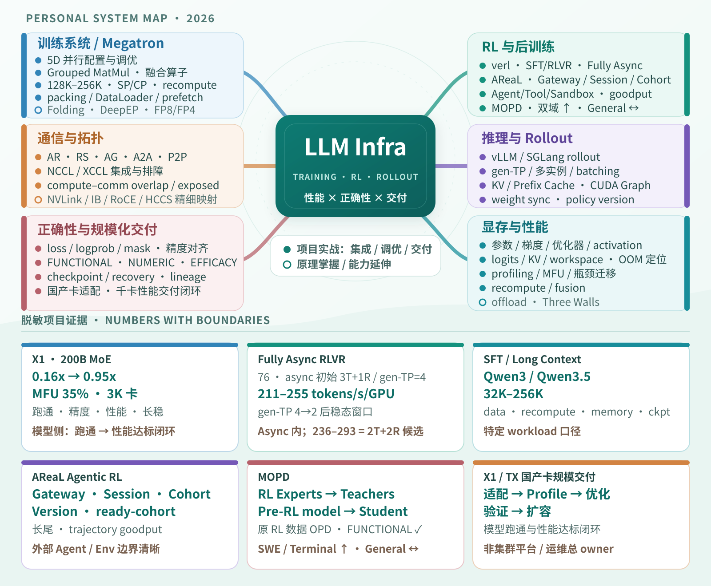
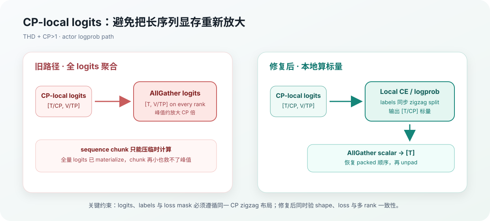
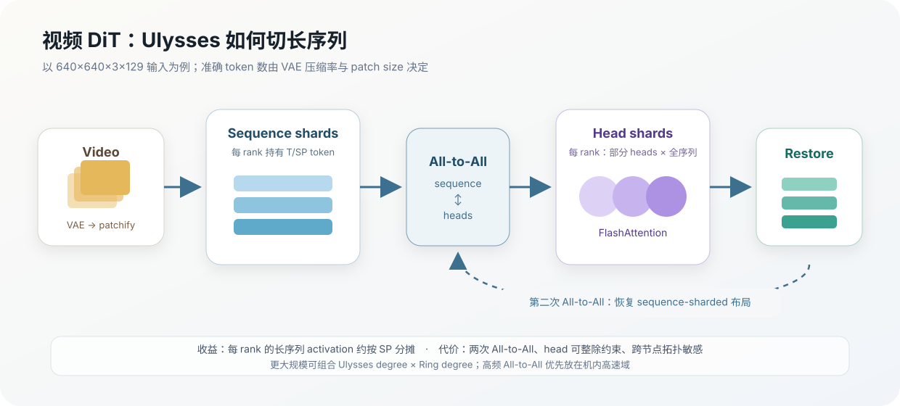
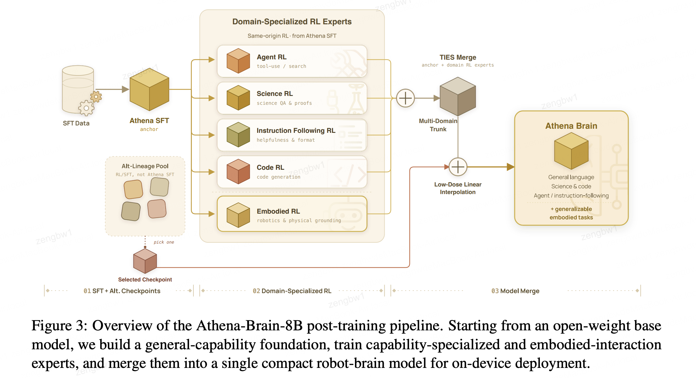
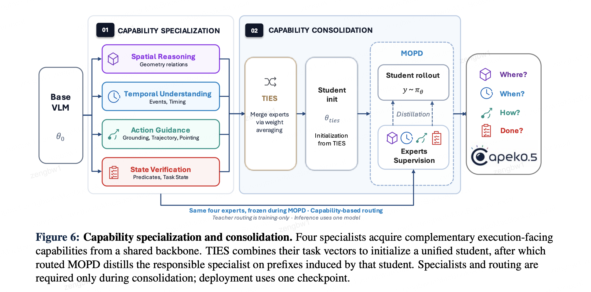
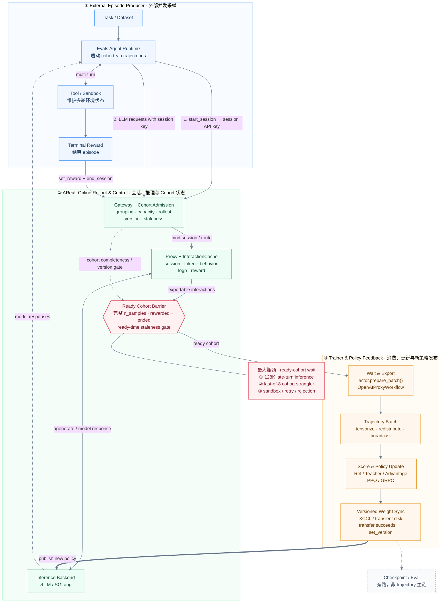
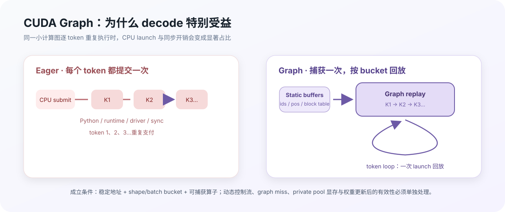
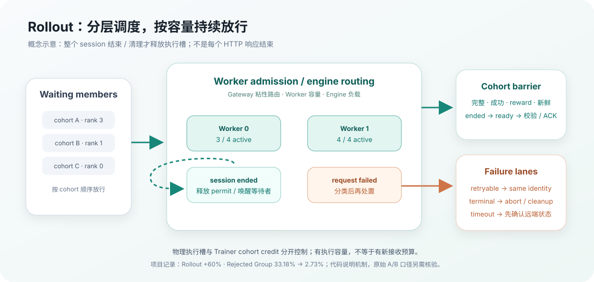

# 大模型训练推理 Infra 高级工程师：三天面试冲刺手册

> - 适用对象：社招大模型训练/推理 Infra 高级工程师
> - 目标档位：当前年薪约 80 万，目标 100–120 万
> - 使用窗口：首轮面试前 3 天
> - 核验日期：2026-09-03
> - 依据：最新投递版 PDF 简历（2026-08-30，本地核验且不在公开仓库记录含手机号文件名）、[项目事实底稿](2026-08-xpeng-infra-resume-materials.md)及文末官方资料

## 0. 先看结论：面试官会如何评估你

这个薪资档位不会只考“知不知道 TP、GRPO、vLLM”。面试官通常在同时验证六件事：

1. **真实性**：数字是不是亲自做出来的，能否说清 workload、基线、变量和统计口径。
2. **机制理解**：知道配置怎么写，还是理解数据流、通信、显存和正确性边界。
3. **工程判断**：能否从现象收敛到一阶瓶颈，并设计最小可证伪实验。
4. **系统能力**：能否跨训练、推理、调度、存储、网络和故障恢复看完整链路。
5. **结果意识**：优化是否守住数值正确性和模型效果，而不是只把 GPU 跑满。
6. **高级工程师成熟度**：是否能定义问题、做取舍、推动交付、复盘并沉淀平台能力。

回答任何技术题都尽量使用“五句法”：

> **结论**是什么 → **机制**为什么 → 当时做了什么**选择** → 用什么**证据**验证 → 结论的**边界**是什么。

如果一个问题没做过，不要把文档知识包装成项目经验。推荐说法是：“这个能力在项目里我主要是使用和调优，不是底层实现 owner；我能从机制和生产排障角度回答。”

<a id="interview-console"></a>
### 0.1 面试现场速查控制台

> **怎么用**：从“项目经历”回答做过什么，从“技术主题”回答机制是什么，从“关键数字”反查项目。点击答案后，浏览器返回按钮、macOS `⌘ + [` 或 Windows/Linux `Alt + ←` 可回到刚才的准确位置；题尾的 Part / 总控制台回链用于可靠兜底。

**现场救急**：[智元训练 Infra（30min）](#vi-0a) · [自我介绍](#resume-01) · [Ownership](#resume-01b) · [职业选择](#resume-01c) · [最有代表性的优化](#resume-01a) · [为什么选 verl / AReaL](#areal-01) · [万卡特有问题](#infra-09) · [技术面反问](#vi-questions-to-ask)

#### 从项目经历进入

| 项目主线 | 高频问题与技术细节 |
|---|---|
| **X1 200B MoE** | [代表性优化](#resume-01a) · [5D 并行](#megatron-01) · [Dense/MoE](#moe-01) · [EP 与 all-to-all](#megatron-06) · [通信算子](#infra-04) · [规模交付](#resume-10) |
| **Long Context SFT** | [31s→9.3s](#resume-05) · [35B-A3B/128K](#resume-17) · [128K/256K 显存](#resume-06) · [7.6GB CP-local logits](#resume-07) · [SP 与 CP](#megatron-04) · [Recompute/Offload](#megatron-09) |
| **Fully Async RLVR** | [同步与异步](#resume-02) · [gen-TP 与实例数](#resume-03) · [HybridFlow](#verl-01) · [Colocate/Disaggregate](#verl-02) · [Streaming/Partial/Staleness](#verl-04) · [RLVR 正确性](#verl-05) |
| **Agentic RL** | [AReaL 训练链路](#resume-08) · [框架选型](#areal-01) · [Off-policyness](#areal-02) · [Gateway 改造](#areal-09) · [CUDA Graph](#resume-13) · [Gateway 调度收益](#resume-19) · [XCCL/Disk](#areal-11) |
| **OPD / MOPD** | [MOPD 主问题](#resume-09) · [PPO/GRPO/DAPO](#rl-algo-01) · [Trajectory→Gradient](#areal-04) · [三层正确性门禁](#areal-08) |
| **TX 文生视频 / 规模化交付** | [HunyuanVideo/Ulysses](#resume-18) · [融合算子](#kernel-01) · [千卡/万卡交付](#resume-10) · [精度对齐](#resume-12) · [万卡规模效应](#infra-09) |

#### 从技术主题进入

| 技术主题 | 高频问题与项目入口 |
|---|---|
| **Megatron / 多维并行** | [5D 并行](#megatron-01) · [Column/Row TP](#megatron-02) · [TP 负优化](#megatron-03) · [SP/CP](#megatron-04) · [Distributed Optimizer](#megatron-05) · [Megatron/FSDP/DeepSpeed/Accelerate](#megatron-11) |
| **MoE** | [Dense 与 MoE](#moe-01) · [EP/EDP 与 A2A](#megatron-06) · [X1 200B MoE](#resume-01a) · [Grouped GEMM/融合](#kernel-01) |
| **显存 / 长上下文** | [Megatron 显存账本](#infra-02) · [128K/256K 显存](#resume-06) · [CP-local logits](#resume-07) · [35B-A3B/128K](#resume-17) |
| **RL 算法 / verl** | [PPO/GRPO/DAPO](#rl-algo-01) · [DPO](#dpo-01) · [HybridFlow](#verl-01) · [Colocate/Disaggregate](#verl-02) · [权重同步](#verl-03) · [Fully Async](#verl-04) · [RLVR 正确性](#verl-05) · [vLLM/SGLang](#verl-09) |
| **AReaL / Agentic RL** | [训练链路](#resume-08) · [框架选型](#areal-01) · [Off-policyness](#areal-02) · [Trajectory Lineage](#areal-04) · [Gateway Ownership](#areal-09) · [XCCL/Disk](#areal-11) · [Gateway 调度](#resume-19) |
| **推理 / Rollout** | [gen-TP](#resume-03) · [vLLM/SGLang](#verl-09) · [CUDA Graph](#resume-13) |
| **通信 / 集群 / 恢复** | [Collective](#infra-04) · [万卡规模效应](#infra-09) · [NCCL/恢复排障](#infra-03) |
| **正确性 / 交付** | [RLVR 正确性](#verl-05) · [Trajectory→Gradient](#areal-04) · [规模交付](#resume-10) |

#### 按关键数字反查

| 简历数字 | 对应问题 |
|---|---|
| [`0.16x → 0.95x / MFU 35%`](#resume-01a) | X1 200B MoE 性能优化 |
| [`31s → 9.3s / 23% → 45.2%`](#resume-05) | Qwen3.5-9B SFT |
| [`128K / 平均 step time 降低约 50%`](#resume-17) | Qwen3.5-35B-A3B |
| [`7.6GB`](#resume-07) | CP-local logits |
| [`76 → 211–255`](#resume-02) | Fully Async RLVR |
| [`6–8x`](#resume-13) | Agentic RL decode / CUDA Graph |
| [`+60% / 33.18% → 2.73%`](#resume-19) | Gateway Rollout 调度 |
| [`3K 卡 / 两个月`](#resume-10) | X1 规模交付 |

---

### 0.2 一张图看懂我的能力主线



> 图例：实心节点表示有项目证据的集成、调优或交付经验，但不自动等于底层算法/kernel 的实现者；空心节点表示原理掌握、证据尚待补齐或今天会评估的能力延伸。

**20–30 秒口述版**：

> 我的主线有两条：一是基于 Megatron 的大模型训练，做过 X1 200B MoE 模型、长上下文和国产卡性能闭环；二是基于 verl/AReaL 的后训练，做过 Fully Async RLVR、Agentic RL 和 MOPD。我主要负责模型侧系统集成、性能与正确性优化，以及从跑通到性能达标的交付闭环。

## 1. 整体视野与问题导航

### 1.1 六个 Part：先知道每一部分解决什么问题

能力图给出个人主线；下面这张表把主线映射到可直接进入的面试 Part。数字按唯一问题计数，Core 是 P0 的子集。

| Part | 解决的核心问题 | 关键入口 | 优先级与题量 |
|---|---|---|---:|
| [Part I](#part-i) | 你是谁、做了什么、为什么值得信任 | 自我介绍、Ownership、职业选择 | Core 3 / P0 3 / P1 3 / P2 1，共 7 |
| [Part II](#part-ii) | 大模型如何放得下、跑得快、扩得稳 | Megatron、5D、MoE、显存、长上下文 | Core 3 / P0 20 / P1 6 / P2 1，共 27 |
| [Part III](#part-iii) | RL dataflow 如何被框架和训练/推理后端承载 | PPO/GRPO/DPO、verl、Fully Async、真实模型落地 | Core 1 / P0 10 / P1 5 / P2 1，共 16 |
| [Part IV](#part-iv) | Agent trajectory 如何在线生产、校验和消费 | AReaL、Gateway、staleness、MOPD、weight sync | Core 2 / P0 10 / P1 7 / P2 1，共 18 |
| [Part V](#part-v) | 跨框架的通信、恢复、推理与生产排障 | Collective、万卡稳定性、训练异常、NCCL、checkpoint | Core 1 / P0 4 / P1 5 / P2 1，共 10 |
| [Part VI](#part-vi) | 如何把知识变成首面表现 | 三天冲刺、口径校准、证据卡、模拟面试 | 不新增问题 |

全文共 **78 道唯一问题**：P0 47 道、P1 26 道、P2 5 道。Core 10 已计入 P0，不重复计数。

### 1.2 Core 10：只剩 3 小时时必须会的十个入口

Core 10 是全部 P0 中的最高优先子集，不等于“本文只有十道重要题”。它们的完整答案只出现在所属 Part；这里仅提供紧急复习顺序。

| 顺序 | 所属 Part | 题目 |
|---:|---|---|
| 1 | Part I | [RESUME-01｜请做一个 1–2 分钟自我介绍](#resume-01) |
| 2 | Part I | [RESUME-01B｜你在项目中的 Ownership 是什么？](#resume-01b) |
| 3 | Part I | [RESUME-01C｜为什么从华为到小鹏，现在为什么又看机会？](#resume-01c) |
| 4 | Part II | [RESUME-01A｜最有代表性的性能优化是什么？](#resume-01a) |
| 5 | Part II | [MEGATRON-01｜Megatron 的“5D 并行”分别解决什么问题？](#megatron-01) |
| 6 | Part II | [INFRA-02｜Megatron 训练显存如何计算？遇到 OOM 怎么定位？](#infra-02) |
| 7 | Part III | [RESUME-02｜Fully Async 相比同步 RLVR 有什么优势？](#resume-02) |
| 8 | Part IV | [RESUME-08｜请画出你的 Agentic RL 训练链路，最大瓶颈在哪里？](#resume-08) |
| 9 | Part IV | [RESUME-09｜OPD/MOPD 解决什么问题？](#resume-09) |
| 10 | Part V | [INFRA-04｜常见通信算子执行什么操作，分别用在哪里？](#infra-04) |

### 1.3 全量问题索引：按 Part 定位，按优先级学习

<details>
<summary><strong>Part I｜个人定位、Ownership 与职业选择（7）</strong></summary>

- **P0 / Core**：[RESUME-01 自我介绍](#resume-01) · [RESUME-01B Ownership](#resume-01b) · [RESUME-01C 职业选择](#resume-01c)
- **P1**：[RESUME-11 第二个 Ownership 案例](#resume-11) · [RESUME-16 带 4–5 人交付](#resume-16) · [BEHAVIOR-01 为什么匹配薪资档位](#behavior-01)
- **P2**：[P2-06 为什么从算法研究转向训练 Infra](#p2-06)

</details>

<details>
<summary><strong>Part II｜Megatron、MoE、训练后端与长上下文（27）</strong></summary>

- **P0 / Core**：[RESUME-01A X1 200B MoE 模型性能优化](#resume-01a) · [MEGATRON-01 5D 并行](#megatron-01) · [INFRA-02 Megatron 显存账本](#infra-02)
- **P0 扩展**：[RESUME-05 SFT 31s→9.3s](#resume-05) · [RESUME-17 35B-A3B 128K](#resume-17) · [RESUME-06 128K/256K 显存](#resume-06) · [RESUME-07 CP-local logits](#resume-07) · [KERNEL-01 NVIDIA 融合算子](#kernel-01) · [RESUME-10 千卡/万卡交付](#resume-10) · [MEGATRON-02 Column/Row Parallel](#megatron-02) · [MEGATRON-03 TP 变大为什么更慢](#megatron-03) · [MEGATRON-04 SP 与 CP](#megatron-04) · [MEGATRON-05 Distributed Optimizer](#megatron-05) · [MOE-01 Dense 与 MoE](#moe-01) · [MEGATRON-06 EP 与 all-to-all](#megatron-06) · [INFRA-01 MFU](#infra-01) · [DIST-01 FSDP/FSDP2 与 ZeRO](#dist-01) · [MEGATRON-11 训练框架分层与选型](#megatron-11) · [SFT-DATA-01 数据到 loss 正确性](#sft-data-01) · [MLLM-01 多模态与具身训练差异](#mllm-01)
- **P1**：[RESUME-18 视频 DiT/Ulysses](#resume-18) · [MEGATRON-07 PP bubble](#megatron-07) · [MEGATRON-08 Packed Sequence](#megatron-08) · [MEGATRON-09 Recompute/Offload](#megatron-09) · [MEGATRON-10 Distributed checkpoint](#megatron-10) · [BRIDGE-01 MBridge/Megatron Bridge](#bridge-01)
- **P2**：[P2-02 FlashAttention](#p2-02)

</details>

<details>
<summary><strong>Part III｜RL 算法、verl 与 Fully Async RLVR（16）</strong></summary>

- **P0 / Core**：[RESUME-02 Fully Async RLVR](#resume-02)
- **P0 扩展**：[RL-ALGO-01 PPO/GRPO/DAPO](#rl-algo-01) · [DPO-01 DPO 与 SFT/PPO/GRPO](#dpo-01) · [RESUME-03 gen-TP 与实例数](#resume-03) · [VERL-01 HybridFlow 架构](#verl-01) · [VERL-02 colocate/disaggregate](#verl-02) · [VERL-03 训练到 rollout 权重同步](#verl-03) · [VERL-04 async/streaming/partial/staleness](#verl-04) · [VERL-05 RLVR 正确性](#verl-05) · [VERL-09 vLLM/SGLang 选型](#verl-09)
- **P1**：[VERL-06 DataProto/WorkerGroup](#verl-06) · [VERL-07 Actor/Ref/Critic/Reward](#verl-07) · [VERL-08 Ray 故障](#verl-08) · [VERL-10 v0.7 以后演进](#verl-10) · [VERL-11 自研版 verl 模型落地](#verl-11)
- **P2**：[P2-05 producer-consumer coding](#p2-05)

</details>

<details>
<summary><strong>Part IV｜AReaL、Gateway、Agentic RL 与 MOPD（18）</strong></summary>

- **P0 / Core**：[RESUME-08 Agentic RL 链路](#resume-08) · [RESUME-09 OPD/MOPD](#resume-09)
- **P0 扩展**：[AREAL-01 verl/AReaL 选型](#areal-01) · [AREAL-02 off-policyness](#areal-02) · [AREAL-03 微服务化](#areal-03) · [AREAL-04 trajectory→gradient](#areal-04) · [AREAL-09 Gateway 改造](#areal-09) · [AREAL-11 XCCL 与 disk](#areal-11) · [RESUME-13 CUDA Graph](#resume-13) · [RESUME-19 Gateway 调度收益](#resume-19)
- **P1**：[RESUME-14 Prefix Cache](#resume-14) · [RESUME-15 Rejected Group](#resume-15) · [AREAL-05 Partial Rollout](#areal-05) · [AREAL-06 原子 weight sync](#areal-06) · [AREAL-07 Online Proxy/session drain](#areal-07) · [AREAL-10 外部 Agent 接入](#areal-10) · [AREAL-08 三层门禁](#areal-08)
- **P2**：[P2-04 设计 256K Agentic RL 平台](#p2-04)

</details>

<details>
<summary><strong>Part V｜通用 Infra 与生产排障（10）</strong></summary>

- **P0 / Core**：[INFRA-04 通信算子](#infra-04)
- **P0 扩展**：[TRAIN-ANOMALY-01 loss/NaN/梯度/收敛排障](#train-anomaly-01) · [INFRA-09 万卡规模效应与优化](#infra-09) · [INFRA-03 NCCL hang/checkpoint 恢复](#infra-03)
- **P1**：[RESUME-12 精度对齐](#resume-12) · [INFRA-05 64 卡 35B MoE 128K](#infra-05) · [INFRA-06 推理吞吐/延迟/KV](#infra-06) · [INFRA-07 可观测性指标树](#infra-07) · [INFRA-08 可恢复 checkpoint](#infra-08)
- **P2**：[P2-03 kernel/带宽/通信瓶颈](#p2-03)

</details>

推荐用法：先完成 Core 10，再按目标岗位选择 Part；每个 Part 内按 P0 → P1 → P2 深挖。顶部索引与 Part 局部导航都指向同一份正文，不复制答案。三天安排和统一口径集中在 [Part VI 的冲刺区](#vi-0)，不打断题目主线。

---

<a id="part-i"></a>
## Part I｜个人定位、Ownership 与职业选择

**学习目标**：先建立面试官对你的职业主线、个人贡献和稳定性的判断；所有技术深挖都从这里选择入口。

**本 Part 导航**：Core：[RESUME-01](#resume-01) · [RESUME-01B](#resume-01b) · [RESUME-01C](#resume-01c)；P0 扩展：无；P1：[RESUME-11](#resume-11) · [RESUME-16](#resume-16) · [BEHAVIOR-01](#behavior-01)；P2：[P2-06](#p2-06)。

### Core｜最高优先入口

<a id="resume-01"></a>
#### RESUME-01｜请做一个 1–2 分钟自我介绍（P0，12 分钟）

- **问题**：请介绍一下你自己，重点讲与大模型训练推理 Infra 相关的经历。
- **面试官意图**：判断你的职业主线、表达能力和 seniority；同时选择后续深挖入口。
- **精准回答**：

  > 面试官您好，我叫曾柏炜，本科毕业于厦门大学电气工程及其自动化专业，硕士毕业于清华大学电子信息专业，研究方向是人工智能。我目前在小鹏机器人负责大模型后训练基础设施，主要有两条主线。第一条是基于 verl 和 Megatron-Core 建设 SFT/RLVR 能力，覆盖 Qwen3/Qwen3.5 dense/MoE、32K–256K 长上下文，以及 vLLM/SGLang rollout；我做过 fully async RLVR 资源解耦，把代表性稳态吞吐从 76 提升到 211–255 tokens/s/GPU，也做过 128K SFT 的数据、重计算和显存优化。第二条是基于 AReaL 建设 Agentic RL 和在线蒸馏链路，重点解决 rollout 长尾、trajectory 利用、policy staleness、跨引擎权重同步和多 Teacher 路由正确性。此前在华为负责大模型迁移、性能/精度优化和千卡级集群长稳交付。我擅长的不只是把任务跑通，而是用指标和实验同时闭环性能、数值正确性、模型效果与故障恢复。

- **项目证据或知识边界**：所有数字必须能回到固定 workload。自我介绍只说“多 Teacher 在线蒸馏链路和方向性效果结论”；被追问时再使用“最新版双 Teacher MOPD 在 SWE、Terminal 双域提升且 General 不下降”，不主动混入单 Teacher pp 数字，也不暗示统计信息已全部补齐。
- **高概率追问**：[最有代表性的优化](#resume-01a)是什么？你在项目中的 [ownership](#resume-01b)？[为什么从华为到小鹏、现在又看机会](#resume-01c)？
- **危险回答**：连续罗列十几个框架；教育背景超过 10–15 秒或展开课程、论文和奖项；说“全栈负责”却说不清代码和实验边界。

↩ [返回本 Part 导航](#part-i) · ↑ [返回面试速查控制台](#interview-console)

<a id="resume-01b"></a>
#### RESUME-01B｜你在项目中的 Ownership 是什么？（P0，10 分钟）

- **问题**：Ownership 是什么意思？X1 项目里哪些事情是你负责的，哪些是框架或团队完成的？
- **面试官意图**：判断你是否达到高级工程师所需的端到端责任能力，同时拆分个人贡献、开源能力和团队红利。
- **Ownership 的含义**：

  > Ownership 不是“所有代码都是我写的”，而是我对一个边界清晰的问题从目标定义、技术方案、关键实现、跨团队推进到上线验收承担端到端责任；出现风险时，我负责暴露问题、组织决策并把结果闭环。

- **精准回答**：

  > 在 X1 200B MoE 模型项目里，我的 scope 是把模型从功能和精度可用推进到性能达标，并保障大规模训练落地。技术决策上，我负责建立性能基线和瓶颈分解，主导并行配置实验、Grouped MatMul 和融合算子的接入验证，以及通信 profile 和 overlap 方案收敛；执行上，我亲自做关键配置、A/B 实验、精度对齐和问题定位。项目依赖 Megatron/MindSpeed 框架、底层算子团队、硬件和集群运维，这些不是我一个人实现的；我的责任是定义接口和验收标准，把框架、算子和客户侧问题拉到同一条因果链上。结果上，我对 0.16x 到 0.95x、MFU 35%、上线门禁和 3K 卡连续稳定训练两个月的模型侧保障负责。上线后出现性能回退或训练故障，我也是第一接口人，负责组织定位、回归和复盘。没有我并不是“没人能写代码”，而是项目会缺少一个对端到端结果负责、能让多个团队围绕同一基线收敛的 owner。

- **回答模板**：`Scope → Decision → Execution → Coordination → Outcome`。每一层至少准备一个“我”开头的具体动作。
- **项目证据或知识边界**：准备一项亲自改动、一项关键实验、一项被你否决的方案和一次跨团队闭环。明确哪些融合算子是直接使用、哪些是适配或修改，不能把 Megatron/MindSpeed 原生能力说成自研。
- **高概率追问**：最终方案谁拍板？你写了哪些模块？底层算子不是你写的，为什么结果算你的？如果没有你项目最可能卡在哪里？失败时你承担什么责任？
- **危险回答**：“我全栈负责”“基本都是我做的”；只讲协调不讲技术判断；只讲代码不讲上线结果；用团队总成果替代个人边界。

↩ [返回本 Part 导航](#part-i) · ↑ [返回面试速查控制台](#interview-console)

<a id="resume-01c"></a>
#### RESUME-01C｜为什么从华为到小鹏，现在为什么又看机会？（P0，8 分钟）

- **问题**：两次职业选择的原因是什么？如何证明你加入后会稳定发展？
- **面试官意图**：判断离职动机是否客观、职业主线是否连续，以及地点、组织变化和岗位期望是否与招聘岗位匹配。
- **精准回答**：

  > 从华为到小鹏主要有两个原因。首先是客观地点因素：当时部门有整体搬迁上海的安排，而我的家庭和长期定居规划都在深圳，所以我希望选择一个能在深圳长期发展的机会。其次是职业发展因素：华为让我积累了大模型迁移、昇腾性能和精度优化、千卡集群交付经验，但工作与特定硬件和客户交付场景结合较深；我希望把能力扩展到更通用的 GPU、Megatron-Core、后训练和 RL Infra 技术栈。小鹏当时在地点和技术方向上都比较匹配，所以我选择加入。
  >
  > 这次看机会的直接触发因素是当前部门正在进行比较大的组织架构调整，团队方向和岗位边界存在一定不确定性。但我不是单纯因为调整就离开，我真正寻找的是深圳长期稳定的机会，能够继续深耕大模型训练、后训练和训练推理 Infra，并对核心系统承担清晰、完整的 ownership。地点、技术方向和职责如果匹配，我倾向于长期发展。

- **项目证据或知识边界**：面试只说“家庭和长期定居规划在深圳”，不主动展开结婚、生娃和买房；只看深圳可以坦诚，但宝安、南山及周边的通勤范围留到 HR 确认办公地点时再说。
- **高概率追问**：如果小鹏组织稳定是否还会看机会？为什么入职不到一年？你只看深圳会不会限制发展？什么条件能让你长期留下？
- **危险回答**：“在华为是螺丝钉、自由度低、会的太少”“小鹏现在很不稳定”；过度讨论家庭安排；把组织调整说成唯一原因；表示只要薪资更高就离开。

↩ [返回本 Part 导航](#part-i) · ↑ [返回面试速查控制台](#interview-console)

### P0 扩展｜首轮前应掌握

本 Part 无额外 P0；完成 Core 后直接进入 P1 深挖。

### P1 深挖｜面试官继续追问

<a id="resume-11"></a>
#### RESUME-11｜如何用第二个项目证明 Ownership 不是背模板？（P1，8 分钟）

- **问题**：除了 X1，再用小鹏项目说明一次你的 ownership，哪些来自开源框架或团队？
- **面试官意图**：验证 [RESUME-01B](#resume-01b) 的定义是否可以迁移到不同项目，而不是只会背一个华为案例。
- **精准回答**：继续使用 `Scope → Decision → Execution → Coordination → Outcome`，但改讲 Fully Async 资源模型、CP chunking、trajectory lineage 或 MOPD 路由；必须给出一个亲自改动、一个关键判断、一个依赖团队和一个验收结果。
- **项目证据或知识边界**：不要重复 X1 故事；不要把 verl/AReaL/Megatron 开源能力描述成自研。若选 MOPD，效果只使用“最新版双 Teacher 在 SWE、Terminal 双域提升且 General 不下降”，并把个人工程贡献与算法/评测团队贡献拆开。
- **高概率追问**：关键设计谁拍板？如果没有你项目会怎样？你 review 过哪些核心模块？
- **危险回答**：反复使用“我们”；用 PR 数代替技术贡献；把所有收益都归因给自己。

↩ [返回本 Part 导航](#part-i) · ↑ [返回面试速查控制台](#interview-console)

<a id="resume-16"></a>
#### RESUME-16｜你如何带 4–5 人完成复杂交付？（P1，8 分钟）

- **问题**：请讲一次技术负责人/项目负责人的具体做法。
- **面试官意图**：评估高级工程师的带项目能力，而不仅是个人贡献。
- **精准回答**：按目标/验收拆成模型适配、精度、性能、集群/现网问题；定义 owner、接口、优先级和风险；用统一复现模板和 daily blocker 收敛；关键问题亲自下钻，最终沉淀基线 recipe、故障库和客户交付件。
- **项目证据或知识边界**：华为 TX 项目有 4–5 人团队经验；说明是项目协同还是正式 people management。
- **高概率追问**：成员意见冲突怎么办？如何判断自己下钻还是授权？怎样评价交付质量？
- **危险回答**：只讲开会和催进度；把协调当管理的全部；没有技术验收机制。

↩ [返回本 Part 导航](#part-i) · ↑ [返回面试速查控制台](#interview-console)

<a id="behavior-01"></a>
#### BEHAVIOR-01｜为什么你匹配 100–120 万档位？（P1，10 分钟）

- **问题**：相比普通训练工程师，你的不可替代性是什么？
- **面试官意图**：评估价值密度、稳定性、动机与薪资合理性，不是邀请你直接报数字。
- **精准回答**：强调三类复合能力：Megatron/verl/AReaL 的框架集成与二次开发；从长上下文、异步 rollout 到千卡集群的性能/稳定性闭环；能把模型效果、数值正确性和 Infra 交付放在同一验收体系。用 2–3 个量化项目证明，并说明下一岗位希望承担平台/核心模块 owner，而非只寻求涨薪。
- **项目证据或知识边界**：当前工作年限约 3 年多，高薪档位会追问深度和影响范围；补齐服务用户数、GPU-hours、默认 recipe/主干贡献等业务影响数据。
- **高概率追问**：为什么现在换工作？期望总包结构？若达不到怎么办？
- **危险回答**：只用学历/大厂背景论证；把目标薪资作为换工作唯一原因；虚构团队影响。

↩ [返回本 Part 导航](#part-i) · ↑ [返回面试速查控制台](#interview-console)

### P2 选学｜时间允许再补

<a id="p2-06"></a>
#### P2-06｜为什么从算法研究转向训练 Infra？（P2，6 分钟）

- **问题**：你的 MICCAI/AAAI 经历如何帮助当前工作？
- **面试官意图**：评估职业动机、学习能力和长期稳定性。
- **精准回答**：研究经历训练了实验设计、数值验证和论文阅读；华为/小鹏经历让你确认更擅长把模型方法转成可扩展、可恢复、可验证的系统。Infra 不是离开算法，而是用系统能力缩短算法迭代周期并守住正确性。
- **项目证据或知识边界**：可引用论文和两个阶段的职业转变，不需展开病理图像算法细节。
- **高概率追问**：未来更想做训练还是推理？是否愿意写底层 C++/CUDA？
- **危险回答**：“算法太卷所以转 Infra”；把 Infra 描述成部署运维；职业方向摇摆。

↩ [返回本 Part 导航](#part-i) · ↑ [返回面试速查控制台](#interview-console)

### 本 Part 追问路线

自我介绍 → X1/Fully Async/AReaL 三选一 → Ownership → 职业选择；谈薪时再进入岗位价值与 100–120 万档位匹配度。

---

<a id="part-ii"></a>
## Part II｜Megatron、MoE、训练后端与长上下文

**学习目标**：用 X1 200B MoE 模型和长上下文 SFT 证明训练系统基本盘：框架选型、数据契约、并行、显存、算子、通信、精度与规模交付，并能把能力迁移到多模态/具身训练。

**本 Part 导航**：Core：[RESUME-01A](#resume-01a) · [MEGATRON-01](#megatron-01) · [INFRA-02](#infra-02)；P0 扩展：[RESUME-05](#resume-05) · [RESUME-17](#resume-17) · [RESUME-06](#resume-06) · [RESUME-07](#resume-07) · [KERNEL-01](#kernel-01) · [RESUME-10](#resume-10) · [MEGATRON-02](#megatron-02) · [MEGATRON-03](#megatron-03) · [MEGATRON-04](#megatron-04) · [MEGATRON-05](#megatron-05) · [MOE-01](#moe-01) · [MEGATRON-06](#megatron-06) · [INFRA-01](#infra-01) · [DIST-01](#dist-01) · [MEGATRON-11](#megatron-11) · [SFT-DATA-01](#sft-data-01) · [MLLM-01](#mllm-01)；P1：[RESUME-18](#resume-18) · [MEGATRON-07](#megatron-07) · [MEGATRON-08](#megatron-08) · [MEGATRON-09](#megatron-09) · [MEGATRON-10](#megatron-10) · [BRIDGE-01](#bridge-01)；P2：[P2-02](#p2-02)。

### Core｜最高优先入口

<a id="resume-01a"></a>
#### RESUME-01A｜最有代表性的性能优化是什么？（P0，20 分钟）

- **问题**：请讲一个你最有代表性的优化案例，最好能体现大模型训练 Infra 的系统能力。
- **面试官意图**：验证你能否把超大 MoE 的性能问题拆成并行映射、kernel、通信、显存、精度和规模化稳定性问题；同时检查 `0.16x → 0.95x` 是否有明确口径和个人贡献。
- **60–120 秒主答**：

  > 我最有代表性的案例是在华为 X1 项目中，对一个 200B MoE 预训练模型做性能优化。我负责的范围从功能打通、精度对齐一直到性能达标和 3K 卡训练保障。接手时，相对客户对标口径的性能只有 0.16x；我没有从单个算子开始盲调，而是先固定模型、batch、序列长度、精度和卡数，用 profile 定位瓶颈。用 NVIDIA 2026 年报告的后验框架概括，就是 Memory Wall、Communication Wall 和 Compute Efficiency Wall。第一类是并行和显存：联合评估 TP、PP、DP、EP 等切分，目标是在模型可放下的前提下，避免把 expert GEMM 切得过碎。第二类是计算效率：使用 Grouped MatMul 聚合多个 expert 的小矩阵计算，并使能实际验证过的融合算子，减少中间张量、内存搬运和 kernel launch。第三类是通信：分别分析 TP/DP collective、EP token dispatch 和 PP P2P，把没有依赖的通信与计算做 overlap，同时检查额外 buffer 和带宽竞争。每轮优化后都重新 profile，并通过逐层精度对齐和长稳训练验收。最终相对性能从 0.16x 提升到 0.95x，MFU 达到 35%，并支撑 3K 卡连续稳定训练两个月。这个项目最重要的不是某个开关，而是持续识别瓶颈迁移并同时守住性能、精度和稳定性。

- **2–3 分钟展开版**：按下面五层展开，不要把未确认项说成已经实施。

  1. **先固定 benchmark**：补齐 `0.16x/0.95x` 的分母，以及模型层数、专家数/top-k、global/micro batch、sequence length、precision、卡数、warmup 和统计窗口；否则数字没有解释力。
  2. **并行与拓扑**：从容量可行的 TP/PP/DP/EP 候选中选择吞吐更高的组合。MoE 的 expert 通常已经是小 GEMM，过高 expert-TP 可能进一步碎片化计算；但最终映射必须结合当时实际 HCCS/RoCE 拓扑、collective 频率和消息量说明。面试前补齐真实并行度和通信 group 到物理拓扑的映射。
  3. **计算效率**：Grouped MatMul 把不同 expert 的可变 token batch 聚合调度，提高硬件利用率；融合算子要解释具体融合了什么、减少了哪些读写或 launch。准备实际使用过的 2–3 个算子名，以及各自 A/B 收益，不能泛称“各种融合算子”。
  4. **通信掩盖**：按 TP/DP collective、EP dispatch/combine 和 PP P2P 分别看 exposed time。准备一条当时真实的 overlap timeline，说明 compute/communication 的依赖如何解除、使用了什么 stream/chunk/schedule，以及为什么 overlap 后没有因资源争用拖慢 GEMM。
  5. **显存、精度和规模化**：只讲确认使用过的显存手段，例如实际的 optimizer 分片、sequence parallel、recompute 或 buffer 复用；融合和低精度路径用逐层 dump 找 first divergence。最后从小规模功能/精度基线扩到 3K 卡，验证 loss、吞吐、checkpoint 和故障恢复。

- **结合 NVIDIA 2026 MoE 报告可以补充什么**：以下是今天继续演进时会评估的方向，不是 X1 当时已经落地的成果。NVIDIA 将 MoE 优化概括为 Memory Wall、Communication Wall 和 Compute Efficiency Wall，并强调三者会互相迁移。[技术报告](https://arxiv.org/abs/2603.07685)、[Megatron Core MoE README](https://github.com/NVIDIA/Megatron-LM/blob/main/megatron/core/transformer/moe/README.md)

  - **Parallel Folding**：把 attention 的 TP/CP/DP 与 MoE 的 ETP/EP/EDP 解耦，让 dense attention 和 sparse expert 分别使用适合自己的并行映射。
  - **Optimized dispatcher**：根据 GPU 拓扑评估 DeepEP/HybridEP，减少 EP 跨节点冗余搬运并提高带宽利用率。
  - **更细的 EP overlap**：用 merged FWD-BWD、独立 compute/comm stream 和 Wgrad/Dgrad split 扩大 all-to-all 的隐藏窗口。
  - **显存换并行效率**：fine-grained recomputation、pipeline-aware activation offloading 和 precision-aware optimizer 不只是为了避免 OOM，也可能让系统降低 TP/PP、恢复更大的 GEMM。
  - **kernel 与低精度**：router/permutation fusion、FP8/FP4 grouped quantization + Grouped GEMM，以及对 dropless MoE 采用 partial CUDA Graph；回答时要说明动态 expert shape 与静态 graph 的冲突。

- **项目证据或知识边界**：可以口述 X1、200B MoE 模型、`0.16x → 0.95x`、MFU 35% 和 3K 卡连续稳定训练两个月；对外简历继续脱敏。客户真实名称不写入或展示。上述 NVIDIA 新方案必须使用“今天会评估”，不能倒灌成 2023–2024 年项目事实。
- **高概率追问**：`0.16x` 的分母是什么？实际 TP/PP/DP/EP 怎么配？Grouped MatMul 为什么有效？EP all-to-all 占比多少？load imbalance 怎么测？哪项优化收益最大？为什么 MFU 只有 35%？
- **危险回答**：从头到尾罗列开关；把总收益全部归因给 Grouped MatMul；无法给出真实并行配置和融合算子名；把 NVIDIA 2026 的 DeepEP、Parallel Folding 或 CUDA Graph 说成当时已实施。

↩ [返回本 Part 导航](#part-ii) · ↑ [返回面试速查控制台](#interview-console)

<a id="megatron-01"></a>
#### MEGATRON-01｜Megatron 的“5D 并行”分别解决什么问题？（P0，15 分钟）

- **问题**：TP、PP、DP、CP、EP 如何组合？总 GPU 数怎么计算？
- **面试官意图**：检查分布式训练基本盘，以及你能否按模型/序列/拓扑选择并行策略。
- **60–90 秒主答**：

  > DP 切 batch、复制模型；TP 切层内大矩阵，解决单层容量和计算，但每层都有高频 collective；PP 按层切深度，解决整模型容量但引入 pipeline bubble；CP 持久切分 sequence 和几乎全部 activation，服务长上下文，attention 需要跨 CP rank 交换 KV；EP 把 MoE experts 分散到不同 rank，引入动态 token dispatch/combine all-to-all。关键点是“5D”不等于五个轴在所有模块机械相乘。Parallel Folding 下，Attention 和 Expert 是同一批物理 rank 的两套 logical mapping：`TP_attn×CP_attn×DP_attn×PP = ETP_moe×EP_moe×EDP_moe×PP = world_size`。选型时先满足参数和 activation 容量，再把 TP 等高频通信放在 NVLink/NVSwitch 域，联合考虑 CP 的 KV 通信和 EP 的 all-to-all，最后用 profile 在通信、GEMM 粒度和 bubble 之间收敛。

- **MoE world-size 的正确口径**：

  ```text
  Dense / Attention：world_size = TP × CP × DP × PP
  MoE / Expert：     world_size = ETP × EP × EDP × PP

  每个 PP stage 内：TP × CP × DP = ETP × EP × EDP
  ```

  左右两边是同一批 rank 的两套 process-group mapping，不能再彼此相乘。`ETP` 是 Expert Tensor Parallel，不能默认等于 Attention TP。Parallel Folding 论文的单 PP-stage 示例是：

  ```text
  Attention：TP=2 × CP=2 × DP=2 = 8
  Expert：   ETP=1 × EP=8 × EDP=1 = 8
  ```

  论文端到端配置若再取 `PP=2`，完整作业就是 16 GPU。Megatron 官方 MoE Guide 还给出 256 GPU 示例：Attention 为 `TP4×CP2×DP8×PP4`，Expert 为 `ETP1×EP64×EDP1×PP4`，两边都等于 256。

- **为什么有时又会看到 `DP=EP×EDP`**：按当前 Megatron 的 Expert Data Parallel 定义，若传统布局取 `ETP=TP`，expert rank pool 还包含 CP，因此严格关系是：

  ```text
  CP × DP = EP × EDP
  world_size = TP × CP × PP × DP
             = TP × PP × EP × EDP       # when ETP = TP
  ```

  即 `EDP=CP×DP/EP`。只有 `CP=1`，或 legacy 资料把 expert-DP 定义为不含 CP 的子维度时，才可简写 `DP=EP×EDP`；回答前必须先声明定义。它仍只是传统 nested layout 的特例，不是通用 MoE 公式。

- **官方示例中的 DP、EP、EDP group 怎么理解**：

  - 纯 Dense DP 轴：固定 `(PP, TP, CP)`，只改变 `DP`，表示不同数据副本；`m=GBS/(MBS×DP)` 中使用这个 DP。
  - Dense `dp_cp` group：固定 `(PP, TP)`，覆盖 `DP×CP` ranks。CP ranks 也复制 Dense 参数并贡献局部 context 的梯度；Megatron 默认在该 group 上做 Dense 梯度归约和 Distributed Optimizer 分片。
  - EP group：固定 `(PP, ETP, EDP)`，改变 `EP`，持有不同 expert shard，负责 token all-to-all。
  - EDP group：固定 `(PP, ETP, EP)`，改变 `EDP`，持有同一 expert shard 的副本并同步梯度。

- **TP/CP 哪个优先放单机**：TP 通信发生在每层、每个 microbatch，通常先保证 TP 在 NVLink/NVSwitch 域；若 `TP×CP` 能放进单机，再把二者一起留在高速域。放不下时优先保持 TP 单机，并考虑 hierarchical CP，让内层 CP 本地、外层 CP 跨节点；MoE 还要同时评估 EP all-to-all，不能脱离消息量、overlap 和实测 profile 给绝对答案。

- **PP bubble 怎么算，VPP 解决什么问题**：设 `p` 是物理 PP stages，`m=GBS/(MBS×DP)` 是每次 iteration 的 microbatch 数，stage 均衡且忽略通信时，non-interleaved 1F1B 有：

  ```text
  useful_time = m × (t_f + t_b)
  bubble_time = (p - 1) × (t_f + t_b)
  bubble / useful = (p - 1) / m
  bubble / total  = (p - 1) / (m + p - 1)
  ```

  面试官问“额外开销”常用第一式，问“占总时间比例”用第二式。优化顺序是减小 `p`、在 GEMM 和收敛允许时增加 `m`、按真实计算量平衡 stage、再使用 VPP/interleaved 1F1B 和 P2P overlap。`VPP=v` 不增加 GPU，而是把模型切成 `p×v` 个 virtual chunks，每个物理 rank 持有多个不连续 chunk；在 interleaved 1F1B 中，若 `v` 个 chunks 的 forward/backward 近似均衡，microbatch/layer divisibility 或 custom pipeline layout 满足调度约束，并先忽略新增通信，理想 `bubble/useful≈(p-1)/(m×v)`。代价是 P2P 次数约增大 `v` 倍、activation 生命周期和调度更复杂，chunk 太小还会损害 kernel efficiency。

- **深入阅读**：[Megatron 5D 并行：每一维的动机、实现、通信、组合和考察方式](../training-infra-roadmap/topics/distributed_training.md#five-d-framework)；[MoE Parallel Folding：双逻辑网格、公式、8/256 GPU 示例和排障](../training-infra-roadmap/topics/moe.md#parallel-folding)。
- **项目证据或知识边界**：你有 Megatron 后端的配置、集成与调优经验；不要声称设计了全部并行算法。
- **高概率追问**：为什么 Dense optimizer shard group 可能是 `DP×CP`，但 microbatch 数只除以 DP？ETP 为什么不一定等于 TP？VPP 与 Zero-Bubble 有何区别？
- **危险回答**：把 `TP×CP×EP×DP` 当通用公式；把 Attention TP 和 ETP 混为一谈；把 SP/VPP 当成额外 world-size 维度；只背定义不谈通信、GEMM 粒度和拓扑。

↩ [返回本 Part 导航](#part-ii) · ↑ [返回面试速查控制台](#interview-console)

<a id="infra-02"></a>
#### INFRA-02｜Megatron 训练显存如何计算？遇到 OOM 怎么定位？（P0，18 分钟）

- **问题**：请建立一份 Megatron 训练显存账本，并说明它如何指导 OOM 定位。
- **面试官意图**：检查你能否把 dtype、并行组、张量 shape 和生命周期统一到每-rank peak memory，而不是只会尝试减 batch、重计算和 offload。
- **60–90 秒主答**：

  > 我会先固定模型、dtype、MBS/GBS、sequence length、TP/PP/CP/EP/DP、recompute 和 kernel，再按每个 rank 建账，而不是用总参数量乘一个常数。总账分成 persistent model states 和 phase-local transient memory：参数、梯度、FP32 main param、Adam state 属于常驻项；saved activation、logits、通信 buffer 和 kernel workspace 要按 forward、backward、optimizer、checkpoint 的真实生命周期取最大并发峰值，不能把各阶段峰值机械相加。模型状态按本 rank 在 TP/PP/EP 后实际持有的参数量乘官方 bytes/param；Dense distributed optimizer 的 `d` 默认取 `DP×CP` 的 `dp_cp` group，Expert 则取 EDP group。activation 按 tensor shape、dtype、live copies 和 PP 在途 microbatch 算；CP/SP/recompute 只除它们真正分片或重算的张量。理论账完成后，我会按阶段采集 `allocated/reserved/max_memory_allocated` 和 memory snapshot，定位第一笔超出账本的 allocation，再选择对应优化，并同时回归 loss、吞吐和长稳。

- **总账公式：先按生命周期去重**：

  ```text
  M_peak ≈ M_persistent
         + max_phase(
             M_saved_activation
           + M_phase_temp
           + M_phase_workspace
           + M_phase_comm
           )
         + M_allocator_overhead_at_peak

  tensor_bytes = product(tensor_shape) × dtype_bytes × live_copies
  ```

  `phase` 至少区分 initialization、forward、backward、optimizer、checkpoint/weight sync。每块内存只归入一个生命周期；例如 forward workspace 不能再叠加到 optimizer 峰值。`reserved-allocated` 包含 allocator cache、rounding 和不可用碎片，不能全部叫 fragmentation。

- **第一本账：参数、梯度和 Adam 状态**。Megatron Core Distributed Optimizer 官方理论值如下，`d` 是该类参数实际使用的 optimizer sharding group size：

  | 参数/梯度 dtype | 普通 optimizer | Distributed Optimizer |
  |---|---:|---:|
  | FP16 param + FP16 grad | 20 bytes/param | `4 + 16/d` |
  | BF16 param + FP32 grad | 18 bytes/param | `6 + 12/d` |
  | FP32 param + FP32 grad | 16 bytes/param | `8 + 8/d` |

  表里的 `/param` 乘的是**本 rank 在模型并行之后持有的参数量**，不是全模型参数量：

  - Dense/Attention 参数按 TP、PP 和真实 layer placement 切；普通 DP/CP 不切参数。
  - Expert 参数按 ETP、EP、PP 和 expert placement 切。
  - Dense 状态默认 `d_dense=DP×CP`；若配置多个 distributed optimizer instances，取实际 `intra_dp_cp` group size。
  - Expert 状态默认 `d_expert=EDP`；多个 instances 时取实际 `intra_expt_dp` group size。
  - embedding、LM head、router、shared expert、MTP 和 uneven PP layout 单列；first/last stage 往往不能用“总参数/PP”估算。

- **第二本账：activation**：

  1. 从每层保存到 backward 的 tensor shape 开始，乘 dtype 和 live copies，再乘该 PP rank 同时在途的 microbatch 数。
  2. CP 将 local sequence 降为 `S/CP`，参数显存不随 CP 降低；SP 只在 TP 配套区域分片部分重复 activation，不能把全部 activation 无条件再除以 TP。
  3. PP 只减少本 stage 的层数；warmup/steady/cooldown 的 activation peak 取决于 schedule 和 in-flight microbatches，不能简单除以 PP。
  4. selective/full recompute 减少 saved tensors，但会在 backward 前重算；FlashAttention 避免显式 materialize 完整 `S×S` attention matrix，但其他 activation 和 workspace 仍存在。

  Megatron 的 [`theoretical_memory_usage.py`](https://github.com/NVIDIA/Megatron-LM/blob/main/megatron/training/theoretical_memory_usage.py) 可以作为估算起点，但它的 activation 公式带有 BF16、SP、selective recompute 和特定模型结构等假设；复杂 MoE 仍要回到真实 tensor shape。

- **第三本账：logits、loss 和容易漏掉的 buffer**：

  ```text
  M_logits = local_active_tokens × local_vocab_size
           × dtype_bytes × live_copies
  ```

  要确认 token 是否已按 CP/packing/chunking 变成本地值、vocab 是否仍是 TP shard、loss 是否把 BF16 logits upcast 到 FP32，以及 fused/vocab-parallel cross entropy 是否避免 full-vocab/all-token logits 常驻。除此之外还要单列 contiguous param/main-grad buffer、gradient accumulation、all-gather/reduce-scatter 和 NCCL overlap bucket、GEMM/FlashAttention/Grouped GEMM workspace、临时 cast、CUDA Graph private pool、checkpoint/权重转换临时副本和 allocator overhead。

- **面试现场的手算顺序**：

  1. 写出 parallel map，先算每个 PP rank 的 Dense 与 Expert `P_local`，找参数最重的 stage/rank。
  2. 选 dtype 行，用 `P_local × bytes/param(d)` 算模型状态；注意 Dense 的 `d_dense` 和 Expert 的 `d_expert` 不同。
  3. 用 `B_local、S/CP、H、num_layers_local、in-flight microbatches` 计算 saved activation，再应用 SP/recompute 的真实作用范围。
  4. 单列 logits/loss、通信 bucket、kernel workspace、CUDA Graph 和 checkpoint 临时峰值。
  5. 按 phase 取最大并发组合，加 allocator headroom；最后逐 rank 比较，重点看 first/last PP stage 和 hottest expert rank。

- **理论账如何闭环 OOM**：固定 workload 后，分别记录 initialization、forward、backward、optimizer、checkpoint 的 `allocated/reserved/max_memory_allocated`；用 memory snapshot、tensor shape log 和 profiler 找出未入账 allocation。先修 shape 回退、dtype upcast、buffer 生命周期或泄漏，再根据峰值来源选择 MBS、recompute、CP/TP/PP、offload、fused op 或 allocator 配置。修复后同时验证 tensor shape、峰值显存、loss、吞吐、checkpoint 和长稳，不以“不再 OOM”为结束。

- **深入阅读**：[5D 并行如何改变每-rank 参数、activation 和通信](../training-infra-roadmap/topics/distributed_training.md#five-d-config)、[Data Parallelism](../training-infra-roadmap/topics/data_parallelism.md)。
- **项目证据或知识边界**：可结合 [RESUME-07](#resume-07) 的 full-sequence logits 7.6GB 冗余分配、长样本 OOM 和 checkpoint/weight sync 峰值；dtype 与 `tokens×vocab×dtype×live copies` 精确拆解必须以原始 shape/日志为准，不默认说成 FP32。
- **高概率追问**：为什么 CP 不切参数却能参与 Dense optimizer sharding？为什么 microbatch 数只除以 DP，而 `d_dense` 默认是 `DP×CP`？某一 rank 单独 OOM有哪些原因？reserved 很高但 allocated 不高怎么办？
- **危险回答**：用全模型参数直接乘 bytes/param；把所有显存都除以 world-size；把每个 phase 峰值和 workspace 全部相加；第一反应 `empty_cache()` 或直接减 batch；把 `reserved-allocated` 全部解释为 fragmentation。

↩ [返回本 Part 导航](#part-ii) · ↑ [返回面试速查控制台](#interview-console)

### P0 扩展｜首轮前应掌握

<a id="resume-05"></a>
#### RESUME-05｜Qwen3.5-9B SFT 为什么能从 31s 降到 9.3s？（P0，20 分钟）

- **问题**：DataLoader/prefetch、选择性重计算和 TP/CP 调整各解决了什么？如何证明 `31s→9.3s` 不是换 workload？
- **面试官意图**：验证你能否区分 input pipeline、GPU compute、显存与配置变化，并证明 3.3x 不是换 workload。
- **60–90 秒主答**：

  > 这不是一个开关带来的 3.3x，而是按 critical path 做的联合收敛。我先固定模型、卡数、有效 token、sequence/packing、GBS/MBS、精度、warmup 和统计窗口，把 step 拆成 data wait、forward、backward、optimizer 与通信。第一步，`num_workers=0` 时样本读取、tokenize/packing 和 host-to-device 在主进程串行，GPU 会等数据；把 DataLoader worker 调到 8，配合 pinned memory、persistent worker、prefetch 与 non-blocking H2D，使第 `n+1` 批数据准备和第 `n` 批 GPU 计算重叠。第二步，原配置的 activation recompute 范围偏大，我改为 Megatron selective recompute，只对 profile 证明“释放峰值显存划算、重算代价可接受”的子模块 checkpoint，避免整层 full recompute。第三步，重新搜索 TP/CP：9B 上 TP 过大会切碎 GEMM并增加逐层 collective；128K 的一阶压力在 sequence activation，所以在能放下参数的前提下减小不必要 TP、增加 CP，再验证 CP 通信没有反客为主。
  >
  > 最新简历记录的联合结果是 step time `31s→9.3s`、MFU `23%→45.2%`。当前没有保留下来一套可公开的逐项同 workload 消融，所以我只说明三类优化分别消除了什么，不给每项硬拆收益。另一个 `TP=4,CP=4 → TP=2,CP=8、163s→102s` 是不同 workload，只能说明 TP/CP 的选择机制，不能并入 31s→9.3s。

- **Selective recompute 怎么选**：不要回答成“Attention 贵，所以不重算”。Megatron-Core 当前默认 selective 模块是 `core_attn`，原因是该区域保存的中间 activation 相对重算 FLOPs 更划算；现代版本还支持 `layernorm`、`moe_act`、`mlp`、`moe`、`shared_experts` 等模块。项目回答只确认“从偏重 full recompute 收敛到 selective”，具体 module list 必须以当时配置为准。选择方法是比较 `释放的峰值 bytes / 额外重算 FLOPs`，并确认它是否位于峰值存活窗口，再用 `none/selective/full` 三档同 workload sweep 验证 step time、peak memory、loss/grad 和 dropout/RNG 一致性。
- **MFU 算术门禁**：标准 MFU 在模型 FLOPs 与每 step 有效 token 不变时应近似与 step time 成反比；`31/9.3≈3.33` 与 `45.2/23≈1.97` 不能自动闭合。因此面试前必须带上 MFU estimator、是否包含 data wait、有效 token、packing、microbatch 与平均窗口。补齐前可以分别陈述最新版简历数字，但不要声称二者来自完全相同的单一计时窗口，也不要用其中一个反推另一个。
- **深入阅读**：[长上下文训练：SFT 优化、selective recompute 与验证顺序](../training-infra-roadmap/topics/long_context_training.md#qwen35-9b-sft)、[Megatron-Core TransformerConfig](https://docs.nvidia.com/megatron-core/developer-guide/latest/apidocs/core/core.transformer.transformer_config.html)。
- **项目证据或知识边界**：最新版简历确认总结果、DataLoader 并发、selective recompute 与 TP/CP 调整方向，但没有逐项贡献。`num_workers=0→8` 来自底稿；若面试只按公开简历回答，可说“提高 DataLoader 并发并预取”。
- **高概率追问**：为什么 MFU 与 step time 比值不闭合？prefetch 如何证明真的重叠？为什么 selective 默认会重算 `core_attn`？workers 过多有什么反作用？为什么不继续增大 TP？
- **危险回答**：说“num_workers 提升 GPU 算力”；把 standard MFU 的算术矛盾糊过去；把总收益硬拆成未经 A/B 的百分比；虚构具体 `recompute_modules`；把另一 workload 的 `TP=2,CP=8` 说成这次最终配置。

↩ [返回本 Part 导航](#part-ii) · ↑ [返回面试速查控制台](#interview-console)

<a id="resume-17"></a>
#### RESUME-17｜Qwen3.5-35B-A3B 在 128K 下为什么能把平均 step time 降低约 50%？（P0，18 分钟）

- **问题**：MoE、长上下文和 loss/logprob 路径叠加后，你按什么顺序优化？
- **面试官意图**：检查你能否把 headline 拆成“内存可行性 → 并行效率 → kernel/通信 → 数据供给”的因果链，而不是套用 9B 方案。
- **90 秒主答**：

  > 35B-A3B 的难点不是 active 参数只有 3B 就会很轻：总参数和 optimizer state 仍然影响放置，128K 又放大 activation、CP 通信和 logits/loss 临时张量，MoE 还增加 token dispatch 与 expert load balance。我先做张量级显存账和 stage breakdown，优先修掉非预期的全量 materialization——包括 THD+CP actor 路径的 full-sequence logits all-gather，只在 CP-local logits 上计算 logprob，再聚合标量；这类修复既解除 OOM 风险，也减少无效通信和内存搬运。然后联合搜索 TP/CP/EP，让 TP 不把 expert GEMM 切得过碎、CP 分摊 128K activation、EP group 尽量落在合适拓扑域，并检查每个 expert 的 token 负载。之后再收敛 packing/dynamic token batch、selective recompute、Grouped GEMM/融合算子、vocab-parallel loss chunk 和通信 overlap。
  >
  > 最新简历能确认的最终口径是 128K 场景平均 step time 降低约 50%。当前材料没有完整的逐项消融，所以我会把 CP-local logits 作为有代码证据的机制案例，把其余项说成联合优化路径，不把 50% 分摊给某个开关。

- **验证顺序**：先看 peak allocated 与 tensor shape 是否符合 CP/TP/EP 理论；再看 `data wait / attention / expert GEMM / dispatch A2A / TP-CP collective / loss / backward / optimizer`；最后以相同有效 token、长度分布和统计窗口比较平均值与 p95，并验 loss、logprob、expert load、checkpoint/recovery。
- **深入阅读**：[128K MoE 的优化账本与 CP-local logits](../training-infra-roadmap/topics/long_context_training.md#qwen35-35b-a3b-128k)。
- **项目证据或知识边界**：确定事实是 Qwen3.5-35B-A3B、128K、平均 step time 约降低 50%，以及 [RESUME-07](#resume-07) 的代码级 CP-local logits 修复；具体 TP/CP/EP 数值、各项贡献和最终绝对 step time须以原始配置/日志补齐。
- **高概率追问**：A3B 为什么仍会 OOM？TP 与 EP 怎样避免重复乘 world size？为什么 loss/logprob 会成为 128K 峰值？平均下降 50% 是否掩盖 p99？
- **危险回答**：因为 active 参数只有 3B，所以按 3B dense 估显存；把 50% 全归给 CP 或 chunking；混用 9B 的 31s→9.3s；不给 workload 与统计窗口。

↩ [返回本 Part 导航](#part-ii) · ↑ [返回面试速查控制台](#interview-console)

<a id="resume-06"></a>
#### RESUME-06｜128K/256K 长上下文训练的显存主要花在哪里？（P0，18 分钟）

- **问题**：你如何设计长上下文 SFT 的并行和显存方案？
- **面试官意图**：检查是否真正做过长序列训练，能否从张量维度做 memory accounting。
- **精准回答**：

  > 我会先按 [INFRA-02](#infra-02) 的 Megatron 显存账本确认模型状态能否放下，再单独计算长序列放大的 activation、logits、loss upcast 和临时 workspace。对 128K/256K，CP 把每个 rank 的 local sequence 降为 `S/CP`，SP 在 TP 区域还能继续去掉部分重复 activation；PP 只减少本 stage 的层数，activation 峰值仍取决于同时在途的 microbatch，不能机械除以 PP。然后确认 FlashAttention、THD/packing、CP 和 fused cross entropy 的真实 tensor shape，避免配置写了但实际回退。最后才比较 selective/full recompute、CP、TP 和 offload：TP 解决权重和大 GEMM，但过大会让 GEMM 变碎；CP 更直接解决长序列 activation，但需要 KV 通信；offload 则可能把瓶颈转移到 PCIe。最终用真实长度分布验证峰值显存、loss、吞吐、checkpoint 和恢复，而不是只跑一个 max-length step。

- **项目证据或知识边界**：简历中的 35B-MoE 256K、27B 128K/256K checkpoint 交付，指训练框架和 recipe 已达到稳定训练验收，可支持算法团队继续实验并产出经下游验证的有效模型权重，不只是 smoke test。回答时准备代表性长度分布、连续训练窗口、loss/grad、save/resume、下游质量和 recipe 复现证据；同时不要外推为无限期、无人值守长稳。
- **高概率追问**：activation 为何近似随 sequence length 增长？attention memory 是否仍是二次？CP 和 Ulysses SP 区别？offload 为什么可能严重拖慢？
- **危险回答**：只说“开 FlashAttention 和重计算”；默认 max length 就是平均 workload；用更多 TP 机械解决所有 OOM。

↩ [返回本 Part 导航](#part-ii) · ↑ [返回面试速查控制台](#interview-console)

<a id="resume-07"></a>
#### RESUME-07｜CP chunking 静默失效为什么会分配 7.6GB 冗余 logits？（P0，18 分钟）

- **问题**：没有报错但显存异常，你怎么发现并证明 chunking 没生效？
- **面试官意图**：验证源码阅读、张量形状推导和静默正确性/性能问题定位能力。
- **90 秒主答**：

  > 这个问题发生在 THD packed sequence、`CP>1` 的 actor logprob 路径。模型前向本来已经让每个 CP rank 只持有 `[T/CP, V/TP]` 的 local logits，但通用 postprocess 又把 logits 沿 CP all-gather 成 `[T, V/TP]`，相当于把 CP 刚省下的长序列显存重新放大 CP 倍。后面的 logprob chunk 即使按 sequence 分块，也只能减少 CE 计算的临时张量，无法消除已经 materialize 的全量 logits，因此表现为“chunking 参数存在、程序不报错，但仍多出约 7.6GB”。
  >
  > 修复不是继续调小 chunk，而是改数据布局：actor 的 THD+CP 路径设置 `gather_thd_outputs=False`，保持 logits CP-local；labels 和 loss mask 按与模型完全相同的 causal zigzag 规则切到本地，在 TP vocab shard 上计算选中 token 的 logprob/entropy 等标量；最后只在 CP group all-gather `[T/CP]` 标量，恢复 packed 顺序并 unpad。因为 critic 路径语义不同，继续保留经过验证的 full gather。另加显式 output-layout stamp，避免只看 `cu_seqlens` 把携带 packed metadata 的 BSHD 路径误判成 THD。



- **显存公式**：旧路径主张量近似 `T × (V/TP) × dtype_bytes × live_copies`；新路径是 `(T/CP) × (V/TP) × dtype_bytes` 加上可忽略得多的 `[T]` scalar gather。7.6GB 是最新简历确认的冗余分配结果，不在缺少原始 shape 日志时倒推出唯一 `T/V/dtype/live_copies` 组合。
- **如何证明**：在 all-gather 前后记录 per-rank shape/stride/dtype 与 `max_memory_allocated`；确认 labels、mask、logits 的 zigzag 对齐；用 CP=1 参考和 CP>1 修复版比较 token logprob、entropy、loss、grad 与多 rank checksum；同时跑 train 和 forward-only/compute-logp 路径，并验证 BSHD/THD、padding/unpadding 与 critic 回归。
- **代码证据**：本地项目提交 `be6fb98f`；核心接口是 `gather_thd_outputs=False`、`split_packed_labels_for_thd_cp`、`gather_packed_scalar_from_thd_cp` 与 `_pcp_output_layout`。
- **深入阅读**：[CP-local logits、chunked logprob 与排障流程](../training-infra-roadmap/topics/long_context_training.md#cp-local-logits)。
- **项目证据或知识边界**：可以把“为什么 chunk 无法挽救 full logits gather”和“只聚合标量”作为直接源码证据；没有公开原始 shape 记录时不虚构 7.6GB 的精确拆解。
- **高概率追问**：为什么 sequence chunking 救不了已分配的 full logits？TP vocab shard 如何计算 exact logprob？zigzag split 为什么取头尾两段？为什么 critic 不复用 actor 路径？
- **危险回答**：把 bug 说成 chunk size 没传进去；只改 allocator 或 `empty_cache()`；在 CP-local logits 上配 full-sequence labels；只看 OOM 消失，不验 logprob/loss。

↩ [返回本 Part 导航](#part-ii) · ↑ [返回面试速查控制台](#interview-console)

<a id="kernel-01"></a>
#### KERNEL-01｜NVIDIA 卡上为什么还需要融合算子？常见融合如何接入？（P0，18 分钟）

- **问题**：GEMM 已经由 cuBLAS/Transformer Engine 优化，为什么还要 fusion？是开参数还是替换接口？
- **面试官意图**：检查你能否区分 compute-bound GEMM 与 memory/launch-bound 小算子，并能把融合落到框架接入、兼容和验证。
- **60–90 秒主答**：

  > NVIDIA 卡上当然需要融合，但不是“算子越融合越快”。大 GEMM 可能已经 compute-bound，真正适合融合的是它前后的 memory-bound/launch-bound 链：融合后减少中间 tensor 写回 HBM、kernel launch 和同步，也能降低 activation 峰值。常见类别包括 FlashAttention；fused QKV/RoPE、scaled masked softmax；bias+GeLU/SwiGLU、bias+dropout+residual、residual+RMSNorm；gradient accumulation fusion、fused optimizer/multi-tensor update、vocab-parallel cross entropy；MoE 的 permute/unpermute、router/top-k、Grouped GEMM 和 shared-expert overlap。
  >
  > 接入优先级是先用 Megatron-Core/Transformer Engine/Apex/FlashAttention 提供的配置与 layer spec，而不是直接改业务 forward。若模型实现绕开框架抽象，才通过 module factory/layer spec 替换标准 module，并保持 state-dict 名称、shape、dtype、TP/EP layout 和 checkpoint 兼容。启用后必须看 profiler 是否真的命中目标 kernel，再用小尺寸/不支持 dtype/shape 的 fallback 测试，以及 forward、loss、grad、长稳和峰值显存对照，不能只看 flag 为 true。

- **速查分类**：Attention fusion 主要减少 `QKᵀ → scale/mask → softmax → dropout → PV` 的 HBM 往返；elementwise/norm fusion 合并短小链路；training fusion 合并多 tensor 更新或梯度累加；MoE fusion 把多个小 expert GEMM 聚合并减少 token 搬运。
- **何时可能负优化**：shape 太小/太怪触发 fallback；为 fusion 做额外 layout conversion；register/shared-memory 压力降低 occupancy；graph/compiler 频繁重编译；数值精度或 dropout RNG 语义不一致。
- **深入阅读**：[Transformer Engine 与 NVIDIA 融合算子工程清单](../training-infra-roadmap/topics/transformer_engine.md#fusion-map)。
- **项目证据或知识边界**：项目可以讲 Grouped MatMul、融合算子接入与性能验证；不声称自己编写了底层 CUDA kernel。具体启用了哪些开关，以项目配置和 profiler kernel name 为准。
- **高概率追问**：FlashAttention 与普通 elementwise fusion 的本质差异？fused cross entropy 如何避免 full-vocab logits？为什么开了 fused flag 可能没生效？如何做数值验收？
- **危险回答**：“融合减少计算量，所以一定更快”；只列名词；把接口替换等同于 kernel 命中；不提供 unfused fallback 和精度对照。

- **项目证据或知识边界**：简历只给出结论；面试前准备实际 tensor shape、dtype、vocab size 和修复位置。若无法公开代码，至少能画调用链。
- **高概率追问**：为什么是“静默”失效？如果 logits 用 fp32 会怎样？fused CE 能如何避免 materialize 全量 logits？
- **危险回答**：把 7.6GB 当固定公式背诵；无法解释任何维度；只说“看 profiler 找到的”。

↩ [返回本 Part 导航](#part-ii) · ↑ [返回面试速查控制台](#interview-console)

<a id="resume-10"></a>
#### RESUME-10｜你在千卡/万卡级交付里具体负责什么？（P0，15 分钟）

- **问题**：你说参与过千卡/万卡级交付，个人具体负责哪一段？请不要只讲团队整体做了什么。
- **面试官意图**：确认“千卡/万卡”是项目背景还是你承担了可验证职责；检查你能否独立完成模型从跑通到性能验收的闭环，并区分个人、框架及底层团队贡献。
- **60–120 秒主答**：

  > 这段经历主要发生在华为。我先限定规模和个人边界：TX、X1 项目所在集群总规模分别约 1.4 万卡和 1.2 万卡，但我不是整套集群平台负责人；我主要负责客户模型在国产卡上的功能适配、精度与性能达标，直接训练交付证据是 X1 200B MoE 的 3K 卡连续稳定训练两个月。
  >
  > 我的工作形成了一个反复迭代的闭环。首先固定客户模型、并行配置、batch size、sequence length、精度、卡数、统计窗口和目标性能口径，建立可复现 benchmark；然后完成模型跑通，包括算子兼容、并行策略、checkpoint/data 和精度链路适配。模型跑通后采集 step time、吞吐、算子、通信、pipeline idle 和显存等数据，通过 profiling 判断当前主瓶颈是在并行切分、kernel、通信暴露、显存，还是 Host/data 侧。
  >
  > 找到主瓶颈后再选择优化措施，例如调整 TP、PP、DP、EP 等并行策略，接入 Grouped MatMul 和实际验证过的融合算子，或者通过计算通信 overlap 减少 exposed communication。每项优化都在相同 workload 下做 A/B，同时检查 loss 和精度；之后重新采集数据，因为一个瓶颈解决后，新的瓶颈通常会迁移出来。这个过程持续迭代，直到达到客户性能验收目标。
  >
  > X1 的 200B MoE 预训练模型是其中最有代表性的案例。我的 ownership 是模型侧从跑通、测量、归因到性能达标的交付闭环；如果问题落到编译器、算子库、集合通信、硬件或集群环境，我负责提供稳定复现和 profiling 证据，推动对应团队解决，并完成模型侧最终回归，而不是把底层实现也归为个人贡献。

- **六步展开版**：

  1. **固定验收口径**：模型版本、global/micro batch、sequence length、precision、卡数、warmup、统计窗口、精度阈值和性能目标。
  2. **完成模型跑通**：处理算子兼容、分布式并行、checkpoint/data 和精度链路，先建立小规模可复现基线。
  3. **采集性能证据**：记录 step time、吞吐、MFU/硬件利用、算子耗时、collective exposed time、pipeline idle 和显存峰值。
  4. **识别当前主瓶颈**：区分并行切分、kernel/小 GEMM、通信暴露、显存与重计算、Host/data 和规模化 straggler。
  5. **最小变量验证**：调整并行策略、融合算子或 overlap 时，保持 workload 不变，验证性能、loss、精度与稳定性。
  6. **重新 profile 并继续迭代**：不能把单机收益线性外推到千卡规模；collective、拓扑和 straggler 会随规模放大，必须在目标规模重新验收。

- **项目证据或知识边界**：X1 200B MoE 模型可以交叉引用 [RESUME-01A](#resume-01a) 的 `0.16x→0.95x`、MFU 35% 和 3K 卡训练证据；TX 可说文生视频、文生图和 389B MoE 的迁移/功能/性能工作，并用最新简历的“开局性能提升 30%–50%、10+ 模型交付、80+ 生产问题、协同 4–5 人”作为项目总结果，但要能区分个人直接动作和团队总成果。如何把集群总规模与直接训练规模分开，见 [INFRA-09](#infra-09)。客户继续使用代号。
- **高概率追问**：你亲自改了什么、推动了什么？性能 benchmark 如何固定？讲一次“优化后瓶颈迁移”的完整迭代？为什么单机收益扩到千卡可能消失？X1 和 TX 中你的职责是否完全相同？
- **危险回答**：把整个万卡平台、硬件运维和稳定性体系说成个人 ownership；只说“协调资源、推动闭环”而没有 profiling 和 A/B；把底层团队实现的算子或通信优化说成自己开发；泄露客户和集群敏感信息。

↩ [返回本 Part 导航](#part-ii) · ↑ [返回面试速查控制台](#interview-console)

<a id="megatron-02"></a>
#### MEGATRON-02｜Column Parallel 和 Row Parallel Linear 怎么切？通信在哪里？（P0，18 分钟）

- **问题**：以 MLP 或 Attention projection 说明 forward/backward collective。
- **面试官意图**：判断 TP 是否停留在“把模型切到多卡”的表层。
- **精准回答**：

  > 对 `Y=XW`，Column Parallel 沿 `W` 的输出维切，每个 rank 得到部分输出特征；如果下一个算子能继续消费分片输出，就不必立即 all-gather。Row Parallel 沿 `W` 的输入维切，每个 rank 计算 partial output，forward 需要 reduce-sum 合并。Megatron 把 MLP 的 up projection 设计成 Column Parallel、down projection 设计成 Row Parallel，让中间 hidden 分片直接流动，只在 block 边界做必要规约。backward 的通信与 forward 对偶：Column Parallel 需要为 input gradient 做规约，Row Parallel 需要把 output gradient 切给各 rank。实际实现可能用 all-reduce，配合 sequence parallel 后常拆成 reduce-scatter/all-gather。

- **项目证据或知识边界**：这是框架机制题；简历只有使用/调优证据，无需假装亲自实现 TP layer。
- **高概率追问**：QKV projection 如何切 head？为什么 TP 要求 hidden/head 数可整除？sequence parallel 如何改变通信？
- **危险回答**：只说“按行/按列平均切”；混淆权重矩阵的逻辑维度与代码存储布局；说 TP 没有通信。

↩ [返回本 Part 导航](#part-ii) · ↑ [返回面试速查控制台](#interview-console)

<a id="megatron-03"></a>
#### MEGATRON-03｜为什么 TP 从 2 增到 4 可能更慢？（P0，15 分钟）

- **问题**：结合你的 9B 长上下文项目解释 TP 负优化。
- **面试官意图**：评估工程取舍和性能模型，而非配置记忆。
- **精准回答**：

  > TP 增大能降低每卡权重和部分 activation，但代价是每层通信更频繁、单 rank GEMM 的 M/N/K 变小，kernel efficiency 下降。对 9B 这种 hidden size 相对较小的模型，TP=4 可能把 GEMM 切得过碎，且长上下文问题本质更多在 sequence activation，此时把 GPU 预算给 CP 往往更合适。项目里应比较 `TP=2, CP=8` 与 `TP=4, CP=4` 的峰值显存、GEMM 时间、TP collective、CP attention 通信和 step time，而不是只看能否启动。

- **项目证据或知识边界**：项目底稿记录过约 `163s→102s` 的相关对比；该数字不在当前简历，使用前确认 workload 与披露范围。
- **高概率追问**：为什么 TP 通常放 NVLink 域内？如果 TP=2 放不下怎么办？怎样用 Nsight/NCCL trace 证明？
- **危险回答**：“TP 越大通信越大”但说不出通信频率和张量；忽略 batch/GEMM shape；把一次结果普适化。

↩ [返回本 Part 导航](#part-ii) · ↑ [返回面试速查控制台](#interview-console)

<a id="megatron-04"></a>
#### MEGATRON-04｜Sequence Parallel 和 Context Parallel 有什么区别？（P0，15 分钟）

- **问题**：它们都切 sequence，为什么不是同一件事？
- **面试官意图**：这是 Megatron 高频辨析题，能快速筛掉只背 5D 名词的人。
- **精准回答**：

  > 两者在 tensor shape 上都沿 sequence dimension 切，但系统含义不同。Megatron 的 SP 复用 TP process group，只分片 TP 区域之间原本重复的 LayerNorm、Dropout、Residual 等 activation，并用 reduce-scatter/all-gather 替代部分 TP all-reduce；它不增加 world-size，也没有把 Attention 的完整上下文独立分布。CP 则是独立 mesh 轴，从网络输入开始持久切分 sequence 和几乎全部 activation，每个 CP rank 只持有 `S/CP` token；Attention 中本地 Q 要通过 P2P/ring/all-gather/all-to-all 等方式访问全局 KV。因此 SP 是 TP 配套的 activation 去重，CP 是长上下文的独立并行。

  | 对比项 | SP | CP |
  |---|---|---|
  | process group | 复用 TP group | 独立 CP group |
  | 切分范围 | LayerNorm、Dropout、Residual 等非 TP 区域的重复 activation | 输入和几乎全部 activation |
  | Attention 语义 | 不独立分布完整 context | 本地 Q 通过 KV 通信访问全局 context |
  | world-size | 不增加 | 乘入 world-size |
  | 主要目标 | 减少 TP rank 的 activation 冗余 | 扩展长上下文显存与计算 |

  Megatron Core 的 `sequence_parallel` 并不是字面意义上的默认开启，但官方建议 TP 时启用，并要求 TP 与 EP 同时使用时启用。TP、CP、SP 同开时，CP 先把语义 context 切为 `S/CP`；在 SP 覆盖的区域，activation 还可沿 TP group 形成近似 `S/(CP×TP)` 的本地分片，但 Attention 的全局上下文仍由 CP 通信保证。

- **深入阅读**：[5D 总览中的 SP/CP 对比](../training-infra-roadmap/topics/distributed_training.md#sp-vs-cp)、[Sequence Parallelism](../training-infra-roadmap/topics/sequence_parallelism.md)、[Context Parallelism](../training-infra-roadmap/topics/context_parallelism.md)。
- **项目证据或知识边界**：你有 CP/THD/packed 配置经验；底层通信算法若未改过，应定位为使用与诊断。
- **高概率追问**：为什么 SP 不进入 world-size？为什么 TP+EP 要启用 SP？CP 为什么能替代一部分 full recompute？GQA/MQA 下 KV 通信怎样变化？
- **危险回答**：“SP 切短序列，CP 切长序列”；把 `SP×CP` 都乘进 world-size；认为 SP 会持久分片全部 attention activation；忽略 CP 的 KV 通信。

↩ [返回本 Part 导航](#part-ii) · ↑ [返回面试速查控制台](#interview-console)

<a id="megatron-05"></a>
#### MEGATRON-05｜Megatron Distributed Optimizer 与 ZeRO-1/2/3 怎么对应？（P0，15 分钟）

- **问题**：它分片了什么、每步有哪些通信、能省多少显存？
- **面试官意图**：验证 model-state memory accounting 和 DP 通信理解。
- **精准回答**：

  > 经典 Megatron distributed optimizer 主要分片 optimizer state 和 FP32 main parameters，梯度通过 reduce-scatter 让各 rank 得到自己负责的 shard，更新后再 all-gather 参数视图，思想接近 ZeRO-1，并通过 contiguous param/grad buffer 提高通信效率。开启 CP 时不能把 shard group 简化成纯 DP：Dense 参数默认使用 `DP×CP` 的 `dp_cp` group，Expert 参数使用 EDP group。现代 Megatron-FSDP 又可配置 `optim`、`optim_grads`、`optim_grads_params`，分别对应 ZeRO-1/2/3 式分片。显存不能只背 `16/d`，完整 dtype 表和每-rank 算法见 [INFRA-02](#infra-02)。

- **项目证据或知识边界**：你做过 distributed checkpoint 和 optimizer 相关故障；若没改 optimizer 核心，明确为集成/排障经验。
- **高概率追问**：DP=1 时还有什么冗余 buffer？overlap grad reduce 如何实现？ZeRO-3 与 TP/PP 怎么组合？
- **危险回答**：把 Megatron distributed optimizer 直接等同 ZeRO-3；忽略 main param 和 dtype；认为分片没有通信成本。

↩ [返回本 Part 导航](#part-ii) · ↑ [返回面试速查控制台](#interview-console)

<a id="moe-01"></a>
#### MOE-01｜Dense 和 MoE 的主要区别是什么？expert 如何路由，是大专家还是小专家，有多少专家，是否有 shared expert？（P0，15 分钟）

- **问题**：Dense 与 MoE 在结构、计算和系统代价上有什么区别？拿到一个 MoE 配置时先看哪些字段？
- **面试官意图**：检查你是否真正理解 MoE 的模型结构和配置坐标，而不是一上来只讲 EP/all-to-all。
- **30–60 秒主答**：

  > Dense 模型中，每个 token 都经过同一套 FFN 参数，执行规则、GEMM 形状和负载比较稳定；MoE 把 FFN 换成多个 expert，由 router 为每个 token 选择 top-k expert，因此总参数可以很大，但单 token 只激活少量参数。代价是多出 router、token 重排、all-to-all、Grouped GEMM、负载均衡和更复杂的 checkpoint/并行映射。总专家数 `E` 和每个 token 激活的 `top-k` 是两个概念；所谓大专家或小专家主要看单个 expert 的 FFN intermediate size。更多、更窄的 expert 能细化专业化，但也更容易产生小 GEMM、通信和负载不均。shared expert 是每个 token 都会经过的公共 FFN，用来承载共性能力，routed experts 再负责专业化；它不是所有 MoE 都必有的结构。

- **Router 的最短数据流**：`hidden states → router score → top-k expert IDs/weights → token dispatch/permute → expert FFN → weighted combine → restore token order`。常见 token-choice routing 是每个 token 选 expert；capacity、dropless、aux loss 或 bias-based balance 决定过载如何处理，但具体机制必须以模型配置为准。
- **先问清这四个量**：总专家数 `E`、每 token 的 `top-k`、单 expert 的 `FFN intermediate size`、shared expert 数量。再补 router/balance、capacity/dropless、EP/ETP/EDP 和物理拓扑，才能判断 activated parameters、GEMM 粒度和通信量。
- **深入阅读**：[Dense 与 MoE：结构、路由、专家粒度和 shared expert](../training-infra-roadmap/topics/moe.md#dense-vs-moe)；继续追问系统代价时进入 [MEGATRON-06](#megatron-06)。
- **项目证据或知识边界**：项目可确认的是 X1 200B MoE 模型的适配与性能优化；当前材料没有已核验、可公开的 `E / top-k / expert FFN intermediate size / shared expert` 配置，面试前按证据卡补齐，不从相似模型猜。
- **高概率追问**：total parameters 与 activated parameters 怎么算？top-1/top-2 的效果和成本？fine-grained expert 为什么可能更难跑快？shared expert 是否参与 EP？
- **危险回答**：“MoE 参数大但计算量不变，所以一定比 Dense 快”；把 `E` 当 `top-k`；认为专家越多越好；把 shared expert 说成所有 MoE 标配。

↩ [返回本 Part 导航](#part-ii) · ↑ [返回面试速查控制台](#interview-console)

<a id="megatron-06"></a>
#### MEGATRON-06｜MoE 为什么需要 EP？all-to-all 为什么难优化？（P0，18 分钟）

- **问题**：请从 router、dispatch、expert compute、combine 讲一层 MoE。
- **面试官意图**：验证简历中 dense/MoE 经验，以及动态通信和负载均衡能力。
- **精准回答**：

  > Router 为每个 token 选择 top-k expert；EP 把 experts 放到不同 rank，token 先按目的 expert 做 permute/dispatch 和 all-to-all，到本地 grouped GEMM 计算，再 all-to-all combine 并恢复顺序。难点是 token 路由动态、每个 rank 发送量不均，热点 expert 会让最快 rank 等最慢 rank；小 expert batch 还会降低 GEMM 效率。优化要联合看 expert load、capacity/dropped token、A2A p95、permutation、grouped GEMM、expert placement 和网络拓扑。TP+EP 组合时官方要求启用 sequence parallel，避免相关 activation 复制和布局问题。

- **项目证据或知识边界**：你有 Qwen3/Qwen3.5 MoE recipe 和华为大 MoE 优化经验；准备一个具体的 expert imbalance 或 A2A 案例。
- **高概率追问**：top-1 与 top-2 的代价？capacity factor 如何影响效果和性能？EP 跨节点怎么放？MoE checkpoint 如何 reshuffle？
- **危险回答**：“MoE 每 token 只算少数 expert，所以一定更快”；只谈参数量，不谈动态通信和负载尾部。

↩ [返回本 Part 导航](#part-ii) · ↑ [返回面试速查控制台](#interview-console)

<a id="infra-01"></a>
#### INFRA-01｜MFU 是什么？如何正确计算和使用？（P0，15 分钟）

- **问题**：为什么 MFU 提升不一定代表用户吞吐提升？
- **面试官意图**：验证性能指标基本功和对“指标游戏”的警惕。
- **精准回答**：

  > MFU 是实际训练吞吐对应的模型理论 FLOPs 与硬件峰值 FLOPs 的比值，常写成 `model_FLOPs_per_token × tokens_per_second / aggregate_peak_FLOPs`。关键是 FLOPs 公式要匹配 dense/MoE、attention、activation checkpointing 的统计约定，峰值要匹配 dtype/Tensor Core 和硬件，tokens/s 要用真实有效 token。MFU 适合比较同模型同 workload 的计算利用，但它会忽略数据质量、padding、被 mask token、rollout 等非训练阶段；通过减少有效工作量也可能“提高”MFU。因此同时报告 effective tokens/s、step time、阶段 breakdown、显存和端到端 cost。

- **项目证据或知识边界**：最新版简历数字是 SFT `23%→45.2%`；必须准备 MFU estimator、有效 token 和统计窗口，并能解释它为何不能直接由 `31s→9.3s` 反推。
- **高概率追问**：MoE FLOPs 按 total parameters 还是 activated parameters？recompute FLOPs 是否计入 numerator？为什么 achieved TFLOPs 和 MFU 不等价？
- **危险回答**：MFU=GPU utilization；使用不同 FLOPs 公式横比；只报百分比不报 throughput。

↩ [返回本 Part 导航](#part-ii) · ↑ [返回面试速查控制台](#interview-console)

<a id="p2-01"></a>
<a id="dist-01"></a>
#### DIST-01｜FSDP/FSDP2 与 ZeRO-1/2/3 有什么区别和联系？（P0，15 分钟）

- **问题**：FSDP、FSDP2 和 ZeRO 都在“分片”，它们分别分什么？与 TP 有何本质区别？
- **面试官意图**：检查你能否从参数、梯度、优化器状态和运行时通信解释 DP state sharding，而不是只做名词映射。
- **60 秒主答**：

  > ZeRO 是按 DP 维消除 model-state 冗余的方法族：Stage 1 分 optimizer state，Stage 2 再分 gradient，Stage 3 连 parameter 也分。PyTorch FSDP 的 `FULL_SHARD` 在“分片哪些状态”上接近 ZeRO-3，但不是同一套实现；forward/backward 前按模块 all-gather 参数，backward 后 reduce-scatter gradient，并按 reshard policy 释放完整参数。FSDP1 以 wrapper/FlatParameter 为核心；FSDP2 使用 `fully_shard` 和 per-parameter DTensor，FQN、状态管理和 composability 更自然。`SHARD_GRAD_OP` 只能粗略类比 ZeRO-2，因为参数驻留和 reshard 语义并不完全相同。它们与 TP 不互斥：FSDP/ZeRO 沿 data-parallel replica 分状态，TP 则直接改变层内 GEMM 和 activation 的计算图；大模型训练经常组合使用。

- **现场画账**：先写 `P/G/O` 三类 model state：ZeRO-1=`O`，ZeRO-2=`O+G`，ZeRO-3/FSDP FULL_SHARD=`O+G+P`；再补 activation、通信 buffer 和 workspace，避免说成“总显存除以 DP”。
- **深入阅读**：[FSDP/FSDP2、ZeRO 与 Megatron 训练后端选型](../training-infra-roadmap/topics/fsdp.md#fsdp-zero-map)。
- **项目证据或知识边界**：你的主项目以 Megatron-Core 后端为主，对 FSDP/FSDP2 的口径是机制理解、框架选型与集成判断；不声称实现过 FSDP 核心 sharding/hooks。
- **高概率追问**：FSDP2 为什么不用 FlatParameter？`FULL_SHARD` 每个阶段有哪些 collective？`SHARD_GRAD_OP` 为什么不能严格等同 ZeRO-2？FSDP 与 TP 能否组合？
- **危险回答**：FSDP 就是 TP；ZeRO-3 没有 all-gather；把 Stage 1/2/3 说反；认为状态分片一定更快。

↩ [返回本 Part 导航](#part-ii) · ↑ [返回面试速查控制台](#interview-console)

<a id="megatron-11"></a>
#### MEGATRON-11｜Megatron、FSDP/FSDP2、DeepSpeed 与 Accelerate 如何分层和选型？（P0，15 分钟）

- **问题**：这四者分别处在哪一层，是互斥的四选一吗？什么场景选择哪种组合？
- **面试官意图**：评估你能否区分上层编排、DP state sharding 和模型并行，并把模型规模、生态成熟度与团队成本转成架构决策。
- **30 秒分层**：

  > Accelerate 更像 Hugging Face 上层的启动与分布式编排 facade，可以通过 plugin 接 FSDP 或 DeepSpeed；FSDP/FSDP2 是 PyTorch-native 的 DP state sharding；DeepSpeed 是包含 ZeRO、CPU/NVMe offload、pipeline 等能力的训练 runtime；Megatron-Core 的优势是 TP/PP/CP/EP 多维模型并行、模型实现和高性能 kernel。它们不是简单四选一，先确定需要哪一层能力，再选择经过目标模型和硬件验证的组合。

- **选型回答**：

  > 我不会按“哪个框架更先进”选，而是先看单层和全模型能否放下、是否必须 TP/PP，再看长序列和 MoE 是否需要 CP/EP，然后评估 offload、拓扑、融合 kernel、checkpoint/权重转换、模型接入速度和团队已有资产。Hugging Face 模型快速适配、中等规模且主要需要 DP 分片时，Accelerate+FSDP2 通常更自然；已有 ZeRO/offload 资产或 CPU/NVMe 分层需求时会重点评估 DeepSpeed；超大 Dense/MoE、长上下文且必须联合 TP/PP/CP/EP 时更倾向 Megatron。最终要在固定 workload 下比较 effective tokens/s、峰值显存、scale efficiency、恢复时间和维护成本，而不是仅看能否启动。

- **项目口径**：选择 Megatron 不是因为其他框架“不行”，而是项目需要 MoE/长上下文多维并行，并且已有 SFT/RLVR、MBridge、checkpoint 和权重同步资产更贴合。你的直接生产证据在 Megatron-Core 的特性使用、集成和调优；DeepSpeed、Accelerate、FSDP/FSDP2 只按机制理解与选型判断回答，不声称修改过底层 sharding、hook 或 runtime。
- **深入阅读**：[训练后端决策树与显存账](../training-infra-roadmap/topics/fsdp.md#backend-selection) · [Hugging Face Accelerate：FSDP 与 DeepSpeed](https://huggingface.co/docs/accelerate/concept_guides/fsdp_and_deepspeed)。
- **高概率追问**：Accelerate 自己是否实现了 ZeRO？30B Dense、8 卡怎么选？200B MoE 呢？FSDP2+TP 的代价是什么？为什么团队熟悉度是技术指标？
- **危险回答**：把 Accelerate 和 Megatron 当作同一层的四选一；说 Accelerate 自己实现 ZeRO；“小模型 FSDP、大模型 Megatron”一句话结束；只看能否 OOM。

↩ [返回本 Part 导航](#part-ii) · ↑ [返回面试速查控制台](#interview-console)

<a id="sft-data-01"></a>
#### SFT-DATA-01｜SFT 数据从原始样本到 loss，如何保证没有训错？（P0，15 分钟）

- **问题**：请讲清数据清洗、分词、掩码、packing、分布式加载和评估的完整链路。
- **面试官意图**：检查你是否理解训练吞吐背后的 data contract，能否发现“loss 正常但监督位置错误”的静默问题。
- **60–90 秒主答**：

  > 我会把 SFT 数据链路分成六道门。第一是数据治理：格式校验、质量过滤、去重和 train/eval 污染检查；第二是 schema 与 chat template，把 system/user/assistant 和多轮边界稳定映射到文本；第三是 tokenizer 与长度策略，明确 BOS/EOS、截断方向和超长样本处理；第四是 tensor contract，生成 input IDs、position IDs、attention mask 和 loss mask，通常只让 assistant response 进入监督；第五是 packing、bucket、shuffle 和 DP sharding，既减少 padding，也必须保证 attention 不跨样本、各 rank 不重不漏、恢复后 data cursor 连续；第六是验证，用小批样本可视化 token/角色/mask，手算 selected-token cross entropy，再做单卡与多卡、packing 前后和 save/resume 对照。训练 loss 下降只能证明链路能优化，最终还要看无污染 held-out eval、领域任务指标和回归集。

- **最容易训错的四处**：chat template 与 rollout/inference 不一致；prompt 或 padding token 误进 loss；packing 后 `cu_seqlens`、position reset 或 segment boundary 错；数据并行 sampler/recovery 导致样本重复、遗漏或顺序漂移。
- **性能与正确性一起看**：DataLoader worker、prefetch、缓存和 pinned memory 解决 host/data wait；packing/bucketing 提高有效 token 比。但每次优化都要同时报告 data wait p95/p99、effective tokens/s、padding ratio，并重跑 token/mask 与恢复一致性测试。可回链 [SFT 31s→9.3s](#resume-05) 和 [Packed Sequence](#megatron-08)。
- **项目证据或知识边界**：你有 SFT 数据加载、prefetch、packing/mask 对齐与训练性能闭环经验；数据清洗规则、质量标注或算法评测若由数据/算法团队负责，要明确自己的接口、验证与协作边界。
- **高概率追问**：多轮 SFT 为什么通常只训 assistant token？packing 如何阻止跨样本 attention？恢复后怎样证明不重不漏？perplexity 为什么不足以评估 instruction following？
- **危险回答**：只说“用 Hugging Face Datasets”；认为 loss 下降就是数据正确；优化 DataLoader 后不复查顺序、mask 和恢复语义。

↩ [返回本 Part 导航](#part-ii) · ↑ [返回面试速查控制台](#interview-console)

<a id="mllm-01"></a>
#### MLLM-01｜多模态/具身训练与纯 LLM 训练有什么不同？（P0，15 分钟）

- **问题**：从数据 pipeline、模型结构、并行显存、正确性和评测说明新增约束。
- **面试官意图**：判断你能否把已有视频/MLLM Infra 经验迁移到机器人场景，同时守住没有直接做过具身算法训练的事实边界。
- **精准回答**：

  > Infra 主链路仍是数据、forward/backward、并行、optimizer 和 checkpoint，但多模态多了媒体处理与跨模态对齐。图像/视频需要 decode、采样、resize 和 augmentation，CPU、存储和 host-to-device 很容易先成为瓶颈；视觉 encoder、projector 与 LLM 可能采用不同冻结策略、dtype 和 optimizer group；分辨率、帧数和文本长度让 visual token 数与 shape 动态变化，容易造成 rank 负载不均、attention activation 膨胀和编译/CUDA Graph shape 爆炸，因此要做 bucket、动态 batching、selective recompute、FlashAttention 以及 Ulysses/CP 等序列切分。正确性上必须守住媒体样本、placeholder/token、时空 position、attention/loss mask 和 label 的一一对应。
  > 具身训练不能直接等同 MLLM：它还增加 observation、action、reward、environment state 和 episode 的时间同步，可能包含连续动作、action chunk 和 simulator/real-world 闭环。评测也不能只看离线 loss，要看任务成功率、轨迹质量、安全约束和闭环回归。

- **项目映射**：TX 阶段的直接证据是文生视频/文生图模型国产卡迁移，以及功能、精度、性能闭环，可用 [HunyuanVideo/Ulysses](#resume-18) 解释视频 token 与通信；自研 verl 支撑 Capek MLLM 后训练说明你理解 multimodal data contract。它们不能升级为机器人真机数据、VLA 或具身算法 ownership。
- **高概率追问**：视频 DataLoader 为什么更容易成为瓶颈？不同帧数如何组 batch？视觉 encoder 冻结后还需要保存什么 checkpoint？具身任务为什么必须做 closed-loop eval？
- **危险回答**：把多模态训练说成“LLM 多一个 encoder”后结束；把 MLLM 项目直接包装成具身/VLA 训练经验；只谈 GPU，不谈媒体 IO 和样本对齐。

↩ [返回本 Part 导航](#part-ii) · ↑ [返回面试速查控制台](#interview-console)

### P1 深挖｜面试官继续追问

<a id="resume-18"></a>
#### RESUME-18｜以 HunyuanVideo-14B 为例，640×640×3×129 帧如何用 Ulysses CP 优化？（P1，18 分钟）

- **问题**：视频 DiT 的“长序列”从哪里来？Ulysses 具体切什么、通信什么，还能配哪些优化？
- **面试官意图**：核对文生视频项目是否真正理解时空 token、attention 并行和国产卡拓扑，而不是把 LLM CP 原样套过来。
- **90 秒主答**：

  > 先纠正名称，是 **Ulysses sequence parallel/context-parallel implementation**。`640×640×3×129` 是原始视频输入，不是 Attention 的 sequence shape；它先经过 VAE 做时间/空间压缩，再 patchify 成 `T'×H'×W'` 个 latent tokens，准确 token 数必须按具体 VAE stride 和 patch size 计算。129 帧与高分辨率叠加后，DiT activation 和 attention 中间状态很大，单卡难以承载。
  >
  > Ulysses 先让每个 rank 持有 `S/SP` 的 sequence shard；Attention 前通过 All-to-All 把布局从“部分 sequence、全部 heads”转成“全部 sequence、部分 heads”，每个 rank 对自己的 head shard 做 FlashAttention，再用第二次 All-to-All 恢复 sequence-sharded 输出。这样长序列 activation 近似按 SP 分摊，但代价是两次 All-to-All，且 Ulysses degree 受 attention head 可整除性约束。工程上我会把高频 Ulysses group 优先放在 HCCS 等机内高速域；需要更大 degree 时再组合 Ring Attention/CP，把低频通信跨到 RoCE/IB。
  >
  > 优化闭环还包括：冻结的 text encoder/VAE 用 no-grad、缓存或阶段化运行；BF16/FP16、FlashAttention、QKV/RoPE/RMSNorm/MLP fusion；selective recompute；按分辨率和帧数 bucket 减少 padding；通信计算 overlap；最终按 DiT block 的 attention、MLP、All-to-All、VAE/text/data 和 step p95 重新 profile。



- **配置约束**：`world_size = ulysses_degree × ring_degree` 只描述这组序列并行网格，不应与外层 DP/PP 重复计算；Ulysses degree 通常受 attention heads/KV heads 以及 kernel layout 约束。官方 HunyuanVideo 公开的是 xDiT/USP 推理示例，项目训练方案只能作为机制参照，不能拿官方推理数字冒充训练收益。
- **深入阅读**：[视频 DiT：从原始帧到 Ulysses/Ring 并行](../training-infra-roadmap/topics/long_context_training.md#video-dit-ulysses)。
- **项目证据或知识边界**：确认事实是华为 TX 阶段负责文生视频/文生图模型的国产卡迁移、功能/精度/性能闭环；HunyuanVideo-14B 与该输入 shape 是面试讲解例子。未核验的 VAE stride、patch size、head 数、并行 degree 和分项收益不要说成项目事实。
- **高概率追问**：为什么原始 129 帧不等于 129 tokens？Ulysses 与 Megatron CP/Ring Attention 的区别？All-to-All 为什么容易受跨节点拓扑影响？head 数不够怎么扩？
- **危险回答**：直接把 `640×640×3×129` 相乘当 Attention sequence；把 Ulysses 说成切模型参数；把官方推理配置当项目训练配置；声称所有通信都被完全 overlap。

↩ [返回本 Part 导航](#part-ii) · ↑ [返回面试速查控制台](#interview-console)

<a id="megatron-07"></a>
#### MEGATRON-07｜Pipeline Parallel bubble 怎么估算和优化？（P1，10 分钟）

- **问题**：microbatch、stage balance、1F1B 和 interleaving 有什么关系？
- **面试官意图**：检查 PP 的调度与吞吐理解。
- **精准回答**：设物理 stages 为 `p`、microbatches 为 `m`，stage 均衡且忽略通信时，non-interleaved 1F1B 的 `bubble/useful=(p-1)/m`，占总时间比例为 `(p-1)/(m+p-1)`。优化优先级是减少 `p`、合理增加 `m`、按真实计算量平衡 stage，再使用 VPP/interleaved 1F1B 和 P2P overlap。VPP 不增加 GPU，而是让每个物理 rank 持有多个不连续 model chunks；只有在 chunks 的 forward/backward 近似均衡、microbatch/layer divisibility 或 custom layout 满足调度约束且先忽略新增通信时，理想 bubble 才约再除以 VPP size。真实代价包括更多 P2P、调度复杂度、activation 生命周期和小 chunk 的 kernel efficiency。完整推导见 [MEGATRON-01](#megatron-01)。
- **深入阅读**：[5D 总览：Pipeline Parallelism 与 VPP](../training-infra-roadmap/topics/distributed_training.md#pipeline-vpp)、[Pipeline Parallelism](../training-infra-roadmap/topics/pipeline_parallelism.md)。
- **项目证据或知识边界**：技能栏“了解/使用”；如项目未重点调 PP，明确无直接性能案例。
- **高概率追问**：为什么 first/last stage 更容易不平衡？长上下文下 PP 是否更划算？
- **危险回答**：只背 bubble 公式；认为 microbatch 越多越好；忽略不均衡 stage。

↩ [返回本 Part 导航](#part-ii) · ↑ [返回面试速查控制台](#interview-console)

<a id="megatron-08"></a>
#### MEGATRON-08｜Packed Sequence 为什么能提吞吐，又会带来哪些风险？（P1，10 分钟）

- **问题**：padding waste、attention mask、position id 和 loss mask 如何处理？
- **面试官意图**：验证长序列训练的数据-算子接口能力。
- **精准回答**：packing 把多个样本拼入连续 token，减少 padding、提高有效 token 比；需要 cu_seqlens/segment boundary 保证 attention 不跨样本，正确生成 position/loss mask，并处理 tool/多轮边界。与 CP、FlashAttention、dynamic batch 组合时还要避免 rank load imbalance 和 shape 不兼容。
- **项目证据或知识边界**：你有 packed sequence/THD 经验；准备一个边界 bug 或验证方法。
- **高概率追问**：packing 后 batch size 怎么定义？长短样本混排如何平衡 CP rank？
- **危险回答**：只说“拼起来就行”；忽略跨样本 attention 泄漏；用总 token 代替有效 token。

↩ [返回本 Part 导航](#part-ii) · ↑ [返回面试速查控制台](#interview-console)

<a id="megatron-09"></a>
#### MEGATRON-09｜Recompute 和 Offload 应该怎么选？（P1，10 分钟）

- **问题**：显存不够时，为什么不是两个都开满？
- **面试官意图**：考计算、PCIe/NVLink、显存和吞吐的 trade-off。
- **精准回答**：recompute 用额外 forward FLOPs 换 activation 显存，适合计算可承受且互联/CPU 慢的场景；offload 把 param/optimizer/activation 放 CPU，节省更多 HBM，但受 PCIe、CPU 内存和 overlap 影响。应按峰值来源选择 selective recompute 或指定对象 offload，并用 exposed transfer time 而非是否异步判断成本。
- **项目证据或知识边界**：直接对应 selective recompute 与 offload PCIe 诊断。
- **高概率追问**：full recompute 约增加多少计算？哪些层适合 selective？NVMe offload 何时可用？
- **危险回答**：把 offload 当免费显存；全开后只看能跑；不做 memory snapshot。

↩ [返回本 Part 导航](#part-ii) · ↑ [返回面试速查控制台](#interview-console)

<a id="megatron-10"></a>
#### MEGATRON-10｜分布式 checkpoint 如何支持并行度变化恢复？（P1，10 分钟）

- **问题**：TP/PP/DP 改变时为什么普通 rank-local 文件不够？
- **面试官意图**：检查 checkpoint schema、全局 tensor metadata 和恢复验证。
- **精准回答**：checkpoint 需描述 global tensor、每 shard offset/shape/replica 和并行 metadata；加载时按新拓扑重新规划 shard，而不是让 rank 号绑定文件。还要处理 optimizer state、RNG、scheduler、data cursor 和 tied/shared weights。保存应原子提交 manifest，恢复后做 loss continuity 和短窗口对照。
- **项目证据或知识边界**：你有 Megatron distributed checkpoint crash/deadlock 经验；准备 `flattened_range` 案例边界。
- **高概率追问**：PP stage 改变如何映射层？async save 如何防半成品？optimizer reshard 为什么更难？
- **危险回答**：只转换 model weights；忽略 optimizer 和 data cursor；以能 load 作为正确。

↩ [返回本 Part 导航](#part-ii) · ↑ [返回面试速查控制台](#interview-console)

<a id="bridge-01"></a>
#### BRIDGE-01｜MBridge 是什么？与 Megatron Bridge 是什么关系？（P1，10 分钟）

- **问题**：为什么 RL/SFT 框架需要 Bridge 层？两个同名近似项目如何区分？
- **面试官意图**：验证你是否真正处理过 Hugging Face 与 Megatron 之间的模型配置、权重和 checkpoint 边界。
- **精准回答**：

  > Bridge 层解决的不是训练并行本身，而是把 Hugging Face 的 config/model/checkpoint 映射成 Megatron-Core 的分布式模型与权重布局，并支持反向导出。`mbridge` 是较早的原型项目，其思想后来被 NVIDIA 官方 `Megatron Bridge` 采用；它们是两个独立 package，不应混为一个库。我们的 AReaL 分支同时固定了 `mbridge==0.15.1` 和 `megatron-bridge==0.3.0`，由 `bridge_type` 选择。旧链路默认 mbridge，主要为了现有 disk HF I/O、模型兼容和 tree-attention 路径；官方 Megatron Bridge 提供更新模型支持和 PEFT/LoRA 能力，需要逐模型验证转换、训练和保存恢复后再迁移。

- **项目证据或知识边界**：你的 ownership 是在 RL 框架里使用、选择和集成 Bridge backend，并验证权重转换/恢复；不是 mbridge 或 NVIDIA Megatron Bridge 的作者。
- **深入阅读**：[Bridge 层的职责、两套实现和项目落点](../training-infra-roadmap/topics/fsdp.md#bridge-layer)；[verl/AReaL 训练后端与 rollout 布局选型](../training-infra-roadmap/topics/rl_framework_selection.md)。
- **高概率追问**：Bridge 与 Megatron-Core 谁负责 process group？为什么不能直接 `load_state_dict`？转换正确性如何验证？为什么项目仍保留旧 mbridge？
- **危险回答**：把 MBridge 说成 Megatron-Core 的并行模块；认为两个 package 只是改名；只验证能 load，不验证 logits/loss/save-resume。

↩ [返回本 Part 导航](#part-ii) · ↑ [返回面试速查控制台](#interview-console)

### P2 选学｜时间允许再补

<a id="p2-02"></a>
#### P2-02｜FlashAttention 为什么更省显存、更快？（P2，6 分钟）

- **问题**：它是否改变 attention 数学结果或复杂度？
- **面试官意图**：检查 kernel/IO 基础。
- **精准回答**：通过 tiling 和 online softmax 在 SRAM/register 中分块计算，避免 materialize 完整 `S×S` attention matrix，减少 HBM IO；精确 attention 的计算复杂度仍近似二次，但显存/IO 大幅改善。
- **项目证据或知识边界**：有长上下文使用经验；若没写 kernel，定位为机制和集成调优。
- **高概率追问**：为什么仍可能在 256K OOM？如何与 CP/packed sequence 组合？
- **危险回答**：把复杂度说成线性；认为它消除所有 attention activation。

↩ [返回本 Part 导航](#part-ii) · ↑ [返回面试速查控制台](#interview-console)

### 本 Part 追问路线

X1 MoE 优化 → Dense/MoE 结构与 router → 5D 并行选择 → 本 rank 显存账 → 训练框架分层选型 → SFT data contract → 长上下文/多模态项目 → 千卡规模交付。

---

<a id="part-iii"></a>
## Part III｜RL 算法、verl 与 Fully Async RLVR

**学习目标**：讲清 RLVR 的 role/data/control flow，以及同步到异步后如何做生产者—消费者配平、权重同步和正确性控制。

**本 Part 导航**：Core：[RESUME-02](#resume-02)；P0 扩展：[RL-ALGO-01](#rl-algo-01) · [DPO-01](#dpo-01) · [RESUME-03](#resume-03) · [VERL-01](#verl-01) · [VERL-02](#verl-02) · [VERL-03](#verl-03) · [VERL-04](#verl-04) · [VERL-05](#verl-05) · [VERL-09](#verl-09)；P1：[VERL-06](#verl-06) · [VERL-07](#verl-07) · [VERL-08](#verl-08) · [VERL-10](#verl-10) · [VERL-11](#verl-11)；P2：[P2-05](#p2-05)。

### Core｜最高优先入口

<a id="resume-02"></a>
#### RESUME-02｜Fully Async 相比同步 RLVR 有什么优势？你如何把初始吞吐从 76 优化到 211–255 tokens/s/GPU？（P0，20 分钟）

- **问题**：为什么要从同步改为 Fully Async？它解决了哪些等待？为什么初始 async 反而只有 76？
- **面试官意图**：验证你是否理解异步架构的系统收益、供需模型和 off-policy 代价，而不只是调了 gen-TP 和资源配比。

| 维度 | 本项目/典型 phased 同步基线 | Fully Async |
|---|---|---|
| 调度 | logical batch 组装完成后才能进入对应 update，新 policy rollout 前完成相应 weight sync | Rollouter 持续生产，Trainer 按可用 batch 消费 |
| 暴露等待 | 主要 rollout 窗口 Trainer 等待，主要 update/sync 窗口 Rollouter 等待；长 trajectory 放大 logical batch wait | rollout 与训练时间重叠，长尾不再阻塞整个同步 step，但仍受 group/batch 完整性约束 |
| 资源 | 阶段共享或固定编排，单阶段资源利用高但容易产生 phase bubble | Trainer/Rollouter 可独立扩缩容，但固定分池错误会造成一侧长期空闲 |
| Policy 语义 | policy freshness 和 step 边界更直接 | 需要 queue、policy version、staleness、backpressure 和恢复协议 |

- **精准回答**：

  > 我先说明 Fully Async 的核心价值：它不是让 rollout 或 actor update 单阶段自动变快，而是把 Rollouter 变成持续 producer、Trainer 变成持续 consumer，通过 queue 解耦两者生命周期，让生成和训练在时间上重叠，减少同步 phase bubble，并降低长 trajectory 对整个同步 step 的阻塞。同时，两类资源可以独立扩缩容。代价是会引入跨池权重同步、queue/backpressure、policy staleness 和更复杂的恢复语义。
  >
  > 在我们的 Qwen3-30B-A3B、32K、32 张 A100 场景里，开箱同步基线的阶段拆解显示约 79% 时间消耗在 rollout，因此 async 的动机是重叠 rollout 与训练、解耦两类资源，并减少长 trajectory 对整个同步 logical batch 的阻塞；它并不会让单条 trajectory 自己生成得更快。但最初直接改成 async 后，`3T+1R`、`gen-TP=4` 让 24 张卡落在 Trainer、只有 8 张卡给 Rollouter，且 rollout 侧只能部署 2 个 vLLM 实例；producer rate 明显低于 trainer consumer rate，queue 经常供给不足，trainer idle ratio 达到 0.41，吞吐只有 76。
  >
  > 第一层优化是资源与并行度配平：把 `gen-TP` 从 4 降到 2，同样 8 张 rollout GPU 从 2 个实例增加到 4 个实例，扩大独立 continuous batching 的并发池，使 async 内部吞吐达到 211–255。第二层是减少非必要停顿并稳定供给：结合 `require_batches`/trigger 条件、`free_cache_engine`、dynamic batch、chunked prefill、prefix cache、CUDA Graph path、partial rollout、bounded staleness、rollout correction，以及 validation frequency、`max_model_len`、`max_num_batched_tokens` 等 serving 配置，减少 cache 生命周期、验证和调度造成的暴露等待。这些能力属于联合配置；缺少同 workload 独立 A/B 的项目不单独分摊收益。第三层再试 `2T+2R`：Rollouter 增加到 16 张卡、8 个实例，候选窗口达到 236–293，trainer idle ratio 降到 0.10–0.14；此时瓶颈迁移到 actor update，继续增加 rollout 资源不再是最优方向。
  >
  > 所以这个项目的核心不是“打开 Fully Async”，而是把异步系统当成生产者—消费者流水线，通过 gen wait、actor/ref/update、parameter sync、queue depth、idle ratio、显存和 policy version lag 持续配平。最终配置要让两侧 exposed idle 尽量小，同时保证样本新鲜度和模型效果。

- **Benchmark 门禁**：先声明分子、分母和窗口，固定模型/checkpoint、prompt-response 长度分布、采样参数、硬件、并发上限和统计区间；warmup、checkpoint、validation、失败重试和过滤样本要明确是否包含。除吞吐外同时报告 queue depth、trainer idle、policy version lag 和 rejected/stale ratio，防止用堆积旧样本换表面吞吐。
- **项目证据或知识边界**：`76 → 211–255` 是 async 初始配置与优化配置的比较；`236–293` 是 `2T+2R` 候选窗口，二者都不是全程平均。同步“约 200”只用于说明最初的阶段拆解和选型背景，只有在相同 workload、窗口和 `tokens/s/GPU` 分母确认后才能做性能比较；确认前不要说 Fully Async 超过同步，更不能说相比同步提升三倍。CUDA Graph 的 `14x` 来自另一项 35B 真实 RL decode 证据，也不能用于解释这里的 211–255。
- **高概率追问**：同步链路中哪些阶段真的串行、哪些可以重叠？为什么 gen-TP=2 更快？queue 空/满分别说明什么？2T+2R 为什么不是最终答案？staleness 怎么控制？parameter sync 占多少？generated token 和 effective training token 有何区别？
- **危险回答**：“异步一定比同步快”；把所有同步实现说成完全串行；把不同资源配比的单卡吞吐直接横比；只报最高点 293；把 async 等价为严格 on-policy；用堆积旧 policy 样本换吞吐。

↩ [返回本 Part 导航](#part-iii) · ↑ [返回面试速查控制台](#interview-console)

### P0 扩展｜首轮前应掌握

<a id="rl-algo-01"></a>
#### RL-ALGO-01｜请用最简单的话描述 PPO、GRPO 和 DAPO（P0，15 分钟）

- **问题**：三种算法各自解决什么问题？系统侧需要提供哪些数据？
- **面试官意图**：确认你能把算法目标翻译成 rollout、logprob、reward、group 和 update 的工程数据契约。
- **最简单口述版**：

  > PPO 是“让高 advantage 的回答更可能出现，但用 clipped ratio 避免新策略一步走太远”；通常需要 Critic 估 value，LLM RLHF recipe 还常另加 Reference KL。GRPO 是“同一个 prompt 采样一组回答，用组内 reward 相对高低做 advantage”，因此可以省掉 Critic，但依赖完整且可比较的 group。DAPO 可以理解为面向大模型 RL 的 GRPO 工程增强：用 Clip-Higher、dynamic sampling、token-level policy-gradient loss 和 overlong reward shaping 处理探索不足、无效 group、长短样本权重和硬截断问题，目标是提高训练效率与稳定性。

- **系统映射**：PPO 重点守住 `value/GAE/old_logp`；GRPO 重点守住 `prompt-group membership/reward std/response mask`；DAPO 还要求动态采样、有效 group 过滤、token-level normalization 和 overlong 标记不能在异步队列里错位。
- **深入阅读**：[PPO、GRPO、DAPO：从公式到 RL Infra 数据契约](../training-infra-roadmap/topics/agentic_rl.md#ppo-grpo-dapo)。
- **项目证据或知识边界**：你以 RL Infra 的算法落地和正确性为主，不必把自己包装成算法提出者；重点回答算法变化如何改变 rollout、资源和校验。
- **高概率追问**：GRPO 没有 Critic 为什么仍有 baseline？group reward std=0 怎么办？DAPO 的 dynamic sampling 为什么影响吞吐？
- **危险回答**：“PPO 有 Critic、GRPO 没 Critic、DAPO 更好”后结束；只背 loss 名称，不讲数据契约和系统代价。

↩ [返回本 Part 导航](#part-iii) · ↑ [返回面试速查控制台](#interview-console)

<a id="dpo-01"></a>
#### DPO-01｜DPO 如何工作，与 SFT、PPO/GRPO 怎么选？（P0，12 分钟）

- **问题**：DPO 为什么不需要在线 rollout、Reward Model 和 Critic？它比 PPO 简单在哪里，又损失了什么？
- **面试官意图**：确认你能把偏好优化算法翻译成数据、logprob、reference model、mask 和训练系统成本。
- **最简单口述版**：

  > SFT 是模仿标准回答；DPO 是学习同一 prompt 下 preferred 比 rejected 更好；PPO/GRPO 是在线采样后直接优化 reward。DPO 对 preferred/rejected 分别计算当前 policy 和 reference policy 的 response logprob，优化两者的相对 log-ratio margin，让模型相对 reference 更偏向 preferred。它不需要在线 rollout、单独训练 Reward Model 或 Critic，所以链路更短、更稳定、成本更低；代价是依赖离线偏好对，探索能力较弱，也不适合直接处理工具环境中的长期 credit assignment。

- **公式只说到这一步**：令 `Δ=((log πθ(yw|x)-log πref(yw|x))-(log πθ(yl|x)-log πref(yl|x)))`，DPO 最小化 `-log σ(βΔ)`；`β` 控制相对 reference 的偏离强度。这里的 logprob 必须只聚合 response 有效 token，并保证 chosen/rejected 使用同一 prompt、tokenizer 和 chat template。
- **系统侧检查**：paired sample identity 不能被 shuffle/packing 拆散；chosen/rejected 截断策略和 response mask 必须对称；reference checkpoint/version 要固定；ref logprob 可离线预计算或在线计算，但要校验精度和 lineage；同时关注长度偏置、全拒绝/低质量 preference、data contamination 和 held-out win rate。
- **深入阅读**：[Direct Preference Optimization 原论文](https://arxiv.org/abs/2305.18290)。
- **项目证据或知识边界**：你的强项是 PPO/GRPO/RLVR Infra、数据契约和正确性；如果没有 DPO 生产项目，就明确按算法机制与系统选型回答，不把知识理解说成落地 ownership。
- **高概率追问**：为什么 DPO 仍然需要 reference policy？`β` 太大或太小会怎样？chosen/rejected 长度不同怎么处理？什么时候必须转向 PPO/GRPO？
- **危险回答**：“DPO 就是不需要 reward 的 PPO”；认为完全不需要 reference logprob；忽略 response mask、偏好数据质量与离线分布覆盖。

↩ [返回本 Part 导航](#part-iii) · ↑ [返回面试速查控制台](#interview-console)

<a id="resume-03"></a>
#### RESUME-03｜为什么减小 gen-TP、增加实例数会提高 rollout 吞吐？（P0，15 分钟）

- **问题**：TP 越大单模型越快，为什么你的场景反而选择更小 TP？
- **面试官意图**：检查你是否理解 decode 的计算/通信特征、并发和集群拓扑。
- **精准回答**：

  > rollout 的目标是总 token 生产率，不是单请求最低延迟。TP 增大后，每卡 GEMM 变小、每层 collective 更频繁，decode 又是小 batch、逐 token 的 memory/latency-sensitive 阶段，未必能吃满 GPU。gen-TP 从 4 降到 2 后，同样 8 张卡可以从 2 个实例变成 4 个实例，增加独立 continuous batching 的并发池；只要单实例显存能容纳权重和 KV cache，总吞吐可能显著提升。选择点要联合看每实例 token/s、KV cache 容量、请求长度分布、跨机通信和尾延迟，而不是固定偏好某个 TP。

- **项目证据或知识边界**：你有直接项目证据；但面试前应补一张 `TP × 实例数 × 并发 × token/s × p95` 表。
- **高概率追问**：何时 TP=1 更好？什么时候必须增大 TP？长上下文 KV cache 会怎样改变结论？
- **危险回答**：“TP 通信多，所以越小越好。”模型放不下、KV cache 不够或单实例计算太慢时并不成立。

↩ [返回本 Part 导航](#part-iii) · ↑ [返回面试速查控制台](#interview-console)

<a id="verl-01"></a>
#### VERL-01｜verl/HybridFlow 的核心架构是什么？（P0，18 分钟）

- **问题**：RayPPOTrainer、WorkerGroup、Actor/Rollout/Ref/Critic/Reward 如何协同？
- **面试官意图**：判断你是否真正读过/改过框架，而不是只会运行 recipe。
- **精准回答**：

  > “高层 single-controller + 内部 SPMD engine”不是一个 Python 进程指挥每张卡算每个 op。高层 controller 只表达 RL 语义和阶段顺序：何时 rollout、算 reward/ref logprob、构造 advantage、更新 actor、同步权重和 checkpoint；ResourcePool/WorkerGroup 把逻辑角色映射到 Ray 资源和远端 worker 集合，DataProto/TensorDict/TransferQueue 定义跨阶段数据契约。进入某个 TrainingWorker 或 RolloutWorker 后，FSDP/Megatron/vLLM/SGLang 再在各自 process group 内用 SPMD 和 collective 完成真正的分布式计算。Ray 调度的是 actor/placement/resource，不负责理解 PPO；vLLM/SGLang scheduler 调度的是请求和 batch，也不是训练 controller。这个分层让同一上层 RL dataflow 可以替换训练后端、推理后端和 colocate/disaggregate placement。

- **四层画法**：`Algorithm Controller → ResourcePool/WorkerGroup → Data Contract → Backend SPMD Engine`。面试时分别说明“谁决定下一阶段”“谁占哪些 GPU”“传什么 batch/metadata”“谁执行 collective”。
- **深入阅读**：[verl 的 single-controller、SPMD engine 与数据/资源边界](../training-infra-roadmap/topics/rl_framework_selection.md#verl-controller-spmd)。

- **项目证据或知识边界**：你有 verl 二次开发经验；面试前至少能指出自己改过的 trainer/worker/config 路径和一个 upstream 差异。
- **高概率追问**：controller 是否会成为瓶颈？DataProto 如何跨 rank dispatch？旧 `megatron_workers` 与新 Engine Workers 有何变化？
- **危险回答**：只说“verl 基于 Ray”；混淆 trainer control plane 与每 GPU worker；背旧版本类名却不说明版本。

↩ [返回本 Part 导航](#part-iii) · ↑ [返回面试速查控制台](#interview-console)

<a id="verl-02"></a>
#### VERL-02｜Actor/Rollout 应该 colocate 还是分离部署？（P0，15 分钟）

- **问题**：什么场景选择 3T+1R、2T+2R 或 colocated hybrid engine？
- **面试官意图**：评估资源建模、权重同步和不同 workload 下的系统取舍。
- **精准回答**：

  > 这里要分三个轴。第一是逻辑角色：Actor、Rollout、Ref、Critic 是否独立；第二是物理 placement：是否使用同一组 GPU；第三是时间并发：训练与生成是否真正重叠。Colocate 通常指训练和 rollout 复用同一批 GPU，但不一定同进程；它通过 sleep/wakeup、offload/reshard 和分时复用降低 GPU 成本、缩短权重切换路径，代价是训练 states/activation 与 KV cache 争 HBM，以及频繁模式切换。Disaggregate 指独立资源池，不自动等于异构硬件；它能真正 overlap、独立扩缩容和隔离故障，但要付跨池 weight sync、queue、staleness 和恢复成本。异构部署只是 disaggregate 的一种可能。资源比由 producer/consumer rate、长尾和 update cadence 决定，目标是两侧 exposed idle 最小且 freshness 可接受。

- **版本补充**：当前 verl v0.9.0 的 Unified V1 将 `sync / colocate_async / separate_async` 放进一套执行模型；这是 upstream 演进，不应倒推成项目 v0.7.1 已经具备同样实现。
- **深入阅读**：[colocate、disaggregate 与时间并发的三轴判断](../training-infra-roadmap/topics/rl_framework_selection.md#placement-three-axes)。

- **项目证据或知识边界**：直接对应你的 fully async 项目；3T+1R/2T+2R 是本项目布局，不是通用最佳实践。
- **高概率追问**：为什么 2T+2R 后瓶颈转向 actor？动态资源调度何时更优？colocate 如何释放 KV/optimizer 显存？
- **危险回答**：“分离一定吞吐更高”；只算 GPU 数，不算参数同步和 queue；忽略故障域扩大。

↩ [返回本 Part 导航](#part-iii) · ↑ [返回面试速查控制台](#interview-console)

<a id="verl-03"></a>
#### VERL-03｜训练态 Megatron 权重如何同步到 vLLM/SGLang？（P0，18 分钟）

- **问题**：为什么不是简单 `state_dict` 拷贝？
- **面试官意图**：检查训练-推理双态模型、并行布局转换和一致性保证。
- **精准回答**：

  > 训练侧可能按 TP/PP/CP/EP 和 distributed optimizer 分片，推理侧则按 serving TP、量化和 engine-specific layout 存权重；同步需要参数命名/shape/dtype 映射、必要的 gather/reshard，再通过 NCCL/XCCL、CUDA IPC 或其他 backend refit。正确性上要给每次更新单调 policy version，所有 inference replicas 完成后原子切换；失败时不能让同一训练 batch 混入半新半旧权重。性能上关注导出、传输、load/refit、cache invalidation/re-prefill 和 rollout pause 的 exposed time。

- **项目路径追问**：AReaL 项目中 XCCL 直接 bucket transfer 与 disk 临时 HF transfer 的差异、支持边界和选择见 [AREAL-11](#areal-11)。
- **项目证据或知识边界**：你有跨引擎同步和 final parameter sync 故障经验；准备一次 keyword mismatch 或部分 worker 失败的真实排查。
- **高概率追问**：TP size 不同如何 reshard？LoRA 只同步 adapter 有何差异？如何做 same-weight logp check？
- **危险回答**：认为 NCCL broadcast 完成就代表所有 engine 已可服务；忽略 tokenizer/chat template 和 tied weights；没有 version barrier。

↩ [返回本 Part 导航](#part-iii) · ↑ [返回面试速查控制台](#interview-console)

<a id="verl-04"></a>
#### VERL-04｜Fully Async、streaming、partial rollout 与 staleness 如何配合？（P0，18 分钟）

- **问题**：这些词各自描述什么，为什么不能互相替代？Rollouter、queue、Trainer 和 ParameterSynchronizer 如何组成闭环？
- **面试官意图**：验证你对自己最强项目的框架层理解，并观察是否认识到 async 并非天然 on-policy。
- **精准回答**：

  > Fully Async 是执行关系：Rollouter 持续生产，Trainer 持续消费，ParameterSynchronizer 周期性回传权重，训练和生成不再按每个 step 全局 barrier。Streaming 是数据到达方式，可能指 token 流，也可能指 sample/prompt 连续进入；面试时必须先声明语义，它本身不等于 async training。Partial rollout 是把尚未完成的 trajectory 连同 token、environment/session state、behavior version 等保存并在之后续跑，用于减少长尾浪费，不是字符串切片。Staleness 是样本行为策略与当前训练策略的版本差；version lag 是可观测 proxy，真实偏离还要看 logprob ratio/KL。完整链是“持续生成/流式到达 → partial 保存续跑 → queue 消费 → 带版本训练 → 权重同步”，并用 wait/drop/mask/correction、queue backpressure 和 sync cadence 控制 off-policy 风险。

- **项目流程**：项目 v0.7.1/公司分支里，Rollouter 按 freshness/capacity 写队列，Trainer 拼训练 batch，更新后同步新权重；`require_batches`、partial rollout、bounded staleness 和 correction 一起决定 goodput。当前 v0.9.0 的 unified async/replay/stale-drop 是后续 upstream 能力，必须分开表述。
- **深入阅读**：[Fully Async、streaming、partial rollout 与 staleness 的统一状态机](../training-infra-roadmap/topics/agentic_rl.md#async-streaming-partial-staleness)。

- **项目证据或知识边界**：你的项目基于当时的 v0.7.1/公司分支，Fully Async 仍在快速演进；当前官方已到 v0.9.0，并对 trainer、Agentic RL 和相关数据/权重链路继续重构。面试时必须区分项目实现与当前 upstream，不能把两者类名和能力直接混用。
- **高概率追问**：queue 满/空分别说明什么？怎么 checkpoint in-flight samples？staleness=0 是否自动严格 on-policy？
- **危险回答**：说“完全异步但没有陈旧样本”；只调队列大小；忽略恢复后的 pending/running prompt。

↩ [返回本 Part 导航](#part-iii) · ↑ [返回面试速查控制台](#interview-console)

<a id="verl-05"></a>
#### VERL-05｜GRPO/RLVR 链路最容易出现哪些“能跑但训错”的问题？（P0，18 分钟）

- **问题**：为什么 loss 正常、reward 也涨，结果仍可能不可信？
- **面试官意图**：检查数值正确性和 RL 系统经验，这是高级岗位的重要分水岭。
- **精准回答**：

  > 我会按 token、trajectory、group、policy version 四层检查。token 层看 tokenizer/chat template、response mask、rollout 与 trainer logprob、padding/packing；trajectory 层看 reward 对齐、截断、tool trace 和有效 token normalization；group 层看 GRPO 同 prompt samples 是否完整、reward std=0、partial/rejected group；policy 层看 behavior version、importance ratio、weight sync 和 stale rejection。验证方法包括 same-weight logp、tiny deterministic batch、per-token diff、single-rank/多-rank对照、loss 手算和 held-out eval。训练不 NaN 只证明 functional，不证明 numeric 或 efficacy。

- **项目证据或知识边界**：直接对应你的 OPD/MOPD、rollout correction 和 tracing 经验。
- **高概率追问**：rollout logprob 和 trainer recompute logprob 为什么会不一致？group std=0 怎么处理？response length normalization 有何偏差？
- **危险回答**：只看最终 reward；把 KL/loss 曲线平滑当作正确性证据；不记录原始 token ids。

↩ [返回本 Part 导航](#part-iii) · ↑ [返回面试速查控制台](#interview-console)

<a id="verl-09"></a>
#### VERL-09｜vLLM 与 SGLang rollout 后端怎么选？（P0，12 分钟）

- **问题**：不要只比 benchmark，给出训练系统选型维度。
- **面试官意图**：评估推理引擎与 RL dataflow 的集成能力，以及你能否拒绝“固定赢家”叙事。
- **精准回答**：

  > 二者都能做高性能 rollout，没有脱离版本和 workload 的固定赢家。我会先看目标模型/硬件和公司锁定版本是否支持，再验证训练特有接口：weight update/refit、sleep/wakeup、token IDs 与 rollout logprob、采样参数和 chat template 是否能与 trainer 对齐；然后看 prefix/session/tool calling、continuous batching、KV 管理、TP/EP、故障恢复和可观测性；最后用真实 prompt/长度/并发做固定 workload A/B。多轮 Agent、强 prefix reuse 和 session cache 场景通常会重点评估 SGLang；已有 vLLM 资产、模型兼容和稳定运维成熟时也可能优先 vLLM。最终选型看 E2E goodput、p95/p99、正确性、更新停顿和维护成本，而不是公开 serving 榜单。

- **深入阅读**：[vLLM 与 SGLang：面向 RL rollout 的选型矩阵](../training-infra-roadmap/topics/rl_framework_selection.md#vllm-sglang-selection)。
- **项目证据或知识边界**：你接入过两个后端；准备各自一次兼容性或稳定性问题，并明确比较对应的版本、模型和硬件。
- **高概率追问**：为什么同权重 logprob 会不一致？SGLang/vLLM 权重更新如何处理 cache？prefix 命中率高为何仍可能 E2E 更慢？
- **危险回答**：按“谁更快”一刀切；只看公开榜单；忽略版本兼容、weight update 与 token correctness。

↩ [返回本 Part 导航](#part-iii) · ↑ [返回面试速查控制台](#interview-console)

### P1 深挖｜面试官继续追问

<a id="verl-06"></a>
#### VERL-06｜DataProto 和 WorkerGroup 解决了什么问题？（P1，8 分钟）

- **问题**：为什么不用普通 Python dict + Ray actor？
- **面试官意图**：检查框架接口层和分布式数据 dispatch 理解。
- **精准回答**：DataProto 为 tensor batch 与 non-tensor metadata 提供统一协议，支持按 DP/TP 等语义 dispatch、collect 和 reorder；WorkerGroup 把多远端 worker 暴露成集体调用接口。二者降低上层算法流对具体 backend/SPMD layout 的耦合，但 schema、batch 维和 metadata 对齐错误会产生静默 bug。
- **项目证据或知识边界**：若未直接改 DataProto，说明主要从调用和故障层理解。
- **高概率追问**：non-tensor 数据如何广播？microbatch reorder 后 ID 怎么保持？
- **危险回答**：只说“序列化”；忽略 dispatch semantics 和数据对齐。

↩ [返回本 Part 导航](#part-iii) · ↑ [返回面试速查控制台](#interview-console)

<a id="verl-07"></a>
#### VERL-07｜Actor、Reference、Critic、Reward 各自为什么存在？（P1，8 分钟）

- **问题**：GRPO 为什么可以没有 Critic？Reference 是否总需要？
- **面试官意图**：确认 RL 基础与系统资源角色对应。
- **精准回答**：Actor 生成并更新 policy；Reference 提供 KL/约束基线；Critic 估计 value 用于 advantage，GRPO 可用 group-relative reward 替代 learned critic；Reward 可能是模型或 rule/verifier。是否 colocate、offload 或省略取决于算法和显存/吞吐，不是固定四模型。
- **项目证据或知识边界**：有 RLVR/GRPO 使用经验；算法推导若不是主责可保持工程视角。
- **高概率追问**：DAPO 相对 GRPO 改了什么？Reference logprob 何时可预计算？
- **危险回答**：把 reward model 等同 critic；认为 GRPO 完全不需 baseline/normalization。

↩ [返回本 Part 导航](#part-iii) · ↑ [返回面试速查控制台](#interview-console)

<a id="verl-08"></a>
#### VERL-08｜Ray 在 verl 中最常见的生产故障有哪些？（P1，10 分钟）

- **问题**：资源够但 worker 起不来、RPC 卡住或进程残留怎么办？
- **面试官意图**：验证多机 orchestration 实战。
- **精准回答**：从 placement group/resource pool、runtime env、端口/网络、object store、actor lifecycle 和底层 worker 异常分层；先找第一个失败 actor/rank，再看 Ray 状态与 GPU 进程，避免被 RPC timeout 末端错误误导。任务退出要幂等清理 sandbox、server、NCCL communicator 和临时资源。
- **项目证据或知识边界**：你有 Fuyao/Ray RPC/failure cleanup 经验；选一个具体案例。
- **高概率追问**：controller 挂了如何恢复？object store pressure 表现？placement group 为什么 pending？
- **危险回答**：只会 `ray stop --force`；不保存现场；把 Ray 错误当根因。

↩ [返回本 Part 导航](#part-iii) · ↑ [返回面试速查控制台](#interview-console)

<a id="verl-10"></a>
#### VERL-10｜verl v0.7.0 以后几个大版本发生了什么系统性变化？（P1，12 分钟）

- **问题**：请按架构主线说明 v0.7、v0.8、v0.9，而不是罗列 release note。
- **面试官意图**：检查你能否区分项目版本与当前 upstream，并从版本演进提炼可迁移的系统判断。
- **精准回答**：

  > 我把演进归纳为“从多条实验路径收敛到统一 engine 和统一 async 执行模型”。v0.7 开始强化 engine abstraction、server-based rollout 和 TransferQueue，Fully Async 的 producer-consumer 形态逐步成型；v0.8 推进 Unified Engine 迁移，把 sync trainer 也接入 TransferQueue，并扩展 OPD/Uni-Agent 等能力，但多条新旧路径仍在过渡；v0.9 的 Unified V1 进一步统一 `sync / colocate_async / separate_async`，补 replay/stale drop/wait、streaming dataloader/recovery、Uni-Agent Gateway 和 `delta_sharded` 等权重更新能力。这里会有 breaking change，不能拿当前类名解释旧项目。我实际项目基于 v0.7.1/公司分支，当前 upstream 只用于重评和迁移判断。

- **深入阅读**：[verl v0.7–v0.9 的架构演进与迁移风险](../training-infra-roadmap/topics/rl_framework_selection.md#verl-release-evolution)。
- **高概率追问**：TransferQueue 为什么重要？Unified Engine 解决什么重复？`colocate_async` 与 `separate_async` 的差别？升级如何做 numeric regression？
- **危险回答**：把后续功能说成项目当时已使用；背 feature list 不讲控制流/数据流；看到大版本就直接升级生产。

↩ [返回本 Part 导航](#part-iii) · ↑ [返回面试速查控制台](#interview-console)

<a id="verl-11"></a>
#### VERL-11｜自研版 verl 支撑了哪些真实后训练工作？请结合 Athena-Brain 与 Capek 0.5 说明。（P1，15 分钟）

- **问题**：除了框架架构和性能数字，你参与建设的自研版 verl 实际支撑了哪些 LLM/MLLM 后训练工作？
- **面试官意图**：确认自研框架不是单一算法 demo；检查你能否从算法图反推训练系统的数据流、任务抽象和 checkpoint lineage，并诚实拆分 Infra 与算法论文 ownership。
- **先说结论**：

  > 我参与建设的自研版 verl 支撑了 LLM 和 MLLM 两类真实后训练工作。两条路线都体现了“先把不同能力独立做强，再汇聚成一个部署模型”，但 Athena 主要在 parameter space 做分层 model merge，Capek 则先用 TIES 初始化，再通过 routed MOPD 在 Student 自己访问的状态分布上做 policy-space consolidation。算法 recipe、模型实验和论文由组内算法同学负责；我的贡献边界是自研版 verl 的框架建设，以及训练、rollout、异构任务和后端承载能力，不把论文算法创新归到个人名下。

##### LLM 路线：Athena-Brain-8B

**一句话链路**：`Athena SFT anchor → 同源多域 RL Experts → TIES → 异源 checkpoint 低剂量线性插值 → 单一 Athena-Brain checkpoint`。



> 图源：[Athena-Brain Technical Report v2，Figure 3](https://arxiv.org/abs/2607.18985v2)，作者原图；按 CC BY 4.0 保留出处。

1. 从 open-weight base 做 General SFT，形成后续能力分叉和 task vector 的共同 `Athena SFT` anchor；
2. 从同一 anchor 分别训练 Agent、Science、Instruction Following、Code、Embodied 等 domain-specialized RL experts；
3. 共享 lineage 的 experts 相对同一 anchor 定义 task vectors，用 TIES 汇聚为 multi-domain trunk；
4. 另一训练 lineage 的候选 checkpoint 不进入同一 TIES voting pool，而以低权重线性插值补充能力，最终部署一个 8B LLM。

Athena 的这张图是 **parameter-space consolidation**，不要说成用了 MOPD。General RL 可补充为使用 GRPO、correctness reward 和 token-budget reward 兼顾正确性与简洁性，但本题不展开论文数据量和评测数字。最终 model merge 属于完整后训练 pipeline，不自动等于在 verl trainer 内执行。

##### MLLM/VLM 路线：Capek 0.5

**一句话链路**：`Shared Base VLM → 四类能力 Expert GRPO → TIES 初始化 → Student rollout + routed MOPD → 单一推理 checkpoint`。



> 图源：[Capek 0.5 v1，Figure 6](https://arxiv.org/abs/2608.06756v1)，作者原图；组内论文图片已获公开使用确认，保留原始 watermark 与出处。

1. 从共享 Base VLM 独立训练 Spatial Reasoning、Temporal Understanding、Action Guidance、State Verification 四个 specialist；
2. 各能力的数据、输出格式、parser/verifier 和 reward 不同，但统一到 autoregressive generation 与 GRPO 训练路径，checkpoint 保持 parameter-compatible；
3. 先用四个 expert 的 task vectors 做 TIES，得到统一 Student 初始化；Student 再自己 rollout，每个样本按 capability route 选择对应冻结 Teacher，在 Student-generated prefixes 上提供 token-level 蒸馏信号；
4. Teacher 和 routing 只在 consolidation 训练期存在，最终推理使用一个 autoregressive checkpoint。

Capek 不是“把四个 Teacher 的答案混在一起做 SFT”。TIES 先给出较好的权重空间初始化；routed MOPD 再在 Student 自身访问的前缀上补 policy-space behavior transfer。完整 reverse-KL、student-sampled token surrogate 和 token-level advantage 追问回到 [RESUME-09](#resume-09)。

| 维度 | Athena-Brain | Capek 0.5 |
|---|---|---|
| 模型类型 | 8B LLM | 2B dense / 35B-A3B MoE VLM |
| 能力生产 | 同一 SFT anchor 分叉多个 domain RL experts | 同一 VLM 分叉四个 capability specialists |
| 能力汇聚 | TIES + alternative-lineage low-dose interpolation | TIES initialization + routed MOPD |
| consolidation 空间 | 主要是 parameter space | parameter space 后继续进入 policy space |
| 推理形态 | 一个 checkpoint | 一个 checkpoint |

- **统一 Infra 视角**：框架要稳定承载 heterogeneous dataset/task/reward schema、SFT/GRPO 和多 expert recipe、rollout/verifier/backend/checkpoint lineage；MLLM 还要守住 image/video metadata、mask、position 与 sample identity。只有能落到本人代码、配置、日志或故障案例的项才说“我负责”，其余说“框架/团队支持”。
- **高概率追问**：Athena 为什么同源 expert 用 TIES、异源 checkpoint 用插值？Capek 为什么不是只做 TIES？多模态 GRPO 的 data contract 多了什么？两个项目哪些阶段运行在 verl、哪些是离线 merge/evaluation？
- **危险回答**：说自己提出了论文算法；把 Athena 说成 MOPD；把 Capek 说成 Teacher 生成答案再 SFT；把离线 merge 全部归入 verl trainer；用论文结果替代个人框架改动证据。

↩ [返回本 Part 导航](#part-iii) · ↑ [返回面试速查控制台](#interview-console)

### P2 选学｜时间允许再补

<a id="p2-05"></a>
#### P2-05｜如果现场让你写 producer-consumer/并发队列代码，会考什么？（P2，8 分钟）

- **问题**：如何实现有界队列、取消、重试、幂等和优雅退出？
- **面试官意图**：验证 Python/C++ 工程基本功，不让框架经验掩盖编码能力。
- **精准回答**：先定义 ownership、backpressure 和 shutdown protocol；实现 bounded queue、超时、状态机、idempotency key、异常传播和 drain；测试空/满、生产者死亡、消费者慢、重复消息和取消竞态。
- **项目证据或知识边界**：可绑定 async rollout/message queue/session drain。
- **高概率追问**：exactly-once 是否可能？锁与 async event loop 如何选择？
- **危险回答**：只给 happy path；吞掉异常；用无限队列解决阻塞。

↩ [返回本 Part 导航](#part-iii) · ↑ [返回面试速查控制台](#interview-console)

### 本 Part 追问路线

同步瓶颈 → Fully Async 架构收益 → PPO/GRPO/DAPO 与 DPO 选型 → gen-TP/实例/T:R 配平 → staleness 与 correction → 权重同步和恢复 → Athena/Capek 真实模型落地与 ownership。

---

<a id="part-iv"></a>
## Part IV｜AReaL、Gateway、Agentic RL 与 MOPD

**学习目标**：从 online proxy/cohort 数据流出发，回答长时 agent rollout、版本控制、trajectory lineage、阶段优化和多 Teacher 蒸馏。

**本 Part 导航**：Core：[RESUME-08](#resume-08) · [RESUME-09](#resume-09)；P0 扩展：[AREAL-01](#areal-01) · [AREAL-02](#areal-02) · [AREAL-03](#areal-03) · [AREAL-04](#areal-04) · [AREAL-09](#areal-09) · [AREAL-11](#areal-11) · [RESUME-13](#resume-13) · [RESUME-19](#resume-19)；P1：[RESUME-14](#resume-14) · [RESUME-15](#resume-15) · [AREAL-05](#areal-05) · [AREAL-06](#areal-06) · [AREAL-07](#areal-07) · [AREAL-10](#areal-10) · [AREAL-08](#areal-08)；P2：[P2-04](#p2-04)。

### Core｜最高优先入口

<a id="resume-08"></a>
#### RESUME-08｜请画出你的 Agentic RL 训练链路，最大瓶颈在哪里？（P0，20 分钟）

- **问题**：从 task 到 policy update，一条 trajectory 经历哪些系统？
- **面试官意图**：判断你是否拥有端到端视角，以及能否区分 agent、inference、reward、training 和 control plane。
- **版本边界**：下面对齐的是项目实际使用的 **AReaL online proxy + controller-owned cohort admission 二次开发链路**。它不是普通离线 `RolloutWorkflow` 的串行图，也不要把后续 AReaL 2.0 的独立微服务架构倒推为项目当时的实现。
- **系统流程图**：



- **精准回答**：

  > 我项目使用的是 AReaL 的 online proxy/cohort 路径，rollout producer 是外部 evals/agent runtime，而不是 trainer 内部先跑一个 Agent Workflow。每个 task 会并发启动同一 cohort 的多条 trajectory；外部 producer 先独立调用 Gateway 的 `start_session`，CohortManager 完成容量与 staleness 检查，绑定 cohort、group rank、rollout version 和 proxy worker，再返回 session API key。之后 agent 与 tool/sandbox 维护多轮环境状态，后续每次 LLM 请求都携带该 session key，经 Gateway、Proxy Worker 到 vLLM/SGLang；Proxy Worker 同时在 InteractionCache 中记录 token、behavior logp 和 token version。episode 结束时，环境提交 terminal reward 并 `end_session`；只有同组 trajectory 都 rewarded、ended 且通过 ready-time staleness 检查，cohort 才进入 ready 状态。训练侧 `actor.prepare_batch()` 通过 `OpenAIProxyWorkflow` 等待完整 cohort，导出并 tensorize interactions，经 DP 重分配后完成可选的 Ref/Critic/Teacher/Prox logp、advantage 和 PPO/GRPO update。最后先执行 versioned weight transfer，传输成功后再按项目实际 API 推进 policy/rollout version；checkpoint 和 eval 是旁路，不是 trajectory 主链路。
  >
  > 最大瓶颈不是一个抽象的“training queue”，而是 trainer 在 `prepare_batch()` 暴露出来的 **ready-cohort wait**。历史基线中 rollout wait 约占 step 的 87%；其根因是 128K 多轮后期 LLM 调用越来越贵、8-way cohort 等最后一条 trajectory 的 straggler 放大、sandbox 并发与失败重试，以及供给不足或 cohort rejection。我的优化分别覆盖 decode CUDA Graph、prefill prefix cache、sandbox 并发和 Gateway 流式补位/均衡调度，并用固定 logical batch 的端到端 update interval、effective-token goodput、cohort completion/rejection 和 policy staleness 验收，而不是只看模型服务器 tokens/s。

- **项目证据或知识边界**：底稿记录 DeepSWE `6467s→2301s`、Seta Terminal `2240s→770s` 等更强数据，但它们未全部进入当前简历；使用前确认可对外披露和统计口径。
- **高概率追问**：`start_session` 与后续 LLM request 的 API 边界是什么？为什么 online 模式没有 trainer 内部 Agent Workflow？cohort 为什么放大 tail？reward、session 和 trajectory 在哪里落盘/导出？为什么 weight sync 完成后才能推进 version？cache hit 高为什么不一定让 E2E 更快？
- **危险回答**：把链路画成 `Agent Workflow → vLLM → Reward → Training Queue` 的固定串行管线；把 `policy version` 当成权重同步前独立生成的模型产物；把 checkpoint 画进每条 trajectory 的关键路径；只看模型服务器 token/s，忽略 session/cohort、环境失败和样本版本。

↩ [返回本 Part 导航](#part-iv) · ↑ [返回面试速查控制台](#interview-console)

<a id="resume-09"></a>
#### RESUME-09｜OPD/MOPD 解决什么问题？你如何证明它正确且有效？（P0，20 分钟）

- **问题**：为什么不用 Model Merge 汇聚多个 RL Expert，而要做 MOPD？完整数据流和验证门禁是什么？
- **面试官意图**：检查你能否从真实业务问题推导技术选型，讲清 model merge 与 on-policy 行为蒸馏的差别，并识别多 Teacher 路由、distributed correctness 和效果夸大风险。
- **30 秒结论**：

  > 我们先用不同领域数据分别 RL 得到多个 Expert，希望把能力汇聚到一个模型。TILE merge 的初步效果不理想，所以改用 MOPD：以各领域 Expert 为冻结 Teacher、RL 前模型为 Student，在原 RL 数据和 Student 自己访问的状态分布上做 OPD，训练期按 `data_source` 选择 Teacher，最终只部署一个 Student。最终双 Teacher 结果在 SWE、Terminal 双域提升，General 不下降；工程上仍用 FUNCTIONAL、NUMERIC、EFFICACY 三层门禁保证“能跑、算对、有效”分别成立。

- **60–120 秒主答**：

  > 我们先使用不同领域的数据分别进行 RL，得到多个领域 Expert，后续目标是把这些 Expert 的能力汇聚到一个统一模型，而不是部署多个模型。最初尝试的是 TILE merge，但项目中的初步实验没有达到“一个模型同时接近各领域 Expert”的目标，所以我们转向 MOPD。这里我只把 TILE 作为项目中实际使用的 model-merge baseline；没有确认的算法公式和论文来源不在面试中展开。
  >
  > MOPD 中，各领域 RL Expert 作为冻结 Teacher，Student 从 RL 之前的模型初始化，训练仍使用各领域原来做 RL 的数据，并保留 `data_source`。Student 用当前 policy 在对应环境中生成 trajectory；训练系统按 `data_source` 路由到匹配的 Teacher，Teacher 不重新生成答案，而是对 Student 实际生成的同一条 token 路径计算 logp。训练侧再利用 Teacher 与 Student 的 token-level logp 差异构造 OPD 信号，把多个 Teacher 的行为能力写入同一个 Student。Teacher 路由只发生在训练期间，最终部署的仍是一个不依赖 Teacher 路由的 Student。
  >
  > 选 MOPD 的核心原因是：TILE merge 在权重空间做静态能力汇聚，而 MOPD 能在 Student 实际访问的状态分布上，根据训练数据领域选择监督来源。但 MOPD 也不会天然消除共享参数上的跨域梯度冲突，所以还要控制混域配额、trajectory 权重和 General 回归。

- **为什么不继续依赖 TILE merge**：项目已确认的事实只有“初步效果没有达到多个领域能力同时保留的目标”。可以从系统选型角度说，静态 model merge 不会自动利用原 RL 数据在 Student 的访问分布上继续学习；但在没有实验记录前，不补造 TILE 的内部机制、系数敏感性、具体掉点或论文归属。
- **三层验证门禁**：

  1. **FUNCTIONAL**：混域数据、`data_source` 路由、Teacher scoring、backward、weight sync、checkpoint/recovery 能闭环；各 Teacher 路由都有非零样本，失败不能静默串域。
  2. **NUMERIC**：token、mask、Teacher/Student logp、scatter/gather 和 normalization 对齐；same-weight 条件下蒸馏信号应接近零；异常在各 rank 上 fail-consistent。
  3. **EFFICACY**：在相同协议下比较 RL 前 Student、各领域 Expert、TILE merge、单 Teacher OPD 和多 Teacher MOPD；分别评测各领域能力和 General 回归，并看逐题配对、多个 checkpoint/seed 与置信区间。训练 loss 下降不能替代下游效果。

- **当前效果结论**：最新版双 Teacher MOPD 结果是 SWE、Terminal 双域提升且 General 不下降。当前允许口述的是这个方向性结论；checkpoint、样本量、seed、baseline、评测窗口和置信信息仍需在证据卡补齐，补齐前不说“显著提升”或虚构双 Teacher 的具体 pp。简历中的单 Teacher `Terminal +7.9pp`、`SWE +7.0pp` 只属于各自单 Teacher 实验。

- **Teacher headroom 的准确说法**：这是本项目的 Go/No-Go 门，不是普遍定理。如果 Teacher 在目标领域没有可测 headroom，same-path token 信号也没有显示稳定的局部互补能力，就先检查 Teacher、数据和评测协议，而不是直接增加蒸馏步数；但 Teacher 总分不高于 Student，并不严格排除它在部分状态上仍能提供有效监督。
- **项目证据或知识边界**：多 Teacher 路由、score validation、`mopd_pg`、mixed-domain data、trajectory weighting、online drain、recovery 和评测工装，只有能映射到本人负责的 PR、设计或实验记录时才说“我设计并实现”；其余说成项目能力。效果结论以最新版简历为准，但不把早期受污染 run、单 Teacher pp 或 early canary 当成双 Teacher 最终数字。
- **高概率追问**：TILE merge 当时如何评估？为什么 Student 从 RL 前模型而不是某个 Expert 初始化？Teacher 为什么对 Student 的同一 token path 打分？`mopd_pg` 的 token advantage 怎么构造？如何防止 `data_source` 串域？equal-token weighting 为什么可能偏向长 trajectory？
- **危险回答**：把 TILE 的未确认机制和论文来源讲成事实；说 Teacher 重新生成答案；暗示最终推理仍需动态路由 Teacher；用训练 loss 下降证明能力提升；把单 Teacher、受污染的探索实验和双 Teacher 正式结果混在一起；把代码仓库已有功能全部说成个人实现。

↩ [返回本 Part 导航](#part-iv) · ↑ [返回面试速查控制台](#interview-console)

### P0 扩展｜首轮前应掌握

<a id="areal-01"></a>
#### AREAL-01｜为什么先选 verl，Agentic RL 阶段又转向 AReaL？（P0，15 分钟）

- **问题**：你最初如何比较 verl、slime、ROLL？两个框架的核心思想有什么差别，为什么不同阶段做了不同选择？
- **面试官意图**：评估你的选型方法、版本意识和二次开发判断；也会验证你是否只是同时列出多个热门框架。
- **一句话区分**：

  > verl 的系统中心是灵活编排 RL 的多角色计算图和训练/推理后端；项目当时采用的 AReaL 路径，系统中心是持续生产 Agent trajectory，并管理 session、cohort、policy version 和 staleness。

- **精准回答**：

  > 第一阶段的目标是稳定交付 SFT 和标准 RLVR。我比较了 verl、slime、ROLL 的模型/训练后端、算法 dataflow、vLLM/SGLang rollout、weight sync、correctness、恢复和二开成本。基于当时版本和团队已有的 Megatron 资产，verl 的标准后训练链路更匹配，因此选择 verl；这不是对另外两个框架的永久排名。
  >
  > 后来需求转为 128K、多轮 Tool/Sandbox 和外部 Agent 在线请求，主要矛盾变成 session/cohort 生命周期、rollout 长尾、policy version、staleness 和 Gateway 改造。在项目当时的代码基础上，AReaL online proxy/cohort 路径更贴合，控制面改造半径也更小，所以转向 AReaL；同时我们补齐了 Gateway 调度、online drain、lineage、监控、恢复、评测和多 Teacher 路由等能力。这个结论不是“AReaL 异步、verl 同步”，也不是“AReaL 全面更先进”。当前 verl v0.9 已补强 Fully Async、Agentic RL 和 Uni-Agent Gateway；如果今天重新选型，我会用同一 workload 重做 PoC。

- **选型维度**：`workload 形态 → 训练后端/模型支持 → rollout/agent 接口 → placement 与 weight sync → correctness → 可观测/恢复 → 二开半径与团队维护成本`。公开 benchmark 只能提供候选，最终要用自己的模型、长度分布、并发和故障场景做 A/B。
- **详细专题**：[verl 与 AReaL：RL 框架架构选型指南](../training-infra-roadmap/topics/rl_framework_selection.md)——包含架构、优劣、当前选型矩阵、公平 benchmark 和 2 分钟回答。
- **项目证据或知识边界**：你分别有 verl RLVR 和 AReaL Agentic RL 项目，是强项目证据；说明“当时评估的版本”和公司二次开发。对 slime、ROLL 只说当时评估维度与选择，不编造没有记录的排名或缺陷。
- **高概率追问**：verl v0.9 后差异是否还成立？所谓“框架重”具体体现在哪里？AReaL 项目链路与 2.x 有何区别？同一任务怎么做公平选型 benchmark？
- **危险回答**：“AReaL 异步、verl 同步”；“AReaL 所有方面更先进”；把当时版本结论外推到当前 slime/ROLL；只用社区 benchmark，不讲团队已有资产和改造成本。

↩ [返回本 Part 导航](#part-iv) · ↑ [返回面试速查控制台](#interview-console)

<a id="areal-02"></a>
#### AREAL-02｜AReaL 如何控制异步训练的 off-policyness？（P0，18 分钟）

- **问题**：`max_head_offpolicyness`、policy version 和 partial rollout 如何协同？
- **面试官意图**：验证你是否理解 async 的算法代价，而不只是吞吐收益。
- **精准回答**：

  > 异步时 rollout 由旧 policy 产生，trainer 已更新到新版本。AReaL 用版本化 capacity/staleness manager 限制 trajectory head 相对当前 policy 的最大落后；`max_head_offpolicyness=0` 可退化到同步，增大阈值通常提高 overlap 和吞吐，但可能增加训练偏差。partial rollout 还能让一条长 trajectory 跨 policy version 分段，因此不能只给整条 trajectory 一个粗粒度版本；最好保留 per-turn/per-token behavior metadata，并结合 importance ratio、rejection/masking 和效果 A/B 验证阈值。

- **项目证据或知识边界**：你有 staleness manager、policy version 和 rejection diagnostics 经验；不要引用官方“通常 2–8”当作项目最优值。
- **高概率追问**：manager head drift 和真实 behavior staleness 区别？stale 样本直接丢弃会有什么系统后果？
- **危险回答**：把 off-policy 只当数据过期问题；认为版本差 1 的所有 token 偏差相同；忽略 throughput-quality frontier。

↩ [返回本 Part 导航](#part-iv) · ↑ [返回面试速查控制台](#interview-console)

<a id="areal-03"></a>
#### AREAL-03｜AReaL 2.0 的微服务化对 Agentic RL 有什么价值？（P0，18 分钟）

- **问题**：training、inference、agent、weight-update 为什么要拆开？
- **面试官意图**：考系统边界、扩缩容、故障隔离和当前框架演进敏感度。
- **精准回答**：

  > 四类服务的负载和失败模式不同：inference 受 KV cache、batching 和长尾影响；agent 受 tool/sandbox IO、session 和 retry 影响；training 受 backward/collective/checkpoint 影响；weight update 是跨布局的数据面。拆开后可以独立扩缩容、替换 backend、隔离故障，并让外部 agent 通过 OpenAI-compatible gateway 接入。但代价是多服务版本、backpressure、幂等重试、session affinity、原子权重切换和跨服务 tracing。微服务不是目的，只有当它降低资源耦合并提高可观测/可恢复性时才值得。

- **项目证据或知识边界**：AReaL 2.0 发布晚于你部分项目；可以用项目中的 Gateway/online session 经验类比，但不要说项目天然就是完整 2.0。
- **高概率追问**：控制面和数据面如何分离？weight update 服务失败怎么办？HTTP 会不会成为瓶颈？
- **危险回答**：“微服务更解耦、更高性能”而没有状态一致性设计；忽略服务间背压和恢复。

↩ [返回本 Part 导航](#part-iv) · ↑ [返回面试速查控制台](#interview-console)

<a id="areal-04"></a>
#### AREAL-04｜如何证明 generated trajectory 最终真的产生了梯度？（P0，18 分钟）

- **问题**：为什么 `generated - consumed` 不能直接叫作浪费？
- **面试官意图**：考数据 lineage、样本利用率定义和跨系统可观测性。
- **精准回答**：

  > 一条 trajectory 可能生成后等待、被 reward 过滤、因 staleness 拒绝、只完成 partial cohort、进入 trainer 但 loss mask 为零，或者训练完成但未进入当前统计窗口。因此需要 stable logical trajectory ID，把 generated → manager → workflow/reward → exported → consumed → loss-active → policy-gradient-active 逐层 join，并记录 full-sequence、loss-active 和 gradient-active token。项目 tracing 曾闭环 `223 admitted→180 generated/rewarded→96 exported→96 consumed`，其中还有 2 条 compact-filtered 消耗 token 但不产梯度。正确指标应按原因归因，而不是把差值一刀切成 waste。

- **项目证据或知识边界**：这是项目底稿中的直接证据；如不可对外披露精确数字，保留方法和比例定义。
- **高概率追问**：如何处理 microbatch reorder？tracing 本身会不会拖慢？最终 drain 时 waiting 样本算什么？
- **危险回答**：用队列长度代替 lineage；只追踪 trajectory 数而不追踪 token；忽略 tracing overhead 对 A/B 的污染。

↩ [返回本 Part 导航](#part-iv) · ↑ [返回面试速查控制台](#interview-console)

<a id="areal-09"></a>
#### AREAL-09｜结合代码仓说说你对 Gateway 做了哪些改造（P0，20 分钟）

- **问题**：原始 Gateway 已经有什么？你亲自修改了什么控制逻辑，系统行为发生了哪些变化？
- **面试官意图**：核对代码级 ownership，判断你能否从 HTTP proxy 上升到训练一致性、调度公平性与 liveness。
- **90 秒主答**：

  > 我先划边界：项目已有 OpenAI-compatible proxy、online session/cohort、Proxy Worker、InteractionCache、CohortManager 和 trainer consumer，基础提交 `64adce36` 不是我完成的。我的改造是把 Gateway 从 supply-driven 的请求转发层推进为 training-aware admission/control plane，主要有四层。第一，trainer 先生成本 step 的 exact domain quota plan，Gateway 通过 reservation、claim、session、export 绑定 domain/worker/step；optimizer、weight sync 和 model save 成功后才在内存 commit，随后 recovery checkpoint 持久化 fairness cursor。commit 前失败不推进 plan；commit 后但 checkpoint 落盘前退出，恢复会从旧 cursor 重放该 step，避免静默跳过配额。第二，把 reward identity 与 session lifecycle 做成 fail-closed 状态机，兼容 reward/end 到达顺序，并让 rejected cohort 的 active sibling 正确完成 terminal cleanup。第三，解决 liveness：不在 domain lock 内 long-poll，小 RPC 使用 bounded timeout，增加 group-size/wrong-domain fail-fast；只有“尚未绑定且确定无远端副作用”的结构化 quota miss 才能换身份 requeue，模糊 408/429/5xx 必须复用原 identity 重试。第四，针对 safe requeue 的 queue-rotation tax 调整 throttle、worker 和 partial deadline，保护 sibling co-arrival goodput。代码和 fault-injection test 能证明机制；没有统一 post-change benchmark 的地方，我只说“实现吞吐保护”，不说“性能已经恢复”。

- **代码证据归类**：exact quota `10a3e264/9979a0f6` 是同一能力的演进，不重复算成果；reward/session `c83de5fa/e7373e8b/afb1882c`；liveness/safe retry `eb8bd492/1162029d/b117b570/690816eb/30ab40c4`；goodput protection `21bb4862`。
- **深入阅读**：[项目 Gateway 二次开发：原始能力、状态机、safe retry 与证据边界](../training-infra-roadmap/topics/agentic_rl.md#project-gateway-ownership)。
- **项目证据或知识边界**：强调个人是上述控制逻辑和验证的 owner，不把团队已有 online proxy/cohort 架构说成从零自研，也不拿 commit message 代替性能实验。
- **高概率追问**：为什么 quota plan 要等 optimizer、weight sync、model save 后才 commit？commit 与 recovery checkpoint 之间失败如何恢复？408/429 为什么不能直接换 task 重试？requeue 为什么会伤害 goodput？
- **危险回答**：“我重写了 Gateway”；只讲加接口，不讲 invariant；所有失败都随机换 worker 重试；用 PR 数量代替系统结果。

↩ [返回本 Part 导航](#part-iv) · ↑ [返回面试速查控制台](#interview-console)

<a id="areal-11"></a>
#### AREAL-11｜AReaL 的 XCCL 与 disk 权重同步有什么区别？为什么项目最终选择 XCCL？（P0，15–18 分钟）

- **问题**：两条链路分别传什么，如何切版本，各自适合什么资源布局？
- **面试官意图**：检查你是否真正理解训练态到推理态的权重搬运、故障边界和项目选型，而不是只记住“XCCL 更快”。
- **60 秒主答**：

  > 两者解决的是同一个问题：把 optimizer step 后的 actor 权重转换并发布给 rollout engine，传输成功后再推进 inference/policy version；它们都不是 recovery checkpoint。XCCL 路径由参与传输的 trainer sender rank 与 rollout ranks 建通信组，把转换后的参数 bucket 直接 broadcast/refit 到推理侧，少一次持久化和文件解析，延迟通常更低，但更依赖 rank/group、shape/dtype、后端 refit 能力和失败恢复。disk 路径把权重导出到带版本的临时 HF transfer directory，rollout 再从目录加载；它更容易检查、重试和跨进程解耦，也适合不能直接通信或需要保留中间产物的场景，但会增加导出、共享存储、load/refit 和清理开销。我们在固定项目 workload 下，verl 和 AReaL 最终都选择 XCCL，因为实测权重更新时间更短；这是项目结论，不泛化成任何模型、任何拓扑都必然更快。

| 维度 | XCCL | disk |
|---|---|---|
| 数据路径 | trainer sender rank(s) → collective/bucket transfer → rollout refit | trainer → 临时 HF transfer path → rollout loader/refit |
| 优势 | 少一次落盘与解析，低延迟，适合高频同步 | 解耦清晰，产物可检查，失败后易重载 |
| 代价 | 建组、rank 映射和后端支持复杂；部分失败要防混合版本 | 共享存储带宽、metadata/小文件、load 和清理可能暴露在关键路径 |
| 故障观察 | group 建立、collective hang、bucket/checksum、各 replica active version | export 完整性、manifest/version、文件可见性、loader/refit、残留目录 |

- **版本/支持边界**：在本地项目分支中，actor–rollout colocate 显式要求 disk；这不等于所有 colocate role 都只能用 disk，ref/critic 的共置条件不同。该分支的 SGLang LoRA 路径不支持 XCCL。XCCL group 包含参与传输的 trainer sender rank(s) 和 rollout ranks，不是默认把全部 trainer ranks 都拉进一个组。
- **深入阅读**：[AReaL XCCL 与 disk 权重同步：数据路径、状态机与选型](../training-infra-roadmap/topics/agentic_rl.md#areal-weight-sync-xccl-disk)；相邻问题：[VERL-03 训练到 rollout 权重同步](#verl-03)、[AREAL-06 原子发布与回滚](#areal-06)。
- **项目证据或知识边界**：可以说“verl/AReaL 在项目固定 workload 下最终都采用 XCCL，权重同步更快”；未形成统一公开 benchmark 时不报倍数，不把 disk 临时权重目录说成训练恢复 checkpoint。
- **高概率追问**：为什么 set_version 必须在传输成功后？部分 rollout rank 失败怎么办？何时宁可选 disk？colocate 为什么可能限制传输路径？
- **危险回答**：“XCCL 就是 NCCL，一定比 disk 快”；把 version 当成另一份权重；把所有 trainer rank 都说成 sender；把 disk transfer 和持久 checkpoint 混为一谈。

↩ [返回本 Part 导航](#part-iv) · ↑ [返回面试速查控制台](#interview-console)

<a id="resume-13"></a>
#### RESUME-13｜CUDA Graph 为什么能让 Agentic RL decode 加速 6–8x？（P0，12 分钟）

- **问题**：它消除了什么开销？动态 batch/KV cache 如何 capture？为什么不能说 E2E 也快 6–8x？
- **面试官意图**：验证 GPU execution model、推理引擎接入和局部指标边界；也会核对最新版简历数字。
- **60–90 秒主答**：

  > autoregressive decode 每一步只处理少量新 token，但会重复执行相似的 model forward，包含大量短 kernel。eager 模式下每个 token 都要经过 Python/runtime/driver 逐 kernel launch 和同步，小 batch 时 CPU submission 可能让 GPU 出现空隙。CUDA Graph 把固定 shape、固定地址的一组 kernel 与依赖先 capture/instantiate，后续每个 decode step 只更新静态 input buffer 中的 token id、position、KV block table 等元数据，再 replay 整张图，所以主要消除 host launch 和框架调度开销，而不是让 GEMM FLOPs 凭空减少。
  >
  > 推理引擎通常为若干 batch/sequence bucket 预捕获 graph；命中 bucket 才 replay，动态 shape、不可捕获算子或超出 bucket 时回退 eager。KV cache 内容在变，但 cache allocation 与 metadata buffer 地址必须稳定。graph 还会占 private memory pool，权重 refit/update 后也要保证参数地址与 graph 引用仍有效，否则重新 capture。最新简历口径是 AReaL Qwen3.5-9B 128K Agentic RL 的 decode 加速 `6–8x`；prefill、tool/sandbox、queue、reward、weight sync 和 trainer 都不在分母里，端到端受 Amdahl 定律约束。



- **两组数字不得混用**：AReaL Agentic RL decode 是 `6–8x`；另一个 verl 35B RLVR workload 的 decode 记录为约 `14x`。它们的模型、框架、batch/concurrency、graph coverage 和统计窗口不同，不能拼成同一结论。
- **验证方法**：同模型、gen-TP、batch/concurrency、输入/输出长度和 sampling 配置，warmup 后比较 eager 与 graph 的 decode-only latency/token throughput；记录 graph hit/fallback、CPU launch gap、GPU utilization、private-pool 显存与 E2E rollout/step time。
- **深入阅读**：[Agentic RL 中的 CUDA Graph：capture、bucket、失效与指标边界](../training-infra-roadmap/topics/agentic_rl.md#cuda-graph-decode)。
- **项目证据或知识边界**：对外主数字使用最新简历 `6–8x`；`14x` 只能在明确说“另一项 verl 35B RLVR workload”时补充。
- **高概率追问**：continuous batching 为什么还能用 graph？权重同步后是否必须 recapture？graph 为什么可能额外 OOM？GPU 已经 compute-bound 时收益多大？
- **危险回答**：说 CUDA Graph 融合了所有 kernel 或减少模型计算量；把 decode 倍数外推到 rollout/E2E；忽略 graph miss、静态地址和额外显存。

↩ [返回本 Part 导航](#part-iv) · ↑ [返回面试速查控制台](#interview-console)

<a id="resume-19"></a>
#### RESUME-19｜Gateway 如何通过流式补位、均衡分发和失败管理把 Rollout 吞吐提升 60%？（P0，20 分钟）

- **问题**：三项机制分别解决什么？Rejected Group 为什么会从 33.18% 降到 2.73%？
- **面试官意图**：核对你是否理解调度 critical path、cohort 完整性和失败状态机，而不是只复述结果数字。
- **90 秒主答**：

  > 原链路更接近 wave/batch 调度：一次发出固定数量请求，快请求完成后并发槽会空着，却要等这一波的长尾或失败请求收尾，导致 vLLM 实际并发低于配置并发；group-based RL 还要求同一 prompt 的 sibling trajectories 凑齐，任一成员 timeout、失败或丢失，都可能让整组拒绝，前面已经生成的 token 也无法进入训练。
  >
  > 重构后第一是**流式补位**：这里不是 HTTP token streaming，而是某个 rollout 完成、失败或释放 capacity 后立刻从有界 pending queue 补一个新请求，使 active sessions 持续贴近目标水位。第二是**均衡分发**：项目代码对新 route 采用 round-robin 分散到多个 Proxy Worker，并结合 worker capacity/backpressure；reservation、cohort、claim、session 一旦绑定便保持 affinity，后续多轮请求回到同一 worker，避免状态、prefix cache 和 InteractionCache 被打散。第三是**失败请求管理**：把 in-flight、completed、retryable、terminal/aborted 状态显式化；超时释放 slot，安全重试复用 identity/idempotency key，终止失败清理 sibling/session，避免重复 trajectory、capacity leak 和半组永久占槽。
  >
  > 在最新简历口径中，这组联合改造使 Rollout 阶段平均推理吞吐提升 `60%`，Rejected Group 从 `33.18%` 降到 `2.73%`，即下降 `30.45` 个百分点，若换算相对降幅约 `91.8%`。它证明的是供给效率和 group 完整性改善，不自动证明模型效果提高；还要同时看 staleness、retry、有效训练 token、reward distribution 和 E2E trainer wait。



- **三项机制的因果链**：`slot 及时释放/补位 → active concurrency 上升 → 单位时间 completed trajectories 增加`；`sticky + balanced routing → worker skew 与 cache/state 迁移减少`；`失败显式终结/幂等重试 → incomplete cohort 和 capacity leak 降低 → ready cohorts 增加`。
- **与 AREAL-09 的区别**：本题回答早期 Rollout 性能重构和量化结果；[AREAL-09](#areal-09) 回答后续 exact quota、reward/session fail-closed、safe retry 与 liveness 的个人代码 ownership。不要把不同阶段的提交和收益强行归为一次 A/B。
- **深入阅读**：[Gateway 调度：从 wave barrier 到流式补位](../training-infra-roadmap/topics/agentic_rl.md#gateway-streaming-refill)。
- **项目证据或知识边界**：`+60%` 是 Rollout 阶段平均推理吞吐，不是端到端训练；`-30.45pp` 是绝对百分点，不是相对下降 30.45%。三项是联合改造，缺少独立消融时不拆分贡献。
- **高概率追问**：round-robin 为什么不等于实时 least-load？session affinity 为什么优先于重新均衡？失败后为什么必须复用 identity？partial group 能不能训练？补位会不会让样本更 stale？
- **危险回答**：把 token streaming 当调度补位；每次失败随机换 worker；只追求并发而无 bounded queue/backpressure；把 Rejected Group 下降直接等同于训练效果提升。

↩ [返回本 Part 导航](#part-iv) · ↑ [返回面试速查控制台](#interview-console)

### P1 深挖｜面试官继续追问

<a id="resume-14"></a>
#### RESUME-14｜为什么 Prefix Cache 命中率更高，训练可能反而更慢？（P1，10 分钟）

- **问题**：缓存指标与 Agentic RL E2E 指标为什么可能反向？
- **面试官意图**：判断是否具备反直觉的系统思考和因果实验能力。
- **精准回答**：cache 只缩短重复 prefix 的 prefill；它可能让更多 episode 更快进入长上下文 late turns，增加总生成 token、cohort straggler 和环境交互，最终 trainer exposed wait 反而增加。应固定 task/seed/logical batch，对比 update interval、effective tokens、episode completion 和下游效果。
- **项目证据或知识边界**：底稿仅确认 prefill 阶段下降 44%，不能单独声称 E2E 收益。
- **高概率追问**：cache key 包含什么？session affinity 为什么重要？如何测真正 reuse ratio？
- **危险回答**：cache hit 越高系统越快；不区分 prefill time 与 episode time。

↩ [返回本 Part 导航](#part-iv) · ↑ [返回面试速查控制台](#interview-console)

<a id="resume-15"></a>
#### RESUME-15｜Rejected Group 从 33.18% 降到 2.73%意味着什么？（P1，10 分钟）

- **问题**：group 为什么会被拒绝，降低拒绝率是否一定提高训练质量？
- **面试官意图**：验证 group-based RL 的数据完整性和指标解释。
- **精准回答**：先定义 rejection 原因，如 cohort 未完整、timeout、stale、reward 无效或路由失败；调度补位/均衡可以降低因长尾导致的 incomplete groups，提高样本供给。但若为了凑齐 group 放宽超时或接受更旧样本，质量可能下降，需同时看 staleness、reward distribution、effective tokens 和 eval。
- **项目证据或知识边界**：最新版简历已确认 `33.18%→2.73%（-30.45pp）`；这是联合调度改造后的 group 供给指标，详细因果链见 [RESUME-19](#resume-19)。
- **高概率追问**：partial group 能不能训练？uniform reward group 怎么处理？
- **危险回答**：把 rejected 全称为坏样本；只优化比例不看原因分布。

↩ [返回本 Part 导航](#part-iv) · ↑ [返回面试速查控制台](#interview-console)

<a id="areal-05"></a>
#### AREAL-05｜Partial Rollout 的收益和风险是什么？（P1，10 分钟）

- **问题**：一条 trajectory 跨多个 policy version 是否还能训练？
- **面试官意图**：考长 trajectory 调度和算法语义。
- **精准回答**：partial rollout 可避免权重更新时丢弃长 episode，提升利用率并减少 barrier；风险是同一 trajectory 内 behavior policy 不一致，credit assignment、logprob 和版本记录复杂。必须保存 segment/turn/token 级边界与 behavior metadata，并由算法决定 mask、correction 或 rejection。
- **项目证据或知识边界**：有 online session/trajectory 经验；如果项目没启用跨版本 partial，明确为机制理解。
- **高概率追问**：environment state 怎么恢复？segment reward 如何分配？
- **危险回答**：把 partial rollout 当字符串续写；整条只记一个 policy version。

↩ [返回本 Part 导航](#part-iv) · ↑ [返回面试速查控制台](#interview-console)

<a id="areal-06"></a>
#### AREAL-06｜权重同步如何做到原子、可观测、可回滚？（P1，10 分钟）

- **问题**：部分 inference worker 更新失败时怎么办？
- **面试官意图**：检查分布式一致性和生产设计。
- **精准回答**：采用 prepare/transfer/validate/commit 状态机：发布 version 和 manifest，worker 接收并校验 checksum/shape，全部 ready 后 gateway 原子切流；超时则保持旧版本或隔离失败 replica，不允许混合服务。记录每 replica active version、耗时和失败原因，并保留上一稳定版本回滚。
- **传输实现追问**：具体的 XCCL 与 disk 数据路径、支持边界和项目选型见 [AREAL-11](#areal-11)；本题重点仍是跨 replica 的原子发布语义。
- **项目证据或知识边界**：有 XCCL/NCCL broadcast 和 re-prefill diagnostics；说明当时实现到哪一级。
- **高概率追问**：大模型双缓冲显存不够怎么办？滚动更新能否用于训练 rollout？
- **危险回答**：一次 broadcast 即原子；失败后简单重试而不看是否部分生效。

↩ [返回本 Part 导航](#part-iv) · ↑ [返回面试速查控制台](#interview-console)

<a id="areal-07"></a>
#### AREAL-07｜Online Proxy 与 session drain 为什么重要？（P1，8 分钟）

- **问题**：外部 agent client 接入训练时如何安全更新/关停？
- **面试官意图**：评估在线 Agentic RL 的 session 生命周期管理。
- **精准回答**：gateway 接受 OpenAI-compatible 请求并绑定 session/trajectory；更新或 checkpoint 前停止接收新 session，让 in-flight session 在 deadline 内完成或显式标记 partial/cancelled，再保存 queue/session/data cursor。否则会丢轨迹、重复训练或混入跨版本请求。
- **项目证据或知识边界**：你做过 online session drain 和 shutdown contract；可作为直接证据。
- **高概率追问**：客户端断线怎么处理？retry 如何幂等？session affinity 丢失会影响 cache 吗？
- **危险回答**：直接 kill server；不区分 request 完成与 trajectory 完成。

↩ [返回本 Part 导航](#part-iv) · ↑ [返回面试速查控制台](#interview-console)

<a id="areal-10"></a>
#### AREAL-10｜外部 Agent 如何通过 OpenAI-compatible Gateway 接入训练？（P1，12 分钟）

- **问题**：框架外的 Agent/Tool/Sandbox 如何接入 AReaL？一次 session 从创建到成为训练样本经历什么？
- **面试官意图**：检查 API 兼容层、session 状态、trajectory 数据和训练消费之间是否真正闭环。
- **精准回答**：

  > 外部 Agent 不需要 import AReaL engine，而是把 LLM client 的 `base_url` 指向 Gateway。管理端先用 admin key 调 `/rl/start_session`，获得 session ID 和 session API key；Agent 用 session key 多轮调用项目分支的 `/chat/completions`、`/responses` 或 `/v1/messages`，Tool/Sandbox 控制流仍在外部；任务结束后写 `/rl/set_reward` 并调用 `/rl/end_session`。Gateway/Proxy 将每次 interaction 的 token、behavior logprob、rollout version 和 reward 写入 InteractionCache，CohortManager 负责 cohort/group 完整性、capacity 与 staleness，ready cohort 再由 trainer export、tensorize、算 advantage/loss 并更新。OpenAI compatibility 只解决“能调用”，训练正确性还依赖 session identity、幂等重试、reward authority、group/domain 配额和 token/version lineage。

- **项目链路**：`External Agent/Evals → Gateway admission → session-bound Proxy Worker → vLLM/SGLang → InteractionCache → rewarded/ended cohort → trainer export/update`。项目二次开发还在 admission、safe retry 和 lifecycle 上增加了 [AREAL-09](#areal-09) 的约束。
- **深入阅读**：[外部 Agent 接入协议与 online proxy/cohort 数据流](../training-infra-roadmap/topics/agentic_rl.md#external-agent-gateway)。
- **项目证据或知识边界**：这是项目使用的 online proxy/cohort 路径；AReaL 2.1 的具体 API 文档可用于解释协议，但不要把后续独立微服务实现倒推到项目版本。
- **高概率追问**：为什么要 admin/session 两级 key？客户端重试如何不生成重复 trajectory？reward 先于 end 或晚于 end 怎么办？Tool state 由谁恢复？
- **危险回答**：“兼容 OpenAI API，所以任意 Agent 可直接训练”；把 Tool/Sandbox 说成 Gateway 内部固定模块；忽略 reward/session/group 的状态机。

↩ [返回本 Part 导航](#part-iv) · ↑ [返回面试速查控制台](#interview-console)

<a id="areal-08"></a>
#### AREAL-08｜FUNCTIONAL、NUMERIC、EFFICACY 三层门禁分别是什么？（P1，8 分钟）

- **问题**：为什么系统跑完 100 step 仍不能证明算法有效？
- **面试官意图**：考严谨性与研发验收方法。
- **精准回答**：FUNCTIONAL 验证流程和恢复能闭环；NUMERIC 验证 token、logp、mask、loss、跨 rank 一致性；EFFICACY 用无污染 held-out evaluation 验证能力收益和回归。三者有先后依赖但不能互相替代。
- **项目证据或知识边界**：这是 MOPD 项目的核心方法论。当前双 Teacher 已有“SWE、Terminal 双域提升且 General 不下降”的 EFFICACY 方向性结论；统计细节仍按证据卡补齐，三层门禁不能因为已有结论而省略。
- **高概率追问**：每层最小测试是什么？什么时候可以进入长跑？
- **危险回答**：用 loss 不 NaN 通过 numeric；用训练 reward 通过 efficacy。

↩ [返回本 Part 导航](#part-iv) · ↑ [返回面试速查控制台](#interview-console)

### P2 选学｜时间允许再补

<a id="p2-04"></a>
#### P2-04｜设计一个 256K、多轮 Agentic RL 平台（P2，12 分钟）

- **问题**：从 API、调度、数据、正确性、恢复和指标设计。
- **面试官意图**：综合考高级工程师系统设计与取舍。
- **精准回答**：按 task source、agent/env、inference pool、trajectory/reward store、trainer、weight update、checkpoint/observability 分层；优先讲 backpressure、session affinity、staleness、原子版本、lineage 和 failure recovery，再讨论 TP/CP/KV cache。
- **项目证据或知识边界**：高度贴合你的经历；未知 SLA/规模时先提问，不急于报架构。
- **高概率追问**：哪层是 source of truth？外部 env 不稳定怎么办？如何多租户？
- **危险回答**：画一条理想流水线无失败状态；只谈模型并行；没有容量模型。

↩ [返回本 Part 导航](#part-iv) · ↑ [返回面试速查控制台](#interview-console)

### 本 Part 追问路线

AReaL online 链路 → ready-cohort wait/长尾 → staleness 与 weight version → XCCL/disk 权重发布 → CUDA Graph/Prefix Cache → TILE baseline → MOPD 三层验收。

---

<a id="part-v"></a>
## Part V｜通用 Infra 与生产排障

**学习目标**：把训练与 rollout 项目上升为可迁移的生产能力：训练数值异常、通信协议、故障定位、恢复、推理容量与可观测性。

**本 Part 导航**：Core：[INFRA-04](#infra-04)；P0 扩展：[TRAIN-ANOMALY-01](#train-anomaly-01) · [INFRA-09](#infra-09) · [INFRA-03](#infra-03)；P1：[RESUME-12](#resume-12) · [INFRA-05](#infra-05) · [INFRA-06](#infra-06) · [INFRA-07](#infra-07) · [INFRA-08](#infra-08)；P2：[P2-03](#p2-03)。

### Core｜最高优先入口

<a id="infra-04"></a>
#### INFRA-04｜常见通信算子执行什么操作，分别用在哪里？（P0，15 分钟）

- **问题**：请解释 Broadcast、Reduce、AllReduce、Scatter、Gather、AllGather、ReduceScatter、AllToAll 和 Send/Recv，并结合 DP/TP/PP/CP/EP、Distributed Optimizer/FSDP 说明场景。
- **面试官意图**：检查集合通信基本功、tensor 语义、process group 和训练生命周期；区分“背 API”与真正理解数据布局。
- **30 秒结论**：

  > AllReduce 是所有 rank 规约后都拿完整结果，常用于 DDP gradient 或 TP partial sum；ReduceScatter 是规约后每 rank 只拿一片，适合 sharded gradient；AllGather 把各 rank 分片重建到所有 rank，常用于 parameter 或 activation materialization；AllToAll 是每 rank 给不同 peer 发不同数据，典型是 MoE token dispatch；PP 常用 Send/Recv。回答时要同时说传的 tensor、参与 group 和输出布局。

- **输入输出速查**：

  | 算子 | 每个 rank 最终得到什么 | 典型场景 |
  |---|---|---|
  | Broadcast | root 的同一份 tensor | 参数/metadata 初始化 |
  | Reduce | 只有 root 得到规约结果 | root 汇总统计量 |
  | AllReduce | 每 rank 得到完整规约结果 | classic DP gradient、TP partial sum |
  | Scatter | 每 rank 得到 root 输入中的不同 shard | root 分发固定分片 |
  | Gather | 只有 root 得到各 rank shard 的拼接 | root 收集结果/调试 |
  | AllGather | 每 rank 得到所有 shards 的拼接 | parameter/activation 重建 |
  | ReduceScatter | 每 rank 得到规约结果中的一个 shard | Distributed Optimizer/FSDP gradient、SP |
  | AllToAll | 每 rank 收到来自所有 peers 的不同分片 | MoE dispatch/combine、layout transpose |
  | Send/Recv | receiver 得到指定 sender 的 tensor | PP activation/gradient、ring CP |

- **框架生命周期**：

  ```text
  classic DP:
      local gradient -> AllReduce -> every replica updates the same parameter

  Megatron Distributed Optimizer:
      gradient ReduceScatter -> local optimizer update -> parameter AllGather

  FSDP FULL_SHARD（典型路径，取决于 strategy/reshard policy）:
      pre-forward parameter AllGather
      -> optional post-forward reshard
      -> pre-backward parameter AllGather
      -> post-backward gradient ReduceScatter / reshard

  TP -> layer-level AllReduce / AllGather / ReduceScatter
  PP -> Send / Recv
  CP -> KV P2P / AllGather / AllToAll
  EP -> token dispatch/combine AllToAll 或 variable-count exchange
  ```

- **两个边界**：`AllReduce = ReduceScatter + AllGather` 只在 count 可分片、dtype、reduction op 和 layout 兼容时数学等价，底层不一定机械调用两个 API，浮点归约顺序也不保证 bitwise 一致。NCCL 2.31.2 有 fixed-count `ncclAlltoall`，但没有通用 `ncclAlltoallv` host API；框架/dispatcher 的 AllToAllV 必须校验每对 peer 的 send/recv count。PyTorch `dist.barrier()` 是框架同步语义，也不能简单当作 NCCL 通用 host Barrier API。
- **正确性与性能**：正确性先查 group membership、collective 顺序、count/shape、dtype/op/root/peer、buffer lifetime 和 stream wait；性能再看消息大小、频率、ring/tree/topology、p95/p99 和 exposed communication。异步发起不等于已经与计算重叠。
- **深入阅读**：[NCCL 与分布式通信算子：逐算子四卡示例、5D 映射和 hang 排障](../training-infra-roadmap/topics/nccl.md#collective-map)。
- **项目证据或知识边界**：你有 NCCL/XCCL、MoE AllToAll、weight sync 和大规模故障定位经验；若没有实现 NCCL kernel/算法，明确个人边界是使用、集成、性能分析和排障。
- **高概率追问**：Broadcast 与 AllGather 有何区别？为什么 RS+AG 与 AR 只说语义等价？gradient 和 parameter 分别在哪一步通信？AllToAllV 如何避免 count 不一致 hang？ring/tree 怎么选？
- **危险回答**：只背中文定义；把 gradient ReduceScatter 与 parameter AllGather 说反；认为 Broadcast 会收集每个 rank 的输入；把 Barrier 当修复 race 的万能方法；忽略所有 ranks 必须以一致协议调用 collective。

↩ [返回本 Part 导航](#part-v) · ↑ [返回面试速查控制台](#interview-console)

### P0 扩展｜首轮前应掌握

<a id="train-anomaly-01"></a>
#### TRAIN-ANOMALY-01｜loss 震荡、NaN、梯度爆炸或收敛慢怎么定位？（P0，18 分钟）

- **问题**：训练能启动但数值异常或长期不收敛，你如何止损、缩小范围并证明修复有效？
- **面试官意图**：检查你是否能独立调试训练故障，区分数据、数值精度、梯度、optimizer、分布式一致性和算法问题，而不是靠试参碰运气。
- **90 秒主答**：

  > 我先保护现场，不立即重启覆盖证据：保存失败 step、checkpoint、optimizer/scheduler、RNG、data cursor、异常 batch、rank/host 和环境版本。然后先判断异常从哪一层首次出现。数据层查非法 token、超长/空样本、loss mask 和 label；forward 层逐层记录 activation/logits/loss 的 min/max/mean、NaN/Inf，找 first bad layer；backward 层看每层 grad norm、零梯度和非有限值，确认是局部爆炸还是全局放大；optimizer 层核对 LR/warmup、有效 global batch、gradient accumulation、clip、Adam epsilon/betas、weight decay 和 checkpoint 恢复状态；分布式层按并行语义记录 sample ID、finite status 和 collective 前后 tensor：只有复制态或固定同输入的 debug 对照才要求 checksum 一致，TP/PP/CP/EP 分片态要按预期 shape/layout 比较，必要时重建后再对照。最后固定失败 batch，从单卡/高精度/禁用可疑 fused kernel 开始，再逐步恢复 AMP、并行和优化特性，用 first divergence 和短窗口 loss/grad/eval 对照证明修复，而不是只看“不再 NaN”。

- **按症状分流**：
  - **立即 NaN/Inf**：优先查坏数据、除零/`log(0)`、softmax overflow、norm、低精度 cast、FP16 loss scale 和 fused kernel；BF16 通常不需要 GradScaler，FP16 应先 unscale 再做 gradient clipping。
  - **grad norm 突然尖峰**：定位首个异常 layer/step，检查异常 token 长度、loss normalization、梯度累积语义、学习率跳变和跨 rank reduce；clipping 是保护措施，不是根因解释。
  - **loss 震荡或收敛慢**：先确认 effective tokens、mask 和数据分布正确，再查 global batch/LR scaling、warmup/decay、optimizer state、样本重复污染、过强 regularization 或精度损失，并用 held-out eval 区分优化慢与数据/目标错误。
- **交叉排障**：峰值显存和 OOM 进入 [Megatron 显存账本](#infra-02)；collective hang、网络和 checkpoint 恢复进入 [NCCL/恢复排障](#infra-03)。本题聚焦数值和收敛，不重复两套系统故障正文。
- **项目证据或知识边界**：优先绑定你做过的精度对齐、长上下文 mask/logits、checkpoint crash 和大规模训练验收；没有真实案例的异常类型按诊断方法回答，不虚构生产事故。
- **高概率追问**：为什么 loss 正常仍可能训错？forward 正常、backward NaN 怎么办？gradient clipping 放在什么位置？如何复现仅某个 rank 出现的 NaN？
- **危险回答**：直接降低 LR 或加大 clipping；只开 `detect_anomaly` 跑全量集群；看到最后报错 rank 就当根因；以“不再报错”代替数值与效果回归。

↩ [返回本 Part 导航](#part-v) · ↑ [返回面试速查控制台](#interview-console)

<a id="infra-09"></a>
#### INFRA-09｜万卡训练相比千卡以下有哪些规模特有问题？如何优化？（P0，20 分钟）

- **问题**：为什么万卡训练不能理解为“把千卡配置线性放大”？请从故障、性能、通信、控制面、存储和恢复说明。
- **面试官意图**：检查你是否具备大规模系统视角，能否把 MFU、straggler、拓扑、checkpoint 和运维串成完整闭环；同时核验你的实际规模与个人 ownership。
- **30 秒结论**：

  > 万卡训练并不是把百卡、千卡配置线性放大，而是出现三个质变：第一，单组件的小概率故障在全局变成高概率事件；第二，同步训练的 step time 由最慢 rank 决定，p99 长尾会被 collective 和 pipeline barrier 放大；第三，通信、作业启动、数据读取和 checkpoint 会形成跨机架的拥塞或惊群。因此目标不能只看峰值 MFU，而要看长期 goodput 和 time-to-train。优化上我会同时做故障预防与隔离、straggler 定位、拓扑感知并行、分层启动、分布式异步 checkpoint，以及可观测和自动恢复。

- **3–5 分钟系统回答**：

  | 规模化问题 | 为什么到万卡会质变 | 主要优化 | 必看指标 |
  |---|---|---|---|
  | 故障成为常态 | 若把单个故障单元在一个时间窗内出错概率记作 `p`，独立近似下全作业至少一处故障概率为 `1-(1-p)^N`；真实集群还存在机架、交换机、电源和软件版本导致的相关故障 | 训练前 health check、节点健康评分与隔离；heartbeat/first-failure detection；故障节点替换；从已验证 checkpoint 协调恢复；定期 recovery drill | job MTBF、MTTR、自动归因率、恢复成功率、丢失 step/GPU-hours |
  | straggler 放大全局尾部 | 同步训练近似满足 `T_step≈max(T_rank)`；单卡降频、NUMA/PCIe、NIC 重传、数据抖动或 MoE expert 热点都会拖慢所有 rank | 分阶段、分 rank 记录 p50/p95/p99/max；找 first divergence；隔离慢节点；平衡数据和 expert load；减少 noisy neighbor | step `p99-p50`、rank skew、collective p99、pipeline bubble |
  | 通信跨越多级拓扑 | 并行组会跨 NVLink/HCCS、节点、rail、机架甚至 pod；过订阅、路径冲突和动态 AllToAll 不均衡会让平均带宽失去意义 | topology-aware rank/group mapping；把高频、强耦合通信尽量限制在高速域；hierarchical collective、rail-aware routing；用 exposed communication 验证 overlap | scale efficiency、链路利用率、重传/丢包、collective p99、exposed communication |
  | 调度与启动形成控制面风暴 | 万级进程同时分配资源、拉镜像、读配置、rendezvous 和初始化 communicator；一个 late node 就可能卡住 gang scheduling | 分阶段启动和 health gate；镜像/依赖预热；分层编排、批量 metadata；确定性 rank mapping；timeout/fail-fast；预留替换节点 | allocation-to-first-step、各初始化阶段耗时、启动失败率、communicator init 时间 |
  | 数据与 checkpoint 形成 IO/metadata storm | 数千 worker 同时访问小文件、保存 shard 或恢复，会打爆 metadata service、网络和对象存储；checkpoint pause 的 GPU 成本被卡数放大 | 数据预分片与本地缓存；sharded/distributed async checkpoint；节点级聚合、分层落盘、限速/错峰；原子 manifest、checksum、data cursor 和恢复重分片 | dataloader p99、save pause/E2E time、restore time、存储带宽与 IOPS、重复/丢失样本 |
  | 故障症状远离根因 | 首个异常 rank 可能无日志，其他 rank 最终只报 NCCL/XCCL timeout；全量高频日志本身又会压垮观测系统 | 统一 job/step/collective sequence 与 rank/host/device/NIC 身份；分层 telemetry；超时保存 flight recorder；从 first bad event 而非 last error 归因；恢复后验证 loss/data/version 连续 | 检测时间、根因覆盖率、日志丢失率、恢复后首步/loss 连续性 |

- **统一优化框架**：用四个动作记忆稳定性闭环——**降低故障发生率 → 缩小故障影响面 → 缩短检测和定位时间 → 降低恢复与重算成本**；再用 topology 和 tail-latency 治理守住稳态性能。
- **为什么看 goodput**：峰值 throughput/MFU 只描述“跑起来时有多快”；`goodput = 已成功提交且有效的训练 token / 已分配 GPU wall-clock`，会把启动、checkpoint、故障停机、回滚重算和慢节点一起计入。万卡优化应同时报告 MFU/throughput 与 job MTBF、MTTR、checkpoint pause、有效训练时间占比。
- **项目映射与边界**：

  > 项目背景上，TX、X1 所在集群总规模分别约 1.4 万卡和 1.2 万卡；这说明交付要适配万卡级平台，但不等于我亲自 owner 整个万卡训练平台。我的直接规模证据是 X1 200B MoE 模型的 3K 卡连续稳定训练两个月，模型侧职责覆盖跑通、profile、瓶颈归因、并行/算子/通信优化和规模回归；底层集群、网络、编译器或集合通信由对应团队实现，我提供稳定复现和 rank 级证据并完成模型侧验收。3K 已经要求从平均 step time 转向 rank tail、拓扑映射和长稳验证；万卡特有的故障概率、控制面和 checkpoint/storage storm，我可以用系统方法回答，但不会包装成个人全栈 ownership。

- **公开系统证据，不作为个人项目数字**：MegaScale 在 12,288 GPUs 上训练 175B 模型，并披露一个万卡生产作业数周内重启超过 100 次；Llama 3 论文披露 405B 训练最多使用 16K H100，在 54 天观测窗内发生 466 次中断，其中 419 次为非计划中断。它们共同说明故障处理和长期有效训练时间是万卡系统的一等指标。
- **一条真实案例的准备模板**：面试前从 X1 3K 经历中只选一个确有证据的事件，补齐“表面症状 → first bad event/rank → 故障域 → 你提供的 profile/复现 → 对应团队修复 → 同 workload 回归 → 长窗口验证”。若暂时无法确认具体事件，不要现场编造 GPU/NIC/checkpoint 故障。
- **深入阅读**：[大规模训练稳定性与容错：从千卡到万卡](../training-infra-roadmap/topics/fault_tolerance.md#large-scale-training)；具体 collective hang 继续看 [INFRA-03](#infra-03) 与 [NCCL 专题](../training-infra-roadmap/topics/nccl.md#hang-diagnosis)。
- **高概率追问**：为什么 `T_step` 看 max 而不是平均？慢 rank 和网络拥塞怎么区分？TP/EP/CP/DP 如何映射拓扑？固定 world-size 与 elastic recovery 怎么选？checkpoint 间隔怎么定？如何避免恢复时击穿存储？goodput 怎么计算？
- **危险回答**：只回答“机器更容易坏、通信更慢”；只看平均 GPU utilization/MFU；把所有 hang 都归因于 NCCL；认为多打日志就能定位；把公开万卡经验或平台团队能力包装成个人 ownership。

↩ [返回本 Part 导航](#part-v) · ↑ [返回面试速查控制台](#interview-console)

<a id="infra-03"></a>
#### INFRA-03｜多机训练 NCCL hang 或 checkpoint 恢复失败怎么排查？（P0，18 分钟）

- **问题**：给出生产环境的调查顺序和止损方案。
- **面试官意图**：评估千卡经验、故障域判断、日志证据和恢复设计。
- **精准回答**：

  > 先止损：保存 job/rank/host/topology/checkpoint 证据，判断是否需要隔离节点或从上一个已验证 checkpoint 恢复。NCCL hang 按“代码一致性 → rank 健康 → 网络/硬件 → 环境版本”排查：确认所有 rank 进入相同 collective、count/dtype/group/顺序一致；找 first bad rank 和 CUDA/Xid/进程退出；再看 IB/RoCE/HCCS link、packet/error counter、拓扑和 NCCL debug trace。Checkpoint 则核对 model/optimizer/scheduler/RNG/data cursor/parallel metadata、写入原子性和 shard 完整性；恢复后用 loss continuity、参数/optimizer checksum、data position 和短窗口数值对照验证。

- **项目证据或知识边界**：你有 checkpoint deadlock、distributed optimizer checkpoint crash 和千卡交付经历；准备一个明确的 first bad event 案例。
- **高概率追问**：为什么一个 rank 提前异常会表现成其他 rank NCCL timeout？world size/TP 改变后如何恢复？async checkpoint 如何保证一致性？
- **危险回答**：一看到 hang 就重启；只看最后报错 rank；checkpoint 只保存 model weights。

↩ [返回本 Part 导航](#part-v) · ↑ [返回面试速查控制台](#interview-console)

### P1 深挖｜面试官继续追问

<a id="resume-12"></a>
#### RESUME-12｜精度对齐问题通常怎么定位？（P1，10 分钟）

- **问题**：模型迁移后 loss/logits 不一致，你从哪里开始？
- **面试官意图**：验证华为阶段的精度调优不是黑盒试参。
- **精准回答**：先固定 seed/input/checkpoint 和 eval mode，从输入、embedding、逐层 hidden、attention/MLP、logits、loss 到 backward 梯度做分层 dump；区分 dtype/算子实现、mask/position、随机性、数据与优化器状态；用 first-divergence 而非最终 loss 找根因。
- **项目证据或知识边界**：可讲 NPU/CPU AIT 对比或 YOLO/LLAMA 迁移，但继续保持客户信息脱敏。
- **高概率追问**：容许误差怎么设？多机不确定性如何处理？forward 对齐但训练发散怎么办？
- **危险回答**：只比较最终输出；直接调 learning rate；把 FP16 误差都视为正常。

↩ [返回本 Part 导航](#part-v) · ↑ [返回面试速查控制台](#interview-console)

<a id="infra-05"></a>
#### INFRA-05｜给你 64 张 A100，如何为 35B MoE 128K 选择并行策略？（P1，15 分钟）

- **问题**：没有完整参数时请先问哪些问题，再给初始方案。
- **面试官意图**：考需求澄清、容量模型和系统设计，不期待唯一答案。
- **精准回答**：先问 total/activated params、hidden/layers/experts/top-k、dtype、batch、长度分布、节点拓扑、目标吞吐和训练阶段；再做 model state/activation/logits 账。初始原则是 TP 留在节点高速域、CP 解决 128K、EP 按 expert 数和网络放置、PP 仅在容量/深度需要时引入，剩余形成 DP；随后用 smoke→单节点→多节点 scale curve 校正。
- **项目证据或知识边界**：可绑定 35B-A3B 与 128K/256K 交付，但不要假装题目参数已知。
- **高概率追问**：为什么不直接 TP=8？EP 是否跨节点？global batch 不可整除怎么办？
- **危险回答**：立刻报一组数字；不问模型结构和拓扑；忽略有效 batch/收敛约束。

↩ [返回本 Part 导航](#part-v) · ↑ [返回面试速查控制台](#interview-console)

<a id="infra-06"></a>
#### INFRA-06｜推理吞吐、延迟和 KV cache 如何权衡？（P1，10 分钟）

- **问题**：怎样同时解释 TTFT、TPOT、tokens/s 和 p99？
- **面试官意图**：验证推理基础与 rollout 性能模型。
- **精准回答**：prefill 主导 TTFT、计算密集；decode 逐 token、受 KV cache/内存带宽和调度影响，TPOT/p99 更关键。continuous batching 提吞吐但可能加排队；增大 batch 提 token/s 但增加延迟与 KV 占用。Agentic rollout 还需把 tool/env wait、session affinity 和 prefix reuse 纳入 E2E。
- **项目证据或知识边界**：有 vLLM/SGLang、CUDA Graph、prefix cache 和长上下文经验。
- **高概率追问**：为什么长上下文降低可并发数？chunked prefill 有何取舍？
- **危险回答**：只有 token/s 一个指标；把模型服务器延迟等同 agent episode 延迟。

↩ [返回本 Part 导航](#part-v) · ↑ [返回面试速查控制台](#interview-console)

<a id="infra-07"></a>
#### INFRA-07｜你会怎样设计训练系统的可观测性指标树？（P1，10 分钟）

- **问题**：GPU utilization 高但训练没进展，如何快速定位？
- **面试官意图**：考端到端 observability 和值班效率。
- **精准回答**：顶层用 time-to-update、effective tokens/s、cost 和 success rate；向下分 data/rollout/reward/trainer/weight-sync/checkpoint；每层有 rate、latency p50/p95/p99、queue、error、resource。再用 trajectory ID、policy version、rank/host 关联 trace，先找 critical path 和 first divergence。
- **项目证据或知识边界**：有 MFU、阶段耗时、lineage 和 DeepInsight/SwanLab 类指标经验。
- **高概率追问**：高基数 label 如何控制？如何避免 profiling 污染？
- **危险回答**：堆很多指标但没有层级；只看 GPU utilization；无跨服务 correlation ID。

↩ [返回本 Part 导航](#part-v) · ↑ [返回面试速查控制台](#interview-console)

<a id="infra-08"></a>
#### INFRA-08｜一个可恢复训练 checkpoint 必须保存什么？（P1，8 分钟）

- **问题**：Agentic RL 相比 SFT 还要多保存哪些状态？
- **面试官意图**：检查训练状态机与恢复语义。
- **精准回答**：基础包括 model、optimizer、scheduler/scaler、RNG、global step、data sampler/cursor、parallel metadata；RL/Agentic 还需 policy/reward/tokenizer/prompt/env version、queue offset、in-flight/partial trajectory、session/cohort state 和 rollout backend provenance。恢复后验证不是从“能启动”，而是 loss/data/version 连续。
- **项目证据或知识边界**：有 StatefulDataLoader、online drain、checkpoint/recovery 经验。
- **高概率追问**：哪些状态可重建？如何避免重复消费？保存 queue 会不会太大？
- **危险回答**：只保存权重；忽略 data cursor；恢复后不做数值检查。

↩ [返回本 Part 导航](#part-v) · ↑ [返回面试速查控制台](#interview-console)

### P2 选学｜时间允许再补

<a id="p2-03"></a>
#### P2-03｜如何判断瓶颈在 CUDA kernel、内存带宽还是通信？（P2，8 分钟）

- **问题**：给一个 profile 方法而非工具列表。
- **面试官意图**：检查性能工程基本方法。
- **精准回答**：先做阶段 breakdown，再看 kernel occupancy/SM、Tensor Core、dram throughput、launch gap 和 collective overlap；结合 roofline、GEMM shape 与通信 trace 判断。用单机/多机、不同 batch/TP 的 scale experiment 证伪。
- **项目证据或知识边界**：你有 tracing/MFU/通信优化经验；CUDA kernel 手写深度需诚实说明。
- **高概率追问**：GPU util 高为什么仍可能低效？小 GEMM 有什么特征？
- **危险回答**：看到 util 100% 就认为 compute-bound；只说用 Nsight。

↩ [返回本 Part 导航](#part-v) · ↑ [返回面试速查控制台](#interview-console)

### 本 Part 追问路线

collective 输入输出 → loss/NaN/梯度/收敛异常 → 万卡规模效应/goodput → process group/拓扑 → NCCL hang → checkpoint/recovery → inference/KV cache → 指标树与 first divergence。

---

<a id="part-vi"></a>
## Part VI｜面试应变与查漏补缺

**学习目标**：把前五个 Part 组合成可控时长的回答链，练习首问选择、跨 Part 追问切换、证据边界和临场止损。

这个 Part 不新增题目，而是把前五个 Part 组合成四档演练：

| 演练档位 | 用法 |
|---|---|
| Core | 串讲 Core 10，控制在 30–45 分钟 |
| P0 | 按 Part 做完整首轮模拟 |
| P1 | 根据目标 JD 选择对应 Part 深挖 |
| P2 | 补 coding、系统设计和基础机制盲点 |

<a id="vi-0"></a>
### VI.0 三天冲刺安排与口径校准

<a id="vi-0a"></a>
#### VI.0A｜智元机器人训练 Infra：30 分钟补题

这份清单只补当前 JD 与既有题库的差集。按顺序读，每题先记住一句话，再点击进入完整答案：

| 时间 | 入口 | 必须记住的一句话 |
|---:|---|---|
| 8 分钟 | [TRAIN-ANOMALY-01｜loss/NaN/梯度/收敛排障](#train-anomaly-01) | 保护现场，按数据→forward→backward→optimizer→distributed 找 first divergence；OOM 与通信走已有专项题。 |
| 6 分钟 | [MEGATRON-11｜Megatron/FSDP/DeepSpeed/Accelerate](#megatron-11) | Accelerate 是上层编排，FSDP/ZeRO 是 DP 分片，Megatron 是多维模型并行；按约束选组合。 |
| 6 分钟 | [SFT-DATA-01｜数据到 loss 正确性](#sft-data-01) | chat template、token、position/attention/loss mask、packing 和 data cursor 必须一起验证。 |
| 5 分钟 | [DPO-01｜DPO 与 SFT/PPO/GRPO](#dpo-01) | DPO 用离线偏好对优化 policy-reference log-ratio，链路简单但缺少在线探索。 |
| 5 分钟 | [MLLM-01｜多模态与具身训练差异](#mllm-01) | 多模态新增媒体 IO、动态 visual token 和跨模态对齐；具身再增加时序 action 与闭环评测。 |

合计 **30 分钟**。你的直接项目证据仍以 Megatron 训练、长上下文 SFT、RLVR/AReaL、TX 视频/图像模型迁移和 Capek MLLM Infra 承载为准；不要把机制理解扩写成 DeepSpeed/FSDP 底层实现或机器人具身算法 ownership。

#### 三天冲刺安排

##### 只剩 3 小时时：先完成 Core 10

按 Part 顺序口述：[自我介绍](#resume-01) → [Ownership](#resume-01b) → [职业选择](#resume-01c) → [X1 200B MoE 模型](#resume-01a) → [5D 并行](#megatron-01) → [Megatron 显存](#infra-02) → [Fully Async](#resume-02) → [AReaL 链路](#resume-08) → [MOPD/TILE](#resume-09) → [通信算子](#infra-04)。每题先说 30 秒结论，再展开到 2–5 分钟。

##### Day 1：Part I + Part II Core（约 4 小时）

- 45 分钟：完成 Part I 的自我介绍、Ownership 和职业选择。
- 90 分钟：完成 Part II Core：X1 MoE、5D 并行和 Megatron 显存账本。
- 60 分钟：补 Part II 的 SP/CP、PP/VPP、Dense/MoE、EP 与通信关系。
- 30 分钟：处理下面六项“口径校准”，统一数字和个人边界。
- 15 分钟：补项目证据卡中的 workload、数字分母和个人贡献。

##### Day 2：Part II 扩展 + Part III（约 4 小时）

- 90 分钟：完成 Part II P0：SFT 3.3x、35B-A3B 128K、CP-local logits、NVIDIA 融合算子、规模交付、SFT data contract、多模态/具身差异，以及 Megatron/FSDP/DeepSpeed/Accelerate 分层选型。
- 30 分钟：选择性完成 Part II P1：视频 DiT/Ulysses、PP bubble、packing、recompute/offload、distributed checkpoint 和 Bridge 迁移层。
- 90 分钟：完成 Part III P0：PPO/GRPO/DAPO、DPO、Fully Async 主故事、verl controller/SPMD、资源部署、权重同步、staleness 和 rollout 后端选型。
- 45 分钟：把 Fully Async 从 30 秒结论逐步展开到 3 分钟，并用 [VERL-11](#verl-11) 补充真实 LLM/MLLM 后训练落地证据。

##### Day 3：Part IV + Part V + Part VI 模拟（约 4 小时）

- 105 分钟：完成 Part IV Core/P0：AReaL online 链路、MOPD、staleness、trajectory lineage、CUDA Graph、Gateway 调度收益与代码 ownership，以及 XCCL/disk weight sync 选型。
- 60 分钟：完成 Part V Core/P0：通信算子、loss/NaN/梯度/收敛排障、万卡规模效应与 NCCL/checkpoint 故障排查。
- 30 分钟：从 Part IV/V 的 P1 中选择与目标 JD 最相关的题。
- 60 分钟：按 Part VI 完成“自我介绍 → 项目 → 框架 → 故障 → 职业选择 → 反问”的完整模拟。

#### 面试前必须校准的六项简历口径

##### 口径 1：双 Teacher MOPD

统一为：**最新版双 Teacher MOPD 结果在 SWE、Terminal 双域提升，General 不下降。**这表示 EFFICACY 已有方向性结论，但在 checkpoint、样本数、seed、baseline、评测窗口和统计置信信息补齐前，不额外说“显著提升”“稳定提升 X pp”或“完成统计闭环”。单 Teacher 的 `Terminal +7.9pp`、`SWE +7.0pp` 不能当作双 Teacher 的分项数字。

##### 口径 2：CUDA Graph 的 6–8x 与约 14x 分属两个 workload

最新版投递简历的主口径是：**AReaL Qwen3.5-9B 128K Agentic RL 中，CUDA Graph 将 decode 阶段加速 6–8x。**另有 **verl 35B RLVR workload 的 decode 约 14x**，只能作为另一套模型/框架/并发和统计窗口下的独立证据。二者都只是 decode 局部收益，不是 rollout、单步训练或端到端同倍数加速。

##### 口径 3：SFT `31s → 9.3s` 讲联合优化链

按 profile 依次处理三类瓶颈：`num_workers=0→8` 与 data prefetch 去掉 Host/DataLoader bubble；从偏重 full recompute 收敛到 selective recompute，并按 `峰值 bytes saved / extra FLOPs` 选择模块，不能简单说“保留 Attention、重算便宜模块”，因为 Megatron-Core 的经典 selective 默认就是 `core_attn`；再搜索 TP/CP，让 TP 不因过大而切碎 GEMM、放大高频 collective，并让 CP 更直接分摊长序列 activation。最新版简历数字是 `31s→9.3s、MFU 23%→45.2%`，属于联合结果，现有证据没有逐项 A/B。标准 MFU 与 step time 比值尚不能算术闭合，面试前必须补 MFU estimator、有效 token、data wait 与统计窗口；补齐前分别陈述数字，不宣称来自同一单一测量窗口。另一 workload 的 `TP=4,CP=4 → TP=2,CP=8、163s→102s` 只能作为并行策略机制证据。

##### 口径 4：“交付 checkpoint”的准确含义

这里的“交付 checkpoint”不是 smoke test 产出一个可保存文件，而是**训练框架和 recipe 达到稳定训练验收，能够支持算法团队持续实验并产出经下游验证的有效模型权重**。回答时用代表性长度分布、连续训练窗口、loss/grad 稳定、save/resume、下游质量验证和 recipe 可复现说明交付；同时保留边界：它不自动等于无限期、无人值守的生产长稳。

##### 口径 5：Megatron-Core 的个人边界

面试定位是 **Megatron-Core feature integration/application layer 的训练系统集成、性能与正确性优化者**：能做 5D 配置、process group/拓扑推理，以及 Megatron-Core/MBridge 后端在 SFT、RLVR、长上下文和 MoE 中的接入、调优与排障。没有实现 collective kernel，没有修改 `parallel_state`/process-group construction，也没有编写 pipeline scheduler；不要暗示自己是这些底层机制的作者。简历暂时不改。

##### 口径 6：Fully Async 的同步对照尚未闭环

开箱同步基线用于发现约 79% 时间在 rollout，说明存在 overlap 空间；但“同步约 200”仍需补齐完全一致的 workload、统计窗口、warmup/异常步处理和 `tokens/s/GPU` 分母。`76 → 211–255` 是 Fully Async **内部**从初始配置到优化配置的比较，`236–293` 是 `2T+2R` 候选窗口。补齐协议前不要声称 Fully Async 相比同步提升了多少，更不能把 76→211–255 说成“同步切异步后的三倍提升”。

### VI.1 三框架对比速查

| 维度 | Megatron-Core | verl | AReaL |
|---|---|---|---|
| 核心定位 | 大模型高性能训练组件与并行/模型实现 | LLM RL post-training dataflow 与多后端编排 | 面向 reasoning/agent 的异步 RL 与在线服务桥接 |
| 主要抽象 | Transformer/parallel state/distributed optimizer/checkpoint | Trainer、WorkerGroup、TensorDict/DataProto、Engine、Rollout/TransferQueue | training/inference/agent/weight-update、staleness、online gateway |
| 训练后端 | 自身提供 Megatron 训练栈 | 可选 Megatron、FSDP/FSDP2 等 | 可接 Megatron/FSDP 等，版本相关 |
| 推理角色 | 不是主要目标 | 集成 vLLM/SGLang 等 rollout | 独立 inference service/rollout，强调在线 agent 接入 |
| 强项 | TP/PP/CP/EP、MoE、长上下文、规模扩展 | 算法流、placement、多 engine/recipe、sync/async/agent 生态 | async、bounded off-policy、session/trajectory、服务解耦 |
| 核心代价 | 配置/模型适配复杂、通信与拓扑敏感 | role/service/版本/依赖矩阵复杂，多条新路径持续演进 | staleness、trajectory 状态、微服务一致性与运维复杂 |
| 你的证据 | Megatron 后端 SFT/RLVR、长上下文、MoE、checkpoint | SFT/RLVR、fully async、vLLM/SGLang、性能/稳定性 | 128K Agentic RL、在线蒸馏、lineage、weight sync |
| 诚实边界 | 位于 feature integration/application layer；未实现 collective kernel，未改 `parallel_state`/process-group construction，未写 pipeline scheduler | 项目判断基于当时代码；当前官方已到 v0.9.0 | 项目版本早于 2.x，不能倒推使用当前微服务架构 |

一句话区分：

> **Megatron-Core 决定“一个大模型如何高效训练”，verl 决定“RL 的多个模型与计算阶段如何编排”，AReaL 更强调“长时 agent 数据如何异步生产、控陈旧并在线接入训练”。**

你的选型口径：

> **标准 SFT/RLVR 阶段，在当时比较 verl、slime、ROLL 后选择了完整度和后端生态更匹配的 verl；Agentic RL 阶段因长时 session、外部 Agent、fully async 和 Gateway 改造需求转向 AReaL，同时自行补齐外围生产能力。**

详细比较与当前版本重评：[verl 与 AReaL：RL 框架架构选型指南](../training-infra-roadmap/topics/rl_framework_selection.md)。

### VI.2 六张项目证据卡：面试前必须手写补齐

#### 卡 1：X1 200B MoE 模型

```text
模型：层数 / hidden = ______
总专家数 E / top-k = ______ / ______
expert FFN intermediate size = ______
shared expert 数量 = ______
router balance / capacity 或 dropless = ______
性能口径：0.16x / 0.95x 的分母 = ______
硬件与拓扑：单机卡数 / HCCS 域 / RoCE 域 = ______
并行配置：TP / PP / DP / EP / SP = ______
Grouped MatMul：原瓶颈、改动位置、独立收益 = ______
实际融合算子 1/2/3：______
实际通信 overlap：collective / stream / schedule / 收益 = ______
显存手段与峰值变化：______
精度门禁：逐层误差 / loss / gradient = ______
3K 卡长稳：连续稳定训练两个月；具体 step/token、故障案例 / checkpoint = ______
个人贡献与团队依赖：______
```

#### 卡 2：Fully Async RLVR

```text
模型/版本：Qwen3-30B-A3B（确认）
硬件/拓扑：4×8 A100-80GB（确认是否可披露）
上下文/长度分布：32K max；平均/p95 = ______
async 基线：初始 76 tok/s/GPU
同步对照：精确值 / 相同 workload / 相同窗口 = ______
tokens/s/GPU 分母：全集群 GPU / rollout GPU / 其他 = ______
变量：gen-TP、实例数、3T+1R / 2T+2R
联合配置：require_batches / free_cache_engine / dynamic batch / chunked prefill / partial rollout / staleness / correction
结果窗口：211–255 / 236–293 的步数与时间 = ______
正确性：staleness、reward、eval 是否一致 = ______
同步约 200：仅作诊断背景；同 workload 对照协议 = 待本人补齐
个人贡献：代码模块/实验/决策 = ______
```

#### 卡 3：Qwen3.5-9B SFT 3.3x

```text
GPU/并行：______
sequence length / packed ratio：______
global/micro batch / effective tokens：______
31s→9.3s 联合过程：num_workers 0→8 + prefetch；selective recompute；TP/CP 收敛
逐项同-workload A/B：当前无，不分摊贡献；待本人补齐（如有）
163s→102s 的 TP=4/CP=4 → TP=2/CP=8：另一 workload，不混入上项
MFU：23%→45.2%；estimator / effective tokens / 是否含 data wait / 窗口 = ______
算术门禁：31/9.3 与 45.2/23 暂不闭合；原因证据 = ______
35B-A3B 128K：平均 step time -50%；绝对值 / 配置 / 窗口 = ______
CP-local logits：T / V / TP / CP / dtype / live copies / 7.6GB 拆解 = ______
峰值显存与 loss 对齐：______
```

#### 卡 4：TX 视频 DiT / Ulysses

```text
项目角色：模型迁移 / 功能 / 精度 / 性能 / 团队协作边界 = ______
示例模型：HunyuanVideo-14B（面试机制示例，不冒充已确认 checkpoint）
输入：640×640×3×129；VAE stride / patch size / latent token 数 = ______
attention heads / KV heads / ulysses degree / ring degree = ______
拓扑：机内 HCCS / 跨机 RoCE；A2A exposed time = ______
优化：bucket / recompute / fusion / overlap / data / frozen modules = ______
正确性：逐层精度 / loss / 输出质量 / 长稳 = ______
```

#### 卡 5：Agentic RL / Rollout

```text
任务：DeepSWE / Terminal（按可披露范围）
模型/硬件/并发：______
端到端 critical path：______
CUDA Graph 主口径：AReaL 9B 128K Agentic RL decode 6–8x
独立口径：verl 35B RLVR decode 约 14x；不得混用
引擎 / gen-TP / batch / concurrency / graph buckets / 窗口 = ______
端到端边界：两者都不是 rollout 或训练 E2E 同倍数加速
prefix cache 44% 的测量阶段：prefill only
Gateway：Rollout throughput +60%；Rejected Group 33.18%→2.73%（-30.45pp）
Rejected Group 分母 / 原因分布 / 基线与窗口 = ______
Gateway 团队基线：OpenAI proxy / session / cohort / InteractionCache / CohortManager
个人改造：exact quota / reward identity / lifecycle / liveness / safe retry / goodput protection
效果/正确性护栏：______
```

#### 卡 6：OPD/MOPD

```text
业务目标与领域 Expert：______
TILE merge 配置、评测协议和失败表现：______
RL 前 Student / 各领域 Teacher 血缘：______
各领域原 RL 数据与 held-out 数据：______
路由字段和多 Teacher mapping：______
loss / mask / normalization：______
FUNCTIONAL 证据：______
NUMERIC 证据：______
EFFICACY 证据与置信区间：______
最新版结论：双 Teacher 在 SWE、Terminal 双域提升，General 不下降
禁用口径：不把单 Teacher 7.9pp/7.0pp 当成双 Teacher 数字
个人 PR / 设计 / 实验记录：______
当前能说/不能说：______
```

### VI.3 一轮首面模拟顺序

按下面顺序录音，控制在 45–60 分钟：

1. Part I：`RESUME-01` 自我介绍（90 秒）→ `RESUME-01B` Ownership → `RESUME-01C` 职业选择。
2. Part II：`RESUME-01A` X1 MoE（3 分钟）→ `MEGATRON-01` 5D 并行 → `MOE-01` Dense/MoE → `INFRA-02` 显存账本/OOM。
3. Part III：`RESUME-02` Fully Async 主故事（3 分钟）→ `RL-ALGO-01` → `VERL-11` 模型落地/ownership → `VERL-01/02/04/09` 任选一条连续追问。
4. Part IV：`RESUME-08` Agentic RL 架构（3 分钟）→ `RESUME-09` MOPD → `AREAL-09` Gateway ownership → `AREAL-11` XCCL/disk → `AREAL-02/04/10` 任选一条追问。
5. Part V：`INFRA-04` 通信算子 → `TRAIN-ANOMALY-01` 训练数值/收敛异常 → `INFRA-09` 万卡规模效应/goodput → `INFRA-03` NCCL/checkpoint 故障题。
6. 高级工程师追问：`BEHAVIOR-01` 岗位与薪资档位匹配度。
7. 向面试官反问两题。

录音复盘只检查四点：是否先说结论；是否有数字但也有口径；是否说清个人贡献；是否主动限定证据边界。

<a id="vi-questions-to-ask"></a>
### VI.4 建议反问面试官

优先问能判断岗位真实含金量的问题：

1. 团队当前主要瓶颈在 pretraining、post-training、rollout inference，还是集群稳定性？
2. Megatron/verl/AReaL 是直接使用、深度二次开发，还是自研框架？候选人入职后负责哪一层？
3. 当前训练规模、主要模型形态和长上下文范围是什么？最大痛点是吞吐、成本、正确性还是恢复？
4. 高级工程师的成功标准是什么：核心模块 ownership、平台 adoption、GPU cost、训练成功率，还是带项目？
5. 算法团队与 Infra 团队如何共同验收性能、数值正确性和模型效果？

不建议首轮一开始就只问加班、晋升和薪资结构；这些可以在 HR/后续轮次系统确认。

### VI.5 面试前最后一小时清单

- [ ] 自我介绍能在 90 秒内完成，且只保留两条主线。
- [ ] X1 MoE 能在 90 秒内讲清 Three Walls、关键动作和结果，并能补齐真实并行配置、融合算子和 overlap timeline。
- [ ] Dense/MoE 能区分总专家数 `E`、每 token 激活数 `top-k`、expert FFN intermediate size 与 shared expert，不猜测 X1 未核验配置。
- [ ] Ownership 能区分个人决策、亲自实现、开源框架和团队依赖。
- [ ] Fully Async 先解释同步边界和 producer-consumer overlap，再解释 76、211–255、236–293、0.41、0.10–0.14；同步口径未补齐前不报提升倍数。
- [ ] 职业选择能在 60–90 秒内讲清上海搬迁、深圳长期规划、技术栈扩展和当前组织调整，不使用负面措辞。
- [ ] SFT 使用最新版 `31s→9.3s、MFU 23%→45.2%`；能解释 DataLoader、selective recompute、TP/CP，但在 MFU 算术闭环前不声称两组数字来自同一单一窗口。
- [ ] 双 Teacher MOPD 统一为“SWE、Terminal 双域提升且 General 不下降”，不混用单 Teacher pp。
- [ ] TILE merge 只说项目确认的 baseline 与评测结果，不扩写未确认机制或论文来源。
- [ ] CUDA Graph 主答使用“AReaL 9B 128K Agentic RL decode 6–8x”；verl 35B RLVR 约 14x 只作为独立 workload，二者都不外推端到端。
- [ ] Gateway 能区分请求完成即补位与 token streaming，并说明 `+60%`、`33.18%→2.73%` 的阶段、分母和正确性护栏。
- [ ] CP-local logits 能画出 `[T/CP,V/TP] → local scalar → CP gather [T]`，并解释 sequence chunk 为什么救不了已 materialize 的 full logits。
- [ ] 能用 Attention/Expert 双视图算 MoE world-size，不再机械相乘 TP、CP、EP、DP。
- [ ] 能用 `P/G/O` 解释 ZeRO-1/2/3 与 FSDP/FSDP2，并按模型、并行、拓扑和团队资产选择 Megatron 或 FSDP2。
- [ ] 能用一句话讲 PPO、GRPO、DAPO，并说明算法变化如何改变 rollout 数据契约。
- [ ] 能解释 verl 的 controller、ResourcePool/WorkerGroup、TransferQueue 与 backend SPMD engine 分别调度什么。
- [ ] 能区分 Fully Async、streaming、partial rollout、staleness，以及 colocate、disaggregate、异构部署三个概念。
- [ ] 能从代码证据说清 Gateway 团队基线与个人四层改造，不把 OpenAI proxy/cohort 基础架构说成自研。
- [ ] 能区分 XCCL 直接 bucket transfer 与 disk 临时 HF transfer，明确两者都不是 recovery checkpoint，并能说清本地分支的 colocation/LoRA 支持边界。
- [ ] 能用 Athena 与 Capek 两张图讲清 LLM/MLLM 后训练链路，并把个人 Infra ownership 与算法同学的 recipe/论文成果分开。
- [ ] 能画 Megatron TP/PP/CP/DP/EP，以及 verl/AReaL 两张数据流图。
- [ ] 能用一句话区分 SP 与 CP、distributed optimizer 与 ZeRO-3、verl 与 AReaL。
- [ ] 能从输入输出解释 AllReduce、ReduceScatter、AllGather、AllToAll 和 Send/Recv，并说清 gradient、parameter、activation、token 分别在哪一步传输。
- [ ] 能用“小概率故障变高概率、最慢 rank 放大 p99、并发操作形成惊群”解释万卡规模质变，并用 goodput、MTBF/MTTR、topology、checkpoint/recovery 收口；明确 1.2 万/1.4 万是集群总规模，直接证据是 X1 3K 连续稳定训练两个月，不是完整万卡平台 ownership。
- [ ] 能从本 rank 参数量、bytes/param、activation、logits 和 phase peak 手算一遍 Megatron 显存账。
- [ ] 准备一个 OOM、一个 NCCL/checkpoint、一个精度对齐真实案例。
- [ ] 每个故事能说清“我做了什么”，不只说“团队做了什么”。
- [ ] 不泄露联系方式、客户名、内部仓库、未公开模型和未脱敏集群数据。

### VI.6 继续阅读：仓库内现有材料

- [Agentic RL Infrastructure](../training-infra-roadmap/topics/agentic_rl.md)
- [Megatron 5D 并行总览](../training-infra-roadmap/topics/distributed_training.md)
- [Dense/MoE、Expert 路由与 Parallel Folding 工程章节](../training-infra-roadmap/topics/moe.md#dense-vs-moe)
- [NCCL 与分布式通信算子](../training-infra-roadmap/topics/nccl.md#collective-map)
- [大规模训练稳定性与容错：从千卡到万卡](../training-infra-roadmap/topics/fault_tolerance.md#large-scale-training)
- [Tensor Parallelism 面试题](../training-infra-roadmap/interview/tensor_parallelism.md)
- [MoE 面试题](../training-infra-roadmap/interview/moe.md)
- [Checkpoint 面试题](../training-infra-roadmap/interview/checkpoint.md)
- [FSDP 面试题](../training-infra-roadmap/interview/fsdp.md)
- [FSDP/FSDP2、ZeRO、Megatron 与 Bridge 选型](../training-infra-roadmap/topics/fsdp.md)
- [verl 与 AReaL：RL 框架架构选型](../training-infra-roadmap/topics/rl_framework_selection.md)
- [FlashAttention 面试题](../training-infra-roadmap/interview/flashattention.md)
- [Megatron-LM 论文笔记](../training-infra-roadmap/papers/megatron_lm.md)
- [Megatron Core MoE 2026 中文翻译（5 部分 PDF）](../training-infra-roadmap/README.md#megatron-core-moe-2026-zh-pdf)

### VI.7 资料来源与版本边界

技术结论优先使用官方资料；岗位题目概率来自当前公开 JD 与本简历暴露面，是面试准备判断，不是统计学结论。

#### 官方框架资料（核验于 2026-09-02）

- NVIDIA Megatron-Core：[Scalable Training of Mixture-of-Experts Models with Megatron Core](https://arxiv.org/abs/2603.07685)、[MoE Parallel Folding](https://arxiv.org/abs/2504.14960)、[MoE Guide](https://docs.nvidia.com/megatron-core/developer-guide/latest/user-guide/features/moe.html)、[Parallelism Strategies Guide](https://docs.nvidia.com/megatron-core/developer-guide/latest/user-guide/parallelism-guide.html)、[Context Parallelism](https://docs.nvidia.com/megatron-core/developer-guide/latest/user-guide/features/context_parallel.html)、[Distributed Optimizer](https://docs.nvidia.com/megatron-core/developer-guide/latest/user-guide/features/dist_optimizer.html)、[Pipeline Schedules](https://docs.nvidia.com/megatron-core/developer-guide/latest/apidocs/core/core.pipeline_parallel.schedules.html)、[`theoretical_memory_usage.py`](https://github.com/NVIDIA/Megatron-LM/blob/main/megatron/training/theoretical_memory_usage.py)。Release 页面核验到 `core_v0.18.2`，commit `571370c`；MoE 技术报告和上述公式补充核验于 2026-09-01。
- PyTorch/DeepSpeed/Bridge：[FSDP2 `fully_shard`](https://docs.pytorch.org/docs/main/distributed.fsdp.fully_shard.html)、[FSDP1](https://docs.pytorch.org/docs/stable/fsdp.html)、[DeepSpeed ZeRO Tutorial](https://www.deepspeed.ai/tutorials/zero/)、[`mbridge`](https://pypi.org/project/mbridge/)、[NVIDIA Megatron Bridge](https://docs.nvidia.com/nemo/megatron-bridge/latest/)。FSDP/ZeRO 是 DP state sharding，Megatron 多维并行解决的约束更广；两类能力可以组合。`mbridge` 与 NVIDIA `megatron-bridge` 是独立 package。
- RL 算法：[PPO](https://arxiv.org/abs/1707.06347)、[DeepSeekMath/GRPO](https://arxiv.org/abs/2402.03300)、[DAPO](https://arxiv.org/abs/2503.14476)。主文档只保留工程口述，公式和数据契约见 [Agentic RL topic](../training-infra-roadmap/topics/agentic_rl.md#ppo-grpo-dapo)。
- verl：[GitHub](https://github.com/verl-project/verl)、[HybridFlow Programming Guide](https://verl.readthedocs.io/en/latest/hybrid_flow.html)、[0.7 Architecture](https://verl.readthedocs.io/en/latest/blog/v0.7.html)、[v0.7.0](https://github.com/verl-project/verl/releases/tag/v0.7.0)、[v0.8.0](https://github.com/verl-project/verl/releases/tag/v0.8.0)、[v0.9.0](https://github.com/verl-project/verl/releases/tag/v0.9.0)、[v0.9.0 Fully Async](https://github.com/verl-project/verl/blob/v0.9.0/docs/advance/fully_async.md)。项目历史参照为 `v0.7.1`（`bec9ef7`）；当前重评基线为 `v0.9.0`（`483b8a0`），不能把后续能力倒推到项目版本。
- 项目产出图示来源：[Athena-Brain v2, Figure 3](https://arxiv.org/pdf/2607.18985v2)、[Capek 0.5 v1, Figure 6](https://arxiv.org/pdf/2608.06756v1)。两图用于说明自研版 verl 支撑的 LLM/MLLM 后训练链路；个人 ownership 是框架建设、集成、性能与正确性保障，不把算法 recipe、模型产出或论文 authorship 归到个人名下。
- Rollout backend：[vLLM OpenAI-compatible server](https://docs.vllm.ai/en/latest/serving/online_serving/openai_compatible_server/)、[SGLang docs](https://docs.sglang.io/)。后端选型必须锁定版本、模型、硬件与真实 RL workload。
- AReaL：[GitHub](https://github.com/areal-project/AReaL)、[v2.1.0 Asynchronous RL Guide](https://github.com/areal-project/AReaL/blob/v2.1.0/docs/en/algorithms/async.md)、[v2.1.0 Online Proxy](https://github.com/areal-project/AReaL/blob/v2.1.0/docs/en/tutorial/online_proxy.md)、[Releases](https://github.com/areal-project/AReaL/releases)。`v2.0.0`（`fee938e`，2026-07-01）把 training、inference、agent、weight-update 拆为独立服务；截至 2026-09-02，当前 release 为 `v2.1.0`（`ecc8b0e`）。项目 online proxy/cohort 链路早于 2.x，不能倒推为当前架构。
- NVIDIA 训练与执行：[Megatron-Core TransformerConfig / selective recompute](https://docs.nvidia.com/megatron-core/developer-guide/latest/apidocs/core/core.transformer.transformer_config.html)、[Megatron-Core fused bias-dropout-add](https://docs.nvidia.com/megatron-core/developer-guide/latest/apidocs/core/core.fusions.fused_bias_dropout.html)、[CUDA Graphs Programming Guide](https://docs.nvidia.com/cuda/cuda-programming-guide/04-special-topics/cuda-graphs.html)。文档说明当前可用机制，不倒灌成项目当时已启用的具体开关。
- 视频序列并行：[Tencent HunyuanVideo / Unified Sequence Parallelism](https://github.com/Tencent-Hunyuan/HunyuanVideo#parallel-inference-on-multiple-gpus-by-xdit)。官方示例用于解释 Ulysses/Ring 机制，不把其推理配置或性能数字当作本人训练项目结果。
- NVIDIA NCCL：[Collective Operations, NCCL 2.31.2](https://docs.nvidia.com/deeplearning/nccl/user-guide/docs/usage/collectives.html)。
- PyTorch：[Distributed Checkpoint Tutorial](https://docs.pytorch.org/tutorials/recipes/distributed_checkpoint_recipe.html)。
- 大规模生产训练：[MegaScale](https://arxiv.org/abs/2402.15627)、[The Llama 3 Herd of Models](https://arxiv.org/abs/2407.21783)。两篇材料用于支撑万卡规模的故障、straggler、观测和恢复判断；其中公开集群数字不是个人项目证据。

#### 当前岗位信号（动态页面，核验于 2026-08-30）

- [华为社招：大模型训练/强化学习/推理相关岗位](https://career.huawei.com/reccampportal/portal5/social-recruitment-detail.html?dataSource=1&jobId=28183)：强调独立系统设计、训练/RL 原理、精度调优、vLLM/SGLang 和软硬件协同。
- [华为社招：AI 底层软件栈与训推性能](https://career.huawei.com/reccampportal/portal5/social-recruitment-detail.html?dataSource=1&jobId=32189)：强调 runtime、显存、集合通信、profiling、疑难问题攻坚和稳定交付。
- BOSS 公开职位聚合中的腾讯/美团等岗位把 Megatron、verl、vLLM/SGLang、RL Infra、规模训练和系统优化列为核心职责；聚合页会变动，只用于判断常见考察方向，不用于技术事实。

### VI.8 题量与时间预算

| 优先级 | 题量 | 建议投入 | 用法 |
|---|---:|---:|---|
| P0 | 47 | 6–8 小时 | Core 10 先形成完整口述；其余首轮前至少过一遍 |
| P1 | 26 | 3–4 小时 | 选择与目标 JD 最相关的 10–15 题 |
| P2 | 5 | 不超过 1 小时 | 查漏补缺，不挤占项目复盘 |

最终原则：**三天内先把 Core 10 答到可追问三层，再按 Part 补 P0；不要按题号浅背 78 道题。**
