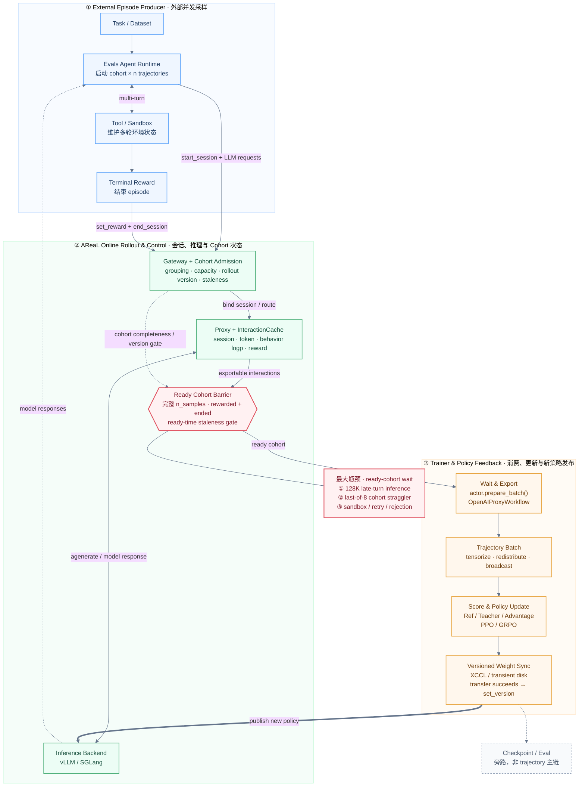

# 大模型训练推理 Infra 高级工程师：三天面试冲刺手册

> - 适用对象：社招大模型训练/推理 Infra 高级工程师
> - 目标档位：当前年薪约 80 万，目标 100–120 万
> - 使用窗口：首轮面试前 3 天
> - 核验日期：2026-08-31
> - 依据：[2026 版简历](output/曾柏炜-大模型训练推理Infra高级工程师-原格式版-2026.docx)、[项目事实底稿](2026-08-xpeng-infra-resume-materials.md)及文末官方资料

## 0. 先看结论：面试官会如何评估你

这个薪资档位不会只考“知不知道 TP、GRPO、vLLM”。面试官通常在同时验证六件事：

1. **真实性**：数字是不是亲自做出来的，能否说清 workload、基线、变量和统计口径。
2. **机制理解**：知道配置怎么写，还是理解数据流、通信、显存和正确性边界。
3. **工程判断**：能否从现象收敛到一阶瓶颈，并设计最小可证伪实验。
4. **系统能力**：能否跨训练、推理、调度、存储、网络和故障恢复看完整链路。
5. **结果意识**：优化是否守住数值正确性和模型效果，而不是只把 GPU 跑满。
6. **高级工程师成熟度**：是否能定义问题、做取舍、推动交付、复盘并沉淀平台能力。

回答任何技术题都尽量使用“五句法”：

> **结论**是什么 → **机制**为什么 → 当时做了什么**选择** → 用什么**证据**验证 → 结论的**边界**是什么。

如果一个问题没做过，不要把文档知识包装成项目经验。推荐说法是：“这个能力在项目里我主要是使用和调优，不是底层实现 owner；我能从机制和生产排障角度回答。”

## 1. 三天冲刺安排

### Day 1：先保证简历问不倒（约 4 小时）

- 30 分钟：背熟 90 秒自我介绍和 30 秒职业定位。
- 2 小时：完成全部简历 P0 题，把每个数字补齐 workload 卡片，优先口述 X1 MoE、Fully Async 和 Agentic RL 三个故事。
- 60 分钟：口述 async RLVR、长上下文 SFT、Agentic RL/MOPD 三个故事，每个控制在 3 分钟。
- 30 分钟：处理本手册“口径风险清单”。

### Day 2：三大框架主线（约 4 小时）

- 90 分钟：Megatron-Core 六道 P0，重点是并行策略选择而非背名词。
- 75 分钟：verl 五道 P0，能画出 Actor/Rollout/Ref/Reward/Trainer 数据流。
- 75 分钟：AReaL 四道 P0，讲清异步收益、staleness 和 Agentic RL 正确性。

### Day 3：通用 Infra + 模拟面试（约 4 小时）

- 90 分钟：MFU、OOM、NCCL、checkpoint、推理吞吐。
- 60 分钟：从 P1 中选择与你目标 JD 最贴近的 10 题。
- 60 分钟：完整模拟一轮“自我介绍 → 项目深挖 → 框架 → 故障题 → 反问”。
- 30 分钟：只看最后一小时清单，不再扩展新知识。

## 2. 面试前必须校准的简历口径

### 2.1 双 Teacher MOPD 效果口径不一致

当前简历写了“双 Teacher MOPD 在 SWE、Terminal 双域提升且 General 不下降”；但项目事实底稿仍将 MOPD 定义为 `FUNCTIONAL` 已过、`NUMERIC/EFFICACY` 未完全闭环。面试前必须二选一：

- 如果已有正式 held-out paired evaluation：准备 checkpoint、样本数、seed、baseline、置信区间或 bootstrap、污染排查和 General 回归数据。
- 如果没有：口头主动收敛为“链路和 early canary 已验证，最终效果仍在严格评测”，不要继续强化已闭环的印象。

### 2.2 不同 CUDA Graph 数字不能混用

- 简历中的“35B 真实 RL decode 约 14x”是一个特定场景的 decode 阶段收益。
- 项目底稿中的“6–8x”来自另一 Agentic RL 场景。
- 二者都不能直接说成端到端 step 提速；必须带模型、引擎、batch/concurrency 和测量区间。

### 2.3 SFT `31s → 9.3s` 必须拆分贡献

必须补齐：GPU 数量、sequence length、global/micro batch、packed ratio、模型版本、前后是否相同有效 token 数，以及 `num_workers` 和选择性重计算分别贡献多少。否则 3.3x 很容易被认为是 workload 变化。

### 2.4 “交付 checkpoint”不等于“长期稳定训练”

对 128K/256K 任务分别说明：跑了多少 step、覆盖了怎样的长度分布、是否过长尾样本、checkpoint 是否完成下游验证。不要用“跑通 smoke test”替代生产稳定性。

### 2.5 Megatron-Core 的个人边界

简历写的是“了解 Megatron 5D 并行、基于 Megatron-Core 交付和二次开发”。面试时应把自己定位为**训练系统集成、性能与正确性优化者**；只有确实改过底层 collective、parallel state 或调度实现时，才说自己是 Megatron 核心机制实现者。

### 2.6 Fully Async 的同步对照口径尚未闭环

`76 → 211–255` 是 Fully Async 内部从初始配置到优化配置的比较，`236–293` 是 `2T+2R` 候选窗口。目前“同步约 200”仍需补齐完全一致的 workload、统计窗口、warmup/异常步处理和 `tokens/s/GPU` 分母；补齐前不要声称 Fully Async 相比同步提升了多少，更不能把 `76 → 211–255` 说成同步到异步的三倍提升。

## 3. P0 Top 30 学习路径

| 顺序 | 题目 | 预计复习 | 通过标准 |
|---:|---|---:|---|
| 1 | [RESUME-01 自我介绍](#resume-01) | 12 分钟 | 90 秒内讲完，两条主线清楚 |
| 2 | [RESUME-01A X1 200B MoE 优化](#resume-01a) | 20 分钟 | 能用 Three Walls 讲完整因果链 |
| 3 | [RESUME-01B 项目 Ownership](#resume-01b) | 10 分钟 | 能拆清个人、框架与团队贡献 |
| 4 | [RESUME-01C 职业选择](#resume-01c) | 8 分钟 | 动机客观、稳定且不抱怨 |
| 5 | [RESUME-02 Fully Async 对比与优化](#resume-02) | 20 分钟 | 先讲异步优势，再讲供需配平 |
| 6 | [RESUME-03 gen-TP 与资源配比](#resume-03) | 15 分钟 | 能解释为何减 TP 反而更快 |
| 7 | [RESUME-05 SFT 3.3x](#resume-05) | 20 分钟 | 能拆分数据和计算瓶颈 |
| 8 | [RESUME-06 128K/256K 长上下文](#resume-06) | 18 分钟 | 能列显存账和并行选择 |
| 9 | [RESUME-07 CP chunking 静默失效](#resume-07) | 15 分钟 | 能讲症状、根因、验证 |
| 10 | [RESUME-08 Agentic RL 架构](#resume-08) | 20 分钟 | 能画完整数据流和关键路径 |
| 11 | [RESUME-09 OPD/MOPD](#resume-09) | 20 分钟 | 能讲清 TIES→MOPD 选型和三层验证 |
| 12 | [RESUME-10 千卡集群交付](#resume-10) | 15 分钟 | 能讲清国产卡模型适配与性能达标闭环 |
| 13 | [MEGATRON-01 5D 并行](#megatron-01) | 15 分钟 | 每个维度解决什么都说清 |
| 14 | [MEGATRON-02 Row/Column TP](#megatron-02) | 18 分钟 | 能说通信点和原因 |
| 15 | [MEGATRON-03 TP 负优化](#megatron-03) | 15 分钟 | 能结合 9B 项目解释 |
| 16 | [MEGATRON-04 SP 与 CP](#megatron-04) | 15 分钟 | 不混淆两个 sequence 切分 |
| 17 | [MEGATRON-05 Distributed Optimizer](#megatron-05) | 15 分钟 | 能说明分片对象和通信 |
| 18 | [MEGATRON-06 MoE/EP](#megatron-06) | 18 分钟 | 能解释 all-to-all 和负载均衡 |
| 19 | [VERL-01 HybridFlow 架构](#verl-01) | 18 分钟 | 能画 role/data/control flow |
| 20 | [VERL-02 Colocate 与 Disaggregate](#verl-02) | 15 分钟 | 能做资源取舍 |
| 21 | [VERL-03 训练/推理权重同步](#verl-03) | 18 分钟 | 能说布局转换和原子性 |
| 22 | [VERL-04 Fully Async](#verl-04) | 18 分钟 | 能讲 producer-consumer 与 staleness |
| 23 | [VERL-05 GRPO 正确性](#verl-05) | 18 分钟 | 能识别 logprob/mask/normalization 风险 |
| 24 | [AREAL-01 为什么选 AReaL](#areal-01) | 15 分钟 | 不停留在“更异步” |
| 25 | [AREAL-02 Off-policy 与 staleness](#areal-02) | 18 分钟 | 能讲性能-稳定性权衡 |
| 26 | [AREAL-03 Agentic RL 服务链](#areal-03) | 18 分钟 | 能讲 agent/env/reward/trainer 边界 |
| 27 | [AREAL-04 Trajectory lineage](#areal-04) | 18 分钟 | 能说明样本到底有没有训练贡献 |
| 28 | [INFRA-01 MFU](#infra-01) | 15 分钟 | 会算、会解释、会识别假提升 |
| 29 | [INFRA-02 Megatron 显存账本/OOM](#infra-02) | 18 分钟 | 能手算每 rank 显存并按生命周期定位 |
| 30 | [INFRA-03 NCCL/Checkpoint 故障](#infra-03) | 18 分钟 | 能给出生产排查顺序 |

---

## 4. P0：简历项目深挖

<a id="resume-01"></a>
### RESUME-01｜请做一个 1–2 分钟自我介绍（P0，12 分钟）

- **问题**：请介绍一下你自己，重点讲与大模型训练推理 Infra 相关的经历。
- **面试官意图**：判断你的职业主线、表达能力和 seniority；同时选择后续深挖入口。
- **精准回答**：

  > 面试官您好，我叫曾柏炜，本科毕业于厦门大学电气工程及其自动化专业，硕士毕业于清华大学电子信息专业，研究方向是人工智能。我目前在小鹏机器人负责大模型后训练基础设施，主要有两条主线。第一条是基于 verl 和 Megatron-Core 建设 SFT/RLVR 能力，覆盖 Qwen3/Qwen3.5 dense/MoE、32K–256K 长上下文，以及 vLLM/SGLang rollout；我做过 fully async RLVR 资源解耦，把代表性稳态吞吐从 76 提升到 211–255 tokens/s/GPU，也做过 128K SFT 的数据、重计算和显存优化。第二条是基于 AReaL 建设 Agentic RL 和在线蒸馏链路，重点解决 rollout 长尾、trajectory 利用、policy staleness、跨引擎权重同步和多 Teacher 路由正确性。此前在华为负责大模型迁移、性能/精度优化和千卡级集群长稳交付。我擅长的不只是把任务跑通，而是用指标和实验同时闭环性能、数值正确性、模型效果与故障恢复。

- **项目证据或知识边界**：所有数字必须能回到固定 workload；不要在自我介绍里主动说尚未闭环的 MOPD 最终效果。
- **高概率追问**：[最有代表性的优化](#resume-01a)是什么？你在项目中的 [ownership](#resume-01b)？[为什么从华为到小鹏、现在又看机会](#resume-01c)？
- **危险回答**：连续罗列十几个框架；教育背景超过 10–15 秒或展开课程、论文和奖项；说“全栈负责”却说不清代码和实验边界。

<a id="resume-01a"></a>
### RESUME-01A｜最有代表性的性能优化是什么？（P0，20 分钟）

- **问题**：请讲一个你最有代表性的优化案例，最好能体现大模型训练 Infra 的系统能力。
- **面试官意图**：验证你能否把超大 MoE 的性能问题拆成并行映射、kernel、通信、显存、精度和规模化稳定性问题；同时检查 `0.16x → 0.95x` 是否有明确口径和个人贡献。
- **60–120 秒主答**：

  > 我最有代表性的案例是在华为 X1 项目中，对一个约 200B 的 MoE 预训练模型做性能优化。我负责的范围从功能打通、精度对齐一直到性能达标和 3K 卡训练保障。接手时，相对客户对标口径的性能只有 0.16x；我没有从单个算子开始盲调，而是先固定模型、batch、序列长度、精度和卡数，用 profile 定位瓶颈。用 NVIDIA 2026 年报告的后验框架概括，就是 Memory Wall、Communication Wall 和 Compute Efficiency Wall。第一类是并行和显存：联合评估 TP、PP、DP、EP 等切分，目标是在模型可放下的前提下，避免把 expert GEMM 切得过碎。第二类是计算效率：使用 Grouped MatMul 聚合多个 expert 的小矩阵计算，并使能实际验证过的融合算子，减少中间张量、内存搬运和 kernel launch。第三类是通信：分别分析 TP/DP collective、EP token dispatch 和 PP P2P，把没有依赖的通信与计算做 overlap，同时检查额外 buffer 和带宽竞争。每轮优化后都重新 profile，并通过逐层精度对齐和长稳训练验收。最终相对性能从 0.16x 提升到 0.95x，MFU 达到 35%，并支撑 3K 卡训练。这个项目最重要的不是某个开关，而是持续识别瓶颈迁移并同时守住性能、精度和稳定性。

- **2–3 分钟展开版**：按下面五层展开，不要把未确认项说成已经实施。

  1. **先固定 benchmark**：补齐 `0.16x/0.95x` 的分母，以及模型层数、专家数/top-k、global/micro batch、sequence length、precision、卡数、warmup 和统计窗口；否则数字没有解释力。
  2. **并行与拓扑**：从容量可行的 TP/PP/DP/EP 候选中选择吞吐更高的组合。MoE 的 expert 通常已经是小 GEMM，过高 expert-TP 可能进一步碎片化计算；但最终映射必须结合当时实际 HCCS/RoCE 拓扑、collective 频率和消息量说明。面试前补齐真实并行度和通信 group 到物理拓扑的映射。
  3. **计算效率**：Grouped MatMul 把不同 expert 的可变 token batch 聚合调度，提高硬件利用率；融合算子要解释具体融合了什么、减少了哪些读写或 launch。准备实际使用过的 2–3 个算子名，以及各自 A/B 收益，不能泛称“各种融合算子”。
  4. **通信掩盖**：按 TP/DP collective、EP dispatch/combine 和 PP P2P 分别看 exposed time。准备一条当时真实的 overlap timeline，说明 compute/communication 的依赖如何解除、使用了什么 stream/chunk/schedule，以及为什么 overlap 后没有因资源争用拖慢 GEMM。
  5. **显存、精度和规模化**：只讲确认使用过的显存手段，例如实际的 optimizer 分片、sequence parallel、recompute 或 buffer 复用；融合和低精度路径用逐层 dump 找 first divergence。最后从小规模功能/精度基线扩到 3K 卡，验证 loss、吞吐、checkpoint 和故障恢复。

- **结合 NVIDIA 2026 MoE 报告可以补充什么**：以下是今天继续演进时会评估的方向，不是 X1 当时已经落地的成果。NVIDIA 将 MoE 优化概括为 Memory Wall、Communication Wall 和 Compute Efficiency Wall，并强调三者会互相迁移。[技术报告](https://arxiv.org/abs/2603.07685)、[Megatron Core MoE README](https://github.com/NVIDIA/Megatron-LM/blob/main/megatron/core/transformer/moe/README.md)

  - **Parallel Folding**：把 attention 的 TP/CP/DP 与 MoE 的 ETP/EP/EDP 解耦，让 dense attention 和 sparse expert 分别使用适合自己的并行映射。
  - **Optimized dispatcher**：根据 GPU 拓扑评估 DeepEP/HybridEP，减少 EP 跨节点冗余搬运并提高带宽利用率。
  - **更细的 EP overlap**：用 merged FWD-BWD、独立 compute/comm stream 和 Wgrad/Dgrad split 扩大 all-to-all 的隐藏窗口。
  - **显存换并行效率**：fine-grained recomputation、pipeline-aware activation offloading 和 precision-aware optimizer 不只是为了避免 OOM，也可能让系统降低 TP/PP、恢复更大的 GEMM。
  - **kernel 与低精度**：router/permutation fusion、FP8/FP4 grouped quantization + Grouped GEMM，以及对 dropless MoE 采用 partial CUDA Graph；回答时要说明动态 expert shape 与静态 graph 的冲突。

- **项目证据或知识边界**：可以口述 X1、约 200B、`0.16x → 0.95x`、MFU 35% 和 3K 卡；对外简历继续脱敏。客户真实名称不写入或展示。上述 NVIDIA 新方案必须使用“今天会评估”，不能倒灌成 2023–2024 年项目事实。
- **高概率追问**：`0.16x` 的分母是什么？实际 TP/PP/DP/EP 怎么配？Grouped MatMul 为什么有效？EP all-to-all 占比多少？load imbalance 怎么测？哪项优化收益最大？为什么 MFU 只有 35%？
- **危险回答**：从头到尾罗列开关；把总收益全部归因给 Grouped MatMul；无法给出真实并行配置和融合算子名；把 NVIDIA 2026 的 DeepEP、Parallel Folding 或 CUDA Graph 说成当时已实施。

<a id="resume-01b"></a>
### RESUME-01B｜你在项目中的 Ownership 是什么？（P0，10 分钟）

- **问题**：Ownership 是什么意思？X1 项目里哪些事情是你负责的，哪些是框架或团队完成的？
- **面试官意图**：判断你是否达到高级工程师所需的端到端责任能力，同时拆分个人贡献、开源能力和团队红利。
- **Ownership 的含义**：

  > Ownership 不是“所有代码都是我写的”，而是我对一个边界清晰的问题从目标定义、技术方案、关键实现、跨团队推进到上线验收承担端到端责任；出现风险时，我负责暴露问题、组织决策并把结果闭环。

- **精准回答**：

  > 在 X1 约 200B MoE 项目里，我的 scope 是把模型从功能和精度可用推进到性能达标，并保障大规模训练落地。技术决策上，我负责建立性能基线和瓶颈分解，主导并行配置实验、Grouped MatMul 和融合算子的接入验证，以及通信 profile 和 overlap 方案收敛；执行上，我亲自做关键配置、A/B 实验、精度对齐和问题定位。项目依赖 Megatron/MindSpeed 框架、底层算子团队、硬件和集群运维，这些不是我一个人实现的；我的责任是定义接口和验收标准，把框架、算子和客户侧问题拉到同一条因果链上。结果上，我对 0.16x 到 0.95x、MFU 35%、上线门禁和 3K 卡训练保障负责。上线后出现性能回退或训练故障，我也是第一接口人，负责组织定位、回归和复盘。没有我并不是“没人能写代码”，而是项目会缺少一个对端到端结果负责、能让多个团队围绕同一基线收敛的 owner。

- **回答模板**：`Scope → Decision → Execution → Coordination → Outcome`。每一层至少准备一个“我”开头的具体动作。
- **项目证据或知识边界**：准备一项亲自改动、一项关键实验、一项被你否决的方案和一次跨团队闭环。明确哪些融合算子是直接使用、哪些是适配或修改，不能把 Megatron/MindSpeed 原生能力说成自研。
- **高概率追问**：最终方案谁拍板？你写了哪些模块？底层算子不是你写的，为什么结果算你的？如果没有你项目最可能卡在哪里？失败时你承担什么责任？
- **危险回答**：“我全栈负责”“基本都是我做的”；只讲协调不讲技术判断；只讲代码不讲上线结果；用团队总成果替代个人边界。

<a id="resume-01c"></a>
### RESUME-01C｜为什么从华为到小鹏，现在为什么又看机会？（P0，8 分钟）

- **问题**：两次职业选择的原因是什么？如何证明你加入后会稳定发展？
- **面试官意图**：判断离职动机是否客观、职业主线是否连续，以及地点、组织变化和岗位期望是否与招聘岗位匹配。
- **精准回答**：

  > 从华为到小鹏主要有两个原因。首先是客观地点因素：当时部门有整体搬迁上海的安排，而我的家庭和长期定居规划都在深圳，所以我希望选择一个能在深圳长期发展的机会。其次是职业发展因素：华为让我积累了大模型迁移、昇腾性能和精度优化、千卡集群交付经验，但工作与特定硬件和客户交付场景结合较深；我希望把能力扩展到更通用的 GPU、Megatron-Core、后训练和 RL Infra 技术栈。小鹏当时在地点和技术方向上都比较匹配，所以我选择加入。
  >
  > 这次看机会的直接触发因素是当前部门正在进行比较大的组织架构调整，团队方向和岗位边界存在一定不确定性。但我不是单纯因为调整就离开，我真正寻找的是深圳长期稳定的机会，能够继续深耕大模型训练、后训练和训练推理 Infra，并对核心系统承担清晰、完整的 ownership。地点、技术方向和职责如果匹配，我倾向于长期发展。

- **项目证据或知识边界**：面试只说“家庭和长期定居规划在深圳”，不主动展开结婚、生娃和买房；只看深圳可以坦诚，但宝安、南山及周边的通勤范围留到 HR 确认办公地点时再说。
- **高概率追问**：如果小鹏组织稳定是否还会看机会？为什么入职不到一年？你只看深圳会不会限制发展？什么条件能让你长期留下？
- **危险回答**：“在华为是螺丝钉、自由度低、会的太少”“小鹏现在很不稳定”；过度讨论家庭安排；把组织调整说成唯一原因；表示只要薪资更高就离开。

<a id="resume-02"></a>
### RESUME-02｜Fully Async 相比同步 RLVR 有什么优势？你如何把初始吞吐从 76 优化到 211–255 tokens/s/GPU？（P0，20 分钟）

- **问题**：为什么要从同步改为 Fully Async？它解决了哪些等待？为什么初始 async 反而只有 76？
- **面试官意图**：验证你是否理解异步架构的系统收益、供需模型和 off-policy 代价，而不只是调了 gen-TP 和资源配比。

| 维度 | 本项目/典型 phased 同步基线 | Fully Async |
|---|---|---|
| 调度 | logical batch 组装完成后才能进入对应 update，新 policy rollout 前完成相应 weight sync | Rollouter 持续生产，Trainer 按可用 batch 消费 |
| 暴露等待 | 主要 rollout 窗口 Trainer 等待，主要 update/sync 窗口 Rollouter 等待；长 trajectory 放大 logical batch wait | rollout 与训练时间重叠，长尾不再阻塞整个同步 step，但仍受 group/batch 完整性约束 |
| 资源 | 阶段共享或固定编排，单阶段资源利用高但容易产生 phase bubble | Trainer/Rollouter 可独立扩缩容，但固定分池错误会造成一侧长期空闲 |
| Policy 语义 | policy freshness 和 step 边界更直接 | 需要 queue、policy version、staleness、backpressure 和恢复协议 |

- **精准回答**：

  > 我先说明 Fully Async 的核心价值：它不是让 rollout 或 actor update 单阶段自动变快，而是把 Rollouter 变成持续 producer、Trainer 变成持续 consumer，通过 queue 解耦两者生命周期，让生成和训练在时间上重叠，减少同步 phase bubble，并降低长 trajectory 对整个同步 step 的阻塞。同时，两类资源可以独立扩缩容。代价是会引入跨池权重同步、queue/backpressure、policy staleness 和更复杂的恢复语义。
  >
  > 在我们的 Qwen3-30B-A3B、32K、32 张 A100 场景里，同步阶段拆解显示约 79% 时间消耗在 rollout，所以理论上 async 有明显 overlap 空间。但最初直接使用 `3T+1R`、`gen-TP=4` 时，24 张卡给 Trainer、只有 8 张卡给 Rollouter，而且 8 张 rollout GPU 只能部署 2 个 vLLM 实例；producer rate 明显低于 trainer consumer rate，queue 经常供给不足，trainer idle ratio 达到 0.41，吞吐只有 76。第一步把 `gen-TP` 从 4 降到 2，相同 8 张卡的实例数从 2 增到 4，扩大独立 continuous batching 的并发池，吞吐提升到 211–255。第二步尝试 `2T+2R`，Rollouter 增加到 16 张卡、8 个实例，候选窗口达到 236–293，trainer idle ratio 降到 0.10–0.14；这时瓶颈转移到 actor update，继续增加 rollout 资源已经不是最优方向。
  >
  > 所以这个项目的核心不是“打开 Fully Async”，而是把异步系统当成生产者—消费者流水线，通过 gen wait、actor/ref/update、parameter sync、queue depth、idle ratio、显存和 policy version lag 持续配平。最终配置要让两侧 exposed idle 尽量小，同时保证样本新鲜度和模型效果。

- **Benchmark 门禁**：先声明分子、分母和窗口，固定模型/checkpoint、prompt-response 长度分布、采样参数、硬件、并发上限和统计区间；warmup、checkpoint、validation、失败重试和过滤样本要明确是否包含。除吞吐外同时报告 queue depth、trainer idle、policy version lag 和 rejected/stale ratio，防止用堆积旧样本换表面吞吐。
- **项目证据或知识边界**：`76 → 211–255` 是 async 初始配置与优化配置的比较；`236–293` 是 `2T+2R` 候选窗口，二者都不是全程平均。同步“约 200”只有在相同 workload、窗口和 `tokens/s/GPU` 分母确认后才能比较；确认前不要说 Fully Async 超过同步，更不能说相比同步提升三倍。
- **高概率追问**：同步链路中哪些阶段真的串行、哪些可以重叠？为什么 gen-TP=2 更快？queue 空/满分别说明什么？2T+2R 为什么不是最终答案？staleness 怎么控制？parameter sync 占多少？generated token 和 effective training token 有何区别？
- **危险回答**：“异步一定比同步快”；把所有同步实现说成完全串行；把不同资源配比的单卡吞吐直接横比；只报最高点 293；把 async 等价为严格 on-policy；用堆积旧 policy 样本换吞吐。

<a id="resume-03"></a>
### RESUME-03｜为什么减小 gen-TP、增加实例数会提高 rollout 吞吐？（P0，15 分钟）

- **问题**：TP 越大单模型越快，为什么你的场景反而选择更小 TP？
- **面试官意图**：检查你是否理解 decode 的计算/通信特征、并发和集群拓扑。
- **精准回答**：

  > rollout 的目标是总 token 生产率，不是单请求最低延迟。TP 增大后，每卡 GEMM 变小、每层 collective 更频繁，decode 又是小 batch、逐 token 的 memory/latency-sensitive 阶段，未必能吃满 GPU。gen-TP 从 4 降到 2 后，同样 8 张卡可以从 2 个实例变成 4 个实例，增加独立 continuous batching 的并发池；只要单实例显存能容纳权重和 KV cache，总吞吐可能显著提升。选择点要联合看每实例 token/s、KV cache 容量、请求长度分布、跨机通信和尾延迟，而不是固定偏好某个 TP。

- **项目证据或知识边界**：你有直接项目证据；但面试前应补一张 `TP × 实例数 × 并发 × token/s × p95` 表。
- **高概率追问**：何时 TP=1 更好？什么时候必须增大 TP？长上下文 KV cache 会怎样改变结论？
- **危险回答**：“TP 通信多，所以越小越好。”模型放不下、KV cache 不够或单实例计算太慢时并不成立。

<a id="resume-05"></a>
### RESUME-05｜Qwen3.5-9B SFT 为什么能从 31s 降到 9.3s？（P0，20 分钟）

- **问题**：`num_workers=0→8` 和选择性重计算各解决了什么？
- **面试官意图**：验证你能否区分 input pipeline、GPU compute、显存与配置变化，并证明 3.3x 不是换 workload。
- **精准回答**：

  > 我先把 step 拆成 data wait、forward、backward、optimizer 和通信。`num_workers=0` 导致主进程同步取数和预处理，GPU 出现明显 data bubble；提升 worker 并配合预取后先消除输入供给瓶颈。显存侧原先采用更重的 recompute，虽然省显存但重复计算过多；通过张量级显存账确认余量后改为选择性重计算，只重算高显存/低重算代价模块。最终相同 workload 下 step time 31s→9.3s，MFU 23%→29.6%。回答时我会把两项改动分别做 A/B，避免把总收益错误归因给一个开关。

- **项目证据或知识边界**：当前简历给出了总结果，但没有展示逐项贡献；面试前必须补齐硬件、序列长度、batch 和有效 token 一致性。
- **高概率追问**：为什么 MFU 只升了 6.6pp、step 却快 3.3x？data wait 是否计入 MFU？怎样避免 workers 过多造成 CPU/内存压力？
- **危险回答**：说“num_workers 提升了 GPU 算力”；不说明前后 batch/token 数；把峰值 MFU 当平均 MFU。

<a id="resume-06"></a>
### RESUME-06｜128K/256K 长上下文训练的显存主要花在哪里？（P0，18 分钟）

- **问题**：你如何设计长上下文 SFT 的并行和显存方案？
- **面试官意图**：检查是否真正做过长序列训练，能否从张量维度做 memory accounting。
- **精准回答**：

  > 我会先按 [INFRA-02](#infra-02) 的 Megatron 显存账本确认模型状态能否放下，再单独计算长序列放大的 activation、logits、loss upcast 和临时 workspace。对 128K/256K，CP 把每个 rank 的 local sequence 降为 `S/CP`，SP 在 TP 区域还能继续去掉部分重复 activation；PP 只减少本 stage 的层数，activation 峰值仍取决于同时在途的 microbatch，不能机械除以 PP。然后确认 FlashAttention、THD/packing、CP 和 fused cross entropy 的真实 tensor shape，避免配置写了但实际回退。最后才比较 selective/full recompute、CP、TP 和 offload：TP 解决权重和大 GEMM，但过大会让 GEMM 变碎；CP 更直接解决长序列 activation，但需要 KV 通信；offload 则可能把瓶颈转移到 PCIe。最终用真实长度分布验证峰值显存、loss、吞吐、checkpoint 和恢复，而不是只跑一个 max-length step。

- **项目证据或知识边界**：简历包含 35B-MoE 256K、27B 128K/256K checkpoint 交付；应区分 working recipe、短跑交付和长期稳定基线。
- **高概率追问**：activation 为何近似随 sequence length 增长？attention memory 是否仍是二次？CP 和 Ulysses SP 区别？offload 为什么可能严重拖慢？
- **危险回答**：只说“开 FlashAttention 和重计算”；默认 max length 就是平均 workload；用更多 TP 机械解决所有 OOM。

<a id="resume-07"></a>
### RESUME-07｜CP chunking 静默失效为什么会分配 7.6GB 全量 logits buffer？（P0，15 分钟）

- **问题**：没有报错但显存异常，你怎么发现并证明 chunking 没生效？
- **面试官意图**：验证源码阅读、张量形状推导和静默正确性/性能问题定位能力。
- **精准回答**：

  > 症状是显存峰值与按 CP 分片后的理论值不一致，但任务没有显式异常。我先用 dtype × batch × sequence × vocab 估算 logits buffer，7.6GB 更接近全序列 logits，而不是 CP local chunk；再通过 rank 级 shape/log、allocation snapshot 和关键函数 tracing 确认 loss/CE 路径没有继承 CP chunk 信息。修复后我会同时验证 local tensor shape、峰值显存、loss 数值和多 rank 一致性，避免只凭 OOM 消失判断正确。

- **项目证据或知识边界**：简历只给出结论；面试前准备实际 tensor shape、dtype、vocab size 和修复位置。若无法公开代码，至少能画调用链。
- **高概率追问**：为什么是“静默”失效？如果 logits 用 fp32 会怎样？fused CE 能如何避免 materialize 全量 logits？
- **危险回答**：把 7.6GB 当固定公式背诵；无法解释任何维度；只说“看 profiler 找到的”。

<a id="resume-08"></a>
### RESUME-08｜请画出你的 Agentic RL 训练链路，最大瓶颈在哪里？（P0，20 分钟）

- **问题**：从 task 到 policy update，一条 trajectory 经历哪些系统？
- **面试官意图**：判断你是否拥有端到端视角，以及能否区分 agent、inference、reward、training 和 control plane。
- **版本边界**：下面对齐的是项目实际使用的 **AReaL online proxy + controller-owned cohort admission 二次开发链路**。它不是普通离线 `RolloutWorkflow` 的串行图，也不要把后续 AReaL 2.0 的独立微服务架构倒推为项目当时的实现。
- **系统流程图**：



- **精准回答**：

  > 我项目使用的是 AReaL 的 online proxy/cohort 路径，rollout producer 是外部 evals/agent runtime，而不是 trainer 内部先跑一个 Agent Workflow。每个 task 会并发启动同一 cohort 的多条 trajectory；首次模型请求通过 Gateway 的 `start_session` 进入 CohortManager，完成容量与 staleness 检查，并绑定 cohort、group rank、rollout version 和 proxy worker。之后 agent 与 tool/sandbox 维护多轮环境状态，每次 LLM 调用经 Gateway、Proxy Worker 到 vLLM/SGLang；Proxy Worker 同时在 InteractionCache 中记录 token、behavior logp 和 token version。episode 结束时，环境提交 terminal reward 并 `end_session`；只有同组 trajectory 都 rewarded、ended 且通过 ready-time staleness 检查，cohort 才进入 ready 状态。训练侧 `actor.prepare_batch()` 通过 `OpenAIProxyWorkflow` 等待完整 cohort，导出并 tensorize interactions，经 DP 重分配后完成可选的 Ref/Critic/Teacher/Prox logp、advantage 和 PPO/GRPO update。最后先执行 versioned weight transfer，再在成功后更新 actor/rollout 的 policy version；checkpoint 和 eval 是旁路，不是 trajectory 主链路。
  >
  > 最大瓶颈不是一个抽象的“training queue”，而是 trainer 在 `prepare_batch()` 暴露出来的 **ready-cohort wait**。历史基线中 rollout wait 约占 step 的 87%；其根因是 128K 多轮后期 LLM 调用越来越贵、8-way cohort 等最后一条 trajectory 的 straggler 放大、sandbox 并发与失败重试，以及供给不足或 cohort rejection。我的优化分别覆盖 decode CUDA Graph、prefill prefix cache、sandbox 并发和 Gateway 流式补位/均衡调度，并用固定 logical batch 的端到端 update interval、effective-token goodput、cohort completion/rejection 和 policy staleness 验收，而不是只看模型服务器 tokens/s。

- **项目证据或知识边界**：底稿记录 DeepSWE `6467s→2301s`、Seta Terminal `2240s→770s` 等更强数据，但它们未全部进入当前简历；使用前确认可对外披露和统计口径。
- **高概率追问**：为什么 online 模式没有 trainer 内部 Agent Workflow？cohort 为什么放大 tail？reward、session 和 trajectory 在哪里落盘/导出？为什么 weight sync 完成后才能推进 version？cache hit 高为什么不一定让 E2E 更快？
- **危险回答**：把链路画成 `Agent Workflow → vLLM → Reward → Training Queue` 的固定串行管线；把 `policy version` 当成权重同步前独立生成的模型产物；把 checkpoint 画进每条 trajectory 的关键路径；只看模型服务器 token/s，忽略 session/cohort、环境失败和样本版本。

<a id="resume-09"></a>
### RESUME-09｜OPD/MOPD 解决什么问题？你如何证明它正确且有效？（P0，20 分钟）

- **问题**：为什么不用 Model Merge 汇聚多个 RL Expert，而要做 MOPD？完整数据流和验证门禁是什么？
- **面试官意图**：检查你能否从真实业务问题推导技术选型，讲清参数空间合并与 on-policy 行为蒸馏的差别，并识别多 Teacher 路由、distributed correctness 和效果夸大风险。
- **60–120 秒主答**：

  > 我们先使用不同领域的数据分别进行 RL，得到多个领域 Expert，后续目标是把这些 Expert 的能力汇聚到一个统一模型，而不是部署多个模型。最初尝试的是 TIES-Merging，即 `TRIM, ELECT SIGN & MERGE`：它会裁剪不显著的 task-vector 参数变化、处理符号冲突，再合并方向一致的更新。但项目中的初步实验没有达到“一个模型同时接近各领域 Expert”的目标，所以我们转向 MOPD。
  >
  > MOPD 中，各领域 RL Expert 作为冻结 Teacher，Student 从 RL 之前的模型初始化，训练仍使用各领域原来做 RL 的数据，并保留 `data_source`。Student 用当前 policy 在对应环境中生成 trajectory；训练系统按 `data_source` 路由到匹配的 Teacher，Teacher 不重新生成答案，而是对 Student 实际生成的同一条 token 路径计算 logp。训练侧再利用 Teacher 与 Student 的 token-level logp 差异构造 OPD 信号，把多个 Teacher 的行为能力写入同一个 Student。Teacher 路由只发生在训练期间，最终部署的仍是一个不依赖 Teacher 路由的 Student。
  >
  > 选 MOPD 的核心原因是：TIES 在权重空间做一次静态合并，MOPD 则能在 Student 实际访问的状态分布上，根据训练数据的领域选择监督来源。但 MOPD 也不会天然消除共享参数上的跨域梯度冲突，所以还要控制混域配额、trajectory 权重和 General 回归。

- **为什么 TIES-Merging 仍可能失败**：TIES 能缓解冗余参数和 task vector 的符号冲突，但它仍是一次性参数合并，没有基于领域数据继续训练，也不能保证每个 Expert 的行为能力都稳定继承。项目没有确认可披露的分项数字前，只说“初步实验未达到多个领域能力同时保留的目标”，不要把 coefficient 敏感、某域下降多少等假设说成实测结论。[TIES-Merging 原论文](https://arxiv.org/abs/2306.01708)
- **三层验证门禁**：

  1. **FUNCTIONAL**：混域数据、`data_source` 路由、Teacher scoring、backward、weight sync、checkpoint/recovery 能闭环；各 Teacher 路由都有非零样本，失败不能静默串域。
  2. **NUMERIC**：token、mask、Teacher/Student logp、scatter/gather 和 normalization 对齐；same-weight 条件下蒸馏信号应接近零；异常在各 rank 上 fail-consistent。
  3. **EFFICACY**：在相同协议下比较 RL 前 Student、各领域 Expert、TIES-Merging、单 Teacher OPD 和多 Teacher MOPD；分别评测各领域能力和 General 回归，并看逐题配对、多个 checkpoint/seed 与置信区间。训练 loss 下降不能替代下游效果。

- **Teacher headroom 的准确说法**：这是本项目的 Go/No-Go 门，不是普遍定理。如果 Teacher 在目标领域没有可测 headroom，same-path token 信号也没有显示稳定的局部互补能力，就先检查 Teacher、数据和评测协议，而不是直接增加蒸馏步数；但 Teacher 总分不高于 Student，并不严格排除它在部分状态上仍能提供有效监督。
- **项目证据或知识边界**：多 Teacher 路由、score validation、`mopd_pg`、mixed-domain data、trajectory weighting、online drain、recovery 和评测工装，只有能映射到本人负责的 PR、设计或实验记录时才说“我设计并实现”；其余说成项目能力。若双 Teacher 正式评测没有闭环，就明确说 FUNCTIONAL、NUMERIC 或 early canary 到哪一层，不能声称已经提升多域能力。
- **高概率追问**：TIES 的三步分别做什么？为什么 Student 从 RL 前模型而不是某个 Expert 初始化？Teacher 为什么对 Student 的同一 token path 打分？`mopd_pg` 的 token advantage 怎么构造？如何防止 `data_source` 串域？equal-token weighting 为什么可能偏向长 trajectory？
- **危险回答**：把 `tile merge` 当成术语；暗示最终推理仍需动态路由 Teacher；用训练 loss 下降证明能力提升；把单 Teacher、受污染的探索实验和双 Teacher 正式结果混在一起；把代码仓库已有功能全部说成个人实现。

<a id="resume-10"></a>
### RESUME-10｜你在千卡/万卡级交付里具体负责什么？（P0，15 分钟）

- **问题**：你说参与过千卡/万卡级交付，个人具体负责哪一段？请不要只讲团队整体做了什么。
- **面试官意图**：确认“千卡/万卡”是项目背景还是你承担了可验证职责；检查你能否独立完成模型从跑通到性能验收的闭环，并区分个人、框架及底层团队贡献。
- **60–120 秒主答**：

  > 这段经历主要发生在华为。我先限定个人边界：我不是整个千卡、万卡集群平台的总负责人，我主要负责 X1、TX 客户模型在国产卡上的功能适配与性能达标。
  >
  > 我的工作形成了一个反复迭代的闭环。首先固定客户模型、并行配置、batch size、sequence length、精度、卡数、统计窗口和目标性能口径，建立可复现 benchmark；然后完成模型跑通，包括算子兼容、并行策略、checkpoint/data 和精度链路适配。模型跑通后采集 step time、吞吐、算子、通信、pipeline idle 和显存等数据，通过 profiling 判断当前主瓶颈是在并行切分、kernel、通信暴露、显存，还是 Host/data 侧。
  >
  > 找到主瓶颈后再选择优化措施，例如调整 TP、PP、DP、EP 等并行策略，接入 Grouped MatMul 和实际验证过的融合算子，或者通过计算通信 overlap 减少 exposed communication。每项优化都在相同 workload 下做 A/B，同时检查 loss 和精度；之后重新采集数据，因为一个瓶颈解决后，新的瓶颈通常会迁移出来。这个过程持续迭代，直到达到客户性能验收目标。
  >
  > X1 的约 200B MoE 预训练模型是其中最有代表性的案例。我的 ownership 是模型侧从跑通、测量、归因到性能达标的交付闭环；如果问题落到编译器、算子库、集合通信、硬件或集群环境，我负责提供稳定复现和 profiling 证据，推动对应团队解决，并完成模型侧最终回归，而不是把底层实现也归为个人贡献。

- **六步展开版**：

  1. **固定验收口径**：模型版本、global/micro batch、sequence length、precision、卡数、warmup、统计窗口、精度阈值和性能目标。
  2. **完成模型跑通**：处理算子兼容、分布式并行、checkpoint/data 和精度链路，先建立小规模可复现基线。
  3. **采集性能证据**：记录 step time、吞吐、MFU/硬件利用、算子耗时、collective exposed time、pipeline idle 和显存峰值。
  4. **识别当前主瓶颈**：区分并行切分、kernel/小 GEMM、通信暴露、显存与重计算、Host/data 和规模化 straggler。
  5. **最小变量验证**：调整并行策略、融合算子或 overlap 时，保持 workload 不变，验证性能、loss、精度与稳定性。
  6. **重新 profile 并继续迭代**：不能把单机收益线性外推到千卡规模；collective、拓扑和 straggler 会随规模放大，必须在目标规模重新验收。

- **项目证据或知识边界**：X1 约 200B MoE 可以交叉引用 [RESUME-01A](#resume-01a) 的 `0.16x→0.95x`、MFU 35% 和 3K 卡训练证据；TX 没有确认可披露的模型与数字时，只作为第二个客户交付背景，不补造指标。客户继续使用代号。
- **高概率追问**：你亲自改了什么、推动了什么？性能 benchmark 如何固定？讲一次“优化后瓶颈迁移”的完整迭代？为什么单机收益扩到千卡可能消失？X1 和 TX 中你的职责是否完全相同？
- **危险回答**：把整个万卡平台、硬件运维和稳定性体系说成个人 ownership；只说“协调资源、推动闭环”而没有 profiling 和 A/B；把底层团队实现的算子或通信优化说成自己开发；泄露客户和集群敏感信息。

---

## 5. P0：Megatron-Core 高频题

<a id="megatron-01"></a>
### MEGATRON-01｜Megatron 的“5D 并行”分别解决什么问题？（P0，15 分钟）

- **问题**：TP、PP、DP、CP、EP 如何组合？总 GPU 数怎么计算？
- **面试官意图**：检查分布式训练基本盘，以及你能否按模型/序列/拓扑选择并行策略。
- **60–90 秒主答**：

  > DP 切 batch、复制模型；TP 切层内大矩阵，解决单层容量和计算，但每层都有高频 collective；PP 按层切深度，解决整模型容量但引入 pipeline bubble；CP 持久切分 sequence 和几乎全部 activation，服务长上下文，attention 需要跨 CP rank 交换 KV；EP 把 MoE experts 分散到不同 rank，引入动态 token dispatch/combine all-to-all。关键点是“5D”不等于五个轴在所有模块机械相乘。Parallel Folding 下，Attention 和 Expert 是同一批物理 rank 的两套 logical mapping：`TP_attn×CP_attn×DP_attn×PP = ETP_moe×EP_moe×EDP_moe×PP = world_size`。选型时先满足参数和 activation 容量，再把 TP 等高频通信放在 NVLink/NVSwitch 域，联合考虑 CP 的 KV 通信和 EP 的 all-to-all，最后用 profile 在通信、GEMM 粒度和 bubble 之间收敛。

- **MoE world-size 的正确口径**：

  ```text
  Dense / Attention：world_size = TP × CP × DP × PP
  MoE / Expert：     world_size = ETP × EP × EDP × PP

  每个 PP stage 内：TP × CP × DP = ETP × EP × EDP
  ```

  左右两边是同一批 rank 的两套 process-group mapping，不能再彼此相乘。`ETP` 是 Expert Tensor Parallel，不能默认等于 Attention TP。Parallel Folding 论文的单 PP-stage 示例是：

  ```text
  Attention：TP=2 × CP=2 × DP=2 = 8
  Expert：   ETP=1 × EP=8 × EDP=1 = 8
  ```

  论文端到端配置若再取 `PP=2`，完整作业就是 16 GPU。Megatron 官方 MoE Guide 还给出 256 GPU 示例：Attention 为 `TP4×CP2×DP8×PP4`，Expert 为 `ETP1×EP64×EDP1×PP4`，两边都等于 256。

- **为什么有时又会看到 `DP=EP×EDP`**：传统嵌套布局中，如果 `ETP=TP`、EP 沿 Dense DP 轴分组、`EP | DP`，且没有 Parallel Folding，可以写：

  ```text
  DP = EP × EDP
  world_size = TP × CP × PP × DP
             = TP × CP × PP × EP × EDP
  ```

  这里 `CP` 可以大于 1；这个式子只是传统嵌套布局的特例，不是通用 MoE 公式。

- **官方示例中的 DP、EP、EDP group 怎么理解**：

  - 纯 Dense DP 轴：固定 `(PP, TP, CP)`，只改变 `DP`，表示不同数据副本；`m=GBS/(MBS×DP)` 中使用这个 DP。
  - Dense `dp_cp` group：固定 `(PP, TP)`，覆盖 `DP×CP` ranks。CP ranks 也复制 Dense 参数并贡献局部 context 的梯度；Megatron 默认在该 group 上做 Dense 梯度归约和 Distributed Optimizer 分片。
  - EP group：固定 `(PP, ETP, EDP)`，改变 `EP`，持有不同 expert shard，负责 token all-to-all。
  - EDP group：固定 `(PP, ETP, EP)`，改变 `EDP`，持有同一 expert shard 的副本并同步梯度。

- **TP/CP 哪个优先放单机**：TP 通信发生在每层、每个 microbatch，通常先保证 TP 在 NVLink/NVSwitch 域；若 `TP×CP` 能放进单机，再把二者一起留在高速域。放不下时优先保持 TP 单机，并考虑 hierarchical CP，让内层 CP 本地、外层 CP 跨节点；MoE 还要同时评估 EP all-to-all，不能脱离消息量、overlap 和实测 profile 给绝对答案。

- **PP bubble 怎么算，VPP 解决什么问题**：设 `p` 是物理 PP stages，`m=GBS/(MBS×DP)` 是每次 iteration 的 microbatch 数，stage 均衡且忽略通信时，non-interleaved 1F1B 有：

  ```text
  useful_time = m × (t_f + t_b)
  bubble_time = (p - 1) × (t_f + t_b)
  bubble / useful = (p - 1) / m
  bubble / total  = (p - 1) / (m + p - 1)
  ```

  面试官问“额外开销”常用第一式，问“占总时间比例”用第二式。优化顺序是减小 `p`、在 GEMM 和收敛允许时增加 `m`、按真实计算量平衡 stage、再使用 VPP/interleaved 1F1B 和 P2P overlap。`VPP=v` 不增加 GPU，而是把模型切成 `p×v` 个 virtual chunks，每个物理 rank 持有多个不连续 chunk；经典均匀调度下理想 `bubble/useful≈(p-1)/(m×v)`。代价是 P2P 次数约增大 `v` 倍、activation 生命周期和调度更复杂，chunk 太小还会损害 kernel efficiency；该近似假设 chunk 均衡、`m` 可满足经典 interleaved schedule 约束。

- **项目证据或知识边界**：你有 Megatron 后端的配置、集成与调优经验；不要声称设计了全部并行算法。
- **高概率追问**：为什么 Dense optimizer shard group 可能是 `DP×CP`，但 microbatch 数只除以 DP？ETP 为什么不一定等于 TP？VPP 与 Zero-Bubble 有何区别？
- **危险回答**：把 `TP×CP×EP×DP` 当通用公式；把 Attention TP 和 ETP 混为一谈；把 SP/VPP 当成额外 world-size 维度；只背定义不谈通信、GEMM 粒度和拓扑。

<a id="megatron-02"></a>
### MEGATRON-02｜Column Parallel 和 Row Parallel Linear 怎么切？通信在哪里？（P0，18 分钟）

- **问题**：以 MLP 或 Attention projection 说明 forward/backward collective。
- **面试官意图**：判断 TP 是否停留在“把模型切到多卡”的表层。
- **精准回答**：

  > 对 `Y=XW`，Column Parallel 沿 `W` 的输出维切，每个 rank 得到部分输出特征；如果下一个算子能继续消费分片输出，就不必立即 all-gather。Row Parallel 沿 `W` 的输入维切，每个 rank 计算 partial output，forward 需要 reduce-sum 合并。Megatron 把 MLP 的 up projection 设计成 Column Parallel、down projection 设计成 Row Parallel，让中间 hidden 分片直接流动，只在 block 边界做必要规约。backward 的通信与 forward 对偶：Column Parallel 需要为 input gradient 做规约，Row Parallel 需要把 output gradient 切给各 rank。实际实现可能用 all-reduce，配合 sequence parallel 后常拆成 reduce-scatter/all-gather。

- **项目证据或知识边界**：这是框架机制题；简历只有使用/调优证据，无需假装亲自实现 TP layer。
- **高概率追问**：QKV projection 如何切 head？为什么 TP 要求 hidden/head 数可整除？sequence parallel 如何改变通信？
- **危险回答**：只说“按行/按列平均切”；混淆权重矩阵的逻辑维度与代码存储布局；说 TP 没有通信。

<a id="megatron-03"></a>
### MEGATRON-03｜为什么 TP 从 2 增到 4 可能更慢？（P0，15 分钟）

- **问题**：结合你的 9B 长上下文项目解释 TP 负优化。
- **面试官意图**：评估工程取舍和性能模型，而非配置记忆。
- **精准回答**：

  > TP 增大能降低每卡权重和部分 activation，但代价是每层通信更频繁、单 rank GEMM 的 M/N/K 变小，kernel efficiency 下降。对 9B 这种 hidden size 相对较小的模型，TP=4 可能把 GEMM 切得过碎，且长上下文问题本质更多在 sequence activation，此时把 GPU 预算给 CP 往往更合适。项目里应比较 `TP=2, CP=8` 与 `TP=4, CP=4` 的峰值显存、GEMM 时间、TP collective、CP attention 通信和 step time，而不是只看能否启动。

- **项目证据或知识边界**：项目底稿记录过约 `163s→102s` 的相关对比；该数字不在当前简历，使用前确认 workload 与披露范围。
- **高概率追问**：为什么 TP 通常放 NVLink 域内？如果 TP=2 放不下怎么办？怎样用 Nsight/NCCL trace 证明？
- **危险回答**：“TP 越大通信越大”但说不出通信频率和张量；忽略 batch/GEMM shape；把一次结果普适化。

<a id="megatron-04"></a>
### MEGATRON-04｜Sequence Parallel 和 Context Parallel 有什么区别？（P0，15 分钟）

- **问题**：它们都切 sequence，为什么不是同一件事？
- **面试官意图**：这是 Megatron 高频辨析题，能快速筛掉只背 5D 名词的人。
- **精准回答**：

  > 两者在 tensor shape 上都沿 sequence dimension 切，但系统含义不同。Megatron 的 SP 复用 TP process group，只分片 TP 区域之间原本重复的 LayerNorm、Dropout、Residual 等 activation，并用 reduce-scatter/all-gather 替代部分 TP all-reduce；它不增加 world-size，也没有把 Attention 的完整上下文独立分布。CP 则是独立 mesh 轴，从网络输入开始持久切分 sequence 和几乎全部 activation，每个 CP rank 只持有 `S/CP` token；Attention 中本地 Q 要通过 P2P/ring/all-gather/all-to-all 等方式访问全局 KV。因此 SP 是 TP 配套的 activation 去重，CP 是长上下文的独立并行。

  | 对比项 | SP | CP |
  |---|---|---|
  | process group | 复用 TP group | 独立 CP group |
  | 切分范围 | LayerNorm、Dropout、Residual 等非 TP 区域的重复 activation | 输入和几乎全部 activation |
  | Attention 语义 | 不独立分布完整 context | 本地 Q 通过 KV 通信访问全局 context |
  | world-size | 不增加 | 乘入 world-size |
  | 主要目标 | 减少 TP rank 的 activation 冗余 | 扩展长上下文显存与计算 |

  Megatron Core 的 `sequence_parallel` 并不是字面意义上的默认开启，但官方建议 TP 时启用，并要求 TP 与 EP 同时使用时启用。TP、CP、SP 同开时，CP 先把语义 context 切为 `S/CP`；在 SP 覆盖的区域，activation 还可沿 TP group 形成近似 `S/(CP×TP)` 的本地分片，但 Attention 的全局上下文仍由 CP 通信保证。

- **项目证据或知识边界**：你有 CP/THD/packed 配置经验；底层通信算法若未改过，应定位为使用与诊断。
- **高概率追问**：为什么 SP 不进入 world-size？为什么 TP+EP 要启用 SP？CP 为什么能替代一部分 full recompute？GQA/MQA 下 KV 通信怎样变化？
- **危险回答**：“SP 切短序列，CP 切长序列”；把 `SP×CP` 都乘进 world-size；认为 SP 会持久分片全部 attention activation；忽略 CP 的 KV 通信。

<a id="megatron-05"></a>
### MEGATRON-05｜Megatron Distributed Optimizer 与 ZeRO-1/2/3 怎么对应？（P0，15 分钟）

- **问题**：它分片了什么、每步有哪些通信、能省多少显存？
- **面试官意图**：验证 model-state memory accounting 和 DP 通信理解。
- **精准回答**：

  > 经典 Megatron distributed optimizer 主要分片 optimizer state 和 FP32 main parameters，梯度通过 reduce-scatter 让各 rank 得到自己负责的 shard，更新后再 all-gather 参数视图，思想接近 ZeRO-1，并通过 contiguous param/grad buffer 提高通信效率。开启 CP 时不能把 shard group 简化成纯 DP：Dense 参数默认使用 `DP×CP` 的 `dp_cp` group，Expert 参数使用 EDP group。现代 Megatron-FSDP 又可配置 `optim`、`optim_grads`、`optim_grads_params`，分别对应 ZeRO-1/2/3 式分片。显存不能只背 `16/d`，完整 dtype 表和每-rank 算法见 [INFRA-02](#infra-02)。

- **项目证据或知识边界**：你做过 distributed checkpoint 和 optimizer 相关故障；若没改 optimizer 核心，明确为集成/排障经验。
- **高概率追问**：DP=1 时还有什么冗余 buffer？overlap grad reduce 如何实现？ZeRO-3 与 TP/PP 怎么组合？
- **危险回答**：把 Megatron distributed optimizer 直接等同 ZeRO-3；忽略 main param 和 dtype；认为分片没有通信成本。

<a id="megatron-06"></a>
### MEGATRON-06｜MoE 为什么需要 EP？all-to-all 为什么难优化？（P0，18 分钟）

- **问题**：请从 router、dispatch、expert compute、combine 讲一层 MoE。
- **面试官意图**：验证简历中 dense/MoE 经验，以及动态通信和负载均衡能力。
- **精准回答**：

  > Router 为每个 token 选择 top-k expert；EP 把 experts 放到不同 rank，token 先按目的 expert 做 permute/dispatch 和 all-to-all，到本地 grouped GEMM 计算，再 all-to-all combine 并恢复顺序。难点是 token 路由动态、每个 rank 发送量不均，热点 expert 会让最快 rank 等最慢 rank；小 expert batch 还会降低 GEMM 效率。优化要联合看 expert load、capacity/dropped token、A2A p95、permutation、grouped GEMM、expert placement 和网络拓扑。TP+EP 组合时官方要求启用 sequence parallel，避免相关 activation 复制和布局问题。

- **项目证据或知识边界**：你有 Qwen3/Qwen3.5 MoE recipe 和华为大 MoE 优化经验；准备一个具体的 expert imbalance 或 A2A 案例。
- **高概率追问**：top-1 与 top-2 的代价？capacity factor 如何影响效果和性能？EP 跨节点怎么放？MoE checkpoint 如何 reshuffle？
- **危险回答**：“MoE 每 token 只算少数 expert，所以一定更快”；只谈参数量，不谈动态通信和负载尾部。

---

## 6. P0：verl 高频题

> 版本提醒：截至核验日，verl 官方最新 release 页面显示 `v0.7.1`；统一 Engine Worker 架构已取代旧 worker 实现，`fully_async_policy` 仍位于 `verl.experimental`。面试时先说明你项目使用的具体分支/版本，再谈当前 upstream。

<a id="verl-01"></a>
### VERL-01｜verl/HybridFlow 的核心架构是什么？（P0，18 分钟）

- **问题**：RayPPOTrainer、WorkerGroup、Actor/Rollout/Ref/Critic/Reward 如何协同？
- **面试官意图**：判断你是否真正读过/改过框架，而不是只会运行 recipe。
- **精准回答**：

  > verl 把 RL dataflow 的控制逻辑和各模型计算后端分开。单 controller 的 RayPPOTrainer 负责主训练循环、Worker/WorkerGroup 构造和资源池；WorkerGroup 是远端 workers 的代理，负责数据 dispatch/collect。ActorRolloutRef 可以按角色独立或 colocate，Critic/Reward 也有独立 worker group；DataProto 在方法间传递 tensor 和 metadata。新架构中 TrainingWorker 通过 BaseEngine/EngineRegistry 对接 FSDP、Megatron 等训练后端，rollout 对接 vLLM/SGLang。它的价值是用一套上层 RL dataflow 组合不同计算和 placement 策略。

- **项目证据或知识边界**：你有 verl 二次开发经验；面试前至少能指出自己改过的 trainer/worker/config 路径和一个 upstream 差异。
- **高概率追问**：controller 是否会成为瓶颈？DataProto 如何跨 rank dispatch？旧 `megatron_workers` 与新 Engine Workers 有何变化？
- **危险回答**：只说“verl 基于 Ray”；混淆 trainer control plane 与每 GPU worker；背旧版本类名却不说明版本。

<a id="verl-02"></a>
### VERL-02｜Actor/Rollout 应该 colocate 还是分离部署？（P0，15 分钟）

- **问题**：什么场景选择 3T+1R、2T+2R 或 colocated hybrid engine？
- **面试官意图**：评估资源建模、权重同步和不同 workload 下的系统取舍。
- **精准回答**：

  > Colocate 的优点是 GPU 复用和本地/高速权重切换，适合资源有限、同步边界清晰的场景；缺点是训练态参数/optimizer/activation 与推理 KV cache 争显存，还需要 sleep/wakeup/reshard。分离部署可以让 rollout 和 trainer 真正 overlap、独立扩缩容，适合 agentic 长尾明显的场景，但需要跨池权重同步、队列、staleness 和故障恢复。资源比不按模型大小拍脑袋，而由 rollout producer rate、trainer consumer rate、update cadence 和 tail latency 决定；最优点是两侧 exposed idle 最小且样本新鲜度可接受。

- **项目证据或知识边界**：直接对应你的 fully async 项目；3T+1R/2T+2R 是本项目布局，不是通用最佳实践。
- **高概率追问**：为什么 2T+2R 后瓶颈转向 actor？动态资源调度何时更优？colocate 如何释放 KV/optimizer 显存？
- **危险回答**：“分离一定吞吐更高”；只算 GPU 数，不算参数同步和 queue；忽略故障域扩大。

<a id="verl-03"></a>
### VERL-03｜训练态 Megatron 权重如何同步到 vLLM/SGLang？（P0，18 分钟）

- **问题**：为什么不是简单 `state_dict` 拷贝？
- **面试官意图**：检查训练-推理双态模型、并行布局转换和一致性保证。
- **精准回答**：

  > 训练侧可能按 TP/PP/CP/EP 和 distributed optimizer 分片，推理侧则按 serving TP、量化和 engine-specific layout 存权重；同步需要参数命名/shape/dtype 映射、必要的 gather/reshard，再通过 NCCL/XCCL、CUDA IPC 或其他 backend refit。正确性上要给每次更新单调 policy version，所有 inference replicas 完成后原子切换；失败时不能让同一训练 batch 混入半新半旧权重。性能上关注导出、传输、load/refit、cache invalidation/re-prefill 和 rollout pause 的 exposed time。

- **项目证据或知识边界**：你有跨引擎同步和 final parameter sync 故障经验；准备一次 keyword mismatch 或部分 worker 失败的真实排查。
- **高概率追问**：TP size 不同如何 reshard？LoRA 只同步 adapter 有何差异？如何做 same-weight logp check？
- **危险回答**：认为 NCCL broadcast 完成就代表所有 engine 已可服务；忽略 tokenizer/chat template 和 tied weights；没有 version barrier。

<a id="verl-04"></a>
### VERL-04｜verl fully async 的 producer-consumer 流程是什么？（P0，18 分钟）

- **问题**：Rollouter、MessageQueue、Trainer、ParameterSynchronizer 各做什么？
- **面试官意图**：验证你对自己最强项目的框架层理解，并观察是否认识到 async 并非天然 on-policy。
- **精准回答**：

  > Rollouter 持续逐样本生成并按 freshness/capacity 写入 MessageQueue；Trainer 按训练所需 mini-batch 从队列消费，完成若干 update 后由 ParameterSynchronizer 把新权重同步到 rollout。收益来自训练与生成时间重叠、隔离长尾，而不是让单个阶段本身更快。关键控制量包括 queue depth、staleness threshold、parameter-sync cadence、partial rollout 和 actor/rollout 资源比。严格 on-policy 需要更强 barrier；fully async 常会产生 one-step 或 bounded off-policy，因此必须记录 behavior policy version/logprob 并使用 correction、拒绝或阈值控制。

- **项目证据或知识边界**：截至核验日该功能仍在 `experimental`；你的项目分支可能与 upstream `v0.7.1` 不同，应明确版本。
- **高概率追问**：queue 满/空分别说明什么？怎么 checkpoint in-flight samples？staleness=0 是否自动严格 on-policy？
- **危险回答**：说“完全异步但没有陈旧样本”；只调队列大小；忽略恢复后的 pending/running prompt。

<a id="verl-05"></a>
### VERL-05｜GRPO/RLVR 链路最容易出现哪些“能跑但训错”的问题？（P0，18 分钟）

- **问题**：为什么 loss 正常、reward 也涨，结果仍可能不可信？
- **面试官意图**：检查数值正确性和 RL 系统经验，这是高级岗位的重要分水岭。
- **精准回答**：

  > 我会按 token、trajectory、group、policy version 四层检查。token 层看 tokenizer/chat template、response mask、rollout 与 trainer logprob、padding/packing；trajectory 层看 reward 对齐、截断、tool trace 和有效 token normalization；group 层看 GRPO 同 prompt samples 是否完整、reward std=0、partial/rejected group；policy 层看 behavior version、importance ratio、weight sync 和 stale rejection。验证方法包括 same-weight logp、tiny deterministic batch、per-token diff、single-rank/多-rank对照、loss 手算和 held-out eval。训练不 NaN 只证明 functional，不证明 numeric 或 efficacy。

- **项目证据或知识边界**：直接对应你的 OPD/MOPD、rollout correction 和 tracing 经验。
- **高概率追问**：rollout logprob 和 trainer recompute logprob 为什么会不一致？group std=0 怎么处理？response length normalization 有何偏差？
- **危险回答**：只看最终 reward；把 KL/loss 曲线平滑当作正确性证据；不记录原始 token ids。

---

## 7. P0：AReaL 高频题

> 版本提醒：AReaL 在 2026-07-01 发布 2.0，官方描述为 training、inference、agent、weight-update 独立微服务。你的项目经历可能基于 1.x/内部演进版本，回答时先给版本边界，不要把 2.0 新架构倒推为当时已经使用。

<a id="areal-01"></a>
### AREAL-01｜已经有 verl，为什么还要选择 AReaL？（P0，15 分钟）

- **问题**：两个框架的核心定位和适用场景有什么差别？
- **面试官意图**：评估选型能力；也会验证你是否只是同时列出两个热门框架。
- **精准回答**：

  > 两者都覆盖大模型 RL，但设计重心不同。verl/HybridFlow 强在用统一 RL dataflow、WorkerGroup 和多训练/推理后端组合 colocated 或 separated placement，生态与算法 recipe 丰富；AReaL 从一开始更强调 disaggregated fully asynchronous RL、bounded off-policyness，以及把外部 agent runtime/online clients 接入训练。我的选择不是谁“更先进”，而是按 workload：常规 SFT/RLVR 和已有 verl 生态优先 verl；长时、多轮、外部 sandbox、rollout tail 明显且需要持续在线供给时，AReaL 的异步和 agent integration 更自然。代价是 staleness、trajectory lifecycle、微服务故障与可观测性更复杂。

- **项目证据或知识边界**：你分别有 verl RLVR 和 AReaL Agentic RL 项目，是强项目证据；但要说明当时的版本和公司二次开发。
- **高概率追问**：verl fully async 后差异是否还成立？AReaL 2.0 与旧架构有何变化？同一任务怎么做公平选型 benchmark？
- **危险回答**：“AReaL 异步、verl 同步”；2026 年的 verl 已有 fully async；也不要用社区 benchmark 代替本项目证据。

<a id="areal-02"></a>
### AREAL-02｜AReaL 如何控制异步训练的 off-policyness？（P0，18 分钟）

- **问题**：`max_head_offpolicyness`、policy version 和 partial rollout 如何协同？
- **面试官意图**：验证你是否理解 async 的算法代价，而不只是吞吐收益。
- **精准回答**：

  > 异步时 rollout 由旧 policy 产生，trainer 已更新到新版本。AReaL 用版本化 capacity/staleness manager 限制 trajectory head 相对当前 policy 的最大落后；`max_head_offpolicyness=0` 可退化到同步，增大阈值通常提高 overlap 和吞吐，但可能增加训练偏差。partial rollout 还能让一条长 trajectory 跨 policy version 分段，因此不能只给整条 trajectory 一个粗粒度版本；最好保留 per-turn/per-token behavior metadata，并结合 importance ratio、rejection/masking 和效果 A/B 验证阈值。

- **项目证据或知识边界**：你有 staleness manager、policy version 和 rejection diagnostics 经验；不要引用官方“通常 2–8”当作项目最优值。
- **高概率追问**：manager head drift 和真实 behavior staleness 区别？stale 样本直接丢弃会有什么系统后果？
- **危险回答**：把 off-policy 只当数据过期问题；认为版本差 1 的所有 token 偏差相同；忽略 throughput-quality frontier。

<a id="areal-03"></a>
### AREAL-03｜AReaL 2.0 的微服务化对 Agentic RL 有什么价值？（P0，18 分钟）

- **问题**：training、inference、agent、weight-update 为什么要拆开？
- **面试官意图**：考系统边界、扩缩容、故障隔离和当前框架演进敏感度。
- **精准回答**：

  > 四类服务的负载和失败模式不同：inference 受 KV cache、batching 和长尾影响；agent 受 tool/sandbox IO、session 和 retry 影响；training 受 backward/collective/checkpoint 影响；weight update 是跨布局的数据面。拆开后可以独立扩缩容、替换 backend、隔离故障，并让外部 agent 通过 OpenAI-compatible gateway 接入。但代价是多服务版本、backpressure、幂等重试、session affinity、原子权重切换和跨服务 tracing。微服务不是目的，只有当它降低资源耦合并提高可观测/可恢复性时才值得。

- **项目证据或知识边界**：AReaL 2.0 发布晚于你部分项目；可以用项目中的 Gateway/online session 经验类比，但不要说项目天然就是完整 2.0。
- **高概率追问**：控制面和数据面如何分离？weight update 服务失败怎么办？HTTP 会不会成为瓶颈？
- **危险回答**：“微服务更解耦、更高性能”而没有状态一致性设计；忽略服务间背压和恢复。

<a id="areal-04"></a>
### AREAL-04｜如何证明 generated trajectory 最终真的产生了梯度？（P0，18 分钟）

- **问题**：为什么 `generated - consumed` 不能直接叫作浪费？
- **面试官意图**：考数据 lineage、样本利用率定义和跨系统可观测性。
- **精准回答**：

  > 一条 trajectory 可能生成后等待、被 reward 过滤、因 staleness 拒绝、只完成 partial cohort、进入 trainer 但 loss mask 为零，或者训练完成但未进入当前统计窗口。因此需要 stable logical trajectory ID，把 generated → manager → workflow/reward → exported → consumed → loss-active → policy-gradient-active 逐层 join，并记录 full-sequence、loss-active 和 gradient-active token。项目 tracing 曾闭环 `223 admitted→180 generated/rewarded→96 exported→96 consumed`，其中还有 2 条 compact-filtered 消耗 token 但不产梯度。正确指标应按原因归因，而不是把差值一刀切成 waste。

- **项目证据或知识边界**：这是项目底稿中的直接证据；如不可对外披露精确数字，保留方法和比例定义。
- **高概率追问**：如何处理 microbatch reorder？tracing 本身会不会拖慢？最终 drain 时 waiting 样本算什么？
- **危险回答**：用队列长度代替 lineage；只追踪 trajectory 数而不追踪 token；忽略 tracing overhead 对 A/B 的污染。

---

## 8. P0：训练推理 Infra 通用题

<a id="infra-01"></a>
### INFRA-01｜MFU 是什么？如何正确计算和使用？（P0，15 分钟）

- **问题**：为什么 MFU 提升不一定代表用户吞吐提升？
- **面试官意图**：验证性能指标基本功和对“指标游戏”的警惕。
- **精准回答**：

  > MFU 是实际训练吞吐对应的模型理论 FLOPs 与硬件峰值 FLOPs 的比值，常写成 `model_FLOPs_per_token × tokens_per_second / aggregate_peak_FLOPs`。关键是 FLOPs 公式要匹配 dense/MoE、attention、activation checkpointing 的统计约定，峰值要匹配 dtype/Tensor Core 和硬件，tokens/s 要用真实有效 token。MFU 适合比较同模型同 workload 的计算利用，但它会忽略数据质量、padding、被 mask token、rollout 等非训练阶段；通过减少有效工作量也可能“提高”MFU。因此同时报告 effective tokens/s、step time、阶段 breakdown、显存和端到端 cost。

- **项目证据或知识边界**：你有 MFU estimator 和 SFT `23%→29.6%` 的直接经验；准备公式和模型参数。
- **高概率追问**：MoE FLOPs 按 total parameters 还是 activated parameters？recompute FLOPs 是否计入 numerator？为什么 achieved TFLOPs 和 MFU 不等价？
- **危险回答**：MFU=GPU utilization；使用不同 FLOPs 公式横比；只报百分比不报 throughput。

<a id="infra-02"></a>
### INFRA-02｜Megatron 训练显存如何计算？遇到 OOM 怎么定位？（P0，18 分钟）

- **问题**：请建立一份 Megatron 训练显存账本，并说明它如何指导 OOM 定位。
- **面试官意图**：检查你能否把 dtype、并行组、张量 shape 和生命周期统一到每-rank peak memory，而不是只会尝试减 batch、重计算和 offload。
- **60–90 秒主答**：

  > 我会先固定模型、dtype、MBS/GBS、sequence length、TP/PP/CP/EP/DP、recompute 和 kernel，再按每个 rank 建账，而不是用总参数量乘一个常数。总账分成 persistent model states 和 phase-local transient memory：参数、梯度、FP32 main param、Adam state 属于常驻项；saved activation、logits、通信 buffer 和 kernel workspace 要按 forward、backward、optimizer、checkpoint 的真实生命周期取最大并发峰值，不能把各阶段峰值机械相加。模型状态按本 rank 在 TP/PP/EP 后实际持有的参数量乘官方 bytes/param；Dense distributed optimizer 的 `d` 默认取 `DP×CP` 的 `dp_cp` group，Expert 则取 EDP group。activation 按 tensor shape、dtype、live copies 和 PP 在途 microbatch 算；CP/SP/recompute 只除它们真正分片或重算的张量。理论账完成后，我会按阶段采集 `allocated/reserved/max_memory_allocated` 和 memory snapshot，定位第一笔超出账本的 allocation，再选择对应优化，并同时回归 loss、吞吐和长稳。

- **总账公式：先按生命周期去重**：

  ```text
  M_peak ≈ M_persistent
         + max_phase(
             M_saved_activation
           + M_phase_temp
           + M_phase_workspace
           + M_phase_comm
           )
         + M_allocator_overhead_at_peak

  tensor_bytes = product(tensor_shape) × dtype_bytes × live_copies
  ```

  `phase` 至少区分 initialization、forward、backward、optimizer、checkpoint/weight sync。每块内存只归入一个生命周期；例如 forward workspace 不能再叠加到 optimizer 峰值。`reserved-allocated` 包含 allocator cache、rounding 和不可用碎片，不能全部叫 fragmentation。

- **第一本账：参数、梯度和 Adam 状态**。Megatron Core Distributed Optimizer 官方理论值如下，`d` 是该类参数实际使用的 optimizer sharding group size：

  | 参数/梯度 dtype | 普通 optimizer | Distributed Optimizer |
  |---|---:|---:|
  | FP16 param + FP16 grad | 20 bytes/param | `4 + 16/d` |
  | BF16 param + FP32 grad | 18 bytes/param | `6 + 12/d` |
  | FP32 param + FP32 grad | 16 bytes/param | `8 + 8/d` |

  表里的 `/param` 乘的是**本 rank 在模型并行之后持有的参数量**，不是全模型参数量：

  - Dense/Attention 参数按 TP、PP 和真实 layer placement 切；普通 DP/CP 不切参数。
  - Expert 参数按 ETP、EP、PP 和 expert placement 切。
  - Dense 状态默认 `d_dense=DP×CP`；若配置多个 distributed optimizer instances，取实际 `intra_dp_cp` group size。
  - Expert 状态默认 `d_expert=EDP`；多个 instances 时取实际 `intra_expt_dp` group size。
  - embedding、LM head、router、shared expert、MTP 和 uneven PP layout 单列；first/last stage 往往不能用“总参数/PP”估算。

- **第二本账：activation**：

  1. 从每层保存到 backward 的 tensor shape 开始，乘 dtype 和 live copies，再乘该 PP rank 同时在途的 microbatch 数。
  2. CP 将 local sequence 降为 `S/CP`，参数显存不随 CP 降低；SP 只在 TP 配套区域分片部分重复 activation，不能把全部 activation 无条件再除以 TP。
  3. PP 只减少本 stage 的层数；warmup/steady/cooldown 的 activation peak 取决于 schedule 和 in-flight microbatches，不能简单除以 PP。
  4. selective/full recompute 减少 saved tensors，但会在 backward 前重算；FlashAttention 避免显式 materialize 完整 `S×S` attention matrix，但其他 activation 和 workspace 仍存在。

  Megatron 的 [`theoretical_memory_usage.py`](https://github.com/NVIDIA/Megatron-LM/blob/main/megatron/training/theoretical_memory_usage.py) 可以作为估算起点，但它的 activation 公式带有 BF16、SP、selective recompute 和特定模型结构等假设；复杂 MoE 仍要回到真实 tensor shape。

- **第三本账：logits、loss 和容易漏掉的 buffer**：

  ```text
  M_logits = local_active_tokens × local_vocab_size
           × dtype_bytes × live_copies
  ```

  要确认 token 是否已按 CP/packing/chunking 变成本地值、vocab 是否仍是 TP shard、loss 是否把 BF16 logits upcast 到 FP32，以及 fused/vocab-parallel cross entropy 是否避免 full-vocab/all-token logits 常驻。除此之外还要单列 contiguous param/main-grad buffer、gradient accumulation、all-gather/reduce-scatter 和 NCCL overlap bucket、GEMM/FlashAttention/Grouped GEMM workspace、临时 cast、CUDA Graph private pool、checkpoint/权重转换临时副本和 allocator overhead。

- **面试现场的手算顺序**：

  1. 写出 parallel map，先算每个 PP rank 的 Dense 与 Expert `P_local`，找参数最重的 stage/rank。
  2. 选 dtype 行，用 `P_local × bytes/param(d)` 算模型状态；注意 Dense 的 `d_dense` 和 Expert 的 `d_expert` 不同。
  3. 用 `B_local、S/CP、H、num_layers_local、in-flight microbatches` 计算 saved activation，再应用 SP/recompute 的真实作用范围。
  4. 单列 logits/loss、通信 bucket、kernel workspace、CUDA Graph 和 checkpoint 临时峰值。
  5. 按 phase 取最大并发组合，加 allocator headroom；最后逐 rank 比较，重点看 first/last PP stage 和 hottest expert rank。

- **理论账如何闭环 OOM**：固定 workload 后，分别记录 initialization、forward、backward、optimizer、checkpoint 的 `allocated/reserved/max_memory_allocated`；用 memory snapshot、tensor shape log 和 profiler 找出未入账 allocation。先修 shape 回退、dtype upcast、buffer 生命周期或泄漏，再根据峰值来源选择 MBS、recompute、CP/TP/PP、offload、fused op 或 allocator 配置。修复后同时验证 tensor shape、峰值显存、loss、吞吐、checkpoint 和长稳，不以“不再 OOM”为结束。

- **项目证据或知识边界**：可结合 [RESUME-07](#resume-07) 的 FP32/full-sequence logits 7.6GB 案例、长样本 OOM、CP=1 回退 CP=2 和 checkpoint/weight sync 峰值；口述 7.6GB 前必须补齐实际 `tokens×vocab×dtype×live copies`。
- **高概率追问**：为什么 CP 不切参数却能参与 Dense optimizer sharding？为什么 microbatch 数只除以 DP，而 `d_dense` 默认是 `DP×CP`？某一 rank 单独 OOM有哪些原因？reserved 很高但 allocated 不高怎么办？
- **危险回答**：用全模型参数直接乘 bytes/param；把所有显存都除以 world-size；把每个 phase 峰值和 workspace 全部相加；第一反应 `empty_cache()` 或直接减 batch；把 `reserved-allocated` 全部解释为 fragmentation。

<a id="infra-03"></a>
### INFRA-03｜多机训练 NCCL hang 或 checkpoint 恢复失败怎么排查？（P0，18 分钟）

- **问题**：给出生产环境的调查顺序和止损方案。
- **面试官意图**：评估千卡经验、故障域判断、日志证据和恢复设计。
- **精准回答**：

  > 先止损：保存 job/rank/host/topology/checkpoint 证据，判断是否需要隔离节点或从上一个已验证 checkpoint 恢复。NCCL hang 按“代码一致性 → rank 健康 → 网络/硬件 → 环境版本”排查：确认所有 rank 进入相同 collective、count/dtype/group/顺序一致；找 first bad rank 和 CUDA/Xid/进程退出；再看 IB/RoCE/HCCS link、packet/error counter、拓扑和 NCCL debug trace。Checkpoint 则核对 model/optimizer/scheduler/RNG/data cursor/parallel metadata、写入原子性和 shard 完整性；恢复后用 loss continuity、参数/optimizer checksum、data position 和短窗口数值对照验证。

- **项目证据或知识边界**：你有 checkpoint deadlock、distributed optimizer checkpoint crash 和千卡交付经历；准备一个明确的 first bad event 案例。
- **高概率追问**：为什么一个 rank 提前异常会表现成其他 rank NCCL timeout？world size/TP 改变后如何恢复？async checkpoint 如何保证一致性？
- **危险回答**：一看到 hang 就重启；只看最后报错 rank；checkpoint 只保存 model weights。

---

## 9. P1：简历二级追问

### RESUME-11｜如何用第二个项目证明 Ownership 不是背模板？（P1，8 分钟）

- **问题**：除了 X1，再用小鹏项目说明一次你的 ownership，哪些来自开源框架或团队？
- **面试官意图**：验证 [RESUME-01B](#resume-01b) 的定义是否可以迁移到不同项目，而不是只会背一个华为案例。
- **精准回答**：继续使用 `Scope → Decision → Execution → Coordination → Outcome`，但改讲 Fully Async 资源模型、CP chunking、trajectory lineage 或 MOPD 路由；必须给出一个亲自改动、一个关键判断、一个依赖团队和一个验收结果。
- **项目证据或知识边界**：不要重复 X1 故事；不要把 verl/AReaL/Megatron 开源能力描述成自研。尚未闭环的 MOPD 效果只说当前证据层级。
- **高概率追问**：关键设计谁拍板？如果没有你项目会怎样？你 review 过哪些核心模块？
- **危险回答**：反复使用“我们”；用 PR 数代替技术贡献；把所有收益都归因给自己。

### RESUME-12｜精度对齐问题通常怎么定位？（P1，10 分钟）

- **问题**：模型迁移后 loss/logits 不一致，你从哪里开始？
- **面试官意图**：验证华为阶段的精度调优不是黑盒试参。
- **精准回答**：先固定 seed/input/checkpoint 和 eval mode，从输入、embedding、逐层 hidden、attention/MLP、logits、loss 到 backward 梯度做分层 dump；区分 dtype/算子实现、mask/position、随机性、数据与优化器状态；用 first-divergence 而非最终 loss 找根因。
- **项目证据或知识边界**：可讲 NPU/CPU AIT 对比或 YOLO/LLAMA 迁移，但继续保持客户信息脱敏。
- **高概率追问**：容许误差怎么设？多机不确定性如何处理？forward 对齐但训练发散怎么办？
- **危险回答**：只比较最终输出；直接调 learning rate；把 FP16 误差都视为正常。

### RESUME-13｜CUDA Graph 为什么能让 decode 快 14x，却不能说 E2E 快 14x？（P1，8 分钟）

- **问题**：它消除了什么开销，什么情况下收益小？
- **面试官意图**：检查局部指标与端到端收益边界。
- **精准回答**：CUDA Graph 复用静态执行图，降低逐 token decode 的 CPU launch、Python 和同步开销；小 batch、小 kernel、频繁 decode 时相对收益大。但 prefill、tool/env、queue、weight sync、trainer 都不在该阶段，且动态 shape/控制流会造成 graph miss 或多 graph 管理，因此 E2E 加速由 Amdahl 定律约束。
- **项目证据或知识边界**：14x 与 6–8x 属于不同场景，必须分别带 workload。
- **高概率追问**：动态 batch 怎么 capture？权重更新后 graph 是否失效？graph 会额外占多少显存？
- **危险回答**：把 kernel/阶段加速直接乘到 step；只报最大加速；忽略 graph capture 条件。

### RESUME-14｜为什么 Prefix Cache 命中率更高，训练可能反而更慢？（P1，10 分钟）

- **问题**：缓存指标与 Agentic RL E2E 指标为什么可能反向？
- **面试官意图**：判断是否具备反直觉的系统思考和因果实验能力。
- **精准回答**：cache 只缩短重复 prefix 的 prefill；它可能让更多 episode 更快进入长上下文 late turns，增加总生成 token、cohort straggler 和环境交互，最终 trainer exposed wait 反而增加。应固定 task/seed/logical batch，对比 update interval、effective tokens、episode completion 和下游效果。
- **项目证据或知识边界**：底稿仅确认 prefill 阶段下降 44%，不能单独声称 E2E 收益。
- **高概率追问**：cache key 包含什么？session affinity 为什么重要？如何测真正 reuse ratio？
- **危险回答**：cache hit 越高系统越快；不区分 prefill time 与 episode time。

### RESUME-15｜Rejected Group 从 33.18% 降到 2.73%意味着什么？（P1，10 分钟）

- **问题**：group 为什么会被拒绝，降低拒绝率是否一定提高训练质量？
- **面试官意图**：验证 group-based RL 的数据完整性和指标解释。
- **精准回答**：先定义 rejection 原因，如 cohort 未完整、timeout、stale、reward 无效或路由失败；调度补位/均衡可以降低因长尾导致的 incomplete groups，提高样本供给。但若为了凑齐 group 放宽超时或接受更旧样本，质量可能下降，需同时看 staleness、reward distribution、effective tokens 和 eval。
- **项目证据或知识边界**：该数字来自项目底稿而非当前简历；对外使用前确认。
- **高概率追问**：partial group 能不能训练？uniform reward group 怎么处理？
- **危险回答**：把 rejected 全称为坏样本；只优化比例不看原因分布。

### RESUME-16｜你如何带 4–5 人完成复杂交付？（P1，8 分钟）

- **问题**：请讲一次技术负责人/项目负责人的具体做法。
- **面试官意图**：评估高级工程师的带项目能力，而不仅是个人贡献。
- **精准回答**：按目标/验收拆成模型适配、精度、性能、集群/现网问题；定义 owner、接口、优先级和风险；用统一复现模板和 daily blocker 收敛；关键问题亲自下钻，最终沉淀基线 recipe、故障库和客户交付件。
- **项目证据或知识边界**：华为 TX 项目有 4–5 人团队经验；说明是项目协同还是正式 people management。
- **高概率追问**：成员意见冲突怎么办？如何判断自己下钻还是授权？怎样评价交付质量？
- **危险回答**：只讲开会和催进度；把协调当管理的全部；没有技术验收机制。

## 10. P1：Megatron-Core 二级题

### MEGATRON-07｜Pipeline Parallel bubble 怎么估算和优化？（P1，10 分钟）

- **问题**：microbatch、stage balance、1F1B 和 interleaving 有什么关系？
- **面试官意图**：检查 PP 的调度与吞吐理解。
- **精准回答**：设物理 stages 为 `p`、microbatches 为 `m`，stage 均衡且忽略通信时，non-interleaved 1F1B 的 `bubble/useful=(p-1)/m`，占总时间比例为 `(p-1)/(m+p-1)`。优化优先级是减少 `p`、合理增加 `m`、按真实计算量平衡 stage，再使用 VPP/interleaved 1F1B 和 P2P overlap。VPP 不增加 GPU，而是让每个物理 rank 持有多个不连续 model chunks，理想 bubble 约再除以 VPP size，但会增加 P2P 次数和调度复杂度。完整推导见 [MEGATRON-01](#megatron-01)。
- **项目证据或知识边界**：技能栏“了解/使用”；如项目未重点调 PP，明确无直接性能案例。
- **高概率追问**：为什么 first/last stage 更容易不平衡？长上下文下 PP 是否更划算？
- **危险回答**：只背 bubble 公式；认为 microbatch 越多越好；忽略不均衡 stage。

### MEGATRON-08｜Packed Sequence 为什么能提吞吐，又会带来哪些风险？（P1，10 分钟）

- **问题**：padding waste、attention mask、position id 和 loss mask 如何处理？
- **面试官意图**：验证长序列训练的数据-算子接口能力。
- **精准回答**：packing 把多个样本拼入连续 token，减少 padding、提高有效 token 比；需要 cu_seqlens/segment boundary 保证 attention 不跨样本，正确生成 position/loss mask，并处理 tool/多轮边界。与 CP、FlashAttention、dynamic batch 组合时还要避免 rank load imbalance 和 shape 不兼容。
- **项目证据或知识边界**：你有 packed sequence/THD 经验；准备一个边界 bug 或验证方法。
- **高概率追问**：packing 后 batch size 怎么定义？长短样本混排如何平衡 CP rank？
- **危险回答**：只说“拼起来就行”；忽略跨样本 attention 泄漏；用总 token 代替有效 token。

### MEGATRON-09｜Recompute 和 Offload 应该怎么选？（P1，10 分钟）

- **问题**：显存不够时，为什么不是两个都开满？
- **面试官意图**：考计算、PCIe/NVLink、显存和吞吐的 trade-off。
- **精准回答**：recompute 用额外 forward FLOPs 换 activation 显存，适合计算可承受且互联/CPU 慢的场景；offload 把 param/optimizer/activation 放 CPU，节省更多 HBM，但受 PCIe、CPU 内存和 overlap 影响。应按峰值来源选择 selective recompute 或指定对象 offload，并用 exposed transfer time 而非是否异步判断成本。
- **项目证据或知识边界**：直接对应 selective recompute 与 offload PCIe 诊断。
- **高概率追问**：full recompute 约增加多少计算？哪些层适合 selective？NVMe offload 何时可用？
- **危险回答**：把 offload 当免费显存；全开后只看能跑；不做 memory snapshot。

### MEGATRON-10｜分布式 checkpoint 如何支持并行度变化恢复？（P1，10 分钟）

- **问题**：TP/PP/DP 改变时为什么普通 rank-local 文件不够？
- **面试官意图**：检查 checkpoint schema、全局 tensor metadata 和恢复验证。
- **精准回答**：checkpoint 需描述 global tensor、每 shard offset/shape/replica 和并行 metadata；加载时按新拓扑重新规划 shard，而不是让 rank 号绑定文件。还要处理 optimizer state、RNG、scheduler、data cursor 和 tied/shared weights。保存应原子提交 manifest，恢复后做 loss continuity 和短窗口对照。
- **项目证据或知识边界**：你有 Megatron distributed checkpoint crash/deadlock 经验；准备 `flattened_range` 案例边界。
- **高概率追问**：PP stage 改变如何映射层？async save 如何防半成品？optimizer reshard 为什么更难？
- **危险回答**：只转换 model weights；忽略 optimizer 和 data cursor；以能 load 作为正确。

## 11. P1：verl 二级题

### VERL-06｜DataProto 和 WorkerGroup 解决了什么问题？（P1，8 分钟）

- **问题**：为什么不用普通 Python dict + Ray actor？
- **面试官意图**：检查框架接口层和分布式数据 dispatch 理解。
- **精准回答**：DataProto 为 tensor batch 与 non-tensor metadata 提供统一协议，支持按 DP/TP 等语义 dispatch、collect 和 reorder；WorkerGroup 把多远端 worker 暴露成集体调用接口。二者降低上层算法流对具体 backend/SPMD layout 的耦合，但 schema、batch 维和 metadata 对齐错误会产生静默 bug。
- **项目证据或知识边界**：若未直接改 DataProto，说明主要从调用和故障层理解。
- **高概率追问**：non-tensor 数据如何广播？microbatch reorder 后 ID 怎么保持？
- **危险回答**：只说“序列化”；忽略 dispatch semantics 和数据对齐。

### VERL-07｜Actor、Reference、Critic、Reward 各自为什么存在？（P1，8 分钟）

- **问题**：GRPO 为什么可以没有 Critic？Reference 是否总需要？
- **面试官意图**：确认 RL 基础与系统资源角色对应。
- **精准回答**：Actor 生成并更新 policy；Reference 提供 KL/约束基线；Critic 估计 value 用于 advantage，GRPO 可用 group-relative reward 替代 learned critic；Reward 可能是模型或 rule/verifier。是否 colocate、offload 或省略取决于算法和显存/吞吐，不是固定四模型。
- **项目证据或知识边界**：有 RLVR/GRPO 使用经验；算法推导若不是主责可保持工程视角。
- **高概率追问**：DAPO 相对 GRPO 改了什么？Reference logprob 何时可预计算？
- **危险回答**：把 reward model 等同 critic；认为 GRPO 完全不需 baseline/normalization。

### VERL-08｜Ray 在 verl 中最常见的生产故障有哪些？（P1，10 分钟）

- **问题**：资源够但 worker 起不来、RPC 卡住或进程残留怎么办？
- **面试官意图**：验证多机 orchestration 实战。
- **精准回答**：从 placement group/resource pool、runtime env、端口/网络、object store、actor lifecycle 和底层 worker 异常分层；先找第一个失败 actor/rank，再看 Ray 状态与 GPU 进程，避免被 RPC timeout 末端错误误导。任务退出要幂等清理 sandbox、server、NCCL communicator 和临时资源。
- **项目证据或知识边界**：你有 Fuyao/Ray RPC/failure cleanup 经验；选一个具体案例。
- **高概率追问**：controller 挂了如何恢复？object store pressure 表现？placement group 为什么 pending？
- **危险回答**：只会 `ray stop --force`；不保存现场；把 Ray 错误当根因。

### VERL-09｜vLLM 与 SGLang rollout 后端怎么选？（P1，10 分钟）

- **问题**：不要只比 benchmark，给出训练系统选型维度。
- **面试官意图**：评估推理引擎与 RL dataflow 的集成能力。
- **精准回答**：比较目标模型支持、TP/EP/量化、continuous batching、prefix cache、structured/tool calling、sleep/wakeup、weight refit、rollout logprob 一致性、metrics、故障恢复和团队维护成本；再用项目 prompt/length/concurrency 做固定 workload A/B。训练 rollout 更重视 token/logprob 正确性和权重更新，而非纯 serving 榜单。
- **项目证据或知识边界**：你接入过两个后端；准备各自一次兼容性或稳定性问题。
- **高概率追问**：为什么同权重 logprob 会不一致？SGLang/vLLM 权重更新如何处理 cache？
- **危险回答**：按“谁更快”一刀切；只看公开榜单；忽略版本兼容矩阵。

## 12. P1：AReaL 二级题

### AREAL-05｜Partial Rollout 的收益和风险是什么？（P1，10 分钟）

- **问题**：一条 trajectory 跨多个 policy version 是否还能训练？
- **面试官意图**：考长 trajectory 调度和算法语义。
- **精准回答**：partial rollout 可避免权重更新时丢弃长 episode，提升利用率并减少 barrier；风险是同一 trajectory 内 behavior policy 不一致，credit assignment、logprob 和版本记录复杂。必须保存 segment/turn/token 级边界与 behavior metadata，并由算法决定 mask、correction 或 rejection。
- **项目证据或知识边界**：有 online session/trajectory 经验；如果项目没启用跨版本 partial，明确为机制理解。
- **高概率追问**：environment state 怎么恢复？segment reward 如何分配？
- **危险回答**：把 partial rollout 当字符串续写；整条只记一个 policy version。

### AREAL-06｜权重同步如何做到原子、可观测、可回滚？（P1，10 分钟）

- **问题**：部分 inference worker 更新失败时怎么办？
- **面试官意图**：检查分布式一致性和生产设计。
- **精准回答**：采用 prepare/transfer/validate/commit 状态机：发布 version 和 manifest，worker 接收并校验 checksum/shape，全部 ready 后 gateway 原子切流；超时则保持旧版本或隔离失败 replica，不允许混合服务。记录每 replica active version、耗时和失败原因，并保留上一稳定版本回滚。
- **项目证据或知识边界**：有 XCCL/NCCL broadcast 和 re-prefill diagnostics；说明当时实现到哪一级。
- **高概率追问**：大模型双缓冲显存不够怎么办？滚动更新能否用于训练 rollout？
- **危险回答**：一次 broadcast 即原子；失败后简单重试而不看是否部分生效。

### AREAL-07｜Online Proxy 与 session drain 为什么重要？（P1，8 分钟）

- **问题**：外部 agent client 接入训练时如何安全更新/关停？
- **面试官意图**：评估在线 Agentic RL 的 session 生命周期管理。
- **精准回答**：gateway 接受 OpenAI-compatible 请求并绑定 session/trajectory；更新或 checkpoint 前停止接收新 session，让 in-flight session 在 deadline 内完成或显式标记 partial/cancelled，再保存 queue/session/data cursor。否则会丢轨迹、重复训练或混入跨版本请求。
- **项目证据或知识边界**：你做过 online session drain 和 shutdown contract；可作为直接证据。
- **高概率追问**：客户端断线怎么处理？retry 如何幂等？session affinity 丢失会影响 cache 吗？
- **危险回答**：直接 kill server；不区分 request 完成与 trajectory 完成。

### AREAL-08｜FUNCTIONAL、NUMERIC、EFFICACY 三层门禁分别是什么？（P1，8 分钟）

- **问题**：为什么系统跑完 100 step 仍不能证明算法有效？
- **面试官意图**：考严谨性与研发验收方法。
- **精准回答**：FUNCTIONAL 验证流程和恢复能闭环；NUMERIC 验证 token、logp、mask、loss、跨 rank 一致性；EFFICACY 用无污染 held-out evaluation 验证能力收益和回归。三者有先后依赖但不能互相替代。
- **项目证据或知识边界**：这是你 MOPD 项目的核心方法论，也用于解释为什么部分结果必须谨慎。
- **高概率追问**：每层最小测试是什么？什么时候可以进入长跑？
- **危险回答**：用 loss 不 NaN 通过 numeric；用训练 reward 通过 efficacy。

## 13. P1：通用 Infra 与高级工程师题

### INFRA-04｜AllReduce、ReduceScatter、AllGather、AllToAll 分别用于哪里？（P1，10 分钟）

- **问题**：请结合 DP/TP/ZeRO/MoE，而不是只给定义。
- **面试官意图**：检查集合通信基本功和框架映射。
- **精准回答**：AllReduce 让所有 rank 得到规约结果，常见于复制参数的梯度同步；ReduceScatter 把规约结果分片，适合 sharded gradient/optimizer；AllGather 重建分片参数/activation；AllToAll 每 rank 向不同 rank 交换不同数据，是 MoE token dispatch 的核心。性能判断要看消息大小、频率、拓扑和 straggler。
- **项目证据或知识边界**：有 NCCL/XCCL 与 MoE 经验；底层算法实现若无直接经验需说明。
- **高概率追问**：为什么 RS+AG 等价于 AR 的语义组合？ring/tree 怎么选？
- **危险回答**：把 broadcast 当 all-gather；只背 API；忽略所有 rank 必须调用一致 collective。

### INFRA-05｜给你 64 张 A100，如何为 35B MoE 128K 选择并行策略？（P1，15 分钟）

- **问题**：没有完整参数时请先问哪些问题，再给初始方案。
- **面试官意图**：考需求澄清、容量模型和系统设计，不期待唯一答案。
- **精准回答**：先问 total/activated params、hidden/layers/experts/top-k、dtype、batch、长度分布、节点拓扑、目标吞吐和训练阶段；再做 model state/activation/logits 账。初始原则是 TP 留在节点高速域、CP 解决 128K、EP 按 expert 数和网络放置、PP 仅在容量/深度需要时引入，剩余形成 DP；随后用 smoke→单节点→多节点 scale curve 校正。
- **项目证据或知识边界**：可绑定 35B-A3B 与 128K/256K 交付，但不要假装题目参数已知。
- **高概率追问**：为什么不直接 TP=8？EP 是否跨节点？global batch 不可整除怎么办？
- **危险回答**：立刻报一组数字；不问模型结构和拓扑；忽略有效 batch/收敛约束。

### INFRA-06｜推理吞吐、延迟和 KV cache 如何权衡？（P1，10 分钟）

- **问题**：怎样同时解释 TTFT、TPOT、tokens/s 和 p99？
- **面试官意图**：验证推理基础与 rollout 性能模型。
- **精准回答**：prefill 主导 TTFT、计算密集；decode 逐 token、受 KV cache/内存带宽和调度影响，TPOT/p99 更关键。continuous batching 提吞吐但可能加排队；增大 batch 提 token/s 但增加延迟与 KV 占用。Agentic rollout 还需把 tool/env wait、session affinity 和 prefix reuse 纳入 E2E。
- **项目证据或知识边界**：有 vLLM/SGLang、CUDA Graph、prefix cache 和长上下文经验。
- **高概率追问**：为什么长上下文降低可并发数？chunked prefill 有何取舍？
- **危险回答**：只有 token/s 一个指标；把模型服务器延迟等同 agent episode 延迟。

### INFRA-07｜你会怎样设计训练系统的可观测性指标树？（P1，10 分钟）

- **问题**：GPU utilization 高但训练没进展，如何快速定位？
- **面试官意图**：考端到端 observability 和值班效率。
- **精准回答**：顶层用 time-to-update、effective tokens/s、cost 和 success rate；向下分 data/rollout/reward/trainer/weight-sync/checkpoint；每层有 rate、latency p50/p95/p99、queue、error、resource。再用 trajectory ID、policy version、rank/host 关联 trace，先找 critical path 和 first divergence。
- **项目证据或知识边界**：有 MFU、阶段耗时、lineage 和 DeepInsight/SwanLab 类指标经验。
- **高概率追问**：高基数 label 如何控制？如何避免 profiling 污染？
- **危险回答**：堆很多指标但没有层级；只看 GPU utilization；无跨服务 correlation ID。

### INFRA-08｜一个可恢复训练 checkpoint 必须保存什么？（P1，8 分钟）

- **问题**：Agentic RL 相比 SFT 还要多保存哪些状态？
- **面试官意图**：检查训练状态机与恢复语义。
- **精准回答**：基础包括 model、optimizer、scheduler/scaler、RNG、global step、data sampler/cursor、parallel metadata；RL/Agentic 还需 policy/reward/tokenizer/prompt/env version、queue offset、in-flight/partial trajectory、session/cohort state 和 rollout backend provenance。恢复后验证不是从“能启动”，而是 loss/data/version 连续。
- **项目证据或知识边界**：有 StatefulDataLoader、online drain、checkpoint/recovery 经验。
- **高概率追问**：哪些状态可重建？如何避免重复消费？保存 queue 会不会太大？
- **危险回答**：只保存权重；忽略 data cursor；恢复后不做数值检查。

### BEHAVIOR-01｜为什么你匹配 100–120 万档位？（P1，10 分钟）

- **问题**：相比普通训练工程师，你的不可替代性是什么？
- **面试官意图**：评估价值密度、稳定性、动机与薪资合理性，不是邀请你直接报数字。
- **精准回答**：强调三类复合能力：Megatron/verl/AReaL 的框架集成与二次开发；从长上下文、异步 rollout 到千卡集群的性能/稳定性闭环；能把模型效果、数值正确性和 Infra 交付放在同一验收体系。用 2–3 个量化项目证明，并说明下一岗位希望承担平台/核心模块 owner，而非只寻求涨薪。
- **项目证据或知识边界**：当前工作年限约 3 年多，高薪档位会追问深度和影响范围；补齐服务用户数、GPU-hours、默认 recipe/主干贡献等业务影响数据。
- **高概率追问**：为什么现在换工作？期望总包结构？若达不到怎么办？
- **危险回答**：只用学历/大厂背景论证；把目标薪资作为换工作唯一原因；虚构团队影响。

---

## 14. P2：时间允许再看

### P2-01｜FSDP 与 ZeRO 有什么关系，和 Megatron TP 有何不同？（P2，6 分钟）

- **问题**：三者都省显存，为什么不能互相替代？
- **面试官意图**：检查分片概念是否清晰。
- **精准回答**：ZeRO/FSDP 沿 DP 维分片 model states，并在需要时 gather/reshard；TP 沿层内计算维切权重和算子。前者偏状态分片，后者改变单层计算图；生产上常组合。
- **项目证据或知识边界**：技能栏声明了解 ZeRO/FSDP，主要项目更偏 Megatron；可明确无 FSDP 核心实现经验。
- **高概率追问**：FULL_SHARD 对应 ZeRO 几？FSDP 与 Megatron-FSDP 区别？
- **危险回答**：FSDP 就是 TP；ZeRO-3 没有 all-gather；认为组合一定更快。

### P2-02｜FlashAttention 为什么更省显存、更快？（P2，6 分钟）

- **问题**：它是否改变 attention 数学结果或复杂度？
- **面试官意图**：检查 kernel/IO 基础。
- **精准回答**：通过 tiling 和 online softmax 在 SRAM/register 中分块计算，避免 materialize 完整 `S×S` attention matrix，减少 HBM IO；精确 attention 的计算复杂度仍近似二次，但显存/IO 大幅改善。
- **项目证据或知识边界**：有长上下文使用经验；若没写 kernel，定位为机制和集成调优。
- **高概率追问**：为什么仍可能在 256K OOM？如何与 CP/packed sequence 组合？
- **危险回答**：把复杂度说成线性；认为它消除所有 attention activation。

### P2-03｜如何判断瓶颈在 CUDA kernel、内存带宽还是通信？（P2，8 分钟）

- **问题**：给一个 profile 方法而非工具列表。
- **面试官意图**：检查性能工程基本方法。
- **精准回答**：先做阶段 breakdown，再看 kernel occupancy/SM、Tensor Core、dram throughput、launch gap 和 collective overlap；结合 roofline、GEMM shape 与通信 trace 判断。用单机/多机、不同 batch/TP 的 scale experiment 证伪。
- **项目证据或知识边界**：你有 tracing/MFU/通信优化经验；CUDA kernel 手写深度需诚实说明。
- **高概率追问**：GPU util 高为什么仍可能低效？小 GEMM 有什么特征？
- **危险回答**：看到 util 100% 就认为 compute-bound；只说用 Nsight。

### P2-04｜设计一个 256K、多轮 Agentic RL 平台（P2，12 分钟）

- **问题**：从 API、调度、数据、正确性、恢复和指标设计。
- **面试官意图**：综合考高级工程师系统设计与取舍。
- **精准回答**：按 task source、agent/env、inference pool、trajectory/reward store、trainer、weight update、checkpoint/observability 分层；优先讲 backpressure、session affinity、staleness、原子版本、lineage 和 failure recovery，再讨论 TP/CP/KV cache。
- **项目证据或知识边界**：高度贴合你的经历；未知 SLA/规模时先提问，不急于报架构。
- **高概率追问**：哪层是 source of truth？外部 env 不稳定怎么办？如何多租户？
- **危险回答**：画一条理想流水线无失败状态；只谈模型并行；没有容量模型。

### P2-05｜如果现场让你写 producer-consumer/并发队列代码，会考什么？（P2，8 分钟）

- **问题**：如何实现有界队列、取消、重试、幂等和优雅退出？
- **面试官意图**：验证 Python/C++ 工程基本功，不让框架经验掩盖编码能力。
- **精准回答**：先定义 ownership、backpressure 和 shutdown protocol；实现 bounded queue、超时、状态机、idempotency key、异常传播和 drain；测试空/满、生产者死亡、消费者慢、重复消息和取消竞态。
- **项目证据或知识边界**：可绑定 async rollout/message queue/session drain。
- **高概率追问**：exactly-once 是否可能？锁与 async event loop 如何选择？
- **危险回答**：只给 happy path；吞掉异常；用无限队列解决阻塞。

### P2-06｜为什么从算法研究转向训练 Infra？（P2，6 分钟）

- **问题**：你的 MICCAI/AAAI 经历如何帮助当前工作？
- **面试官意图**：评估职业动机、学习能力和长期稳定性。
- **精准回答**：研究经历训练了实验设计、数值验证和论文阅读；华为/小鹏经历让你确认更擅长把模型方法转成可扩展、可恢复、可验证的系统。Infra 不是离开算法，而是用系统能力缩短算法迭代周期并守住正确性。
- **项目证据或知识边界**：可引用论文和两个阶段的职业转变，不需展开病理图像算法细节。
- **高概率追问**：未来更想做训练还是推理？是否愿意写底层 C++/CUDA？
- **危险回答**：“算法太卷所以转 Infra”；把 Infra 描述成部署运维；职业方向摇摆。

---

## 15. 三框架对比速查

| 维度 | Megatron-Core | verl | AReaL |
|---|---|---|---|
| 核心定位 | 大模型高性能训练组件与并行/模型实现 | LLM RL post-training dataflow 与多后端编排 | 面向 reasoning/agent 的异步 RL 与在线服务桥接 |
| 主要抽象 | Transformer/parallel state/distributed optimizer/checkpoint | Trainer、WorkerGroup、DataProto、BaseEngine、Rollout | training/inference/agent/weight-update、staleness、online gateway |
| 训练后端 | 自身提供 Megatron 训练栈 | 可选 Megatron、FSDP/FSDP2 等 | 可接 Megatron/FSDP 等，版本相关 |
| 推理角色 | 不是主要目标 | 集成 vLLM/SGLang 等 rollout | 独立 inference service/rollout，强调在线 agent 接入 |
| 强项 | TP/PP/CP/EP、MoE、长上下文、规模扩展 | 算法流灵活、placement、多 engine/recipe 生态 | fully async、bounded off-policy、长时 Agentic RL、服务解耦 |
| 核心代价 | 配置/模型适配复杂、通信与拓扑敏感 | role/版本/依赖矩阵复杂，async 部分仍 experimental | staleness、trajectory 状态、微服务一致性与运维复杂 |
| 你的证据 | Megatron 后端 SFT/RLVR、长上下文、MoE、checkpoint | SFT/RLVR、fully async、vLLM/SGLang、性能/稳定性 | 128K Agentic RL、在线蒸馏、lineage、weight sync |
| 诚实边界 | 主要是集成/调优，不默认是核心并行算法作者 | 项目分支可能不同于 upstream v0.7.1 | 项目版本可能早于 2.0，不能倒推使用新微服务架构 |

一句话区分：

> **Megatron-Core 决定“一个大模型如何高效训练”，verl 决定“RL 的多个模型与计算阶段如何编排”，AReaL 更强调“长时 agent 数据如何异步生产、控陈旧并在线接入训练”。**

## 16. 五张项目证据卡：面试前必须手写补齐

### 卡 1：X1 约 200B MoE

```text
模型：层数 / hidden / experts / top-k = ______
性能口径：0.16x / 0.95x 的分母 = ______
硬件与拓扑：单机卡数 / HCCS 域 / RoCE 域 = ______
并行配置：TP / PP / DP / EP / SP = ______
Grouped MatMul：原瓶颈、改动位置、独立收益 = ______
实际融合算子 1/2/3：______
实际通信 overlap：collective / stream / schedule / 收益 = ______
显存手段与峰值变化：______
精度门禁：逐层误差 / loss / gradient = ______
3K 卡长稳：运行窗口 / 故障案例 / checkpoint = ______
个人贡献与团队依赖：______
```

### 卡 2：Fully Async RLVR

```text
模型/版本：Qwen3-30B-A3B（确认）
硬件/拓扑：4×8 A100-80GB（确认是否可披露）
上下文/长度分布：32K max；平均/p95 = ______
async 基线：初始 76 tok/s/GPU
同步对照：精确值 / 相同 workload / 相同窗口 = ______
tokens/s/GPU 分母：全集群 GPU / rollout GPU / 其他 = ______
变量：gen-TP、实例数、3T+1R / 2T+2R
结果窗口：211–255 / 236–293 的步数与时间 = ______
正确性：staleness、reward、eval 是否一致 = ______
个人贡献：代码模块/实验/决策 = ______
```

### 卡 3：Qwen3.5-9B SFT 3.3x

```text
GPU/并行：______
sequence length / packed ratio：______
global/micro batch / effective tokens：______
31s→9.3s 的逐项 A/B：num_workers ______；recompute ______
MFU 公式和峰值硬件 FLOPs：______
峰值显存与 loss 对齐：______
```

### 卡 4：Agentic RL / Rollout

```text
任务：DeepSWE / Terminal（按可披露范围）
模型/硬件/并发：______
端到端 critical path：______
decode 6–8x 或 14x 的具体 workload：______
prefix cache 44% 的测量阶段：prefill only
Gateway/rejected group 的基线与窗口：______
效果/正确性护栏：______
```

### 卡 5：OPD/MOPD

```text
业务目标与领域 Expert：______
TIES-Merging 配置、结果和失败表现：______
RL 前 Student / 各领域 Teacher 血缘：______
各领域原 RL 数据与 held-out 数据：______
路由字段和多 Teacher mapping：______
loss / mask / normalization：______
FUNCTIONAL 证据：______
NUMERIC 证据：______
EFFICACY 证据与置信区间：______
个人 PR / 设计 / 实验记录：______
当前能说/不能说：______
```

## 17. 一轮首面模拟顺序

按下面顺序录音，控制在 45–60 分钟：

1. `RESUME-01` 自我介绍（90 秒）。
2. `RESUME-01A` X1 MoE 主答（90 秒，再展开到 3 分钟）→ `RESUME-01B` ownership 追问。
3. `RESUME-02` Fully Async 主故事（3 分钟）→ `RESUME-03` 连续追问。
4. `RESUME-08` Agentic RL 架构（3 分钟）→ `AREAL-02/04` 连续追问。
5. `MEGATRON-01` 5D 并行 → `MEGATRON-03/04/06` 三选二。
6. `VERL-01` 架构 → `VERL-03/05`。
7. `INFRA-02` OOM 或 `INFRA-03` NCCL/checkpoint 故障题。
8. `RESUME-01C` 职业选择 → `BEHAVIOR-01` 岗位与薪资档位匹配度。
9. 向面试官反问两题。

录音复盘只检查四点：是否先说结论；是否有数字但也有口径；是否说清个人贡献；是否主动限定证据边界。

## 18. 建议反问面试官

优先问能判断岗位真实含金量的问题：

1. 团队当前主要瓶颈在 pretraining、post-training、rollout inference，还是集群稳定性？
2. Megatron/verl/AReaL 是直接使用、深度二次开发，还是自研框架？候选人入职后负责哪一层？
3. 当前训练规模、主要模型形态和长上下文范围是什么？最大痛点是吞吐、成本、正确性还是恢复？
4. 高级工程师的成功标准是什么：核心模块 ownership、平台 adoption、GPU cost、训练成功率，还是带项目？
5. 算法团队与 Infra 团队如何共同验收性能、数值正确性和模型效果？

不建议首轮一开始就只问加班、晋升和薪资结构；这些可以在 HR/后续轮次系统确认。

## 19. 面试前最后一小时清单

- [ ] 自我介绍能在 90 秒内完成，且只保留两条主线。
- [ ] X1 MoE 能在 90 秒内讲清 Three Walls、关键动作和结果，并能补齐真实并行配置、融合算子和 overlap timeline。
- [ ] Ownership 能区分个人决策、亲自实现、开源框架和团队依赖。
- [ ] Fully Async 先解释同步边界和 producer-consumer overlap，再解释 76、211–255、236–293、0.41、0.10–0.14；同步口径未补齐前不报提升倍数。
- [ ] 职业选择能在 60–90 秒内讲清上海搬迁、深圳长期规划、技术栈扩展和当前组织调整，不使用负面措辞。
- [ ] SFT 31→9.3s 的前后 workload 完全一致，并能拆分两项改动贡献。
- [ ] 双 Teacher MOPD 的最新效果证据已与简历口径统一。
- [ ] CUDA Graph 14x 与 6–8x 不混用，且明确是 decode 阶段。
- [ ] 能用 Attention/Expert 双视图算 MoE world-size，不再机械相乘 TP、CP、EP、DP。
- [ ] 能画 Megatron TP/PP/CP/DP/EP，以及 verl/AReaL 两张数据流图。
- [ ] 能用一句话区分 SP 与 CP、distributed optimizer 与 ZeRO-3、verl 与 AReaL。
- [ ] 能从本 rank 参数量、bytes/param、activation、logits 和 phase peak 手算一遍 Megatron 显存账。
- [ ] 准备一个 OOM、一个 NCCL/checkpoint、一个精度对齐真实案例。
- [ ] 每个故事能说清“我做了什么”，不只说“团队做了什么”。
- [ ] 不泄露联系方式、客户名、内部仓库、未公开模型和未脱敏集群数据。

## 20. 继续阅读：仓库内现有材料

- [Agentic RL Infrastructure](../training-infra-roadmap/topics/agentic_rl.md)
- [Tensor Parallelism 面试题](../training-infra-roadmap/interview/tensor_parallelism.md)
- [MoE 面试题](../training-infra-roadmap/interview/moe.md)
- [Checkpoint 面试题](../training-infra-roadmap/interview/checkpoint.md)
- [FSDP 面试题](../training-infra-roadmap/interview/fsdp.md)
- [FlashAttention 面试题](../training-infra-roadmap/interview/flashattention.md)
- [Megatron-LM 论文笔记](../training-infra-roadmap/papers/megatron_lm.md)

## 21. 资料来源与版本边界

技术结论优先使用官方资料；岗位题目概率来自当前公开 JD 与本简历暴露面，是面试准备判断，不是统计学结论。

### 官方框架资料（Megatron 补充核验于 2026-09-01）

- NVIDIA Megatron-Core：[Scalable Training of Mixture-of-Experts Models with Megatron Core](https://arxiv.org/abs/2603.07685)、[MoE Parallel Folding](https://arxiv.org/abs/2504.14960)、[MoE Guide](https://docs.nvidia.com/megatron-core/developer-guide/latest/user-guide/features/moe.html)、[Parallelism Strategies Guide](https://docs.nvidia.com/megatron-core/developer-guide/latest/user-guide/parallelism-guide.html)、[Context Parallelism](https://docs.nvidia.com/megatron-core/developer-guide/latest/user-guide/features/context_parallel.html)、[Distributed Optimizer](https://docs.nvidia.com/megatron-core/developer-guide/latest/user-guide/features/dist_optimizer.html)、[Pipeline Schedules](https://docs.nvidia.com/megatron-core/developer-guide/latest/apidocs/core/core.pipeline_parallel.schedules.html)、[`theoretical_memory_usage.py`](https://github.com/NVIDIA/Megatron-LM/blob/main/megatron/training/theoretical_memory_usage.py)。Release 页面核验到 `core_v0.18.2`，commit `571370c`；MoE 技术报告和上述公式补充核验于 2026-09-01。
- verl：[GitHub](https://github.com/verl-project/verl)、[HybridFlow Programming Guide](https://verl.readthedocs.io/en/latest/hybrid_flow.html)、[Engine Workers](https://verl.readthedocs.io/en/latest/workers/engine_workers.html)、[Fully Async](https://github.com/verl-project/verl/blob/main/docs/advance/fully_async.md)。Release 页面核验到 `v0.7.1`，commit `bec9ef7`；`fully_async_policy` 仍在 `verl.experimental`。
- AReaL：[GitHub](https://github.com/areal-project/AReaL)、[Asynchronous RL Guide](https://github.com/areal-project/AReaL/blob/main/docs/en/algorithms/async.md)、[Online Proxy](https://github.com/areal-project/AReaL/blob/main/docs/en/tutorial/online_proxy.md)、[Releases](https://github.com/areal-project/AReaL/releases)。核验到 `v2.0.0`/AReaL 2.0（2026-07-01）；2.0 将 training、inference、agent、weight-update 拆为独立服务。
- NVIDIA NCCL：[Collective Operations, NCCL 2.31.2](https://docs.nvidia.com/deeplearning/nccl/user-guide/docs/usage/collectives.html)。
- PyTorch：[Distributed Checkpoint Tutorial](https://docs.pytorch.org/tutorials/recipes/distributed_checkpoint_recipe.html)。

### 当前岗位信号（动态页面，核验于 2026-08-30）

- [华为社招：大模型训练/强化学习/推理相关岗位](https://career.huawei.com/reccampportal/portal5/social-recruitment-detail.html?dataSource=1&jobId=28183)：强调独立系统设计、训练/RL 原理、精度调优、vLLM/SGLang 和软硬件协同。
- [华为社招：AI 底层软件栈与训推性能](https://career.huawei.com/reccampportal/portal5/social-recruitment-detail.html?dataSource=1&jobId=32189)：强调 runtime、显存、集合通信、profiling、疑难问题攻坚和稳定交付。
- BOSS 公开职位聚合中的腾讯/美团等岗位把 Megatron、verl、vLLM/SGLang、RL Infra、规模训练和系统优化列为核心职责；聚合页会变动，只用于判断常见考察方向，不用于技术事实。

## 22. 题量与时间预算

| 优先级 | 题量 | 建议投入 | 用法 |
|---|---:|---:|---|
| P0 | 30 | 6–8 小时 | 首轮前全部口述一遍；新增三道核心追问并合并原 RESUME-04 |
| P1 | 24 | 3–4 小时 | 选择与目标 JD 最相关的 10–15 题 |
| P2 | 6 | 不超过 1 小时 | 查漏补缺，不挤占项目复盘 |

最终原则：**三天内宁可把 10 个项目问题答到可追问三层，也不要浅背 100 个名词。**
