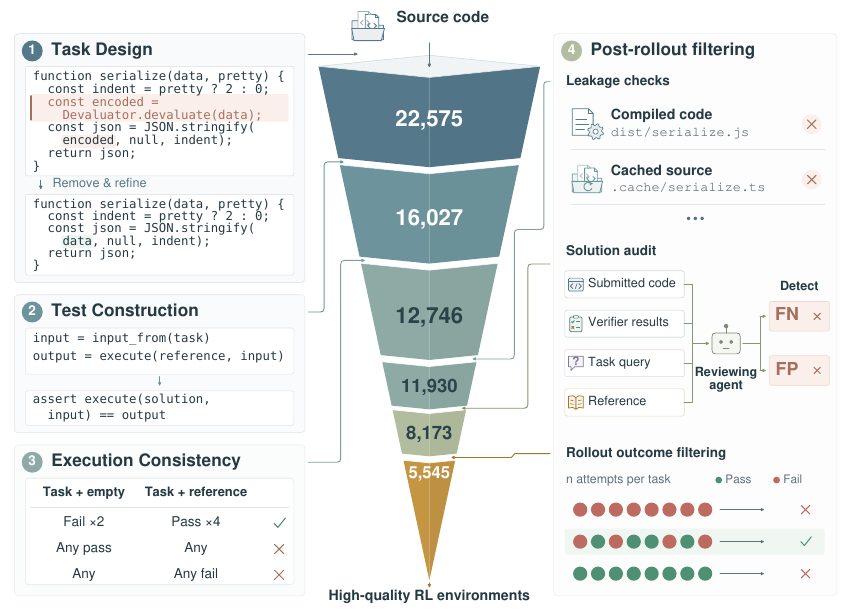
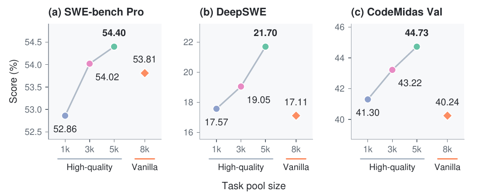
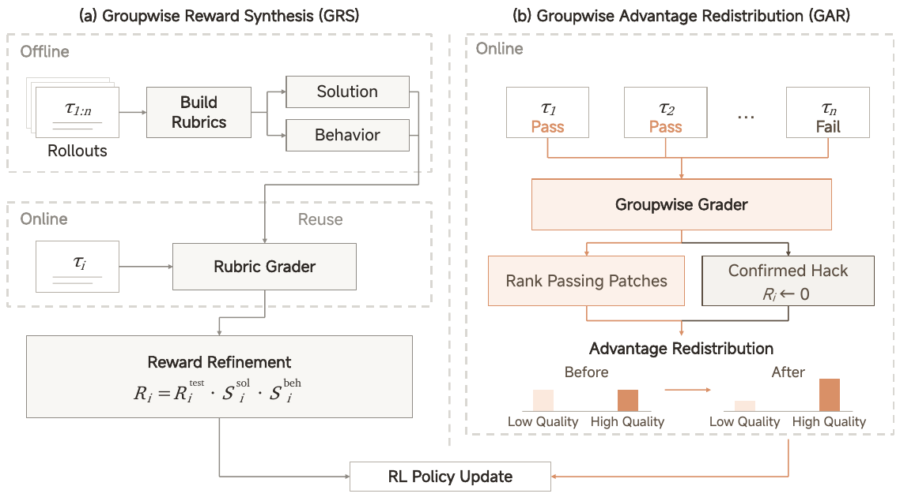
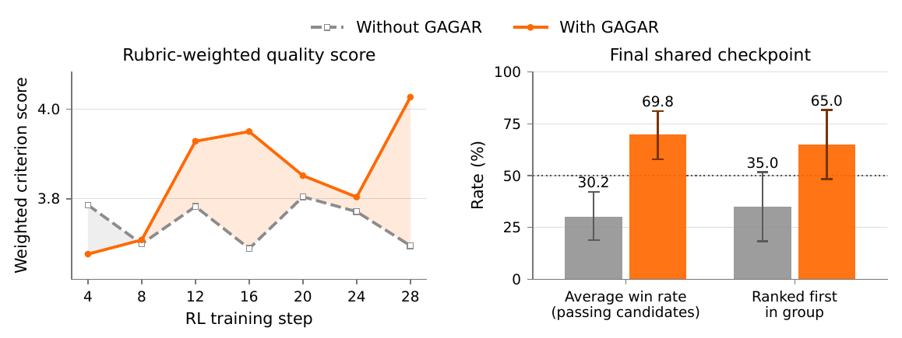
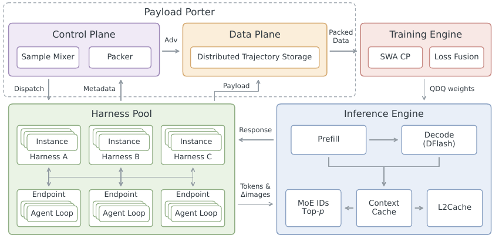
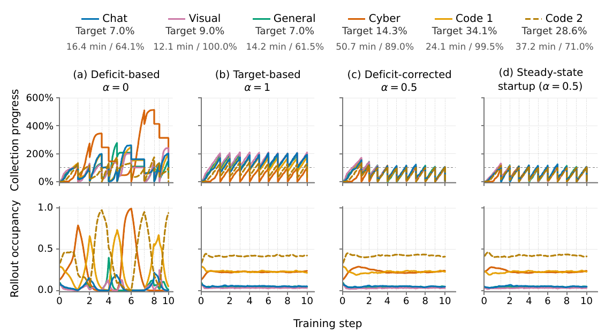
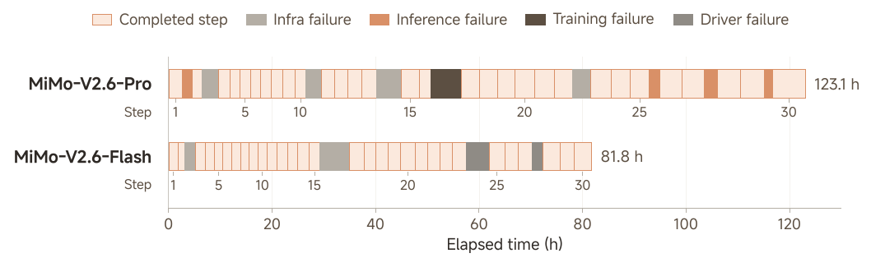

# MiMo-V2.6 技术报告解读：算法演进、强化学习系统与复现边界

> 本文面向个人学习与团队技术研讨，分析 MiMo-V2.6 的环境构建、奖励设计、训练系统及复现条件，并结合 MiMo 系列公开历程讨论算法与基础设施的协同演进。

## 摘要与核心结论

**本文的核心判断是：MiMo-V2.6 的工程价值，在于将环境质量、奖励可靠性与训练经验的供给作为相互约束的问题处理。** 环境决定模型能尝试什么，评分决定什么行为被鼓励，调度影响实际消费的经验，执行一致性约束概率计算与参数更新的有效性。扩大 RL 计算，需要同时处理这三件事。

分析区分三类证据：报告披露的设计、作者报告的实验结果，以及本文据此提出的工程推断。本文完成文献、公开接口与部分代码核查，未独立复现训练；因此，以下结论均受对应实验条件限制。

| 核心结论 | 主要依据 | 应保留的边界 |
|---|---|---|
| **环境质量影响监督可信度。** 执行验收与泄漏筛查影响 reward 的可靠性；当前策略下的学习价值还需另行判断 | [CodeMidas 的构造与筛选实验](#22-环境质量的实验依据) | 独立实验基于 V2.5；尚不能量化它对 V2.6 总收益的贡献 |
| **测试通过不能穷尽实现质量。** Grader 为正确解之间的偏好提供额外监督 | [GRS / GAR](#24-grs-与-gar奖励构造和优势重分配)、[GAGAR 的质量审核](#25-gagar控制实验与独立质量审核) | 评分偏好与模型盲审，不自动等于真实维护者收益 |
| **RL 系统需要同时保证供给效率与训练语义。** 长尾调度、跨版本轨迹与训推一致性均需纳入验收 | [Sample Mixer](#32-sample-mixer异构任务的供给调度)、[训练故障](#43-故障分析与恢复约束) | 局部吞吐或模拟收益，不能直接当成固定成本下的能力提升 |
| **终局成功率不足以独立完成发布验收。** Mixed RL 与 MOPD 可分担学习和修复职责，过程行为仍需单独评估 | [工具调用重复与 MOPD 修复](#51-工具调用重复与-mopd-修复) | 专门 teacher 的改善，仍需在 student 完整任务上检查回归 |

**复现条件。** 已有公开代码、RL 任务与 9B SFT 起点，可尝试分领域实验；完整 Flash / Pro 训练所需的数据与系统条件尚未全部核验。官方参考拓扑为 32 / 64 卡，不是经过验证的最低要求，详见[复现与卡数](#81-复现范围与硬件规模)。

## 目录

1. [研究范围与训练全貌](#1-研究范围与训练全貌)
2. [环境构建与奖励设计](#2-环境构建与奖励设计)
3. [强化学习基础设施](#3-强化学习基础设施)
4. [实验结果与运行稳定性](#4-实验结果与运行稳定性)
5. [发布后的行为修复](#5-发布后的行为修复)
6. [工程判断与验证路径](#6-工程判断与验证路径)
7. [算法与基础设施的演进](#7-算法与基础设施的演进)
8. [开源资源与复现条件](#8-开源资源与复现条件)
9. [局限性与待验证问题](#9-局限性与待验证问题)

## 1. 研究范围与训练全貌

### 1.1 分析框架

所引材料共同覆盖了一条工程链：**把软件功能变成可验证任务，将任务执行结果转化为可评分的 trajectory，再将异构、长尾的 trajectory 组织为训练输入。** 扩大 GPU 规模需要环境供给、奖励可靠性与样本调度同时跟上。

本文从两个维度展开分析：其一是**监督如何成立**，包括规格、verifier 和 grader；其二是**监督怎样被消费**，包括 rollout、过滤、调度、训推一致性和恢复。前者回答梯度是否在鼓励正确行为，后者回答最终进入梯度的是哪些经验。两者相互影响，也是后文工程观点的依据。

### 1.2 模型架构与训练阶段

[M] Table 1 给出 Flash 约 **310B 总参数 / 15B 激活**，Pro **1.02T / 42B**，均采用 hybrid SWA/global attention 与 sparse MoE，并接入视觉和音频 encoder。Flash 模型卡另写 309B；本文统一沿用报告 Table 1 的 310B 口径，不据此推断架构变更。

训练阶段是 text pretraining → omni pretraining → agent-centric mid-training → 短 SFT → mixed-task RL → MOPD2。Mid-training 把上下文延长到 1M，并为大 batch RL 引入 Muown 与 MXFP4 QAT。[M] §3、§5.6。因此，“六天直播”只覆盖其中的 RL 实验，不能解释为从零训练出模型的全部成本或时间。

### 1.3 研究对象与实验边界

下文以 **[M]** 指 MiMo-V2.6 总报告，**[C]** 指 CodeMidas，**[G]** 指 GAGAR，**[B]** 指工具调用重复复盘，**[L]** 指直播接口。章节与图表号均对应原文，完整信息见[材料与来源](#参考资料)。

**报告关系。** CodeMidas 独立实验训练的是 **MiMo-V2.5**；[M] §4.2.1 明确引用它作为源码驱动的任务合成路径之一，但没有披露 CodeMidas 在 V2.6 全部训练数据中的精确比例或单独贡献。CodeMidas 的 5,545 个任务、V2.6 发布的约 7k 任务、直播累计 trajectory 数，是三种不同计数。

| 实验 | 起点与训练方式 | 它主要回答的问题 |
|---|---|---|
| CodeMidas | MiMo-V2.5，源码合成的 coding tasks，binary-reward GRPO | 这类环境能否提供跨软件任务的有效监督 |
| V2.6 mixed RL | V2.6 SFT 起点，多领域、多 harness、大 batch RL | 环境、grader 与运行系统如何共同支撑放大训练 |
| 9B 开放实验 | 同一个 distilled SFT 初始化，分别做领域 RL；另做 multi-harness coding | 开放资源是否足以形成可继续研究的较小规模基线 |

三组实验的模型、数据和训练流程不同，结果只能在各自实验条件下解释，增益不能相加。来源：[C] §4、[M] §5、§7。

相关入口：[Agentic RL](../../04-rl-infra/topics/agentic_rl.md#mimo-v26-environment-contract)、[RL 框架选型](../../04-rl-infra/topics/rl_framework_selection.md)、[长上下文训练](../../02-training-infra/topics/long_context_training.md)、[MoE](../../02-training-infra/topics/moe.md)、[阅读决策](../reading_queue/P1.md#mimo-v26-reading)。

#### 术语定义

| 概念 | 在本文中的含义 |
|---|---|
| Task / environment | Task 是要完成的工作与验收规格；environment 提供代码、工具、文件和可恢复的初始状态。一个任务可以被反复尝试 |
| Harness | 驱动 agent 运行的程序：组织提示、调用工具、管理上下文与停止条件；改变 harness 会改变模型遇到的交互过程 |
| Rollout / trajectory | 一次尝试的执行及其记录，可能跨多轮、多个 context 和 policy version；不是一次模型请求 |
| Group | 同一 prompt 的多条尝试，用于组内比较和 advantage 估计；本文出现的 group size 16 表示每 prompt 16 条 rollout |
| Verifier / grader | Verifier 常指执行测试等验收机制；grader 泛指评分组件，也可以是会读代码、执行工具的 agent。两者不是完全互斥的分类 |
| Reward / advantage | Reward 是任务评价结果；advantage 决定相对基线加强或抑制哪些生成行为，不能把二者当作同一个分数 |

## 2. 环境构建与奖励设计

本节分析训练信号的两个来源：可执行环境提供的正确性验收，以及 grader 对实现质量的补充判断。二者分别约束 reward 的可信度与区分度。

### 2.1 CodeMidas：源码驱动的环境构建



*图源：[CodeMidas v1，Figure 1，PDF 第 4 页](https://arxiv.org/pdf/2609.22068v1#page=4)。*

**图解。**图中左侧为任务设计与测试构造，右侧为 rollout 筛选，中间漏斗表示候选任务的保留过程；22,575 到 5,545 是任务数变化，不能读成训练 step、成功率或各阶段的独立质量增益。

一个任务由 **行为规格、容器化开发起点、隐藏 executable verifier** 组成。Solver 拿到删去目标功能的代码与依赖；原实现独立保留，hidden verifier 在评分时才注入。[C] §3。

| 阶段 | 作者实际做了什么 | 工程上保护什么 |
|---|---|---|
| Task design | Agent 追踪公开接口和依赖，抽取已有功能，删除核心实现，联合修订任务描述与起始代码 | 任务可以明确验收，同时允许替代实现 |
| Test construction | 在 reference 上执行 CLI、纯函数或有状态 API；每条断言关联规格中的要求 | 测试预期有执行证据，减少凭空生成 oracle |
| Assertion review | 去掉规格未要求的消息文案、内部结构、偶然顺序；依赖 private symbol 且无行为替代的任务被拒绝 | 避免正确实现因“不像参考答案”而被误杀 |
| Environment preparation | 安装依赖，清除目标实现相关编译产物、缓存、构造过程遗留文件与原测试，保留离线构建材料 | 保留可执行性，并降低残留答案泄漏风险 |
| Execution consistency | 6 个全新容器：起始状态 2 次必须都失败，reference 4 次必须都成功 | 筛掉无效测试和执行不稳定的任务 |
| Post-rollout filtering | 对抗 agent 查泄漏；每任务 4 条 coding rollout 交给独立 reviewer 审核 verdict；另用 frontier model 筛选成功与失败并存的任务 | 检查真实策略面对环境时是否得到可信且有区分度的监督 |

#### Verifier 边界示例

下面借 [C] Figure 9 的隐藏文件任务改写一个教学例子，**表中实现是解释用的假设，不是论文新增实验结果**：目录含 `public.csv` 与 `.secret.csv`，规格要求默认忽略隐藏文件，`hidden=True` 时包含隐藏文件。

| Solver 的实现 | 按规格应怎样评分 | 能暴露什么问题 |
|---|---|---|
| 根据 `hidden` 参数正确切换，内部算法与 reference 不同 | 通过 | 若失败，可能是测试约束了无关实现细节，即 false negative |
| 始终忽略 `.secret.csv` | 失败 | 只测默认参数，会把不完整实现判为正确，即 false positive |
| 始终返回 `.secret.csv` | 失败 | 只测 `hidden=True`，也会漏掉另一半要求 |
| 修改后单次过测，但换全新容器就因残留状态失败 | 暂不纳入可信训练环境 | 要排查构建、reset 或状态依赖，单次通过不够 |

这个例子串起了三个不同问题：规格是否完整、测试是否覆盖规格、执行环境是否稳定。对于规格没有要求的细节，例如报错文案或内部 helper 命名，不能仅因 reference 恰好如此就要求 solver 照搬。

这里的 **reference execution 是证据，不是自动正确的规格**。现有代码可能有 bug；reviewer 也可能和生成器共享盲区。CodeMidas 把这些风险变成可检查的筛选过程，没有证明它们被彻底消除。

另外，全通过/全失败不等于任务一定坏：可能是筛选模型太强、太弱或预算不合适。最终数据分布依赖筛选 policy 和 rollout budget；换基座后应重新测量有效任务比例。[C] §3.4。

### 2.2 环境质量的实验依据

训练集包含 **5,545 tasks / 3,185 codebases / 23 languages / 15 domains**。训练采用 MiMo-V2.5、GRPO、binary execution reward，batch 32、每任务 32 rollouts；标准差 advantage normalization 关闭，最大 staleness 为 8。[C] §3.5、§4.1、Appendix A。这组配置不能当作 V2.6 的训练配置。

| 评测 | 初始策略 | CodeMidas RL | 绝对增益 |
|---|---:|---:|---:|
| SWE-bench Pro | 50.3 | 54.4 | +4.1 pp |
| DeepSWE v1.1 | 10.0 | 21.7 | +11.7 pp |
| ProgramBench：Almost Solved | 4.5 | 21.5 | +17.0 pp |
| RepoZero C2Rust | 40.5 | 51.8 | +11.3 pp |
| Terminal-Bench v2.1 | 63.7 | 72.2 | +8.5 pp |

来源：[C] Figure 5、§4.1。**pp 为百分点，不是相对百分比；ProgramBench 是通过至少 95% tests 的任务比例，并非 fully solved。** 作者检查了训练任务与验证集、五个外部 benchmark task sets 不相交，但不能据此声称排除了 pretraining contamination 或所有仓库级相似性。

#### 数据质量与规模的对照



*图源：[CodeMidas v1，Figure 8，PDF 第 9 页](https://arxiv.org/pdf/2609.22068v1#page=9)。图中 5k 指完整的 5,545 个任务。*

图中圆点表示不同规模的高质量任务子集，菱形表示未清洗的 vanilla 8k 任务池。高质量 3k 子集在三个被比较评测上均胜过未清洗的 vanilla 8k；完整高质量集的 DeepSWE 为 21.70，vanilla 8k 为 17.11。[C] §5.1、Figures 7–8。

**图能支持的结论：**在作者报告的这些设置中，整套清洗、执行检查和 rollout 筛选有价值，任务多并不自动更好。**读图限制：**三个面板的纵轴范围不同，斜率不能横向比较；实验没有隔离每个筛选步骤的贡献，也没有按总环境构造成本比较。

还要区分“相同训练配置”与“相同 checkpoint”：CodeMidas Val 的 1k 分数 41.30 对应 step 30，3k 的 43.22 对应 step 65，完整集的 44.73 对应 step 70。它们不是共同末步的严格配对；另两项评测的 checkpoint 选择方式在该段未明确说明。原 Figure 7 提供补充的轨迹证据：完整集在 step 40–70 的每个被评估点均领先。[C] §5.1。

行为分析发现更多代码探索、自验证以及任务相关的长度变化。CodeMidas Val 上，自编写并执行 checks 的 rollout 成功率高 4.2 pp，95% CI 为 1.8–6.6；这是同任务、同 checkpoint 的关联分析，不能说“多跑测试必然因果提升 4.2 pp”。[C] §5.2。尤其不能把工具调用次数本身变成质量奖励。

### 2.3 多领域任务与验收机制

[M] §4.2 把 CodeMidas 放在更广泛的任务体系中：

| 任务域 | 环境与验证设计 | 最需要防止的失真 |
|---|---|---|
| Code | Issue/PR、员工真实需求、复杂规格、源码功能、长程工程任务等路径；规格与测试对齐；reference patch 的 F2P/P2P 检查 | 测试漏验、过严、泄漏和 flaky execution |
| General | 真实文件与本地 software mock；planner 组织工作区和数据库，生成后检查实体、金额、时间线及引用的一致性 | mock 与真实业务语义脱节，跨文件状态矛盾 |
| Visual | 开放设计结合 pointwise/groupwise judging；视觉复刻结合规则相似度与整体视觉判断 | 外观好看掩盖功能错误，judge 偏好替代用户要求 |
| Cyber | 以目标漏洞复现为任务，按 sanitizer 报告的漏洞类型和项目栈位置检查匹配 | 把任意 crash 错当作目标漏洞成功 |

注意两个验证流程的区别：[C] 是起始状态 2 次失败、reference 4 次通过；[M] §4.2.1 对带 reference patch 的 coding tasks 描述的是 F2P/P2P 结果在 **8 次 reruns** 中稳定。不要把它们写成同一套数字。

General 环境强调所有状态本地化、每条 rollout 的 sandbox 可恢复到固定初态，避免外部服务限流和网络随机性。[M] §4.2.2。**迁移判断：**环境 reset、状态一致性和 verifier 版本，都应成为训练样本的身份信息；“工具调用成功”不足以证明任务状态正确。

### 2.4 GRS 与 GAR：奖励构造和优势重分配

二元测试奖励为多个 passing solutions 赋予相同 reward，但其中可能有不必要改动、漏掉非测试覆盖要求或重复试错。MiMo 对不同 coding 子集采用两种方法。[M] §4.3、Figure 7。



*图源：[MiMo-V2.6，Figure 7，PDF 第 17 页](https://huggingface.co/XiaomiMiMo/MiMo-V2.6-Pro-RL/resolve/73875d00b30a89ef8cc353a0b60b0e9f9561952d/MiMo_V2_6_technical_report.pdf#page=17)。*

**图解。**左侧 GRS 离线分析多条解、在线复用 rubrics；右侧 GAR 在线联合比较同组轨迹。两条路径作用于不同任务子集，并不是每条轨迹依次经过的两道工序。右下角柱形是 advantage redistribution 的示意，不是实测性能图。

| 比较项 | GRS | GAR |
|---|---|---|
| 额外判断发生在哪里 | 离线构造 rubrics；在线逐条评分 | 在线对同组轨迹联合判断 |
| 主要改变什么 | 最终 reward 的数值 | 修正已确认 hacking 后，重分配 sequence advantage |
| 主要覆盖哪类 coding task | 部分高通过率任务 | 其余任务的 mixed-outcome groups |
| 可以产生什么额外信号 | 测试都通过，也能因质量分数不同而区分 | 把更多正 advantage 分给质量较高的 passing solution |

**GRS（Groupwise Reward Synthesis）**：面向部分高通过率任务，离线比较多条 rollout，生成 task-specific solution/behavior rubrics；在线逐条复用评分。公式为：

```text
R_i = R_test_i × S_solution_i × S_behavior_i
```

测试失败仍为零；全部测试通过时，如果 quality scores 不同，仍有可学习差异。因此，“all-pass 一律无梯度”只适用于最终 reward 相同的情况，不能把 raw test passrate 当作所有分支的过滤标准。

**GAR（Groupwise Advantage Redistribution）**：对其余 coding tasks 的 mixed-outcome groups，在线 grader 在共享工作区比较成功与失败轨迹，对 passing patches 排序；确认 hacking 的轨迹先置零 reward，再重算组统计。其余 passing trajectories 按质量重新分配正 advantage。[M] §4.3.2。

用原文未加 cap 的形式表示，`A_i = R_i - mean(R)`；给成功项一个 `f_i ∈ (0,1]`，再令 `λ = Σ_pass A / Σ_pass(f × A)`，`A'_i = λ f_i A_i`。失败项在这一步不变。工程实现还会限制 λ、再做全组零均值化；因此不能宣称所有实际分支都严格保持未加 cap 公式的守恒关系。

**解释例子，非原实验：**4 条轨迹 reward 为 `[1,1,0,0]`，组均值为 0.5；两条成功轨迹的质量因子取 `[1,0.5]`，则 `λ = 1 / 0.75 = 4/3`。

| 轨迹 | Reward | 原 advantage | 质量因子 | 未加 cap 的新 advantage |
|---|---:|---:|---:|---:|
| A：成功，质量较高 | 1 | +0.5 | 1 | +0.667 |
| B：成功，质量较低 | 1 | +0.5 | 0.5 | +0.333 |
| C：失败 | 0 | −0.5 | 不参与成功项重分配 | −0.5 |
| D：失败 | 0 | −0.5 | 不参与成功项重分配 | −0.5 |

成功项总 advantage 仍为 1，改变的是成功轨迹之间的相对权重。GAR 调整的是 **sequence-level advantage**，再广播到 response tokens；不能称为每个 action 都获得了独立的因果 credit assignment。

Grader 输出不可用时，报告采用原 advantage fallback；正式训练仍需观测其占比，否则不同任务会在不同评分规则下被优化。GRS/GAR 与 token-level penalty module 也应分开理解：后者对重复、错误等被标记 token 施加更细粒度约束。[M] §4.3、§6.1。

**效果证据与边界：**[M] Figure 8 比较 Flash 的 code-only RL，有 GAR 时通过率持续改善，turns 更稳定、token 长度增长更缓；该实验 batch 为 128、采用 token-mean aggregation，和大规模 mixed run 的 prompt-mean aggregation 不同。在该对照中，GAR 伴随较高通过率与较受控的轨迹长度，支持其缓解长度膨胀的解释，但不能推导“所有 V2.6 任务都越来越短”：主 mixed run 的 Figure 9 明确显示，效果提升通常也伴随更多 total tokens。

### 2.5 GAGAR：控制实验与独立质量审核

[G] 将 **groupwise agentic grading + advantage redistribution** 合称 GAGAR，并不是在 GAR 之后又追加一轮独立收益。Code-only Flash 控制实验从 pre-RL SFT 开始，batch 128、每 prompt 16 条 rollout、token-mean loss；Flash 和 Pro 都使用同一个 pre-RL MiMo-V2.6-Pro SFT checkpoint 作在线 grader。[G] §3.2、§4.1。

| 同一个 step 28 的比较 | Binary baseline | GAGAR | 能支持什么 |
|---|---:|---:|---|
| DeepSWE avg@3 | 50.2% | 62.2% | 在相同训练步数上，作者报告的分数高于基线 |
| DeepSWE 平均 turns | 132.3 | 111.6 | 较少交互轮数 |
| DeepSWE 平均总 token | 191.9k | 172.9k | 较低实际 token 消耗 |
| SWE-bench Pro 平均总 token | 79.9k | 68.6k | 效率变化依任务而异 |

来源：[G] §4.2。正文将第一行增益写为 12.1 pp，但所列一位小数相减为 12.0 pp；这里保留原分数，不补猜更高精度。Binary baseline 因性能下降在 step 28 停止，GAGAR 后续跑到 step 52；后续峰值不能当作与 baseline 等步数的比较，也不是公开 mixed run 超过了 30 steps。图中 token/turns 是主 agent 指标，未涵盖 grader 成本。



*图源：[GAGAR v1，Figure 3，PDF 第 9 页](https://arxiv.org/pdf/2609.32577v1#page=9)。*

**独立质量审核。**作者固定随机抽取 30 个 DeepSWE 任务，每方法每任务最多 3 条 rollout，匿名、随机排序后交给与在线 grader 不同的 **Claude Opus 5** 审核。双方均有评测的最后一个训练步 的 rubric 加权分数为 4.03 对 3.70；GAGAR 在 passing candidates 中的平均胜率为 69.8%，组内第一比例为 65.0%，跨方法并列平分。[G] §4.3。

右图的 69.8% **不是任务通过率，也不是人类接受 patch 的比例**。这是小样本、模型裁判、指定 rubric 下的质量证据；没有直接测到真实维护者的 merge/rework 成本。左图也并非每个早期 checkpoint 都领先。

#### 实现细节：零均值、正 advantage 总量和梯度不是同一个不变量

[G] Appendix A.1 披露了质量 tier 与 rank-to-factor 映射；A.2 给出 Flash 的 `λ_max = 1.5`。Cap 不触发时，前文公式保留成功项 advantage 总和、失败项 advantage 和成功项比例；触发 cap 后再减组均值，只能恢复零均值，前两项不再保证。

§4.4 的负面对照是 **只折扣 positive advantage、既不恢复总量也不重新中心化**。它出现 entropy 与长度更快增长、评测不稳；这不能泛化为“reward shaping 都不稳定”。A.3 明确说明，在 mean-centered estimator、相同 rollouts/质量因子及其余 loss/mask 设置下，可构造等价 reward 得到相同梯度；额外 reward clipping 或标准差归一化通常会破坏等价性。Sequence advantage 总量守恒也不等于经过 token 权重、importance ratio 和 clipping 后的总梯度守恒。

**评分延迟：**[G] §3.2 报告替换在线 grader 后，平均组评分耗时从约 2,000 秒降至约 600 秒；同组 rollout 全完成后才开始 grading，再与其他任务的 rollout 重叠。据此应测量“最慢 rollout + grading”的组就绪延迟，但不足以据此推算整条 RL 流程加速比。

## 3. 强化学习基础设施

本节分析异构任务的执行、数据传输与采样调度，并进一步讨论长上下文和权重更新下的状态、显存及概率一致性。

### 3.1 Runtime：执行编排与数据传输



*图源：[MiMo-V2.6，Figure 14，PDF 第 28 页](https://huggingface.co/XiaomiMiMo/MiMo-V2.6-Pro-RL/resolve/73875d00b30a89ef8cc353a0b60b0e9f9561952d/MiMo_V2_6_technical_report.pdf#page=28)。*

**图解。**Harness Pool 与 Inference Engine 负责多轮执行；metadata / payload 路径区分调度与数据传输；Training Engine 经 QDQ weights 路径将更新后的权重提供给推理侧。图中模块是职责划分，不能直接当作一套完整集群部署清单。

- **Harness Pool**：固定规模的 persistent Ray host actors 承载多个并发租户，避免每条 trajectory 一个 actor 导致 GCS file descriptor 耗尽。阻塞环境操作与 tokenization 放到后台线程，避免堵塞共享 event loop。不同 harness codebase 用不同 pool；同一个比较 group 保持相同 harness 配置。[M] §6.2。
- **Payload Porter**：tokens、logprobs、MoE routing、top-p candidates、视觉数据写入分布式 store；driver 只处理 reward、长度与 payload keys。按训练消费位置读取和 packing，不把整个 batch 聚合到 driver。[M] §6.2。
- **Sample Mixer**：根据各 source 的目标份额、有效率、执行时间和当前缺口分配并发。组内评估、dynamic sampling 与 partial rollout 一起决定最终被训练的数据。[M] §6.3。

报告生产训练使用 **Megatron-LM + SGLang**。[M] §6.4。发布说明中的 **verl + uni-agent + mini-swe-agent** 指向社区复现实验栈；本文没有将二者视为完全相同的实现，也没有完成公开 RL 框架的源码复现。

#### 沿一条 trajectory 追踪数据：为什么 driver 不应该收齐所有 tensor

| 阶段 | 控制逻辑需要什么 | 大 payload 留在哪里 |
|---|---|---|
| 多轮执行 | 当前任务、harness、请求与恢复状态 | Inference Context Cache 保留 KV 与相关执行记录，多模态请求只传增量 |
| 执行中的分支：完成前遇到 policy 更新 | 当前版本、未完成轨迹和重新准入条件 | 新版本重建 KV；已生成 token 的 behavior logprob 保持原记录，随后继续执行 |
| Rollout 完成 | 长度、reward、payload key 等 metadata | Tokens、logprobs、routing、candidate sets、视觉输入进入 distributed store |
| Group 评分与筛选 | Grader 结果、组内统计、接受与过滤决定 | 评分或 hook 按需取字段，advantage 写回 store |
| 形成训练 batch | 各 source 配额、packing 与 rank 分配计划 | Packer 在消费处读取需要的行与 CP window，不在 driver 聚合 full batch |

以上按 [M] §4.1、§5.1、§6.2–6.4 整理。它解释生命周期，不代表原报告披露了所有对象清理和失败重试细节。尤其要继续检查取消任务、grader fallback、过期 group 和 packer 失败后，数据由谁释放。

### 3.2 Sample Mixer：异构任务的供给调度

假设某个 source 每 step 需要 `B_i` 个保留 groups，接受率为 `r_i`，平均有效 rollout 时长为 `t_i`。报告以 `m_i = B_i / r_i` 估计生成需求，并据 `t_i × m_i` 调节并发预算。[M] §6.3。实际公式还有全局 oversampling 预算和每 source 上下界，不应直接无限放大低接受率 source。

**解释例子，非原实验：**两个 source 都需要 100 groups；A 耗时 1 分钟、接受率 0.8，B 耗时 10 分钟、接受率 0.2。需求约为 125 与 500 groups；达到同样供给速度，B 的并发需求约是 A 的 `10×500/125 = 40` 倍。只按目标 1:1 投递，会让慢 source 拖住整个 batch。

调度权重进一步混合长期需求与当步缺口：

```text
w_i = α × B_i/r_i + (1-α) × max(B_i-A_i, 0)/r_i
```

`A_i` 是当前已接受数。报告比较 `α=0`、`1`、`0.5`，并结合预分配并发处理冷启动。**Figure 16 是 trace-driven simulation**，排除了 training time、credit-assignment latency、staleness expiry、replay；不能拿它当端到端生产 speedup。



*图源：[MiMo-V2.6，Figure 16，PDF 第 31 页](https://huggingface.co/XiaomiMiMo/MiMo-V2.6-Pro-RL/resolve/73875d00b30a89ef8cc353a0b60b0e9f9561952d/MiMo_V2_6_technical_report.pdf#page=31)。保留原图的 source 目标比例、耗时、接受率及各面板坐标。*

模拟固定总并发上限，source budgets 不构成约束；四列比较的是 α 对应的调度策略及 steady-state startup。该图没有单独验证自适应 budget 或 KV dispatch 的收益。[M] §6.3。

图中上下两排对应不同测量对象：

- **上排 collection progress** 是已接受 group 相对每步目标的比例；超过 100% 表示积累了可结转的 surplus，不是 GPU 利用率超过 100%。同一列内各 source 进度差异大，说明收集并不均衡。
- **下排 rollout occupancy** 是各 source 占用 sequence slots 的份额，不是 GPU utilization。左侧只追缺口的方案出现明显振荡；混合长期目标与缺口后，占用更稳定，收集也更均衡。
- **横轴 step 的间距承载时间信息**，竖虚线是 step 边界。它与原 Figure 12 的真实运行故障时间线不是同一类证据。

> **读图结论：**这组模拟支持用耗时、接受率和缺口共同调度异构任务。实际吞吐仍要纳入 grader 延迟、训练耗时、陈旧样本淘汰、KV 容量与恢复代价后测量。

Predictive Rollout Dispatch 同时约束预计 KV 需求和 inference concurrency；tool time 很长时，活跃 trajectory 数不等于同时请求 GPU 的数量。启动/恢复阶段允许从慢 source 重放合格 group，限第一轮收集，并要求符合对应 policy/staleness 条件。[M] §6.3。

### 3.3 大批量训练与并行策略

V2.6 报告给出的主要配置是 **1,568 prompts × 16 rollouts = 25,088 trajectories/step**，asynchronous partial rollout 的 staleness 配置为 4；RL 目标任务混合为 coding 68%、general 12%、visual 13%、context following 3%、cyber 4%。[M] §5.1。直播期间存在数据调整，这不是每一步都不变的实际比例。

训练利用 DP 消费大 batch，TP/CP 支持大模型与长序列，MoE 涉及 EP。报告未给出可完整复刻此次大规模运行的 GPU 型号、精确卡数、拓扑及每阶段 TP/PP/CP/EP 全量配置；**不能由模型大小或费用反推一个确定部署方案**。

优化目标也不宜只写成“标准 GRPO”：报告采用 prompt-mean aggregation 与 token-level importance ratio，并分别为正负 advantage 设置上下界，通过 mask 排除越界 token；上下界初始均为 `[0.2, 5.0]`，运行中依据 entropy 调整。[M] §5.1。因此大 batch、grader、optimizer、clipping 和人工干预共同影响曲线，无法把所有收益归因于扩大算力。

Partial rollout 在权重更新后恢复未完成序列，需要 re-prefill；旧 token 保留生成当时的 inference logprob，不用新模型覆盖其 behavior probability。[M] §4.1、§5.1。工程迁移应保留 token/segment 的 policy lineage，不能给整条跨版本 trajectory 只标一个“最新版本”。

### 3.4 长轨迹的显存与缓存管理

| 机制 | 报告披露 | 迁移时的验收点（本文建议） |
|---|---|---|
| Context Cache | 同 policy version 多轮复用 KV，只 prefill 新 suffix；工具等待时 offload 到 pinned host pool | 分别量化 HBM、host pool、cache miss 与 re-prefill；版本更新必须失效旧 KV |
| SWA + CP | 128-token SWA 层只交换 query 可达的 KV，流量受 window 大小约束 | full-attention 层仍需单独计算通信与容量，不能把全部层都按 SWA 估算 |
| CPU optimizer state | 更新参数时才搬回 optimizer state | 测 optimizer 搬运是否进入 step 关键路径 |
| Loss fusion / CP-local packing | 融合 PG/OPD loss 与可选指标；packer 只读取 CP window 需要的行 | 检查 loss/logprob 是否重新 materialize 全序列或大 logits |
| MoE router freezing | 抑制 RL 期间 expert-load drift | 仍要测 micro-batch × layer × EP rank 峰值，而非只看全 batch 平均 |

来源：[M] §5.4–5.5、§6.2–6.4。冻结 router 参数并不保证输入分布和 micro-batch 分组下的路由负载恒定；它也不能消除所有 expert activation OOM。

### 3.5 训练与推理一致性

训推一致性涉及三个不同问题：[M] §6.4。

1. **权重值一致**：每次更新后对专家权重 QDQ，使训练看到与 rollout MXFP4 kernel 对齐的权重值。
2. **执行路径一致**：R3 保存 rollout 选中的 expert indices，训练时 replay，处理数值差异触发的离散 expert 切换。
3. **概率归一化一致**：保存 top-k/top-p 实际候选集合，在同一集合上计算训练 logprob；不能把截断后的 rollout 概率和 full-vocabulary training 概率直接作比值。

同一 policy version 内，Context Cache 保留 MoE IDs、candidate sets、视觉输入等状态；多轮只传新图像增量。训练时视觉 encoder 先按图像负载分配，生成 embeddings 后再分发到对应 token ranks。[M] §6.2、§6.4。代价是更重的有状态缓存与数据生命周期管理。

推测解码也按 **端到端吞吐** 选择配置：报告中 mixed-task RL 的 block-6 相对 block-8 吞吐约高 6%，而 accepted length 变化不大。[M] §6.4。不能只凭 draft acceptance rate 决定最快配置；该数字也不是通用部署加速比。

## 4. 实验结果与运行稳定性

### 4.1 公开训练记录的规模与成本

以下数字来自已保存的[训练快照](../../assets/handbook/mimo_v26/source_snapshot.json)：Pro 与 Flash 均记录为 `mode=ended`、`step.last=30`。表格用于分析这两条公开 run，不是实时看板；抓取时间与后续接口核验结果保存在[来源记录](../../assets/handbook/mimo_v26/source_snapshot_2026-10-08.json)中。

| 指标 | Pro | Flash | 口径 |
|---|---:|---:|---|
| 完成 step | 30 | 30 | `step.last` |
| 累计训练 trajectory 计数 | 752,640 | 752,640 | `totals.trained_cum`；不代表 distinct tasks 或全部生成尝试 |
| 看板累计 token 计数 | 75.00439B | 81.39770B | `totals.tokens_cum`；不是 pretraining tokens，也不是全部新生成 response tokens |
| Step 30 token 计数 | 3.43137B | 3.69598B | `totals.tokens_step`；不能用末步大小乘 30 重构累计量 |
| 看板累计成本 | $2,620,670.84 | $854,044.70 | `cost.so_far`；公开计费口径，非完整项目成本审计 |
| DeepSWE step 1 → 30 | 58.41 → 72.57 | 48.67 → 65.68 | [L] benchmarks 标注 mini-swe-agent、avg@3 |

`25,088 × 30 = 752,640`，所以约 75 万是**每个 run**的训练 trajectory 计数，不应写成两个 run 总共 75 万。[M] §4.1 给出的 2.7–3.7B tokens/step 是报告描述范围；直播记录包含低于此范围的早期 step，应保留各自口径。

[M] Figure 3 给出 Pro 成本组成：training 43.5%、rollout 43.8%、grader 12.7%。至少在该实验中，grader 已是不可忽略的计算项目；但不能把该比例套到所有 Agentic RL 工作负载，也不能从费用推算 GPU 利用率。

### 4.2 评测口径与版本差异

- **RL dynamics 与最终模型评测不同**：[M] Figure 3 / [L] 的 Pro、Flash 末步 DeepSWE 为约 72.6、65.7；[M] §5.6 在 MOPD2 之后引入的最终 Table 3 为 71.9、67.9。不能把两组分数混用为同一次 RL 的前后对照，也不能仅凭差值判断 MOPD2 的独立效果。
- **avg@3 不等于 pass@3**：前者平均多次尝试的成绩；后者通常表示多次尝试中至少一次成功的概率。直播标签使用 avg@3。
- **elapsed time 的边界不一致**：[M] Figure 12 标注 Pro 123.1h、Flash 81.8h；[L] `run.end - run.start` 算得约 127.49h、83.09h。起止/恢复计入方式未完整说明，本文不把二者强行统一，也不据此计算统一每 step 性能。
- **混合分布发生过人工干预**：[L] notices 记录移除 Pro cyber 数据及过滤相对容易的任务。因此平均 passrate 变化包含任务分布变化，须配合固定 held-out eval 阅读。
- **新论文也有阶段表述需要对齐**：[G] §4.5 / Table 1 将 71.9、67.9 归于 industrial mixed-task RL 最终模型；[M] 则在 MOPD2 段落后介绍含同组数字的 Table 3。两文未提供足够 checkpoint lineage 来消除这一表述差异，不能当作新一轮增益，更不能从中计算 MOPD 的独立贡献。

### 4.3 故障分析与恢复约束

#### 故障证据



*图源：[MiMo-V2.6，Figure 12，PDF 第 24 页](https://huggingface.co/XiaomiMiMo/MiMo-V2.6-Pro-RL/resolve/73875d00b30a89ef8cc353a0b60b0e9f9561952d/MiMo_V2_6_technical_report.pdf#page=24)。*

**图解。**相同的 30 steps，由于每步计算量和故障、恢复间隔不同，占据不同墙钟时间。浅橙块表示完成的 step，其他颜色区分 infra、inference、training 和 driver 故障及恢复区间；图中 123.1h / 81.8h 沿用报告口径，与上文直播接口起止字段的差别保留说明。

该图区分已完成的训练更新与对应墙钟时间。它没有给出 GPU utilization，也没有隔离模型大小、硬件配置、任务组成的影响，因此不能把两条总时长之比直接当作 Flash 对 Pro 的性能倍数。

| 观察到的事件 | 报告中的机制或归因 | 排障含义（本文推断） |
|---|---|---|
| GPU-memory DBE、Cyber Kubernetes 故障、grader 网络不通 | [M] §5.5；[L] notices 还记载 Flash 从 step 15 重启，部分 infra error 曾未正确识别 | 必须区分 TASK_FAIL 与 INFRA_ERROR，否则平台故障会成为模型负 reward |
| 重启后 KV 池耗尽 | 短 rollout 先结束，长度估计偏低；某 harness 在同 source 上的轨迹不足其他 harness 一半长 | 容量估计至少按 source × harness 分层，冷启动使用保守先验和高分位数 |
| EP rank 发生 activation OOM | micro-batch 内某层 EP rank token load 超过均值 30 倍，尽管 full batch 相对均衡 | 监测最坏 micro-batch、层与 rank；先定位 token dispatch，不能只调低总 batch |
| Flash 后期 CPU OOM | 长序列增加本地 packing 数据量；分布式 packing 仍超单节点 host memory | 分布式总容量与单 worker 峰值都要设 admission/backpressure |
| Router 负载漂移 | 不冻结 router 的对照在 layer 9 上出现 load collapse；恢复初始 router 后负载改善 | 路由稳定性要与策略质量分别测量；冻结不是负载均衡的完整保证 |

报告中 confirmed reward-hack share 低于 2% 指的是**检测并确认的比例**，不是“真实 hacking 概率已证明小于 2%”。[M] §4.2.6。环境构造前清理、专门 hack agent、训练中离线 audit，以及线上确认后修正 reward，共同构成防线；漏检率仍是开放问题。

#### 对 AReaL 的可迁移性

下面是设计建议，不代表本仓库已经在 AReaL 实现，也不代表报告采用 AReaL。

| 子系统 | 值得迁移的机制 | 迁移前必须测量 |
|---|---|---|
| environment / reward | 不可变环境版本、独立 grader、FP/FN audit、infra error 独立分类 | reset 一致性、误判率、失败分类覆盖率 |
| scheduler | source-aware budget、acceptance-rate 校正、缺口调度 | 实际消费配比、等待慢 source 的时间、陈旧丢弃率 |
| rollout | source × harness 长度先验；按 KV 与 inference slots 联合准入 | 冷启动/恢复阶段 p95/p99，host KV 峰值，OOM 率 |
| data/trajectory path | driver 只携带 metadata；consumer 读取 CP-local payload | driver RSS、packer RSS、对象保留时长、重复传输字节 |
| training / weight sync | behavior logprob、segment policy version、router replay、候选集一致性 | 同参数下 logprob 差异、跨版本 clip fraction、更新原子性 |
| checkpoint/recovery | 恢复 sample pool 与 scheduler 估计，replay 保留版本与幂等消费记录 | 有效吞吐恢复时间、配比瞬态、重复消费、过期样本进入梯度的次数 |

建议先做 [小规模验证计划](../../practice/experiments/mimo_v26_environment_and_mixer.md)，把质量/调度问题分开验证，再决定是否迁移复杂 grader 或缓存机制。

## 5. 发布后的行为修复

**V2.6 发布后的进展主要包括方法论文、行为修复与开源交付。** 它们补充了大规模 RL 的方法与工程证据，不应混作同一轮训练或同一个 checkpoint 的结果。

| 事件时间 | 公开进展 | 技术意义 |
|---|---|---|
| 9 月 25 日 06:00，北京时间 | 官方复盘称修复后的 Pro / Flash 已部署 API，调用名称不变 | API 名称不再足以确定评测使用的模型版本 |
| 9 月 25 日，UTC | `MiMo-V2.6-RL-oss` HF 仓库创建；当前五个配置合计 7,780 条记录 | 提供可检查的任务资源；记录数不等于可直接运行的健康环境数 |
| 9 月 26 日 12:50:04，UTC | GAGAR v1 发表 | 补充盲审、消融、质量因子与 advantage 实现细节 |
| 9 月 27 日 | 官方发表工具调用重复复盘；Pro / Flash 的 MOPD 模型仓库创建于当日 UTC | 把 RL checkpoint、MOPD checkpoint、在线 API 分开标识 |

来源：[工具调用重复复盘](https://mimo.xiaomi.com/blog/mimo-v2-6-tool-call-repetition)、[GAGAR v1](https://arxiv.org/abs/2609.32577v1)、[数据集元数据](https://huggingface.co/api/datasets/XiaomiMiMo/MiMo-V2.6-RL-oss)、[Pro-MOPD 元数据](https://huggingface.co/api/models/XiaomiMiMo/MiMo-V2.6-Pro-MOPD)、[Flash-MOPD 元数据](https://huggingface.co/api/models/XiaomiMiMo/MiMo-V2.6-Flash-MOPD)。[来源核验记录](../../assets/handbook/mimo_v26/source_snapshot_2026-10-08.json)保存抓取时间、版本、哈希与请求状态；直播数字见[训练快照](../../assets/handbook/mimo_v26/source_snapshot.json)。

GAGAR 的 step 52、行为修复的 teacher 12 steps 和原直播的 30 steps，属于不同实验；公开直播记录也不代表厂商内部全部训练活动。

### 5.1 工具调用重复与 MOPD 修复

[B] 记录了发布后真实暴露的问题：模型持续发出相同或相近 tool calls，工具仍在运行，任务却没有推进。该案例表明，终局奖励改善并不充分保证过程行为可靠。

#### 指标定义与样本范围

| 指标 | 分母与判断对象 | 不能怎样解释 |
|---|---|---|
| Response-level repetition | 官方内部评测中的 response；例如 OpenCode 下 Flash-RL / Pro-RL 为 1.02% / 0.54% | 不是用户任务失败率，也不是所有 harness 的统一平均 |
| Exact within-turn repetition | 单个 assistant turn 内、工具反馈到达前，N 次调用（N>0）中 U 个唯一调用，冗余比例 `(N−U)/N`；工具名与 JSON 规范化参数完全一致 | 不覆盖跨轮循环、语义近似调用和 code-mode 脚本内部的调用 |
| Flooding | 单轮调用量异常；回放表按 `≥10` 次统计，原训练惩罚条件为 `>32` 次 | 调用多不必然重复；合法并行、状态变化后的重试和复测应保留 |

来源：[B]。原文另有“more than ten”表述，本文按回放表头 `≥10` 保留，复现前应明确边界。博客没有给出足够实现细节将上述三种指标统一成一个总重复率。

在**预先收集、曾暴露重复问题的固定回放集合**上，Flash 的 flooding 比例从 RL step 0 的 11.1% 增至 step 20 的 24.6%。在该回放集合中，这类行为的发生比例随所选训练 checkpoint 上升，不能解释为生产流量中四分之一任务有问题。原规则只有超过 32 次才中断并置零，且仅惩罚触发 turn；作者认为阈值以下的异常行为没有得到充分约束。[B] 的训练 trace 分析主要测调用量，不应将全部增长都归为语义重复。

#### 修复路径与成本口径

| 路径 | 披露的操作与结果 | 证据边界 |
|---|---|---|
| 收紧环境惩罚 | Flash step 28 分叉，在隔离的 `general/dataset-epqd` 上将阈值从 32 降到 8，约 20 steps 后见效 | 一组 internal test set、history 0 列的回放重复率 13.45% → 3.83%，分母从 223 变为 235；不是固定分母的严格配对，也未消除问题 |
| 专门 teacher + MOPD | 用重复案例训练 single-turn RL teacher，重复或错误工具使用不得正 reward；加 KL 约束。约 7,000 examples、12 steps 后，作者报告训练与 held-out 回放均无重复 | 有限集合上的零观测不是线上零风险；不能等同于最终学生的零重复 |
| 合入主模型 | 将最终 MOPD run 回退 5 steps，加入该 teacher，以 teacher-prefix OPD 继续训练 | 作者报告 Pro / Flash 跨 context/harness 重复下降、总体 benchmark 保持；本仓库未验证 |

[B] 报告整轮修复训练约 **$90,000**，对照将收紧阈值方案扩到完整 MixRL 的 **$2.31M 估算**，约为 4%。后者不是已经支付的同条件实验成本，不能写成普遍“节省 96%”。结果热图中的灰格还可能表示“≤0.001% 或无观测”，不能全部读作零。

**本文判断：过程行为应设置独立的验收指标。**通过测试、最终 reward 和 token 吞吐都可能漏掉“没有新增信息却继续行动”。更合理的验收应将任务成功、工具使用正确性、无效重复与合理重试分开观察。专门 teacher 再合入主模型是一条值得验证的修复路径，但还需检查学生是否保留该行为、是否误伤合法并行，以及新 context/harness 上是否复发。

### 5.2 模型版本与发布验收

[B] 明确给出 API 更新生效时间为 **2026-09-25 06:00（UTC+8）**，名称仍为 `mimo-v2.6-pro` / `mimo-v2.6-flash`。9 月 27 日创建的 [Pro-MOPD](https://huggingface.co/XiaomiMiMo/MiMo-V2.6-Pro-MOPD) 与 [Flash-MOPD](https://huggingface.co/XiaomiMiMo/MiMo-V2.6-Flash-MOPD) 模型卡将其标为 RL checkpoint 的 MOPD 升级，并说明修复重复调用；不能据此保证任意第三方 API route 已同步相同权重。

MOPD2 的三条监督路径仍是：完整自主 rollout、teacher trajectory prefix、SFT demonstration prefix；后两者由 student 在历史后生成新一轮，再接受 teacher 监督。[M] §5.6。此次修复把“复用特定失败历史来训练后续行为”的价值具体化，但对自主长程状态分布的覆盖仍需另外评测。

## 6. 工程判断与验证路径

以下是基于前文证据形成的工程推断，并非原作者的结论，也未在本仓库完成实验验证。各项判断均给出适用条件、设计含义与验证方法。

### 6.1 环境可信性与训练准入应分开管理

**证据。**CodeMidas 同时做执行一致性、泄漏检查、verifier 审核，以及全通过/全失败过滤；最后一项明确依赖筛选模型和尝试预算。[C] §3.3–3.4。V2.6 的 GRS 又说明，原先二元全通过的 group，仍可能通过解法质量差异获得学习信号。[M] §4.3.1。

**本文判断。**“任务是否可信”与“当前策略能否从中学到东西”应分开记录。前者关心验收是否符合规格、执行是否稳定；后者取决于 policy、harness、reward 形式和 budget。用某次全通过或全失败来永久淘汰任务，可能把暂时不适配的经验误当成失效资产。

下表给出本文建议的任务处置方式，不代表 CodeMidas 已实现这些管理策略。

| 已确认的状态 | 对当前训练的处理 | 对任务资产的处理 |
|---|---|---|
| 验收可信，最终 reward 有差异 | 可参与当前训练，继续观察贡献与成本 | 保存环境和验证版本 |
| 验收可信，当前 group 的二元 reward 全相同 | 该 group 无二元组内学习信号；任务是否降频依据多次观测，也可研究质量评价 | 保留任务，记录有效 group 比例，换 policy / budget 后重新测试 |
| 已确认验收缺陷或答案泄漏 | 隔离，不产生策略梯度 | 修复并重新审核；必要时废弃 |
| 全失败，但原因尚不明确 | 先分清模型能力、环境故障与规格缺口 | 记录未知原因，不直接贴“太难”或“坏任务”标签 |

**设计含义。**环境平台除了生成新任务，还应支持重放审核、错误归因和重新准入。在一次固定模型、固定预算的短实验里，直接过滤是合理简化；需要持续训练时，保留这些身份和判断记录才更有价值。可信性也需要持续复查：更强的策略可能发现旧 verifier 的新漏洞，一次验收不能永久证明环境没有问题。

**验证方法。**在同一批独立验收过的环境上，比较不同 checkpoint 和预算下的有效 group 集合；再用暂缓任务做少量重新采样。若有效集合基本不变、重新准入长期没有增益，复杂任务管理的优先级就应降低。见[实验 A](../../practice/experiments/mimo_v26_environment_and_mixer.md#environment-validity)。

### 6.2 调度与恢复应验收实际消费分布

**证据。**Sample Mixer 按 source 的耗时、接受率和当前缺口分配采样需求；报告还指出，启动时短 rollout 先完成，即使 source 配额已经满足，首批数据仍可能有长度偏差。[M] §6.3。§5.5 的恢复后 KV OOM 则说明，同 source 下不同 harness 的长度差异会进一步影响估计。

**本文判断。**Source 配比正确，只完成了第一层验收。同一 source 内，快任务、短轨迹、特定 harness 仍可能更容易进入训练。一个优化若让这些轨迹更早完成，而慢轨迹更常被截断或因 staleness 淘汰，就同时改变了经验分布；即使 loss 公式没动，也可能影响学习结果。

一个教学假设：某 coding source 内有相同数量的短任务与长任务。重启后先完成的一批主要来自短任务，scheduler 已经收齐该 source 的配额。此时看 source ratio 会认为正常，看 source 内部的长度、harness 和任务身份才会发现偏差。若系统会等待或以合格 replay 补齐，则可能消除这一偏差；**异步本身并不必然导致偏差**。

**验收要求。**应同时检查 `P(source | consumed)` 和 `P(length, harness, task | source, consumed)`，对照投递、接受、消费三个边界。长轨迹也不天然更好；目标是看清并控制取舍，不能为了让分布“更平均”而鼓励无效长度。恢复验收需包含样本组成恢复、policy lineage 和去重，进程恢复运行只是其中一步。

**验证方法。**固定来源、配额、总并发与筛选规则，比较两种调度器在正常运行和恢复后的消费分布、延迟与陈旧丢弃。分布无明显变化而吞吐改善时，可先确认吞吐收益；还需检查 policy age、clip fraction 与固定评测，判断是否同时改变训练信号。若分布变了，则要解释它是否符合训练意图。见[实验 B/C](../../practice/experiments/mimo_v26_environment_and_mixer.md#scheduler-distribution)。

### 6.3 质量偏好需要独立验证与预算对照

**证据。**GAR 按方案适切性、实现精确性、改动范围、副作用和代码质量比较 passing patches；其消融观察到长度控制效果，另有按维护者相关 rubric 进行的独立模型审核报告 patch 质量改善。[M] §4.3.2。GRS 同时使用 solution 与 behavior rubrics。[M] §4.3.1。这些都超出了二元测试是否通过的范围。

**本文判断。**Grader 将“怎样才算更好的成功”写进优化目标。它可以补足测试覆盖，也会引入对做事方式的偏好。比如，较小的 patch 在一个任务里可能更准确，在另一个需要重构的任务里却未必更好；不能把某种表面风格当成普遍质量标准。最需要验证的，是排序是否符合该任务的实际要求。

因此，质量审核应区分两类目标：**对已确认错误的修正**，以及**对多个正确解的偏好排序**。前者可核查具体错误、泄漏或遗漏；后者需要盲审和任务相关依据。[G] 已披露匿名、随机排序、独立 Claude 裁判及量化结果，为质量判断提供了独立审核证据。在线 grader 与策略同属 MiMo 家族也已确认；其误差相关性大小仍未测量。下一步更应关注跨裁判一致性、人类维护成本和等总预算对照。

**预算含义。**扩大 grader 前，先检查它是否能发现二元 tests 漏掉的错误，或者在正确解中稳定选出盲审者认可的改进。若“grader 分数更高”只反映更迎合评分风格，而独立验收没有收益，就不应继续用更多计算放大这种偏好。报告中 Pro 的 grader 成本占比 12.7% 说明该项值得核算，不能直接作为其他系统的预算比例。

**验证方法。**对同一批固定轨迹比较 binary-only、增加错误修正、再增加质量排序三个层次；交换候选顺序、隐藏模型身份，并保留未给 grader 的独立检查。先用离线实验判断评分是否可信；只有进一步做固定总训练预算的对照，才能判断更多 grader 是否胜过更多 rollout。见[实验 D](../../practice/experiments/mimo_v26_environment_and_mixer.md#grader-calibration)。

### 6.4 能力与效率应按实际预算比较

**证据。**Mixed RL 的 Figure 9 中，评测得分提升通常伴随更多 total tokens；GAR 的 code-only 消融则在不同配置下显示更稳定的长度变化。[M] §4.3.2、§5.3。Multi-harness 实验还表明，harness 是需要单独考察的变量，作者报告了 held-out harness 上的迁移。[M] §5.3、Figure 10。

**本文判断。**一次评测成绩同时受到 policy、harness、工具、grader 和推理预算影响。增长的 token 消耗可能是有效探索，也可能是低效反复；单看成功率或平均长度都不足以区分。更有解释力的比较是在同一组任务上，考察初始与训练后 checkpoint 的**成功率—实际成本曲线**，并同时记录延迟。

具体可以设置几档共同的生成 token、工具调用和墙钟上限，固定 attempts 与 harness，并统计实际消耗。若新策略在同一资源约束下更成功，说明在该约束内更有效；若同样成功只需更少成本，说明效率改善。若只有放宽预算后才出现优势，它仍可能对困难任务有价值，但需要按对应的预算使用。

**结果解释。**公开记录提供了运行与故障证据，但 30 个 step 的曲线不足以识别各模块的独立贡献或最优算力分配。报告中环境和 grader 的构造、数据调整、配置与恢复仍有人工参与；现有材料支持受控训练过程中的策略改进，尚不足以证明一个自主更新任务和验收标准、持续可靠改进的通用 RSI 系统。

**验证方法。**在同一评测集上对两个 checkpoint 使用相同 budget grid、固定 harness 与一个未参与训练的 harness；记录成功、超时、infra error、实际 token、工具调用和延迟。相同上限仍可能产生不同实际消耗，需在成本曲线上继续比较。若控制成本后优势不再出现，结论应收窄为“原预算配置下有增益，尚未证明固定成本下的效率提升”；若跨预算和 harness 都保持优势，才有更强的迁移证据。见[实验 E](../../practice/experiments/mimo_v26_environment_and_mixer.md#evaluation-budget)。

### 6.5 过程行为应纳入发布回归

| 工程判断 | 公开证据 | 对设计与验证的影响 |
|---|---|---|
| 环境可信与当前可学分开管理 | 公开环境与 recipe 已可核验，但 judge、共享文件、容器和渲染仍影响实际 reward | 从抽象环境设计推进到固定资源版本的小批验收，优先区分任务失败与评分服务失败 |
| 调度会改变实际训练经验 | GAGAR 披露整组就绪后才开始评分，评分本身可持续数百秒 | 在 source/harness 分布之外测组尾延迟与 grader 等待；不能把异步重叠直接当作消除了等待 |
| Grader 的质量偏好需要独立验证 | GAGAR 披露独立盲审、cap、重中心化和等价 reward 公式 | 把“有没有盲审”推进为“偏好是否迁移到真实维护效果”，同时验证 advantage 分支不变量 |
| 同预算比较能力与效率 | 发布后 API 原名替换模型；重复调用修复同时影响质量、延迟和上下文消耗 | 固定 checkpoint 或记录服务更新时间，增加过程行为回归，避免把版本漂移算成算法收益 |

**本文建议将过程行为纳入模型发布回归。**终局成功率与吞吐上升，仍可能伴随重复调用、错误重试或不愿停止。验收指标应区分正常并行、必要重试和无进展循环，并说明各指标覆盖不到什么。它们不宜简单压成一个“调用越少越好”的 reward；否则可能惩罚必要探索。这是基于所引证据的设计建议，验证入口为[实验 F](../../practice/experiments/mimo_v26_environment_and_mixer.md#release-behavior)。

### 6.6 工程投入的优先级

对尚未证明环境和数据路径可靠的小规模团队，建议依次确认：**验收可信 → 经验选择符合意图 → 固定预算下有学习收益 → 扩大吞吐。** 如果这些前提已有证据且瓶颈明确在 GPU，kernel、缓存和并行优化就应提前；这不是所有系统通用的固定顺序。

| 先确认什么 | 最小可观察产出 | 哪些结果会改变下一步选择 |
|---|---|---|
| Reward 是否值得优化 | 合法替代解、错误解与环境故障的审核记录 | 已有大量误判时先修监督；若主要是缺少困难任务，则优先扩充覆盖 |
| 训练实际消费了什么 | Source 及内部长度/harness 分布，恢复前后对照 | 偏差由故障或调度引起时先修路径；配比稳定后再研究目标是否合理 |
| 质量与效果是否来自同一目标 | 独立 grader 审核和预算受控的评测 | 仅代理分数变好时重审目标；实际效果可靠再判断扩算力收益 |
| 哪一段限制稳定供给 | Rollout、grader、packing、training 的等待和峰值 | 按实际瓶颈扩容或优化，并复查它是否改变样本分布 |

这四条观点的共同落点是：**把“这条经验为什么值得进入梯度”变成系统可以回答的问题。** 它需要可追踪的 task/env/verifier/harness 版本、行为策略记录、过滤原因与独立评测；这些记录本身不保证模型更强，但能使失败归因和下一轮投入更有依据。观点已沉淀到 [Agentic RL](../../04-rl-infra/topics/agentic_rl.md#mimo-v26-environment-contract) 与 [长期 insight](../insights/001_agentic_rl_will_change_training_infra.md#mimo-v26-evidence)。

## 7. 算法与基础设施的演进

本节将 V2.6 放入 MiMo 系列的公开研究历程，区分已有机制、后续扩展与尚缺乏验证的趋势。

**MiMo 的公开历程体现了训练管理对象的扩展：从推理回答，逐步涉及多模态输入、外部环境、整组评分、跨版本轨迹和发布后的行为。** 这是本文从公开材料归纳的主线，并非小米公布的内部路线图。

本文梳理 **2025 年早期 MiMo 工作至 2026 年 V2.6 发布与行为修复**的公开历程；没有足够材料还原完整两年的内部研发。下面区分论文发表和产品发布，也不把同系列名称当作 checkpoint 的直接继承证明。

### 7.1 公开历程与机制变化

| 时间与一手来源 | 算法 / 学习问题的变化 | 已披露的 infra 回应 | 对理解 V2.6 的意义 |
|---|---|---|---|
| **2025-05-12，MiMo-7B 论文首发**；本文读 6 月 5 日 v2，[§2–3](https://arxiv.org/html/2505.07608v2) | 从 pretraining 增加推理数据与 MTP，到数学、代码的可验证 RL；dynamic sampling 筛掉无组内区分度的样本 | 基于 verl / vLLM 的 Seamless Rollout Engine，连续补充任务、异步计算 reward、受约束地提前终止 | “过滤后怎样收齐有效 batch”与“快完成者是否被偏爱”从早期就存在 |
| **2025-06-04，MiMo-VL 论文**，[§3.3、§5.3](https://arxiv.org/html/2506.03569v1) | MORL 混合视觉理解、推理和 grounding；作者观察到任务间干扰，并把相反的回答长度趋势列为可能原因之一 | Reward-as-a-Service 按任务路由评分，reward model 独立 HTTP 服务化 | 多源 reward 统一接口不等于多任务优化目标已经协调好 |
| **2025 年并行能力线**：11 月 20 日 [MiMo-Embodied](https://arxiv.org/abs/2511.16518)，12 月 29 日 [MiMo-Audio](https://arxiv.org/abs/2512.23808)论文首发 | 前者研究驾驶与具身任务的跨域学习；后者研究音频 next-token pretraining 的 few-shot 泛化 | 本文仅依据元数据和摘要，不据此补写其集群或部署实现 | 为理解家族能力扩展提供背景；不据此断言它们的权重直接合并进 V2.6 |
| **2025-12-16，V2-Flash 发布；2026-01-06 论文首发**，[发布记录](https://mimo.mi.com/docs/zh-CN/updates/model)、[报告 §4.1、§4.6](https://arxiv.org/html/2601.02780v2) | 稀疏 MoE、hybrid attention；领域 teacher 通过 MOPD 向统一 student 提供 token 级监督 | SGLang + Megatron-LM；R3、sequence 级 Data Scheduler、partial rollout、Toolbox / Tool Manager | Agent 环境、工具资源治理与训推一致性已有前身，不能算作 V2.6 首次出现 |
| **2026-03-18 / 04-23，V2-Pro、Omni → V2.5 系列发布**，[官方更新记录](https://mimo.mi.com/docs/zh-CN/updates/model) | 产品路线扩到更大规模、长上下文及全模态 Agent；V2-Pro 公布 1T / 42B、1M context，V2.5 继续扩展多模态长程交互 | 发布页可确认能力规格，不能确认完整训练拓扑、并行配方或独立收益 | 这是能力范围的路标；上下文上限本身不证明长程任务可靠 |
| **2026-06-08，V2.5-Pro-UltraSpeed**，[MiMo × TileRT](https://mimo.xiaomi.com/blog/mimo-tilert-1000tps) | MoE expert FP4 QAT、DFlash 推测解码与系统共同设计 | Persistent engine kernel、warp specialization；厂商报告单个 8-GPU 节点达到 1000+ tokens/s decode | 一条独立的推理系统演进线；不能换算成 RL step 加速或一般部署成本 |
| **2026-09，V2.6、GAGAR 与行为修复**，[M] §4–6、[G]、[B] | 从环境验收到成功解排序，再到 mixed RL、MOPD2 与专门 teacher 修复 | Sample Mixer、context / trajectory 状态管理、低精度与采样路径对齐、发布回归 | 更完整地暴露“经验如何产生、被接受、进入训练，再交付用户”的系统边界 |

#### 论文身份与核验范围：避免把产品日、论文日和修订日混在一起

| 简称 | 核验过的论文标题与署名 | 首次提交 / 引用版本 |
|---|---|---|
| MiMo-7B | *MiMo: Unlocking the Reasoning Potential of Language Model -- From Pretraining to Posttraining*；LLM-Core Xiaomi，Bingquan Xia 等 | 2025-05-12 / v2（2025-06-05），读方法与系统章节 |
| MiMo-VL | *MiMo-VL Technical Report*；Xiaomi LLM-Core Team，Zihao Yue 等 | 2025-06-04 / v1，读混合 RL、reward 服务与干扰分析 |
| MiMo-Embodied | *MiMo-Embodied: X-Embodied Foundation Model Technical Report*；Xiaoshuai Hao、Lei Zhou 等 44 位作者 | 2025-11-20 / 当前摘要页含 v2（2026-04-28）；仅背景核验 |
| MiMo-Audio | *MiMo-Audio: Audio Language Models are Few-Shot Learners*；Xiaomi LLM-Core Team，Dong Zhang 等 | 2025-12-29 / v1；仅背景核验，不能将论文日期当作首次模型发布日期 |
| V2-Flash | *MiMo-V2-Flash Technical Report*；Xiaomi LLM-Core Team，Bangjun Xiao 等 | 2026-01-06 / v2（2026-01-08），读架构、MOPD 与 RL 系统章节 |

完整 citation metadata、抓取时间和内容哈希见[演进来源快照](../../assets/handbook/mimo_v26/evolution_sources_2026-10-08.json)。历史补录分别归入 [2025-05](../tracking/backfill/2025-05.md#mimo-7b)、[2025-06](../tracking/backfill/2025-06.md#mimo-vl)、[2025-11](../tracking/backfill/2025-11.md#mimo-embodied-context)、[2025-12](../tracking/backfill/2025-12.md#mimo-audio-context)、[2026-01](../tracking/backfill/2026-01.md#mimo-v2-flash)、[2026-06](../tracking/backfill/2026-06.md#mimo-tilert)。

### 7.2 从回答长尾到有状态的任务生命周期

MiMo-7B 的 Seamless Rollout Engine 已经明确防范一种偏差：有效样本够数就立刻杀掉所有未完成任务，会系统性压掉长回答。它采用按启动顺序约束的选择与终止条件。这里的异步 reward **不等于**完全异步 policy 更新。[7B §3.4.1](https://arxiv.org/html/2505.07608v2#S3.SS4.SSS1)

V2-Flash 的报告明确说 Data Scheduler 扩展自 Seamless Rollout Engine；V2.6 又披露更复杂的 mixed-task 调度与状态管理。只有前一段有直接的继承表述；后一段应理解为公开机制的对照，不能据此断言内部代码原封不动沿用。

| 管理对象 | 系统必须回答的问题 | 本文建议保留的证据 |
|---|---|---|
| 单条回答 | 为什么补采、保留或终止这条回答？ | 提交顺序、完成顺序、过滤原因、实际消费集合 |
| 多轮工具任务 | GPU 暂停生成时，环境和上下文由谁保管？ | 工具等待、环境 reset、KV 生命周期、超时和重试归属 |
| 跨 step 轨迹与整组评分 | 使用了哪个行为策略，何时达到组评分与训练准入条件？ | 分段 policy version、原始 logprob、group 完整性、grader 版本 |
| 恢复后的训练流 | 故障前后，实际学习的数据分布是否一致？ | Source / harness / 长度分层的 submitted → accepted → consumed 对照 |

**本文推断：Agentic RL 调度接口需要显式表达经验的训练准入条件及适用的策略版本。** 这不是要求 scheduler 自己决定算法，而是要求算法约束成为明确的接口。单纯把 tool call 包进异步函数，没有解决跨版本、组完整性和恢复后的选择问题。相关机制在后文 [Runtime](#3-强化学习基础设施) 与 [Sample Mixer](#32-sample-mixer异构任务的供给调度)展开。

### 7.3 混合 RL、MOPD 与 MOPD2 的互补关系

MiMo-VL 提出的任务干扰问题，到 V2-Flash 的领域 teacher 整合，再到 V2.6 的 mixed RL + MOPD2，不能读成一个方法被下一个方法彻底替代。它们分担不同职责：

| 方法在这条研究线中的角色 | 主要解决什么 | 新增的系统责任与边界 |
|---|---|---|
| 混合 RL | 多领域共同参与策略更新，在真实环境反馈下学习 | 维持实际消费配比、reward 语义和轨迹正确性；资源配额平衡不证明梯度冲突消失 |
| MOPD | 把领域 teacher 的能力通过 student 自采样的轨迹整合回来 | Teacher 路由、同 prefix 评分、token / mask 对齐与 scoring 成本；teacher 的偏好仍可能不合适 |
| V2.6 MOPD2 | 同时使用完整 student rollout 和来自 teacher / SFT 的历史 prefix，扩大能力覆盖 | 必须区分历史 prefix 来源与新生成 turn；固定历史能减少重跑交互，但覆盖不到所有 student 自主偏离后的状态 |
| 发布后的专门 teacher 修复 | 针对已定位的行为缺陷提供集中监督，再合入主模型 | 修复验收必须覆盖学生完整任务、其他能力与实际成本，不能只看 teacher 指标 |

MOPD2 的一个关键细节是：**SFT trajectory 提供历史上下文，student 仍生成新的 continuation**；它不是把原答案原样重放作 SFT。[M] §5.6、Figure 13。多轮轨迹可拆成多个完整历史 prefix，各自启动一个 student turn；这是改变训练访问的状态分布，也改变环境交互成本。它不能仅凭名称中的 on-policy 就被描述为完整自主交互始终 on-policy。

**本文将 MOPD 理解为能力整合与修复接口，其价值取决于 teacher 能否在目标状态上提供有效的增量监督。** 如果瓶颈是 verifier 不可信、环境无法 reset，换成蒸馏并不会自动修好；如果缺陷已经定位、专门 teacher 更容易训练，定向修复值得先做小规模对照。详见 [MOPD 专题](../../04-rl-infra/topics/mopd.md#mimo-evolution-roles)和[发布后修复](#51-工具调用重复与-mopd-修复)。

### 7.4 多模态任务的验收边界

V2-Flash 已披露自动环境搭建和多类 Agent 任务。因此，CodeMidas / V2.6 值得关注的增量是**公开材料更细地解释环境为何可信、何时可学，以及过测后怎样比较质量**。不能拿不同版本的任务总数推导环境供给增长或退步：源池、过滤口径、开放子集和训练使用方式都不同。

多模态还引入另一种边界：截图、音频、工具返回和生成 action 不属于同一种 token 成本，reward 也未必能由一次字符串匹配得到。下面是本文建议的核验视角，并非声称小米已公开全部实现：

| 能力线 | 所引材料支持的学习问题 | 应追加的系统问题 | 证据不能外推到哪里 |
|---|---|---|---|
| VL / GUI | 图像、视频与指令条件下的理解、推理及 grounding | 图像预处理、坐标系、工具状态与 reward 输入能否一致重放？ | 静态 grounding 分数不能代表完整 GUI 任务成功率 |
| Audio | 音频建模及 few-shot 任务迁移 | 音频时间轴、编码、IO 与上下文预算怎样计量？ | 摘要的泛化结果不能证明流式延迟或线上音质 SLO |
| Embodied | 驾驶 / 具身任务中的感知、空间理解、规划及跨域迁移 | 若用于闭环，观测、动作表示、反馈频率和 reset 应怎样定义？ | 本文未核验底层控制接口，不能宣称直接输出可部署的机器人连续控制策略 |
| V2.6 Agent | 多模态上下文与多轮工具交互中的任务完成 | 缓存、环境、grader 和行为记录能否保持同一身份？ | 软件 sandbox 成功不能直接证明物理系统安全或泛化 |

### 7.5 推理优化与 RL 的不同目标

MiMo × TileRT 公开了专家 FP4、DFlash 与 persistent execution 的组合；其中 DFlash 是采用的社区方法，不应写成小米首次发明。官方 1000+ tokens/s 是特定部署的厂商结果，页面不足以建立完整的并发—延迟—成本曲线，不能直接当作普通 API 或训练 rollout 的稳定吞吐承诺。[官方说明 §4](https://mimo.xiaomi.com/blog/mimo-tilert-1000tps)

真正有价值的联系是：当访存压力下降、一次验证接受更多 token，kernel launch、同步和调度开销可能变得更显眼；优化需要重新测瓶颈。这是基于公开机制的工程推断，不是各技术独立贡献的实验结论。

| 优化对象 | 首先验收什么（本文建议） | 为什么单看 tokens/s 不够 |
|---|---|---|
| 用户在线推理 | 固定模型质量、请求分布和并发下的 TTFT、ITL、p99 完成时延与成功任务成本 | 更快 decode 可能伴随排队、长 prefill、资源成本或质量变化 |
| RL rollout | 固定任务与采样分布下，按时被接受并消费的完整 group、policy age 和全链路成本 | 工具 / grader 仍可能主导等待；更快的那部分 source 还可能占满队列 |
| RL training | 固定预算下的 held-out 学习收益，以及训练 / 推理概率是否对齐 | 缓存、低精度和采样加速若改变行为概率，吞吐收益可能伴随目标漂移 |

V2.6 mixed-task RL 选择 block-6 而非 block-8 的结果，正好说明配置应按工作负载重新选择；不能从 UltraSpeed 的配置直接复制结论。低精度进入 RL 后，也必须把权重 QDQ、R3 与候选集合重放放进正确性验收，详见后文“训练与推理怎样保持一致”。

### 7.6 跨版本的工程判断

1. **平台设计应围绕经验的生命周期组织接口。** 模型、工具、评分器可以独立扩缩容，但一次经验的版本与准入条件需要连起来。应先定义状态归属和失效条件，再划分服务边界。若工作负载始终是固定长度、无工具、无跨版本的简单任务，这套复杂度可以后置。
2. **能力组合应保留两种通道：环境反馈学习，以及领域监督整合。** Mixed RL 与 MOPD 各有适用条件。前者受环境与 reward 约束，后者受 teacher 与状态覆盖约束；选择依据应是固定总预算下的能力收益和回归，而非方法名字更新。MiMo 的公开历程支持互补设计，但没有证明它是所有团队的最优配方。
3. **基础设施效率最终要回到“成功任务”和“学习收益”核算。** 在线推理看成功任务的延迟与成本；训练看包含 rollout、工具、grader、teacher、训练及失败重试的预算下，held-out 能力增长多少。Tokens/s、GPU 利用率和 accepted length 仍用于定位瓶颈，但不足以单独决定投入。若 trace 明确显示 GPU 是主要限制，kernel 与并行优化就应优先。

这三条是跨版本的设计判断；前文的报告细节、原图和实验边界，为[四条更细的工程观点](#6-工程判断与验证路径)提供依据。新增验证入口是[实验 E 的 serving / rollout 分开计量](../../practice/experiments/mimo_v26_environment_and_mixer.md#evaluation-budget)，尚无本地复现结果。

## 8. 开源资源与复现条件

本文采用的官方 [RL 环境数据集](https://huggingface.co/datasets/XiaomiMiMo/MiMo-V2.6-RL-oss) revision 为 `639865fd…`；[HF size API](https://datasets-server.huggingface.co/size?dataset=XiaomiMiMo/MiMo-V2.6-RL-oss) 的配置计数如下。这里是 **parquet 记录数**，未经本仓库全量执行验收，不直接等同于独立、健康的环境数。

| 配置 | 记录数 | 官方标注的验收类型 |
|---|---:|---|
| code | 2,698 | Executable tests |
| cyber | 1,000 | 漏洞复现规则检查 |
| general | 989 | Rubric-based judging |
| webdev | 2,093 | Visual grading |
| music | 1,000 | 音乐规则检查 |
| 合计 | **7,780** | 前四类合计 **6,780**，另有 1,000 music |

计数比发布时“约 7k + 约 1k music”的描述更具体；没有任务清单的历史对照，不能据此断言数据减少或删除了哪些任务。

对公开代码的核查采用 [XiaomiMiMo/verl 的 `a2ad9f6` commit](https://github.com/XiaomiMiMo/verl/tree/a2ad9f6160b03ff2d47e59832bfb6b289f37c917)：五领域有训练入口；Code 通过 uni-agent session/gateway 与 TransferQueue 连接 mimoagent；Cyber/General/Visual 由 verl AgentLoop 驱动 mimoagent，Music 不走这两个 submodule。它是 §7 的社区复现实验路径，不能视作 §6 的万亿模型生产 runtime 原样开源。

| 启动前要核验的依赖 | 当前公开证据 | 对实验设计的影响 |
|---|---|---|
| Judge 服务和 rubric | [General 配置](https://github.com/XiaomiMiMo/verl/blob/a2ad9f6160b03ff2d47e59832bfb6b289f37c917/scripts/general/general.env.example)要求可达 judge endpoint；注释提醒异常可能表现为零 reward | 换 judge 会改变监督；先做健康检查，不能把全零直接判为 policy collapse |
| Grader 与共享文件 | [Webdev 配置](https://github.com/XiaomiMiMo/verl/blob/a2ad9f6160b03ff2d47e59832bfb6b289f37c917/scripts/design/webdev.env.example)要求 group-capable grader、worker/driver 共享截图路径；train 与 eval 评分方式不同 | 模型权重与任务表不足以构成完整复现条件；记录服务能力与存储可见性 |
| Sandbox 与渲染 | 同一配置要求 K8s pod 权限、镜像和浏览器访问；注释强调 HTTP 渲染与 infra-failed group 处理 | 环境故障与错误评分会污染 advantage，先小批验收再扩采样 |

以上为 README、配置及部分 runner/AgentLoop 源码的静态核验，注释中的故障经验属于发布者陈述；没有拉取镜像、加载权重或运行这些脚本。下一步已落到[实验 A–F](../../practice/experiments/mimo_v26_environment_and_mixer.md)。

### 8.1 复现范围与硬件规模

**可以尝试复现公开的 9B 分领域 RL 实验；完整 V2.6 大规模训练所需的数据、服务与系统条件尚未全部核验。官方配置给出了参考规模，没有给出经过验证的最低卡数。** “能跑一个更新 step”“能重现论文指标”和“重训 Flash / Pro”是三个不同目标。

| 已公开资源 | 用途与边界 |
|---|---|
| [XiaomiMiMo/verl](https://github.com/XiaomiMiMo/verl/tree/a2ad9f6160b03ff2d47e59832bfb6b289f37c917) 与 mimoagent / uni-agent 子模块 | 五领域 RL 入口、agent 执行和轨迹接口；属于报告 §7 的社区路径 |
| [MiMo-V2.6-RL-oss](https://huggingface.co/datasets/XiaomiMiMo/MiMo-V2.6-RL-oss) | 上表的五类 RL 任务；不是完整 pretraining / SFT 语料，也不能自动等同 CodeMidas 的完整环境构造流水线 |
| [MiMo-V2.6-Distill-Qwen-9B](https://huggingface.co/XiaomiMiMo/MiMo-V2.6-Distill-Qwen-9B) | 在 Qwen3.5-9B 上用 MiMo 数据做 SFT 的公开起点；不是已经完成 §7 各领域 RL 的统一最终模型 |
| [官方 Docker 镜像入口](https://hub.docker.com/r/xiaomimimo/mimo-v2.6-rl-oss) | README 与数据卡指向的环境交付；尚未逐个拉取、构建和执行验收 |

9B 模型卡公开了 SFT 数据混合的统计，但不能将统计表当作对应训练语料已经交付。报告 §7 从同一 SFT 起点**分别**做各领域 GRPO，部分评测还是内部集合；公开资源足以形成训练尝试，不代表每个论文数字都能原样复核。

#### 官方脚本的参考规模

以下固定在同一个 commit，数字指脚本配置的 GPU 池；外部 judge、任务容器、CPU、存储和网络资源另计。入口脚本未给出这些配置对应的统一 GPU 型号 / 显存最低要求，不能把“64 卡”理解为任意 64 张卡。

| 领域 | 节点 × 每节点 GPU | 参考卡数 | 默认上下文预算 / 证据 |
|---|---:|---:|---|
| General | 4 × 8 | **32** | 262,144；[general.sh](https://github.com/XiaomiMiMo/verl/blob/a2ad9f6160b03ff2d47e59832bfb6b289f37c917/scripts/general/general.sh) |
| Code | 8 × 8 | **64** | 262,144；[train.sh](https://github.com/XiaomiMiMo/verl/blob/a2ad9f6160b03ff2d47e59832bfb6b289f37c917/scripts/code/train.sh)、[env.example](https://github.com/XiaomiMiMo/verl/blob/a2ad9f6160b03ff2d47e59832bfb6b289f37c917/scripts/code/env.example) 明确 rollout 与训练共卡 |
| Cyber | 8 × 8 | **64** | 262,144；[arvo.env.example](https://github.com/XiaomiMiMo/verl/blob/a2ad9f6160b03ff2d47e59832bfb6b289f37c917/scripts/arvo/arvo.env.example) |
| Webdev | 8 × 8 | **64** | 262,144；[webdev.sh](https://github.com/XiaomiMiMo/verl/blob/a2ad9f6160b03ff2d47e59832bfb6b289f37c917/scripts/design/webdev.sh) |
| Music | 8 × 8 | **64** | 116,384；[music.sh](https://github.com/XiaomiMiMo/verl/blob/a2ad9f6160b03ff2d47e59832bfb6b289f37c917/scripts/design/music.sh) |

Code 默认每 batch 64 prompts、每 prompt 16 rollouts，即 1,024 条尝试；结合长上下文，这比“9B 模型能否装入显存”复杂得多。卡数还取决于激活、optimizer、rollout cache、并发、offload 和训推是否共卡。上述配置是**复现参考，不是显存下界或官方最低配置承诺**。

#### 缩小实验的条件与限制

| 实验目标 | 资源规划建议（未验证） | 结论范围 |
|---|---|---|
| 先验收环境 / verifier | 可调用现有模型 API，本地无需训练 GPU；仍需任务容器及 CPU 资源 | 验证任务能否 reset、评分是否可信，不属于 RL 复现 |
| 跑通 9B 的小规模全参 RL | **单机 8 × 80GB GPU 可列为候选验证配置**，先验证模型 / backend 兼容；缩短上下文、降低 group / batch / 并发，启用已支持的 offload | 检验训练闭环和短程任务；未实测，不保证该配置必然可跑，也不等价于论文长程结果 |
| 只有 1–4 卡 | 可以进一步研究 offload、LoRA 或更小模型，但需另做显存和实现验证 | 不能声称原 recipe 已支持这种最低规模；LoRA / 更小模型也改变实验条件 |
| 对齐公开参考实验 | 按对应领域的 32 / 64 卡拓扑规划，再核实卡型、运行时长和外部资源 | 更接近公开设置，仍需固定 harness、reward、模型和评测集 |
| 完整 Flash / Pro mixed RL | 不给出未经证实的最低卡数 | 需要完整数据、评分与生产 runtime；大模型权重公开不等于完整训练过程可复现 |

8 × 80GB 仅是候选资源配置，**没有经过本仓库的显存实测或训练验证，不能据此确定最低资源需求**。默认 actor TP 为 8，保留单节点 8 卡可以少改一层并行拓扑；但减少节点仍会改变数据并行、调度和吞吐。若先将上下文收窄到 8k–16k、group 降到 4、batch 降到 4–8，只能选择在此预算下仍可完成的任务，分别记录截断、任务失败与 infra error，不能把大量被截断的长任务当作算法失败。Batch / mini-batch 还必须满足后端的整除和有效样本要求。

建议先从**少量 Code 任务**验证“环境 → rollout → 测试 reward → 参数更新 → checkpoint → 同预算评测”，暂不引入视觉 grader；若只想检查训练和 reward 接口，Music 的 CPU 规则评分依赖更少，但它不能验证多轮工具链。具体准入检查见[验证计划](../../practice/experiments/mimo_v26_environment_and_mixer.md#reproduction-entry)。

## 9. 局限性与待验证问题

1. **开源与复现边界**：[M] Table 5 列出约 3k code、1k cyber、1k general、2k visual tasks，并另提约 1k music tasks。Table 6 的 11 项提升来自**同一 9B SFT 初始化分别进行 domain-specific GRPO 的 checkpoints**，不是一个统一 9B mixed-task RL checkpoint 的 11 项成绩；multi-harness coding 是另一组实验。不得将它们当成完整复现大规模 V2.6。
2. **MOPD2 的状态覆盖**：行为修复复盘提供了专门 teacher 合入主模型的具体案例，尚未充分验证多轮 student 自主偏离后的状态覆盖；可沿 [MOPD topic](../../04-rl-infra/topics/mopd.md)继续研究。不能把案例中的成本比例外推为通用修复收益。
3. **交付与复现边界**：已核验公开环境数据集、训练入口和 MOPD 模型仓库；未执行训练、镜像、权重或 grader 服务。固定版本、接口状态和核验方式见来源快照；源码阅读不等于复现。
4. **仍然缺少的证据**：CodeMidas 环境构造总成本、各筛选步骤独立消融、跨 seed 主评测方差；V2.6 各模块对大 run 的独立贡献、grader 漏检率、盲审与真实维护成本的关联、完整集群布局、固定总成本对照。GAGAR 的质量审核和后续行为修复补上了一部分证据，未将整套流程变成可归因的单因素实验。

## 参考资料

| 材料 | 身份、时间与原始来源 | 本文关注点 |
|---|---|---|
| CodeMidas: Scaling Agentic Coding RL Environments from Code Itself | Bowen Ye、Lei Li、Shicheng Li 等 19 位作者；Xiaomi、北京大学、香港大学、中国人民大学；arXiv v1：2026-09-18 17:55:17 UTC；[摘要与作者](https://arxiv.org/abs/2609.22068v1)、[全文](https://arxiv.org/html/2609.22068v1) | 如何从源码生成可信、可执行的 RL environment |
| MiMo-V2.6: Scaling Reinforcement Learning Towards Self-Improvement | PDF 署名 LLM-Core Xiaomi；随 2026-09-22 官方发布公开；[技术报告 PDF](https://huggingface.co/XiaomiMiMo/MiMo-V2.6-Pro-RL/blob/73875d00b30a89ef8cc353a0b60b0e9f9561952d/MiMo_V2_6_technical_report.pdf)、[官方发布说明](https://mimo.mi.com/docs/zh-CN/news/latest/v2-6) | 多任务 RL、grader、采样调度、训推一致性与故障分析 |
| MiMo-V2.6 RL 直播 | Xiaomi MiMo 官方训练日志看板；[入口](https://mimo.xiaomi.com/rl/)、[指标定义](https://mimo.xiaomi.com/rl/api/runs)、[评测记录](https://mimo.xiaomi.com/rl/api/benchmarks)、[事件通知](https://mimo.xiaomi.com/rl/api/notices) | 动态训练过程，以及运行时发生过哪些干预 |
| Groupwise Agentic Grading and Advantage Redistribution for Code Agent RL | Jinhao Dong、Liang Zhao、Zihao Yue 等 10 位作者；Xiaomi、人大、北大、港大；arXiv v1：2026-09-26；[元数据](https://arxiv.org/abs/2609.32577v1)、[全文](https://arxiv.org/html/2609.32577v1) | 将总报告中的 GAR 展开为 GAGAR 方法及控制实验 |
| Diagnosing and Mitigating Tool-Call Repetition in MiMo-V2.6 | Xiaomi MiMo Team；2026-09-27；[官方复盘](https://mimo.xiaomi.com/blog/mimo-v2-6-tool-call-repetition) | 过程行为的 reward 盲区、专门 teacher 与 MOPD 修复 |
| MiMo-V2.6 开源复现资源 | XiaomiMiMo；[数据集](https://huggingface.co/datasets/XiaomiMiMo/MiMo-V2.6-RL-oss)、[固定 commit 的训练入口](https://github.com/XiaomiMiMo/verl/tree/a2ad9f6160b03ff2d47e59832bfb6b289f37c917) | 实际可获取的环境、配置与外部依赖 |

正文用 **[C]** 表示 CodeMidas v1，**[M]** 表示 MiMo-V2.6 的 44 页 PDF，**[G]** 表示 GAGAR v1 的 16 页 PDF，**[B]** 表示工具调用重复复盘，**[L]** 表示官方直播接口；章节、图表号均对应各自原文。原图保留坐标、图例与内容，仅裁去页内无关正文，版权归原作者。来源快照保留版本与核验信息，便于追溯。

## 附录：研讨议题

1. **环境质量与任务覆盖的预算分配。** 在环境审核已发现误判的情况下，应先修正 verifier，还是增加任务覆盖？需要怎样的等预算实验区分两者的收益？
2. **调度效率与样本选择。** 在保持 source 配比的同时，如何检测 source 内部的长度、harness 与 policy age 偏差？哪些差异仅影响完成顺序，哪些会改变最终消费集合？
3. **质量评分的外部有效性。** GAGAR 的偏好能否降低真实代码审查与返工成本？独立裁判、维护者盲审与线上指标应如何组合？
4. **复现目标与资源约束。** 团队优先验证训练闭环、机制增益还是论文指标？缩短上下文、改变 group 或引入 LoRA 后，应如何重新界定实验结论？

相关实验设计见[环境、调度与评测验证计划](../../practice/experiments/mimo_v26_environment_and_mixer.md)。
