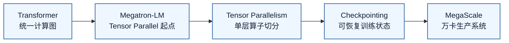
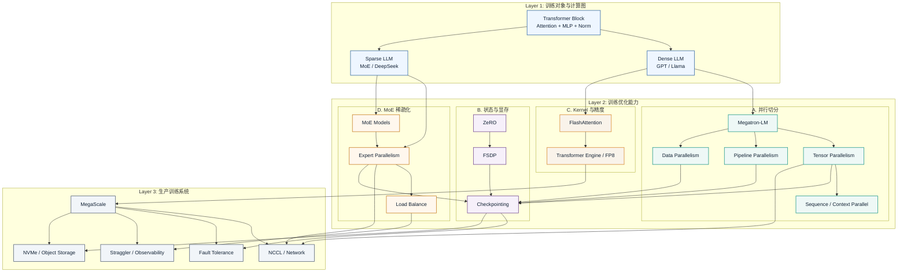
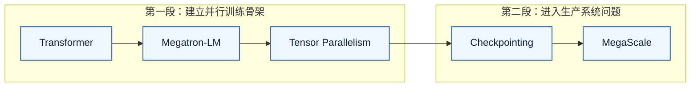

# Knowledge Graph

这张图不追求把所有关系一次画完。第一版的图太像“全量依赖网”，边太多，读者很难知道该从哪里进入。

新的表达方式分成两层：

1. **第一轮主线**：你现在应该按什么顺序读。
2. **能力分区**：每条主线背后分别对应哪些训练 infra 能力。

## 第一轮主线

这条线回答的是：一个训练 infra 工程师第一次建立系统地图时，应该先抓哪几个支点。

这条线先不要再加节点。它的价值是“少而清楚”：先理解 Transformer block，接着看 Megatron 怎么切单层算子，再看 TP 引出的通信和拓扑问题，然后看 checkpoint 如何让训练可恢复，最后用 MegaScale 把这些问题放到万卡生产系统里。

## 能力分区

这张图回答的是：第一轮主线展开后，训练 infra 能力如何分层。布局从上到下读：模型计算图在上面，中间是四类训练优化能力，底部统一收束到生产系统能力。

读这张图时不要从上到下硬背。它的逻辑是：

- **Layer 1 是训练对象**：先知道 Transformer block 里有哪些算子，dense 和 sparse 模型分别带来什么训练负载。
- **Layer 2 是优化手段**：并行切分解决“怎么分到多卡”，状态与显存解决“怎么放得下和恢复”，Kernel/精度解决“怎么更快地算”，MoE 稀疏化解决“怎么扩大总参数但控制激活计算”。
- **Layer 3 是生产系统**：当这些技术进入千卡/万卡规模，NCCL、checkpoint、straggler、存储和容错成为主要矛盾。
- **跨层箭头只保留关键依赖**：TP/EP 会打到网络，TP/PP/DP/EP 会影响 checkpoint，checkpoint 会影响 fault tolerance 和存储，MoE load balance 会影响 straggler。

## 推荐阅读路径

第一轮不要贪多，分两段读。

对应文档：

- [Transformer](papers/transformer.md)
- [Megatron-LM](papers/megatron_lm.md)
- [Tensor Parallelism](topics/tensor_parallelism.md)
- [Checkpointing](topics/checkpointing.md)
- [MegaScale](tech_reports/megascale.md)

## 双向索引

这里保留文字索引，不再强行画进主图。图负责建立方向，索引负责查关系。

- [Transformer](papers/transformer.md) ↔ [Tensor Parallelism](topics/tensor_parallelism.md) ↔ [Megatron-LM](papers/megatron_lm.md)
- [Tensor Parallelism](topics/tensor_parallelism.md) ↔ [NCCL](topics/nccl.md) ↔ [MegaScale](tech_reports/megascale.md)
- [Tensor Parallelism](topics/tensor_parallelism.md) ↔ [Sequence Parallelism](topics/sequence_parallelism.md) ↔ [Context Parallelism](topics/context_parallelism.md)
- [ZeRO](papers/zero.md) ↔ [Checkpointing](topics/checkpointing.md) ↔ [FSDP](topics/fsdp.md)
- [Checkpointing](topics/checkpointing.md) ↔ [Fault Tolerance](topics/fault_tolerance.md) ↔ [MegaScale](tech_reports/megascale.md)
- [FlashAttention](papers/flashattention.md) ↔ [FlashAttention Topic](topics/flashattention.md) ↔ [Transformer Engine](topics/transformer_engine.md)
- [DeepSeek-V3](tech_reports/deepseek_v3.md) ↔ [MoE](topics/moe.md) ↔ [FP8](topics/fp8.md)
- [Llama 3](tech_reports/llama3.md) ↔ [MegaScale](tech_reports/megascale.md) ↔ [Fault Tolerance](topics/fault_tolerance.md)

## 下一步补图

- 为 [Tensor Parallelism](topics/tensor_parallelism.md) 单独画 Column/Row Parallel 数据流图。
- 为 [Checkpointing](topics/checkpointing.md) 单独画 save / async upload / recovery 流程图。
- 为 [NCCL](topics/nccl.md) 单独画 topology / collective / overlap 排障图。
