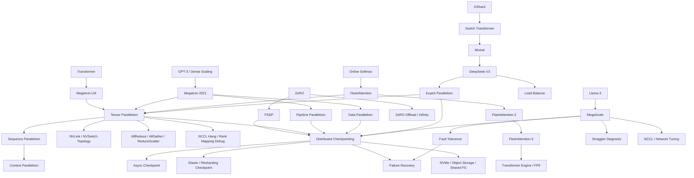

# Knowledge Graph

第一版知识图谱关注训练系统主线：模型结构决定计算图，计算图推动并行策略，并行策略放大通信和稳定性问题，最终倒逼 checkpoint、容错、调度和观测系统演进。

## 主干链路

## 双向索引

- [Transformer](papers/transformer.md) ↔ [Tensor Parallelism](topics/tensor_parallelism.md) ↔ [Megatron-LM](papers/megatron_lm.md)
- [Tensor Parallelism](topics/tensor_parallelism.md) ↔ [NCCL](topics/nccl.md) ↔ [MegaScale](tech_reports/megascale.md)
- [Tensor Parallelism](topics/tensor_parallelism.md) ↔ [Sequence Parallelism](topics/sequence_parallelism.md) ↔ [Context Parallelism](topics/context_parallelism.md)
- [Megatron-LM](papers/megatron_lm.md) ↔ [Pipeline Parallelism](topics/pipeline_parallelism.md) ↔ [Megatron 2021](papers/megatron_2021.md)
- [ZeRO](papers/zero.md) ↔ [ZeRO Topic](topics/zero.md) ↔ [FSDP Topic](topics/fsdp.md)
- [ZeRO](papers/zero.md) ↔ [Checkpointing](topics/checkpointing.md) ↔ [FSDP Topic](topics/fsdp.md)
- [Checkpointing](topics/checkpointing.md) ↔ [Fault Tolerance](topics/fault_tolerance.md) ↔ [MegaScale](tech_reports/megascale.md)
- [FlashAttention](papers/flashattention.md) ↔ [FlashAttention Topic](topics/flashattention.md) ↔ [Transformer Engine](topics/transformer_engine.md)
- [DeepSeek-V3](tech_reports/deepseek_v3.md) ↔ [MoE Topic](topics/moe.md) ↔ [FP8 Topic](topics/fp8.md)
- [DeepSeek-V3](tech_reports/deepseek_v3.md) ↔ [Checkpointing](topics/checkpointing.md) ↔ [MoE Topic](topics/moe.md)
- [Llama 3](tech_reports/llama3.md) ↔ [MegaScale](tech_reports/megascale.md) ↔ [Fault Tolerance](topics/fault_tolerance.md)
- [Llama 3](tech_reports/llama3.md) ↔ [Checkpointing](topics/checkpointing.md) ↔ [MegaScale](tech_reports/megascale.md)

## 下一步补图

- 以 [Tensor Parallelism](topics/tensor_parallelism.md) 和 [Checkpointing](topics/checkpointing.md) 为样板，为每个 topic 增加 `上游概念 / 下游系统 / 生产指标 / 常见故障` 四段。
- 增加 `checkpointing -> fault tolerance -> scheduler -> observability -> incident review` 运维链路。
- 增加 `NCCL -> topology -> collective algorithm -> overlap` 通信链路。
