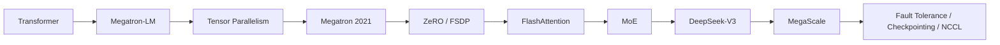

# AI Training Infrastructure Handbook

`training-infra-roadmap` 是一个长期维护的 AI Training Infrastructure 知识库，目标不是收集论文，而是把大模型训练系统的演进整理成工程师能用的手册。

它服务于一个核心目标：成为能够设计、优化、排障和扩展超大规模训练平台的高级 AI Infra 工程师。

## 核心问题

- 大模型训练系统是如何从单机多卡走向万卡集群的？
- Tensor Parallel、Pipeline Parallel、Data Parallel 分别解决什么瓶颈，如何组合？
- ZeRO 和 FSDP 的关系是什么，为什么参数生命周期管理这么关键？
- FlashAttention 为什么不是“一个更快的 attention kernel”那么简单？
- MoE 如何把参数规模扩展到千亿/万亿，同时控制激活计算量？
- Llama 3、DeepSeek-V3、MegaScale 这些系统报告到底暴露了哪些生产训练问题？
- 为什么万卡训练真正难的是稳定性、观测、容错、checkpoint 和 straggler？
- NVIDIA 近几年围绕 FP8、Sequence Parallel、Context Parallel、Distributed Checkpointing 在解决什么核心问题？

## 仓库结构

```text
training-infra-roadmap/
  README.md
  MASTER_READING_LIST.md
  KNOWLEDGE_GRAPH.md
  papers/
  tech_reports/
  topics/
  roadmaps/
  interview/
  references/
```

## 阅读哲学

不按学术摘要读论文。每篇材料都优先回答：

1. 它解决了哪个真实工程问题？
2. 当时训练系统的瓶颈在哪里？
3. 它改变了哪个系统边界：显存、通信、调度、kernel、容错，还是运维？
4. 它如何影响今天的 Megatron、DeepSpeed、FSDP、Transformer Engine、DeepSeek、Llama 系列？
5. 如果在生产集群落地，会踩什么坑？

公式、证明、理论分析只在必要时服务于工程判断。

## 第一阶段内容

已建立第一版初稿：

- [Transformer](papers/transformer.md)
- [Megatron-LM](papers/megatron_lm.md)
- [ZeRO](papers/zero.md)
- [FlashAttention](papers/flashattention.md)
- [DeepSeek-V3](tech_reports/deepseek_v3.md)
- [Llama 3](tech_reports/llama3.md)
- [MegaScale](tech_reports/megascale.md)

## 工程手册章节

第二阶段开始，`topics/` 不再只是概念笔记，而是面向训练平台设计、排障和面试复习的工程手册章节。优先阅读：

- [Tensor Parallelism Engineering Handbook](topics/tensor_parallelism.md)：解释 TP 解决什么问题、Megatron Column/Row Parallel、forward/backward 通信、NVLink/NVSwitch 拓扑、TP=1/2/4/8 配置建议、NCCL hang/rank mapping/shape mismatch 排障，以及 TP 与 SP/CP/FSDP/MoE/FlashAttention/Checkpoint 的关系。
- [Checkpointing Engineering Handbook](topics/checkpointing.md)：解释 checkpoint 为什么是训练 infra 核心问题、full/sharded/distributed/async/incremental/elastic checkpoint 差异、保存内容、Megatron/DeepSpeed/FSDP 差异、容错恢复、存储分层、checksum/validation 和恢复演练。

配套索引：

- [Master Reading List](MASTER_READING_LIST.md)
- [Knowledge Graph](KNOWLEDGE_GRAPH.md)
- [Papers CSV](references/papers.csv)
- [Reports CSV](references/reports.csv)

## 推荐阅读路径



## 文档维护约定

- `papers/`：论文笔记，统一使用工程视角模板。
- `tech_reports/`：模型/系统技术报告，重点看训练系统设计和经验。
- `topics/`：横向主题，把多篇材料串起来。
- `interview/`：面试手册，强调追问、错误回答和生产案例。
- `roadmaps/`：学习计划，控制阅读节奏，避免只收藏不消化。
- `references/`：结构化资料索引，后续可接脚本生成页面或图谱。

## 当前状态

这是从资料库升级成工程手册的进行中版本。优先补强顺序：

1. 以 [Tensor Parallelism](topics/tensor_parallelism.md) 和 [Checkpointing](topics/checkpointing.md) 为模板，继续扩写 FSDP、MoE、FP8、NCCL。
2. 把 7 篇初稿加深到可复述、可面试、可指导系统设计。
3. 补齐 `interview/` 中 NCCL、RDMA、RoCE、InfiniBand。
4. 把 reading list、CSV 和 knowledge graph 变成可检索的知识入口。
