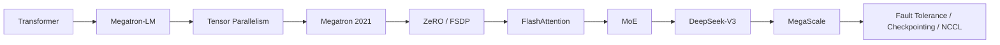

# AI Training Infrastructure Handbook

`training-infra-roadmap` 是 ReadBase 的 Phase 1：Training Infrastructure。

它不是孤立的知识库，而是 Personal Research Operating System 的第一阶段：通过 tracking、reading queue、notes、topics、experiments、playbooks 和 learning log，建立能够支撑超大规模训练平台设计、优化、排障和长期技术判断的工程体系。

项目哲学：[Philosophy](philosophy.md)

## 核心问题

- 大模型训练系统是如何从单机多卡走向万卡集群的？
- Tensor Parallel、Pipeline Parallel、Data Parallel 分别解决什么瓶颈，如何组合？
- ZeRO 和 FSDP 的关系是什么，为什么参数生命周期管理这么关键？
- FlashAttention 为什么不是“一个更快的 attention kernel”那么简单？
- MoE 如何把参数规模扩展到千亿/万亿，同时控制激活计算量？
- Llama 3、DeepSeek-V3、MegaScale 这些系统报告到底暴露了哪些生产训练问题？
- 为什么万卡训练真正难的是稳定性、观测、容错、checkpoint 和 straggler？
- NVIDIA 近几年围绕 FP8、Sequence Parallel、Context Parallel、Distributed Checkpointing 在解决什么核心问题？

## 仓库结构

```text
training-infra-roadmap/
  README.md
  MASTER_READING_LIST.md
  KNOWLEDGE_GRAPH.md
  papers/
  tech_reports/
  engineering_blogs/
  tracking/
  reading_queue/
  learning_log/
  insights/
  projects/
  experiments/
  playbooks/
  topics/
  roadmaps/
  interview/
  references/
```

## 阅读哲学

不按学术摘要读论文。每篇材料都优先回答：

1. 它解决了哪个真实工程问题？
2. 当时训练系统的瓶颈在哪里？
3. 它改变了哪个系统边界：显存、通信、调度、kernel、容错，还是运维？
4. 它如何影响今天的 Megatron、DeepSpeed、FSDP、Transformer Engine、DeepSeek、Llama 系列？
5. 如果在生产集群落地，会踩什么坑？

公式、证明、理论分析只在必要时服务于工程判断。

## 第一阶段内容

已建立第一版初稿：

- [Transformer](papers/transformer.md)
- [Megatron-LM](papers/megatron_lm.md)
- [ZeRO](papers/zero.md)
- [FlashAttention](papers/flashattention.md)
- [DeepSeek-V3](tech_reports/deepseek_v3.md)
- [Llama 3](tech_reports/llama3.md)
- [MegaScale](tech_reports/megascale.md)

<a id="megatron-core-moe-2026-zh-pdf"></a>

### Megatron Core MoE 2026 中文翻译（PDF）

NVIDIA 88 页技术报告 `Scalable Training of Mixture-of-Experts Models with Megatron Core` 的中文翻译归档，按原文顺序阅读：

1. [第一部分：摘要 + 第 1 节](<papers/sources/scalable-training-moe-megatron-core-2026/MoE训练论文翻译（第一部分：摘要 + 第1节）.pdf>)
2. [第二部分：第 2–3 节，架构与并行策略](<papers/sources/scalable-training-moe-megatron-core-2026/MoE训练论文翻译（第二部分：第2-3节 架构与并行策略）.pdf>)
3. [第三部分：第 4 节，突破三堵墙](<papers/sources/scalable-training-moe-megatron-core-2026/MoE训练论文翻译（第三部分：第4节 突破三堵墙）.pdf>)
4. [第四部分：第 5 节 FP8/FP4 低精度训练 + 第 6 节长上下文训练](<papers/sources/scalable-training-moe-megatron-core-2026/第四部分：第5节——FP8_FP4低精度训练 & 第6节——长上下文训练.pdf>)
5. [第五部分：第 7–10 节，生产特性、性能评估、最佳实践与 RL 支持](<papers/sources/scalable-training-moe-megatron-core-2026/第五部分：第7–10节——生产特性、性能评估、最佳实践与RL支持.pdf>)

[英文原始论文](https://arxiv.org/abs/2603.07685)用于核对术语、图表和关键数字；中文 PDF 用于快速通读。

## 工程手册章节

第二阶段开始，`topics/` 不再只是概念笔记，而是面向训练平台设计、排障和面试复习的工程手册章节。优先阅读：

- [Megatron 5D Parallelism Engineering Handbook](topics/distributed_training.md)：用 DP/TP/PP/CP/EP 的切分对象、动机、通信和代价建立统一决策框架，并解释 SP、world-size、PP/VPP、拓扑映射和常见面试考法。
- [Tensor Parallelism Engineering Handbook](topics/tensor_parallelism.md)：解释 TP 解决什么问题、Megatron Column/Row Parallel、forward/backward 通信、NVLink/NVSwitch 拓扑、TP=1/2/4/8 配置建议、NCCL hang/rank mapping/shape mismatch 排障，以及 TP 与 SP/CP/FSDP/MoE/FlashAttention/Checkpoint 的关系。
- [MoE and Parallel Folding Engineering Handbook](topics/moe.md#parallel-folding)：解释 Attention/Expert 双逻辑网格、world-size、process group、8/256 GPU 示例、token 数据流、拓扑选择和排障。
- [NCCL and Communication Operators](topics/nccl.md#collective-map)：从输入输出解释常见 collective/P2P，并映射到 5D、Distributed Optimizer、FSDP 和 hang 排障。
- [Checkpointing Engineering Handbook](topics/checkpointing.md)：解释 checkpoint 为什么是训练 infra 核心问题、full/sharded/distributed/async/incremental/elastic checkpoint 差异、保存内容、Megatron/DeepSpeed/FSDP 差异、容错恢复、存储分层、checksum/validation 和恢复演练。
- [Agentic RL Infrastructure](topics/agentic_rl.md)：第一条 Research OS 闭环主题，解释 rollout、reward/verifier、policy update、weight sync、trajectory store 和 agent runtime 如何改变训练平台边界。
- [verl 与 AReaL：RL 框架架构选型指南](topics/rl_framework_selection.md)：从 workload、控制面、异步机制、Agent 接入、正确性和维护成本解释项目为何先选 verl、后转 AReaL，并区分历史版本判断与当前版本重评。
- [Agentic for Embodied](topics/agentic_for_embodied.md)：从 Infra 工程师视角梳理 VLA、trajectory data、GPU simulation、robot rollout、edge runtime、sim-to-real 和 safety，并从系统地图推导到可实施的生产平台蓝图。
- 建设中入口：[FSDP](topics/fsdp.md)、[FP8](topics/fp8.md)。

## 学习计划与面试入口

- [30 天计划](roadmaps/30_day_plan.md)：恢复论文阅读习惯，每周两篇，不追求数量。
- [90 天计划](roadmaps/90_day_plan.md)：建立完整训练系统知识图谱。
- [一年计划](roadmaps/yearly_plan.md)：成长为高级 AI Training Infra 工程师。
- [Tensor Parallelism 面试手册](interview/tensor_parallelism.md)
- [MoE / 5D / Parallel Folding 面试手册](interview/moe.md)
- [Checkpoint 面试手册](interview/checkpoint.md)

配套索引：

- [Master Reading List](MASTER_READING_LIST.md)
- [Knowledge Graph](KNOWLEDGE_GRAPH.md)
- [Papers CSV](references/papers.csv)
- [Reports CSV](references/reports.csv)
- [Engineering Blogs](engineering_blogs/README.md)
- [Blogs CSV](references/blogs.csv)
- [Tracking Radar](tracking/README.md)
- [Scan Log](tracking/scan_log.md)
- [Frontier Scan Template](tracking/frontier_scan_template.md)
- [Frontier Scan 2026-09-01](tracking/frontier_scan_2026-09-01.md)：当前最新扫描
- [Monthly Signal 2026-08](tracking/monthly_signal_2026-08.md)：8 月高质量工程主线汇总
- [Historical Backfill](tracking/historical_backfill.md)
- [Backfill By Month](tracking/backfill/README.md)
- [Weekly Signal 2026-W26](tracking/weekly_signal_2026-W26.md)：本周无合格前沿信号的修正记录
- [Reading Queue](reading_queue/README.md)
- [Learning Log](learning_log/README.md)
- [Insights](insights/README.md)
- [Q3 Long-context Agentic RL Project](projects/2026-q3-long-context-agentic-rl/README.md)
- [Experiments](experiments/README.md)
- [Playbooks](playbooks/README.md)

## 推荐阅读路径


```mermaid
graph LR
  A["Transformer"] --> B["Megatron-LM"]
  B --> C["Tensor Parallelism"]
  C --> D["Megatron 2021"]
  D --> E["ZeRO / FSDP"]
  E --> F["FlashAttention"]
  F --> G["MoE"]
  G --> H["DeepSeek-V3"]
  H --> I["MegaScale"]
  I --> J["Fault Tolerance / Checkpointing / NCCL"]
```

## 文档维护约定

- `papers/`：论文笔记，统一使用工程视角模板。
- `tech_reports/`：模型/系统技术报告，重点看训练系统设计和经验。
- `engineering_blogs/`：工程博客、官方技术文档和 release note，重点补足 paper 没有覆盖的真实实现与生产经验。
- `tracking/`：研究雷达。frontier scan 负责从上次扫描游标到现在的前沿扫描，monthly 负责高质量正式沉淀，historical backfill 负责历史精华补录。
- `tracking/scan_log.md`：扫描账本，记录每次扫描窗口和下一次游标，保证不重不漏。
- `tracking/historical_backfill.md`：历史精华补录总入口；具体条目按原始月份放入 `tracking/backfill/YYYY-MM.md`。
- `reading_queue/`：把 tracking 中的信号筛选成 P0/P1 阅读计划。
- `learning_log/`：记录每月读了什么、理解了什么、还有什么疑问。
- `insights/`：沉淀个人技术判断，不写论文摘要。
- `projects/`：持续数周或数月的工程实战主线，把 baseline、看板、tracing、实验和 decision 串成闭环。
- `experiments/`：用实验验证工程判断。
- `playbooks/`：生产排障 runbook，回答线上问题怎么查、怎么恢复、怎么复盘。
- `topics/`：横向主题，把多篇材料串起来。
- `interview/`：面试手册，强调追问、错误回答和生产案例。
- `roadmaps/`：学习计划，控制阅读节奏，避免只收藏不消化。
- `references/`：结构化资料索引，后续可接脚本生成页面或图谱。

## 当前状态

Research OS v1.0 已进入使用期。未来一个月不继续扩结构，优先把现有闭环跑起来：

1. 有空时跑一次 [Frontier Scan](tracking/frontier_scan_template.md)：窗口从 [Scan Log](tracking/scan_log.md) 的上次游标到本次扫描结束，只收高质量前沿信号，可以 0 条。
2. 每周尽量精读一个 [P0](reading_queue/P0.md)，读完必须流向 `topics/`、`insights/`、`playbooks/` 或 `experiments/`。
3. 每两周做一次 [Historical Backfill](tracking/historical_backfill.md)：按材料原始月份倒序补课，每个月一个文件，只补当前工程判断缺口。
4. 当前工程实战主线：[Q3 Long-context Agentic RL](projects/2026-q3-long-context-agentic-rl/README.md)；知识输入继续聚焦 [Agentic RL / Rollout Infra](topics/agentic_rl.md)、[Long-context Training Infra](topics/long_context_training.md)、[Megatron / TP / Checkpointing](topics/tensor_parallelism.md)。[Agentic for Embodied](topics/agentic_for_embodied.md) 作为跨向物理 agent 的工程专题入口，不改变当前主线优先级。
