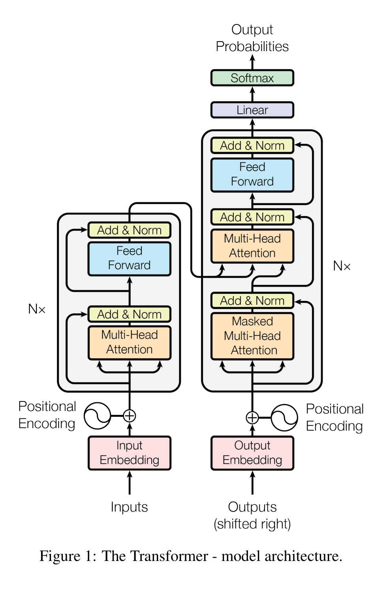
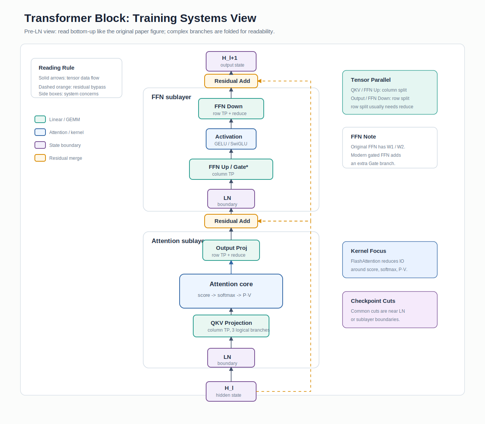

# Transformer: Attention Is All You Need

## 论文信息

- 作者：Ashish Vaswani, Noam Shazeer, Niki Parmar, Jakob Uszkoreit, Llion Jones, Aidan N. Gomez, Lukasz Kaiser, Illia Polosukhin
- 时间：2017
- 链接：https://arxiv.org/abs/1706.03762
- 相关主题：[Tensor Parallelism](../topics/tensor_parallelism.md), [FlashAttention](../topics/flashattention.md), [Distributed Training](../topics/distributed_training.md)

---

## 解决的问题

RNN 序列模型受 step-by-step recurrence 限制，时间维并行度低；CNN 序列模型可以并行计算，但长距离依赖需要多层卷积传播，路径更长。Transformer 用 self-attention + feed-forward block 把任意 token 间的信息路径缩短到 O(1)，同时把训练负载变成更规则的矩阵计算，让它更适合 GPU、Tensor Core 和后来的分布式切分。

---

## 背景与瓶颈

在 Transformer 之前，机器翻译主流依赖 RNN encoder-decoder、CNN sequence model 和 attention。问题不是单个模型不能收敛，而是训练系统很难扩展：RNN 的时间维依赖导致并行度差，CNN 虽然位置维可并行，但建模长距离依赖需要更长路径；这些模型的 kernel 形态和计算图也更难统一优化。对今天的大模型训练来说，Transformer 的关键价值是把计算主体变成 GEMM、batched GEMM、softmax、layernorm、embedding 等可工程优化的模块。

---

## 核心创新

- Multi-Head Self-Attention：用多个 head 在不同子空间做 token-token 交互。
- Position Encoding：去掉 recurrence 后补充位置信息。原版使用 fixed sinusoidal positional encoding，后续又演进出 learned position embedding、RoPE、ALiBi 等方案。
- FFN block：每个 token 独立的 MLP，天然适合张量并行。
- Residual + LayerNorm：让深层网络可训练，后来又演进出 Pre-LN 等稳定性设计。
- Encoder/Decoder block 标准化：为后续 BERT、GPT、Llama、MoE 提供统一积木。

---

## 关键图表解读

最重要的是原论文 Figure 1 的 Transformer block 图。先看原图，确认 encoder-decoder、attention、FFN、residual、LayerNorm 的位置关系；再看下面的工程简化图，把它拆成训练系统真正关心的算子、状态和通信边界。

图源：Vaswani et al., *Attention Is All You Need*, Figure 1，[arXiv:1706.03762](https://arxiv.org/abs/1706.03762)。这里作为学习笔记中的关键图引用，版权归原作者及出版方所有。

训练系统视角的简化版如下。注意这张图采用现代大模型训练中更常见的 Pre-LN block 视角，用来解释工程切分点；原论文 Figure 1 是 Post-LN encoder-decoder 结构，两者在 LayerNorm 放置上并不完全相同。

工程上应把这张图看成计算图分解：Attention 部分有 QKV projection、attention score、softmax、value aggregation、output projection；原版 position-wise FFN 是两次 Linear/GEMM，现代门控 FFN 如 SwiGLU/GEGLU 通常会变成 gate/up/down 三个矩阵。后来的 Megatron Tensor Parallel 基本就是围绕这些 projection/MLP 权重矩阵切分，FlashAttention 则是围绕 attention score 和 softmax 的 HBM 读写做重构。

---

## 工程价值

Transformer 把模型训练从“序列控制流问题”转成“规则张量程序问题”。这带来三件事：第一，GPU kernel 可被深度优化；第二，权重矩阵可以按列/行切分；第三，activation、parameter、optimizer state 的生命周期可以系统化管理。这也是为什么训练基础设施的主线几乎都围绕 Transformer block 展开。

---

## 对训练基础设施的影响

- 促成 Tensor Parallel：QKV、attention output、MLP projection 都可切。
- 促成 Pipeline Parallel：层堆叠清晰，可按 layer 分 stage。
- 促成 ZeRO/FSDP：参数和 optimizer state 巨大但结构规则。
- 促成 FlashAttention：attention 的 O(N^2) 中间矩阵成为 IO 优化目标。
- 促成 MoE：FFN 是主要参数/计算来源，适合替换成 expert。

---

## 今天的应用场景

Decoder-only Transformer 仍是 LLM 训练主干；Encoder-only 更多用于理解/检索；Encoder-decoder 在翻译和部分多模态任务中仍有价值。训练平台设计时，Transformer block 是估算显存、通信量、FLOPs、checkpoint 大小和 recompute 策略的基本单位。

---

## 后续演进

这不是严格时间线，而是训练基础设施能力维度的阅读脉络：

Transformer → GPT/BERT → Megatron-LM → GPT-3/PaLM/Llama → MoE/DeepSeekMoE → FlashAttention → Long Context/Context Parallelism。

---

## 相关论文

- [BERT](bert.md)
- [GPT-3](gpt3.md)
- [Megatron-LM](megatron_lm.md)
- [FlashAttention](flashattention.md)

---

## 相关代码

- GitHub：https://github.com/tensorflow/tensor2tensor
- 推荐入口：Transformer layer、multi-head attention、position encoding。
- 现代入口：Megatron-LM `megatron/core/transformer`，PyTorch `torch.nn.Transformer`，FlashAttention kernels。

---

## 面试高频问题

1. Transformer 为什么比 RNN 更适合 GPU 训练？
2. Self-Attention 的主要计算和显存瓶颈在哪里？
3. Multi-head attention 对并行切分有什么影响？
4. QKV projection 如何做 Tensor Parallel？
5. 为什么 MLP 往往是 Transformer 参数量大头？
6. Pre-LN 和 Post-LN 对大规模训练稳定性有什么影响？
7. Activation memory 在 Transformer 中主要来自哪里？
8. Sequence length 增大时，attention 和 MLP 的瓶颈如何变化？
9. 为什么 Transformer 适合 pipeline parallel？
10. Transformer block 中哪些 kernel 最值得优化？

---

## 生产环境思考题

1. 如何根据 hidden size、seq length、batch size 估算单层 activation 显存？
2. 如果 attention kernel 很慢，如何判断是 compute bound 还是 memory/IO bound？
3. 大模型训练中 LayerNorm 数值不稳定通常如何暴露？
4. 长上下文训练为什么会改变并行策略？
5. Tensor Parallel group 应该优先放在 NVLink 内还是跨节点？
6. Recompute 应该覆盖 attention、MLP，还是整层？
7. Transformer 模型 checkpoint 如何组织才能支持并行度变化？
8. 多租户集群上 Transformer 训练如何避免网络抖动放大？
9. 如果 global batch 受显存限制，如何用 gradient accumulation 补？
10. 如何监控每个 Transformer layer 的耗时异常？

---

## 我的总结

Transformer 对训练基础设施最大的意义不是提出 attention，而是把大模型训练变成了可切分、可调度、可优化的规则张量系统。后来的 Megatron、ZeRO、FSDP、FlashAttention、MoE、FP8、Context Parallelism 都是在回答同一个问题：如何把这个标准 block 在更大模型、更长序列、更多 GPU 上稳定而高效地跑起来。
