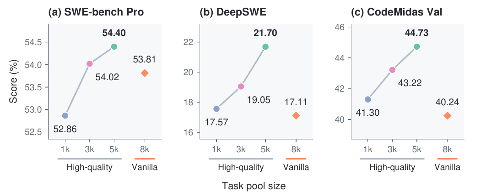
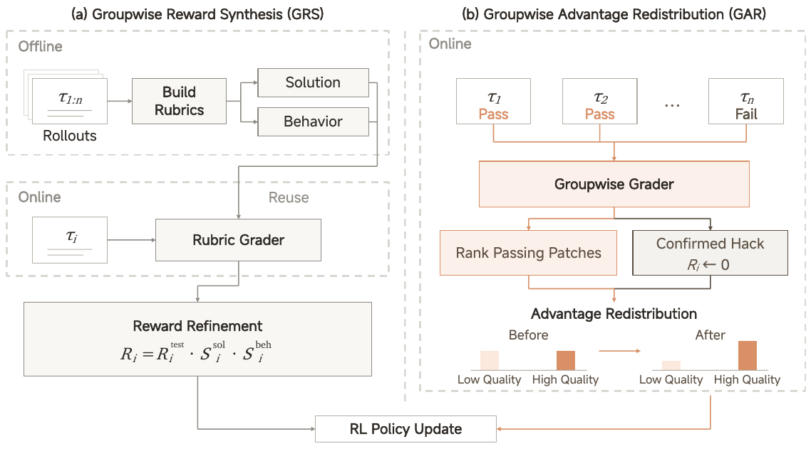
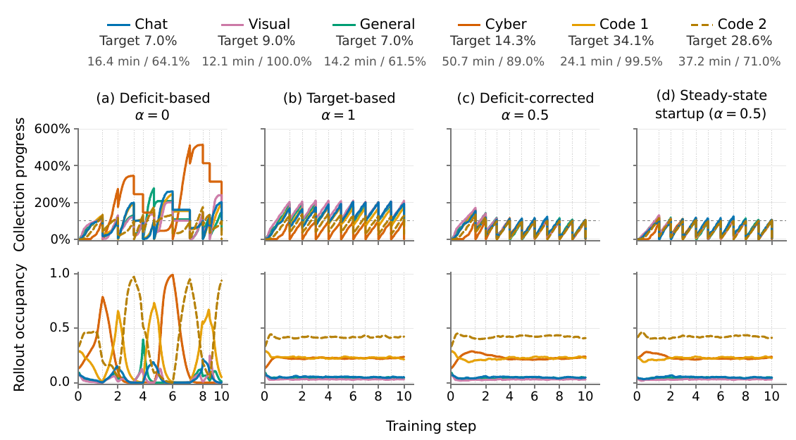
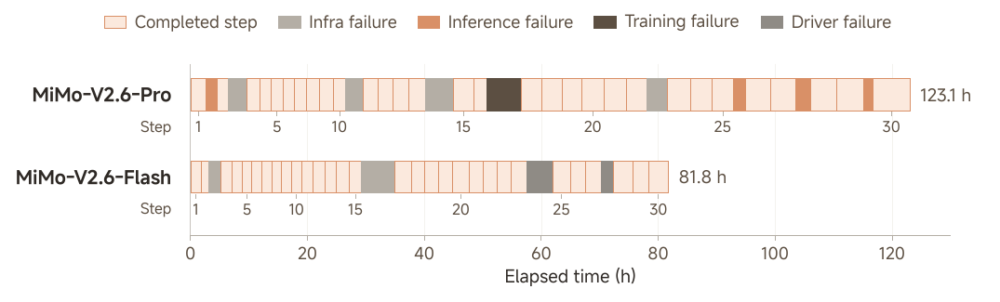

# MiMo-V2.6 调研：从 CodeMidas 环境工厂到大规模 Agentic RL

> 个人学习与组内分享 · 2026-09-22。本文围绕环境构造、奖励设计和训练系统串联两篇报告，记录机制理解、实验依据及尚待验证的问题。已核对原报告和官方直播接口；实验数字均为作者报告，本仓库未复现。

**我的核心判断：RL 扩展的收益，取决于系统怎样定义、筛选和使用经验。** CodeMidas 与 MiMo-V2.6 最值得借鉴的，是把环境验收、奖励判断、样本选择和运行效率连起来。下面先还原方法与证据，再给出[四条工程观点](#engineering-judgments)，说明各自会怎样改变设计选择，以及什么结果会让我修正判断。

## 阅读导览

可以把全文看作一条任务的旅程：**源码中的功能 → 可重置的任务环境 → agent 尝试 → 可信的评分 → 按配比进入训练 → 更新后的策略再次尝试。** 两篇报告分别放大了这条链路的不同部分。

| 想先理解什么 | 从哪里读起 | 重点看哪张图 |
|---|---|---|
| 没有 issue/PR，如何生成可训练任务 | [CodeMidas 环境构造](#codemidas-environments) | 原 [C] Figure 1：环境构造与筛选 |
| 环境做得更干净，是否真的有用 | [CodeMidas 实验](#codemidas-evidence) | 原 [C] Figure 8：质量与规模 |
| 同样通过测试，为什么还要比较解法 | [GRS / GAR](#groupwise-grading) | 原 [M] Figure 7：两条评分路径 |
| 长短任务怎样组成稳定的训练 batch | [Runtime](#rl-runtime) → [Sample Mixer](#sample-mixer) | 原 [M] Figures 14、16：数据路径与调度模拟 |
| 规模放大后什么会出问题 | [直播数据](#live-rl-evidence) → [训练故障](#rl-failures) | 原 [M] Figure 12：完成 step 与故障间隔 |
| 这些证据会怎样改变我们的设计选择 | [自己的观点](#engineering-judgments) → [投入顺序](#investment-order) | 环境处置表、观点与验证对照表 |

第一次读可以沿表格顺序浏览六张原图及读图说明，再回头看公式、配置和数值表。组内分享的讨论入口放在[文末](#team-discussion)。

<details>
<summary>几个容易混用的概念</summary>

| 概念 | 在本文中的含义 |
|---|---|
| Task / environment | Task 是要完成的工作与验收规格；environment 提供代码、工具、文件和可恢复的初始状态。一个任务可以被反复尝试 |
| Harness | 驱动 agent 运行的程序：组织提示、调用工具、管理上下文与停止条件；改变 harness 会改变模型遇到的交互过程 |
| Rollout / trajectory | 一次尝试的执行及其记录，可能跨多轮、多个 context 和 policy version；不是一次模型请求 |
| Group | 同一 prompt 的多条尝试，用于组内比较和 advantage 估计；本文出现的 group size 16 表示每 prompt 16 条 rollout |
| Verifier / grader | Verifier 常指执行测试等验收机制；grader 泛指评分组件，也可以是会读代码、执行工具的 agent。两者不是完全互斥的分类 |
| Reward / advantage | Reward 是任务评价结果；advantage 决定相对基线加强或抑制哪些生成行为，不能把二者当作同一个分数 |

</details>

## 阅读材料与研究范围

| 材料 | 身份、时间与原始来源 | 本文关注点 |
|---|---|---|
| CodeMidas: Scaling Agentic Coding RL Environments from Code Itself | Bowen Ye、Lei Li、Shicheng Li 等 19 位作者；Xiaomi、北京大学、香港大学、中国人民大学；arXiv v1：2026-09-18 17:55:17 UTC；[摘要与作者](https://arxiv.org/abs/2609.22068v1)、[全文](https://arxiv.org/html/2609.22068v1) | 如何从源码生成可信、可执行的 RL environment |
| MiMo-V2.6: Scaling Reinforcement Learning Towards Self-Improvement | PDF 署名 LLM-Core Xiaomi；随 2026-09-22 官方发布公开；[技术报告 PDF](https://huggingface.co/XiaomiMiMo/MiMo-V2.6-Pro-RL/blob/73875d00b30a89ef8cc353a0b60b0e9f9561952d/MiMo_V2_6_technical_report.pdf)、[官方发布说明](https://mimo.mi.com/docs/zh-CN/news/latest/v2-6) | 多任务 RL、grader、采样调度、训推一致性与故障分析 |
| MiMo-V2.6 RL 直播 | Xiaomi MiMo 官方训练日志看板；[入口](https://mimo.xiaomi.com/rl/)、[指标定义](https://mimo.xiaomi.com/rl/api/runs)、[评测记录](https://mimo.xiaomi.com/rl/api/benchmarks)、[事件通知](https://mimo.xiaomi.com/rl/api/notices) | 动态训练过程，以及运行时发生过哪些干预 |

下文用 **[C]** 表示 CodeMidas v1，用 **[M]** 表示 MiMo-V2.6 的 44 页 PDF，用 **[L]** 表示官方直播接口；章节、图表号均对应原文。原图保留坐标、图例与内容，仅裁去页内无关正文，版权归原作者。[核验快照](../assets/mimo_v26/source_snapshot.json)保存已核对的作者、日期、报告哈希、直播采集时间与图表来源。

**两篇报告的关系必须先分清：** CodeMidas 独立实验训练的是 **MiMo-V2.5**；[M] §4.2.1 明确引用它作为源码驱动的任务合成路径之一，但没有披露 CodeMidas 在 V2.6 全部训练数据中的精确比例或单独贡献。CodeMidas 的 5,545 个任务、V2.6 发布的约 7k 任务、直播累计 trajectory 数，是三种不同计数。

| 实验 | 起点与训练方式 | 它主要回答的问题 |
|---|---|---|
| CodeMidas | MiMo-V2.5，源码合成的 coding tasks，binary-reward GRPO | 这类环境能否提供跨软件任务的有效监督 |
| V2.6 mixed RL | V2.6 SFT 起点，多领域、多 harness、大 batch RL | 环境、grader 与运行系统如何共同支撑放大训练 |
| 9B 开放实验 | 同一个 distilled SFT 初始化，分别做领域 RL；另做 multi-harness coding | 开放资源是否足以形成可继续研究的较小规模基线 |

这三组实验互相补充，但模型、数据和训练流程不同，不能把分数增益相加。来源：[C] §4、[M] §5、§7。

相关入口：[Agentic RL](../topics/agentic_rl.md#mimo-v26-environment-contract)、[RL 框架选型](../topics/rl_framework_selection.md)、[长上下文训练](../topics/long_context_training.md)、[MoE](../topics/moe.md)、[阅读决策](../reading_queue/P1.md#mimo-v26-reading)。

## 阅读主线与模型背景

### 两篇报告如何串起来

MiMo 这组工作展示了一条完整的工程链：**把软件功能变成可验证任务，把任务执行变成高质量 trajectory，再把异构、长尾的 trajectory 稳定地供给训练器。** 扩大 GPU 规模需要环境供给、奖励可靠性与样本调度同时跟上。

阅读时，我会同时追踪两条线：一条是**监督如何成立**，包括规格、verifier 和 grader；另一条是**监督怎样被消费**，包括 rollout、过滤、调度、训推一致性和恢复。前者回答梯度是否在鼓励正确行为，后者回答最终进入梯度的是哪些经验。两者相互影响，也是文末观点的依据。

### 模型底座与阶段边界

[M] Table 1 给出 Flash 约 **310B 总参数 / 15B 激活**，Pro **1.02T / 42B**，均采用 hybrid SWA/global attention 与 sparse MoE，并接入视觉和音频 encoder。Flash 模型卡另写 309B；本文统一沿用报告 Table 1 的 310B 口径，不据此推断架构变更。

训练阶段是 text pretraining → omni pretraining → agent-centric mid-training → 短 SFT → mixed-task RL → MOPD2。Mid-training 把上下文延长到 1M，并为大 batch RL 引入 Muown 与 MXFP4 QAT。[M] §3、§5.6。因此，“六天直播”只覆盖其中的 RL 实验，不能解释为从零训练出模型的全部成本或时间。

## 从环境工厂到训练闭环

<a id="codemidas-environments"></a>

### 1. CodeMidas：从源码构造一个可训练的 environment


*图源：[CodeMidas v1，Figure 1，PDF 第 4 页](https://arxiv.org/pdf/2609.22068v1#page=4)。*

**读图顺序：**先看左侧的任务设计和测试构造，再看右侧三类 rollout 过滤，最后看中间的漏斗。它描述的是候选任务经过验证后被保留的过程；22,575 到 5,545 是任务数变化，不能读成训练 step、成功率或各阶段的独立质量增益。

一个任务由 **行为规格、容器化开发起点、隐藏 executable verifier** 组成。Solver 拿到删去目标功能的代码与依赖；原实现独立保留，hidden verifier 在评分时才注入。[C] §3。

| 阶段 | 作者实际做了什么 | 工程上保护什么 |
|---|---|---|
| Task design | Agent 追踪公开接口和依赖，抽取已有功能，删除核心实现，联合修订任务描述与起始代码 | 任务可以明确验收，同时允许替代实现 |
| Test construction | 在 reference 上执行 CLI、纯函数或有状态 API；每条断言关联规格中的要求 | 测试预期有执行证据，减少凭空生成 oracle |
| Assertion review | 去掉规格未要求的消息文案、内部结构、偶然顺序；依赖 private symbol 且无行为替代的任务被拒绝 | 避免正确实现因“不像参考答案”而被误杀 |
| Environment preparation | 安装依赖，清除目标实现相关编译产物、缓存、构造过程遗留文件与原测试，保留离线构建材料 | 既可执行，又无法直接找回被删除的答案 |
| Execution consistency | 6 个全新容器：起始状态 2 次必须都失败，reference 4 次必须都成功 | 筛掉无效测试和执行不稳定的任务 |
| Post-rollout filtering | 对抗 agent 查泄漏；每任务 4 条 coding rollout 交给独立 reviewer 审核 verdict；另用 frontier model 筛选成功与失败并存的任务 | 检查真实策略面对环境时是否得到可信且有区分度的监督 |

#### 用一个小任务理解 verifier 的边界

下面借 [C] Figure 9 的隐藏文件任务改写一个教学例子，**表中实现是解释用的假设，不是论文新增实验结果**：目录含 `public.csv` 与 `.secret.csv`，规格要求默认忽略隐藏文件，`hidden=True` 时包含隐藏文件。

| Solver 的实现 | 按规格应怎样评分 | 能暴露什么问题 |
|---|---|---|
| 根据 `hidden` 参数正确切换，内部算法与 reference 不同 | 通过 | 若失败，可能是测试约束了无关实现细节，即 false negative |
| 始终忽略 `.secret.csv` | 失败 | 只测默认参数，会把不完整实现判为正确，即 false positive |
| 始终返回 `.secret.csv` | 失败 | 只测 `hidden=True`，也会漏掉另一半要求 |
| 修改后单次过测，但换全新容器就因残留状态失败 | 暂不纳入可信训练环境 | 要排查构建、reset 或状态依赖，单次通过不够 |

这个例子串起了三个不同问题：规格是否完整、测试是否覆盖规格、执行环境是否稳定。对于规格没有要求的细节，例如报错文案或内部 helper 命名，不能仅因 reference 恰好如此就要求 solver 照搬。

这里的 **reference execution 是证据，不是自动正确的规格**。现有代码可能有 bug；reviewer 也可能和生成器共享盲区。CodeMidas 把这些风险变成可检查的筛选过程，没有证明它们被彻底消除。

另外，全通过/全失败不等于任务一定坏：可能是筛选模型太强、太弱或预算不合适。最终数据分布依赖筛选 policy 和 rollout budget；换基座后应重新测量有效任务比例。[C] §3.4。

<a id="codemidas-evidence"></a>

### 2. CodeMidas 的实验到底证明了什么

训练集包含 **5,545 tasks / 3,185 codebases / 23 languages / 15 domains**。训练采用 MiMo-V2.5、GRPO、binary execution reward，batch 32、每任务 32 rollouts；标准差 advantage normalization 关闭，最大 staleness 为 8。[C] §3.5、§4.1、Appendix A。这组配置不能当作 V2.6 的训练配置。

| 评测 | 初始策略 | CodeMidas RL | 绝对增益 |
|---|---:|---:|---:|
| SWE-bench Pro | 50.3 | 54.4 | +4.1 pp |
| DeepSWE v1.1 | 10.0 | 21.7 | +11.7 pp |
| ProgramBench：Almost Solved | 4.5 | 21.5 | +17.0 pp |
| RepoZero C2Rust | 40.5 | 51.8 | +11.3 pp |
| Terminal-Bench v2.1 | 63.7 | 72.2 | +8.5 pp |

来源：[C] Figure 5、§4.1。**pp 为百分点，不是相对百分比；ProgramBench 是通过至少 95% tests 的任务比例，并非 fully solved。** 作者检查了训练任务与验证集、五个外部 benchmark task sets 不相交，但不能据此声称排除了 pretraining contamination 或所有仓库级相似性。

#### 原图：数据质量与数据规模要一起看



*图源：[CodeMidas v1，Figure 8，PDF 第 9 页](https://arxiv.org/pdf/2609.22068v1#page=9)。图中 5k 指完整的 5,545 个任务。*

先沿圆点看高质量任务从 1k → 3k → 5k 的变化，再把 3k、5k 与右侧 vanilla 8k 菱形比较。高质量 3k 子集在三个被比较评测上均胜过未清洗的 vanilla 8k；完整高质量集的 DeepSWE 为 21.70，vanilla 8k 为 17.11。[C] §5.1、Figures 7–8。

**图能支持的结论：**在作者报告的这些设置中，整套清洗、执行检查和 rollout 筛选有价值，任务多并不自动更好。**读图限制：**三个面板的纵轴范围不同，斜率不能横向比较；实验没有隔离每个筛选步骤的贡献，也没有按总环境构造成本比较。

还要区分“相同训练配置”与“相同 checkpoint”：CodeMidas Val 的 1k 分数 41.30 对应 step 30，3k 的 43.22 对应 step 65，完整集的 44.73 对应 step 70。它们不是共同末步的严格配对；另两项评测的 checkpoint 选择方式在该段未明确说明。原 Figure 7 提供补充的轨迹证据：完整集在 step 40–70 的每个被评估点均领先。[C] §5.1。

行为分析发现更多代码探索、自验证以及任务相关的长度变化。CodeMidas Val 上，自编写并执行 checks 的 rollout 成功率高 4.2 pp，95% CI 为 1.8–6.6；这是同任务、同 checkpoint 的关联分析，不能说“多跑测试必然因果提升 4.2 pp”。[C] §5.2。尤其不能把工具调用次数本身变成质量奖励。

### 3. V2.6 将环境扩展到多领域

[M] §4.2 把 CodeMidas 放在更广泛的任务体系中：

| 任务域 | 环境与验证设计 | 最需要防止的失真 |
|---|---|---|
| Code | Issue/PR、员工真实需求、复杂规格、源码功能、长程工程任务等路径；规格与测试对齐；reference patch 的 F2P/P2P 检查 | 测试漏验、过严、泄漏和 flaky execution |
| General | 真实文件与本地 software mock；planner 组织工作区和数据库，生成后检查实体、金额、时间线及引用的一致性 | mock 与真实业务语义脱节，跨文件状态矛盾 |
| Visual | 开放设计结合 pointwise/groupwise judging；视觉复刻结合规则相似度与整体视觉判断 | 外观好看掩盖功能错误，judge 偏好替代用户要求 |
| Cyber | 以目标漏洞复现为任务，按 sanitizer 报告的漏洞类型和项目栈位置检查匹配 | 把任意 crash 错当作目标漏洞成功 |

注意两个验证流程的区别：[C] 是起始状态 2 次失败、reference 4 次通过；[M] §4.2.1 对带 reference patch 的 coding tasks 描述的是 F2P/P2P 结果在 **8 次 reruns** 中稳定。不要把它们写成同一套数字。

General 环境强调所有状态本地化、每条 rollout 的 sandbox 可恢复到固定初态，避免外部服务限流和网络随机性。[M] §4.2.2。**迁移判断：**环境 reset、状态一致性和 verifier 版本，都应成为训练样本的身份信息；“工具调用成功”不足以证明任务状态正确。

<a id="groupwise-grading"></a>

### 4. Grader compute：GRS 与 GAR 的职责不同

传统二元 reward 下，多个 passing solution 得到相同的正向信号，但其中可能有不必要改动、漏掉非测试覆盖要求或重复试错。MiMo 对不同 coding 子集采用两种方法。[M] §4.3、Figure 7。



*图源：[MiMo-V2.6，Figure 7，PDF 第 17 页](https://huggingface.co/XiaomiMiMo/MiMo-V2.6-Pro-RL/resolve/73875d00b30a89ef8cc353a0b60b0e9f9561952d/MiMo_V2_6_technical_report.pdf#page=17)。*

**读图时先找时间边界：**左侧 GRS 先离线分析多条解，在线复用 rubrics；右侧 GAR 在线把同组轨迹放在一起比较。两条路径作用于不同任务子集，并不是每条轨迹依次经过的两道工序。右下角柱形是 advantage redistribution 的示意，不是实测性能图。

| 比较项 | GRS | GAR |
|---|---|---|
| 额外判断发生在哪里 | 离线构造 rubrics；在线逐条评分 | 在线对同组轨迹联合判断 |
| 主要改变什么 | 最终 reward 的数值 | 修正已确认 hacking 后，重分配 sequence advantage |
| 主要覆盖哪类 coding task | 部分高通过率任务 | 其余任务的 mixed-outcome groups |
| 可以产生什么额外信号 | 测试都通过，也能因质量分数不同而区分 | 把更多正 advantage 分给质量较高的 passing solution |

**GRS（Groupwise Reward Synthesis）**：面向部分高通过率任务，离线比较多条 rollout，生成 task-specific solution/behavior rubrics；在线逐条复用评分。公式为：

```text
R_i = R_test_i × S_solution_i × S_behavior_i
```

测试失败仍为零；全部测试通过时，如果 quality scores 不同，仍有可学习差异。因此，“all-pass 一律无梯度”只适用于最终 reward 相同的情况，不能把 raw test passrate 当作所有分支的过滤标准。

**GAR（Groupwise Advantage Redistribution）**：对其余 coding tasks 的 mixed-outcome groups，在线 grader 在共享工作区比较成功与失败轨迹，对 passing patches 排序；确认 hacking 的轨迹先置零 reward，再重算组统计。其余 passing trajectories 按质量重新分配正 advantage。[M] §4.3.2。

用原文未加 cap 的形式表示，`A_i = R_i - mean(R)`；给成功项一个 `f_i ∈ (0,1]`，再令 `λ = Σ_pass A / Σ_pass(f × A)`，`A'_i = λ f_i A_i`。失败项在这一步不变。工程实现还会限制 λ、再做全组零均值化；因此不能宣称所有实际分支都严格保持未加 cap 公式的守恒关系。

**解释例子，非原实验：**4 条轨迹 reward 为 `[1,1,0,0]`，组均值为 0.5；两条成功轨迹的质量因子取 `[1,0.5]`，则 `λ = 1 / 0.75 = 4/3`。

| 轨迹 | Reward | 原 advantage | 质量因子 | 未加 cap 的新 advantage |
|---|---:|---:|---:|---:|
| A：成功，质量较高 | 1 | +0.5 | 1 | +0.667 |
| B：成功，质量较低 | 1 | +0.5 | 0.5 | +0.333 |
| C：失败 | 0 | −0.5 | 不参与成功项重分配 | −0.5 |
| D：失败 | 0 | −0.5 | 不参与成功项重分配 | −0.5 |

成功项总 advantage 仍为 1，改变的是成功轨迹之间的相对权重。GAR 调整的是 **sequence-level advantage**，再广播到 response tokens；不能称为每个 action 都获得了独立的因果 credit assignment。

Grader 输出不可用时，报告采用原 advantage fallback；正式训练仍需观测其占比，否则不同任务会在不同评分规则下被优化。GRS/GAR 与 token-level penalty module 也应分开理解：后者对重复、错误等被标记 token 施加更细粒度约束。[M] §4.3、§6.1。

**效果证据与边界：**[M] Figure 8 比较 Flash 的 code-only RL，有 GAR 时通过率持续改善，turns 更稳定、token 长度增长更缓；该实验 batch 为 128、采用 token-mean aggregation，和大规模 mixed run 的 prompt-mean aggregation 不同。它支持 GAR 抑制无效长度膨胀，但不能推导“所有 V2.6 任务都越来越短”：主 mixed run 的 Figure 9 明确显示，效果提升通常也伴随更多 total tokens。

<a id="rl-runtime"></a>

### 5. Runtime：先把多框架运行和大 payload 搬运拆开


*图源：[MiMo-V2.6，Figure 14，PDF 第 28 页](https://huggingface.co/XiaomiMiMo/MiMo-V2.6-Pro-RL/resolve/73875d00b30a89ef8cc353a0b60b0e9f9561952d/MiMo_V2_6_technical_report.pdf#page=28)。*

**这张图可以分三遍读：**先沿 Harness Pool ↔ Inference Engine 看多轮执行；再沿 metadata / payload 箭头看调度与数据搬运如何分离；最后沿 Training Engine → QDQ weights 看权重更新如何回到推理。图中模块是职责划分，不能直接当作一套完整集群部署清单。

- **Harness Pool**：固定规模的 persistent Ray host actors 承载多个并发租户，避免每条 trajectory 一个 actor 导致 GCS file descriptor 耗尽。阻塞环境操作与 tokenization 放到后台线程，避免堵塞共享 event loop。不同 harness codebase 用不同 pool；同一个比较 group 保持相同 harness 配置。[M] §6.2。
- **Payload Porter**：tokens、logprobs、MoE routing、top-p candidates、视觉数据写入分布式 store；driver 只处理 reward、长度与 payload keys。按训练消费位置读取和 packing，不把整个 batch 聚合到 driver。[M] §6.2。
- **Sample Mixer**：根据各 source 的目标份额、有效率、执行时间和当前缺口分配并发。组内评估、dynamic sampling 与 partial rollout 一起决定最终被训练的数据。[M] §6.3。

报告生产训练使用 **Megatron-LM + SGLang**。[M] §6.4。发布说明中的 **verl + uni-agent + mini-swe-agent** 指向社区复现实验栈；本文没有将二者视为完全相同的实现，也没有完成公开 RL 框架的源码复现。

<details>
<summary>沿一条 trajectory 追踪数据：为什么 driver 不应该收齐所有 tensor</summary>

| 阶段 | 控制逻辑需要什么 | 大 payload 留在哪里 |
|---|---|---|
| 多轮执行 | 当前任务、harness、请求与恢复状态 | Inference Context Cache 保留 KV 与相关执行记录，多模态请求只传增量 |
| 执行中的分支：完成前遇到 policy 更新 | 当前版本、未完成轨迹和重新准入条件 | 新版本重建 KV；已生成 token 的 behavior logprob 保持原记录，随后继续执行 |
| Rollout 完成 | 长度、reward、payload key 等 metadata | Tokens、logprobs、routing、candidate sets、视觉输入进入 distributed store |
| Group 评分与筛选 | Grader 结果、组内统计、接受与过滤决定 | 评分或 hook 按需取字段，advantage 写回 store |
| 形成训练 batch | 各 source 配额、packing 与 rank 分配计划 | Packer 在消费处读取需要的行与 CP window，不在 driver 聚合 full batch |

以上按 [M] §4.1、§5.1、§6.2–6.4 整理。它解释生命周期，不代表原报告披露了所有对象清理和失败重试细节。尤其要继续检查取消任务、grader fallback、过期 group 和 packer 失败后，数据由谁释放。

</details>

<a id="sample-mixer"></a>

### 6. Sample Mixer：目标配比不等于提交配比

假设某个 source 每 step 需要 `B_i` 个保留 groups，接受率为 `r_i`，平均有效 rollout 时长为 `t_i`。报告以 `m_i = B_i / r_i` 估计生成需求，并据 `t_i × m_i` 调节并发预算。[M] §6.3。实际公式还有全局 oversampling 预算和每 source 上下界，不应直接无限放大低接受率 source。

**解释例子，非原实验：**两个 source 都需要 100 groups；A 耗时 1 分钟、接受率 0.8，B 耗时 10 分钟、接受率 0.2。需求约为 125 与 500 groups；达到同样供给速度，B 的并发需求约是 A 的 `10×500/125 = 40` 倍。只按目标 1:1 投递，会让慢 source 拖住整个 batch。

调度权重进一步混合长期需求与当步缺口：

```text
w_i = α × B_i/r_i + (1-α) × max(B_i-A_i, 0)/r_i
```

`A_i` 是当前已接受数。报告比较 `α=0`、`1`、`0.5`，并结合预分配并发处理冷启动。**Figure 16 是 trace-driven simulation**，排除了 training time、credit-assignment latency、staleness expiry、replay；不能拿它当端到端生产 speedup。



*图源：[MiMo-V2.6，Figure 16，PDF 第 31 页](https://huggingface.co/XiaomiMiMo/MiMo-V2.6-Pro-RL/resolve/73875d00b30a89ef8cc353a0b60b0e9f9561952d/MiMo_V2_6_technical_report.pdf#page=31)。保留原图的 source 目标比例、耗时、接受率及各面板坐标。*

模拟固定总并发上限，source budgets 不构成约束；四列比较的是 α 对应的调度策略及 steady-state startup。该图没有单独验证自适应 budget 或 KV dispatch 的收益。[M] §6.3。

读这张图，先把上下两排的含义区分开：

- **上排 collection progress** 是已接受 group 相对每步目标的比例；超过 100% 表示积累了可结转的 surplus，不是 GPU 利用率超过 100%。同一列内各 source 进度差异大，说明收集并不均衡。
- **下排 rollout occupancy** 是各 source 占用 sequence slots 的份额，不是 GPU utilization。左侧只追缺口的方案出现明显振荡；混合长期目标与缺口后，占用更稳定，收集也更均衡。
- **横轴 step 的间距承载时间信息**，竖虚线是 step 边界。它与原 Figure 12 的真实运行故障时间线不是同一类证据。

> **读图结论：**这组模拟支持用耗时、接受率和缺口共同调度异构任务。实际吞吐仍要纳入 grader 延迟、训练耗时、陈旧样本淘汰、KV 容量与恢复代价后测量。

Predictive Rollout Dispatch 同时约束预计 KV 需求和 inference concurrency；tool time 很长时，活跃 trajectory 数不等于同时请求 GPU 的数量。启动/恢复阶段允许从慢 source 重放合格 group，限第一轮收集，并要求符合对应 policy/staleness 条件。[M] §6.3。

## 大 batch RL 的训练配置

V2.6 报告给出的主要配置是 **1,568 prompts × 16 rollouts = 25,088 trajectories/step**，asynchronous partial rollout 的 staleness 配置为 4；RL 目标任务混合为 coding 68%、general 12%、visual 13%、context following 3%、cyber 4%。[M] §5.1。直播期间存在数据调整，这不是每一步都不变的实际比例。

训练利用 DP 消费大 batch，TP/CP 支持大模型与长序列，MoE 涉及 EP。报告未给出可完整复刻此次大规模运行的 GPU 型号、精确卡数、拓扑及每阶段 TP/PP/CP/EP 全量配置；**不能由模型大小或费用反推一个确定部署方案**。

优化目标也不宜只写成“标准 GRPO”：报告采用 prompt-mean aggregation 与 token-level importance ratio，并分别为正负 advantage 设置上下界，通过 mask 排除越界 token；上下界初始均为 `[0.2, 5.0]`，运行中依据 entropy 调整。[M] §5.1。因此大 batch、grader、optimizer、clipping 和人工干预共同影响曲线，无法把所有收益归因于扩大算力。

Partial rollout 在权重更新后恢复未完成序列，需要 re-prefill；旧 token 保留生成当时的 inference logprob，不用新模型覆盖其 behavior probability。[M] §4.1、§5.1。工程迁移应保留 token/segment 的 policy lineage，不能给整条跨版本 trajectory 只标一个“最新版本”。

## 长轨迹的显存与缓存管理

| 机制 | 报告披露 | 迁移时的验收点（本文建议） |
|---|---|---|
| Context Cache | 同 policy version 多轮复用 KV，只 prefill 新 suffix；工具等待时 offload 到 pinned host pool | 分别量化 HBM、host pool、cache miss 与 re-prefill；版本更新必须失效旧 KV |
| SWA + CP | 128-token SWA 层只交换 query 可达的 KV，流量受 window 大小约束 | full-attention 层仍需单独计算通信与容量，不能把全部层都按 SWA 估算 |
| CPU optimizer state | 更新参数时才搬回 optimizer state | 测 optimizer 搬运是否进入 step 关键路径 |
| Loss fusion / CP-local packing | 融合 PG/OPD loss 与可选指标；packer 只读取 CP window 需要的行 | 检查 loss/logprob 是否重新 materialize 全序列或大 logits |
| MoE router freezing | 抑制 RL 期间 expert-load drift | 仍要测 micro-batch × layer × EP rank 峰值，而非只看全 batch 平均 |

来源：[M] §5.4–5.5、§6.2–6.4。冻结 router 参数并不保证输入分布和 micro-batch 分组下的路由负载恒定；它也不能消除所有 expert activation OOM。

## 训练与推理怎样保持一致

训推一致性涉及三个不同问题：[M] §6.4。

1. **权重值一致**：每次更新后对专家权重 QDQ，使训练看到与 rollout MXFP4 kernel 对齐的权重值。
2. **执行路径一致**：R3 保存 rollout 选中的 expert indices，训练时 replay，处理数值差异触发的离散 expert 切换。
3. **概率归一化一致**：保存 top-k/top-p 实际候选集合，在同一集合上计算训练 logprob；不能把截断后的 rollout 概率和 full-vocabulary training 概率直接作比值。

同一 policy version 内，Context Cache 保留 MoE IDs、candidate sets、视觉输入等状态；多轮只传新图像增量。训练时视觉 encoder 先按图像负载分配，生成 embeddings 后再分发到对应 token ranks。[M] §6.2、§6.4。代价是更重的有状态缓存与数据生命周期管理。

推测解码也按 **端到端吞吐** 选择配置：报告中 mixed-task RL 的 block-6 相对 block-8 吞吐约高 6%，而 accepted length 变化不大。[M] §6.4。不能只凭 draft acceptance rate 决定最快配置；该数字也不是通用部署加速比。

<a id="live-rl-evidence"></a>

## 直播数据：规模、成本与效果

### 官方直播已结束：以同一快照对齐数字

2026-09-22 的 [Pro status](https://mimo.xiaomi.com/rl/api/status?run=pro) 与 [Flash status](https://mimo.xiaomi.com/rl/api/status?run=flash) 均返回 `mode=ended`、`step.last=30`。以下字段保存于[来源快照](../assets/mimo_v26/source_snapshot.json)，不是未来持续更新承诺。

| 指标 | Pro | Flash | 口径 |
|---|---:|---:|---|
| 完成 step | 30 | 30 | `step.last` |
| 累计训练 trajectory 计数 | 752,640 | 752,640 | `totals.trained_cum`；不代表 distinct tasks 或全部生成尝试 |
| 看板累计 token 计数 | 75.00439B | 81.39770B | `totals.tokens_cum`；不是 pretraining tokens，也不是全部新生成 response tokens |
| Step 30 token 计数 | 3.43137B | 3.69598B | `totals.tokens_step`；不能用末步大小乘 30 重构累计量 |
| 看板累计成本 | $2,620,670.84 | $854,044.70 | `cost.so_far`；公开计费口径，非完整项目成本审计 |
| DeepSWE step 1 → 30 | 58.41 → 72.57 | 48.67 → 65.68 | [L] benchmarks 标注 mini-swe-agent、avg@3 |

`25,088 × 30 = 752,640`，所以约 75 万是**每个 run**的训练 trajectory 计数，不应写成两个 run 总共 75 万。[M] §4.1 给出的 2.7–3.7B tokens/step 是报告描述范围；直播记录包含低于此范围的早期 step，应保留各自口径。

[M] Figure 3 给出 Pro 成本组成：training 43.5%、rollout 43.8%、grader 12.7%。至少在该实验中，grader 已是不可忽略的计算项目；但不能把该比例套到所有 Agentic RL 工作负载，也不能从费用推算 GPU 利用率。

### 成绩与时间为何会出现多个版本

- **RL dynamics 与最终模型评测不同**：[M] Figure 3 / [L] 的 Pro、Flash 末步 DeepSWE 为约 72.6、65.7；[M] §5.6 在 MOPD2 之后引入的最终 Table 3 为 71.9、67.9。不能把两组分数混用为同一次 RL 的前后对照，也不能仅凭差值判断 MOPD2 的独立效果。
- **avg@3 不等于 pass@3**：前者平均多次尝试的成绩；后者通常表示多次尝试中至少一次成功的概率。直播标签使用 avg@3。
- **elapsed time 的边界不一致**：[M] Figure 12 标注 Pro 123.1h、Flash 81.8h；[L] `run.end - run.start` 算得约 127.49h、83.09h。起止/恢复计入方式未完整说明，本文不把二者强行统一，也不据此计算统一每 step 性能。
- **混合分布发生过人工干预**：[L] notices 记录移除 Pro cyber 数据及过滤相对容易的任务。因此平均 passrate 变化包含任务分布变化，须配合固定 held-out eval 阅读。

<a id="rl-failures"></a>

## 从训练故障理解系统边界

### 直播与失败分析能教我们什么



*图源：[MiMo-V2.6，Figure 12，PDF 第 24 页](https://huggingface.co/XiaomiMiMo/MiMo-V2.6-Pro-RL/resolve/73875d00b30a89ef8cc353a0b60b0e9f9561952d/MiMo_V2_6_technical_report.pdf#page=24)。*

**先看横轴 elapsed time，再看 step 编号。**相同的 30 steps，由于每步计算量和故障、恢复间隔不同，占据不同墙钟时间。浅橙块表示完成的 step，其他颜色区分 infra、inference、training 和 driver 故障及恢复区间；图中 123.1h / 81.8h 沿用报告口径，与上文直播接口起止字段的差别保留说明。

这张图最有价值的是把“模型训练了一步”和“系统为此运行了多久”分开。它没有给出 GPU utilization，也没有隔离模型大小、硬件配置、任务组成的影响，因此不能把两条总时长之比直接当作 Flash 对 Pro 的性能倍数。

| 观察到的事件 | 报告中的机制或归因 | 对我们排障的启示（推断） |
|---|---|---|
| GPU-memory DBE、Cyber Kubernetes 故障、grader 网络不通 | [M] §5.5；[L] notices 还记载 Flash 从 step 15 重启，部分 infra error 曾未正确识别 | 必须区分 TASK_FAIL 与 INFRA_ERROR，否则平台故障会成为模型负 reward |
| 重启后 KV 池耗尽 | 短 rollout 先结束，长度估计偏低；某 harness 在同 source 上的轨迹不足其他 harness 一半长 | 容量估计至少按 source × harness 分层，冷启动使用保守先验和高分位数 |
| EP rank 发生 activation OOM | micro-batch 内某层 EP rank token load 超过均值 30 倍，尽管 full batch 相对均衡 | 监测最坏 micro-batch、层与 rank；先定位 token dispatch，不能只调低总 batch |
| Flash 后期 CPU OOM | 长序列增加本地 packing 数据量；分布式 packing 仍超单节点 host memory | 分布式总容量与单 worker 峰值都要设 admission/backpressure |
| Router 负载漂移 | 不冻结 router 的对照在 layer 9 上出现 load collapse；恢复初始 router 后负载改善 | 路由稳定性要与策略质量分别测量；冻结不是负载均衡的完整保证 |

报告中 confirmed reward-hack share 低于 2% 指的是**检测并确认的比例**，不是“真实 hacking 概率已证明小于 2%”。[M] §4.2.6。环境构造前清理、专门 hack agent、训练中离线 audit，以及线上确认后修正 reward，共同构成防线；漏检率仍是开放问题。

### 对 AReaL 的可迁移性

下面是设计建议，不代表本仓库已经在 AReaL 实现，也不代表报告采用 AReaL。

| 子系统 | 值得迁移的机制 | 迁移前必须测量 |
|---|---|---|
| environment / reward | 不可变环境版本、独立 grader、FP/FN audit、infra error 独立分类 | reset 一致性、误判率、失败分类覆盖率 |
| scheduler | source-aware budget、acceptance-rate 校正、缺口调度 | 实际消费配比、等待慢 source 的时间、陈旧丢弃率 |
| rollout | source × harness 长度先验；按 KV 与 inference slots 联合准入 | 冷启动/恢复阶段 p95/p99，host KV 峰值，OOM 率 |
| data/trajectory path | driver 只携带 metadata；consumer 读取 CP-local payload | driver RSS、packer RSS、对象保留时长、重复传输字节 |
| training / weight sync | behavior logprob、segment policy version、router replay、候选集一致性 | 同参数下 logprob 差异、跨版本 clip fraction、更新原子性 |
| checkpoint/recovery | 恢复 sample pool 与 scheduler 估计，replay 保留版本与幂等消费记录 | 有效吞吐恢复时间、配比瞬态、重复消费、过期样本进入梯度的次数 |

建议先做 [小规模验证计划](../experiments/mimo_v26_environment_and_mixer.md)，把质量/调度问题分开验证，再决定是否迁移复杂 grader 或缓存机制。

<a id="engineering-judgments"></a>

## 我的观点：监督和样本选择共同决定 RL 学到什么

以下是基于前文证据形成的工程推断，并非原作者的结论，也未在本仓库完成实验验证。我更愿意把它们写成会影响决策、可以被修正的判断。

<a id="judgment-environment"></a>

### 观点一：可信的任务可以长期保留，是否继续训练要随策略重估

**证据。**CodeMidas 同时做执行一致性、泄漏检查、verifier 审核，以及全通过/全失败过滤；最后一项明确依赖筛选模型和尝试预算。[C] §3.3–3.4。V2.6 的 GRS 又说明，原先二元全通过的 group，仍可能通过解法质量差异获得学习信号。[M] §4.3.1。

**我的判断。**“任务是否可信”与“当前策略能否从中学到东西”应分开记录。前者关心验收是否符合规格、执行是否稳定；后者取决于 policy、harness、reward 形式和 budget。用某次全通过或全失败来永久淘汰任务，可能把暂时不适配的经验误当成失效资产。

我会采用下面的处置方式。它是设计建议，不是 CodeMidas 已实现的任务管理策略。

| 已确认的状态 | 对当前训练的处理 | 对任务资产的处理 |
|---|---|---|
| 验收可信，最终 reward 有差异 | 可参与当前训练，继续观察贡献与成本 | 保存环境和验证版本 |
| 验收可信，当前 group 的二元 reward 全相同 | 该 group 无二元组内学习信号；任务是否降频依据多次观测，也可研究质量评价 | 保留任务，记录有效 group 比例，换 policy / budget 后重新测试 |
| 已确认验收缺陷或答案泄漏 | 隔离，不产生策略梯度 | 修复并重新审核；必要时废弃 |
| 全失败，但原因尚不明确 | 先分清模型能力、环境故障与规格缺口 | 记录未知原因，不直接贴“太难”或“坏任务”标签 |

**这会改变我的投入选择。**环境平台除了生成新任务，还应支持重放审核、错误归因和重新准入。在一次固定模型、固定预算的短实验里，直接过滤是合理简化；需要持续训练时，保留这些身份和判断记录才更有价值。可信性也需要持续复查：更强的策略可能发现旧 verifier 的新漏洞，一次验收不能永久证明环境没有问题。

**怎样检验。**在同一批独立验收过的环境上，比较不同 checkpoint 和预算下的有效 group 集合；再用暂缓任务做少量重新采样。若有效集合基本不变、重新准入长期没有增益，复杂任务管理的优先级就应降低。见[实验 A](../experiments/mimo_v26_environment_and_mixer.md#environment-validity)。

<a id="judgment-scheduler"></a>

### 观点二：调度策略参与选择训练经验，恢复过程也要验收分布

**证据。**Sample Mixer 按 source 的耗时、接受率和当前缺口分配采样需求；报告还指出，启动时短 rollout 先完成，即使 source 配额已经满足，首批数据仍可能有长度偏差。[M] §6.3。§5.5 的恢复后 KV OOM 则说明，同 source 下不同 harness 的长度差异会进一步影响估计。

**我的判断。**Source 配比正确，只完成了第一层验收。同一 source 内，快任务、短轨迹、特定 harness 仍可能更容易进入训练。一个优化若让这些轨迹更早完成，而慢轨迹更常被截断或因 staleness 淘汰，就同时改变了经验分布；即使 loss 公式没动，也可能影响学习结果。

一个教学假设：某 coding source 内有相同数量的短任务与长任务。重启后先完成的一批主要来自短任务，scheduler 已经收齐该 source 的配额。此时看 source ratio 会认为正常，看 source 内部的长度、harness 和任务身份才会发现偏差。若系统会等待或以合格 replay 补齐，则可能消除这一偏差；**异步本身并不必然导致偏差**。

**这会改变我的验收方式。**我会同时检查 `P(source | consumed)` 和 `P(length, harness, task | source, consumed)`，对照投递、接受、消费三个边界。长轨迹也不天然更好；目标是看清并控制取舍，不能为了让分布“更平均”而鼓励无效长度。恢复验收需包含样本组成恢复、policy lineage 和去重，进程恢复运行只是其中一步。

**怎样检验。**固定来源、配额、总并发与筛选规则，比较两种调度器在正常运行和恢复后的消费分布、延迟与陈旧丢弃。分布无明显变化而吞吐改善时，可先确认吞吐收益；还需检查 policy age、clip fraction 与固定评测，判断是否同时改变训练信号。若分布变了，则要解释它是否符合训练意图。见[实验 B/C](../experiments/mimo_v26_environment_and_mixer.md#scheduler-distribution)。

<a id="judgment-grader"></a>

### 观点三：增加 grader 算力是在细化训练目标，质量偏好需要独立验证

**证据。**GAR 按方案适切性、实现精确性、改动范围、副作用和代码质量比较 passing patches；其消融观察到长度控制效果，另有维护者视角的独立审核报告 patch 质量改善。[M] §4.3.2。GRS 同时使用 solution 与 behavior rubrics。[M] §4.3.1。这些都超出了二元测试是否通过的范围。

**我的判断。**Grader 将“怎样才算更好的成功”写进优化目标。它可以补足测试覆盖，也会引入对做事方式的偏好。比如，较小的 patch 在一个任务里可能更准确，在另一个需要重构的任务里却未必更好；不能把某种表面风格当成普遍质量标准。最需要验证的，是排序是否符合该任务的实际要求。

因此我会把两种审核分开：**对已确认错误的修正**，以及**对多个正确解的偏好排序**。前者可核查具体错误、泄漏或遗漏；后者需要盲审和任务相关依据。原文已有独立审核，后续更需要补充盲审程序、量化一致性和各机制的独立贡献。评分器与策略是否来自同一模型家族，是值得研究的误差相关性风险；仅凭这两篇报告还无法判断其实际大小。

**这会改变我的预算选择。**扩大 grader 前，先检查它是否能发现二元 tests 漏掉的错误，或者在正确解中稳定选出盲审者认可的改进。若“grader 分数更高”只反映更迎合评分风格，而独立验收没有收益，就不应继续用更多计算放大这种偏好。报告中 Pro 的 grader 成本占比 12.7% 说明该项值得核算，不能作为我们默认的预算比例。

**怎样检验。**对同一批固定轨迹比较 binary-only、增加错误修正、再增加质量排序三个层次；交换候选顺序、隐藏模型身份，并保留未给 grader 的独立检查。先用离线实验判断评分是否可信；只有进一步做固定总训练预算的对照，才能判断更多 grader 是否胜过更多 rollout。见[实验 D](../experiments/mimo_v26_environment_and_mixer.md#grader-calibration)。

<a id="judgment-evaluation"></a>

### 观点四：能力提升应在多档相同推理预算下比较

**证据。**Mixed RL 的 Figure 9 中，评测得分提升通常伴随更多 total tokens；GAR 的 code-only 消融则在不同配置下显示更稳定的长度变化。[M] §4.3.2、§5.3。Multi-harness 实验还表明，harness 是需要单独考察的变量，作者报告了 held-out harness 上的迁移。[M] §5.3、Figure 10。

**我的判断。**一次评测成绩同时受到 policy、harness、工具、grader 和推理预算影响。增长的 token 消耗可能是有效探索，也可能是低效反复；单看成功率或平均长度都不足以区分。我更愿意看同一组任务上，初始与训练后 checkpoint 的**成功率—实际成本曲线**，并同时记录延迟。

具体可以设置几档共同的生成 token、工具调用和墙钟上限，固定 attempts 与 harness，并统计实际消耗。若新策略在同一资源约束下更成功，说明在该约束内更有效；若同样成功只需更少成本，说明效率改善。若只有放宽预算后才出现优势，它仍可能对困难任务有价值，但需要按对应的预算使用。

**这会改变我对直播的解读。**我认可它提供了实际运行和故障证据，但不会仅凭 30 个 step 的曲线判断各模块的独立贡献或最优算力分配。报告中环境和 grader 的构造、数据调整、配置与恢复仍有人工参与；现有材料支持受控训练过程中的策略改进，尚不足以证明一个自主更新任务和验收标准、持续可靠改进的通用 RSI 系统。

**怎样检验。**在同一评测集上对两个 checkpoint 使用相同 budget grid、固定 harness 与一个未参与训练的 harness；记录成功、超时、infra error、实际 token、工具调用和延迟。相同上限仍可能产生不同实际消耗，需在成本曲线上继续比较。若控制成本后优势不再出现，结论应收窄为“原预算配置下有增益，尚未证明固定成本下的效率提升”；若跨预算和 harness 都保持优势，才有更强的迁移证据。见[实验 E](../experiments/mimo_v26_environment_and_mixer.md#evaluation-budget)。

<a id="investment-order"></a>

### 如果由我选择投入顺序

对尚未证明环境和数据路径可靠的小规模团队，我会依次确认：**验收可信 → 经验选择符合意图 → 固定预算下有学习收益 → 扩大吞吐。** 如果这些前提已有证据且瓶颈明确在 GPU，kernel、缓存和并行优化就应提前；这不是所有系统通用的固定顺序。

| 先确认什么 | 最小可观察产出 | 哪些结果会改变下一步选择 |
|---|---|---|
| Reward 是否值得优化 | 合法替代解、错误解与环境故障的审核记录 | 已有大量误判时先修监督；若主要是缺少困难任务，则优先扩充覆盖 |
| 训练实际消费了什么 | Source 及内部长度/harness 分布，恢复前后对照 | 偏差由故障或调度引起时先修路径；配比稳定后再研究目标是否合理 |
| 质量与效果是否来自同一目标 | 独立 grader 审核和预算受控的评测 | 仅代理分数变好时重审目标；实际效果可靠再判断扩算力收益 |
| 哪一段限制稳定供给 | Rollout、grader、packing、training 的等待和峰值 | 按实际瓶颈扩容或优化，并复查它是否改变样本分布 |

这四条观点的共同落点是：**把“这条经验为什么值得进入梯度”变成系统可以回答的问题。** 它需要可追踪的 task/env/verifier/harness 版本、行为策略记录、过滤原因与独立评测；这些记录本身不保证模型更强，但能使失败归因和下一轮投入更有依据。观点已沉淀到 [Agentic RL](../topics/agentic_rl.md#mimo-v26-environment-contract) 与 [长期 insight](../insights/001_agentic_rl_will_change_training_infra.md#mimo-v26-evidence)。

## 证据边界与后续阅读

1. **开源与复现边界**：[M] Table 5 列出约 3k code、1k cyber、1k general、2k visual tasks，并另提约 1k music tasks。Table 6 的 11 项提升来自**同一 9B SFT 初始化分别进行 domain-specific GRPO 的 checkpoints**，不是一个统一 9B mixed-task RL checkpoint 的 11 项成绩；multi-harness coding 是另一组实验。不得将它们当成完整复现大规模 V2.6。
2. **MOPD2 的后续阅读**：除了完整 student rollout，还从 teacher trajectory 或 SFT demonstration 提取历史 prefix，由 student 生成新的一轮并接受 token-level teacher supervision。[M] §5.6。它减少重放整个历史的开销，但不自动保证多轮 student 自主偏离后的状态覆盖；可沿 [MOPD topic](../topics/mopd.md) 继续研究。
3. **尚未核验的交付物**：本次已下载两篇 PDF、核验模型仓库与直播接口；没有拉取/执行完整 RL framework、环境镜像或 9B 权重。HF dataset API 在本次查询中未列出对应新任务集，GitHub API 的组织查询失败；不能据此断言资源没有发布，也不提供未经验证的安装命令。
4. **证据缺口**：CodeMidas 环境构造总成本、各筛选步骤独立消融、跨 seed 的主评测方差；V2.6 各模块对大 run 的独立贡献、grader 漏检率、完整集群布局与端到端复现预算。后续补充应使用新版本报告或实测，不补猜测。

<a id="team-discussion"></a>

## 组内分享与讨论

建议用 30–40 分钟沿“任务 → reward → batch → 故障”展开。六张图是阅读锚点，分享时可以按听众背景选择其中四张，不必逐节复述报告。

| 时间建议 | 分享内容 | 对应图与例子 |
|---|---|---|
| 3–5 分钟 | 区分 CodeMidas、V2.6 mixed RL 和 9B 实验 | 开头的三组实验对照表 |
| 8–10 分钟 | 一个源码功能怎样成为可信任务；质量筛选有什么证据 | [C] Figures 1、8，加隐藏文件例子 |
| 6–8 分钟 | 成功解之间为什么还需要额外学习信号 | [M] Figure 7，加四条 trajectory 的 advantage 表 |
| 8–10 分钟 | 异构任务怎样被运行、评分并组成 batch | [M] Figures 14、16 |
| 5–7 分钟 | 从真实故障讨论自己的判断，选择一个后续实验 | [M] Figure 12、[四条观点](#engineering-judgments)与[投入顺序](#investment-order) |

讨论时，每个人可以选择一条观点，给出一个自己赞同的设计选择、一个可能推翻它的反例，再从[分阶段验证计划](../experiments/mimo_v26_environment_and_mixer.md)中确定所需的最小证据。这样分享会留下可执行的研究问题，也允许我们修正最初的判断。

返回：[Master Reading List](../MASTER_READING_LIST.md) · [Knowledge Graph](../KNOWLEDGE_GRAPH.md) · [定向研究记录](../tracking/agentic_rl.md#mimo-v26-research)。
