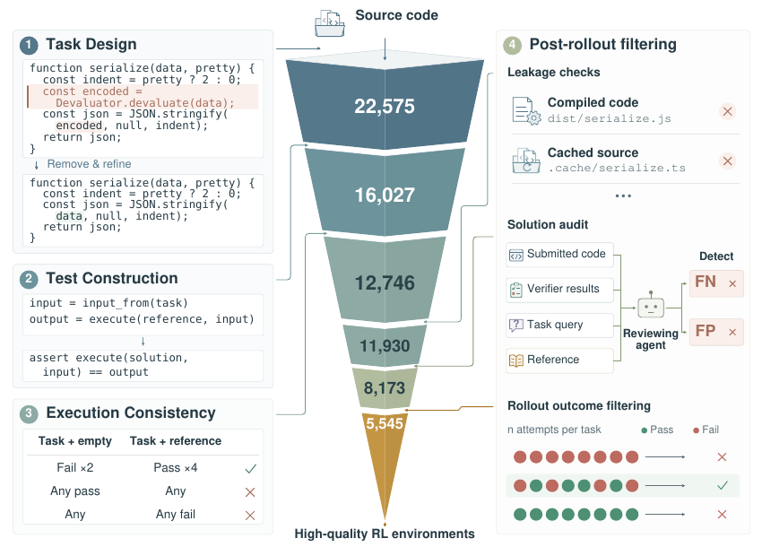
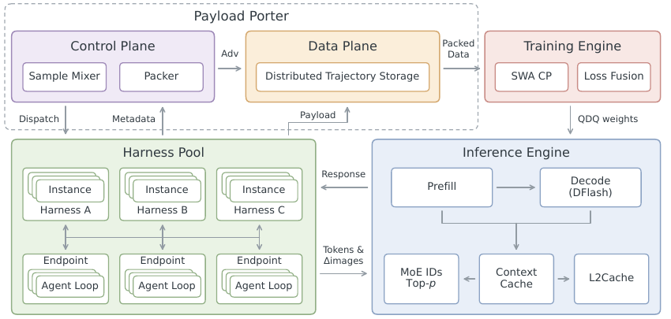

# MiMo-V2.6 调研：从 CodeMidas 环境工厂到大规模 Agentic RL

> 团队分享版 · 2026-09-22 · 建议分享时长 30–40 分钟。本文已核对两篇原报告及官方直播接口；实验数字均为作者报告，本仓库未复现。快速阅读可先看「架构概览」「工程经验」「我的收获」。

## 论文信息

| 材料 | 身份、时间与原始来源 | 本文关注点 |
|---|---|---|
| CodeMidas: Scaling Agentic Coding RL Environments from Code Itself | Bowen Ye、Lei Li、Shicheng Li 等 19 位作者；Xiaomi、北京大学、香港大学、中国人民大学；arXiv v1：2026-09-18 17:55:17 UTC；[摘要与作者](https://arxiv.org/abs/2609.22068v1)、[全文](https://arxiv.org/html/2609.22068v1) | 如何从源码生成可信、可执行的 RL environment |
| MiMo-V2.6: Scaling Reinforcement Learning Towards Self-Improvement | PDF 署名 LLM-Core Xiaomi；随 2026-09-22 官方发布公开；[技术报告 PDF](https://huggingface.co/XiaomiMiMo/MiMo-V2.6-Pro-RL/blob/73875d00b30a89ef8cc353a0b60b0e9f9561952d/MiMo_V2_6_technical_report.pdf)、[官方发布说明](https://mimo.mi.com/docs/zh-CN/news/latest/v2-6) | 多任务 RL、grader、采样调度、训推一致性与故障分析 |
| MiMo-V2.6 RL 直播 | Xiaomi MiMo 官方训练日志看板；[入口](https://mimo.xiaomi.com/rl/)、[指标定义](https://mimo.xiaomi.com/rl/api/runs)、[评测记录](https://mimo.xiaomi.com/rl/api/benchmarks)、[事件通知](https://mimo.xiaomi.com/rl/api/notices) | 动态训练过程，以及运行时发生过哪些干预 |

下文用 **[C]** 表示 CodeMidas v1，用 **[M]** 表示 MiMo-V2.6 的 44 页 PDF，用 **[L]** 表示官方直播接口；章节、图表号均对应原文。CodeMidas 的 `citation_title`、19 个 `citation_author`、`citation_date` 已与原文对齐。[核验快照](../assets/mimo_v26/source_snapshot.json)保存报告哈希、关键接口字段及采集时间，便于未来发现页面更新。

**两篇报告的关系必须先分清：** CodeMidas 独立实验训练的是 **MiMo-V2.5**；[M] §4.2.1 明确引用它作为源码驱动的任务合成路径之一，但没有披露 CodeMidas 在 V2.6 全部训练数据中的精确比例或单独贡献。CodeMidas 的 5,545 个任务、V2.6 发布的约 7k 任务、直播累计 trajectory 数，是三种不同计数。

相关入口：[Agentic RL](../topics/agentic_rl.md#mimo-v26-environment-contract)、[RL 框架选型](../topics/rl_framework_selection.md)、[长上下文训练](../topics/long_context_training.md)、[MoE](../topics/moe.md)、[阅读决策](../reading_queue/P1.md#mimo-v26-reading)。

## 架构概览

### 先讲结论

MiMo 这组工作展示了一条完整的工程链：**把软件功能变成可验证任务，把任务执行变成高质量 trajectory，再把异构、长尾的 trajectory 稳定地供给训练器。** 扩大 GPU 规模需要环境供给、奖励可靠性与样本调度同时跟上。

团队最值得带走的四点：

1. **环境质量决定梯度是否有意义。** Docker 能启动、reference 能过测，只是第一层；还要证明不同正确实现能通过、错误实现会被拒绝、答案没有泄漏。
2. **混合任务调度直接改变训练分布。** 快任务先完成、容易任务被过滤、慢任务陈旧过期，都会让实际消费分布偏离配置。
3. **二元 reward 之外可以增加 grader 计算。** GRS/GAR 区分“都通过，但解法质量不同”的轨迹；grader 的失败、延迟和偏差也因此进入训练关键路径。
4. **直播最大的价值是暴露生产干预。** 数据移除、重启、并行配置调整和 CPU OOM 都会影响曲线解释；不能用单条 reward 曲线证明无条件的 RL scaling law。

### 模型底座与阶段边界

[M] Table 1 给出 Flash 约 **310B 总参数 / 15B 激活**，Pro **1.02T / 42B**，均采用 hybrid SWA/global attention 与 sparse MoE，并接入视觉和音频 encoder。Flash 模型卡另写 309B；本文统一沿用报告 Table 1 的 310B 口径，不据此推断架构变更。

训练阶段是 text pretraining → omni pretraining → agent-centric mid-training → 短 SFT → mixed-task RL → MOPD2。Mid-training 把上下文延长到 1M，并为大 batch RL 引入 Muown 与 MXFP4 QAT。[M] §3、§5.6。因此，“六天直播”只覆盖其中的 RL 实验，不能解释为从零训练出模型的全部成本或时间。

## 训练系统设计

### 1. CodeMidas：从源码构造一个可训练的 environment



图源：[C] Figure 1，PDF 第 4 页；仅摘取该核心流程图，版权归原作者。图中最终保留 5,545 个任务，但各阶段的筛选不能简单解读成独立质量增益。

一个任务由 **行为规格、容器化开发起点、隐藏 executable verifier** 组成。Solver 拿到删去目标功能的代码与依赖；原实现独立保留，hidden verifier 在评分时才注入。[C] §3。

| 阶段 | 作者实际做了什么 | 工程上保护什么 |
|---|---|---|
| Task design | Agent 追踪公开接口和依赖，抽取已有功能，删除核心实现，联合修订任务描述与起始代码 | 任务可以明确验收，同时允许替代实现 |
| Test construction | 在 reference 上执行 CLI、纯函数或有状态 API；每条断言关联规格中的要求 | 测试预期有执行证据，减少凭空生成 oracle |
| Assertion review | 去掉规格未要求的消息文案、内部结构、偶然顺序；依赖 private symbol 且无行为替代的任务被拒绝 | 避免正确实现因“不像参考答案”而被误杀 |
| Environment preparation | 安装依赖，清除目标实现相关编译产物、缓存、构造过程遗留文件与原测试，保留离线构建材料 | 既可执行，又无法直接找回被删除的答案 |
| Execution consistency | 6 个全新容器：起始状态 2 次必须都失败，reference 4 次必须都成功 | 筛掉无效测试和执行不稳定的任务 |
| Post-rollout filtering | 对抗 agent 查泄漏；每任务 4 条 coding rollout 交给独立 reviewer 审核 verdict；另用 frontier model 筛选成功与失败并存的任务 | 检查真实策略面对环境时是否得到可信且有区分度的监督 |

一个容易理解的例子：规格要求“非法输入抛出某种异常”，reference 恰好输出某段报错文本。除非规格要求逐字一致，测试只能检查异常类型或规定属性。否则模型学到的是模仿 reference 的偶然细节。

这里的 **reference execution 是证据，不是自动正确的规格**。现有代码可能有 bug；reviewer 也可能和生成器共享盲区。CodeMidas 把这些风险变成可检查的筛选过程，没有证明它们被彻底消除。

另外，全通过/全失败不等于任务一定坏：可能是筛选模型太强、太弱或预算不合适。最终数据分布依赖筛选 policy 和 rollout budget；换基座后应重新测量有效任务比例。[C] §3.4。

### 2. CodeMidas 的实验到底证明了什么

训练集包含 **5,545 tasks / 3,185 codebases / 23 languages / 15 domains**。训练采用 MiMo-V2.5、GRPO、binary execution reward，batch 32、每任务 32 rollouts；标准差 advantage normalization 关闭，最大 staleness 为 8。[C] §3.5、§4.1、Appendix A。这组配置不能当作 V2.6 的训练配置。

| 评测 | 初始策略 | CodeMidas RL | 绝对增益 |
|---|---:|---:|---:|
| SWE-bench Pro | 50.3 | 54.4 | +4.1 pp |
| DeepSWE v1.1 | 10.0 | 21.7 | +11.7 pp |
| ProgramBench：Almost Solved | 4.5 | 21.5 | +17.0 pp |
| RepoZero C2Rust | 40.5 | 51.8 | +11.3 pp |
| Terminal-Bench v2.1 | 63.7 | 72.2 | +8.5 pp |

来源：[C] Figure 5、§4.1。**pp 为百分点，不是相对百分比；ProgramBench 是通过至少 95% tests 的任务比例，并非 fully solved。** 作者检查了训练任务与验证集、五个外部 benchmark task sets 不相交，但不能据此声称排除了 pretraining contamination 或所有仓库级相似性。

更有价值的消融是：在相同训练配置下，高质量 3k 子集在三个被比较评测上均胜过未清洗的 vanilla 8k；完整高质量集的 DeepSWE 为 21.70，vanilla 8k 为 17.11。[C] Figures 7–8。它支持整套清洗与筛选有价值，**没有隔离每个步骤的贡献，也没有证明按总构造成本归一化后仍最优**。

行为分析发现更多代码探索、自验证以及任务相关的长度变化。CodeMidas Val 上，自编写并执行 checks 的 rollout 成功率高 4.2 pp，95% CI 为 1.8–6.6；这是同任务、同 checkpoint 的关联分析，不能说“多跑测试必然因果提升 4.2 pp”。[C] §5.2。尤其不能把工具调用次数本身变成质量奖励。

### 3. V2.6 将环境扩展到多领域

[M] §4.2 把 CodeMidas 放在更广泛的任务体系中：

| 任务域 | 环境与验证设计 | 最需要防止的失真 |
|---|---|---|
| Code | Issue/PR、员工真实需求、复杂规格、源码功能、长程工程任务等路径；规格与测试对齐；reference patch 的 F2P/P2P 检查 | 测试漏验、过严、泄漏和 flaky execution |
| General | 真实文件与本地 software mock；planner 组织工作区和数据库，生成后检查实体、金额、时间线及引用的一致性 | mock 与真实业务语义脱节，跨文件状态矛盾 |
| Visual | 开放设计结合 pointwise/groupwise judging；视觉复刻结合规则相似度与整体视觉判断 | 外观好看掩盖功能错误，judge 偏好替代用户要求 |
| Cyber | 以目标漏洞复现为任务，按 sanitizer 报告的漏洞类型和项目栈位置检查匹配 | 把任意 crash 错当作目标漏洞成功 |

注意两个验证流程的区别：[C] 是起始状态 2 次失败、reference 4 次通过；[M] §4.2.1 对带 reference patch 的 coding tasks 描述的是 F2P/P2P 结果在 **8 次 reruns** 中稳定。不要把它们写成同一套数字。

General 环境强调所有状态本地化、每条 rollout 的 sandbox 可恢复到固定初态，避免外部服务限流和网络随机性。[M] §4.2.2。**迁移判断：**环境 reset、状态一致性和 verifier 版本，都应成为训练样本的身份信息；“工具调用成功”不足以证明任务状态正确。

### 4. Grader compute：GRS 与 GAR 的职责不同

传统二元 reward 下，多个 passing solution 得到相同的正向信号，但其中可能有不必要改动、漏掉非测试覆盖要求或重复试错。MiMo 对不同 coding 子集采用两种方法。[M] §4.3、Figure 7。

**GRS（Groupwise Reward Synthesis）**：面向部分高通过率任务，离线比较多条 rollout，生成 task-specific solution/behavior rubrics；在线逐条复用评分。公式为：

```text
R_i = R_test_i × S_solution_i × S_behavior_i
```

测试失败仍为零；全部测试通过时，如果 quality scores 不同，仍有可学习差异。因此，“all-pass 一律无梯度”只适用于最终 reward 相同的情况，不能把 raw test passrate 当作所有分支的过滤标准。

**GAR（Groupwise Advantage Redistribution）**：对其余 coding tasks 的 mixed-outcome groups，在线 grader 在共享工作区比较成功与失败轨迹，对 passing patches 排序；确认 hacking 的轨迹先置零 reward，再重算组统计。其余 passing trajectories 按质量重新分配正 advantage。[M] §4.3.2。

用原文未加 cap 的形式表示，`A_i = R_i - mean(R)`；给成功项一个 `f_i ∈ (0,1]`，再令 `λ = Σ_pass A / Σ_pass(f × A)`，`A'_i = λ f_i A_i`。失败项在这一步不变。工程实现还会限制 λ、再做全组零均值化；因此不能宣称所有实际分支都严格保持未加 cap 公式的守恒关系。

**解释例子，非原实验：**4 条轨迹 reward 为 `[1,1,0,0]`，原 advantage 为 `[0.5,0.5,-0.5,-0.5]`。若两条成功轨迹的质量因子为 `[1,0.5]`，未加 cap 的正 advantage 变为约 `[0.667,0.333]`，保持成功项总量。GAR 调整的是 **sequence-level advantage**，再广播到 response tokens；不能称为每个 action 都获得了独立的因果 credit assignment。

Grader 输出不可用时，报告采用原 advantage fallback；正式训练仍需观测其占比，否则不同任务会在不同评分规则下被优化。GRS/GAR 与 token-level penalty module 也应分开理解：后者对重复、错误等被标记 token 施加更细粒度约束。[M] §4.3、§6.1。

**效果证据与边界：**[M] Figure 8 比较 Flash 的 code-only RL，有 GAR 时通过率持续改善，turns 更稳定、token 长度增长更缓；该实验 batch 为 128、采用 token-mean aggregation，和大规模 mixed run 的 prompt-mean aggregation 不同。它支持 GAR 抑制无效长度膨胀，但不能推导“所有 V2.6 任务都越来越短”：主 mixed run 的 Figure 9 明确显示，效果提升通常也伴随更多 total tokens。

### 5. Runtime：先把多框架运行和大 payload 搬运拆开



图源：[M] Figure 14，PDF 第 28 页。这里关注的是状态与数据经过哪些边界，而非把图理解成已公开的部署配置。

- **Harness Pool**：固定规模的 persistent Ray host actors 承载多个并发租户，避免每条 trajectory 一个 actor 导致 GCS file descriptor 耗尽。阻塞环境操作与 tokenization 放到后台线程，避免堵塞共享 event loop。不同 harness codebase 用不同 pool；同一个比较 group 保持相同 harness 配置。[M] §6.2。
- **Payload Porter**：tokens、logprobs、MoE routing、top-p candidates、视觉数据写入分布式 store；driver 只处理 reward、长度与 payload keys。按训练消费位置读取和 packing，不把整个 batch 聚合到 driver。[M] §6.2。
- **Sample Mixer**：根据各 source 的目标份额、有效率、执行时间和当前缺口分配并发。组内评估、dynamic sampling 与 partial rollout 一起决定最终被训练的数据。[M] §6.3。

报告生产训练使用 **Megatron-LM + SGLang**。[M] §6.4。发布说明中的 **verl + uni-agent + mini-swe-agent** 指向社区复现实验栈；本文没有将二者视为完全相同的实现，也没有完成公开 RL 框架的源码复现。

### 6. Sample Mixer：目标配比不等于提交配比

假设某个 source 每 step 需要 `B_i` 个保留 groups，接受率为 `r_i`，平均有效 rollout 时长为 `t_i`。报告以 `m_i = B_i / r_i` 估计生成需求，并据 `t_i × m_i` 调节并发预算。[M] §6.3。实际公式还有全局 oversampling 预算和每 source 上下界，不应直接无限放大低接受率 source。

**解释例子，非原实验：**两个 source 都需要 100 groups；A 耗时 1 分钟、接受率 0.8，B 耗时 10 分钟、接受率 0.2。需求约为 125 与 500 groups；达到同样供给速度，B 的并发需求约是 A 的 `10×500/125 = 40` 倍。只按目标 1:1 投递，会让慢 source 拖住整个 batch。

调度权重进一步混合长期需求与当步缺口：

```text
w_i = α × B_i/r_i + (1-α) × max(B_i-A_i, 0)/r_i
```

`A_i` 是当前已接受数。报告比较 `α=0`、`1`、`0.5`，并结合预分配并发处理冷启动。**Figure 16 是 trace-driven simulation**，排除了 training time、credit-assignment latency、staleness expiry、replay；不能拿它当端到端生产 speedup。

Predictive Rollout Dispatch 同时约束预计 KV 需求和 inference concurrency；tool time 很长时，活跃 trajectory 数不等于同时请求 GPU 的数量。启动/恢复阶段允许从慢 source 重放合格 group，限第一轮收集，并要求符合对应 policy/staleness 条件。[M] §6.3。

## 并行策略

V2.6 报告给出的主要配置是 **1,568 prompts × 16 rollouts = 25,088 trajectories/step**，asynchronous partial rollout 的 staleness 配置为 4；RL 目标任务混合为 coding 68%、general 12%、visual 13%、context following 3%、cyber 4%。[M] §5.1。直播期间存在数据调整，这不是每一步都不变的实际比例。

训练利用 DP 消费大 batch，TP/CP 支持大模型与长序列，MoE 涉及 EP。报告未给出可完整复刻此次大规模运行的 GPU 型号、精确卡数、拓扑及每阶段 TP/PP/CP/EP 全量配置；**不能由模型大小或费用反推一个确定部署方案**。

优化目标也不宜只写成“标准 GRPO”：报告采用 prompt-mean aggregation 与 token-level importance ratio，并分别为正负 advantage 设置上下界，通过 mask 排除越界 token；上下界初始均为 `[0.2, 5.0]`，运行中依据 entropy 调整。[M] §5.1。因此大 batch、grader、optimizer、clipping 和人工干预共同影响曲线，无法把所有收益归因于扩大算力。

Partial rollout 在权重更新后恢复未完成序列，需要 re-prefill；旧 token 保留生成当时的 inference logprob，不用新模型覆盖其 behavior probability。[M] §4.1、§5.1。工程迁移应保留 token/segment 的 policy lineage，不能给整条跨版本 trajectory 只标一个“最新版本”。

## 显存优化

| 机制 | 报告披露 | 迁移时的验收点（本文建议） |
|---|---|---|
| Context Cache | 同 policy version 多轮复用 KV，只 prefill 新 suffix；工具等待时 offload 到 pinned host pool | 分别量化 HBM、host pool、cache miss 与 re-prefill；版本更新必须失效旧 KV |
| SWA + CP | 128-token SWA 层只交换 query 可达的 KV，流量受 window 大小约束 | full-attention 层仍需单独计算通信与容量，不能把全部层都按 SWA 估算 |
| CPU optimizer state | 更新参数时才搬回 optimizer state | 测 optimizer 搬运是否进入 step 关键路径 |
| Loss fusion / CP-local packing | 融合 PG/OPD loss 与可选指标；packer 只读取 CP window 需要的行 | 检查 loss/logprob 是否重新 materialize 全序列或大 logits |
| MoE router freezing | 抑制 RL 期间 expert-load drift | 仍要测 micro-batch × layer × EP rank 峰值，而非只看全 batch 平均 |

来源：[M] §5.4–5.5、§6.2–6.4。冻结 router 参数并不保证输入分布和 micro-batch 分组下的路由负载恒定；它也不能消除所有 expert activation OOM。

## 通信优化

训推一致性涉及三个不同问题：[M] §6.4。

1. **权重值一致**：每次更新后对专家权重 QDQ，使训练看到与 rollout MXFP4 kernel 对齐的权重值。
2. **执行路径一致**：R3 保存 rollout 选中的 expert indices，训练时 replay，处理数值差异触发的离散 expert 切换。
3. **概率归一化一致**：保存 top-k/top-p 实际候选集合，在同一集合上计算训练 logprob；不能把截断后的 rollout 概率和 full-vocabulary training 概率直接作比值。

同一 policy version 内，Context Cache 保留 MoE IDs、candidate sets、视觉输入等状态；多轮只传新图像增量。训练时视觉 encoder 先按图像负载分配，生成 embeddings 后再分发到对应 token ranks。[M] §6.2、§6.4。代价是更重的有状态缓存与数据生命周期管理。

推测解码也按 **端到端吞吐** 选择配置：报告中 mixed-task RL 的 block-6 相对 block-8 吞吐约高 6%，而 accepted length 变化不大。[M] §6.4。不能只凭 draft acceptance rate 决定最快配置；该数字也不是通用部署加速比。

## 集群规模

### 官方直播已结束：以同一快照对齐数字

2026-09-22 的 [Pro status](https://mimo.xiaomi.com/rl/api/status?run=pro) 与 [Flash status](https://mimo.xiaomi.com/rl/api/status?run=flash) 均返回 `mode=ended`、`step.last=30`。以下字段保存于[来源快照](../assets/mimo_v26/source_snapshot.json)，不是未来持续更新承诺。

| 指标 | Pro | Flash | 口径 |
|---|---:|---:|---|
| 完成 step | 30 | 30 | `step.last` |
| 累计训练 trajectory 计数 | 752,640 | 752,640 | `totals.trained_cum`；不代表 distinct tasks 或全部生成尝试 |
| 看板累计 token 计数 | 75.00439B | 81.39770B | `totals.tokens_cum`；不是 pretraining tokens，也不是全部新生成 response tokens |
| Step 30 token 计数 | 3.43137B | 3.69598B | `totals.tokens_step`；不能用末步大小乘 30 重构累计量 |
| 看板累计成本 | $2,620,670.84 | $854,044.70 | `cost.so_far`；公开计费口径，非完整项目成本审计 |
| DeepSWE step 1 → 30 | 58.41 → 72.57 | 48.67 → 65.68 | [L] benchmarks 标注 mini-swe-agent、avg@3 |

`25,088 × 30 = 752,640`，所以约 75 万是**每个 run**的训练 trajectory 计数，不应写成两个 run 总共 75 万。[M] §4.1 给出的 2.7–3.7B tokens/step 是报告描述范围；直播记录包含低于此范围的早期 step，应保留各自口径。

[M] Figure 3 给出 Pro 成本组成：training 43.5%、rollout 43.8%、grader 12.7%。至少在该实验中，grader 已是不可忽略的计算项目；但不能把该比例套到所有 Agentic RL 工作负载，也不能从费用推算 GPU 利用率。

### 成绩与时间为何会出现多个版本

- **RL dynamics 与最终模型评测不同**：[M] Figure 3 / [L] 的 Pro、Flash 末步 DeepSWE 为约 72.6、65.7；[M] §5.6 在 MOPD2 之后引入的最终 Table 3 为 71.9、67.9。不能把两组分数混用为同一次 RL 的前后对照，也不能仅凭差值判断 MOPD2 的独立效果。
- **avg@3 不等于 pass@3**：前者平均多次尝试的成绩；后者通常表示多次尝试中至少一次成功的概率。直播标签使用 avg@3。
- **elapsed time 的边界不一致**：[M] Figure 12 标注 Pro 123.1h、Flash 81.8h；[L] `run.end - run.start` 算得约 127.49h、83.09h。起止/恢复计入方式未完整说明，本文不把二者强行统一，也不据此计算统一每 step 性能。
- **混合分布发生过人工干预**：[L] notices 记录移除 Pro cyber 数据及过滤相对容易的任务。因此平均 passrate 变化包含任务分布变化，须配合固定 held-out eval 阅读。

## 工程经验

### 直播与失败分析能教我们什么

| 观察到的事件 | 报告中的机制或归因 | 对我们排障的启示（推断） |
|---|---|---|
| GPU-memory DBE、Cyber Kubernetes 故障、grader 网络不通 | [M] §5.5；[L] notices 还记载 Flash 从 step 15 重启，部分 infra error 曾未正确识别 | 必须区分 TASK_FAIL 与 INFRA_ERROR，否则平台故障会成为模型负 reward |
| 重启后 KV 池耗尽 | 短 rollout 先结束，长度估计偏低；某 harness 在同 source 上的轨迹不足其他 harness 一半长 | 容量估计至少按 source × harness 分层，冷启动使用保守先验和高分位数 |
| EP rank 发生 activation OOM | micro-batch 内某层 EP rank token load 超过均值 30 倍，尽管 full batch 相对均衡 | 监测最坏 micro-batch、层与 rank；先定位 token dispatch，不能只调低总 batch |
| Flash 后期 CPU OOM | 长序列增加本地 packing 数据量；分布式 packing 仍超单节点 host memory | 分布式总容量与单 worker 峰值都要设 admission/backpressure |
| Router 负载漂移 | 不冻结 router 的对照在 layer 9 上出现 load collapse；恢复初始 router 后负载改善 | 路由稳定性要与策略质量分别测量；冻结不是负载均衡的完整保证 |

报告中 confirmed reward-hack share 低于 2% 指的是**检测并确认的比例**，不是“真实 hacking 概率已证明小于 2%”。[M] §4.2.6。环境构造前清理、专门 hack agent、训练中离线 audit，以及线上确认后修正 reward，共同构成防线；漏检率仍是开放问题。

### 对 AReaL 的可迁移性

下面是设计建议，不代表本仓库已经在 AReaL 实现，也不代表报告采用 AReaL。

| 子系统 | 值得迁移的机制 | 迁移前必须测量 |
|---|---|---|
| environment / reward | 不可变环境版本、独立 grader、FP/FN audit、infra error 独立分类 | reset 一致性、误判率、失败分类覆盖率 |
| scheduler | source-aware budget、acceptance-rate 校正、缺口调度 | 实际消费配比、等待慢 source 的时间、陈旧丢弃率 |
| rollout | source × harness 长度先验；按 KV 与 inference slots 联合准入 | 冷启动/恢复阶段 p95/p99，host KV 峰值，OOM 率 |
| data/trajectory path | driver 只携带 metadata；consumer 读取 CP-local payload | driver RSS、packer RSS、对象保留时长、重复传输字节 |
| training / weight sync | behavior logprob、segment policy version、router replay、候选集一致性 | 同参数下 logprob 差异、跨版本 clip fraction、更新原子性 |
| checkpoint/recovery | 恢复 sample pool 与 scheduler 估计，replay 保留版本与幂等消费记录 | 有效吞吐恢复时间、配比瞬态、重复消费、过期样本进入梯度的次数 |

建议先做 [小规模验证计划](../experiments/mimo_v26_environment_and_mixer.md)，把质量/调度问题分开验证，再决定是否迁移复杂 grader 或缓存机制。

## 对行业的影响

**本文的趋势推断：**Agentic RL 的可扩展对象正在从训练 tokens，扩展到任务覆盖、environment 可重放性、grader 计算和有效样本供给。CodeMidas 提供了环境合成可带来跨任务收益的证据；V2.6 提供了大规模生产路径及失败边界的工业证据。二者结合后，训练平台的职责自然延伸到数据生产和奖励质量控制。

这仍不是通用 RSI 已实现的证明。实验依赖人设计任务分布、构造器、verifier、grader、优化器和运行时干预；尚缺对“系统持续自主改进这些组件”的独立长期验证。

## 我的收获

如果给团队分配下一轮工程投入，我会先看 **每单位成本有多少可信、及时、符合目标配比的样本真正进入训练**。这是一组联合指标，不建议拍成一个未经校准的综合分数。

CodeMidas 改变的是环境来源与监督验收；V2.6 改变的是我们对 RL 平台规模化瓶颈的判断。可执行数据应当同时携带 task/env/verifier/harness 版本，rollout 应能解释 reward、policy lineage 和过滤原因，调度应当以训练实际消费结果闭环校正。该判断已回写 [Agentic RL topic](../topics/agentic_rl.md#mimo-v26-environment-contract) 与 [长期 insight](../insights/001_agentic_rl_will_change_training_infra.md#mimo-v26-evidence)。

用于 30–40 分钟分享的顺序：5 分钟区分两个实验；10 分钟讲 CodeMidas 的一个任务如何通过验收；10 分钟讲 GRS/GAR 与 Sample Mixer；最后 10 分钟讨论恢复后的 KV OOM、micro-batch expert imbalance 和验证计划。

## 后续演进

1. **开源与复现边界**：[M] Table 5 列出约 3k code、1k cyber、1k general、2k visual tasks，并另提约 1k music tasks。Table 6 的 11 项提升来自**同一 9B SFT 初始化分别进行 domain-specific GRPO 的 checkpoints**，不是一个统一 9B mixed-task RL checkpoint 的 11 项成绩；multi-harness coding 是另一组实验。不得将它们当成完整复现大规模 V2.6。
2. **MOPD2 的后续阅读**：除了完整 student rollout，还从 teacher trajectory 或 SFT demonstration 提取历史 prefix，由 student 生成新的一轮并接受 token-level teacher supervision。[M] §5.6。它减少重放整个历史的开销，但不自动保证多轮 student 自主偏离后的状态覆盖；可沿 [MOPD topic](../topics/mopd.md) 继续研究。
3. **尚未核验的交付物**：本次已下载两篇 PDF、核验模型仓库与直播接口；没有拉取/执行完整 RL framework、环境镜像或 9B 权重。HF dataset API 在本次查询中未列出对应新任务集，GitHub API 的组织查询失败；不能据此断言资源没有发布，也不提供未经验证的安装命令。
4. **证据缺口**：CodeMidas 环境构造总成本、各筛选步骤独立消融、跨 seed 的主评测方差；V2.6 各模块对大 run 的独立贡献、grader 漏检率、完整集群布局与端到端复现预算。后续补充应使用新版本报告或实测，不补猜测。

## 面试高频问题

**为什么 binary test reward 仍可能训练出错误行为？** 测试可能遗漏要求、强制参考实现细节、存在答案泄漏或执行噪声。模型只需优化 verifier，而不一定完成真实任务；需要规格对齐、替代解审核、环境隔离与训练中 audit。

**GRS 和 GAR 有什么区别？** GRS 离线生成 rubrics、在线形成更细 reward，可能激活原先二元全通过 group；GAR 在线比较 mixed-outcome group，修正确认 hacking，再按质量重新分配 sequence advantage。

**为什么异步系统也会等慢任务？** 训练目标有 source 配比约束；快任务不能无限替代慢任务。应同时校正接受率、耗时、当前缺口与 staleness，必要时减少不健康 source 的目标并记录实验干预。

**Router freezing 是否解决了 MoE OOM？** 只缓解 router 参数漂移；输入分布、micro-batch 切分与专家峰值仍能让某 rank OOM。报告里已经出现此反例。

**为什么同一 checkpoint 的训推 logprob 仍可能不同？** 低精度权重值、离散 expert route 与截断采样归一化集合都可能不同；分别需要 QDQ、routing replay 与 candidate-set replay，不能只归因于 off-policy。

## 生产环境思考题

1. Grader 服务停 20 分钟：系统会错误返回零分，还是标记可重试的 infra error？已完成轨迹如何保存、去重和恢复评分？
2. 一个 source 的接受率由 50% 跌到 5%：应自动增加十倍并发，还是先确认 grader/schema 是否变更？如何设置并发上限和告警？
3. 重启后第一批均为短轨迹：怎样验证长度估计存在完成顺序偏差，而不是 workload 真变短了？
4. 全 batch expert CV 正常却 OOM：能否定位到具体 micro-batch、layer、EP rank 和 dispatch token 数？
5. GAR 提高训练 reward 但 held-out success 不涨：怎样区分 grader 偏好、hacking、任务漂移与真实样本效率问题？
6. 发布前，能否把每个成绩绑定到 checkpoint、harness、verifier、attempt count、metric definition，而不是只保留模型名称？

返回：[Master Reading List](../MASTER_READING_LIST.md) · [Knowledge Graph](../KNOWLEDGE_GRAPH.md) · [定向研究记录](../tracking/agentic_rl.md#mimo-v26-research)。
