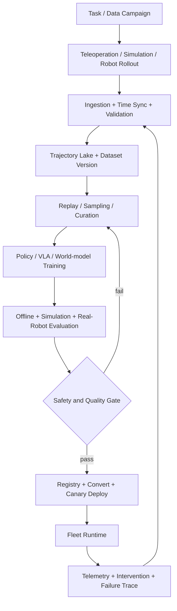
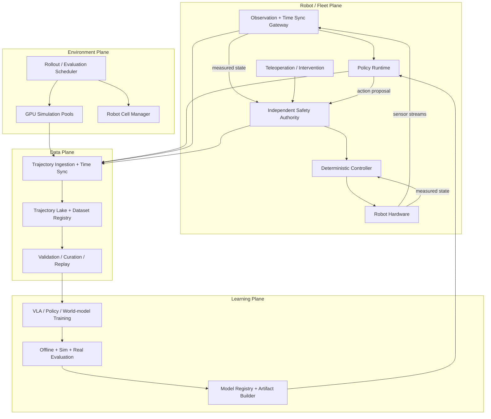

# Agentic for Embodied：从系统地图到生产平台

> 定位：面向 AI / RL Infra 工程师的工程手册章节。机器人学只讲到能够理解 workload 和系统边界；主线从 Approach A 的系统地图出发，最终落到 Approach C 的可实施平台设计。
>
> 生命周期状态：`NEW`。当前版本完成系统地图、参考 workload 和第一版平台蓝图；尚未经过真实机器人或仿真实验验证。

## 1. 这个专题解决什么问题

Agentic for Embodied 研究的是：一个 agent 如何通过摄像头、传感器和机器人本体感知物理世界，形成计划，连续输出动作，并从真实或模拟环境的反馈中继续学习。

它不是“给 LLM 接一个机械臂”。与 text-only agent 相比，系统边界发生了六个变化：

1. **Observation 是连续多模态流**：图像、关节状态、力传感器和时间戳必须对齐。
2. **Action 有物理时限**：晚到的正确动作也可能是错误动作。
3. **Environment 很昂贵**：真实 rollout 需要机器人、场地、操作员、reset 和安全保障。
4. **Failure 有物理代价**：不是简单返回 `500`，而可能碰撞、损坏设备或伤人。
5. **Policy 运行在闭环中**：模型输出会改变下一帧 observation，误差会沿 trajectory 放大。
6. **训练与部署跨越多个计算域**：数据中心 GPU、仿真 GPU、边缘 GPU、CPU 控制器和机器人资源共同构成系统。

因此，Infra 工程师真正要回答的不是“哪个 VLA 排名最高”，而是：

- trajectory 怎样采集、同步、验证、版本化和回放？
- 仿真环境如何并行、reset、调度并和真实机器人数据统一？
- VLA / diffusion policy 如何满足实时推理和高频控制？
- 训练 checkpoint 怎样转换成可部署 artifact，并安全下发到 fleet？
- 哪些 Agentic RL 能力可以复用，哪些必须为物理系统重建？

## 2. 最小机器人背景

| 概念 | Infra 工程师需要理解到什么程度 |
|---|---|
| Observation | 某一时刻可供 policy 使用的输入，例如多路 RGB、depth、proprioception 和语言任务。它不是天然同步的。 |
| State | 系统希望描述的真实状态。真实世界通常不可完全观测，policy 只能通过 observation 近似。 |
| Action | policy 输出的控制目标，例如末端位姿增量、关节位置、速度或 gripper command。必须带 action space 和单位。 |
| Control frequency | 控制循环每秒执行次数。高层 VLA 可以是 5-20 Hz，低层 controller 往往高得多；具体值取决于机器人与任务。 |
| Action chunk | 一次推理输出未来多个 action，减少大模型无法逐控制 tick 推理的问题，但会引入重规划时机和 chunk 边界问题。 |
| Episode | 从 reset 后初始状态到成功、失败、超时或人工终止的一段 trajectory。 |
| Reset | 把环境恢复到可再次采样的状态。仿真 reset 是 kernel/workflow，真机 reset 常需要机器人动作或人工介入。 |
| Embodiment | 机器人本体、传感器、action space 和动力学的组合。跨 embodiment 不是换个 `robot_id` 那么简单。 |
| Teleoperation | 人通过 leader arm、VR、手柄等方式控制机器人并产生 demonstration。 |
| Calibration | 相机内外参、关节零点、坐标系和工具中心点等配置；过期 calibration 会让“数据看起来正常、动作却系统性偏移”。 |
| Safety envelope | 独立于 learned policy 的速度、力、空间、碰撞和急停边界。 |

工程上最重要的分层是：

```text
Task / Planner       秒级：决定下一段要做什么
VLA / Policy         5-20 Hz：根据 observation 产生 action chunk
Controller           100-1000 Hz：跟踪目标、平滑动作、处理动力学
Safety authority     独立高频：限制、拒绝或中止危险动作
Hardware             执行动作并产生新的 observation
```

频率只是示意。核心判断是：**大模型 policy 不应该直接承担所有低层实时控制和最终安全责任**。

## 3. Approach A：workload 到平台决策的系统地图

算法或模型只有在改变接口、资源池、SLO、故障模式或验证策略时，才值得进入 Infra 主线。

| Workload property | Infra consequence | Platform decision | 代表证据 |
|---|---|---|---|
| 多路视频 + state/action 时序 | 数据量大、跨模态 timestamp drift、episode 边界复杂 | 采用 video + columnar data + manifest；校验时钟、drop 和 calibration | [LeRobotDataset v3](https://huggingface.co/docs/lerobot/lerobot-dataset-v3) |
| 跨机器人、跨 action space | schema 不能假设固定维度和单位 | 将 embodiment、action adapter、normalization stats 作为版本化 artifact | [Open X-Embodiment](https://robotics-transformer-x.github.io/) |
| VLA 既理解语义又输出动作 | checkpoint 同时包含 VLM、vision encoder、action head/adapter | 训练与部署必须验证 tokenizer、image processor、action decoder 和 robot profile 的兼容性 | [RT-2](https://robotics-transformer2.github.io/), [OpenVLA](https://openvla.github.io/) |
| diffusion / flow action decoder | 一次 action 需要多步采样，延迟和 jitter 影响闭环 | action chunk、异步推理、deadline-aware runtime；不能只看离线 tokens/s | [Diffusion Policy](https://diffusion-policy.cs.columbia.edu/), [Real-Time Chunking](https://arxiv.org/abs/2506.07339) |
| 真实环境昂贵且危险 | rollout 资源稀缺，失败不可随意重试 | 仿真优先、真机配额、operator lease、独立 safety gate 和 incident audit | [Isaac Lab](https://developer.nvidia.com/isaac/lab) |
| 仿真可并行但存在 reality gap | 高吞吐不等于真实有效样本 | physics/vision 仿真分池，domain randomization，真实回归集和 sim-to-real gate | [Isaac Lab paper](https://arxiv.org/abs/2511.04831) |
| 长任务需要 planning + control | 单模型端到端可能受 context、时延和恢复能力限制 | planner/VLA/controller 分层，分别定义 SLO 与 fallback | [Gemini Robotics 1.5](https://deepmind.google/blog/gemini-robotics-15-brings-ai-agents-into-the-physical-world/) |
| 多机器人持续产生反馈 | 数据、模型、robot firmware 和现场配置共同演进 | fleet registry、artifact lineage、shadow/canary、自动 rollback | [Isaac GR00T workflow](https://developer.nvidia.com/blog/develop-humanoid-robot-policies-end-to-end-with-nvidia-isaac-gr00t/) |

这张表就是 Approach A 的出口：先从 workload 看系统后果，再决定是否需要某个模型或框架。

## 4. 核心方案如何改变 Infra

### 4.1 Behavior Cloning / Imitation Learning

Behavior Cloning（BC）把 `(observation, task) -> action` 当作监督学习。它通常是第一条应跑通的生产路径，因为：

- 不要求在线探索，真实机器人风险较低；
- demonstration 可以离线清洗、重放和版本化；
- 训练失败与环境失败相对容易分离；
- 适合先验证 data contract、模型导出和部署闭环。

它的主要系统瓶颈不在 RL optimizer，而在数据：覆盖不足、失败样本缺失、operator 风格不一致、时钟漂移和 action label 语义不统一。一个实用方向是部署 policy，由人只在即将失败时介入，并把 intervention 与 recovery 数据重新写入训练集。

### 4.2 VLA：把语义能力接到动作空间

RT-2 将 robot action 表达成 token，与 vision-language 数据一起训练；OpenVLA 提供了开放的 7B VLA 训练与 checkpoint 路径。VLA 对 Infra 的真正影响是 artifact 变复杂：

```text
VLA artifact
  = language tokenizer / chat template
  + image processor / camera ordering
  + VLM checkpoint
  + action tokenizer or continuous action head
  + normalization statistics
  + embodiment adapter
  + robot/runtime compatibility manifest
```

只同步模型权重而遗漏 normalization、camera order 或 action units，会产生最危险的一类故障：服务正常、输出 shape 正确，但机器人动作语义错误。

### 4.3 Diffusion / Flow Policy：质量换来了实时系统问题

机器人 demonstration 往往存在多种合理动作路径，直接做单点回归容易平均出不可执行动作。Diffusion Policy 用条件去噪生成 action distribution；π0 则在 VLM 上增加 continuous action expert，并用 flow matching 输出高频动作。

这类方法改变了 serving contract：

- 输出不再是一个 token，而是一段连续 action chunk；
- 一次推理可能包含多步 denoising / flow integration；
- batch throughput 与单机器人 deadline 直接冲突；
- chunk 太长，响应新 observation 慢；chunk 太短，推理跟不上且边界不连续。

[Real-Time Chunking](https://arxiv.org/abs/2506.07339) 给出值得 Infra 工程师关注的执行策略：在当前 chunk 执行时异步生成下一 chunk，冻结已经确定会执行的 prefix，再对剩余动作进行 inpainting。它说明 embodied serving 的目标不是普通 QPS，而是 **在 deadline 内持续提供时间连续、可执行的 action**。

### 4.4 Hierarchical system：planner、policy、controller 分层

长任务通常更适合分层：

```text
Embodied Reasoner / Planner
  -> subtask / skill / constraint
VLA or skill policy
  -> action chunk
Deterministic controller
  -> actuator target
Independent safety authority
  -> allow / clamp / stop
```

Gemini Robotics 1.5 将 embodied reasoning 与 VLA 作为可协作的两个模型，是这条工业路线的代表。这里不应直接把厂商 benchmark 当作可复现结论，但其系统分层对平台设计有价值：高层 planner 可以慢、可以调用工具；低层 policy 必须满足闭环时延；controller 和 safety 必须独立于生成式模型。

### 4.5 World model：学习出来的环境，不是免费的 simulator

World model 学习 `observation + action -> future`，可以用于 imagined rollout、规划或数据增强。它的工程诱惑是绕开昂贵真实 rollout，但必须看到边界：

- model error 会沿 imagined trajectory 累积；
- policy 可能利用 world model 的错误，而不是真实物理规律；
- world-model rollout 需要记录 model version 和 uncertainty；
- 高不确定区域仍需要真实环境或高保真 simulator 回填。

因此 world model 应被当作一种带版本和置信度的 environment backend，而不是替换 ground truth 的万能生成器。[DreamerV3](https://danijar.com/project/dreamerv3/) 是用 learned world model 进行 imagined rollout 的代表性材料。

### 4.6 Online RL：最后引入，不是第一天就引入

Online RL 可以利用真实或模拟反馈继续优化 policy，但会把系统复杂度推到最高：

- policy version 与 trajectory freshness；
- environment/robot lease 与 reset；
- reward correctness 与 delayed reward；
- exploration safety；
- 不同 robot 的异步数据速率；
- train-to-deploy artifact 转换和逐 fleet 更新。

工程顺序通常应是：先跑通 offline BC，再扩 GPU simulation 和 automated eval，最后才做 guarded real-world online improvement。

## 5. End-to-end embodied learning loop



与 LLM RL 的 producer-consumer 相似，robot/simulator 生产 trajectory，trainer 消费 trajectory；但 embodied loop 多了三个不可忽略的状态：**环境状态、设备状态和安全状态**。

## 6. Data 与 trajectory infrastructure

### 6.1 最小 trajectory schema

不要把机器人数据存成“几段 MP4 + 一个 CSV”。至少需要以下逻辑结构：

```yaml
trajectory_manifest:
  trajectory_id: string
  episode_id: string
  task_id: string
  dataset_version: string
  robot_id: string
  embodiment_version: string
  firmware_version: string
  calibration_version: string
  policy_artifact_id: string | null
  operator_id: string | null
  environment_id: string
  source: teleop | simulation | autonomous | intervention
  clock_domain: string
  started_at_ns: int64
  ended_at_ns: int64
  termination: success | failure | timeout | safety_stop | operator_abort
  sensor_streams: [...]
  action_stream: {...}
  safety_events: [...]
  quality_flags: [...]
```

每个 frame/step 至少包含：

- monotonic timestamp 与 source timestamp；
- image/video frame reference；
- proprioception；
- commanded action 与 measured/observed result；
- task/subtask；
- policy version；
- intervention/safety flag；
- drop、late、duplicate 等质量标志。

### 6.2 为什么 timestamp 比 schema 名字更重要

摄像头可能是 30 FPS，state 是 100 Hz，policy 是 10 Hz，controller 是 500 Hz。若只按数组 index 拼接，训练样本可能把 `t` 时刻图像与 `t+80ms` 的 action 配对。

生产检查应至少包括：

- 跨设备 clock offset 和 drift；
- camera frame drop / duplicate；
- observation-to-action delay；
- command 与 measured state 的 lag；
- episode 边界是否穿越 reset；
- calibration 生效时间是否覆盖整条 trajectory。

### 6.3 存储布局

LeRobotDataset v3 把低维时序信号放入 Parquet，把视觉流放入 MP4，并用 metadata 恢复 episode view。这类布局比“一 episode 一文件”更适合规模化，因为能降低 metadata storm，同时保留 episode 级访问。

但生产系统还需要补齐：

- immutable raw zone 与可重建 curated zone；
- dataset manifest 和 lineage；
- train/eval/incident 数据隔离；
- PII/现场图像权限；
- calibration、robot profile 和 software version 快照；
- checksum、quarantine 和数据删除策略。

### 6.4 数据质量优先级

按排障价值排序：

1. 时间对齐和 action 语义；
2. calibration / embodiment compatibility；
3. success/failure/intervention 标签；
4. trajectory 完整性；
5. 场景和任务覆盖；
6. 图像压缩质量。

很多“模型不收敛”其实是 action frame、单位、左右臂顺序或 normalization 版本错误。

## 7. Simulation、rollout 与 environment infrastructure

### 7.1 仿真资源不是一种 GPU pool

至少分成三类：

| Pool | 主要负载 | 主要瓶颈 |
|---|---|---|
| Physics-only | 大量状态空间 RL、locomotion、reset | physics step/s、GPU occupancy、环境分支 |
| Vision-in-the-loop | 多相机 VLA 训练/评估 | renderer、显存、pixel readback、policy inference |
| High-fidelity validation | 少量关键场景、精细碰撞/传感器 | fidelity、确定性、场景构建成本 |

Isaac Lab 的 GPU-native vectorized simulation 适合前两类，但“单 GPU 几千环境”不能直接套到多相机高保真 workload。必须分别 benchmark physics FPS、render FPS 和 end-to-end policy FPS。

### 7.2 Environment API

一个可调度的 environment backend 至少需要：

```text
create(env_spec, seed) -> env_id
reset(env_id, initial_state_spec) -> observation
step(env_id, action, deadline) -> observation, reward, termination, info
snapshot(env_id) -> state_ref          # 仅 backend 支持时
restore(env_id, state_ref)             # 真机通常不支持
health(env_id) -> readiness / fault
close(env_id)
```

真机与 simulator 可以实现同一逻辑接口，但恢复语义必须不同：仿真可 snapshot/restore，真机往往只能执行 recovery/reset workflow，不能假装 exactly-once。

### 7.3 Reset 是吞吐关键路径

有效 rollout 吞吐不是 `num_envs * simulator_fps`。更接近：

```text
effective_steps_per_second
  = parallel_envs * useful_steps_per_episode
    / (episode_wall_time + reset_wall_time + scheduler_gap)
```

如果 episode 只运行 20 秒，reset 需要 10 秒，那么即使 policy 和 physics 无限快，也有三分之一 wall time 消耗在 reset。应监控 reset p50/p95、人工介入比例、环境启动失败率和可复用 initial-state pool 深度。

### 7.4 Scheduler 的新调度单位

Agentic RL scheduler 通常分配 GPU/CPU worker；embodied scheduler 还要管理：

- simulator scene + GPU memory；
- robot cell lease；
- operator/teleop station；
- camera、fixture 和 tool availability；
- safety zone occupancy；
- calibration validity；
- environment reset capability。

robot cell 是稀缺、带位置和安全约束的有状态资源，不能当普通 Kubernetes pod 随机重建。

## 8. Training、inference 与 robot runtime

### 8.1 Training plane

训练侧仍可复用熟悉的 Infra：FSDP/Megatron、mixed precision、checkpoint、object storage、data loader 和 experiment tracking。新增难点主要是：

- video decode 与随机 clip sampling；
- 多模态 padding 和不同 camera 数量；
- action horizon / state dimension 不一致；
- dataset mixture 和 embodiment imbalance；
- vision encoder、VLM backbone、action expert 的不同冻结策略；
- EMA、normalization stats 和 action adapter 的 checkpoint 一致性。

OpenVLA 报告了 64 张 A100、15 天训练 7B VLA，这是论文披露的单点配置，不应被当成通用 capacity formula。实际规划应从每 sample 的 image tokens、history length、action horizon、trainable parameter 比例和 data decode cost 重新测量。

### 8.2 Edge inference 不是普通 serving

传统 serving 常优化 aggregate QPS；robot runtime 首先优化 per-session deadline、jitter 和 fail-safe：

- 不能无限 continuous batching；
- 不能为了 batch fill 等待其他机器人；
- 请求取消必须和 action execution 状态一致；
- timeout 后不能简单重试旧 observation；
- policy server 崩溃时 controller 必须有 fallback；
- edge/cloud 网络中断不应破坏本地 safety。

### 8.3 Policy artifact contract

```yaml
policy_artifact:
  artifact_id: string
  parent_checkpoint: string
  model_family: string
  weights_digest: sha256
  runtime: pytorch | onnx | tensorrt
  precision: bf16 | fp16 | fp8 | int8
  observation_schema_version: string
  camera_order: [base, left_wrist, right_wrist]
  action_schema_version: string
  action_units: string
  normalization_stats_digest: sha256
  embodiment_compatibility: [robot_profile_version]
  controller_contract_version: string
  safety_policy_version: string
  max_inference_ms: int
  max_action_age_ms: int
  validation_report_id: string
```

registry 只有在 artifact manifest 完整且 compatibility gate 通过后，才允许进入部署阶段。

### 8.4 Robot runtime state machine

```text
DISCONNECTED
  -> CALIBRATING
  -> READY
  -> EXECUTING
  -> PAUSED / RECOVERY
  -> READY

任意运行态
  -> SAFETY_STOP
  -> MANUAL_INSPECTION
  -> CALIBRATING
```

Policy process 不能自行从 `SAFETY_STOP` 恢复。恢复权限属于独立 safety/controller domain。

## 9. Evaluation、sim-to-real、安全与可观测性

### 9.1 三层评估

| 层级 | 解决的问题 | 不能证明什么 |
|---|---|---|
| Offline replay | action error、representation、数据覆盖 | 闭环稳定和真实成功率 |
| Simulation | 大规模回归、failure taxonomy、环境扰动 | 真实传感器/接触/现场分布 |
| Real robot | 最终闭环效果和安全 | 大规模覆盖，除非投入高昂 fleet 成本 |

正确顺序是漏斗，不是三选一：大量 offline test -> 中等规模 simulation -> 少量 guarded real-robot evaluation。

### 9.2 Sim-to-real gate

至少检查：

- observation distribution drift；
- action saturation / limit violation；
- contact-rich task 的成功率差异；
- camera placement / lighting sensitivity；
- inference latency 注入后的稳定性；
- controller 和 firmware 版本变化；
- safety-stop rate 与 intervention rate。

Domain randomization 可以扩大覆盖，但不能证明 simulation fidelity。最终仍需要真实回归集。

### 9.3 独立安全域

安全系统至少包含：

- deterministic workspace / velocity / acceleration / force limits；
- collision and proximity monitor；
- watchdog 与 policy heartbeat；
- stale action rejection；
- E-stop 与 safe pose；
- operator override；
- append-only safety audit log。

Policy 只能提出 action proposal。Safety authority 有权 clamp、reject 或 stop，并且不依赖 VLA 正常运行。

### 9.4 核心指标

训练与数据：

- valid trajectory ratio；
- sensor drop / timestamp skew；
- dataset mixture by task/robot/source；
- video decode throughput；
- train samples/s 与 GPU utilization；
- checkpoint-to-deploy conversion time。

仿真与 rollout：

- useful environment steps/s；
- reset p50/p95；
- simulator crash rate；
- success/failure/timeout 分布；
- sim-real success gap；
- robot/operator utilization。

部署与安全：

- inference p50/p95/p99；
- deadline-miss rate；
- action age；
- controller clamp rate；
- intervention / safety-stop rate；
- canary regression 与 rollback time。

## 10. AReaL 能复用什么

AReaL 已经把 inference、agent workflow、training、weight update 和 scheduler 拆开，并提供 fully asynchronous RL、policy version 和 staleness 控制。这套思想可以迁移，但 text rollout contract 不能原样搬到机器人。

| 子系统 | 判断 | 可保留的 contract | Embodied gap |
|---|---|---|---|
| rollout | **adapt** | 异步 workflow、episode lifecycle、producer-consumer、版本 metadata | 从 token stream 改为 sensor-action trajectory；需要 robot/simulator lease、deadline、reset 和 safety event |
| training | **adapt** | FSDP/Megatron backend、optimizer、checkpoint、异步消费 | 增加 vision/action head、diffusion/flow loss、video loader、EMA、normalization 和 embodiment mixture |
| scheduler | **adapt** | Local/Ray/Slurm worker allocation、角色分池、健康检查 | 新增 simulator scene、robot cell、operator、edge device 和 safety-zone 资源模型 |
| weight sync | **adapt** | policy version、原子版本切换、rollout freshness | 权重需转换为 ONNX/TensorRT 等 artifact，携带 processor/action adapter，并走 shadow/canary |
| data/trajectory | **replace** | trajectory ID、policy version、reward/termination、lineage 思想 | token TensorDict 不足以表达视频、时钟、calibration、action unit、intervention 和 safety trace |
| checkpoint/recovery | **adapt / new** | 当前可验证的是 trainer checkpoint、dataloader/trainer state 和模型版本 lineage | AReaL v2 gateway recovery 尚未支持；rollout queue offset、episode lease 和真机 recovery 都是新工作 |
| inference backend | **replace / new** | engine abstraction、async request、health、version update | vLLM/SGLang 面向 autoregressive token；VLA 需要 vision preprocessing、continuous action decoder、edge runtime 和 deadline semantics |

### 对 AReaL 最值得借鉴的具体改造

1. 把 `RolloutWorkflow` 抽象扩展成 `EmbodiedEpisodeWorkflow`，但 environment adapter 单独维护。
2. 保留 async producer-consumer 和 policy version，新增 `max_action_age`，不能只看 `max_head_offpolicyness`。
3. Scheduler 增加不可抢占的 `robot_cell` 和可弹性的 `sim_env` 两类资源。
4. 将 weight sync 升级为 artifact promotion，不直接把训练权重广播到真机。
5. 新建 trajectory service，而不是把视频和安全 trace 塞进现有 token rollout buffer。
6. 复用 tracing 思路，把一次 episode 串联到 sensor、policy inference、controller、safety、reward 和 dataset commit。

结论：AReaL 可以作为 control plane 与异步训练骨架，但 embodied data plane、environment plane、edge runtime 和 safety plane 需要新建。

这里刻意没有把 rollout queue recovery 写成 AReaL 现有能力：截至本章核验的代码，[`GatewayTrainController` v2 recovery 仍显式标记为 unsupported](https://github.com/areal-project/AReaL/blob/main/areal/utils/recover.py)，当前持久化对象主要是 checkpoint、dataloader、trainer/evaluator 和日志状态。episode lease 与 rollout queue 的恢复协议需要另行设计。

## 11. A-to-C 参考 workload 与容量模型

以下数字全部是**示例假设**，用于说明如何设计，不代表任何厂商生产配置。

### 11.1 参考场景

- 固定基座双臂操作机器人，用于仓储或实验室桌面任务；
- 16 个真实 robot cell；
- 每台机器人 1 个 base camera + 2 个 wrist camera，640x480@30 FPS；
- proprioception/controller telemetry 200 Hz；
- VLA 每 100 ms 产生一个 action chunk，低层 controller 500 Hz；
- 32 张仿真 GPU，physics-only 与 vision-in-loop 分池；
- 中央训练集群 + robot cell 边缘 GPU；
- 数据来自 teleop、simulation、autonomous rollout 和 human intervention。

### 11.2 数据入口与存储

假设每路 H.264 视频平均 2 Mbps，三路相机：

```text
per_robot_video_rate = 3 * 2 Mbps = 6 Mbps = 0.75 MB/s
fleet_video_rate     = 16 * 0.75 MB/s = 12 MB/s
8h_daily_video       = 12 MB/s * 28,800s ~= 346 GB/day
```

再加 state/action、索引、低质量重采样和 30% 工程余量，初始规划约 `450-500 GB/day`。如果保存 raw frame，容量会高一个数量级，因此 raw retention 必须按 incident/debug 价值设计，而不是默认永久保存。

### 11.3 Simulator throughput

不要预设每 GPU 环境数。先分别测：

```text
physics_capacity = gpu_count * envs_per_gpu * steps_per_env_per_second
vision_capacity  = gpu_count * envs_per_gpu * min(render_fps_per_env, policy_fps_per_env)

useful_rollout_rate
  = completed_non_corrupt_episodes
    / (simulation + reset + scheduling wall time)
```

如果 vision-in-loop 需要三路相机，renderer 和 VLA inference 可能比 physics 更早饱和。因此 scheduler 应按 `scene_memory + camera_count + policy_profile` 做 placement。

公式中的 `steps_per_env_per_second` 是**单个 environment** 的有效速率；如果 benchmark 给的是 GPU 聚合 steps/s，就不能再次乘 `envs_per_gpu`。这是 simulator capacity 最常见的重复计算错误。

### 11.4 Training demand

训练容量必须从实测 `clips/s/GPU` 推导，而不是只看模型参数。一个简化公式是：

```text
training_gpu_hours
  = training_clips * epochs
    / (measured_clips_per_second_per_gpu * 3600)
    * systems_overhead_factor
```

示例：`10M` 个训练 clip、`3` epochs、实测 `2 clips/s/GPU`、数据与 checkpoint overhead factor 为 `1.25`：

```text
training_gpu_hours = 10M * 3 / (2 * 3600) * 1.25 ~= 5,208 GPU-hours
64 GPUs ideal wall time ~= 81 hours
```

这里的 `2 clips/s/GPU` 只是示例。真实值必须包含 video decode、image token 数、history length、action horizon、冻结策略和 gradient accumulation。

### 11.5 Edge deadline

100 ms policy tick 可以这样预算：

```text
sensor capture + sync       15 ms
preprocess + transfer       10 ms
VLA inference p99           55 ms
action decode + safety      10 ms
network/runtime margin      10 ms
total                      100 ms
```

这里需要监控的是 p99 和 deadline miss，而不是平均延迟。示例 SLO：

- `policy_inference_p99 <= 55 ms`；
- `end_to_end_action_age_p99 <= 100 ms`；
- `deadline_miss_rate < 0.1%`；
- 超时后不得执行迟到 action，controller 进入 hold/fallback。

### 11.6 Fleet rollout rate

模型发布能力可估算为：

```text
fleet_rollout_time
  = artifact_conversion
  + offline_validation
  + simulator_regression
  + shadow_window
  + canary_window
  + staged_fleet_rollout
```

对于物理系统，“每天能训练多少 checkpoint”不等于“每天能发布多少模型”。真实瓶颈往往是验证场景、canary robot 数量和人工 safety review。

发布速率应按最窄 gate 计算：

```text
max_releases_per_day
  <= min(
       signed_eval_reports_per_day,
       canary_robot_hours_per_day / robot_hours_per_release,
       validated_artifact_builds_per_day,
       safety_reviews_per_day
     )
```

示例：16 台机器人每天可用于发布验证的预算仅占 25%，即 `16 * 8h * 25% = 32 robot-hours/day`。若一次 staged rollout 依次使用 2、4、8、16 台 robot，各观察 1 小时，则需要 `30 robot-hours/release`，仅从 canary capacity 看也最多约 `1 release/day`；再叠加 simulation report 和人工 safety review，实际速率通常更低。

## 12. Approach C：生产平台实现

### 12.1 服务平面



### 12.2 关键服务及 ownership

| Service | Owner | Input / Output | Scaling unit | 关键 SLO | 主要恢复方式 |
|---|---|---|---|---|---|
| Trajectory Gateway | Data Infra | sensor/action stream -> committed trajectory | stream / robot | no silent loss；manifest atomic commit | local spool + idempotent upload |
| Dataset Registry | Data/ML Platform | manifests -> immutable dataset version | dataset shard | lineage 可追溯 | rebuild index from manifests |
| Environment Manager | RL/Simulation Infra | env spec -> env lease | simulator env / robot cell | readiness、reset p95 | recreate sim；真机进入 recovery |
| Rollout Scheduler | RL Infra | rollout job -> leased environments | job / episode | queue wait、utilization、fairness | requeue only from valid boundary |
| Training Service | Training Infra | dataset version -> checkpoint | training job | samples/s、recovery time | distributed checkpoint resume |
| Evaluation Service | Evaluation Infra | artifact + suite -> signed report | suite / scenario | reproducibility、coverage | rerun pinned suite |
| Artifact Builder | ML Platform | checkpoint -> deployable artifact | artifact | deterministic conversion、digest | rebuild from parent checkpoint |
| Fleet Deployment | Device Platform | approved artifact -> staged rollout | robot cohort | rollback time、version convergence | atomic rollback to known-good |
| Safety Authority | Robotics/Safety | proposed action -> allow/clamp/stop | robot | deadline、fail closed | independent stop/fallback |
| Observability | SRE/Platform | traces/metrics/events -> alert/incident | episode / robot / model | trace completeness | local buffering + backfill |

### 12.3 RolloutJob contract

```yaml
rollout_job:
  job_id: string
  task_suite_version: string
  policy_artifact_id: string
  environment_backend: isaac_lab | mujoco | real_robot
  environment_spec_version: string
  robot_profile: string
  seeds: [int]
  episode_limit: int
  max_episode_seconds: int
  max_action_age_ms: int
  reset_policy: automatic | operator | fixture
  safety_policy_version: string
  data_retention_class: normal | debug | incident
```

Scheduler 只能把 job 放到通过以下 gate 的资源上：robot profile 匹配、calibration 有效、safety service ready、artifact compatibility 通过、environment health 正常。

### 12.4 一致性语义

- **Trajectory commit**：manifest 与所有必要 shard 完整后原子可见；半条 episode 进入 quarantine。
- **Real rollout**：按 at-least-once 记录，按 episode/step ID 去重；不能承诺物理动作 exactly-once。
- **Artifact deploy**：同一 robot 上 atomic switch；fleet 整体是 staged eventual consistency。
- **Policy version**：每个 action 和 trajectory 必须能回溯到唯一 artifact digest。
- **Recovery**：训练可从 checkpoint 恢复；仿真可从 seed/snapshot 重放；真机通常从安全 reset 后的新 episode 恢复。

### 12.5 独立安全与发布链

```text
checkpoint
  -> deterministic artifact build
  -> schema / digest / compatibility gate
  -> offline replay
  -> simulation regression
  -> shadow mode: 只预测、不执行
  -> canary robots
  -> staged cohorts
  -> fleet

任一步失败
  -> block promotion / rollback known-good artifact
```

Incident criteria 至少包括：非预期接触、force/velocity 超限、连续 deadline miss、safety service 不可用、artifact mismatch、calibration 过期、重复异常 intervention。

## 13. 三阶段 MVP

### Phase 1：Offline BC 闭环

交付：

- `TrajectoryManifest` 与 dataset registry；
- teleop record -> validate -> train -> offline eval；
- policy artifact manifest；
- 单 robot shadow inference。

验收：

- 100% trajectory 可定位 policy/robot/calibration/source；
- 人为注入 frame drop、timestamp skew、左右臂交换时校验失败；
- 同一 dataset version 和 seed 可重现训练输入；
- artifact mismatch 无法启动 robot runtime。

### Phase 2：GPU Simulation + automated evaluation

交付：

- environment API 和 simulation pool；
- rollout scheduler；
- reset、seed、domain randomization；
- offline/sim regression gate。

验收：

- sim crash 可隔离且 job 从 episode boundary 恢复；
- 统计 useful steps/s 而非只报 raw FPS；
- 可注入 inference delay、sensor noise 和 calibration drift；
- 每个 artifact 生成不可变 evaluation report。

### Phase 3：Guarded real rollout + fleet feedback

交付：

- robot cell manager、operator lease；
- independent safety authority；
- shadow/canary/staged rollout 和 rollback；
- intervention/failure trace 回流 dataset。

验收：

- policy process kill、网络断开和迟到 action 均触发安全 fallback；
- canary 指标越界自动停止 promotion；
- rollback 在定义时间内完成并验证版本收敛；
- safety event 能从 robot trace 回溯到 observation、action、artifact 和 controller version。

## 14. 生产配置判断

- **先固定一种 embodiment**：先把数据和部署 contract 跑通，再追求 cross-embodiment foundation model。
- **先 BC，后 online RL**：没有可靠 trajectory、eval 和 safety 时，online RL 只会放大不可观测问题。
- **仿真按 workload 分池**：physics-only、vision-in-loop 和高保真验证不要混在同一 autoscaling 策略里。
- **edge 优先 deadline，cluster 优先 throughput**：两者不应共用同一 batching 默认值。
- **action chunk 是系统参数**：必须和 policy latency、controller frequency、task dynamics 一起调。
- **真实 rollout 配额按信息价值分配**：优先 simulation disagreement、uncertainty、incident recovery 和 high-value regression。
- **不要覆盖 known-good artifact**：checkpoint、converted model、normalization 和 robot compatibility 全部 immutable。

## 15. 常见故障与排障顺序

### 模型离线指标正常，真机动作系统性偏移

顺序检查：action units/坐标系 -> normalization digest -> camera order -> calibration version -> controller contract -> sim-to-real distribution。

### Robot 偶发停顿或 jerk

检查 end-to-end action age、inference p99、chunk boundary、deadline miss、GC/CUDA graph warmup、network jitter 和 controller fallback。不要只看平均 latency。

### Simulation 很快，但训练收益很低

检查 useful episode ratio、reset 状态、reward/termination、domain randomization、sim-real gap 和 policy 是否利用 simulator bug。

### GPU utilization 低

先分解 video decode、data loader、vision encoder、action decoder、sim renderer 和 environment reset。Embodied workload 常常不是 collective 慢，而是媒体 pipeline 或 environment 慢。

### 数据量持续增长但效果不涨

检查任务/场景覆盖、重复 episode、operator bias、失败与 recovery 数据比例、embodiment imbalance 和 train/eval leakage。

### 新模型只在部分机器人失败

检查 fleet version convergence、robot profile、firmware/controller、calibration、camera placement 和 artifact compatibility gate 是否被绕过。

### Episode 无法重放

检查 manifest 是否保存 environment version、seed、policy artifact、controller/safety version 和完整 sensor/action timestamps。真实世界允许不可完全重放，但必须可解释。

## 16. 代表性工作与分阶段阅读

### 第一阶段：理解训练对象

1. [RT-2](https://robotics-transformer2.github.io/)：看 action tokenization 如何把 VLM 变成 VLA。
2. [Diffusion Policy](https://diffusion-policy.cs.columbia.edu/)：看多模态 continuous action 为什么需要新的 decoder。
3. [π0](https://www.physicalintelligence.company/blog/pi0)：看 VLM + action expert + flow matching。

### 第二阶段：理解数据和开放实现

1. [Open X-Embodiment](https://robotics-transformer-x.github.io/)：看 heterogeneous robot dataset 为什么需要标准化。
2. [OpenVLA](https://openvla.github.io/)：看开放训练 pipeline、checkpoint 与不同 robot setup 的 adaptation。
3. [LeRobotDataset v3](https://huggingface.co/docs/lerobot/lerobot-dataset-v3)：看真实工程数据布局。

### 第三阶段：理解生产栈

1. [Isaac Lab](https://developer.nvidia.com/isaac/lab)：看 GPU simulation、环境和评估。
2. [GR00T end-to-end workflow](https://developer.nvidia.com/blog/develop-humanoid-robot-policies-end-to-end-with-nvidia-isaac-gr00t/)：看 data -> sim -> train -> eval -> deploy 的厂商平台路线；性能数字按 vendor-reported 处理。
3. [Gemini Robotics 1.5 technical report](https://storage.googleapis.com/deepmind-media/gemini-robotics/Gemini-Robotics-1-5-Tech-Report.pdf)：看 embodied reasoner 与 VLA 分层；开放性和可复现性有限。
4. [Real-Time Chunking](https://arxiv.org/abs/2506.07339)：看 action chunk 在真实 runtime 中怎样异步执行。

## 17. 与其他主题的关系

- [Agentic RL](agentic_rl.md)：共享 producer-consumer、rollout、policy version 和异步调度思想；embodied 增加物理环境、实时和安全边界。
- [Long-context Training](long_context_training.md)：长任务的 planner memory、视频历史和 trajectory compaction 会改变 context budget。
- [Distributed Training](distributed_training.md)：VLA/world model 仍需多维并行和稳定训练，但输入 pipeline 更重。
- [Checkpointing](checkpointing.md)：checkpoint 之外还要保存 processor、normalization、action adapter 和 deployment lineage。
- [Fault Tolerance](fault_tolerance.md)：训练失败可重启，真机动作不能回滚；恢复语义必须分层。
- [FP8](fp8.md) 与 [Transformer Engine](transformer_engine.md)：训练可尝试低精度；edge artifact 的精度转换必须独立验证动作质量与时延。
- [NCCL](nccl.md)：训练 collective 仍重要，但 embodied pipeline 还会被视频 IO、render 和 edge RPC 限制。

## 18. 面试与系统设计问题

1. Embodied agent 与 text agent 在系统边界上最大的区别是什么？
2. 为什么机器人 trajectory 不能只保存视频和 action 数组？
3. 如何设计跨 camera、state 和 action 的时间同步？
4. action chunk 为什么能缓解 VLA 推理慢，又会引入什么新问题？
5. 为什么 learned policy 不应该负责最终 safety？
6. physics-only 与 vision-in-loop simulation 为什么要分池？
7. 如何计算包含 reset 的有效 rollout throughput？
8. 为什么真实 robot rollout 不能提供 exactly-once 语义？
9. 一个 policy checkpoint 转成 fleet artifact 时还需要哪些 metadata？
10. 如何设计 shadow、canary 和 rollback？
11. AReaL 哪些模块可以复用到 embodied RL？
12. vLLM/SGLang 为什么通常不能直接作为 continuous-action VLA runtime？
13. 如何判断线上失败来自模型、calibration、controller 还是 sensor drift？
14. world model 为什么不能直接替代 simulator 和真机评估？
15. 如果只能先建设一个能力，应该是数据平台、仿真平台还是 online RL？为什么？

## 19. 生产环境思考题

1. 三路 camera 中一路晚 80 ms，但没有丢帧，是否允许形成训练样本？
2. 同一 robot 的 camera 顺序改变但 tensor shape 不变，怎样阻止错误 artifact 上线？
3. VLA p50 为 35 ms、p99 为 140 ms，100 ms 控制 tick 下怎样设计 runtime？
4. 仿真成功率提升但真机下降，第一轮需要对齐哪些分布和版本？
5. robot cell reset 需要人工 40 秒，scheduler 如何降低 trainer idle？
6. canary robot 发生一次非预期接触，应自动 rollback 还是继续收集证据？
7. 一个 action 已经发送，客户端超时重试会发生什么？
8. training checkpoint 恢复后，哪些 dataset/normalization/processor 状态必须一致？
9. world model 生成的 imagined trajectory 如何标记，避免混成真实数据？
10. 真实机器人和 simulator 的 reward 定义不同，是否允许进入同一 replay buffer？
11. fleet 中有三种 firmware，如何设计 compatibility matrix？
12. 机器人断网后继续本地执行多长时间，谁拥有最终决策权？
13. online RL 中 policy 更新很快，但 fleet deployment 很慢，如何定义 sample freshness？
14. operator intervention 是 failure label、demonstration，还是两者都是？schema 如何表达？
15. 如何证明安全服务真的独立于 learned policy？

## 20. 我的工程判断

Agentic for Embodied 的核心竞争力短期内不只是更大的 VLA，而是能否建立一个高质量闭环：可靠采集稀缺物理数据，用仿真扩大覆盖，在统一 trajectory contract 上训练，在严格评估和独立安全域下部署，再把 intervention 与 failure 变成下一轮数据。

对已有 AReaL 团队而言，最值得复用的是异步 workflow、角色解耦、policy version、scheduler 和 tracing；最不该强行复用的是 token trajectory、autoregressive inference backend 和“失败后直接重试”的软件服务语义。

下一项最值得做的工程产物是 `experiments/embodied/trajectory_contract.md`：用 LeRobotDataset v3 构造一个双臂、多相机、带故障注入的小型 dataset，验证 timestamp skew、camera reorder、normalization mismatch 和半写 episode 能否被 data gate 稳定拒绝。它比直接训练一个 VLA 更能验证平台地基。
