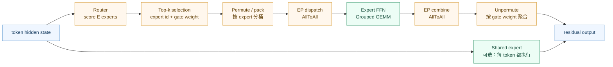
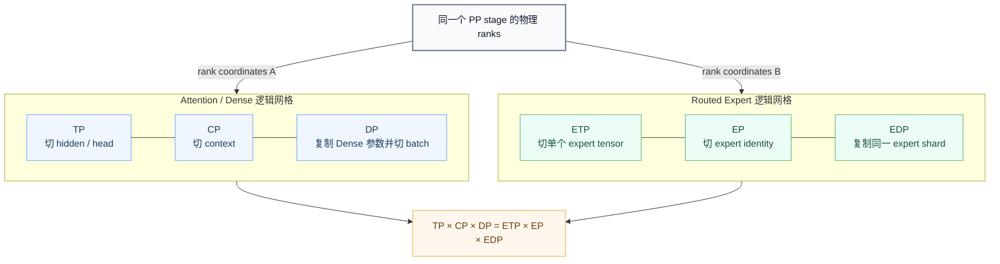

# MoE 与 Parallel Folding：双逻辑网格的工程实现

## 问题框架

MoE 用 sparse activation 扩展总参数量：router 只把每个 token 送给少数 experts，使 activated compute 可控。但它把 Dense Transformer 的规则 GEMM/collective，变成了动态 token routing、AllToAll、expert load balance 和小 GEMM 问题。

当模型同时包含 Attention 和 routed experts 时，还有一个更隐蔽的冲突：

- Attention 的大 QKV/投影矩阵可能需要较高 TP，长上下文需要 CP；
- expert GEMM 通常比 Dense MLP 小，过高 ETP 会继续碎片化 GEMM，而更高 EP 有利于分散 experts；
- 因此同一套 `TP/CP/DP` rank layout 往往无法同时让 Attention 和 Expert 都高效。

Parallel Folding 的核心就是：**同一批物理 GPU，在同一个 PP stage 内，为 Attention 和 Expert 建立两套不同的逻辑并行网格。**

<a id="dense-vs-moe"></a>
## Dense 与 MoE：先把 expert 账算清楚

### 1. 一句话与动机

Dense Transformer 的每个 token 都经过同一套 FFN 参数；MoE 把部分 FFN 替换为多个 experts，由 router 为每个 token 只激活少数 experts。它的目标是让**总参数容量**增长得比**每 token 激活计算量**更快，代价是引入动态路由、负载不均、token dispatch/combine 和小 GEMM。

因此不能只说“MoE 参数更多但计算不变”。更准确的说法是：在其他配置相近时，MoE 的 activated parameters/FLOPs 主要由 `top-k` 决定，总参数、权重显存和 checkpoint 主要由总专家数 `E` 决定；router、通信、padding、shared expert 和实现细节仍会增加额外成本。

### 2. 一个 token 如何经过 MoE layer



运行时要守住四个映射：token 到 expert ID、expert ID 到 EP rank、dispatch 后的位置到原 token、多个 expert 输出到 gate 权重。任一处错位都可能“loss 不 NaN 但训练语义已经错了”。

### 3. 面试时必须分开的四个量

| 配置量 | 含义 | 主要影响 |
|---|---|---|
| 总专家数 `E` | 一层可路由 experts 的总数 | 总参数量、checkpoint、EP 放置空间 |
| `top-k` | 每个 token 激活的 routed experts 数 | activated compute、dispatch 流量、组合语义 |
| expert FFN intermediate size | 单个 expert 的宽度 | 单 expert 参数量与 GEMM shape；决定“专家大不大” |
| shared expert 数量/宽度 | 所有 token 都执行的公共 FFN | 稳定通用能力，但增加 dense compute 与显存 |

“有 64 个 experts”回答不了“是大专家还是小专家”：必须同时给 expert intermediate size，并与 Dense FFN intermediate size 比较。所谓 fine-grained/small experts，通常是把一个较宽 FFN 切成更多较窄 experts，再提高 `E`、选择合适 `top-k`；好处是路由组合更细，风险是单 expert token/GEMM 变小、launch 与 AllToAll 相对开销上升。

shared expert 不参与 top-k 竞争，通常每个 token 都执行；它可以承载公共知识、缓解 routed experts 过度专门化，但会把一部分稀疏层重新变成固定 dense 计算。不同实现可能把 shared experts 融合、重叠或单独并行，不能只凭模型名推断。

做量级估算时，设单 expert 参数量为 `P_expert`，shared expert 总参数为 `P_shared`，则一层 routed FFN 的总参数约为 `E × P_expert + P_shared`，单 token 激活参数约为 `top-k × P_expert + P_shared`，另加 router。标准两矩阵 FFN 的 `P_expert≈2hf`，SwiGLU 三矩阵通常约 `3hf`；是否有 bias、gating projection、shared expert 融合会改变精确值。这个账本能解释为什么 `E` 增加主要扩大总参数/权重显存，而 `top-k` 和 expert 宽度更直接决定每 token compute。

### 4. Router、容量与负载均衡

典型 router 对 hidden state 做线性投影，得到 `E` 个 logits，经过 softmax/sigmoid 等得到 routing score，再取 top-k。工程上要确认：

- score/selection 是否有 group-limited、top-k before/after normalization 等约束；
- auxiliary loss、aux-loss-free bias 或其他 load-balance 机制如何更新；
- capacity factor、dropless、token drop/padding 的具体语义；
- gate probability 是否参与 combine，训练/推理是否一致；
- routing dtype、determinism 和 checkpoint 恢复后 expert identity 是否稳定。

负载不均不是只看平均 tokens/expert。需要看 per-expert、per-rank 和 per-peer 的 p50/p95/p99；一个 hot expert 就能让某个 rank 的 Grouped GEMM、buffer 与 AllToAll 成为全局 straggler。

### 5. Dense 与 MoE 的系统账本

| 维度 | Dense FFN | MoE FFN |
|---|---|---|
| 参数/显存 | 每层一套 FFN，规则分片 | `E` 套 routed expert + 可选 shared expert；总权重和 checkpoint 更大 |
| 每 token 计算 | 所有 token 执行同一 FFN | 仅执行 top-k routed experts + shared expert |
| 计算形态 | 大而规则的 GEMM | token 数动态的小/不均衡 GEMM，常用 Grouped GEMM |
| 通信 | TP/DP 等规则 collective | 额外 permute、EP AllToAll、combine；对拓扑与 imbalance 敏感 |
| 正确性 | 主要是张量分片和数值对齐 | 再加 router、token mapping、drop/padding、expert identity |
| 扩展瓶颈 | Dense GEMM、activation、TP/DP communication | 三者之外还有 load balance、AllToAll、expert GEMM efficiency |

### 6. 配置与排障顺序

配置时先固定模型语义：`E / top-k / expert intermediate size / shared expert / routing balance / capacity-or-dropless`；再决定 Attention 的 `TP×CP×DP` 与 Expert 的 `ETP×EP×EDP`；最后用真实 token distribution profile，而不是只跑均匀 synthetic input。

排障建议按下面顺序：

1. **正确性**：tiny deterministic batch 对齐 router logits、top-k ID/weight、permute/inverse permutation、expert output 与 combine；
2. **负载**：看每 expert/rank 收到的 token 数和 dropped/padded token；
3. **计算**：看 Grouped GEMM 的 M/N/K、occupancy、launch 数和 ETP 是否切得过碎；
4. **通信**：看 dispatch/combine AllToAll 的 per-peer bytes、p99 与跨节点映射；
5. **显存**：区分 expert weights、dispatcher buffers、capacity padding、shared expert 和 optimizer state；
6. **端到端**：确认优化后瓶颈是否迁移，并用相同 effective tokens、loss 和稳定窗口验收。

面试项目口径：可以讲 X1 200B MoE 模型的功能打通、并行/Grouped GEMM/融合/overlap 与规模交付；没有核验的 `E / top-k / expert intermediate size / shared expert` 必须留在证据卡，不从相似模型猜。

<a id="parallel-folding"></a>
## Parallel Folding：双逻辑网格

### 1. 一句话解释 Parallel Folding

> Parallel Folding 不是再增加一维 GPU，而是复用同一 rank pool，把 Attention 映射为 `TP×CP×DP`，把 routed experts 映射为 `ETP×EP×EDP`，让 Dense 和 Sparse 子图分别选择最适合的切分。

每个 PP stage 内满足：

```text
TP × CP × DP = ETP × EP × EDP = ranks_per_pipeline_stage
```

完整作业满足：

```text
world_size = PP × TP × CP × DP
           = PP × ETP × EP × EDP
```

左右两边描述的是**同一批物理 ranks 的两种坐标系**，不能把两套网格再相乘。

### 2. 为什么传统布局不够灵活

传统 nested MoE layout 常令 `ETP=TP`，并在 Attention 的 `CP×DP` rank pool 中构造 EP。按当前 Megatron 的 Expert Data Parallel 定义：

```text
CP × DP = EP × EDP
world_size = TP × CP × PP × DP
           = TP × PP × EP × EDP       # when ETP = TP
```

也就是 `EDP = CP×DP/EP`。只有 `CP=1`，或某份 legacy 文档把“expert-DP”另行定义为不含 CP 的子维度时，才会看到简写 `DP=EP×EDP`；使用该简写必须先声明定义。传统布局还隐含 Attention TP 与 Expert TP 相同，并限制 EP 的扩展范围。若 Attention 需要 TP=4、CP=2，而 expert 最优是 ETP=1、EP=64，强迫二者共享相同 TP 会让 expert GEMM 过碎，或需要更多 GPU 才能构造目标 EP。

Parallel Folding 解除的正是这层绑定。

### 3. 双逻辑网格



这里的“折叠”可以理解为：把原本可能被画成多个正交轴的逻辑关系，折叠到同一个物理 rank pool 上；不同子图执行时，框架通过不同 process groups 解释同一个 global rank。

### 4. 两个必须会算的例子

#### 8 GPU 概念例

单个 PP stage 有 8 个 ranks：

```text
Attention: TP=2 × CP=2 × DP=2 = 8
Expert:   ETP=1 × EP=8 × EDP=1 = 8
```

解释：Attention 使用两路 TP、两路 CP 和两个数据副本；进入 routed expert 子图后，同一批 8 ranks 被重新解释为 8-way EP，每个 expert 不再继续做 tensor parallel。两边都使用 8 张卡，不是 8×8=64 张。

如果再取 `PP=2`：

```text
world_size = 8 ranks/stage × 2 stages = 16
```

#### NVIDIA 256 GPU 配置例

NVIDIA Megatron Core MoE 材料给出的配置为：

```text
Attention: TP=4 × CP=2 × DP=8 × PP=4 = 256
Expert:   ETP=1 × EP=64 × EDP=1 × PP=4 = 256
```

每个 PP stage 内：

```text
4 × 2 × 8 = 1 × 64 × 1 = 64 ranks
```

这个例子最能说明 Parallel Folding 的价值：Attention 保留 TP=4、CP=2；expert 不被迫使用 ETP=4，而是把 64 ranks 用于 EP，恢复更大的 expert GEMM。

### 5. Process group 如何理解

用坐标描述比背 group 名更可靠。固定 PP stage 后：

| group | 固定坐标 | 变化坐标 | 作用 |
| --- | --- | --- | --- |
| TP group | PP、CP、DP | TP | Dense Linear/Attention tensor collective |
| CP group | PP、TP、DP | CP | Attention KV exchange |
| pure DP group | PP、TP、CP | DP | 不同数据副本 |
| Dense `dp_cp` group | PP、TP | DP、CP | Dense gradient reduction / optimizer sharding 的常见 domain |
| ETP group | PP、EP、EDP | ETP | 单个 expert 内 tensor parallel |
| EP group | PP、ETP、EDP | EP | token dispatch/combine，持有不同 experts |
| EDP group | PP、ETP、EP | EDP | 同一 expert shard 的副本梯度同步 |

实际 group 构造、命名和 optimizer instances 随 Megatron Core 版本与配置变化。工程判断应回到两个不变量：

1. 哪些 ranks 持有同一个逻辑参数 shard；
2. 哪些 ranks 对这个 shard 产生了需要合并的梯度。

`ProcessGroupCollection` 的价值是把这些 group 显式传给模块，而不是让所有子模块假设只有一套全局 TP/DP group。

### 6. 一个 MoE block 的运行时数据流


关键边界：

- “Expert mesh”只描述 routed expert 子图，不代表整个 MoE layer 都运行在 ETP/EP/EDP 上；
- router、shared expert、residual、LayerNorm 等模块的参数归属和梯度域要按实际实现确认；
- 从 Attention mesh 进入 Expert mesh 并不是把 activation 复制到另一组 GPU，而是在相同 ranks 上改变布局和通信 group；
- token 数动态变化时，dispatcher 还需要处理 split metadata、padding/dropless 策略和 inverse mapping。

### 7. 为什么它可能更快

Parallel Folding 本身不减少模型 FLOPs，收益来自恢复每个子图的合理计算/通信形态：

1. **Attention 保留所需 TP/CP**：大 Dense GEMM 和长上下文仍能按合适粒度扩展；
2. **expert 降低 ETP**：避免把本已较小的 expert GEMM继续切碎；
3. **expert 扩大 EP**：更多 experts 分布在同一个 stage 的 rank pool；
4. **减少 GPU 乘法膨胀**：两套 logical mesh 复用同一物理 ranks；
5. **独立优化通信**：TP/CP 与 EP 可以按不同 process group、dispatcher 和 topology 调优。

收益是否成立取决于 token per expert、Grouped GEMM shape、AllToAll、layout transition 和负载均衡。若 expert token 很少或网络很慢，扩大 EP 也可能变慢。

### 8. 拓扑选择

#### Attention mesh

TP 通信高频，通常优先节点内；CP 也可能需要大量 KV traffic，`TP×CP` 能放入 NVSwitch 域时往往更简单。跨节点 CP 可考虑 hierarchical strategy，但要结合 sequence length、GQA/MQA 和 overlap。

#### Expert mesh

EP 的最优放置没有“一律单机”答案：

- 节点内 EP 带宽高，但受每节点 GPU 数限制；
- 跨节点 EP 能容纳更多 experts，却受到 NIC、交换机和 per-peer imbalance 影响；
- expert placement 应让高流量路径靠近，并结合 DeepEP/HybridEP 等 dispatcher 的实际版本和硬件支持；
- EDP 的梯度规约频率与 EP dispatch 不同，可以使用不同拓扑层级。

最终目标不是“跨节点通信最少”，而是让 **exposed communication + straggler + GEMM inefficiency** 的总和最小。

### 9. 配置检查顺序

#### 数学正确

- `world_size % PP == 0`；
- 每 stage 的 `TP×CP×DP` 与 `ETP×EP×EDP` 相等；
- hidden、heads、experts、layers 满足实际 kernel/layout 的 divisibility 或 custom layout；
- optimizer sharding group 与参数 replica domain 一致。

#### 数据布局正确

- router 产出的 expert ID 与 EP rank mapping 一致；
- dispatch/combine 的 token index、probability 和 inverse permutation 对齐；
- variable split 的每对 peer send/recv count 匹配；
- checkpoint 保存 global expert identity，而不是把 expert 永久绑定旧 rank。

#### 性能有效

- 分别记录 Attention GEMM、TP/CP communication；
- 分别记录 permute、dispatch/combine AllToAll、Grouped GEMM；
- 看 per-expert tokens、rank send/recv count 和 p95/p99；
- 检查 overlap 后是否因 SM、HBM 或 NIC 争用拖慢 foreground GEMM；
- 用相同 effective tokens、loss 和稳定窗口比较配置。

### 10. 常见失效模式与排障

| 现象 | 优先怀疑 | 验证方法 |
| --- | --- | --- |
| 配置能整除但启动时报 group/shape 错 | 两套 rank coordinates 或参数 group 构造错误 | dump global rank 到所有 logical coordinates/group members |
| expert GEMM 仍很小 | ETP 过高、token per expert 太少、负载不均 | profile GEMM shape 和 per-expert tokens |
| AllToAll p99 很高 | hot expert、跨节点路径、split imbalance | per-peer count、NIC counter、expert load histogram |
| 某些 rank OOM | hottest expert、dispatcher buffer、shared expert、uneven PP | rank-level memory snapshot 与 token load |
| loss 异常但不报错 | token inverse mapping、combine weights、dropped token/mask | tiny deterministic batch、single/multi-rank 对照 |
| checkpoint 换并行度失败 | expert identity/shard metadata 绑定旧 rank | global tensor metadata、expert reshuffle dry-run |
| 开 overlap 后反而变慢 | comm/compute 抢 SM、HBM 或 NIC | timeline 对比 exposed time 与 GEMM duration |

### 11. 面试怎么回答

推荐 3 分钟结构：

1. 先说 Dense-Sparse mismatch；
2. 写出 `TP×CP×DP=ETP×EP×EDP`；
3. 强调同一批 ranks、两套 logical mesh，不能相乘；
4. 用 8 GPU 或 256 GPU 例子；
5. 补充 process group、AllToAll、Grouped GEMM 和 topology；
6. 以“数学成立后仍需 profile 正确性与性能”收尾。

常见错误：

- 把 `SP` 当第六个 world-size 维度；
- 无条件写 `world_size=TP×PP×CP×EP×DP`；
- 把 ETP 默认等于 Attention TP；
- 把两套 mesh 相乘；
- 认为整个 MoE block 都在 expert mesh；
- 只讲公式，不讲 token 数据流和通信。

### 12. 相关材料

- [GShard](../papers/gshard.md)
- [Switch Transformer](../papers/switch_transformer.md)
- [DeepSpeed-MoE](../papers/deepspeed_moe.md)
- [Mixtral](../tech_reports/mixtral.md)
- [DeepSeek-V3](../tech_reports/deepseek_v3.md)
- [Megatron 5D 并行总览](distributed_training.md)
- [Sequence Parallelism](sequence_parallelism.md)
- [Context Parallelism](context_parallelism.md)
- [NCCL 与通信算子](nccl.md)
- [MoE / 5D 高频面试题](../interview/moe.md)
- [Megatron Core MoE 2026 中文翻译入口](../README.md#megatron-core-moe-2026-zh-pdf)

## 参考资料

- [Scalable Training of Mixture-of-Experts Models with Megatron Core](https://arxiv.org/abs/2603.07685)
- [MoE Parallel Folding](https://arxiv.org/abs/2504.14960)
- [Megatron Core MoE User Guide](https://docs.nvidia.com/megatron-core/developer-guide/latest/user-guide/features/moe.html)
- [Megatron Core MoE README](https://github.com/NVIDIA/Megatron-LM/blob/main/megatron/core/transformer/moe/README.md)
